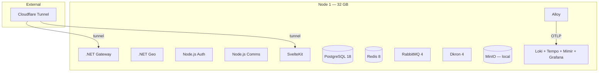

<!--
Copyright (c) DCSV. All rights reserved.
-->

# D²-WORX Internal Planning Document

> **Purpose**: Internal planning, architecture decisions, and status tracking for D²-WORX development.
> This document is for development reference and should not be considered user-facing documentation.

---

## Table of Contents

1. [Roadmap](#roadmap)
   - [Phase 2: Auth Service + SvelteKit Integration](#phase-2-auth-service--sveltekit-integration)
   - [Phase 3: Auth Features (Future)](#phase-3-auth-features-future)
2. [Issues](#issues)
   - [Open — Can Fix Now](#open--can-fix-now)
   - [Open Questions](#open-questions)
   - [Deferred Upgrades](#deferred-upgrades)
   - [Blocked — Can Only Fix Later](#blocked--can-only-fix-later)
3. [Work in Progress](#work-in-progress)
4. [Implementation Status](#implementation-status)
   - [Infrastructure](#infrastructure)
   - [Shared Packages (.NET)](#shared-packages-net)
   - [Shared Packages (Node.js)](#shared-packages-nodejs)
   - [Services](#services)
   - [Gateways](#gateways)
   - [Frontends](#frontends)
5. [Architecture Decisions](#architecture-decisions)
   - [ADR-001: Authentication Architecture](#adr-001-authentication-architecture)
   - [ADR-002: Rate Limiting Strategy](#adr-002-rate-limiting-strategy)
   - [ADR-003: Geo Data Caching Strategy](#adr-003-geo-data-caching-strategy)
   - [ADR-004: Fingerprinting Approach](#adr-004-fingerprinting-approach)
   - [ADR-005: Request Flow Pattern (Hybrid BFF + Direct Gateway)](#adr-005-request-flow-pattern-hybrid-bff--direct-gateway)
   - [ADR-006: Retry & Resilience Pattern](#adr-006-retry--resilience-pattern)
   - [ADR-007: Idempotency Middleware](#adr-007-idempotency-middleware)
   - [ADR-008: Sign-Up Flow & Cross-Service Ordering](#adr-008-sign-up-flow--cross-service-ordering)
   - [ADR-009: Drizzle ORM for Auth Database](#adr-009-drizzle-orm-for-auth-database-replacing-kysely)
   - [ADR-010: Reserved](#adr-010-reserved)
   - [ADR-011: Lightweight DI Container (`@d2/di`)](#adr-011-lightweight-di-container-d2di)
   - [ADR-012: Service-to-Service Trust (S2S)](#adr-012-service-to-service-trust-s2s)
   - [ADR-013: Scheduled Jobs (Dkron)](#adr-013-scheduled-jobs-dkron)
   - [ADR-014: Comms Delivery Engine](#adr-014-comms-delivery-engine)
   - [ADR-015: SvelteKit Strategy](#adr-015-sveltekit-strategy)
   - [ADR-016: Environment Variable Architecture](#adr-016-environment-variable-architecture)
   - [ADR-017: Auth BFF Client Pattern](#adr-017-auth-bff-client-pattern)
   - [ADR-018: Dependency Update Policy](#adr-018-dependency-update-policy)
   - [ADR-019: Three-Tier Playwright Test Architecture](#adr-019-three-tier-playwright-test-architecture)
   - [ADR-020: D2_MOCK_INFRA Infrastructure Stubbing](#adr-020-d2_mock_infra-infrastructure-stubbing)
   - [ADR-021: Grafana Faro Client Telemetry](#adr-021-grafana-faro-client-telemetry)
   - [ADR-022: Design System-First Development](#adr-022-design-system-first-development)
   - [ADR-023: Gateway-Edge i18n Translation](#adr-023-gateway-edge-i18n-translation)
   - [ADR-024: Production Topology (1-Node → 3-Node)](#adr-024-production-topology-1-node--3-node)
   - [ADR-025: Replace .NET Aspire with Docker Compose / Swarm](#adr-025-replace-net-aspire-with-docker-compose--swarm)
   - [ADR-026: File Service Architecture](#adr-026-file-service-architecture)
   - [ADR-027: Node.js JWT Validation Middleware](#adr-027-nodejs-jwt-validation-middleware)
   - [ADR-028: SignalR Real-Time Gateway](#adr-028-signalr-real-time-gateway)
6. [Production Deployment Checklist](#production-deployment-checklist)

---

## Roadmap

### Completed Milestones

- **Phase 1: TypeScript Shared Infrastructure** ✅ — 24 shared `@d2/*` packages mirroring .NET (result, handler, DI, caching, messaging, middleware, batch-pg, errors-pg, i18n, auth/CSRF/translation middleware)
- **Phase 2 Stage A: Cross-cutting foundations** ✅ — Retry utility, idempotency middleware, UUIDv7
- **Phase 2 Stage B: Auth Service DDD layers** ✅ — domain, app, infra, api (~1,000 tests, expanding with OTP/SAGA work)
- **Comms Service Stage A** ✅ — Delivery engine, email + SMS providers, `@d2/comms-client` (~600 tests, expanding with user-channel-pref work)
- **E2E Cross-Service Tests** ✅ — 31 tests (22 API-level + 9 browser E2E: Auth → Geo → Comms delivery pipeline + Dkron job chain + BFF client integration)
- **Cross-platform Parity** ✅ — `@d2/batch-pg`, `@d2/errors-pg`, .NET `Errors.Pg`, documented in `backends/PARITY.md`
- **.NET Gateway** ✅ — JWT auth, request enrichment, rate limiting, CORS, service key middleware, translation middleware
- **Geo Service** ✅ — Complete (.NET), 795 tests
- **Production-readiness Sweep** ✅ — 40 items triaged, all high/medium fixed, polish items done
- **Scheduled Jobs (Dkron)** ✅ — 9 daily maintenance jobs (Auth 5 incl. cleanup-deleted-users, Geo 2, Comms 2), `@d2/dkron-mgr` reconciler (64 tests), full-chain E2E tested
- **SvelteKit Web Client Steps 0–9** ✅ — Design system, routing, auth BFF, gateway client, forms, auth pages, fingerprinting, Faro telemetry, three-tier Playwright tests (706 tests: 551 Vitest + 146 mocked Playwright + 9 browser E2E)
- **Q1 2026 Dependency Update** ✅ — .NET 10.0.103, Node 24.14, pnpm 10.30, auth health gRPC migration (#43)
- **i18n & BCP 47 Locale Migration** ✅ — 10 BCP 47 locales (en-US, en-CA, en-GB, fr-FR, fr-CA, es-ES, es-MX, de-DE, it-IT, ja-JP) replacing 5 bare language codes. D2.Shared.I18n + @d2/i18n packages, gateway-edge translation middleware, Contact.IETFBCP47Tag field, auth middleware extraction to shared packages
- **Auth middleware split** ✅ — .NET `Auth.Default` split into `JwtAuth.Default` + `ServiceKey.Default` + `AuthPolicy.Default` siblings. Node.js parity: `@d2/jwt-auth` (relocated to `shared/implementations/middleware/jwt-auth/default/`), `@d2/auth-policy` (new). Added `RoutePolicyExtensions` (`.RequireAuth()`, `.RequireOrg()`, etc.) on .NET. New E2E `auth-policy-enforcement.test.ts`. `Role`/`ROLE_HIERARCHY`/`isValidRole`/`rolesAtOrAbove` moved from `@d2/auth-domain` to `@d2/handler` (auth-domain re-exports for back-compat). Deleted `AuthenticatedUserId` parameter binder
- **Email & Phone change with OTP + SAGA** ✅ — 5 new auth handlers (`RequestEmailChange`, `VerifyEmailChange`, `RequestPhoneChange`, `VerifyPhoneChange`, `RemovePhone`), OTP rate limiter, BetterAuth `phone` + `phoneVerified` user fields, `runCrossServiceUpdate` SAGA helper (Geo-first → Auth-second → compensate Geo on auth failure → fatal log if rollback fails), comms `alternativeContactInfo` for delivery to non-contact addresses
- **User-centric notification preferences** ✅ — Comms gRPC `GetUserChannelPreference`/`SetUserChannelPreference` RPCs. REST gateway exposes `/api/v1/notification-preferences`
- **Per-service gateway endpoint files** ✅ — Gateway endpoint mapping split into per-service files (`AuthEndpoints.cs`, `CommsEndpoints.cs`, `FilesEndpoints.cs`, `SignalREndpoints.cs`)
- **Cross-process cache invalidation** ✅ — Geo client consumers auto-wired (.NET `AddGeoRefDataConsumer`, Node `wireGeoClientConsumers()`)
- **W3C Trace Context CORS** ✅ — `traceparent` + `tracestate` allowed on REST gateway, SignalR gateway, Files API, Auth API
- **Timezone hydration** ✅ — `D2_TIMEZONE` cookie + sign-up hydration, Geo Contact `IANAIdentifier` field, profile-dropdown timezone selector
- **Shared tests** — ~1,250+ passing (counts grow per-feature; see Services table)

### Phase 2: Auth Service + SvelteKit Integration

**Stage B.5 — Scheduled Jobs (Dkron) ✅** — See [ADR-013](#adr-013-scheduled-jobs-dkron).

**Dependency Update — Q1 2026 ✅** — Completed. See [ADR-018](#adr-018-dependency-update-policy).

**SvelteKit App Foundations ✅** — Route groups, layouts, sidebar, shadcn-svelte, design system, server middleware (enrichment + rate limiting + idempotency), auth BFF proxy, API gateway client. See [WIP](#work-in-progress) for step-by-step progress.

**Stage C — Auth Client Libraries (In Progress)**

- **@d2/auth-bff-client** ✅ — BFF client for SvelteKit (ADR-017). SessionResolver, JwtManager, AuthProxy, route guards. 42 unit + 10 E2E tests.
- **@d2/auth-client** — Backend gRPC client for other Node.js services (mirrors `@d2/geo-client` pattern). Planned.
- **.NET Auth.Client** — JWT validation via JWKS + `AddJwtBearer()`, gRPC client. Planned.

**Stage D — Auth Integration + Comms Con't**

- ~~**Forms architecture**~~ ✅ — Superforms + Formsnap, Zod 4, field presets, D2Result error mapping (73 tests)
- ~~**Auth pages**~~ ✅ — Sign-in, sign-up, forgot/reset password, email verification. i18n (10 BCP 47 locales)
- ~~**Device fingerprinting**~~ ✅ — Cross-cutting: SvelteKit + Node.js + .NET. `d2-cfp` cookie, DeviceFingerprint dimension
- ~~**Client telemetry**~~ ✅ — Grafana Faro (errors → Loki, traces → Tempo, Web Vitals → Mimir). Alloy `faro.receiver`, Web Vitals RUM dashboard
- **Onboarding** — Post-verification: accept pending invitation(s) or create `customer` org
- **Session management** — Org switching, active session list, sign-out
- **App shell finalization** — Org-type nav, org switcher, emulation banner, breadcrumbs
- **SignalR integration** — Browser → .NET gateway direct (`@microsoft/signalr`)
- **Comms Stage B** — In-app notifications, push via SignalR

Auth service architecture documented in [`AUTH.md`](backends/node/services/auth/AUTH.md).

### Phase 3: Auth Features (Future)

1. **Session management UI** (list sessions, revoke individual, revoke all others)
2. **Org emulation** (support/admin can view any org's data in read-only mode)
3. **User impersonation** (escalated support — act as a specific user, audit-logged, time-limited)
4. **Admin control panel** (cross-org visibility, user/org management, system diagnostics)
5. **Admin alerting** (rate limit threshold alerts via Comms service)
6. **Comms expansion** — In-app notifications, push via SignalR, conversational messaging (Comms Stages B-D)

---

## Issues

[↑ back to top](#table-of-contents)

### Open — Can Fix Now

| #   | Item                                   | Owner | Effort | Notes                                                                                                                                                                                                                                                                                                                                                                                          |
| --- | -------------------------------------- | ----- | ------ | ---------------------------------------------------------------------------------------------------------------------------------------------------------------------------------------------------------------------------------------------------------------------------------------------------------------------------------------------------------------------------------------------- |
| 40  | OTel alerting rules                    | All   | Medium | Grafana is running — no longer blocked. Define Grafana alert rules + alerting channel config. Targets: error rate >5% 5xx over 5min, latency P99 >2s, rate limit blocks per dimension, delivery failures, gRPC failure rate, service unavailability (RabbitMQ down, Redis down). Requires alert rule YAML + notification channel setup.                                                        |
| 44  | `GetStorageObject` buffers entire file | Files | Medium | Download proxy and processing pipeline load full file into a `Buffer`. Safe at current max (25MB org_document). Risk: OOM if large context keys (video, archives) are added. Fix: add `StreamStorageObject` handler for download proxy, keep buffer-based handler for processing pipeline (Sharp/ClamAV need full buffer). Revisit before adding context keys >25MB.                           |
| 80  | Presigned URL expiry hardcoded 15 min  | Files | Info   | `DEFAULT_EXPIRY_SECONDS = 900` not configurable via options pattern. Code change required to adjust. `presign-put-url.ts:11`                                                                                                                                                                                                                                                                   |
| 81  | Email unsubscribe URL not wired        | Comms | Medium | `{{unsubscribeUrl}}` placeholder in email template always receives `""`. Needs: unsubscribe endpoint, per-recipient token generation, URL construction. `channel-dispatchers.ts:120`                                                                                                                                                                                                           |
| 82  | Production SMS via Twilio (10DLC/TFN)  | Comms | Large  | Currently `COMMS_SMS_PROVIDER=mock` writes to JSONL log. US carriers block all unverified A2P long-code SMS since Jan 2024. Switch options: (a) Toll-Free Verification (~2-5 wk approval, free), (b) 10DLC Sole Proprietor registration (~1 wk, ~$2-4/mo), (c) Twilio Verify API for OTP-only. Pick + run process before public launch. Set `COMMS_SMS_PROVIDER=twilio` once carrier-approved. |
| 83  | `auth.user-anonymize` Geo consumer     | Geo   | Medium | Self-service user deletion publishes `auth.user-anonymize` after the 30-day grace period. Geo must consume + anonymize the user's Geo Contact (scrub PII, retain ID for FK integrity).                                                                                                                                                                                                         |
| 84  | `auth.user-anonymize` Comms consumer   | Comms | Medium | Comms must consume `auth.user-anonymize` and scrub thread participant rows + delivery history references for the anonymized userId.                                                                                                                                                                                                                                                            |
| 85  | `auth.user-anonymize` Files consumer   | Files | Medium | Files must consume `auth.user-anonymize` and anonymize file ownership refs + scrub `displayName` for files owned by the anonymized userId.                                                                                                                                                                                                                                                     |
| 86  | Email-confirmed org-deletion flow      | Auth  | Medium | Sole-org-owner deletes are blocked today (must transfer ownership first). The unblock path is an email-confirmed org-deletion flow. Tracked alongside the user-deletion follow-ups.                                                                                                                                                                                                            |
| 87  | Native-speaker review of deletion i18n | All   | Small  | New keys (`account_delete_*`, `auth_email_user_deletion_*`, `auth_errors_ACCOUNT_DELETED`, `auth_errors_SOLE_OWNER_OF_ORGS`) need native-speaker review across all 10 locales. Initial drafts auto-translated.                                                                                                                                                                                 |
| 88  | Admin UI wrapping BetterAuth admin plugin | Auth + Web | Medium | BetterAuth admin plugin is wired (ban, list-users, force sign-out, impersonation control), but no UI surface exists. Currently admin work goes through `/api/auth/admin/*` directly. Build a SvelteKit `(admin)/` route group with user search, ban toggle, force sign-out, and impersonation grant flow. Gates on `requireAdmin()` from `@d2/auth-bff-client`.                              |
| 89  | Comms `CanAccess` for `thread_attachment` (B6 follow-up) | Comms | Medium | `thread_attachment` contextKey is configured with `LIST_RESOLUTION=callback`, but Comms has no `CanAccess` gRPC handler — listing currently fails closed (accidentally correct since threads are pre-Stage-A). Wire up Comms `FileCallbackService.CanAccess` once Stage B threads ship: confirm the requesting user is a thread participant for `action=list`, owner-or-participant for read. |
| 90  | ProcessFile lock TTL vs pipeline runtime | Files | Small | `ProcessFile` holds a per-fileId distributed lock with a 10-min TTL (`_PROCESS_LOCK_TTL_MS`). Default works for typical avatars but a worst-case pipeline (large video + ClamAV + multi-variant Sharp) could exceed it. Belt-and-suspenders CAS prevents data corruption (stale lock holder gets fenced) but the slow worker silently abandons its work. Options: per-contextKey TTL via config, periodic lock renewal during long phases, or explicit progress checkpoints. Revisit when video uploads ship.                                  |
| 91  | Pending-upload table for Auth callback verification (B5) | Auth + Files | Medium | `HandleFileProcessed` in Auth currently trusts the gRPC `relatedEntityId` payload (gated by service-key auth + Files's upload-time `resolveAccess`). Defense-in-depth alternative: Auth records "user X opened the avatar dialog for file Y" when the upload URL is issued; the callback then verifies `fileId ∈ user's expected list`. New table + cleanup of stale pending entries. Deferred until/unless we see a real incident — current trust chain is reasonable.                                                                       |

### Open Questions

- **Emulation/impersonation implementation details**: Authorization model decided (org emulation = read-only no consent, user impersonation = user-level consent, admin bypass). Remaining: should impersonation require 2FA? Should there be a max impersonation duration? How does `emulation_consent` integrate with BetterAuth's `impersonation` plugin hooks?

### Architectural Pivots Under Consideration

These are foundational re-shapings of the system, not incremental tickets. Each one would touch large swaths of the codebase and warrants an ADR + dedicated planning before any code is written. Many of the below were originally framed as separate pivots (P1 single-language, P2 unified gateway, P3 ref-data extraction) but consolidated through extended design discussion in 2026-Q2 into one cohesive target architecture.

The summary below is the **current target**. The original per-pivot framing is preserved further down as "Background — original framing" for historical context.

---

#### Target architecture (Shape A — bundled Edge + thin internal services)

```
PUBLIC INTERNET
       │
       ▼
┌──────────────────────────────────────────────────┐
│ D2.Edge (.NET 10, single public-facing app)      │
│  ├─ YARP routing (HTTP→ internal HTTP)           │
│  ├─ Auth module (sign-in, JWT mint + JWKS,       │
│  │   OAuth callbacks, OTP, password reset,       │
│  │   3-tier session storage, admin endpoints)    │
│  ├─ SignalR hubs (WS termination + push)         │
│  ├─ WhoIs module (in-process IPinfo lookups,     │
│  │   results propagated to backends as headers)  │
│  ├─ Cross-cutting middleware (rate limit,        │
│  │   fingerprint, idempotency, CSRF, CORS)       │
│  └─ Hand-rolled REST↔gRPC translation for now    │
│     (migrate to gRPC JSON Transcoding later)     │
└──────────────────────────────────────────────────┘
       │  (private network, optional mTLS later)
       ▼
┌──────────────────┐    ┌─────────────┐  ┌──────────────┐  ┌──────────────────────┐
│ D2.SvelteKit     │    │ D2.Files    │  │ D2.Dispatch  │  │ Future services       │
│ Node.js,         │    │ .NET, gRPC  │  │ .NET, gRPC + │  │ (Payments, Invoicing, │
│ SSR + load fns + │    │ + HTTP for  │  │ HTTP notify  │  │  Orders, Quotes,      │
│ form actions.    │    │ presigned   │  │ API; pure    │  │  Threads, Notifs…)    │
│ Reads user ctx   │    │ URLs;       │  │ outbound     │  │ Each owns its own     │
│ from Edge        │    │ internal    │  │ email+SMS    │  │ contacts table.       │
│ headers; no JWT  │    │ only.       │  │ delivery +   │  │                       │
│ validation own.  │    │             │  │ prefs gate.  │  │                       │
│ Internal only.   │    │             │  │              │  │                       │
└──────────────────┘    └─────────────┘  └──────────────┘  └──────────────────────┘

Domain split: today's "Comms" service splits into three distinct services
(only Dispatch built initially):
  - D2.Dispatch       — outbound transactional email + SMS (this phase)
  - D2.Threads        — conversational messaging (future, when needed)
  - D2.Notifications  — in-app activity feed (future, when needed)
These are separate domains that share infra (SignalR, RabbitMQ, Redis)
but not domain logic. See "Dispatch" subsection below.
       │                │                       │
       ▼                ▼                       ▼
┌────────────────────────────────────────────────────────┐
│ Postgres │ Redis │ RabbitMQ │ MinIO │ ClamAV          │
└────────────────────────────────────────────────────────┘

SHARED LIBRARIES (compiled into services that need them):
  D2.Shared.GeoReference   — embedded countries / IANA timezones /
                              currencies / locales / regions (no service)
  D2.Shared.Location       — three value objects (see below); shape only
  D2.Shared.Dispatch       — message-shape contract + composer helpers
                              (table builder, escaping primitives) for sending
                              to D2.Dispatch
  D2.Shared.Auth           — claims constants, permission constants,
                              actor-claim helpers, internal-token issuer
  D2.Shared.Contacts       — Contact record shape + ownership scoping
                              + ContactCreated/Updated/Revoked event types
  (existing) D2.Shared.Handler, D2.Shared.Result, etc.
```

**What's gone vs today:**
- ❌ `d2-gateway` (.NET REST facade) — endpoints absorbed into Edge
- ❌ `d2-signalr` (.NET SignalR gateway) — hubs absorbed into Edge
- ❌ `d2-auth` (Node.js + BetterAuth) — replaced by Auth module inside Edge, self-rolled .NET (no framework wrapper)
- ❌ `d2-geo` (.NET Geo service) — reference data → embedded library, WhoIs → Edge module, Contacts → distributed (no service); deleted entirely
- ❌ Per-service rate-limit / fingerprint / JWT / idempotency / CORS middleware (5× duplication today)
- ❌ "Contacts service" as originally envisioned — replaced by per-service contact tables + event-driven local replication

**Net container count change**: today's `gateway + signalr + auth + geo + files + comms + sveltekit + dkron-mgr + assorted infra` → tomorrow's `Edge + files + comms + sveltekit + dkron-mgr + assorted infra`. Three Node/.NET service containers collapse into Edge; Geo deleted. **Net −4** application containers.

---

#### Phasing

Each phase de-risks the next.

| # | Phase | Effort | Why this slot |
|---|-------|--------|---------------|
| 0 | **Geo decomposition** — extract `D2.Shared.GeoReference` library, build `D2.Shared.Location` value objects, replace Geo gRPC calls in Files/Comms/Auth with library references. Don't touch WhoIs yet (stays in Geo until Phase 3). Ship the Contacts library + event shape spec; no consumers wired yet. | ~4 wks | Largely orthogonal. Validates the embedded-library pattern. Establishes the value-object shapes Phase 3 will lean on. Does not delete Geo yet (WhoIs still hosted there). |
| 1 | **Files service → .NET** | ~2-3 wks | Smallest Node→.NET port. Establishes the template (DbContext + handlers + S3 + RabbitMQ + gRPC). Validates the polyglot-collapse pattern works. |
| 2 | **Build D2.Dispatch in .NET** — pure outbound (email + SMS) delivery engine + prefs gate. Replaces today's `Comms` service entirely. Drops contact resolution, drops template management; callers provide markdown + vars (or pre-rendered HTML). Wire subscription to (still-Node) Auth's contact events for prefs lookup. | ~3-4 wks | Today's "Comms" was lumping outbound delivery, future threads, and future notifications under one roof. Splitting them into separate services from the start keeps each domain crisp. |
| 3 | **Build Edge** — YARP routing + self-rolled Auth + SignalR hubs + in-process WhoIs (IPinfo) + all cross-cutting middleware + permission/claims model. Replaces `d2-gateway`, `d2-signalr`, `d2-auth`, deletes Geo. SvelteKit BFF role shrinks to SSR + cookie↔JWT exchange. | ~3-4 mo | The big one. Self-rolled auth is the longest unknown; everything else is mechanical by then. |
| 4 | **Build D2.Threads** *(future, when product priority demands)* | TBD | Conversational messaging. Persistent threads, participants, messages, replies, edits, deletes, mentions, read receipts. Real-time push via Edge's SignalR. Designed in .NET from day one. |
| 5 | **Build D2.Notifications** *(future, when product priority demands)* | TBD | In-app activity feed. Persistent read/unread state, pagination, aggregation. Real-time push via Edge's SignalR. Designed in .NET from day one. |

The original Phase 4/5 split ("rework Node Auth claims first, then port Auth") collapses into Phase 3 because Auth is being rewritten from scratch as a module inside Edge — the new permission/claims model is part of the rewrite, not a separate refactor of the old code. Phases 4 and 5 in the new numbering are the future Threads / Notifications services that were previously implicit in "Comms Stage B."

---

#### Stack decisions

These are stable answers, agreed through extended discussion.

**Auth (inside Edge, self-rolled, primitives only)**
- No framework wrapper. `Microsoft.IdentityModel.Tokens` + `IDataProtectionProvider` + `AuthorizationPolicyBuilder` + `Microsoft.AspNetCore.RateLimiting` + `Antiforgery` + `IHostedService` are framework *primitives*, not framework *flow control*. We compose. No IdentityServer, no OpenIddict-as-framework, no ASP.NET Identity-as-framework.
- Password hashing: `Konscious.Security.Cryptography` (Argon2id), tuned to 400-800ms per hash.
- Sessions: 3-tier (cookie cache 5min compact → Redis → Postgres), `IDataProtectionProvider` for cookie signing, dual-write pattern.
- OAuth: hand-rolled `HttpClient` flows for each provider (Google to start), no `AddGoogle()`-style wrappers.
- OTP: `RandomNumberGenerator` + Redis store with TTL + max-attempt counter.
- CSRF: built-in `Antiforgery` middleware (double-submit cookie under the hood).
- JWT issuance: RS256, 15-min external tokens, JWKS exposed at `/.well-known/jwks.json` for any future external validators.

**Gateway (YARP inside Edge)**
- YARP for routing — native WebSocket + gRPC pass-through, `PartitionedRateLimiter.CreateChained()` for multi-dimensional rate limit, hot-reload config, custom `ITransformFactory` for per-route shaping.
- YARP does HTTP→HTTP only (incl. WS upgrade + gRPC pass-through). It does NOT translate REST↔gRPC. Short-term: hand-rolled translation lives inside Edge alongside YARP routing (today's `d2-gateway` endpoint pattern, just sitting in the Edge process). Long-term: `Microsoft.AspNetCore.Grpc.JsonTranscoding` on each backend (auto-exposes HTTP from `[google.api.http]` proto annotations) and YARP just routes HTTP. Migrate per service when convenient.
- MinIO presigned URLs stay client-direct. Don't proxy file bytes through Edge — saturates the gateway. Rate limit at the request layer (presigned-URL issuance), not the byte layer.
- **YARP IS the load balancer for backends.** Multiple destinations per cluster, configurable LB policy (round-robin, least-connections, power-of-two-choices, custom `ILoadBalancingPolicy`), active health checks against each backend's `/health`, automatic removal of unhealthy destinations, retry-against-another-instance on failed-destination. There is no separate "internal LB" — Edge IS it for everything inside the perimeter (SvelteKit, Files, Dispatch, future services).
- **SvelteKit is one of the backends YARP load-balances.** SvelteKit sits behind Edge on the private network (not publicly accessible). Browser → Edge → SvelteKit. Edge handles all auth / JWT / cookie / enrichment; SvelteKit reads user context from headers Edge propagates. See "SvelteKit auth posture (behind Edge)" below.

**Production topology (single instance vs HA)**

Early production — single Edge instance, no front LB:
```
Browser → Cloudflare (DNS, TLS, WAF, geo) → Edge → backends
```
Acceptable for early phases. Single point of failure on the Edge process itself.

HA — multiple Edge instances behind a Layer 7 LB:
```
Browser → Cloudflare (or other L7 LB) → Edge-1, Edge-2, Edge-3 → backends
                  ↑
       L7 because Edge is stateful via WS (long-lived
       SignalR connections per-instance). L7 also gives:
       sticky-on-WS reconnection, TLS termination at LB,
       HTTP/2 negotiation, path-based routing.
```
Cloudflare is the natural fit since we already use it for DNS + tunnels. WS connections still need the Redis backplane for cross-instance push regardless of LB stickiness — backplane handles "service X pushed to user Y, find which Edge has Y's WS and deliver." Sticky reconnection just makes connection-state recovery cheaper, not load-bearing for correctness.

**Internal service-to-service** *(open — see open decisions)*
- The general direction is short-lived (~5-min) internal JWTs carrying user context + scoped permissions + optional `actor` claim (impersonation chain), minted by Edge after validating the external JWT. The exact mechanism (hand-rolled vs RFC 8693 token exchange vs something else) is **not yet decided** — listed under open decisions.
- Authorisation enforced via ASP.NET Core claims-based policies (`[Authorize(Policy = "X")]`) regardless of which mint mechanism we pick.
- Permission constants live in `D2.Shared.Auth`, codified compile-time across all services.
- **Static service keys (today's `X-Api-Key` model) are explicitly being moved away from.** Replacement mechanism for service identity (the non-user-driven case — scheduled jobs, RabbitMQ consumers, service A calling service B without a user context) is **not yet decided** — listed under open decisions.

**WhoIs (inside Edge)**
- IPinfo (current provider — not MaxMind; that was a research-fork hallucination earlier in the doc, corrected here).
- In-process: Edge calls IPinfo on cold cache misses, caches results in memory + Redis. Per-request lookups don't hit IPinfo unless cold.
- Result propagated downstream via header (e.g. `X-WhoIs-Json`, ~200-400 bytes). Backends 30 layers deep can read the WhoIs without a service hop.
- Persistence: WhoIs records carry **denormalized** location data (no FK to a separate Location row). Drops cross-service location-table dependency. Audit trail (sign_in_event etc. references) stays via direct columns or by stashing the WhoIs record's hash.

**Reference data (`D2.Shared.GeoReference` library)**
- Embedded via MSBuild `EmbeddedResource` + single indexed JSON per data type (with per-locale name tables nested under each entry — `{ "code": "US", "names": { "en": "...", "fr": "...", ... } }`).
- Source generators are overkill at our scale. Build-time codegen unnecessary.
- IANA tzdata updates fold into normal CI/redeploy cadence (auto-PR via cron job when upstream releases) — there is no service hosting this anymore.
- Loaded once at startup (lazy static), O(1) dictionary lookups thereafter.

**Locations (`D2.Shared.Location` library, three value objects)**

```csharp
public sealed record AdminLocation(
    string CountryCode,
    string? Region,
    string? Locality,
    string? PostalCode,
    string Hash);  // SHA-256 of normalized fields

public sealed record Coordinates(
    decimal Lat,    // 5-decimal precision (~1m)
    decimal Lng,    // 5-decimal precision (~1m)
    string Geohash); // separate field (geohash IS the dedup unit)

public sealed record StreetAddress(
    string Line1,
    string? Line2,
    string? Line3,
    string Hash);   // SHA-256 of normalized lines
```

- `WhoIsRecord` composes `AdminLocation + Coordinates` (no street ever — type system prevents it).
- `Contact` composes all three flattened into a single row (denormalized).
- Each hash answers a different question: same `StreetAddress.Hash` = same physical address; same `AdminLocation.Hash` = same city; same `Geohash` prefix = within N meters.
- All fields indexed independently — `(CountryCode, Region)` for admin queries, `Geohash` for proximity, `StreetAddress.Hash` for exact-address dedup.
- Address normalisation: light canonicalisation (lowercase + trim + strip punctuation + standardise whitespace). Heavy NLP libraries like libpostal explicitly excluded — adds native dependency for marginal benefit at our scale.

**Contacts (no service — distributed model)**
- No `D2.Contacts` service exists. Contacts are owned by whichever service has authority over the relevant domain.
- Auth owns canonical user/org contacts (because Auth is the user/org authority).
- Future services (Payments, Invoicing, Orders, Quotes, etc.) own their own contacts. Each service has its own contact table optimised for its read patterns.
- `D2.Shared.Contacts` library defines the Contact record shape + event types (`ContactCreated`, `ContactUpdated`, `ContactRevoked`) + ownership scoping.
- Services that need contact data from another service subscribe to that service's events on the fanout exchange and maintain their own local cache. Eventually consistent (~ms via RabbitMQ).
- Most notifications won't need contact resolution at all — callers provide delivery info inline (the `alternativeContactInfo` shape we already use). Comms cache is only for the cases where caller can't or won't (batch jobs, preference-aware delivery).

**Contact ownership shape**
```csharp
public sealed record Contact(
    Guid Id,
    Guid? UserId,                 // explicit owner — user
    Guid? OrgId,                  // explicit owner — org
    string? RelatedServiceName,   // human-readable: "Invoicing"
    string? RelatedServiceKey,    // stable id: "invoicing.svc.d2.local"
    string? RelatedServiceId,     // entity id within service: "invoice-12345"
    // ...contact data flattened (email, phone, AdminLocation, Coordinates, StreetAddress)...
    DateTimeOffset CreatedAt);
```
- `UserId` / `OrgId` axes for permission gates and audit (a token's permissions can target "user-owned contacts" specifically).
- `RelatedService*` axis for cross-service context links — "this contact was created by Invoicing in the context of invoice-12345."
- Authorisation: the calling service can only mutate contacts whose `RelatedServiceName` / `RelatedServiceKey` matches its own identity (or where it has explicit cross-service grants).

**Immutability**
- Contacts and WhoIs records are both immutable.
- Enforced at the **domain layer**: records use `init`-only properties; "updates" are new records with new IDs.
- Enforced at the **DB layer**: no `UPDATE` permitted via constraints. Soft-delete is a `RevokedAt` timestamp, never a content edit.
- Implication: hash-as-identity is rock-solid (never breaks), cache-forever is safe, audit trail is automatic.

**Dispatch (pure outbound delivery + prefs gate)** — replaces today's "Comms"

After redesign + rename, Dispatch shrinks dramatically:
- ❌ No contact storage, no contact resolution.
- ❌ No template entity, no template management.
- ❌ No conversational messaging concept (that's the future `D2.Threads` service).
- ❌ No in-app notification feed concept (that's the future `D2.Notifications` service).
- ✅ Receives notification with: subject (markdown w/ placeholders), body (markdown w/ placeholders), variables map (untrusted), channel hints, recipient delivery info, prefs scoping context.
- ✅ Substitutes variables into subject + body — variables HTML-escaped on insertion (always; no "trusted markdown variable" escape hatch).
- ✅ For email: renders markdown → HTML via Markdig (`UseAdvancedExtensions().DisableHtml()` so no inline HTML smuggling), runs through `Ganss.Xss` HTML sanitiser as defense-in-depth, wraps in brand chrome (Razor template parameterised by org branding vars — colour, logo image — no per-tenant raw HTML).
- ✅ For SMS: substitutes variables into plain-text body, no rendering, no chrome — just forward via Twilio.
- ✅ Plain-text fallback for email derived automatically via Markdig's `PlainTextRenderer` (caller doesn't have to provide both).
- ✅ Looks up delivery preferences scoped by `(UserId/OrgId) × (RelatedServiceName/Key/Id)`. Most-specific match wins. Filters channels, applies quiet hours.
- ✅ Delivers via SMTP / Twilio dispatcher.
- ✅ Retries via tier-queue topology (existing pattern).
- ✅ Tracks delivery status (existing).

**D2.Threads (future)** — conversational messaging only. Persistent thread + participants + message entities, edits / deletes / mentions / read receipts. Real-time delivery via Edge's SignalR for online users; may call `D2.Dispatch` to email an offline user when mentioned. No outbound-delivery logic of its own.

**D2.Notifications (future)** — in-app activity feed only. Persistent feed entries with read/unread state, pagination, aggregation ("Alice and 3 others liked your post"). Real-time delivery via Edge's SignalR. May call `D2.Dispatch` for digest emails. No outbound-delivery logic of its own.

**SvelteKit (behind Edge)** — pure SSR, nothing else

- SvelteKit binds to the private network only (Edge is the only thing that can reach it). Browser → Edge → SvelteKit. Header spoofing from external attackers is impossible because there's no external path to SvelteKit.
- **No `+server.ts` endpoints.** Today's `/api/auth/[...path]/+server.ts` and `/api/account/[...path]/+server.ts` proxies are deleted. The browser hits Edge directly for `/api/*` routes; Edge's YARP/handlers process them in-process. SvelteKit doesn't see these requests.
- **No form actions.** Today's pattern (everything uses `superForm` with `SPA: true`, calls `fetch("/api/...")` from JS) is preserved. No progressive enhancement; same client-side AJAX flow as today, just retargeted at Edge endpoints instead of the SvelteKit proxy.
- **No proxying.** SvelteKit is not a forwarder. It does not see auth-state mutations, account mutations, file uploads, or anything else that's not page rendering.
- SvelteKit's server-side responsibilities collapse to:
  - SSR rendering of Svelte components
  - `+page.server.ts` `load()` functions for data fetching during SSR
  - That's it.
- `load()` functions make **direct server-to-server calls** to backend services on the private network (Files, Dispatch, future services). SvelteKit is on the same private network as the backends — no Edge hop in between. SvelteKit forwards the user's internal JWT (from Edge's `X-Internal-Token` header) on each outbound call; backends validate against Edge's JWKS. No service identity needed — the user's JWT IS the credential for SSR data fetching.
- SvelteKit reads user context from request headers Edge populates: `X-User-Id`, `X-Org-Id`, `X-Permissions`, `X-Internal-Token`, `X-WhoIs-Json`, `X-Trace-Id`, `X-Locale` (exact shape TBD). No JWT validation in SvelteKit, no cookie management in SvelteKit, no session lookup in SvelteKit.
- `@d2/auth-bff-client` shrinks dramatically — from ~1000 lines (SessionResolver + JwtManager + AuthProxy + route guards) to ~50-100 lines (typed header readers + `requireAuth()` / `requireOrg()` helpers that read `event.locals` populated from Edge headers).
- Hooks chain shrinks to one thin hook that copies Edge's headers into `event.locals`. No auth chain, no enrichment chain, no rate-limit chain, no proxy logic — Edge does all of it.
- All auth UI flows + account mutations: browser POSTs directly to Edge endpoints (`/api/auth/*`, `/api/account/*`). SvelteKit renders the pages that contain these forms but doesn't process the mutations.
- CSRF: Edge handles for all POSTs to Edge endpoints (the only POSTs the browser ever makes). SvelteKit doesn't see POSTs and doesn't need its own CSRF protection.
- Local dev: Edge runs alongside SvelteKit. Browser hits Edge on `localhost:5000`, Edge handles `/api/*` in-process and forwards page-render requests to SvelteKit on `localhost:5173`. One extra component in the dev loop, but routine. `make dev` starts Edge + SvelteKit + Postgres + Redis + RabbitMQ together.

**Auth/security posture summary (browser + non-browser)**

| Client | Authn at Edge | Token transport | Backend auth |
|---|---|---|---|
| Browser | Opaque session cookie (HttpOnly, Secure, SameSite=Lax) → 3-tier store | Cookie automatic on every request | Edge mints internal JWT per request, propagates to SvelteKit and backends |
| Mobile (future) | Username/password → bearer access JWT + opaque refresh token | `Authorization: Bearer <jwt>` header | Same internal JWT path |
| User PAT (CLI / scripts) | Pre-issued long-lived token (opaque or JWT) | `Authorization: Bearer <token>` | Same internal JWT path |
| Org API key (B2B) | Org-admin-issued long-lived token, scoped permissions | `Authorization: Bearer <token>` | Same internal JWT path |
| Internal SvelteKit → backend | (n/a — uses forwarded user JWT) | `X-Internal-Token` header from Edge | Backend validates against Edge JWKS |
| Internal service → service (non-user) | (open question — see decisions) | TBD | TBD |

Browser stays on opaque cookies (instant revocation, smaller payload, mature browser support). Mobile / CLI / third-party use bearer tokens. Both paths converge to "Edge mints internal JWT for backend communication."

**Redis as a SPOF (accepted)**
The 3-tier session store hits Redis on every cookie-cache miss. The rate limiter hits Redis on every request. The cache layer for hot reference lookups hits Redis. **Redis down = site down**, regardless of whether session validation specifically is in the dependency chain. This is acknowledged. Mitigation is the same as for any other critical infra: horizontal scaling (Redis Cluster or Sentinel + replicas), multi-AZ deployment, monitoring with alerting, and a clear "Redis recovery" runbook. The cookie-cache (5-min compact strategy) means Redis can be down for short windows without blocking actively-cached sessions. Not a reason to avoid the architecture.

**Templating**
- Markdown body with `{{var}}` placeholders. No full handlebars (no conditionals/loops in templates). Anything that needs branching, the caller renders in its own template engine and passes the resulting markdown.
- For tables (invoices, receipts) with dynamic rows: `D2.Shared.Notifications.MarkdownHelpers.Table(headers, rows)` — caller-side helper that escapes each cell and produces safe markdown ready to inline into the body. The body itself is treated as trusted markdown; the helper output is part of the trusted body.
- All variables (the `{{var}}` substitutions) are HTML-escaped — strict, no exceptions, no `{{html:trusted}}` syntax.
- No per-tenant raw HTML or pixel-perfect branded layouts. Branding customisation is scoped to a few simple vars (brand colour, logo image URL) consumed by the Edge-side Razor chrome template. Org admins can't inject arbitrary HTML.

**Library picks**
| Concern | Library | Notes |
|---|---|---|
| Password hashing | `Konscious.Security.Cryptography` | Argon2id; tuned 400-800ms |
| Cookie signing | `Microsoft.AspNetCore.DataProtection` + `…StackExchangeRedis` | DP keys stored in Redis |
| Distributed locks / cache | `StackExchange.Redis` (with Lua for atomic ops) | Per-fileId locks pattern from Files |
| Postgres ORM | `Npgsql.EntityFrameworkCore.PostgreSQL` 10 | EF Core 10 |
| RabbitMQ | `RabbitMQ.Client` 7.x | Official, low-level, no MassTransit |
| S3 | `AWSSDK.S3` | MinIO-compatible |
| Image variants | `SixLabors.ImageSharp` | Pure C#, no native deps |
| ClamAV | `nClam` | Streaming virus scan |
| Markdown→HTML | `Markdig` | Raw HTML disabled at render |
| HTML sanitiser | `Ganss.Xss` (HtmlSanitizer) | Allowlist-based, defense-in-depth after Markdig |
| Email chrome | Razor `.cshtml` compiled at build time | Branding vars only (colour, logo) |
| WhoIs | IPinfo HTTP client (existing) | In-process inside Edge |
| Reverse proxy | `Yarp.ReverseProxy` 2.3+ | Inside Edge |
| Rate limiting | `Microsoft.AspNetCore.RateLimiting` (built-in) | `PartitionedRateLimiter.CreateChained()` |

---

#### Open decisions still needing a call

None of these block starting Phase 0 or 1.

1. **Internal token mint mechanism** *(blocks Phase 3 design)*. The user-context-carrying short-lived JWT model is agreed in shape (claims, ~5min TTL, `permissions` array, optional `actor`), but the *issuance* mechanism is open. Candidates: (a) hand-rolled — Edge mints directly using its signing keys, no protocol; (b) RFC 8693 OAuth Token Exchange — formal grant type, exchange endpoint, standardized claims; (c) something between (e.g., a private gRPC `MintToken(externalToken, scope)` API on Edge). Each has trade-offs around standards alignment vs simplicity.
2. **Service identity (replacing static `X-Api-Key`)** *(blocks Phase 3 design)*. Static API keys for S2S are being moved away from. Candidates for the replacement — these aren't mutually exclusive:
   - **mTLS between services** — cryptographic identity at transport layer; cert IS the auth. Requires cert distribution + rotation infra (could be Edge-issued at startup, or external like Smallstep / cert-manager). Eliminates bearer-token replay risk. Local dev complexity.
   - **Per-service signing keys + service-identity JWTs** — each backend has its own keypair, mints short-lived JWTs for outbound calls, others validate via JWKS. Same machinery as user JWTs; bearer-token risks but easier to debug than mTLS.
   - **Edge-issued service identity tokens** — service requests a token from Edge before making an outbound call (round-trip on cold path). Edge controls everything centrally; high coupling to Edge availability.
   - **Workload-identity system (SPIFFE-lite)** — Edge issues short-lived service certs at startup, services use them for mTLS or to mint own JWTs. More machinery; aligns with cloud-native patterns.
3. **Permission registry storage** *(blocks Phase 3 design)*. Hard-coded enum (compile-time, deploy-to-change), DB table (operator-editable, requires admin UI), or DB + Redis cache (operator-editable + fast)? Trade-off: operator UX vs cache-invalidation complexity.
2. **Emulation/impersonation in the new claim model** *(blocks Phase 3 design)*. Today: BetterAuth impersonation plugin + `emulation_consent` table (separate concepts — emulation is no-consent for support staff, impersonation is consent-required). New: `actor` claim. Sub-questions:
   - Collapse user impersonation and org emulation into one `actor` claim with a `kind` discriminator, or keep distinct claims?
   - Does `emulation_consent` survive as a separate table, or fold into the permission registry?
3. **WebSocket / SignalR auth lifetime** *(blocks Phase 3 design)*. JWTs expire in 15 min; WS connections live for hours. Options: accept that connections outlive their JWT (most systems do this), periodic re-auth via WS control message (security-sensitive systems), or kick clients on token expiry. Need a call.
4. **MinIO replacement** *(parallel to Phase 1, already flagged in Deferred Upgrades)*. Garage / RustFS / SeaweedFS. If we're touching Files anyway, fold in or keep as a separate later initiative?
5. **SvelteKit BFF after Phase 3** *(blocks Phase 3 spec)*. Once Edge owns auth + JWT validation + cookie ↔ JWT exchange, the BFF role shrinks to SSR only. `@d2/auth-bff-client` becomes thin. Worth a redesign pass.
6. **Comms thread / inbox model in Phase 2** *(blocks Phase 2 design)*. Stage B currently un-designed. If we port to .NET in Phase 2 with the new shape (pure delivery + prefs), threads happen *after* Phase 2 in their own design pass — separate from the port.
7. **Drizzle migration handoff during Auth port** *(blocks Phase 3 execution)*. Hard-cut: existing Drizzle migrations stay as read-only baseline, EF Core takes over forward. Don't try to keep both alive.
8. **Free-floating contacts** *(blocks Contacts library design)*. Do we have any? Current Geo Contact entity allows it but nothing actually uses it. Decision: lean on "every contact has an owner — user, org, or originating service — never floating." If a real free-floating use case emerges later, we revisit.

---

#### Background — original framing (superseded by the consolidated decisions above)

The pivots were originally framed as three separate items (P1 = polyglot consolidation, P2 = unified gateway, P3 = ref-data extraction). Through extended design discussion in 2026-Q2, they merged into a single architectural target (Shape A above), with the addition of a Geo decomposition that wasn't in the original P3. The original framing is preserved below for context.

#### P1 — Consolidate to a single backend language (.NET)

**Current state.** Polyglot: .NET (Geo, Gateway, SignalR) + Node.js (Auth, Comms, Files). Each side has its own DI container, handler base class, result type, OTel integration, test infrastructure, and dependency-management discipline. We've been mirroring patterns across both sides (`@d2/handler` vs `D2.Shared.Handler`, `@d2/di` vs `IServiceCollection`, etc.) which works but doubles the cognitive load and the maintenance surface.

**Proposed change.** Move every Node.js service to .NET. The retained Node.js footprint would be limited to the SvelteKit BFF (no choice — SvelteKit is Node-only).

**Motivation.**
- One DI/handler/result/test paradigm — every existing parity rule (PARITY.md, mirrored handler categories, mirrored constants like `OrgTypeValues`) becomes free.
- One dependency tree, one CVE feed, one upgrade cadence.
- BetterAuth replacement needed regardless — it's TypeScript-only and pulling it into .NET means rewriting auth on a different framework. That's the main lift.
- Static typing parity is moot today (TS strict + Drizzle types ≈ C#), but ecosystem maturity around RabbitMQ, gRPC, OTel, and Postgres is meaningfully better in .NET.

**Open questions / trade-offs.**
- **Auth replacement.** BetterAuth's social providers, OTP, JWT, organization plugin, sessions store would need a .NET equivalent. Candidates: ASP.NET Identity + custom org plugin, OpenIddict, IdentityServer (commercial), or a hand-rolled solution. None are 1:1 drop-ins. **This is the biggest unknown.**
- **Drizzle → EF Core migration.** Schema is small (auth ~12 tables, comms ~6, files ~1), but the migration history would need to be re-baselined (or kept as Drizzle artifacts referenced read-only by EF Core).
- **Hono routing → Minimal API / Carter.** Mechanical translation, ~1 week per service.
- **All Node tests rewritten in xUnit.** ~2,000 tests. Could do a phased migration where new code is .NET and Node tests run until parity is reached.
- **Impact on the SvelteKit BFF.** The BFF still calls services over HTTP/gRPC — protocol stays the same. SvelteKit-side `@d2/auth-bff-client` would need to be rebuilt to talk to the new auth service. ~1 week.

**Effort.** Multi-month. Probably best done one service at a time: Files first (smallest), Comms second (medium, threads pending), Auth last (largest, blocks on BetterAuth replacement).

---

#### P2 — Unified gateway (single ingress)

**Current state.** Three public-ish ingress points:
1. .NET REST Gateway (`d2-gateway`, port 5461) — proxies to Geo + future services
2. .NET SignalR Gateway (`d2-signalr`, port 5400/5401) — WebSocket + gRPC push
3. SvelteKit (`d2-sveltekit`) — BFF with its own auth-proxy
4. Files API (`d2-files`) — direct browser ↔ service for uploads/downloads
5. Auth API (`d2-auth`) — direct browser ↔ service for `/api/auth/*` (BetterAuth)

Plus internal-only gRPC endpoints (Geo, Auth FileCallback, Comms, etc.).

**Proposed change.** Single ingress that does:
- TLS termination (today: cloudflared tunnel + per-service)
- Rate limiting (today: per-service middleware, duplicated)
- Request enrichment / fingerprinting (today: per-service middleware, duplicated)
- JWT validation (today: per-service middleware, duplicated)
- Request routing (today: cloudflared rules + DNS)
- Idempotency-Key (today: per-service middleware, duplicated)

Backends become inward-facing only (gRPC or HTTP behind the gateway).

**Motivation.**
- Six identical middleware stacks → one. Today every service re-implements rate limit / fingerprinting / JWT / idempotency. Centralising removes ~5 directories of duplicated code.
- One CORS configuration. Today CORS is wired in three+ places and we've already had a "missing header in allow-list" production-breaking bug.
- Easier to add cross-cutting concerns (request signing, geo-blocking, WAF rules) in one place.
- Internal services no longer need to be public-facing → MinIO can drop the cloudflared tunnel, Files API becomes internal-only, etc.

**Open questions / trade-offs.**
- **WebSockets through the gateway.** SignalR's hub protocol over WS adds latency-sensitive considerations. Most reverse-proxy gateways (Envoy, Kong, Traefik) handle WS fine but require explicit upgrade rules.
- **Direct browser → MinIO presigned URLs.** Today the browser PUTs/GETs MinIO directly via the cloudflared tunnel. With a unified gateway either MinIO stays public-facing, or the gateway proxies the presigned-URL streams (latency cost, throughput cost). Most file-heavy systems keep S3-style direct uploads.
- **Build vs buy.** Roll our own (.NET YARP / Node.js with Hono) vs Envoy + Lua / WASM filters vs Kong. Buying gives us battle-tested middleware but adds a non-D2 component to operate.
- **The SvelteKit BFF role.** Does SvelteKit still proxy `/api/auth/*` to BetterAuth, or do those go through the unified gateway directly? If the latter, the BFF only owns SSR + cookie ↔ JWT exchange.

**Effort.** ~6 weeks for a YARP-based .NET gateway with parity to current middleware. Less if we adopt Envoy/Kong (but adds operational complexity).

---

#### P3 — Geo reference data out of the database

**Current state.** Geo's reference data (countries: ~250 rows, US states + Canadian provinces: ~60 rows, IANA timezones: 309 rows, currencies, locales) lives in Postgres. EF Core migrations seed it on startup. Multi-tier caching (memory → Redis → DB) reads it back at query time. Geo Client (`@d2/geo-client` + `D2.Geo.Client`) hits Geo gRPC for these lookups.

**Proposed change.** Reference data becomes a static, versioned data package:
- JSON files bundled with the build (or fetched once at startup from a CDN-pinned URL)
- Loaded into memory at service boot (tiny — a few hundred KB total)
- No DB tables, no migration seed, no Redis cache, no gRPC round-trip
- Updates ship as new versions of the data package alongside code releases

**Motivation.**
- The data is static — updates are infrequent (new IANA tzdata once or twice a year, currency additions even less). It's not domain data.
- DB tables are pure ceremony. Every query goes through three cache tiers to retrieve data that could be a `Dictionary<string, Country>` lookup.
- The migration path to add a new country / timezone / currency is currently: write seed migration → deploy → restart → cache invalidates → fresh fetch propagates. Could be: bump data-package version → deploy. Same outcome, no DB hop.
- FK constraints to ref tables (e.g. `contacts.iana_identifier → timezones.iana_identifier`) become application-level validation. Slight loss of strictness; trade for not having to keep a 309-row table in sync forever.
- Smaller Geo service, simpler deployment, faster cold starts.

**Open questions / trade-offs.**
- **Cross-service lookups.** Today services that need country/timezone/currency lookups call Geo via geo-client. With a static data package, each service could embed the package directly — no gRPC call. Simpler but means every service ships the same ~500KB.
- **What stays in Geo's DB.** User contacts, user-created locations, and WhoIs lookups are dynamic — those stay. The pivot is purely about reference data (countries / states / timezones / currencies / locales).
- **FK validation.** Today FK enforcement is at the DB layer. After the move, the only place Geo enforces "this IANA identifier exists" is in domain code. Acceptable for ref data that's frozen-at-release-time; less acceptable if we want auditors to be able to verify integrity at the SQL layer.
- **Migration path.** Need to migrate existing FK rows (`contacts.iana_identifier`) when ref data changes. With DB-resident ref data, an ALTER on the FK target propagates via constraint. With static data, a removed timezone means orphaned contact rows — needs an explicit data migration.
- **i18n of reference data.** Country names + currency names are localized today (resolved per-locale at query time). Static package can carry the same per-locale tables; just colder updates.

**Effort.** ~3 weeks. Build the data package (JSON + types), add a loader, replace Geo's reference-data handlers, deprecate the seed migrations + ref tables (one-shot data migration to drop them), update geo-client to use the new lookup path (or removed entirely if every service embeds the package).

---

#### Other foundational questions raised, not yet captured

Add as they crystallize. The above three are the ones explicitly discussed; likely candidates worth listing as we get to them: the BetterAuth dependency (replace?), gRPC vs HTTP/2 for inter-service (consolidate to one transport?), Drizzle vs EF Core for the Node side (irrelevant if P1 happens), Comms thread/inbox model design (Stage B foundational decisions).

### Pre-Launch SEO Checklist

Items deferred from the initial SEO sweep that **MUST** be addressed before public launch:

| Item                               | Priority | Notes                                                                                                                                  |
| ---------------------------------- | -------- | -------------------------------------------------------------------------------------------------------------------------------------- |
| `og:image` social card             | P1       | Create a branded social card image (1200x630) for link previews. Add `og:image` to landing page and `twitter:card` / `twitter:image`.  |
| `og:url` canonical URLs            | P1       | Add `og:url` with absolute URL to public pages. Requires passing `$page.url` from server or using `url.href` in `<svelte:head>`.       |
| Twitter Card meta tags             | P2       | Add `twitter:card`, `twitter:title`, `twitter:description`, `twitter:image` to landing page.                                           |
| Canonical `<link rel="canonical">` | P2       | Add self-referential canonical links to all indexable pages to prevent duplicate content across locale variants.                       |
| Terms of Service page (`/terms`)   | P1       | Footer links exist but page not built. Add to sitemap once created.                                                                    |
| Privacy Policy page (`/privacy`)   | P1       | Footer links exist but page not built. Add to sitemap once created.                                                                    |
| Structured data (JSON-LD)          | P3       | `Organization` schema on landing page, `WebApplication` schema. Low priority for pre-alpha.                                            |
| Localize app page titles           | P3       | Dashboard/Profile/Settings/Welcome titles are hardcoded English. Add paraglide message keys when i18n coverage expands beyond auth UX. |
| Prerender public pages             | P3       | Landing, terms, privacy could use `export const prerender = true` for faster TTFB. Requires confirming no dynamic dependencies.        |

### Deferred Upgrades

From Q1 2026 audit:

| Item                           | Priority | Notes                                                                                                                                                   |
| ------------------------------ | -------- | ------------------------------------------------------------------------------------------------------------------------------------------------------- |
| MinIO replacement              | Medium   | Project archived Feb 2026. Pinned images still work. Evaluate Garage (AGPLv3), RustFS (Apache 2.0), or SeaweedFS (Apache 2.0) as a separate initiative. |
| EF Core → 10.0.3               | Blocked  | `Npgsql.EntityFrameworkCore.PostgreSQL` 10.0.0 pins EF Core Relational to 10.0.0. Wait for Npgsql EF provider 10.0.x release.                           |
| Serilog.Enrichers.Span removal | Low      | Deprecated upstream — Serilog now natively supports span data. Low-priority cleanup.                                                                    |
| dotenv.net 4.0                 | Low      | Major version with potential API changes. Only used in .NET Utilities.                                                                                  |
| Mimir 3.0                      | Low      | Major architectural change (Kafka buffer, new MQE, Consul/etcd deprecated). Requires deploying second cluster. Dedicated sprint.                        |
| RedisInsight 3.x               | Low      | Dev tool only. Major version with new UI + storage changes. 2.70.1 still works.                                                                         |

### Blocked — Can Only Fix Later

| #     | Item                                        | Blocker                                     | Priority   | Notes                                                                                                                                                          |
| ----- | ------------------------------------------- | ------------------------------------------- | ---------- | -------------------------------------------------------------------------------------------------------------------------------------------------------------- |
| 1     | Graceful shutdown: drain RabbitMQ consumer  | MessageBus needs new `drain()` API          | P2         | Consumer not drained before SIGTERM — in-flight messages lost                                                                                                  |
| 2     | Graceful shutdown test                      | Needs #1 (drain API) first                  | P2         | Can't test shutdown behavior until drain is implemented                                                                                                        |
| 3     | E2E delivery pipeline retry path test       | Comms retry scheduler not built (Stage B/C) | P2         | Retry processor that picks up failed attempts doesn't exist yet                                                                                                |
| 4     | Hook integration tests with real BetterAuth | BetterAuth test lifecycle infra not built   | P2         | Starting/stopping BetterAuth with real DB in test harness needs new infra                                                                                      |
| 5     | E2E Org contact CRUD flow test              | Stage C (auth org routes not built)         | P2         | Requires auth org contact API routes + multi-service orchestration                                                                                             |
| 8     | `dotnet outdated` in CI pipeline            | CI pipeline not set up yet                  | P3         | Automated dependency staleness checks                                                                                                                          |
| ~~9~~ | ~~Service auto-restart / readiness probes~~ | ~~Deployment infrastructure~~               | ~~Medium~~ | **Resolved.** Docker Compose health checks + `depends_on: condition: service_healthy` for startup ordering. Prod: Swarm `deploy.restart_policy` (ADR-025)      |
| 10    | Verification email delivery confirmation    | SignalR / push infra (Comms Stage B/C)      | P2         | FE should show pending state, listen on SignalR for delivery result. Generalizes to all async delivery feedback. `sendOnSignIn: true` auto-retries on recovery |

---

## Work in Progress

[↑ back to top](#table-of-contents)

Current focus: **SvelteKit Account area shipped** (Profile + Email & Phone + Security tabs + self-service account deletion). Theme 1 architectural reorg done (storage/scanning/image-processing promoted to first-class TLCs mirrored across `files-app` interfaces and `files-infra` implementations; SAGA helper moved from `cqrs/handlers/u/` to `cqrs/handlers/x/`). Next: Onboarding (Step 10) and the deferred `auth.user-anonymize` consumer fanout (Geo / Comms / Files).

Full SvelteKit implementation plan: [`clients/web/IMPLEMENTATION_PLAN.md`](clients/web/IMPLEMENTATION_PLAN.md)

### File Service + SignalR Gateway Implementation

| Step | Name                                       | Status | Related ADRs     | Notes                                                                                                                                                                                                                                                                                                                                                                                                               |
| ---- | ------------------------------------------ | ------ | ---------------- | ------------------------------------------------------------------------------------------------------------------------------------------------------------------------------------------------------------------------------------------------------------------------------------------------------------------------------------------------------------------------------------------------------------------- |
| F1   | File domain layer (`@d2/files-domain`)     | Done   | ADR-026          | Entities, enums, rules, VariantConfig, constants. 236 tests. VariantSize = plain string, per-context-key variant config, no hardcoded context keys                                                                                                                                                                                                                                                                  |
| F2   | File app layer (`@d2/files-app`)           | Done   | ADR-026          | 6 C/ + 4 Q/ + 1 U/ CQRS handlers, 3 messaging (1 pub + 2 sub), 4 provider groups (storage 7, image-processing, scanning, gRPC callback), repo bundle, 35 service keys, DI registration. 323 total tests                                                                                                                                                                                                             |
| F3   | File infra layer (`@d2/files-infra`)       | Done   | ADR-026          | 8 repo handlers (Drizzle/PG), 7 S3 storage handlers, Sharp image-processing (→ WebP), ClamAV scanning (direct TCP clamd), 2 gRPC outbound (FileCallback), SignalR realtime push, 3 messaging handlers (1 pub + 2 sub), 2 consumers (intake + processing), DI registration. 42 Testcontainers integration tests (PG + MinIO). 532 total tests                                                                        |
| F4   | JWT validation middleware (`@d2/jwt-auth`) | Done   | ADR-027          | Shared package at `backends/node/shared/implementations/middleware/jwt-auth/default/`. RS256 JWKS verification (jose), fingerprint check (SHA-256 UA+Accept), IRequestContext population from JWT claims. Hono middleware for public-facing Node.js services                                                                                                                                                        |
| F5   | File API layer (`@d2/files-api`)           | Done   | ADR-026, ADR-027 | Hono REST (upload/download/list/health routes) + gRPC (FilesService + FilesJobsService). Composition root with DI wiring. Dockerfile (`docker/Dockerfile.files`), `d2-files` docker-compose service (ports 5300/5301), `FILES_S3_PUBLIC_ENDPOINT` for browser-reachable presigned URLs via cloudflared tunnel                                                                                                       |
| F6   | SignalR Gateway                            | Done   | ADR-028          | .NET service: authenticated hub (JWT on WS upgrade), channel-based routing (`user:`, `org:` auto-subscribed from claims), `PushToChannel` gRPC, Redis backplane, health check. Ports 5400/5401. Proto at `realtime/v1/realtime_gateway.proto` (supersedes `files/v1/signalr_bridge.proto`). Files-infra `PushFileUpdate` wired to new proto when built. Public hub + subscription tokens deferred to Comms Stage B. |
| F7   | Auth FileCallback gRPC server              | Done   | ADR-026          | `FileCallbackService` gRPC server on Auth port 5101 (OnFileProcessed + CanAccess). HandleFileProcessed command handler routes by context key: `user_avatar` → `user.image`, `org_logo` → `organization.logo`, others → ack. CanAccess returns `allowed: false` (fail-closed; Auth CKs use JWT resolution). UpdateUserImage + UpdateOrgLogo repo handlers. Service-key auth via `withApiKeyAuth`                     |
| F7.5 | Cross-cutting security + logic audit       | Done   | —                | Solution-wide sweep. Reusable checklist: [AUDIT_CHECKLIST.md](AUDIT_CHECKLIST.md)                                                                                                                                                                                                                                                                                                                                   |
| F8   | File service E2E test                      | Done   | ADR-026          | 8 E2E tests: upload → intake → scan → process → callback → push. Adversarial tests (bad MIME, oversized, malformed).                                                                                                                                                                                                                                                                                                |
| F9   | SvelteKit profile page + avatar upload     | Done   | ADR-026, ADR-028 | Account route group + Profile + Email & Phone + Security tabs shipped (avatar upload/crop, SignalR client, OTP email/phone change with SAGA, notification prefs, timezone hydration, change-password, active sessions, recent sign-in events with WhoIs hydration, self-service account deletion w/ 30-day grace + nightly anonymize fanout). Onboarding + app shell next                                           |

Full checklist moved to standalone file: [AUDIT_CHECKLIST.md](AUDIT_CHECKLIST.md)

### SvelteKit Implementation Progress

| Step | Name                                | Status  | Notes                                                                                                                         |
| ---- | ----------------------------------- | ------- | ----------------------------------------------------------------------------------------------------------------------------- |
| 0    | Document Implementation Plan        | ✅ Done |                                                                                                                               |
| 1    | Error Handling Foundation + Types   | ✅ Done | App.Error, hooks, error page, client-error endpoint                                                                           |
| 2    | shadcn-svelte + Theme + Tokens      | ✅ Done | Zinc OKLCH theme, Gabarito font, mode-watcher, Sonner toasts                                                                  |
| 2.5  | Server-Side Middleware              | ✅ Done | Request enrichment, rate limiting, idempotency. SvelteKit→Geo gRPC                                                            |
| 3    | Design System Sprint (Kitchen Sink) | ✅ Done | 27 components, 3 OKLCH presets, live theme editor at `/design`                                                                |
| 3.5  | Design Review & Polish              | ✅ Done | Playwright visual QA, 11 fixes across 6 theme/mode combos                                                                     |
| 4    | Route Groups + Layout System        | ✅ Done | (auth), (onboarding), (app) groups, sidebar, auth guard stubs                                                                 |
| 5    | @d2/auth-bff-client + Auth Proxy    | ✅ Done | 34 unit + 10 E2E tests. Session resolver, JWT manager (per-session cache), route guards                                       |
| 6    | API Client Layer (Gateway)          | ✅ Done | 90 tests. camelCase normalizer, dynamic public URL, service key bypass, shared executeFetch                                   |
| 6.5  | Chart Showcase (LayerChart 2.0)     | ✅ Done | 5 chart types: area, bar, line, donut, sparkline                                                                              |
| 7    | Forms Architecture (Superforms)     | ✅ Done | 108 tests. Superforms + Formsnap + Zod 4, field presets, D2Result mapping, form-actions pipeline                              |
| 8    | Auth Pages (Sign-In, Sign-Up, etc.) | ✅ Done | Sign-in, sign-up, forgot/reset password, verify-email. i18n (10 BCP 47 locales)                                               |
| 9    | Client Telemetry (Grafana Faro)     | ✅ Done | Faro SDK, Alloy faro.receiver pipeline, Web Vitals → Mimir histograms, RUM dashboard                                          |
| 10   | Onboarding Flow                     | Pending | Post-auth org selection/creation + user profile. File Service prerequisite shipped — resumes after Account area Security tab  |
| 11   | App Shell (Sidebar, Header, Org)    | Pending | Org-type nav, org switcher, emulation banner, breadcrumbs                                                                     |
| 12   | SignalR Abstraction Layer           | ✅ Done | Browser → .NET SignalR gateway direct (`@microsoft/signalr`). Wired through F9 (avatar updates, user:updated session refresh) |

### Other Active Work

| Task                           | Status  | Related ADRs | Notes                                                                                                    |
| ------------------------------ | ------- | ------------ | -------------------------------------------------------------------------------------------------------- |
| Dependency audit & update      | ✅ Done | ADR-018      | Q1 2026 quarterly bump completed (#43)                                                                   |
| @d2/auth-client (backend gRPC) | Planned | —            | Mirrors @d2/geo-client pattern. Inter-service gRPC calls to Auth (user lookup, session validation, etc.) |
| .NET Auth.Client               | Planned | ADR-001      | .NET gRPC client for Auth service (mirrors @d2/auth-client pattern)                                      |

### Recently Completed

- **Theme 1 architectural reorg (files, auth)**: Files `providers/` umbrella deleted; replaced with first-class TLCs `storage/handlers/{c,r,d}/`, `scanning/handlers/`, `image-processing/handlers/` mirrored across both `files-app` interfaces and `files-infra` implementations. Auth `cqrs/handlers/u/cross-service-update.ts` moved to `cqrs/handlers/x/cross-service-update.ts` (SAGA helper is "Complex," not pure utility). `storage-keys.ts` consolidated into `@d2/files-domain`. `BACKENDS.md` got: canonical TLC table, governance rule (TLCs = CQRS / Messaging / Repository / Caching plus capability-promoted ones like storage / scanning / realtime), refined Q definition (allows read-only external I/O incl. gRPC fetches, S3 reads, presign), new SAGA pattern section
- **Self-service account deletion**: Soft-delete with 30-day grace, anonymize-don't-hard-delete. New CQRS handlers (`request-user-deletion`, `cancel-user-deletion`, `finalize-deleted-user`, `cleanup-deleted-users`). Sole-org-owner blocked (must transfer ownership first). Sign-back-in during grace cancels. Nightly Dkron job (`auth-cleanup-deleted-users`, 04:00 UTC). Async cross-service teardown via `auth.user-anonymize` fanout (Geo / Comms / Files consumer tickets tracked in Open Issues). Frontend: deletion modal in Security tab, sign-out flow, restoration on sign-in, deletion email respects user timezone
- **SvelteKit Security tab**: Active sessions list with WhoIs hydration + revoke/revoke-others, recent sign-in events (paginated, server-side WhoIs enriched), change-password modal (with optional revoke-others), `BetterAuthPasswordVerifier` for password-gated revoke routes (atomic 401 on mismatch). Async session WhoIs resolution via existing RabbitMQ consumer (extended with `sessionId`). `GetSignInEvents` cached + composite (user_id, created_at) index for query perf. Kebab popover for session/login forensics, table-like subgrid layout, copy chips, country flags, theme tokens / shadow refactor
- **Device fingerprint split**: Client/server/combined dimensions. Dicebear identicons for default avatars
- **Security hardening**: Fail-closed S2S keys + JWT fingerprint claim, infra-path bypass via shared `InfrastructurePaths.IsInfrastructure()`, CORS fingerprint header, husky commit-msg hook rejecting AI Co-Authored-By trailers, `tooManyRequests` factory + `errorCode` override on `validationFailed`. CLAUDE.md hardened: forbid hand-written database migrations across all stacks
- **Test stability**: Resolved 14 pre-existing failures (auth-tests migration index name + cache shape, web client layout.server cookies stub, .NET JwtAuthConfigTests, e2e gateway/lock keys, dkron-mgr 8→9 job count)
- **Auth middleware split (.NET + Node parity)**: `Auth.Default` split into 3 sibling .NET projects — `JwtAuth.Default`, `ServiceKey.Default`, `AuthPolicy.Default`. New `@d2/auth-policy` Node package; `@d2/jwt-auth` relocated to `shared/implementations/middleware/jwt-auth/default/`. `Role`/`ROLE_HIERARCHY`/`isValidRole`/`rolesAtOrAbove` moved to `@d2/handler` (auth-domain re-exports). New `RoutePolicyExtensions` on .NET (`.RequireAuth()`, `.RequireOrg()`, etc.). 4 Hono auth route files refactored. Mass test refactor across auth-tests. New E2E `auth-policy-enforcement.test.ts`. `AuthenticatedUserId` parameter binder removed
- **Email & Phone change with OTP + SAGA**: 5 new auth handlers (`RequestEmailChange`, `VerifyEmailChange`, `RequestPhoneChange`, `VerifyPhoneChange`, `RemovePhone`), OTP rate limiter, BetterAuth `phone` + `phoneVerified` fields, `runCrossServiceUpdate` SAGA helper, comms `alternativeContactInfo` for delivery to non-contact addresses
- **User-centric notification preferences**: Comms gRPC `GetUserChannelPreference`/`SetUserChannelPreference` RPCs; gateway exposes `/api/v1/notification-preferences`
- **Per-service gateway endpoint files**: Endpoint mapping split into `AuthEndpoints.cs`, `CommsEndpoints.cs`, `FilesEndpoints.cs`, `SignalREndpoints.cs`
- **Cross-process cache invalidation auto-wired**: `.NET AddGeoRefDataConsumer` and Node `wireGeoClientConsumers()` register consumers automatically
- **W3C Trace Context CORS**: `traceparent` + `tracestate` allowed across REST gateway, SignalR gateway, Files API, Auth API
- **Timezone hydration**: `D2_TIMEZONE` cookie + sign-up hydration, profile-dropdown timezone selector, Geo Contact `IANAIdentifier` field
- **SvelteKit profile + email&phone polish**: Animated `InlineEditActions` slot (collapses idle, animates open on dirty/saving/saved); `SaveCancelledError` sentinel + `isSaveCancelledError` guard; `ConfirmationDialog.onCancel` callback; profile page locale flow rewired to await modal confirmation; skeleton loading on Email & Phone tab; notification toggle defaults to ON; i18n trims; phone row alignment; `FormPasswordInput` migration of inline eye-toggle password fields; cleared all svelte-check errors and warnings
- **Doc sweep**: 12 doc files updated (AUTH.md, REST.md, SignalR.md, REQUEST_ENRICHMENT.md, AUTH_API.md, BACKENDS.md, PARITY.md, COMMS.md, COMMS_CLIENT.md, GEO_SERVICE.md, GEO_CLIENT.md, PROFILE_PROGRESS.md)
- **File Service (F1-F8)**: Complete pipeline — domain, app, infra, API, JWT middleware, Auth FileCallback gRPC, SignalR Gateway, 8 E2E tests. 546 files-tests + 42 bff-client tests
- **Solution-wide quality sweep**: 79 issues fixed (4 CRITICAL, 22 HIGH, 38 MEDIUM, 15 LOW) — bare catches, unchecked results, RedactionSpec, D2Result factories, auth flags, i18n, PII logging, security fixes
- **Nullability refactor**: Domain models consolidated to `?: T` (TS) / `T?` (C#). Proto `optional` keyword on 65 fields + `useOptionals=all`. New utilities: `truthyOrUndefined()` (TS), `ToNullIfEmpty()` (C#). Zero empty strings as data
- **Docker config audit**: 12 fixes — ClamAV env vars, .dockerignore, USER directives, internal port hardcoding, prod overrides for files/signalr/clamav

---

## Implementation Status

[↑ back to top](#table-of-contents)

### Infrastructure

| Component     | Status  | Notes                                                         |
| ------------- | ------- | ------------------------------------------------------------- |
| PostgreSQL 18 | ✅ Done | Docker Compose-managed                                        |
| Redis 8.2     | ✅ Done | Docker Compose-managed                                        |
| RabbitMQ 4.1  | ✅ Done | Docker Compose-managed                                        |
| MinIO         | ✅ Done | Docker Compose-managed                                        |
| Dkron 4.0.9   | ✅ Done | Docker Compose-managed, persistent volume, dashboard on :8888 |
| LGTM Stack    | ✅ Done | All telemetry via Alloy (OTLP) → Loki / Tempo / Mimir         |

### Shared Packages (.NET)

| Package                       | Status  | Location                                                                                                                     |
| ----------------------------- | ------- | ---------------------------------------------------------------------------------------------------------------------------- |
| D2.Result                     | ✅ Done | `backends/dotnet/shared/Result/`                                                                                             |
| D2.Result.Extensions          | ✅ Done | `backends/dotnet/shared/Result.Extensions/`                                                                                  |
| D2.Handler                    | ✅ Done | `backends/dotnet/shared/Handler/`                                                                                            |
| D2.Interfaces                 | ✅ Done | `backends/dotnet/shared/Interfaces/` (includes GetTtl, Increment)                                                            |
| D2.Utilities                  | ✅ Done | `backends/dotnet/shared/Utilities/`                                                                                          |
| D2.ServiceDefaults            | ✅ Done | `backends/dotnet/shared/ServiceDefaults/`                                                                                    |
| DistributedCache.Redis        | ✅ Done | `backends/dotnet/shared/Implementations/Caching/` (Get, Set, Remove, Exists, GetTtl, Increment)                              |
| InMemoryCache.Default         | ✅ Done | `backends/dotnet/shared/Implementations/Caching/`                                                                            |
| Transactions.Pg               | ✅ Done | `backends/dotnet/shared/Implementations/Repository/`                                                                         |
| Batch.Pg                      | ✅ Done | `backends/dotnet/shared/Implementations/Repository/`                                                                         |
| **RequestEnrichment.Default** | ✅ Done | `backends/dotnet/shared/Implementations/Middleware/`                                                                         |
| **RateLimit.Default**         | ✅ Done | `backends/dotnet/shared/Implementations/Middleware/` (uses abstracted cache handlers)                                        |
| **Idempotency.Default**       | ✅ Done | `backends/dotnet/shared/Implementations/Middleware/` (Idempotency-Key header, Redis-backed)                                  |
| **Handler.Extensions**        | ✅ Done | `backends/dotnet/shared/Handler.Extensions/` (JWT/auth extensions)                                                           |
| **Errors.Pg**                 | ✅ Done | `backends/dotnet/shared/Implementations/Repository/Errors/Errors.Pg/` (PG error code helpers)                                |
| **D2.Shared.I18n**            | ✅ Done | `backends/dotnet/shared/I18n/` (Translator + TK constants for gateway-edge translation)                                      |
| **JwtAuth.Default**           | ✅ Done | `backends/dotnet/shared/Implementations/Middleware/JwtAuth.Default/` (JWT bearer + JWKS + fp claim binding)                  |
| **ServiceKey.Default**        | ✅ Done | `backends/dotnet/shared/Implementations/Middleware/ServiceKey.Default/` (S2S API key, constant-time)                         |
| **AuthPolicy.Default**        | ✅ Done | `backends/dotnet/shared/Implementations/Middleware/AuthPolicy.Default/` (RoutePolicyExtensions, AuthPolicies named policies) |
| **Translation.Default**       | ✅ Done | `backends/dotnet/shared/Implementations/Middleware/` (gateway-edge D2Result translation)                                     |
| **Geo.Client**                | ✅ Done | `backends/dotnet/services/Geo/Geo.Client/` (includes WhoIs cache handler)                                                    |

### Shared Packages (Node.js)

> Mirrors .NET shared project structure under `backends/node/shared/`. All packages use `@d2/` scope.
> Workspace root is at project root (`D2-WORX/`) — SvelteKit and other clients can consume any `@d2/*` package.

| Package                     | Status     | Location                                                                       | .NET Equivalent                            |
| --------------------------- | ---------- | ------------------------------------------------------------------------------ | ------------------------------------------ |
| **@d2/result**              | ✅ Done    | `backends/node/shared/result/`                                                 | `D2.Shared.Result`                         |
| **@d2/utilities**           | ✅ Done    | `backends/node/shared/utilities/`                                              | `D2.Shared.Utilities`                      |
| **@d2/protos**              | ✅ Done    | `backends/node/shared/protos/`                                                 | `Protos.DotNet`                            |
| **@d2/testing**             | ✅ Done    | `backends/node/shared/testing/`                                                | `D2.Shared.Tests` (infra)                  |
| **@d2/shared-tests**        | ✅ Done    | `backends/node/shared/tests/`                                                  | `D2.Shared.Tests` (tests)                  |
| **@d2/logging**             | ✅ Done    | `backends/node/shared/logging/`                                                | `Microsoft.Extensions.Logging` (ILogger)   |
| **@d2/service-defaults**    | ✅ Done    | `backends/node/shared/service-defaults/`                                       | `D2.Shared.ServiceDefaults`                |
| **@d2/handler**             | ✅ Done    | `backends/node/shared/handler/`                                                | `D2.Shared.Handler`                        |
| **@d2/interfaces**          | ✅ Done    | `backends/node/shared/interfaces/`                                             | `D2.Shared.Interfaces`                     |
| **@d2/result-extensions**   | ✅ Done    | `backends/node/shared/result-extensions/`                                      | `D2.Shared.Result.Extensions`              |
| **@d2/cache-memory**        | ✅ Done    | `backends/node/shared/implementations/caching/in-memory/default/`              | `InMemoryCache.Default`                    |
| **@d2/cache-redis**         | ✅ Done    | `backends/node/shared/implementations/caching/distributed/redis/`              | `DistributedCache.Redis`                   |
| **@d2/messaging**           | ✅ Done    | `backends/node/shared/messaging/`                                              | Messaging.RabbitMQ (raw AMQP + proto JSON) |
| **@d2/geo-client**          | ✅ Done    | `backends/node/services/geo/geo-client/`                                       | `Geo.Client` (full parity)                 |
| **@d2/request-enrichment**  | ✅ Done    | `backends/node/shared/implementations/middleware/request-enrichment/default/`  | `RequestEnrichment.Default`                |
| **@d2/ratelimit**           | ✅ Done    | `backends/node/shared/implementations/middleware/ratelimit/default/`           | `RateLimit.Default`                        |
| **@d2/idempotency**         | ✅ Done    | `backends/node/shared/implementations/middleware/idempotency/default/`         | `Idempotency.Default`                      |
| **@d2/di**                  | ✅ Done    | `backends/node/shared/di/`                                                     | `Microsoft.Extensions.DependencyInjection` |
| **@d2/batch-pg**            | ✅ Done    | `backends/node/shared/implementations/repository/batch/pg/`                    | `Batch.Pg`                                 |
| **@d2/errors-pg**           | ✅ Done    | `backends/node/shared/implementations/repository/errors/pg/`                   | `Errors.Pg`                                |
| **@d2/comms-client**        | ✅ Done    | `backends/node/services/comms/client/`                                         | — (RabbitMQ notification publisher)        |
| **@d2/auth-bff-client**     | ✅ Done    | `backends/node/services/auth/bff-client/`                                      | — (BFF client, HTTP — no .NET equivalent)  |
| **@d2/csrf**                | ✅ Done    | `backends/node/shared/implementations/middleware/csrf/default/`                | — (Node-only, .NET uses CORS for CSRF)     |
| **@d2/jwt-auth**            | ✅ Done    | `backends/node/shared/implementations/middleware/jwt-auth/default/`            | `JwtAuth.Default`                          |
| **@d2/auth-policy**         | ✅ Done    | `backends/node/shared/implementations/middleware/auth-policy/default/`         | `AuthPolicy.Default`                       |
| **@d2/service-key**         | ✅ Done    | `backends/node/shared/implementations/middleware/service-key/default/`         | `ServiceKey.Default`                       |
| **@d2/session-fingerprint** | ✅ Done    | `backends/node/shared/implementations/middleware/session-fingerprint/default/` | (Node-only — BetterAuth session binding)   |
| **@d2/translation**         | ✅ Done    | `backends/node/shared/implementations/middleware/translation/default/`         | `Translation.Default`                      |
| **@d2/i18n**                | ✅ Done    | `backends/node/shared/i18n/`                                                   | `D2.Shared.I18n`                           |
| **@d2/auth-client**         | 📋 Phase 2 | `backends/node/services/auth/client/`                                          | `Auth.Client` (gRPC, service-to-service)   |

### Services

| Service   | Platform | Status     | Tests                 | Notes                                                                                                                                                                                                                                                                                  |
| --------- | -------- | ---------- | --------------------- | -------------------------------------------------------------------------------------------------------------------------------------------------------------------------------------------------------------------------------------------------------------------------------------- |
| Geo       | .NET     | ✅ Done    | 795 passing           | Geographic reference data, locations, contacts, WHOIS, multi-tier caching, Contact `IANAIdentifier` (timezone)                                                                                                                                                                         |
| Auth      | Node.js  | 🚧 Stage C | ~1,037+ unit + integ. | Hono + BetterAuth + Drizzle. Stages A-B done, BFF client done, E2E tested. Email/phone change w/ OTP + SAGA done. Middleware split done. Self-service deletion w/ 30-day grace + nightly anonymize fanout done. Security tab (sessions/recent logins/change password) done             |
| Comms     | Node.js  | 🚧 Stage B | ~600 passing          | Stage A done (delivery engine). User-centric channel preferences (gRPC) done. Stage B next (in-app notifications, push via SignalR)                                                                                                                                                    |
| Files     | Node.js  | ✅ Done    | 546+ passing          | Domain + app + infra + API + JWT middleware + E2E done. Auth FileCallback gRPC done. F9 SvelteKit avatar/org-logo upload integration done. Theme 1 reorg: storage/scanning/image-processing promoted to first-class TLCs (mirrored in app interfaces + infra implementations). ADR-026 |
| dkron-mgr | Node.js  | ✅ Done    | 64 passing            | Declarative Dkron job reconciler — drift detection, orphan cleanup                                                                                                                                                                                                                     |

### Gateways

| Gateway         | Status  | Notes                                                                     |
| --------------- | ------- | ------------------------------------------------------------------------- |
| REST Gateway    | ✅ Done | HTTP/REST → gRPC with request enrichment + rate limiting                  |
| SignalR Gateway | ✅ Done | Separate .NET service. JWT-authed WebSocket, gRPC push interface. ADR-028 |

### Frontends

| Component            | Status     | Notes                                                                                                                                                                                                                                                             |
| -------------------- | ---------- | ----------------------------------------------------------------------------------------------------------------------------------------------------------------------------------------------------------------------------------------------------------------- |
| SvelteKit App        | 🚧 Stage B | Stage A (Steps 0–9) done. F9 done: account route group, Profile (avatar + crop + SignalR), Email & Phone (OTP + SAGA + notification prefs + timezone), Security (sessions + recent logins + change password + self-service deletion). Onboarding + app shell next |
| Auth BFF Integration | ✅ Done    | Proxy, session resolver, JWT manager, route guards (ADR-017)                                                                                                                                                                                                      |
| API Gateway Client   | ✅ Done    | Server-side + client-side, camelCase normalizer (ADR-005)                                                                                                                                                                                                         |
| Server Middleware    | ✅ Done    | Request enrichment, rate limiting, idempotency on SvelteKit                                                                                                                                                                                                       |
| Playwright Tests     | ✅ Done    | Three-tier architecture (ADR-019): mocked CI (`tests/mocked/`, 146 passing, 5 skipped), local E2E (`tests/e2e/`), true browser E2E (`backends/node/services/e2e/`, 9 passing)                                                                                     |
| OpenTelemetry        | ✅ Done    | Server instrumentation via OTLP/HTTP. Client telemetry via Grafana Faro (Step 9)                                                                                                                                                                                  |

---

## Architecture Decisions

### ADR-001: Authentication Architecture

[↑ back to top](#table-of-contents)

**Status**: Decided (2025-02), expanded (2026-02-05)

**Context**: Need authentication across multiple services (SvelteKit, .NET gateways, future Node.js services). Must be horizontally scalable — multiple instances of any service can run across different locations behind load balancers, sharing Redis + PostgreSQL.

**Decision**:

- **Auth Service**: Standalone Node.js + Hono + BetterAuth (source of truth)
- **SvelteKit**: Proxy pattern (`/api/auth/*` → Auth Service)
- **.NET Gateways**: JWT validation via JWKS endpoint
- **Request flow**: Hybrid Pattern C (see ADR-005)

#### Session Management (3-Tier Storage)

```
┌─────────────────────────────────────────────────────┐
│  Cookie Cache (5min, compact strategy)              │
│  → Eliminates ~95% of storage lookups               │
│  → Decoded locally, zero network calls              │
├─────────────────────────────────────────────────────┤
│  Redis (secondary storage)                          │
│  → Fast session lookups + near-instant revocation   │
│  → Keys: {token} → {session,user} JSON              │
│  → Active sessions: active-sessions-{userId}        │
├─────────────────────────────────────────────────────┤
│  PostgreSQL (storeSessionInDatabase: true)           │
│  → Audit trail, durability, fallback if Redis down  │
└─────────────────────────────────────────────────────┘
```

**Session config:**

- `expiresIn`: 7 days
- `updateAge`: 1 day (auto-refresh on activity)
- `cookieCache.maxAge`: 5 minutes (the revocation lag window)
- `cookieCache.strategy`: `"compact"` (base64url + HMAC-SHA256, smallest size)

**Session revocation** (all OOTB from BetterAuth):

- `revokeSession({ token })` — kill a specific session
- `revokeOtherSessions()` — "sign out everywhere else"
- `revokeSessions()` — kill all sessions
- `changePassword({ revokeOtherSessions: true })` — revoke on password change
- Individual session revocation supported via server-side API when token not available from `listSessions()`

**Caveat:** With cookie cache enabled, a revoked session may remain valid on the device that has it cached until the cookie cache expires (~5 minutes max). This is acceptable for our use case.

#### JWT Configuration (for .NET Gateway validation)

- **Algorithm**: RS256 (native .NET support via `Microsoft.IdentityModel.Tokens`, no extra packages)
- **Expiration**: 15 minutes (BetterAuth default)
- **JWKS endpoint**: `/api/auth/jwks`
- **Key rotation**: 30-day intervals with 30-day grace period
- **Issuer/Audience**: Configured per environment
- **Custom claims**: User ID, email, name, roles (via `definePayload`)

**Why RS256 over EdDSA (BetterAuth default):** `Microsoft.IdentityModel.Tokens` doesn't natively support EdDSA — would require `ScottBrady.IdentityModel` wrapping Bouncy Castle. RS256 works with standard `AddJwtBearer()`.

#### BetterAuth Plugins

| Plugin   | Purpose                                                    |
| -------- | ---------------------------------------------------------- |
| `bearer` | Session token via `Authorization` header (for API clients) |
| `jwt`    | Issues 15min RS256 JWTs for service-to-service auth        |

**Important distinction:** The Bearer plugin uses the _session token_ (opaque, validated via DB/Redis lookup). The JWT plugin issues _signed JWTs_ (stateless, validated via JWKS public key). They serve different purposes and are both needed.

#### Horizontal Scaling

This architecture requires **no sticky sessions**:

- Cookie cache: session data travels with the request (decoded locally)
- Redis: shared session store any instance can query
- JWTs: self-contained, any instance can validate with cached public key
- New instances/locations just point at the same shared Redis + PG

**Rationale**:

- Single source of truth for auth logic
- SvelteKit retains normal BetterAuth DX (`createAuthClient` works as-is)
- Stateless JWT validation for .NET services (no BetterAuth dependency)
- Horizontally scalable — no sticky sessions, no instance affinity
- 3-tier session storage balances performance, revocability, and durability

**Consequences**:

- SvelteKit needs proxy configuration in `hooks.server.ts`
- .NET gateways need JWT validation middleware (`Microsoft.IdentityModel.Tokens` + `AddJwtBearer`)
- Auth Service must expose `/api/auth/jwks` endpoint
- .NET gateway must be publicly accessible (for direct client-side API calls, see ADR-005)
- CORS must be configured on the .NET gateway for the SvelteKit origin
- Client-side needs a JWT manager utility (obtain, cache in memory, auto-refresh before 15min expiry)

---

### ADR-002: Rate Limiting Strategy

[↑ back to top](#table-of-contents)

**Status**: Decided (2025-02)

**Context**: Need rate limiting across multiple gateways (REST, SignalR, SvelteKit) with protection against distributed attacks.

**Decision**:

- **Storage**: Redis (shared across all services)
- **Dimensions**: IP, userId, fingerprint, city, country
- **Logic**: If ANY dimension exceeds threshold → block ALL dimensions for that request
- **Thresholds**: Two tiers (anonymous: lower, authenticated: higher)
- **Response**: 429 + structured logging + alerting

**Packages**:

- `@d2/ratelimit` (Node.js) - for Auth Service, SvelteKit
- `D2.RateLimit.Redis` (C#) - for .NET gateways

**Key Format**:

```
ratelimit:{dimension}:{value}:{window}
blocked:{dimension}:{value}
```

**Rationale**:

- Multi-dimensional catches attackers spreading across IPs/fingerprints
- Redis enables cross-service rate limit state
- "Any exceeds" logic prevents dimension hopping

---

### ADR-003: Geo Data Caching Strategy

[↑ back to top](#table-of-contents)

**Status**: Decided (2025-02)

**Context**: Rate limiter needs city/country from Geo service. Calling Geo service on every request is inefficient.

**Decision**:

- Local memory cache packages for WhoIs data
- `@d2/geo-client` FindWhoIs handler (Node.js), `D2.Geo.Cache` (C#)
- LRU cache with configurable TTL, configurable entry limit
- Cache miss → gRPC call to Geo service

**Rationale**:

- IP→Geo mapping changes infrequently
- Local cache avoids network hop for hot IPs
- Geo service still source of truth

---

### ADR-004: Fingerprinting Approach

[↑ back to top](#table-of-contents)

**Status**: Revised (2026-03-08, originally Decided 2025-02)

**Context**: Need fingerprinting for rate limiting, but must consider security/privacy tradeoffs. Original design used server-side fingerprint for logging only and optional client fingerprint for rate limiting. Revised to always produce a device-level fingerprint that combines all available signals.

**Decision — Device Fingerprint**:

Combined formula, always evaluated:

```
deviceFingerprint = SHA-256(clientFingerprint + serverFingerprint + clientIp)
```

| Signal            | Source                                                              | Required |
| ----------------- | ------------------------------------------------------------------- | -------- |
| clientFingerprint | Custom JS (canvas, WebGL, screen, timezone, etc.) → `d2-cfp` cookie | No       |
| serverFingerprint | `SHA-256(User-Agent + Accept-Language + Accept-Encoding + Accept)`  | Yes      |
| clientIp          | CF-Connecting-IP / X-Real-IP / X-Forwarded-For / socket             | Yes      |

**Client Fingerprint Delivery**: Cookie (`d2-cfp`), set on first page load by client-side JS. Sent on all requests (navigations + fetch). If missing, the device fingerprint degrades to `SHA-256("" + serverFingerprint + clientIp)` — sharing a rate-limit bucket with anyone on the same network using the same browser profile. This is intentional: not sending the fingerprint is a natural penalty, not a bypass.

**Rate Limiting Change**: The existing `ClientFingerprint` dimension (100/min, skipped if absent) is replaced by `DeviceFingerprint` dimension (always evaluated, no skip). This closes the gap where page-navigation requests were exempt from device-level rate limiting.

**IP Resolution Order** (unchanged):

1. `CF-Connecting-IP` (Cloudflare)
2. `X-Real-IP` (standard proxy)
3. `X-Forwarded-For` (first IP)
4. Socket remote address

**Implementation Scope** (cross-cutting):

| Layer                            | Change                                                                              |
| -------------------------------- | ----------------------------------------------------------------------------------- |
| SvelteKit client                 | Fingerprint generator utility + `d2-cfp` cookie on first load                       |
| Node.js `@d2/request-enrichment` | Read `d2-cfp` cookie, compute `deviceFingerprint`, log warning if client FP missing |
| Node.js `@d2/ratelimit`          | Replace `ClientFingerprint` dimension with `DeviceFingerprint`, always evaluated    |
| .NET `RequestEnrichment.Default` | Same — read cookie, compute combined fingerprint                                    |
| .NET `RateLimit.Default`         | Same — replace dimension, always evaluated                                          |

**Rationale**:

- Combined fingerprint is always present (server FP + IP are always available)
- No branching in rate limiter — one code path, always evaluated
- Missing client FP degrades gracefully (shared bucket = stricter, not weaker)
- Cookie delivery is simpler and more universal than Service Worker or header injection
- Log warning when client FP missing for monitoring (may indicate bot traffic or JS-disabled clients)

---

### ADR-005: Request Flow Pattern (Hybrid BFF + Direct Gateway)

[↑ back to top](#table-of-contents)

**Status**: Decided (2026-02-05)

**Context**: Need to determine how browser clients interact with backend services. Three options: (A) all traffic through SvelteKit, (B) all API traffic direct to gateway, (C) hybrid.

**Decision**: **Pattern C — Hybrid**

Two request paths coexist:

```
Path 1 — SSR + slow-changing data (via SvelteKit server):
  Browser ──cookie──► SvelteKit Server ──JWT──► .NET Gateway ──gRPC──► Services

Path 2 — Interactive client-side fetches (direct to gateway):
  Browser ──JWT──► .NET Gateway ──gRPC──► Services

Auth (always proxied):
  Browser ──cookie──► SvelteKit ──proxy──► Auth Service
```

**Path 1** is for: initial page loads, SEO-critical content, geo reference data, anything that benefits from SSR or SvelteKit-layer caching. SvelteKit server obtains/caches a JWT and calls the gateway on the user's behalf.

**Path 2** is for: search-as-you-type, form submissions, real-time data, anything where the extra hop through SvelteKit would hurt perceived responsiveness. Browser obtains a JWT via `authClient.token()` (proxied through SvelteKit to the Auth Service) and calls the gateway directly.

**Client-side JWT lifecycle:**

1. `authClient.token()` obtains a 15min RS256 JWT
2. Stored in memory only (never localStorage — XSS risk)
3. Auto-refresh ~1 minute before expiry
4. Exposed via a utility function (e.g., `getToken()`) for use in fetch calls

**Rationale**:

- Better UX for interactive features (eliminates SvelteKit hop for API calls)
- SSR still works for initial loads and SEO
- Established pattern used in production by many teams
- Gateway's request enrichment + rate limiting works identically for both paths
- No architectural redesign needed — just opens the gateway to direct client traffic

**Consequences**:

- .NET gateway must be publicly accessible (e.g., `api.d2worx.dev`)
- CORS configuration required on the gateway (accept SvelteKit origin, credentials: true)
- Client needs a JWT manager utility (Svelte store/module)
- Two auth validation paths to maintain (SvelteKit server + direct browser)
- SvelteKit `hooks.server.ts` handles both auth proxy and session population

---

### ADR-006: Retry & Resilience Pattern

[↑ back to top](#table-of-contents)

**Status**: Decided (2026-02-08)

**Context**: Cross-service calls (gRPC, external APIs) can fail transiently. Need a consistent retry strategy across both .NET and Node.js that's opt-in, smart about when to retry, and avoids masking permanent failures.

**Decision**: General-purpose retry utility, opt-in per call site, both platforms.

| Aspect          | Decision                                                             |
| --------------- | -------------------------------------------------------------------- |
| Scope           | General-purpose utility, usable for gRPC + external HTTP APIs        |
| Activation      | Opt-in — not all calls should retry (e.g., validation failures)      |
| Strategy        | Exponential backoff: 1s → 2s → 4s → 8s (configurable)                |
| Max attempts    | 4 retries (5 total attempts, configurable)                           |
| Retry triggers  | Transient only: 5xx, timeout, connection refused, 429 (rate limited) |
| No retry        | 4xx (validation, auth, not found) — these are permanent failures     |
| Jitter          | Add random jitter to avoid thundering herd                           |
| Circuit breaker | Custom `CircuitBreaker<T>` — see below                               |

**Key design principles:**

- **Smart transient detection**: The retrier inspects the error/status code to determine if retry is appropriate. gRPC `UNAVAILABLE`, `DEADLINE_EXCEEDED`, `RESOURCE_EXHAUSTED` → retry. `INVALID_ARGUMENT`, `NOT_FOUND`, `PERMISSION_DENIED` → no retry.
- **Caller controls retry budget**: Each call site decides max attempts and backoff. Critical path (e.g., contact creation during sign-up) might use aggressive retry (4 attempts). Non-critical path (e.g., analytics ping) might use 1-2 attempts or none.
- **Fail loudly after exhaustion**: When retries are exhausted, propagate the last error. Do not swallow failures.

**Packages**: Utility function in both `@d2/utilities` (Node.js) and `D2.Shared.Utilities` (.NET). Not a middleware — a composable function that wraps any async operation.

**Circuit Breaker** (added 2026-03-10):

Custom `CircuitBreaker<T>` utility in both `D2.Shared.Utilities.CircuitBreaker` (.NET) and `@d2/utilities` (Node.js). Three states: **Closed** → **Open** (after N consecutive failures) → **HalfOpen** (one probe after cooldown). Defaults: 5 failures, 30s cooldown. Thread-safe (.NET uses `Interlocked`, Node.js is single-threaded). Currently wired into Geo.Client `FindWhoIs` handlers on both platforms — when Geo gRPC is down, requests fail-open instantly instead of waiting for timeout.

**Rationale**:

- Polly-style libraries are overkill for our current needs — a focused retry function is simpler
- Opt-in prevents accidental retry of non-idempotent operations
- Exponential backoff with jitter is industry standard for distributed systems
- Same pattern on both platforms reduces cognitive overhead

---

### ADR-007: Idempotency Middleware

[↑ back to top](#table-of-contents)

**Status**: Implemented (2026-02-09)

**Context**: External-facing mutation endpoints (sign-up, form submissions, payments) are vulnerable to duplicate requests from double-clicks, network retries, or client bugs. Need a general-purpose idempotency pattern for both .NET gateway and auth service.

**Decision**: `Idempotency-Key` header middleware on external-facing endpoints.

**How it works:**

1. Client generates a UUID and sends it as `Idempotency-Key` header with mutation requests
2. Server middleware checks Redis for the key before executing the handler
3. If key exists → return cached response (status code + body) without re-executing
4. If key doesn't exist → execute handler, cache response in Redis with TTL, return response
5. TTL: 24 hours (configurable) — long enough for client retries, short enough to not bloat Redis

**Key design decisions:**

| Aspect            | Decision                                                                           |
| ----------------- | ---------------------------------------------------------------------------------- |
| Header name       | `Idempotency-Key` (industry standard, used by Stripe, PayPal, etc.)                |
| Key format        | Client-generated UUID (v4 or v7)                                                   |
| Storage           | Redis (shared across instances)                                                    |
| TTL               | 24 hours (configurable)                                                            |
| Scope             | External-facing mutation endpoints only (not internal gRPC)                        |
| Required?         | Optional header — endpoints work without it, but duplicate protection only with it |
| Conflict handling | If a request with the same key is in-flight, return 409 Conflict                   |
| Cache content     | HTTP status code + response body (serialized)                                      |

**Where applied:**

- **.NET gateway**: Middleware on POST/PUT/PATCH/DELETE routes
- **Auth service (Hono)**: Middleware on sign-up, org creation, invitation endpoints
- **NOT on**: Internal gRPC calls (these use retry + domain-level deduplication instead)

**Redis key format:** `idempotency:{service}:{key}` (e.g., `idempotency:auth:550e8400-e29b-41d4-a716-446655440000`)

**Rationale**:

- Industry-standard pattern (Stripe, PayPal, Google APIs)
- Separate from retry logic — retries happen at the caller, idempotency at the server
- Redis storage enables cross-instance deduplication
- Optional header means no breaking change for existing clients

---

### ADR-008: Sign-Up Flow & Cross-Service Ordering

[↑ back to top](#table-of-contents)

**Status**: Decided (2026-02-08)

**Context**: Sign-up involves creating a user (BetterAuth/auth service) and a contact (Geo service). If the user is created first but the contact fails, we have a "stale user" — a user record with no associated contact data. This is problematic because the entire system assumes contact info is always present for a user.

**Decision**: **Contact BEFORE user** — create the Geo contact first, then create the user in BetterAuth.

**Flow:**

```
1. Validate all input (email, name, password, etc.)
2. Pre-generate UUIDv7 for the new user ID
3. Create Geo Contact with relatedEntityId = pre-generated userId
   └─ If Geo unavailable → FAIL sign-up entirely (retry with backoff first)
   └─ Orphaned contact is harmless if user creation later fails
4. Create user in BetterAuth with the pre-generated ID
   └─ If BetterAuth fails → orphaned contact exists but is harmless noise
5. Send welcome/verification email via RabbitMQ (async, fire-and-forget)
6. Return session to client
```

**Key decisions:**

| Aspect                                 | Decision                                                                            |
| -------------------------------------- | ----------------------------------------------------------------------------------- |
| ID format                              | UUIDv7 everywhere (time-ordered, `.NET: Guid.CreateVersion7()`, Node: `uuid` v7)    |
| Pre-generated IDs                      | Yes — userId generated before any service call, passed to both Geo and BetterAuth   |
| Geo unavailable                        | Fail sign-up entirely (after retry with exponential backoff)                        |
| BetterAuth fails after contact created | Orphaned contact is harmless — no cleanup needed                                    |
| Race conditions (duplicate email)      | DB unique constraint on `user.email` is sufficient — no distributed locks           |
| Orphaned contacts                      | Harmless noise — can be cleaned up by periodic job if desired                       |
| Email notifications                    | Async via RabbitMQ (eventual delivery, survives temp notification service downtime) |

**BetterAuth custom ID support** (researched 2026-02-08):

BetterAuth supports programmer-defined IDs via two mechanisms:

1. **`advanced.database.generateId`**: Global function `({ model, size }) => string` called for ALL BetterAuth tables. Set this to return UUIDv7 for all models. This replaces BetterAuth's default ID generation (nanoid/cuid) with our UUIDv7s.

2. **`databaseHooks.user.create.before`**: Per-request hook that can inject a specific pre-generated ID:
   ```typescript
   databaseHooks: {
     user: {
       create: {
         before: async (user) => {
           const preId = getPreGeneratedId(); // from request context
           return { data: { ...user, id: preId }, forceAllowId: true };
         };
       }
     }
   }
   ```
   The `forceAllowId: true` flag is required to override BetterAuth's default ID generation per-request.

**Recommended approach**: Use `generateId` for global UUIDv7 on all tables. Use `databaseHooks.user.create.before` + `forceAllowId` for injecting the pre-generated userId during sign-up (the ID that was already used to create the Geo contact).

**Passing pre-generated ID to BetterAuth**: The sign-up handler sets the pre-generated ID in a request-scoped context (Hono `c.set("preGeneratedUserId", id)`) before calling `auth.api.signUpEmail()`. The `before` hook reads it from the same context.

**GitHub references:**

- Issue [#2881](https://github.com/better-auth/better-auth/issues/2881): Confirms `forceAllowId` works (fixed July 2025)
- Issue [#1060](https://github.com/better-auth/better-auth/issues/1060): Maintainers note persistence in hooks is an "anti-pattern", but `forceAllowId` addresses the ID generation use case
- Issue [#2098](https://github.com/better-auth/better-auth/issues/2098): Hooks not respecting returned data — fixed

**Rationale**:

- Eliminates "stale user" problem entirely — worst case is an orphaned contact (harmless)
- UUIDv7 provides time-ordering for database performance (B-tree friendly)
- Pre-generating IDs enables contact-before-user without BetterAuth changes
- `forceAllowId` is the official mechanism for custom ID injection
- DB unique constraint on email is sufficient for race conditions — simpler than distributed locks

---

### ADR-009: Drizzle ORM for Auth Database (Replacing Kysely)

[↑ back to top](#table-of-contents)

**Status**: Decided (2026-02-15)

**Context**: The auth service initially used Kysely for 3 custom tables (`sign_in_event`, `emulation_consent`, `org_contact`) while BetterAuth used its built-in Kysely adapter internally. This meant two ORMs operating side-by-side — BetterAuth's internal Kysely for its 8 managed tables, and our explicit Kysely for custom tables. Migrations were hand-written with no programmatic runner.

**Decision**: **Drizzle ORM 0.45.x** (stable) as the single ORM for all 11 auth tables.

**Key changes:**

| Aspect                   | Before (Kysely)                                     | After (Drizzle 0.45.x)                                              |
| ------------------------ | --------------------------------------------------- | ------------------------------------------------------------------- |
| BetterAuth adapter       | Built-in Kysely (internal)                          | `drizzleAdapter(db, { provider: "pg", schema })`                    |
| Custom table schema      | Hand-written `kysely-types.ts`                      | `pgTable()` declarations with `$inferSelect`/`$inferInsert`         |
| BetterAuth table schema  | Managed internally by BetterAuth                    | Explicit `pgTable()` declarations matching BetterAuth CLI output    |
| Migration generation     | Hand-written TS files                               | `drizzle-kit generate` from schema diffs                            |
| Migration runner         | None (files existed but no runner)                  | Programmatic `runMigrations(pool)` for app startup + Testcontainers |
| Repository query builder | `Kysely<AuthCustomDatabase>`                        | `NodePgDatabase` + Drizzle query builder                            |
| Column naming            | snake_case (manual)                                 | camelCase JS props → snake_case DB columns (Drizzle convention)     |
| Number of ORMs           | 2 (Kysely explicit + Kysely internal to BetterAuth) | 1 (Drizzle everywhere)                                              |

**Schema files:**

- `infra/src/repository/schema/better-auth-tables.ts` — 8 BetterAuth tables (user, session, account, verification, jwks, organization, member, invitation)
- `infra/src/repository/schema/custom-tables.ts` — 3 custom tables (sign_in_event, emulation_consent, org_contact)
- `infra/drizzle.config.ts` — Points at both schema files, generates to `src/repository/migrations/`

**Rationale:**

- Single ORM eliminates the two-ORM complexity
- Auto-generated migrations from schema diffs (no hand-written SQL)
- Programmatic migration runner enables Testcontainers integration tests
- `$inferSelect`/`$inferInsert` types derived directly from schema (no manual type duplication)
- Drizzle 0.45.x is stable; v1 beta is incompatible with BetterAuth's adapter

**Supersedes**: The Kysely decision in ADR-001's research notes (line "BetterAuth database adapter: Kysely").

---

### ADR-010: Reserved

[↑ back to top](#table-of-contents)

---

### ADR-011: Lightweight DI Container (`@d2/di`)

[↑ back to top](#table-of-contents)

**Status**: Implemented (2026-02-21)

**Context**: The Node.js services used manual factory functions (`createXxxHandlers(deps, context)`) for dependency injection, as decided in the Phase 2 research (2026-02-07). While functional at small scale, this approach had growing pain points as auth and comms services expanded:

- Composition roots manually wired 30+ handlers with explicit dependency threading
- Per-request scoping required ad-hoc patterns (Hono `c.var`, function closures)
- No lifetime management — no distinction between singleton, scoped, and transient services
- Handler `traceId` boilerplate: every handler had to pass `traceId: this.traceId` to D2Result (174 occurrences)

**Decision**: Build `@d2/di` — a lightweight DI container mirroring .NET's `IServiceCollection`/`IServiceProvider` with `ServiceKey<T>` branded tokens for type-safe resolution.

**Core types:**

| Type                | .NET Equivalent      | Purpose                                                                                               |
| ------------------- | -------------------- | ----------------------------------------------------------------------------------------------------- |
| `ServiceKey<T>`     | —                    | Branded runtime token (replaces erased TS interfaces as DI keys)                                      |
| `ServiceCollection` | `IServiceCollection` | Registration builder — `addSingleton`, `addScoped`, `addTransient`, `addInstance`                     |
| `ServiceProvider`   | `IServiceProvider`   | Immutable resolver — `resolve<T>(key)`, `tryResolve<T>(key)`, `createScope()`                         |
| `ServiceScope`      | `IServiceScope`      | Per-request child scope — caches scoped services, `setInstance()` for overrides, `[Symbol.dispose]()` |
| `Lifetime`          | `ServiceLifetime`    | Enum: `Singleton`, `Scoped`, `Transient`                                                              |

**Resolution rules (matching .NET exactly):**

- **Singleton**: Cached once in root, shared across all scopes. Factory receives root provider (captive dependency prevention)
- **Scoped**: Cached per scope (typically per-request). Throws when resolved from root. Factory receives scope provider
- **Transient**: New instance every `resolve()`. Factory receives current provider (root or scope)

**Registration pattern:**

Each service package exports an `addXxx(services, ...)` registration function that mirrors .NET's `services.AddXxx()`:

- `addAuthInfra(services, db)` — 14 transient repo handlers
- `addAuthApp(services, options)` — 17 transient CQRS + notification handlers
- `addCommsInfra(services, db, providerConfig)` — infra handlers + email/SMS providers
- `addCommsApp(services)` — delivery handlers

`ServiceKey` constants are co-located with their interfaces (e.g., `IRecordSignInEventKey` next to the handler interface in `@d2/auth-app`).

**Scoping patterns:**

- **Auth (HTTP)**: `createScopeMiddleware(provider)` on protected routes — builds `IRequestContext` from session data, sets `IHandlerContext` in scope. Routes resolve handlers via `c.get("scope").resolve(key)`. BetterAuth callbacks use `createCallbackScope()` (temporary scope with service-level context)
- **Comms (gRPC)**: Per-RPC scope in gRPC service handlers — `createServiceScope(provider)` with fresh traceId
- **Comms (RabbitMQ)**: Per-message scope in consumer callback — same `createServiceScope(provider)` pattern

**BaseHandler traceId auto-injection:**

`BaseHandler.handleAsync()` now automatically injects the ambient `traceId` from `IHandlerContext` into any `D2Result` that doesn't already have one. This eliminated 174 occurrences of `traceId: this.traceId` across all handler return sites.

**Package location**: `backends/node/shared/di/` (`@d2/di`). Layer 0 — zero project dependencies.

**Rationale:**

- Mirrors .NET's DI patterns (reduces cognitive overhead for polyglot developers)
- Lifetime management prevents captive dependency bugs (singleton depending on scoped)
- `ServiceKey<T>` provides compile-time type safety without runtime reflection
- Per-request scoping enables proper `IRequestContext` isolation (traceId, user context)
- Registration functions (`addXxxApp`, `addXxxInfra`) provide the same composability as .NET extension methods
- ~200 lines of code — no external dependencies, fully testable

**Supersedes**: The manual factory function pattern from the Phase 2 DI research decision (2026-02-07). Factory functions are replaced by `ServiceCollection` registrations + `ServiceProvider` resolution.

---

### ADR-012: Service-to-Service Trust (S2S)

[↑ back to top](#table-of-contents)

**Status**: Implemented (2026-02)

**Context**: Backend services need to call each other (e.g., Dkron → Gateway → Geo for scheduled jobs). These calls should bypass rate limiting and fingerprint validation — they're trusted internal traffic, not browser requests. Need a mechanism to establish trust without coupling services to each other's auth systems.

**Decision**: `X-Api-Key` header validated by `ServiceKeyMiddleware`, setting an `IsTrustedService` flag that downstream middleware and endpoint filters can check.

**Mechanism:**

| Aspect          | Decision                                                                                  |
| --------------- | ----------------------------------------------------------------------------------------- |
| Header          | `X-Api-Key` (single shared key for all services)                                          |
| Middleware      | `ServiceKeyMiddleware` — runs early in pipeline, validates header against configured key  |
| Trust flag      | `IRequestContext.IsTrustedService` — set by middleware, consumed by downstream components |
| Invalid key     | 401 immediately (fail fast, before rate limiting)                                         |
| No key          | Treated as browser request, continues normally through full pipeline                      |
| Pipeline order  | RequestEnrichment → ServiceKeyDetection → RateLimiting → Auth → Fingerprint → Authz       |
| Endpoint filter | `RequireServiceKey()` on endpoints checks `IsTrustedService` flag (no re-validation)      |

**Design principle**: Service key = TRUST (bypasses security layers). JWT = IDENTITY (carries user context). They are independent — a request can have both, either, or neither.

**Trusted service bypasses:**

- Rate limiting — all dimensions skipped (early return in Check handler)
- JWT fingerprint validation — skipped entirely

**Rationale:**

- Simple and effective for dev/pre-prod environments with a single shared key
- Clear separation of trust (service key) and identity (JWT)
- Fail-fast on invalid key prevents wasting resources on malicious requests
- `IsTrustedService` flag is a clean abstraction — no tight coupling between middleware layers

**Future considerations:** Per-service keys, mTLS, or service mesh for production hardening.

---

### ADR-013: Scheduled Jobs (Dkron)

[↑ back to top](#table-of-contents)

**Status**: Implemented (2026-02)

**Context**: Multiple services need periodic data maintenance (purging expired sessions, cleaning stale WhoIs data, removing soft-deleted messages). Need a distributed job scheduler that works with the existing Docker Compose infrastructure and supports the handler pattern.

**Decision**: **Dkron 4.0.9** as the scheduler with `@d2/dkron-mgr` as a declarative job reconciler. Jobs execute via HTTP→gRPC chain through the .NET REST gateway.

**Architecture:**

```
Dkron (cron) → HTTP POST to REST Gateway (X-Api-Key)
  → Gateway forwards via gRPC (API key via AddCallCredentials)
    → Service handler acquires Redis lock (SET NX PX)
      → Batch delete loop
        → Returns result
```

**Key components:**

| Component        | Role                                                                             |
| ---------------- | -------------------------------------------------------------------------------- |
| Dkron 4.0.9      | Persistent Docker container, dashboard at `:8888`, single-node Raft              |
| `@d2/dkron-mgr`  | Node.js reconciler — declarative job definitions → Dkron REST API                |
| REST Gateway     | Receives Dkron HTTP callbacks, forwards via gRPC with service key auth           |
| Service handlers | App-layer CQRS handlers with Redis distributed locks and batch delete operations |

**Job execution flow:**

1. Dkron fires HTTP POST to REST Gateway endpoint
2. Gateway validates `X-Api-Key` header (service key auth)
3. Gateway calls target service via gRPC (API key passed via `AddCallCredentials`)
4. Service handler acquires Redis distributed lock (`SET NX PX`) to prevent concurrent execution
5. Handler performs batch deletes in configurable chunk sizes
6. Returns result (deleted count, lock status)

**`@d2/dkron-mgr` reconciler:**

- Declarative job definitions (cron schedule, endpoint URL, metadata)
- Drift detection — compares desired state against Dkron REST API
- Orphan cleanup — removes jobs not in the desired state
- Idempotent reconciliation loop — safe to run repeatedly
- 64 tests (unit + integration + E2E)

**`handleJobRpc()` utility**: Shared helper in `@d2/service-defaults` that wraps a gRPC job handler with distributed lock acquisition, timeout handling, and structured logging.

**Lock pattern**: Each job handler acquires a Redis lock with configurable TTL via Options pattern. Returns early if lock held by another instance. Lock is released on completion.

**Env vars**: `DKRON_MGR__DKRON_URL`, `DKRON_MGR__GATEWAY_URL`, `DKRON_MGR__SERVICE_KEY` — all in `.env.local`.

**Job schedule (9 daily jobs, staggered, 02:00–04:00 UTC):**

| Job                             | Owner | Schedule    | Retention | Notes                                                                                                                 |
| ------------------------------- | ----- | ----------- | --------- | --------------------------------------------------------------------------------------------------------------------- |
| **Purge stale WhoIs**           | Geo   | Daily 02:00 | 180 days  | `geo-purge-stale-whois` — BatchDelete by cutoff year/month. Runs BEFORE location cleanup                              |
| **Cleanup orphaned locations**  | Geo   | Daily 02:15 | N/A       | `geo-cleanup-orphaned-locations` — DELETE locations with zero contact + zero WhoIs references                         |
| **Purge expired sessions (PG)** | Auth  | Daily 02:30 | 0 days    | `auth-purge-sessions` — DELETE `session` WHERE `expires_at < NOW()`                                                   |
| **Purge sign-in events**        | Auth  | Daily 02:45 | 90 days   | `auth-purge-sign-in-events` — batch delete via `batchDelete()`                                                        |
| **Cleanup expired invitations** | Auth  | Daily 03:00 | 7 days    | `auth-cleanup-invitations` — DELETE expired invitations past retention grace period                                   |
| **Cleanup emulation consents**  | Auth  | Daily 03:15 | 0 days    | `auth-cleanup-emulation-consents` — DELETE WHERE expired OR revoked                                                   |
| **Purge soft-deleted messages** | Comms | Daily 03:30 | 90 days   | `comms-purge-deleted-messages` — batch delete messages past retention                                                 |
| **Purge delivery history**      | Comms | Daily 03:45 | 365 days  | `comms-purge-delivery-history` — batch delete old delivery_request + delivery_attempt rows                            |
| **Cleanup deleted users**       | Auth  | Daily 04:00 | 30 days   | `auth-cleanup-deleted-users` — anonymize users past 30-day grace period + fan out `auth.user-anonymize` to other svcs |

**Items already handled by existing TTL/eviction (no Dkron job needed):**

- Idempotency keys: Redis TTL (24h)
- Rate limit counters/blocks: Redis TTL
- Redis cache entries: Redis TTL + LRU eviction
- In-memory cache: Lazy TTL + LRU eviction
- Comms delivery retries: RabbitMQ DLX + tier queue TTLs
- JWKS key rotation: BetterAuth-managed
- BetterAuth verification tokens: Lazy bulk-delete on any `findVerificationValue` call (since v1.2.0)

**Rationale:**

- Dkron is a lightweight, Raft-based scheduler that fits the Docker Compose container model
- Reconciler pattern ensures job definitions are version-controlled and drift-resistant
- HTTP→gRPC chain reuses existing gateway infrastructure and auth patterns
- Redis distributed locks prevent concurrent job execution across instances
- Batch delete pattern avoids long-running transactions

---

### ADR-014: Comms Delivery Engine

[↑ back to top](#table-of-contents)

**Status**: Implemented (2026-02, Phase 1)

**Context**: D²-WORX needs a communications service for transactional notifications (email verification, password reset, invitation emails) and eventually conversational messaging (threads, chat, forums). The old DeCAF system used PG polling with Quartz cron for retries — slow and fragile.

**Decision**: Standalone Node.js delivery engine (`@d2/comms-api`) consuming from RabbitMQ, with a thin publisher client (`@d2/comms-client`) for senders.

**Universal message shape:**

All notifications use a single `NotifyInput` shape — no per-event templates, no event-specific sub-handlers:

| Field                | Type                     | Required | Description                                    |
| -------------------- | ------------------------ | -------- | ---------------------------------------------- |
| `recipientContactId` | `string` (UUID)          | Yes      | Geo contact ID — the ONLY recipient identifier |
| `title`              | `string` (max 255)       | Yes      | Email subject, SMS prefix, push title          |
| `content`            | `string` (max 50,000)    | Yes      | Markdown body — rendered to HTML for email     |
| `plaintext`          | `string` (max 50,000)    | Yes      | Plain text — SMS body, email fallback          |
| `sensitive`          | `boolean`                | No       | Default `false`. `true` = email only           |
| `urgency`            | `"normal"` \| `"urgent"` | No       | Default `"normal"`. `"urgent"` bypasses prefs  |
| `correlationId`      | `string` (max 36)        | Yes      | Idempotency key for deduplication              |
| `senderService`      | `string` (max 50)        | Yes      | Source service identifier (e.g., `"auth"`)     |

**Channel resolution rules:**

1. `sensitive: true` → email ONLY (tokens/PII must not leak via SMS)
2. `urgency: "urgent"` → all channels, bypasses preferences
3. `urgency: "normal"` → respects per-contact channel preferences

**Providers:**

| Channel | Provider   | Notes                                                   |
| ------- | ---------- | ------------------------------------------------------- |
| Email   | Resend     | Markdown → HTML via `marked` + `isomorphic-dompurify`   |
| SMS     | Twilio     | Plain text content, trial mode until 10DLC registration |
| Push    | SignalR GW | gRPC client → SignalR gateway (future, Stage B)         |

**RabbitMQ topology:**

- `comms.notifications` fanout exchange — all senders publish here
- DLX-based retry: 5 tier queues with escalating TTLs (5s → 10s → 30s → 60s → 5min)
- Max 10 attempts, then drop with structured error log
- Always ACK original message — retry via re-publish to tier queues

**Key simplifications over DeCAF:**

- No per-event sub-handlers — single Deliver handler handles everything
- No event registry — consumer dispatches directly to Deliver
- No template wrappers — single hardcoded HTML email template
- No quiet hours — channel resolution uses only `sensitive` and `urgency`
- No userId resolution — contactId only (senders resolve userId → contactId before publishing)
- Two urgency levels only: `"normal"` and `"urgent"`

**Rationale:**

- Universal message shape drastically simplifies the sender API (one handler, one shape)
- RabbitMQ DLX retry replaces fragile PG polling from DeCAF
- contactId-only resolution decouples Comms from Auth (no user lookups)
- Fire-and-forget from sender's perspective — Comms handles delivery lifecycle

See [`backends/node/services/comms/COMMS.md`](backends/node/services/comms/COMMS.md) for full details.

---

### ADR-015: SvelteKit Strategy

[↑ back to top](#table-of-contents)

**Status**: Decided (2026-03-01)

**Context**: Building the D²-WORX web client on SvelteKit 5. Needed to analyze the old DeCAF frontend, identify what to keep/discard, and select libraries for the new architecture. Comprehensive strategy report at [`clients/web/SVELTEKIT_STRATEGY.md`](clients/web/SVELTEKIT_STRATEGY.md).

**Decision**: SvelteKit 5 + Svelte 5 with the following stack:

| Concern              | Library / Approach                                               |
| -------------------- | ---------------------------------------------------------------- |
| UI components        | shadcn-svelte (Bits UI underneath) — copy-paste, own the code    |
| Forms                | Superforms + Formsnap (Zod integration, progressive enhancement) |
| Toasts               | svelte-sonner (integrated with shadcn-svelte)                    |
| Phone input          | intl-tel-input (official Svelte 5 wrapper)                       |
| Data tables          | shadcn-svelte data table (wraps @tanstack/table-core)            |
| Date/time            | Bits UI date components + date-fns                               |
| Icons                | Lucide (tree-shakeable, shadcn-svelte default)                   |
| Font                 | Gabarito (Google Fonts, weight variations for hierarchy)         |
| Theme                | Dark + Light + System (three-way toggle via mode-watcher)        |
| Styling              | Tailwind CSS v4.1                                                |
| Address autocomplete | Radar — as a **Geo service backend** concern, not a frontend dep |
| Real-time            | Browser → .NET SignalR gateway directly (`@microsoft/signalr`)   |
| Client telemetry     | Grafana Faro (errors → Loki, traces → Tempo, Web Vitals → Mimir) |

**Testing strategy:**

| Layer       | Tool                  | Purpose                  |
| ----------- | --------------------- | ------------------------ |
| Component   | vitest-browser-svelte | Isolated component tests |
| E2E         | Playwright            | Full user flow tests     |
| A11y        | axe-core              | Accessibility validation |
| Performance | Lighthouse CI         | Web Vitals budgets       |

**Key architectural decisions:**

- **Address autocomplete is a backend concern** — frontend calls a D2 gateway endpoint, gets `LocationDTO`s in D2 format. Provider (Radar) is swappable at the Geo infra layer. NOT a frontend dependency.
- **Real-time via SignalR direct from browser** (Option A) — SvelteKit stays stateless. Auth via JWT. Connection lifecycle tied to auth state.
- **Design system sprint first** — build kitchen sink/style guide page, make visual decisions in browser before building real pages.

**Rationale:**

- shadcn-svelte provides maximum control (own the code) while maintaining consistency
- Superforms eliminates the custom form system complexity from DeCAF
- Grafana Faro integrates natively with existing LGTM observability stack
- SignalR direct from browser avoids adding WebSocket complexity to SvelteKit

---

### ADR-016: Environment Variable Architecture

[↑ back to top](#table-of-contents)

**Status**: Implemented (2026-03)

> **Note**: The Aspire AppHost layer described below was removed in ADR-025. Services now read env vars directly via `D2Env.Load()` (.NET) or `loadEnv()` (Node.js), and Docker Compose injects container-specific overrides via `environment:` blocks.

**Context**: The .NET Aspire AppHost had hardcoded configuration values (ports, URLs, connection strings) scattered across `Program.cs`. Node.js services used `process.env` directly with no validation. SvelteKit couldn't use Node.js `--import` flag for early env loading. Needed a consistent, typed, validated approach to environment configuration across all platforms.

**Decision**: Platform-specific typed config systems. Docker Compose `env_file:` loads `.env.local` and `environment:` blocks override container-specific values (DNS names, internal ports).

**Three layers:**

| Layer            | Platform | Mechanism                                                             |
| ---------------- | -------- | --------------------------------------------------------------------- |
| Docker Compose   | YAML     | `env_file: .env.local` + `environment:` overrides for container DNS   |
| Node.js services | Node     | `defineConfig()` typed schema with `requiredString`/`defaultInt`/etc. |
| SvelteKit        | Node     | `loadEnv()` in `instrumentation.server.ts` (earliest server hook)     |

**Docker Compose (`docker-compose.yml`):**

- `env_file: .env.local` loads all vars into each service's environment
- `environment:` block overrides container-specific values (Docker DNS names, internal ports)
- Services read env vars directly via `D2Env.Load()` (.NET) or `loadEnv()` (Node.js)
- `.env.local` is the single source of truth — all values parameterized via `${VAR}` in compose

**Node.js `defineConfig()` (`@d2/service-defaults`):**

```typescript
const config = defineConfig("auth-service", {
  databaseUrl: requiredParsed(parsePostgresUrl, "AUTH_DATABASE_URL"),
  port: defaultInt(5100, "AUTH_HTTP_PORT", "PORT"),
  grpcPort: optionalInt("AUTH_GRPC_PORT"),
});
```

- Declarative schema — each field is `required`, `default`, or `optional`
- Multi-key support — first non-empty env var wins (fallback keys)
- Aggregate error reporting — collects ALL missing required fields, throws ONE error
- Returns frozen, fully-typed config object
- `optionalSection()` mirrors .NET's `IOptions<T>` with `Configure<T>(section)` pattern

**SvelteKit `loadEnv()`:**

- SvelteKit can't use `--import` flag (Vite manages the Node.js process)
- `loadEnv()` in `instrumentation.server.ts` — earliest hook SvelteKit provides
- Reads `.env.local` and populates `process.env` before any server code runs

**`.env.local` organization:**

- Sections grouped by service: `# === Auth ===`, `# === Geo ===`, etc.
- `.env.local.example` maintained in parity — same structure, placeholder values
- Both files committed (`.env.local` is gitignored, `.example` is tracked)

**Rationale:**

- Type-safe config catches missing env vars at startup, not at runtime
- Single source of truth (`.env.local`) for all services during local development
- Docker Compose loads `.env.local` via `env_file:` — services receive all vars at startup
- `defineConfig()` provides .NET-style Options pattern for Node.js services
- Aggregate errors prevent the "fix one, find another" debugging loop

---

### ADR-017: Auth BFF Client Pattern

[↑ back to top](#table-of-contents)

**Status**: Implemented (2026-03)

**Context**: SvelteKit needs to authenticate users, proxy auth requests to the Auth service, obtain JWTs for gateway calls, and protect routes based on auth state. Running a local BetterAuth instance in SvelteKit would bypass the Auth service's security middleware (rate limiting, fingerprint binding, sign-in event recording).

**Decision**: `@d2/auth-bff-client` — a backend-only HTTP client library for SvelteKit that proxies all auth operations through the Auth service. No BetterAuth dependency in SvelteKit.

**Components:**

| Module            | Purpose                                                                  |
| ----------------- | ------------------------------------------------------------------------ |
| `SessionResolver` | Forwards cookies to Auth service `GET /api/auth/get-session`             |
| `JwtManager`      | Obtains, caches (in memory), and auto-refreshes RS256 JWTs for gateway   |
| `AuthProxy`       | Catch-all proxy for `/api/auth/[...path]` → Auth service                 |
| Route guards      | `requireAuth()`, `requireOrg()`, `redirectIfAuthenticated()` for layouts |

**Cookie signing behavior:**

BetterAuth cookie values are **signed** (`TOKEN.SIGNATURE`), not raw tokens. The raw token from `auth.api.signInEmail()` works with `Authorization: Bearer` but **cannot** be used as a cookie value — BetterAuth silently returns null for unsigned cookies. This is critical for E2E tests and any code that constructs cookies manually.

**SvelteKit integration points:**

- `hooks.server.ts` — SessionResolver runs on every request, populates `event.locals`
- `/api/auth/[...path]/+server.ts` — AuthProxy catch-all route
- `(auth)/+layout.server.ts` — `redirectIfAuthenticated()` for login/signup pages
- `(onboarding)/+layout.server.ts` — `requireAuth()` for post-signup flows
- `(app)/+layout.server.ts` — `requireOrg()` for org-scoped pages

**JwtManager lifecycle:**

1. First gateway call triggers JWT obtain via Auth service
2. JWT cached in memory (never localStorage — XSS risk)
3. Auto-refresh at ~12 minutes (before 15-minute expiry)
4. Concurrent requests share the same pending refresh promise (dedup)
5. `invalidate()` called on sign-out to clear cache

**Type narrowing:**

```typescript
// After requireAuth() — session and user are guaranteed non-null
const { session, user } = requireAuth(locals);

// After requireOrg() — org fields are guaranteed non-null
const { session } = requireOrg(locals);
session.activeOrganizationId; // string (not string | null)
```

**Testing:** 34 unit tests + 10 E2E integration tests (real Auth service over HTTP).

**Rationale:**

- All auth requests flow through the Auth service's full security pipeline
- No BetterAuth dependency in SvelteKit — only HTTP to the Auth service
- SessionResolver is fail-closed — any error returns null session (safe default)
- JwtManager handles the complexity of token lifecycle in one place
- Route guards provide type-safe narrowing at the layout level

See [`backends/node/services/auth/bff-client/AUTH_BFF_CLIENT.md`](backends/node/services/auth/bff-client/AUTH_BFF_CLIENT.md) for full API reference.

---

### ADR-018: Dependency Update Policy

[↑ back to top](#table-of-contents)

**Status**: Decided (2026-02)

**Context**: The project spans .NET, Node.js, Go, and containerized infrastructure. Dependencies can drift silently — stale packages accumulate security vulnerabilities, miss performance improvements, and cause version conflicts when new libraries are added. Needed a repeatable process to keep everything current without disrupting active feature work.

**Decision**: Quarterly dependency update cycle with a strict "update before new feature phase" timing rule.

**Cadence**: Quarterly (March, June, September, December). Bump everything to latest stable.

**Scope**:

- .NET SDK/runtime, NuGet packages (`dotnet outdated`)
- Node.js/pnpm packages (`pnpm outdated`, all `@d2/*` + third-party)
- Docker image tags in `.env.local` (PostgreSQL, Redis, RabbitMQ, Dkron, LGTM stack)
- Dev tooling (ESLint, Prettier, Vitest, TypeScript, Drizzle Kit, Buf)
- BetterAuth (pin exact, test thoroughly — check known gotchas list in AUTH.md for regressions)

**Process**:

1. Run `dotnet outdated` and `pnpm outdated` to identify stale packages
2. Bump in dependency order (shared packages first, then services, then clients)
3. Run full test suites after each tier (.NET: `dotnet test`, Node: `pnpm vitest`)
4. Fix any breakage before proceeding to next tier
5. Update Docker image tags in `.env.local`, verify `docker compose up` starts cleanly
6. Commit as a single `chore: quarterly dependency update (Q# YYYY)` PR

**Timing rule**: Always do the quarterly bump **before** starting a new major feature phase — especially before pulling in new client-side dependencies (e.g., SvelteKit libraries). This keeps the foundation current and avoids version conflicts with freshly installed packages.

**Rationale**:

- Quarterly cadence balances freshness against update fatigue
- Tiered bumping (shared → services → clients) catches breakage at the source before it propagates
- "Update before feature phase" rule prevents version conflicts when adding new dependencies
- Single PR per quarter keeps the git history clean and makes rollback straightforward
- Exact version pinning (ADR: `.npmrc` `save-exact=true`) means updates are explicit, never implicit

**Update log**:

| Quarter | Date       | Notes                                                                              |
| ------- | ---------- | ---------------------------------------------------------------------------------- |
| Q1 2026 | 2026-03-10 | Completed (#43). .NET 10.0.103, Node 24.14, pnpm 10.30, auth health gRPC migration |

---

### ADR-019: Three-Tier Playwright Test Architecture

[↑ back to top](#table-of-contents)

**Status**: Implemented (2026-03)

**Context**: The initial Playwright E2E tests (`clients/web/e2e/`, 11 spec files) required a live SvelteKit server + all backends (Auth, Geo, Redis) but didn't spin up their own infrastructure. A CI bypass (`D2_MOCK_INFRA`) nulled out middleware/auth so the app rendered without backends, but this made form submission tests meaningless — they silently failed or hung. Tests weren't categorized by what infrastructure they actually needed.

**Decision**: Three tiers with clear boundaries, each with its own config, runner, and CI strategy.

| Tier | Location                      | Infrastructure                                                                      | CI? | Purpose                              |
| ---- | ----------------------------- | ----------------------------------------------------------------------------------- | --- | ------------------------------------ |
| 1    | `clients/web/tests/mocked/`   | SvelteKit dev server only (`D2_MOCK_INFRA=true`), `page.route()` API mocks          | Yes | UI rendering, client validation, nav |
| 2    | `backends/node/services/e2e/` | Full stack: Testcontainers (PG, Redis, RabbitMQ) + .NET Geo + in-process Auth/Comms | Yes | High-value end-to-end user flows     |
| 3    | `clients/web/tests/e2e/`      | Expects all services running externally (Docker Compose)                            | No  | Comprehensive local-only coverage    |

**Tier 1 — Mocked Playwright** (146 tests, 5 skipped):

- Config: `clients/web/playwright.config.ts` → `testDir: "tests/mocked"`
- Mocking: `page.route()` intercepts for auth API, email availability, Geo validation
- Shared fixtures: `tests/mocked/fixtures.ts` — `mockAuthApi()`, `mockGeoApi()`
- CI job: `web-playwright-mocked` — runs on every PR/push, no backends needed

**Tier 2 — True Browser E2E** (9 tests):

- Config: `backends/node/services/e2e/playwright.config.ts`
- Global setup/teardown: starts all infra + services + SvelteKit dev server, exports URLs via env
- Helper: `startSvelteKitServer()` — same pattern as `startGeoService()` (spawn, poll health, return URL)
- Shares infrastructure helpers with existing Vitest E2E tests (Testcontainers, .NET child processes)
- CI job: `e2e-browser` — runs alongside API-level E2E jobs

**Tier 3 — Wide Local E2E** (local only):

- Config: `clients/web/playwright.local.config.ts`
- Script: `pnpm test:e2e:local`
- Not in CI — requires manually running all services

**Key design decision**: Playwright Test runner (not Playwright-as-library-in-Vitest) for Tier 2 because auto per-test page/context isolation, trace viewer, HTML reporter, `--ui` mode, and `globalSetup`/`globalTeardown` are purpose-built for browser E2E.

**Rationale**:

- Clear separation: each tier has one job and no ambiguity about what infrastructure it needs
- CI-friendly: Tier 1 and 2 run in CI with zero external dependencies (mocked or self-contained)
- Mocked tests are fast (~30s) and catch UI regressions without backend complexity
- True E2E tests catch integration bugs that mocks miss (cookie signing, session flow, Geo contact creation)
- Local-only tier allows comprehensive coverage without CI cost

---

### ADR-020: D2_MOCK_INFRA Infrastructure Stubbing

[↑ back to top](#table-of-contents)

**Status**: Implemented (2026-03)

**Context**: SvelteKit's `hooks.server.ts` middleware chain (session resolution, request enrichment, rate limiting, idempotency) requires live backends (Auth service, Redis, Geo gRPC). This blocks Tier 1 Playwright tests and makes local frontend development harder when backends aren't running.

**Decision**: Single environment variable `D2_MOCK_INFRA=true` that toggles ALL infrastructure middleware to stub mode. Set once, stubs everything — no per-middleware flags.

**What gets stubbed:**

| Middleware         | Normal Mode                                       | Mock Mode                                   |
| ------------------ | ------------------------------------------------- | ------------------------------------------- |
| Session resolution | `SessionResolver.resolve(cookies)` → Auth service | Returns `null` session (unauthenticated)    |
| Request enrichment | IP resolution, fingerprinting, WhoIs lookup       | Sets empty/default `IRequestContext` fields |
| Rate limiting      | Redis-backed sliding window counters              | Always passes (no Redis)                    |
| Idempotency        | Redis-backed key dedup                            | Always passes (no Redis)                    |
| Geo ref data       | gRPC call to Geo service for country/locale data  | Returns hardcoded reference data            |

**Implementation**: Single `if` check at the top of `hooks.server.ts`:

```typescript
if (process.env.D2_MOCK_INFRA === "true") {
  // Skip all infra middleware, set default locals
  event.locals.session = null;
  event.locals.user = null;
  // ... resolve handler
}
```

**Where set:**

- Playwright config: `webServer.env.D2_MOCK_INFRA = "true"` (Tier 1 mocked tests)
- Manual dev: `D2_MOCK_INFRA=true pnpm dev` (frontend-only development)
- NOT set in Tier 2/3 tests (they use real infrastructure)
- NOT set in production (obviously)

**Rationale**:

- Single toggle is simpler and less error-prone than per-middleware flags
- Frontend developers can work on UI without running the full backend stack
- Mocked Playwright tests run in ~30s with zero infrastructure dependencies
- Clear semantic: `D2_MOCK_INFRA=true` = "I know there are no backends, skip everything"
- No runtime cost in production — the env var check only runs once at startup

---

### ADR-021: Grafana Faro Client Telemetry

[↑ back to top](#table-of-contents)

**Status**: Implemented (2026-03)

**Context**: Server-side observability was established (OTel → Grafana LGTM stack), but client-side errors, performance, and user experience metrics were invisible. Needed browser-side telemetry that integrates with the existing Grafana stack without adding a separate vendor (Sentry, DataDog, etc.).

**Decision**: **Grafana Faro** SDK for client-side observability, ingested via **Grafana Alloy** `faro.receiver`, distributed to the existing LGTM stack.

**Pipeline:**

```
Browser (Faro SDK) ──HTTP POST──► Alloy (faro.receiver :12347)
  ├─ Errors/Logs ──► Loki (error context, stack traces, component source maps)
  ├─ Traces ──► Tempo (client-initiated spans, fetch instrumentation)
  └─ Web Vitals ──► Mimir (LCP, FID, CLS, TTFB, INP as histograms)
```

**Faro SDK configuration:**

| Concern          | Setting                                                          |
| ---------------- | ---------------------------------------------------------------- |
| Instrumentations | `errors`, `console` (warn+error), `web-vitals`, `fetch`          |
| Session tracking | `SessionInstrumentation` — generates session ID for RUM grouping |
| User identity    | `userId` + `username` only — **never** email, real name, or PII  |
| Batching         | `BatchTransport` — debounce sends, reduce request count          |
| Source maps      | Uploaded at build time for stack trace symbolication             |
| Dev toggle       | Disabled when `PUBLIC_FARO_URL` is not set                       |

**Web Vitals as OTel histograms:**

Faro SDK captures Web Vitals (LCP, FID, CLS, TTFB, INP) and sends them as measurements. Alloy's `faro.receiver` converts these to Prometheus histograms (`browser_web_vital_*`) and forwards to Mimir. A pre-built Grafana RUM dashboard visualizes P50/P75/P95 per page, per session, over time.

**Security constraint**: Client telemetry must never include PII. Faro user identity is limited to `userId` + `username` (display name). No email, phone, IP, or contact details in client-side spans or logs. Server-side enrichment (via trace correlation) can add context that stays server-side.

**Rationale**:

- Native integration with existing Grafana LGTM stack — no new vendor, no new UI
- Alloy `faro.receiver` handles parsing, batching, and routing — Faro SDK just sends JSON
- Web Vitals histograms enable data-driven performance budgets
- Session tracking enables RUM (Real User Monitoring) grouping without PII
- Trace correlation links client-initiated fetches to server-side spans in Tempo
- Open-source stack — no per-event pricing or vendor lock-in

---

### ADR-022: Design System-First Development

[↑ back to top](#table-of-contents)

**Status**: Decided (2026-03)

**Context**: The old DeCAF frontend had no design system — UI was built ad-hoc, component styles were inconsistent, and theme/mode changes required touching dozens of files. Starting SvelteKit development directly with feature pages would repeat this pattern.

**Decision**: Build a comprehensive design system (kitchen sink page) BEFORE any feature pages. All visual decisions are made in the browser against real components, not in Figma mockups or abstract discussions.

**Process:**

1. **Component library setup** — shadcn-svelte components installed, themed with OKLCH color tokens
2. **Theme system** — 3 OKLCH color presets (Zinc, Rose, Blue), dark/light/system toggle, CSS custom properties
3. **Kitchen sink page** (`/design`) — every component rendered in all states, all themes, all modes
4. **Visual QA** — Playwright screenshots across 6 combinations (3 presets × 2 modes), identify and fix inconsistencies
5. **Design polish** — iterate until all components look correct in all combinations
6. **THEN build feature pages** — referencing the design system as the visual source of truth

**Design system deliverables (Step 3):**

- 27 shadcn-svelte components showcased
- 3 OKLCH color presets with live theme editor
- Typography scale (Gabarito font, weight hierarchy)
- Spacing/sizing tokens
- 5 chart types (LayerChart 2.0 — area, bar, line, donut, sparkline)
- Responsive layout patterns

**Rationale**:

- Visual decisions in the browser are faster and more accurate than abstract design specs
- Kitchen sink page serves as living documentation — new developers see all available components
- Theme/mode consistency is verified upfront, not discovered as bugs during feature development
- Design system sprint (Steps 2–3.5) took ~3 days but prevented weeks of per-page styling inconsistencies
- OKLCH color space enables perceptually uniform theme generation — one preset definition generates the full palette

---

### ADR-023: Gateway-Edge i18n Translation

[↑ back to top](#table-of-contents)

**Status**: Decided (2026-03)

**Context**: Geo.App had hardcoded English strings in FluentValidation messages and D2Result `inputErrors`/`messages`. End users see these. Need a .NET i18n solution so handler output respects the caller's locale. Domain-layer validation (entities, value objects) is exempt — domain stays pure, no i18n dependency.

**Decision**: Gateway translates D2Result messages/inputErrors using shared `contracts/messages/*.json`. Services emit `TK.*` key constants, gateway resolves at response time using `D2-Locale` / `Accept-Language`. Contact.IETFBCP47Tag synced from User.locale for async delivery.

**Implementation:**

1. **D2.Shared.I18n** — `Translator` class loads `contracts/messages/*.json` at startup. `TK` static class provides compile-time translation key constants (e.g., `TK.CommonErrors_NotFound`, `TK.GeoValidation_InvalidEmail`). Services reference `TK.*` in D2Result messages/inputErrors instead of hardcoded English
2. **TranslationMiddleware** — REST gateway middleware intercepts responses, resolves locale from `D2-Locale` header (primary) or `Accept-Language` (fallback), translates all `TK.*` keys in D2Result `messages` and `inputErrors` arrays. Untranslated keys pass through as-is
3. **Contact.IETFBCP47Tag** — Geo Contact entity gains an `IETFBCP47Tag` field (BCP 47, default `"en-US"`). Synced from `User.locale` during `CreateUserContact`. Comms service reads this for async notification language resolution (email/SMS templates)

**Rationale:**

- Gateway-edge translation keeps services locale-agnostic — they emit keys, not localized strings
- Shared `contracts/messages/*.json` is the single source of truth for all translations (Node.js Paraglide + .NET Translator)
- Contact.IETFBCP47Tag enables async delivery (Comms) to use the recipient's language without querying Auth

---

### ADR-024: Production Topology (1-Node → 3-Node)

[↑ back to top](#table-of-contents)

**Status**: Proposed (2026-03)

**Context**: D²-WORX runs as a single-node Docker Compose dev setup. Production needs a clear growth path — start simple and add redundancy when justified. 2 nodes is the **worst number** for consensus systems: RabbitMQ quorum queues, Patroni/etcd, Redis Sentinel, and Dkron Raft all need majority quorum, which is impossible with 2 nodes when 1 fails. You get all the complexity of distribution with none of the fault tolerance. The minimum for proper HA is 3 nodes.

**Decision**: Two-phase growth. Phase 1 = single node with Docker Swarm (production-ready, no HA). Phase 2 = add 2 nodes for full active-active-active with proper quorum everywhere. Same container images, same stack file — just add nodes and increase replicas.

#### Phase 1: Single Node (Launch)

Everything on one 32 GB node. Docker Swarm in single-manager mode (`docker swarm init`). Production-ready but no redundancy — node dies = downtime until recovery. Acceptable for early production / small user base.



| Concern           | Config                                                                                              |
| ----------------- | --------------------------------------------------------------------------------------------------- |
| **Orchestration** | Docker Swarm (single-manager). Same stack file as Phase 2, just `replicas: 1`                       |
| **Ingress**       | Cloudflare Tunnel (`cloudflared` on node). No public IPs, built-in DDoS protection                  |
| **PostgreSQL**    | Single instance. Automated `pg_dump` to MinIO (local) + offsite copy (S3/Backblaze B2)              |
| **Redis**         | Single instance. RDB + AOF persistence                                                              |
| **RabbitMQ**      | Single node. Classic queues (quorum requires 3 nodes — no benefit with 1)                           |
| **Dkron**         | Single server (also executes jobs)                                                                  |
| **MinIO**         | Single-node mode (local backups + LGTM object store). NOT erasure-coded — backups are offsite       |
| **LGTM**          | Colocated on same node. Alloy WAL buffers if LGTM components restart                                |
| **Backups**       | Automated `pg_dump` → MinIO → offsite. Redis RDB snapshots → same path. RabbitMQ definitions export |
| **HA**            | None. Node loss = downtime until recovery from backups on replacement hardware                      |

#### Phase 2: 3-Node HA (Scale)

Add 2 nodes to the Swarm (`docker swarm join`). All consensus systems get proper 3-node quorum. Any single node can fail with zero downtime.

```mermaid
graph TB
    subgraph External
        CF[Cloudflare Tunnel / LB]
    end

    subgraph WireGuard Mesh
        subgraph Node1[Node 1]
            GW1[.NET Gateway]
            GEO1[.NET Geo]
            AUTH1[Node.js Auth]
            COMMS1[Node.js Comms]
            SK1[SvelteKit]
            PG1[(PG primary)]
            RD1[(Redis master)]
            RMQ1[RabbitMQ]
            DK1[Dkron server]
            MINIO1[(MinIO 2×drives)]
            ALLOY1[Alloy]
            ETCD1[etcd]
            SENT1[Sentinel]
        end

        subgraph Node2[Node 2]
            GW2[.NET Gateway]
            GEO2[.NET Geo]
            AUTH2[Node.js Auth]
            COMMS2[Node.js Comms]
            SK2[SvelteKit]
            PG2[(PG standby)]
            RD2[(Redis replica)]
            RMQ2[RabbitMQ]
            DK2[Dkron server]
            MINIO2[(MinIO 2×drives)]
            ALLOY2[Alloy]
            ETCD2[etcd]
            SENT2[Sentinel]
        end

        subgraph Node3[Node 3 — LGTM dedicated]
            PG3[(PG standby)]
            RD3[(Redis replica)]
            RMQ3[RabbitMQ]
            DK3[Dkron server]
            MINIO3[(MinIO 2×drives)]
            ETCD3[etcd]
            SENT3[Sentinel]
            LOKI[Loki]
            TEMPO[Tempo]
            MIMIR[Mimir]
            GRAFANA[Grafana]
            ALLOY3[Alloy]
        end
    end

    CF -->|failover| GW1 & GW2
    CF -->|failover| SK1 & SK2

    PG1 -- streaming replication --> PG2 & PG3
    RD1 -- replication --> RD2 & RD3
    RMQ1 -- quorum queue Raft --> RMQ2 & RMQ3
    MINIO1 -- erasure coding --> MINIO2 & MINIO3

    ALLOY1 -->|OTLP| LOKI & TEMPO & MIMIR
    ALLOY2 -->|OTLP| LOKI & TEMPO & MIMIR
    ALLOY3 -->|OTLP| LOKI & TEMPO & MIMIR
```



#### Why Skip 2 Nodes

2 nodes gives you all the complexity of distribution with none of the fault tolerance. Every consensus system degrades:

| System     | 2 Nodes (majority = 2)                                     | 3 Nodes (majority = 2)                                            |
| ---------- | ---------------------------------------------------------- | ----------------------------------------------------------------- |
| PostgreSQL | Patroni/etcd can't elect leader on 1 failure (no quorum)   | 1 failure → 2 remaining nodes elect new leader (quorum = 2)       |
| Redis      | Sentinel needs 3rd tiebreaker container (hacky)            | 3 Sentinels — natural quorum, 1 per node                          |
| RabbitMQ   | Quorum queues unavailable on 1 failure (no Raft majority)  | 1 failure → 2 remaining nodes have majority, queues stay writable |
| Dkron      | 2-node Raft can't elect leader on 1 failure                | 1 failure → 2 remaining elect leader, jobs continue               |
| etcd       | Same — 2-node cluster can't achieve consensus on 1 failure | Standard 3-node cluster, survives 1 failure                       |
| MinIO      | 2×2=4 drives (EC:2) — works but tight margin               | 3×2=6 drives (EC:3) — survives full node loss comfortably         |

**Bottom line**: 1 node is honest (no HA, fast recovery from backups). 3 nodes is correct (proper quorum everywhere). 2 nodes is the worst of both worlds.

#### Design Principles (Phase 2)

**Any single node failure**: All consensus systems maintain quorum (majority = 2 of 3). Zero downtime for all workloads including async messaging.

- **Node 1 or Node 2 dies**: PostgreSQL standby auto-promotes (Patroni), Redis replica becomes master (Sentinel), RabbitMQ quorum queues stay writable (2 of 3 = majority), Dkron re-elects leader. App services on remaining nodes continue serving.
- **Node 3 (LGTM) dies**: All services continue. Telemetry buffers in Alloy WAL on Nodes 1 & 2. Grafana dashboards unavailable until recovery. Stateful infra (PG standby, Redis replica, RMQ member) on Node 3 loses one replica — quorum maintained by Nodes 1 & 2.
- **Two simultaneous node failures**: Degraded — no quorum for any consensus system. This requires 2 of 3 nodes to fail simultaneously, which is an acceptable risk.

#### Component HA (Phase 2)

**PostgreSQL 18 — Streaming Replication + Patroni**

| Concern            | Config                                                                                        |
| ------------------ | --------------------------------------------------------------------------------------------- |
| Topology           | 1 primary (Node 1) + 2 standby (Nodes 2, 3). Async streaming replication                      |
| Failover           | Patroni auto-promotes best standby. DCS: 3-node etcd cluster (1 per node)                     |
| Connection routing | PgBouncer or Patroni REST endpoint. Apps connect to VIP or Swarm service name                 |
| Backup             | `pg_basebackup` (initial) + continuous WAL archiving to MinIO                                 |
| Per-service DBs    | `d2-services-geo`, `d2-services-auth`, `d2-services-comms` — all replicated together          |
| Sync replication   | Optional for RPO=0 (set `synchronous_commit = on` + `synchronous_standby_names` to 1 standby) |

**Redis 8 — Sentinel**

| Concern     | Config                                                                     |
| ----------- | -------------------------------------------------------------------------- |
| Topology    | 1 master (Node 1) + 2 replicas (Nodes 2, 3). 3 Sentinels (1 per node)      |
| Failover    | Sentinel auto-promotes replica. ioredis reconnects via Sentinel discovery  |
| Quorum      | 2 of 3 Sentinels must agree — natural majority, no tiebreaker hacks needed |
| Persistence | RDB + AOF on all 3 nodes                                                   |

**RabbitMQ 4 — 3-Node Cluster + Quorum Queues**

| Concern         | Config                                                                                                 |
| --------------- | ------------------------------------------------------------------------------------------------------ |
| Cluster         | 3-node Erlang cluster (shared cookie, nodes join via `--cluster-with`)                                 |
| Queue type      | Quorum (`x-queue-type: quorum`) — Raft-replicated across all 3 nodes                                   |
| Code change     | `@d2/messaging` `subscribe()`: add `arguments: { "x-queue-type": "quorum" }`                           |
| DLX             | Compatible with quorum queues (retry topology works as-is)                                             |
| Partition       | `pause-minority` — minority (1 node) pauses until partition heals. Works correctly with 3 nodes        |
| Fault tolerance | 1 node loss → 2 remaining = Raft majority. Queues stay fully writable. No async messaging interruption |

**Dkron 4 — 3 Servers (Raft)**

| Concern       | Config                                                                             |
| ------------- | ---------------------------------------------------------------------------------- |
| Topology      | 3 servers (1 per node). All can execute jobs. Raft elects leader                   |
| Failover      | 1 server dies → 2 remaining elect new leader. Jobs continue uninterrupted          |
| Job placement | Tag-based targeting or any-node execution (default). Swarm overlay handles routing |

**etcd — 3-Node Cluster (Patroni DCS)**

| Concern  | Config                                                                          |
| -------- | ------------------------------------------------------------------------------- |
| Topology | 3-node cluster (1 per node). Used as Patroni DCS for PostgreSQL leader election |
| Quorum   | 2 of 3 = majority. Survives 1 node loss                                         |
| Data     | Lightweight — only Patroni leader/member state. Minimal disk/memory footprint   |

**MinIO — Distributed Erasure Coding**

| Concern    | Config                                                                      |
| ---------- | --------------------------------------------------------------------------- |
| Topology   | 3 nodes × 2 drives = 6 drives total (EC:3)                                  |
| Redundancy | Survives loss of 1 full node (2 drives). 4 remaining drives > EC parity     |
| Buckets    | `loki-logs`, `tempo-traces`, `mimir-blocks`, `mimir-ruler`, `minio-uploads` |

#### Networking

| Layer                 | Config                                                                                                                                                                                                                                                              |
| --------------------- | ------------------------------------------------------------------------------------------------------------------------------------------------------------------------------------------------------------------------------------------------------------------- |
| **External ingress**  | **Cloudflare Tunnel** (`cloudflared` on Nodes 1 & 2 → Cloudflare edge). No public IPs, built-in DDoS protection. Cloudflare routes to healthy node via tunnel health checks                                                                                         |
| **Inter-node**        | **Same LAN**: private IPs directly (no tunnel needed). **Different locations**: WireGuard kernel module (built into Linux kernel, `wg-quick up` with a config file). All cross-node traffic (PG replication, Redis, RabbitMQ, etcd, OTLP) stays on the private link |
| **Load balancing**    | Cloudflare LB across tunnels. Health-check failover. Sticky sessions NOT needed (stateless JWT for .NET gateway, Redis-backed sessions for SvelteKit)                                                                                                               |
| **Service discovery** | Docker Swarm overlay network (built-in DNS round-robin across nodes)                                                                                                                                                                                                |

No additional vendors. Cloudflare (already used) handles external. Inter-node is either direct LAN or WireGuard (kernel-level, no account/service).

#### LGTM Placement

| Phase                 | Placement                                                                                                              | Failover                                                           |
| --------------------- | ---------------------------------------------------------------------------------------------------------------------- | ------------------------------------------------------------------ |
| **Phase 1 (1 node)**  | Colocated on the single node                                                                                           | Node dies = everything dies. Recover from backups                  |
| **Phase 2 (3 nodes)** | Dedicated on Node 3 (isolated failure domain). Node 3 also runs stateful infra replicas (PG standby, Redis, RMQ, etc.) | Node 3 dies = telemetry lost, services continue. Alloy WAL buffers |
| **Alternative**       | Grafana Cloud — zero ops, SLA-backed, dashboards port 1:1. Switch if self-hosted ops burden grows                      | It's an Alloy config change (remote_write endpoint), not code      |

#### Orchestration

| Concern            | Docker Swarm (Recommended)                          | k3s (Alternative)                   |
| ------------------ | --------------------------------------------------- | ----------------------------------- |
| Multi-node         | Native overlay network                              | Native (Flannel/Calico)             |
| Service placement  | `--constraint node.hostname==X`                     | `nodeSelector` / `affinity`         |
| Rolling updates    | Built-in (`--update-delay`, `--update-parallelism`) | Built-in (`Deployment` strategy)    |
| Secrets            | Docker Secrets (encrypted at rest)                  | K8s Secrets (+ Sealed Secrets/SOPS) |
| Health checks      | Docker `HEALTHCHECK` → auto-restart                 | Liveness/readiness probes           |
| Stateful workloads | Named volumes                                       | StatefulSets + PVCs                 |
| Learning curve     | Low (already using Docker)                          | Steep (but k3s simplifies)          |
| Phase 1 → 2        | Identical stack file — add nodes, increase replicas | Identical manifests — add nodes     |

**Recommendation**: Docker Swarm. Already using Docker, native multi-node, minimal tooling. The same stack file works for 1 and 3 nodes. Migrate to k3s later if GitOps (ArgoCD/Flux) or autoscaling is needed.

#### CI/CD

| Concern        | GitHub Actions (Recommended)                   | Self-Hosted (Woodpecker/Drone)       |
| -------------- | ---------------------------------------------- | ------------------------------------ |
| Runners        | GitHub-hosted (3000 min/mo via Pro org)        | On a node (competes for resources)   |
| Registry       | ghcr.io (private repos via Pro org)            | Self-hosted Harbor / Docker Registry |
| Deploy trigger | SSH → `docker stack deploy` or `kubectl apply` | Same                                 |
| Secrets        | GitHub Secrets (encrypted)                     | Environment variables                |

**Pipeline:**

```
Push to main → GitHub Actions:
  1. Build .NET + Node.js + SvelteKit
  2. Test (dotnet test + pnpm vitest + playwright)
  3. Lint (eslint + prettier + stylecop + jb inspectcode)
  4. Build container images → push to ghcr.io
  5. Deploy: SSH to manager node → docker stack deploy (Swarm)
```

**Container images:**

| Image          | Base                                   | Contents                 |
| -------------- | -------------------------------------- | ------------------------ |
| `d2-gateway`   | `mcr.microsoft.com/dotnet/aspnet:10.0` | .NET REST gateway        |
| `d2-geo`       | `mcr.microsoft.com/dotnet/aspnet:10.0` | .NET Geo service + API   |
| `d2-auth`      | `node:24-slim`                         | Node.js Auth service     |
| `d2-comms`     | `node:24-slim`                         | Node.js Comms service    |
| `d2-sveltekit` | `node:24-slim`                         | SvelteKit (node adapter) |

#### Decision Summary

| Decision      | Recommended                                                          | Alternative            | Switch when                          |
| ------------- | -------------------------------------------------------------------- | ---------------------- | ------------------------------------ |
| Topology      | 1 node → 3 nodes (skip 2)                                            | —                      | —                                    |
| Orchestration | Docker Swarm                                                         | k3s                    | Need GitOps/HPA, advanced scheduling |
| LGTM          | Colocated (Phase 1) → Node 3 (Phase 2)                               | Grafana Cloud          | Ops burden > cost                    |
| PG failover   | None (Phase 1) → Patroni + 3-node etcd (Phase 2)                     | repmgr (manual)        | Simpler ops, less automation needed  |
| Redis HA      | None (Phase 1) → 3 Sentinels (Phase 2)                               | —                      | —                                    |
| RabbitMQ HA   | Single node (Phase 1) → 3-node quorum queues (Phase 2)               | —                      | —                                    |
| Networking    | Cloudflare Tunnels (external) + private LAN / WireGuard (inter-node) | —                      | —                                    |
| CI/CD         | GitHub Actions + ghcr.io                                             | Self-hosted Woodpecker | Air-gapped / on-prem CI              |

#### Deployment & Migration Strategy

**Principle**: Migration `up`/`down` is the primary rollback mechanism. DB backup restore is the disaster-recovery fallback — only used when migration `down` itself is broken.

**Every migration MUST have a tested `down` step.** No exceptions. If a migration cannot be reversed (rare), it must be explicitly marked as irreversible and requires manual approval before deploy.

##### Standard Deploy (additive changes, bug fixes)

Most deploys are additive: new columns with defaults, new tables, new indexes, code changes with no schema impact.

**Phase 1 (single node):**

```
1. GitHub Actions: build → test → lint → push container images to ghcr.io
2. SSH to Node 1:
   a. Enable maintenance page (Cloudflare custom response rule)
   b. Backup all DBs to MinIO (automated pg_dump — safety net, not primary rollback)
   c. Pull new container images
   d. Run migrations in dependency order:
      - Geo (EF Core — no deps)
      - Auth (Drizzle — depends on Geo for contacts)
      - Comms (Drizzle — depends on Geo + Auth)
   e. Restart services (docker service update --image ...)
   f. Disable maintenance page
3. Total downtime: ~30-60 seconds (migration + restart)
```

**Phase 2 (3 nodes):**

```
1. GitHub Actions: build → test → lint → push container images to ghcr.io
2. SSH to manager node (deploy coordinator):
   a. Enable maintenance page (Cloudflare custom response rule)
   b. Backup all DBs to MinIO (automated pg_dump — safety net, not primary rollback)
   c. Pull new container images on all nodes
   d. Run migrations in dependency order:
      - Geo (EF Core — no deps)
      - Auth (Drizzle — depends on Geo for contacts)
      - Comms (Drizzle — depends on Geo + Auth)
   e. Rolling restart: --update-parallelism 1 --update-delay 10s (one node at a time, health check between)
   f. Disable maintenance page
3. Total downtime: ~30-60 seconds (migration window). Service restart is rolling — zero downtime
```

**Rollback (hours/days later):**

```
1. Enable maintenance page
2. Deploy old container images (previous tag from ghcr.io)
3. Run migrations DOWN in reverse dependency order:
   - Comms down
   - Auth down
   - Geo down
4. Restart / rolling restart with old images
5. Disable maintenance page
```

No data loss. New rows written to new columns are dropped by `down`, but all pre-existing data is intact. This is acceptable — the alternative (keeping incompatible schema) is worse.

##### Destructive Schema Changes (expand-contract)

When a migration removes, renames, or changes the type of an existing column/table, use the 3-phase expand-contract pattern. This is NOT for zero-downtime — it's for **data preservation during rollback**.

**Phase 1 — Expand** (deploy N):

| Step         | Action                                                | `down` safety                               |
| ------------ | ----------------------------------------------------- | ------------------------------------------- |
| Migration up | Add new column/table alongside old                    | `down` = drop new column (old still intact) |
| Code change  | Dual-write: write to BOTH old and new                 | Old code only writes to old (safe)          |
| Backfill     | Copy existing data from old → new (idempotent script) | New data is supplementary, old is source    |

Rollback at this point: `migration down` drops the new column. Zero data loss. Old column was never touched.

**Phase 2 — Cutover** (deploy N+1, days/weeks later):

| Step         | Action                                           | `down` safety              |
| ------------ | ------------------------------------------------ | -------------------------- |
| Code change  | Read from new, stop writing to old               | `down` = resume dual-write |
| Migration up | (optional) Add NOT NULL constraint on new column | `down` = drop constraint   |

Rollback at this point: deploy old code (resumes dual-write) + `migration down` (drop constraint). Old column still has all data from Phase 1 dual-writes.

**Phase 3 — Cleanup** (deploy N+2, after confidence period):

| Step         | Action                | `down` safety                                  |
| ------------ | --------------------- | ---------------------------------------------- |
| Migration up | Drop old column/table | `down` = re-add column (**empty** — data loss) |

This is the only point where rollback loses data. By Phase 3 you've had days/weeks of production confidence. If you still need to roll back past Phase 3, that's a disaster-recovery scenario → restore from backup.

**Phase timing**: Phases are separate deploys, not separate PRs. Each phase is a normal deploy that goes through the standard deploy flow. Minimum gap between phases: long enough to be confident (hours for low-risk, days for high-risk).

##### Migration Rules

| Rule                                                    | Rationale                                                       |
| ------------------------------------------------------- | --------------------------------------------------------------- |
| Every `up` has a matching `down`                        | `down` is the primary rollback mechanism                        |
| `down` must be tested (CI runs `up` then `down`)        | Untested `down` = no rollback                                   |
| Additive migrations: single deploy                      | No dual-write overhead for safe changes                         |
| Destructive migrations: 3-phase expand-contract         | Preserves data at every rollback point except final cleanup     |
| Migrations run in dependency order (Geo → Auth → Comms) | Prevents FK / cross-service reference failures                  |
| Migrations roll back in reverse order                   | Comms → Auth → Geo                                              |
| Never mix additive + destructive in one migration       | Keeps rollback granularity clean                                |
| Backfills are idempotent                                | Safe to re-run if deploy is retried                             |
| DB backup to MinIO before every deploy                  | Disaster-recovery fallback only — not the primary rollback path |

##### When to Use What

| Scenario                        | Strategy                | Rollback cost       |
| ------------------------------- | ----------------------- | ------------------- |
| New column (nullable/defaulted) | Standard deploy         | `down` drops column |
| New table                       | Standard deploy         | `down` drops table  |
| New index                       | Standard deploy         | `down` drops index  |
| Bug fix (no schema change)      | Standard deploy         | Deploy old image    |
| Drop column                     | 3-phase expand-contract | Zero until Phase 3  |
| Rename column                   | 3-phase expand-contract | Zero until Phase 3  |
| Change column type              | 3-phase expand-contract | Zero until Phase 3  |
| Merge two tables                | 3-phase expand-contract | Zero until Phase 3  |

---

### ADR-025: Replace .NET Aspire with Docker Compose / Swarm

[↑ back to top](#table-of-contents)

**Status**: Resolved (2026-03)

**Context**: .NET Aspire was used as the local orchestrator during early development, but accumulated five critical limitations:

1. **AppHost crash kills all networking** — a crash in the Aspire AppHost process severs all inter-service networking instantly. Services stay running but can't communicate, requiring a full restart of the entire stack
2. **No telemetry through Alloy pipeline** — Aspire's built-in dashboard intercepts OTLP telemetry, bypassing the Alloy → Loki/Tempo/Mimir pipeline that production uses. Dev telemetry and prod telemetry flow through completely different paths, hiding configuration issues until deployment
3. **No auto-restart or failure recovery** — if a service crashes, Aspire does not restart it. Manual intervention required for every service failure during development
4. **Useless outside dev / bloats codebase** — the AppHost project, Aspire hosting packages, and ServiceDiscovery references add complexity that serves no purpose in production. The AppHost is a dev-only artifact with no prod equivalent
5. **Can't mirror production locally** — Aspire's orchestration model has no equivalent in any production environment. The gap between "works in Aspire" and "works in production" is unbridgeable — different networking, different service discovery, different health checking

**Decision**: Replace Aspire with Docker Compose (dev) + Docker Swarm (prod). This aligns with the topology established in ADR-024.

**Implementation:**

1. **6 multi-stage Dockerfiles** in `docker/` — each service has a dev stage (hot-reload via volume-mounted source) and a prod stage (compiled/optimized). Dev: `dotnet watch` (.NET), `tsx watch` (Node.js), `vite dev` (SvelteKit). Prod: published .NET binaries, transpiled Node.js, built SvelteKit output
2. **`docker-compose.yml`** — full local stack definition. All services, infrastructure (PostgreSQL, Redis, RabbitMQ, Dkron), and observability (Alloy, Loki, Tempo, Mimir, Grafana). `depends_on` with health checks for correct startup ordering
3. **`docker-compose.prod.yml`** — production overlay with compiled images, resource limits, restart policies, and Swarm-compatible configuration
4. **Per-service database auto-creation** — each service creates its own database on startup if it doesn't exist. No external migration runner or init container needed. Services are fully self-contained
5. **`Makefile`** — developer ergonomics: `make up`, `make down`, `make logs`, `make rebuild <service>`, etc.
6. **Portainer Business Edition** — visual management UI for Docker Swarm (optional, included in stack for production monitoring)

**Consequences:**

- **90% dev-prod parity** — same container images, same networking model, same health checks. Docker Compose locally, `docker stack deploy` in production. The gap between dev and prod is minimal
- **Services are fully self-contained** — self-create databases, self-configure via environment variables, self-register health checks. No orchestrator-level magic needed
- **Hot reload preserved** — dev Dockerfiles volume-mount source directories. `dotnet watch`, `tsx watch`, and `vite dev` work inside containers with file-watching
- **Telemetry unified** — all telemetry flows through Alloy in both dev and prod. No more Aspire dashboard intercepting OTLP. Issues surface in dev, not after deployment
- **Removed**: AppHost project, `Aspire.Hosting.*` packages, `Aspire.ServiceDiscovery` references, all Aspire-specific configuration
- **Added**: `docker-compose.yml`, `docker-compose.prod.yml`, `Makefile`, 6 Dockerfiles in `docker/`, Portainer service definition

---

### ADR-026: File Service Architecture

[↑ back to top](#table-of-contents)

**Status**: Resolved (2026-03)

**Context**: Users need to upload profile pictures, and future features require org-level document uploads, message attachments, and other file-based operations. Files require processing (resize, format conversion, metadata stripping), access control (public/private/org-scoped), and integration with owning services (Auth for avatars, future services for documents). A dedicated file service is needed.

**Decision**: Build a Node.js File Service following the same patterns as Auth and Comms. MinIO for object storage (already in the stack). gRPC callback orchestration — the File Service stores, processes, and calls owning services directly to finalize (fail-last).

**Key Design Decisions:**

1. **Node.js, not Go** — Reuses 100% of existing shared infrastructure (`@d2/handler`, `@d2/di`, `@d2/result`, `@d2/service-defaults`, OTel, etc.). Adding Go would require rebuilding all shared foundations from scratch for minimal performance benefit. `sharp` (libvips) handles image processing at near-native speed. Go is reconsidered when a genuinely compute-bound workload appears.

2. **Utility service pattern (like Geo)** — The File Service is domain-agnostic. It doesn't understand users, orgs, or profiles. It stores files, processes them, and calls owning services via gRPC callbacks. Owning services (Auth, future services) react to processing completion.

3. **contextKey + relatedEntityId** — Same entity ownership pattern as Geo contacts. Files have `contextKey` (e.g., `"user_avatar"`, `"org_document"`) and `relatedEntityId` (userId, orgId). Cross-service isolation enforced by contextKey prefix. The File Service doesn't interpret these — it just stores and queries by them.

4. **Users never provide contextKeys** — Purpose-specific REST endpoints determine context; identity comes from the validated JWT. `POST /avatar` → contextKey hardcoded to `"user_avatar"`, relatedEntityId = JWT `sub`. `POST /org/:orgId/document` → contextKey = `"org_document"`, relatedEntityId validated against JWT `activeOrganizationId`. This eliminates IDOR and contextKey manipulation attacks. Internal gRPC API allows trusted services to specify arbitrary contextKeys.

5. **Presigned upload flow**:
   - **Step 1 (Permission + Presign)**: Client calls Files API (purpose-specific endpoint) → Files Service resolves contextKey + relatedEntityId from endpoint + JWT → looks up context key config (§18) → **upload permission check** per `uploadResolution`: `jwt_owner`/`jwt_org` validated locally from JWT claims, `callback` via gRPC `CanAccess(action: "upload")` → validate content type against `allowedCategories` + size against `maxSizeBytes` → create DB record (status: `pending`) → generate presigned PUT URL (with size constraint) → return `{fileId, presignedUrl, status: "pending"}`
   - **Step 2 (Direct upload)**: Client uploads directly to MinIO via presigned PUT URL (binary payload never transits the Files API)
   - **Step 3 (Notification + Intake)**: MinIO bucket notification (`s3:ObjectCreated:*`) fires → lightweight intake consumer extracts fileId from object key, validates DB record exists (status: `pending`) → publishes to `files.processing` queue. Orphan uploads (no pending record) discarded silently.
   - **Step 4 (Async processing)**: Worker validates magic bytes → ClamAV scan → sharp processing → stores variants → delete raw upload
   - **Step 5 (Fail-last finalization)**: gRPC `OnFileProcessed` callback to owning service (e.g., Auth sets `user.image = fileId`) → on SUCCESS: update DB (status: `ready`, variants) → SignalR push to browser. On FAILURE: file stays in `processing` → retry via queue. Nothing changes in consuming service or frontend until everything succeeds.

6. **Two gRPC callback points (both agnostic via `FileCallback` proto)** — The File Service makes two types of gRPC calls to owning services. Both use the same `FileCallback` proto service at the context key's `callbackAddress` (single gRPC `host:port` per context key — the owning service implements the full `FileCallback` service):
   - **`CanAccess`** (before presigned URL + on reads): "Can this user upload/read?" Only called when the resolution type is `callback` (e.g., `thread_*`). JWT-resolvable types (`jwt_owner`, `jwt_org`, `authenticated`) are evaluated locally — no gRPC call. Includes `action` field (`"read"` or `"upload"`) so the owning service can differentiate. Responses cached in-memory (configurable TTL, default 5min).
   - **`OnFileProcessed`** (after processing): "File is done, update your records." Called for ALL context keys — every context key MUST have a `callbackAddress`. This is the fail-last gate.

7. **MinIO behind infra layer only** — App layer works with `IFileStorage` (put/get/delete/presign). Only the infra layer knows about MinIO. No SvelteKit, gateway, or other service ever touches MinIO directly. Provider is swappable (S3, Garage, SeaweedFS) by changing the infra implementation.

8. **Dual-resolution access control** — Upload and read permissions are configured independently per context key because they differ (e.g., only you upload your avatar, but everyone sees it). No separate visibility/owner columns — access is derived from `contextKey` + `relatedEntityId` + the resolution strategy.

   **Resolution types:**
   - **`jwt_owner`** — JWT `sub` must match `relatedEntityId` (e.g., user uploading their own avatar)
   - **`jwt_org`** — JWT `activeOrganizationId` must match `relatedEntityId` (e.g., org members managing documents)
   - **`authenticated`** — any valid JWT (e.g., reading avatars/logos — visible to all authenticated users)
   - **`callback`** — gRPC `CanAccess` to owning service, with `action` field (`"read"` or `"upload"`) so the owning service can differentiate. Used when Files cannot determine access from JWT alone (e.g., thread membership is Comms' domain, not Files')

   **Resolution matrix (initial context keys):**

   | contextKey          | Upload Resolution | Read Resolution | Callback Address (gRPC) |
   | ------------------- | ----------------- | --------------- | ----------------------- |
   | `user_avatar`       | `jwt_owner`       | `jwt_owner`     | `auth:5101`             |
   | `org_logo`          | `jwt_org`         | `jwt_org`       | `auth:5101`             |
   | `org_document`      | `jwt_org`         | `jwt_org`       | `auth:5101`             |
   | `thread_attachment` | `callback`        | `authenticated` | `comms:3200`            |

   **Unmapped context keys → deny** (fail-closed). No implicit public access.

   **`CanAccess` callback responses cached in-memory** with configurable TTL (default 5 minutes) to avoid per-request gRPC round-trips for repeated reads (e.g., scrolling through a chat with many images from the same thread). Files never vendors in external logic — it just asks and caches. Both `CanAccess` and `OnFileProcessed` use the same `callbackAddress` (gRPC `host:port`) per context key — the owning service implements the full `FileCallback` proto service.

   **Proto contract (`FileCallback` service)** — both RPCs live in a single service definition. Any owning service implements this:

   ```protobuf
   service FileCallback {
     rpc CanAccess(CanAccessRequest) returns (CanAccessResponse);
     rpc OnFileProcessed(FileProcessedRequest) returns (FileProcessedResponse);
   }
   message CanAccessRequest {
     string context_key = 1;
     string related_entity_id = 2;
     string requesting_user_id = 3;
     string requesting_org_id = 4;
     string action = 5;            // "read" or "upload"
   }
   message CanAccessResponse {
     bool allowed = 1;
   }
   message FileProcessedRequest {
     string file_id = 1;
     string context_key = 2;
     string related_entity_id = 3;
     string status = 4;            // "ready" or "rejected"
     repeated FileVariantInfo variants = 5;
   }
   message FileProcessedResponse {
     bool success = 1;
   }
   message FileVariantInfo {
     string size = 1;
     int32 width = 2;
     int32 height = 3;
     int32 size_bytes = 4;
     string content_type = 5;
   }
   ```

9. **Publicly exposed REST API** — File uploads go directly to the File Service (Hono), not through the .NET gateway or SvelteKit. This is a special case for binary payloads. Requires JWT validation middleware (ADR-027). Rate limiting, request enrichment, and service key validation reused from existing `@d2/*` packages.

10. **Presigned PUT URLs for upload, proxy for reads** — Uploads use presigned PUT URLs (client uploads directly to MinIO). Per-purpose size limits enforced at presigned URL generation (MinIO `Content-Length` conditions). Magic bytes validation happens post-upload in the processing step (since bytes don't transit the service). **Reads are proxied through the Files API** — no presigned GET URLs. The Files API performs access checks, streams bytes from MinIO, and returns them with aggressive HTTP cache headers. URLs are deterministic (`/api/v1/files/{fileId}/{variant}`) and never expire. Consuming services store only `fileId` references (never URLs).

    **Browser caching strategy**: Files are immutable after processing — variants never change once `status: ready`. The proxy response includes `Cache-Control: public, max-age=31536000, immutable` and an `ETag` derived from fileId + variant (deterministic, content-addressable). Browsers cache for up to a year and never revalidate. When a user uploads a new avatar, the `fileId` changes (new file entity) → URL changes → browser fetches the new resource. No cache-busting logic needed. Error responses (404 for rejected/missing files) use `Cache-Control: no-store` to prevent caching failures.

    **`user.image` dual-format**: BetterAuth auto-populates `user.image` with the social provider's profile picture URL on OAuth sign-up (e.g., Google avatar URL). The `OnFileProcessed` callback overwrites it with a fileId (UUID) when the user uploads a custom avatar via the Files service. The frontend handles both formats dynamically — if the value looks like a UUID, resolve via `GET /api/v1/files/{fileId}/{variant}`; if it's a URL, render directly.

11. **MinIO bucket notifications** — MinIO is configured to publish `s3:ObjectCreated:*` events to RabbitMQ via a **direct exchange** (`files.events`) with routing key `file-uploaded`. Two-stage pipeline: (1) MinIO events → `files.intake` queue → intake consumer validates the pending record, then publishes to stage 2; (2) `files.events` exchange (routing key `file-process`) → `files.processing` queue → processing consumer runs scan/transform/notify pipeline. Both queues use **competing consumers** — each message processed by exactly one worker (no duplicates under horizontal scaling). MinIO cannot publish to the default exchange (it unconditionally calls `ExchangeDeclare`), so a named direct exchange is required. The Files API itself doesn't know when the upload completes — MinIO tells it.

12. **Image processing** — `sharp` (libvips) for resize, format conversion (→ webp), EXIF/metadata stripping. **Variant sizes are configured per context key** (not hardcoded) — each context key defines its own variants with `name` (arbitrary string: "thumb", "preview", "banner") and optional `maxDimension` (longest side pixel cap; omit for original pass-through). Sharp is only invoked for image content with resize variants (`maxDimension > 0`); non-image files and original variants skip sharp entirely (raw buffer stored as-is). Video/audio: store-and-serve only (original + thumbnail for video via sharp, graceful degradation if extraction fails). No transcoding — size limit is the guard.

13. **Domain layer is pure business rules, not operational config** — The `@d2/files-domain` package contains entities, enums, status transitions, content type mappings (MIME → category), variant dimension definitions, and field length limits. It does NOT contain per-context-key configuration (resolution strategies, size limits, allowed categories, callback URLs) — those are runtime config owned by the app layer and loaded from env vars (§18). This mirrors Geo, where `contextKey` is just a plain string field with no resolution logic in the domain. The domain `createFile()` factory accepts an optional `maxSizeBytes` parameter — the app layer passes the runtime-configured limit; the domain provides a sensible default fallback (`DEFAULT_MAX_SIZE_BYTES`) for safety. Hardcoded per-purpose size constants (e.g., `AVATAR_MAX_SIZE_BYTES`), prefix resolution maps (`CONTEXT_KEY_PREFIXES`), and format validation (`isValidContextKeyFormat`) are removed from the domain — they either move to runtime config or are unnecessary.

**File metadata schema (conceptual):**

| Column          | Type      | Description                                                                           |
| --------------- | --------- | ------------------------------------------------------------------------------------- |
| id              | uuid (v7) | Primary key                                                                           |
| contextKey      | text      | Ownership + categorization (`"user_avatar"`, `"org_document"`, `"thread_attachment"`) |
| relatedEntityId | text      | Entity ID in the owning domain (userId, orgId, threadId)                              |
| status          | text      | `"pending"`, `"processing"`, `"ready"`, `"rejected"`                                  |
| contentType     | text      | Validated MIME type (`"image/webp"`, `"application/pdf"`)                             |
| displayName     | text      | User-provided filename (display only, never used for storage paths)                   |
| sizeBytes       | bigint    | Raw file size                                                                         |
| variants        | jsonb     | Processed variants `[{size: "thumb", key: "...", width: 64, height: 64}]`             |
| createdAt       | timestamp | Upload time (also used for stuck-processing detection: `status + createdAt`)          |
| updatedAt       | timestamp | Last modification (DB-managed, not on domain entity)                                  |

**Upload data flow:**

```
Browser ──POST /avatar──→ File Service (Hono REST, JWT-authed)
                            ├─ resolve contextKey + relatedEntityId from endpoint + JWT
                            ├─ upload permission check (per uploadResolution):
                            │     jwt_owner → JWT sub must match relatedEntityId
                            │     jwt_org → JWT orgId must match relatedEntityId
                            │     callback → gRPC CanAccess(action: "upload") to owning service
                            ├─ validate content type + size limit for contextKey
                            ├─ create DB record (status: pending)
                            ├─ generate presigned PUT URL (with size constraint)
                            └─ return {fileId, presignedUrl, status: "pending"}

Browser ──PUT (binary)──→ MinIO (direct upload via presigned URL)
                            └─ fires s3:ObjectCreated:* bucket notification → RabbitMQ

File Service (intake worker, triggered by MinIO bucket notification)
  ├─ extract fileId from object key
  ├─ lookup DB record — if not found (orphan upload), discard notification
  ├─ if found → publish to files.processing queue for heavy processing

File Service (processing worker, triggered by intake)
  ├─ validate magic bytes (content matches declared type?)
  ├─ ClamAV scan (always)
  │     ├─ infected → delete from MinIO, mark rejected, STOP
  │     └─ clean → continue
  ├─ sharp processing (resize, webp convert, strip EXIF/metadata)
  ├─ store variants → MinIO
  ├─ delete raw upload from MinIO (variants replace it)
  ├─ gRPC callback → owning service (per-context-key callbackAddress → FileCallback.OnFileProcessed)
  │     e.g., user_avatar → auth:5101 OnFileProcessed
  │     owning service reacts (Auth: sets user.image = fileId)
  │     ├─ SUCCESS → update DB (status: ready, variants: [...])
  │     └─ FAILURE → retry (file stays in processing state)
  ├─ push → SignalR Gateway (gRPC) → browser WebSocket
        {targetUserId, event: "file:ready", payload: {fileId, variants}}

Browser (reads — any time after file is ready)
  GET /api/v1/files/{fileId}/medium ──→ File Service
    ├─ read permission check (per readResolution):
    │     authenticated → any valid JWT (avatars, logos)
    │     jwt_owner → JWT sub must match relatedEntityId
    │     jwt_org → JWT orgId must match relatedEntityId
    │     callback → gRPC CanAccess(action: "read") [cached in-memory, configurable TTL]
    ├─ stream bytes from MinIO
    └─ return with Cache-Control headers (browser caches)
```

14. **Fail-last `OnFileProcessed` callback** — After processing variants, the File Service calls the owning service via gRPC `OnFileProcessed` (at `callbackAddress`) BEFORE marking the file as `ready`. Every context key MUST have a `CALLBACK_ADDR` configured (see §18). The owning service reacts (e.g., Auth sets `user.image = fileId`). **Only after the gRPC call succeeds** does the File Service update DB status to `ready`. If the call fails → file stays in `processing` → retry via queue. SignalR push happens LAST (after DB = `ready`) so the frontend always pulls correct state. No limbo files.

15. **Consuming services store `fileId` only** — Auth stores `user.image = fileId` (set via the `OnFileProcessed` callback). Frontend resolves to pixels via proxy: `GET /api/v1/files/{fileId}/medium`. No URLs stored in consuming service tables.

16. **Intake step for MinIO notifications** — MinIO `s3:ObjectCreated:*` events go to a lightweight intake consumer that extracts `fileId` from the object key, validates a matching DB record exists (status: `pending`), and only then publishes to the heavy `files.processing` queue. Orphan uploads (no DB record) are discarded silently.

17. **Unified cleanup job** — A single Dkron-triggered hourly job cleans up files in ANY non-terminal-success state (`pending`, `processing`, `rejected`) that have been stuck longer than configurable thresholds (env vars per status, e.g., `FILES_CLEANUP_PENDING_TTL_MINUTES=15`, `FILES_CLEANUP_PROCESSING_TTL_MINUTES=30`, `FILES_CLEANUP_REJECTED_TTL_DAYS=30`). Deletes associated MinIO objects (raw + partial variants) and DB records.

18. **Context key configuration (validated at startup)** — Each registered context key is configured via separate indexed env var fields (option B):

| Field                 | Required | Description                                                                                                                     |
| --------------------- | -------- | ------------------------------------------------------------------------------------------------------------------------------- |
| `KEY`                 | Always   | Context key string (e.g., `user_avatar`)                                                                                        |
| `UPLOAD_RESOLUTION`   | Always   | `jwt_owner`, `jwt_org`, or `callback`                                                                                           |
| `READ_RESOLUTION`     | Always   | `jwt_owner`, `jwt_org`, `authenticated`, or `callback`                                                                          |
| `CALLBACK_ADDR`       | Always   | gRPC address (`host:port`) of the owning service's `FileCallback` service. Used for both `CanAccess` and `OnFileProcessed` RPCs |
| `CATEGORY__n`         | ≥1       | Indexed content categories (e.g., `CATEGORY__0=image`, `CATEGORY__1=document`)                                                  |
| `MAX_SIZE_BYTES`      | Always   | Max upload size in bytes (e.g., `5242880` for 5 MB)                                                                             |
| `VARIANT__n__NAME`    | ≥1       | Variant identifier (e.g., `thumb`, `preview`, `original`)                                                                       |
| `VARIANT__n__MAX_DIM` | Optional | Longest side pixel cap. Omit for original pass-through (no resize)                                                              |

Example env vars:

```
FILES_CK__0__KEY=user_avatar
FILES_CK__0__UPLOAD_RESOLUTION=jwt_owner
FILES_CK__0__READ_RESOLUTION=jwt_owner
FILES_CK__0__CALLBACK_ADDR=auth:5101
FILES_CK__0__CATEGORY__0=image
FILES_CK__0__MAX_SIZE_BYTES=5242880
FILES_CK__0__VARIANT__0__NAME=thumb
FILES_CK__0__VARIANT__0__MAX_DIM=64
FILES_CK__0__VARIANT__1__NAME=small
FILES_CK__0__VARIANT__1__MAX_DIM=128
FILES_CK__0__VARIANT__2__NAME=medium
FILES_CK__0__VARIANT__2__MAX_DIM=256
FILES_CK__0__VARIANT__3__NAME=original

FILES_CK__1__KEY=org_document
FILES_CK__1__UPLOAD_RESOLUTION=jwt_org
FILES_CK__1__READ_RESOLUTION=jwt_org
FILES_CK__1__CALLBACK_ADDR=auth:5101
FILES_CK__1__CATEGORY__0=document
FILES_CK__1__MAX_SIZE_BYTES=26214400
FILES_CK__1__VARIANT__0__NAME=original

FILES_CK__2__KEY=thread_attachment
FILES_CK__2__UPLOAD_RESOLUTION=callback
FILES_CK__2__READ_RESOLUTION=authenticated
FILES_CK__2__CALLBACK_ADDR=comms:3200
FILES_CK__2__CATEGORY__0=image
FILES_CK__2__CATEGORY__1=document
FILES_CK__2__CATEGORY__2=video
FILES_CK__2__CATEGORY__3=audio
FILES_CK__2__MAX_SIZE_BYTES=26214400
FILES_CK__2__VARIANT__0__NAME=thumb
FILES_CK__2__VARIANT__0__MAX_DIM=150
FILES_CK__2__VARIANT__1__NAME=preview
FILES_CK__2__VARIANT__1__MAX_DIM=800
FILES_CK__2__VARIANT__2__NAME=original
```

**Startup validation** (service panics if any fail):

- Every entry must have `KEY`, `UPLOAD_RESOLUTION`, `READ_RESOLUTION`, `CALLBACK_ADDR`, ≥1 `CATEGORY__n`, `MAX_SIZE_BYTES`, ≥1 `VARIANT__n__NAME`
- `CALLBACK_ADDR` is always required (gRPC `host:port` — both `CanAccess` and `OnFileProcessed` go to the same owning service)
- No duplicate `KEY` values
- Resolution values must be valid enum members
- `CATEGORY__n` values must be valid `ContentCategory` members (from domain)
- `MAX_SIZE_BYTES` must be a positive integer
- `VARIANT__n__MAX_DIM` must be a positive integer if present (0 is invalid — omit instead for originals)
- Variant names must be non-empty strings

**Consequences:**

- File Service is fully domain-agnostic and reusable by any future service
- Binary payloads never transit through SvelteKit, the .NET gateway, OR the Files API (presigned PUT → MinIO direct)
- Auth never handles file bytes — it reacts to gRPC callback (`OnFileProcessed`) and stores only `fileId`
- Same `contextKey`/`relatedEntityId` pattern as Geo contacts ensures consistent cross-service isolation
- Dual-resolution access control (upload vs read, per context key) — no separate visibility/owner columns. `contextKey` + `relatedEntityId` + runtime config cover ownership, categorization, AND access
- Read-side proxy with HTTP caching means URLs are stable (no client-side URL refresh logic), access control always enforced, and browser caching handles performance
- Consuming services store only `fileId` — completely decoupled from storage strategy
- Thread-scoped files (and any future cross-service scope) supported via generic `IAccessCheck` gRPC callback — Files stays decoupled from consuming services
- Fail-closed access: unmapped `contextKey` prefixes are denied by default. New scopes require explicit endpoint configuration
- MinIO bucket notifications decouple upload completion from processing — the Files API doesn't need to know when the upload finishes
- Intake step validates notifications against DB records — orphan uploads (no pending record) are discarded
- Fail-last pattern: file only marked `ready` after owning service confirms via gRPC — no limbo files
- Unified cleanup job catches all stuck states (pending, processing, rejected) with configurable thresholds
- All per-context-key config (resolution, size limits, allowed categories, callback address) is runtime-configurable via env vars — no rebuilds for policy changes
- Domain layer contains only pure business rules (entities, enums, MIME mappings, variant dimensions); operational config lives in app layer
- Requires ADR-027 (JWT validation) and ADR-028 (SignalR Gateway) as prerequisites

---

### ADR-027: Node.js JWT Validation Middleware

[↑ back to top](#table-of-contents)

**Status**: Resolved (2026-03)

**Context**: Today, JWT validation only happens in the .NET REST gateway (via `Microsoft.IdentityModel.Tokens` + `JwtFingerprintMiddleware`). The Node.js side only _issues_ JWTs (BetterAuth in Auth Service) — no Node.js service validates them. The `JwtManager` in `@d2/auth-bff-client` caches tokens but does not verify signatures.

The File Service (ADR-026) exposes a public REST API that must validate JWTs independently (it doesn't sit behind the .NET gateway). Any future public-facing Node.js service would need the same capability.

**Decision**: Create a shared package `@d2/jwt-auth` (under `backends/node/shared/implementations/middleware/`) that provides Hono middleware for JWT validation. This is the Node.js equivalent of the .NET `JwtAuth.Default` middleware.

**Responsibilities:**

1. **Bearer token extraction** — Pull JWT from `Authorization: Bearer <token>` header
2. **RS256 signature verification** — Using `jose` library against Auth Service's JWKS endpoint (`{authBaseUrl}/.well-known/openid-configuration`)
3. **JWKS caching** — Proactive refresh (8 hours), forced refresh on unknown key ID (5 minutes cooldown). Matches .NET gateway's `AutomaticRefreshInterval` / `RefreshInterval` strategy
4. **Standard claim validation** — `iss`, `aud`, `exp` (with 30-second clock skew tolerance)
5. **Fingerprint claim validation** — Same `SHA-256(User-Agent + "|" + Accept)` check as .NET `JwtFingerprintMiddleware`. Trusted services (valid `X-Api-Key`) bypass fingerprint check
6. **IRequestContext population** — Map JWT claims (`sub`, `orgId`, `orgType`, `role`, emulation/impersonation claims) into `IRequestContext` fields, matching the .NET gateway's behavior exactly

**Package structure:**

```
backends/node/shared/implementations/middleware/jwt-auth/default/
├── package.json        (@d2/jwt-auth)
├── tsconfig.json
└── src/
    ├── index.ts
    ├── jwks-cache.ts           # JWKS fetcher + cache (jose RemoteJWKSet)
    ├── verify-token.ts         # RS256 verification + claim validation
    ├── fingerprint-check.ts    # SHA-256(UA + Accept) matching
    └── hono-middleware.ts      # Hono middleware: extract → verify → populate context
```

**Dependencies:** `jose` (RS256/JWKS), `@d2/handler` (IRequestContext), `@d2/service-key` (trusted service detection for fingerprint bypass)

**Consequences:**

- Any Node.js service can be publicly exposed with JWT auth (not just Auth)
- Exact parity with .NET gateway JWT validation (same claims, same fingerprint check, same clock skew)
- Unblocks File Service (ADR-026) and any future direct-to-public Node.js service
- Platform parity: .NET has `JwtAuth.Default` + `ServiceKey.Default` + `AuthPolicy.Default`, Node.js gets `@d2/jwt-auth` + `@d2/service-key` + `@d2/auth-policy`

---

### ADR-028: SignalR Real-Time Gateway

[↑ back to top](#table-of-contents)

**Status**: Resolved (2026-03, expanded 2026-03-19)

**Context**: Long-running operations (file processing, future background jobs, notification delivery) need to push results to connected clients in real-time. Polling is wasteful and provides poor UX. The SvelteKit implementation plan (Step 12) already identified SignalR as the real-time transport — this ADR defines the architecture. Additionally, anonymous/third-party realtime (support chat) must be supported without requiring a full user account.

**Decision**: Build a separate .NET SignalR Gateway service. It accepts WebSocket connections from browsers and receives push requests from internal services via gRPC. It is NOT part of the REST gateway — WebSocket connections are stateful and should be isolated from the stateless REST fan-out layer. Channel-based routing with a two-tier auth model (JWT for authenticated users, subscription tokens for anonymous/third-party).

**Architecture:**

```
Authenticated browser ──WebSocket──→ /hub/authenticated (JWT)
Anonymous visitor     ──WebSocket──→ /hub/public (subscription token)
                                         ↕
                                   SignalR Gateway (.NET)
                                     - Redis backplane (multi-instance)
                                     - Channel → connection mapping (SignalR Groups)
                                         ↑
                                    gRPC (service-key authed)
                                         ↑
                          internal services (Files, Comms, Auth, etc.)
```

**Key Design Decisions:**

1. **Separate service from REST gateway** — WebSocket connections are stateful (long-lived, memory per connection). The REST gateway is stateless (request/response fan-out). Mixing them couples scaling characteristics and failure modes. Shared middleware (`JwtAuth.Default`, `ServiceKey.Default`, `AuthPolicy.Default`, `RequestEnrichment`, `RateLimit`) is already abstracted into packages — reuse is plug-and-play.

2. **Channel-based routing** — All push targeting uses named channels, not connection IDs or user IDs directly. Internal services push to a channel name; the gateway resolves channel → connections via SignalR Groups. Examples: `user:{userId}`, `org:{orgId}`, `thread:{threadId}`. Services never track WebSocket connections.

3. **Two-tier subscription model:**
   - **JWT-implicit (Tier 1, F6 scope)** — Authenticated users connect to `/hub/authenticated` with JWT (`?access_token=` query param on WebSocket upgrade). Gateway validates JWT via `JwtBearerEvents.OnMessageReceived` (RS256, JWKS, issuer, audience — same validation as REST endpoints). On connect, gateway auto-subscribes the connection to `user:{userId}` and `org:{targetOrgId}` channels derived from JWT claims. No explicit subscribe call needed. Org switch = reconnect with new JWT.

   - **Service-validated (Tier 2, Comms Stage B scope)** — For resource-level channels (e.g., `thread:{threadId}`), the client calls `subscribe("thread:abc")` on the hub. The gateway calls back to the owning service's `CanSubscribe` RPC to validate access. Authenticated users validated by service + JWT context. Anonymous visitors validated by subscription token.

4. **Two hubs** — `/hub/authenticated` (requires JWT, full middleware) and `/hub/public` (requires subscription token, rate-limited, no JWT). Both expose the same event shape to the browser. Clean security boundary — different middleware stacks, same channel routing underneath.

5. **Anonymous/third-party access (Tier 2, Comms Stage B scope):**
   - Anonymous visitors (support chat) connect to `/hub/public` with a short-lived **subscription token** — a signed JWT-like token scoped to specific channels (e.g., `{ channels: ["thread:abc"], exp: ... }`), issued by the owning service (Comms) when the chat session starts.
   - Token auto-refreshes before expiry — `@microsoft/signalr` `accessTokenFactory` calls a refresh endpoint. Visitor loses access only if they close the connection for an extended period (token + refresh both expire).
   - **Email re-join** — Comms sends an email with a longer-lived re-join token (or a one-time code that exchanges for a fresh subscription token). Visitor clicks link → gets new token → reconnects to the same thread. No account needed.
   - **Thread participant tracking** — Comms stores subscription token hash alongside the participant record on the thread. Re-join tokens map back to the same participant.
   - The gateway doesn't know or care about the token issuance flow — it just validates signature + expiry + channel scope.

6. **Redis backplane** — `Microsoft.AspNetCore.SignalR.StackExchangeRedis` for multi-instance connection tracking. Wired from day one so scaling is transparent. Uses the existing Redis instance (`REDIS_URL`).

7. **gRPC interface for internal push** — Service-key authenticated. Single primary RPC:

   ```protobuf
   service RealtimeGateway {
     rpc PushToChannel(PushToChannelRequest) returns (PushResponse);
     rpc RemoveFromChannel(RemoveFromChannelRequest) returns (PushResponse);
     rpc CheckHealth(CheckHealthRequest) returns (CheckHealthResponse);
   }
   ```

   `RemoveFromChannel` allows owning services to evict connections (e.g., user removed from thread, org membership revoked).

8. **Subscription validation callback (Tier 2):**

   ```protobuf
   service RealtimeSubscription {
     rpc CanSubscribe(CanSubscribeRequest) returns (CanSubscribeResponse);
   }
   ```

   Implemented by owning services (Comms, etc.). Called BY the gateway when a client requests subscription to a service-validated channel. Gateway routes by channel prefix (`thread:` → Comms gRPC address). Called once per subscribe — not re-validated on each push.

9. **Event shape** — All push events follow a common shape: `{event: string, payload: object}`. Examples: `file:ready`, `file:rejected`, `notification:delivered`, `message:new`, `job:completed`. Browser-side consumers switch on event type.

10. **Connection lifecycle** — Authenticated: connect on auth, disconnect on sign-out. Anonymous: connect on chat start, disconnect on token expiry. Client-side reconnect with exponential backoff (handled by `@microsoft/signalr` HubConnectionBuilder). If user has multiple tabs/devices, all connections receive the push (user-level targeting via channel).

11. **Ports** — `5400` (HTTP/WebSocket) + `5401` (gRPC internal push).

**Proto contract:**

```protobuf
// contracts/protos/realtime/v1/realtime_gateway.proto
service RealtimeGateway {
  rpc PushToChannel(PushToChannelRequest) returns (PushResponse);
  rpc RemoveFromChannel(RemoveFromChannelRequest) returns (PushResponse);
  rpc CheckHealth(d2.common.v1.CheckHealthRequest) returns (d2.common.v1.CheckHealthResponse);
}

message PushToChannelRequest {
  string channel = 1;        // e.g., "user:abc-123", "org:def-456", "thread:ghi-789"
  string event = 2;          // e.g., "file:ready", "message:new"
  string payload_json = 3;   // JSON-serialized event payload
}

message RemoveFromChannelRequest {
  string channel = 1;
  string connection_id = 2;  // SignalR connection ID to evict
}

message PushResponse {
  bool delivered = 1;
  int32 connections_reached = 2;
}
```

**Phasing:**

| Phase         | Scope                                                                                                                                                          | Blocked by |
| ------------- | -------------------------------------------------------------------------------------------------------------------------------------------------------------- | ---------- |
| F6 (now)      | .NET service, authenticated hub, JWT validation, `PushToChannel` gRPC, Redis backplane, auto-subscribe `user:` + `org:` channels, health check, Docker service | —          |
| Comms Stage B | Public hub, subscription token validation, `CanSubscribe` callback, `RemoveFromChannel`, anonymous chat flow, email re-join tokens                             | F6         |

**SvelteKit integration:**

- `@microsoft/signalr` client library in browser
- Connection initialized after auth, torn down on sign-out
- `accessTokenFactory` provides JWT (authenticated) or subscription token (anonymous)
- Svelte store wraps connection state + event subscriptions
- Events dispatched to component-level handlers (e.g., avatar update, toast notification, chat message)

**Consequences:**

- Real-time push for all long-running operations (file processing, notifications, job completions)
- No polling anywhere in the frontend
- Clean separation: REST gateway = stateless request/response, SignalR gateway = stateful push
- Internal services push via gRPC to named channels — no direct WebSocket or connection knowledge needed
- Channel-based model supports authenticated users, anonymous visitors, and mixed-auth group scenarios (chat threads) with the same gateway
- Anonymous/third-party access via subscription tokens — no user account required, graceful reconnect via email re-join links
- Unblocks File Service real-time feedback (ADR-026) and future notification/chat features

---

## Production Deployment Checklist

[↑ back to top](#table-of-contents)

Prerequisites and tasks required to deploy D²-WORX to production (ADR-024 Phase 1: single-node Docker Swarm). Tracks the gap between "works in Docker Compose locally" and "runs in production."

### 1. Secrets & Credentials

| Task                                      | Status   | Notes                                                                                                                                                                 |
| ----------------------------------------- | -------- | --------------------------------------------------------------------------------------------------------------------------------------------------------------------- |
| Create `.env.prod` with production values | Pending  | Copy `.env.local.example`, fill with real credentials. **Never commit.** Store encrypted (e.g., `age`/SOPS) or in a secrets manager                                   |
| Generate all API keys / service keys      | Pending  | Each `*_API_KEY`, `*_SERVICE_KEY`, `GATEWAY_SERVICEKEY__VALIDKEYS__*` needs a unique, cryptographically random value. Use `openssl rand -hex 32`                      |
| Generate RS256 key pair for JWT signing   | Pending  | BetterAuth generates on first start (stored in `jwks` table), but verify the key persists across restarts via PG volume                                               |
| Resend production API key                 | Pending  | Replace `re_your_api_key_here` with production Resend key. Verify sender domain (not `resend.dev`)                                                                    |
| Twilio production credentials             | Pending  | Replace test SID/token with production values. Purchase production phone number                                                                                       |
| IPInfo production token                   | Pending  | Replace dev token with production tier if needed (free = 50K req/month)                                                                                               |
| Portainer admin password                  | Pending  | Set `PORTAINER_ADMIN_PASSWORD` to a strong value. Consider disabling Portainer in prod (`profiles: [dev-tools]`) if not needed                                        |
| Docker Secrets migration (Phase 2)        | Deferred | Convert credential env vars to Docker Secrets (`_FILE` convention) for Swarm secret injection. Not required for Phase 1 single-node but recommended before multi-node |

### 2. Environment Configuration

| Task                                     | Status  | Notes                                                                                            |
| ---------------------------------------- | ------- | ------------------------------------------------------------------------------------------------ |
| `OTEL_ENVIRONMENT=Production`            | Pending | Distinguishes prod telemetry from dev in Grafana dashboards                                      |
| `OTEL_CLUSTER_NAME=d2-prod` (or similar) | Pending | Labels all metrics/logs/traces with cluster identity                                             |
| `GRAFANA_COOKIE_SECURE=true`             | Pending | Required when Grafana is behind HTTPS (Cloudflare tunnel)                                        |
| `GRAFANA_STRICT_TRANSPORT_SECURITY=true` | Pending | HSTS header for Grafana                                                                          |
| `GRAFANA_COOKIE_SAMESITE=strict`         | Pending | Tighten from `lax` to `strict` in prod                                                           |
| `AUTH_BASE_URL` / `AUTH_EMAIL_BASE_URL`  | Pending | Set to production domain (e.g., `https://app.dcsv.io`). Email verification/reset links use this  |
| `AUTH_CORS_ORIGINS__*`                   | Pending | Set to production domain(s) only. Remove `localhost` entries                                     |
| `CorsOrigin`                             | Pending | Gateway CORS — set to production frontend URL                                                    |
| `PUBLIC_GATEWAY_URL`                     | Pending | Public-facing gateway URL (Cloudflare tunnel endpoint)                                           |
| `PUBLIC_FARO_COLLECTOR_URL`              | Pending | Alloy Faro endpoint, accessible from browser through Cloudflare tunnel or separate subdomain     |
| `FARO_CORS_ORIGINS`                      | Pending | Set to production frontend origin(s) for browser telemetry                                       |
| `RESEND_FROM_ADDRESS`                    | Pending | Branded sender with verified domain (e.g., `D²-WORX <noreply@dcsv.io>`)                          |
| `VITE_ALLOWED_HOSTS`                     | Pending | Set to production hostname                                                                       |
| `AUTO_MIGRATE=false` (or remove)         | Pending | Disable auto-migration in prod. Run migrations as a deliberate deploy step, not on every startup |

### 3. Infrastructure Setup

| Task                                           | Status  | Notes                                                                                                                                                         |
| ---------------------------------------------- | ------- | ------------------------------------------------------------------------------------------------------------------------------------------------------------- |
| Provision production node (32 GB+ RAM)         | Pending | Linux (Debian/Ubuntu recommended). Docker Engine + Docker Compose plugin installed                                                                            |
| `docker swarm init`                            | Pending | Initialize single-manager Swarm on the production node                                                                                                        |
| Install `cloudflared`                          | Pending | Cloudflare Tunnel daemon — routes public traffic to internal services without exposing ports                                                                  |
| Configure Cloudflare Tunnel routes             | Pending | Map public domains → internal Docker services (e.g., `app.dcsv.io → d2-sveltekit:5173`, `api.dcsv.io → d2-gateway:5461`). Include Grafana, Faro collector     |
| Firewall — block all inbound except Cloudflare | Pending | No public ports. Only Cloudflare Tunnel egress + SSH for management. UFW/nftables rules                                                                       |
| Docker log rotation                            | Pending | Configure Docker daemon `log-driver` with `max-size` / `max-file` to prevent disk exhaustion. Alloy scrapes logs — Docker's own JSON logs are a fallback only |
| Create Docker volumes on host                  | Pending | Swarm creates volumes automatically, but verify volume driver and backup-ability                                                                              |
| RabbitMQ classic queues (not quorum)           | Pending | Single-node = classic queues only. Quorum queues provide no benefit with 1 node. Verify existing queue config doesn't default to quorum                       |

### 4. CI/CD Pipeline

| Task                                     | Status  | Notes                                                                                                                                                          |
| ---------------------------------------- | ------- | -------------------------------------------------------------------------------------------------------------------------------------------------------------- |
| GitHub Actions workflow for image builds | Pending | Build all 6 Dockerfiles with `--target prod`, tag with commit SHA + `latest`, push to `ghcr.io/dcsv-io/d2-worx/<service>`                                      |
| GHCR authentication                      | Pending | `GITHUB_TOKEN` or PAT with `write:packages` scope. Configure in GitHub Actions secrets                                                                         |
| `IMAGE_TAG` strategy                     | Pending | Compose prod uses `${IMAGE_TAG:-latest}`. CI sets this to git SHA or semver tag. Deploy script pulls specific tag                                              |
| Automated tests in CI                    | Pending | `dotnet build` → `dotnet test` → `pnpm vitest run` → `pnpm lint` → `pnpm format:check` before image push                                                       |
| Deploy script / GitHub Action            | Pending | SSH to prod node → `docker pull` new images → `docker stack deploy -c docker-compose.yml -c docker-compose.prod.yml d2-worx`. Consider rolling update strategy |
| Migration strategy in CI                 | Pending | Run migrations as a separate deploy step (not `AUTO_MIGRATE`). Order: Geo → Auth → Comms. Rollback: reverse order                                              |

### 5. Backups & Recovery

| Task                                   | Status  | Notes                                                                                                                                     |
| -------------------------------------- | ------- | ----------------------------------------------------------------------------------------------------------------------------------------- |
| Automated `pg_dump` to MinIO           | Pending | Dkron job or cron: `pg_dump` all 3 databases → MinIO local bucket. Daily minimum, hourly for production traffic                           |
| Offsite backup replication             | Pending | MinIO mirror / `mc mirror` to Backblaze B2 or S3. Backups on-node are useless if the node dies                                            |
| Redis RDB/AOF persistence verification | Pending | Verify Redis `save` config and AOF enabled. Snapshot to MinIO alongside PG dumps                                                          |
| RabbitMQ definitions export            | Pending | Automated `rabbitmqctl export_definitions` → MinIO. Queues/exchanges/bindings can be recreated from this                                  |
| Backup restoration test                | Pending | **Critical** — verify you can actually restore from backups. `pg_restore` round-trip, Redis load, RabbitMQ import. Document the procedure |
| Disaster recovery runbook              | Pending | Document: new node setup → install Docker → pull images → restore backups → `docker stack deploy`. Target: <1 hour recovery               |

### 6. Monitoring & Alerting

| Task                            | Status  | Notes                                                                                                                                                         |
| ------------------------------- | ------- | ------------------------------------------------------------------------------------------------------------------------------------------------------------- |
| Grafana alert rules (Issue #40) | Pending | Error rate >5% 5xx/5min, P99 latency >2s, rate limit spikes, delivery failures, gRPC errors, service down                                                     |
| Alert notification channel      | Pending | Email (Resend), Slack webhook, or PagerDuty for production alerts. Configure in Grafana                                                                       |
| Uptime monitoring (external)    | Pending | External ping from outside Cloudflare (e.g., UptimeRobot, Checkly) → public health endpoint. Catches total-node-down scenarios that internal monitoring can't |
| Disk space alerts               | Pending | Docker volumes, `/var/lib/docker`, Loki/Tempo/Mimir storage. Alert at 80% capacity                                                                            |
| Log retention tuning            | Pending | Loki retention period, Tempo trace retention, Mimir metric retention — size for production volume. Dev defaults may be too generous                           |

### 7. Security Hardening

| Task                        | Status  | Notes                                                                                                                                                                 |
| --------------------------- | ------- | --------------------------------------------------------------------------------------------------------------------------------------------------------------------- |
| SSH key-only authentication | Pending | Disable password auth on production node                                                                                                                              |
| Docker socket access        | Pending | Only Alloy and cAdvisor need Docker socket (`/var/run/docker.sock`). Verify no other containers have access. Consider socket proxy for read-only access               |
| Non-root containers         | Pending | Verify all Dockerfiles run as non-root user in prod stage. .NET `aspnet` image runs as `app` by default. Node.js needs explicit `USER node`                           |
| Grafana public access       | Pending | Decide: Cloudflare tunnel with auth (Cloudflare Access) or VPN-only. Internal dashboards should NOT be publicly accessible without authentication                     |
| Rate limiting review        | Pending | Dev rate limits may be too generous for prod. Review dimensions in [RATE_LIMIT.md](backends/dotnet/shared/Implementations/Middleware/RateLimit.Default/RATE_LIMIT.md) |
| CORS production lockdown    | Pending | Remove all `localhost` origins. Only production domains in `AUTH_CORS_ORIGINS`, `CorsOrigin`, `FARO_CORS_ORIGINS`                                                     |

### 8. Pre-Deploy Verification

| Task                                    | Status  | Notes                                                                                                                                  |
| --------------------------------------- | ------- | -------------------------------------------------------------------------------------------------------------------------------------- |
| Build all prod images locally           | Pending | `docker compose -f docker-compose.yml -f docker-compose.prod.yml build` — verify all 6 Dockerfiles build with `--target prod`          |
| Test prod stack locally                 | Pending | `docker compose --env-file .env.prod -f docker-compose.yml -f docker-compose.prod.yml up -d` — verify all services reach healthy state |
| Verify telemetry in prod mode           | Pending | Confirm logs/metrics/traces flow through Alloy → LGTM with `OTEL_ENVIRONMENT=Production` labels                                        |
| Health check endpoints work with `wget` | Pending | Prod .NET images use `wget` not `curl`. Verify health checks pass in prod images                                                       |
| Email delivery end-to-end               | Pending | Send a real verification email through prod Resend credentials. Verify SPF/DKIM/DMARC on sender domain                                 |
| Load test (basic)                       | Pending | Verify resource limits in `docker-compose.prod.yml` are adequate. Stress test key endpoints, watch for OOM kills                       |

---

_Last updated: 2026-04-27_
