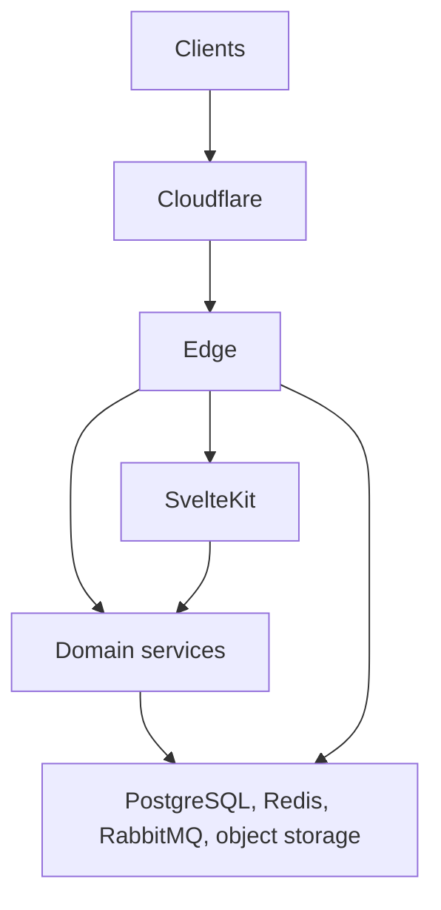

<!--
Copyright (c) DCSV. All rights reserved.
-->

# D2-WORX

Archive of the public monorepo that held early **WORX** and **D2** development.

| | |
| --- | --- |
| **D2** framework libraries | [DCSV-io/D2-Public](https://github.com/DCSV-io/D2-Public) / [NuGet](https://www.nuget.org/profiles/dcsv-io) / [npm](https://www.npmjs.com/org/dcsv-io) |
| **WORX** product source | Private |

This repository's `main` branch is a landing page only. Older commits retain the pre-archive tree.

---

## Background

**DCSV** ("Decisive") builds software for small and mid-sized businesses and sole proprietors.

**WORX** is DCSV's commercial SaaS product: client management, workflow automation, invoicing, and communication with clients.

**D2** (Decisive Distributed Application Framework) is the distributed application framework WORX is built on. Portable libraries publish as `DcsvIo.D2.*` (NuGet) and `@dcsv-io/d2-*` (npm).

---

## From DeCAF to D2

### DeCAF

**DeCAF** (Decisive Commerce Application Framework) is the earlier framework line: a **modular monolith** -- one deployable application, modules and providers decoupled behind interfaces and configuration. Deployments scale by running more instances of that single service (stateless horizontal scale), not by splitting into independently deployed microservices.

DeCAF v1 and v2 remain in production (closed source), with a full product surface: authentication, multi-tenant organizations, invoicing, billing, payments, catalog, checkout, administration, and related capabilities.

**DeCAF v3** kept the modular-monolith model on a modern stack (.NET 9, SvelteKit, PostgreSQL, Redis). An early WORX MVP was built on DeCAF v3.

### D2

**D2** is the distributed successor to DeCAF: shared libraries, contracts, and service patterns designed for multi-service SaaS -- horizontal scale across services, not only more copies of one process.

### WORX on D2

WORX is being reimplemented on D2 in two architectural generations:

**v1** established the distributed product shape while the stack was still polyglot. Public traffic hit several entry points (web, auth, files, REST gateway, SignalR). Internal work split across .NET and Node services (for example Geo and Comms). Shared infrastructure existed on both runtimes. That model proved the product direction and surfaced the cost of multi-ingress middleware and dual-language maintenance.

**v2** is a structural rewrite of that product architecture (not a mechanical port of v1). Backend services are .NET; SvelteKit remains the web client. Cross-cutting HTTP concerns and ingress collapse into a single **Edge**. Domain capabilities become private mesh services. Portable D2 libraries continue as the open framework layer ([D2-Public](https://github.com/DCSV-io/D2-Public)).

| | DeCAF | D2 / WORX v1 | D2 / WORX v2 |
| --- | --- | --- | --- |
| Deployment model | Modular monolith | Multi-service, multi-ingress | Multi-service, single public Edge |
| Backend languages | .NET (+ SvelteKit web) | .NET + Node + SvelteKit | .NET + SvelteKit |
| Scale unit | Instances of one app | Independently deployed services | Same, with clearer boundary ownership |
| Auth / gateway | In-process modules | Separate auth host + REST/SignalR gateways | Auth and routing inside Edge |
| Open surface | Closed product frameworks | Shared libs in-monorepo | D2 packages on NuGet/npm via D2-Public |

---

## WORX architecture (v2)

### Topology

- **Cloudflare** -- DNS, TLS, WAF in front of the application origin.
- **Edge** -- sole public application process: authentication and sessions, secret lifecycle (KeyCustodian), rate limiting and related boundary middleware, reverse proxy (**YARP**) to private HTTP backends, realtime push (SSE), and related ingress concerns.
- **SvelteKit** -- private server-rendered web app, reached through Edge. Sign-in and other auth state changes go to Edge from the browser; page data loading uses the private mesh.
- **Domain services** -- private mesh (files, outbound messaging, notifications, audit, and further domains). Service-to-service calls use mTLS for workload identity and a transaction token minted once at Edge and forwarded for user context.
- **Data plane** -- PostgreSQL (per-domain databases), Redis, RabbitMQ, object storage; consumed by Edge and services, not exposed as public ingress.

### Framework vs product

| D2 (open) | WORX (private) |
| --- | --- |
| Result types, error catalogs, auth vocabulary, caching, encryption, messaging adapters, geo and validation, i18n, handlers, telemetry, and related libraries | Edge host, domain services, SvelteKit application, product composition and operations |
| Specs and codegen for cross-language contracts | Full product contracts and hosts |

Installable building blocks: **[D2-Public](https://github.com/DCSV-io/D2-Public)**. The running WORX application is not published from this repository.

### Design themes

- One public trust boundary (Edge) instead of repeating gateway and middleware stacks per service.
- Private web and domain services; browser does not address mesh hosts directly.
- Shared D2 libraries for consistent results, redaction, caching, messaging, and contracts across .NET and TypeScript.
- Async work on RabbitMQ with encryption for sensitive payloads; outbound delivery and in-app notifications as dedicated domains rather than ad-hoc mailers in every service.

---

## This repository

1. Hosted joint public work on D2 and WORX.
2. Open D2 libraries moved to **[D2-Public](https://github.com/DCSV-io/D2-Public)** (Apache-2.0); WORX development continued privately.
3. `main` here is documentation only.

---

## License

Copyright (c) DCSV. **All rights reserved.** See [LICENSE](LICENSE).

D2 packages under D2-Public are licensed **Apache License 2.0** by that repository. That license does not apply to this landing page or to private WORX source.
