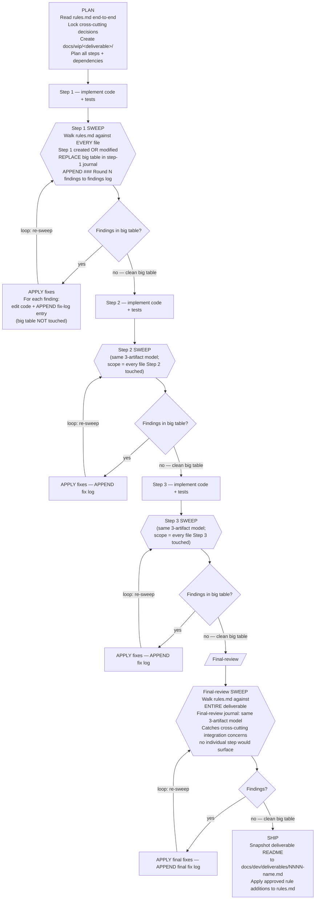

<!--
Copyright (c) DCSV. All rights reserved.
-->

<a name="top"></a>

# D2-WORX Rules

The complete, verbose, authoritative requirements for ANY code change in this repository. **Read this entire document during the PLAN phase of every deliverable** so you know upfront what you're being held to. Use it as the audit checklist after every step (looped until a pass returns zero findings) and again at final-review (scope = whole deliverable).

---

> ## ⚠️ MISSION CONTEXT — READ FIRST
>
> **D²-WORX is being built as an enterprise-level, production-ready, robust SaaS framework.** Every line of code that ships from this repository is held to that standard — not "works on my machine," not "good enough for now," not "we'll harden it later."
>
> Code that ships under this standard MUST:
>
> - Survive bad input, hostile input, malformed input, and oversized input without crashing or leaking
> - Survive infrastructure failure (DB down, broker unreachable, cache miss + downstream timeout, JWKS endpoint slow, network partition) gracefully — degrade, retry, circuit-break, or fail-closed; never silently swallow signal
> - Never leak PII (user input, broker URIs, presigned URLs, file names, IPs, emails, addresses, message bodies) into logs, metrics, traces, or message-broker headers
> - Survive concurrent access without races, double-fetches, deadlocks, or torn writes
> - Be testable, observable, and maintainable by future engineers who weren't in the room when it was written
> - Follow the established patterns and conventions of THIS codebase, not generic best practices from training data
>
> **If a predicate in this document feels like overkill for the task at hand, that's the discipline working — the cost of reading and applying it is minutes; the cost of skipping it is a production incident, a security disclosure, or a multi-week rework.** Don't optimize for short-term speed at the expense of robustness. The user's value is design + architectural review; the agent's value is delivering work that doesn't need user-side bug-hunting.

<sup>[↑ jump to top](#top)</sup>

---

## How to use this doc

1. **PLAN phase** — read end-to-end. Understanding the requirements upfront prevents architectural mistakes that cost rework later.
2. **Pre-execute pass** — before writing each step's code, walk the categories with intent: which predicates apply to this step? Surface the relevant ones in the step journal under "Pre-emptive gate checks" so you write code that passes the audit on round 1.
3. **Audit loop** — after writing the code, walk every category, every predicate. Answer Y/N with required evidence (grep results, file:line lists, "checked X by Y, found Z"). Vibes are not evidence. Findings get fixed in the same round; the next round runs against post-fix state. Loop until a round produces zero findings across every category. 10-iteration ceiling per scope; iteration 11 means escalate to user.
4. **Final-review** — same loop, scope = whole deliverable. Catches cross-step inconsistencies.

> **Verbose by design.** Every predicate exists because of a real past failure. The cost of reading the catalog is minutes per round; the cost of skipping a predicate is a future audit round (or a bug shipped). New predicates get appended at deliverable ship via the self-improvement loop ([process.md §5](process.md#5-self-improvement-loop)).

> **Companion docs**: [process.md](process.md) (the loop protocol + sub-agent architecture + audit-loop mechanics), [deliverables/](deliverables/README.md) (past final reports + lessons), [../PATTERNS.md](../PATTERNS.md) (what each pattern IS — this doc enforces THAT they're followed).

## Table of contents

**Glossary**: [Project-specific terms used throughout this catalog](#glossary--project-specific-terms-used-throughout-this-catalog) — define-once reference for KEEP doc, big table, sweep, round, sister-sweep, K=12 + Aggregator, smart-constructor, Plan-Audit, behavioral interface, meta-doc, etc. Read this first if any term-of-art in a predicate isn't self-evident.

This catalog is split into one file per category under [`rules/`](rules/). Read the specific category files that apply to the work in front of you; read the whole catalog end-to-end during the PLAN phase of every deliverable. Each § below links to its file with a one-line scope. The per-§ anchor stubs further down keep every historical `rules.md#<section>` deep link resolving — a stub points onward to the moved file.

| § | Category | Scope |
| --- | --- | --- |
| 1 | [Test Discipline](rules/01-test-discipline.md) | Test every public path on the first pass; make tests adversarial. |
| 2 | [Bug-Fix Regression Testing](rules/02-bug-fix-regression-testing.md) | Every bug fix ships with a regression test that fails without the fix. |
| 3 | [PII / Logging Safety](rules/03-pii-logging-safety.md) | Keep personal data and secrets out of logs, metrics, traces, and headers. |
| 4 | [Concurrency / Race Conditions](rules/04-concurrency-race-conditions.md) | Survive concurrent access without races, double-fetches, or torn writes. |
| 5 | [C# Code Conventions](rules/05-csharp-code-conventions.md) | In-language rules: helpers, syntax, records, async, public API, build cleanliness, global usings. |
| 6 | [TypeScript / SvelteKit Code Conventions](rules/06-typescript-sveltekit-code-conventions.md) | Node and SvelteKit BFF conventions, including SvelteKit specifics. |
| 7 | [Naming, File Headers, Folder Casing](rules/07-naming-file-headers-folder-casing.md) | Naming tables, file headers, folder casing, translation keys, git conventions, universal style. |
| 8 | [Build & Tooling Hygiene](rules/08-build-tooling-hygiene.md) | Keep the build and tooling clean; never start services by hand. |
| 9 | [Architectural Layer Hygiene](rules/09-architectural-layer-hygiene.md) | Layer boundaries, handler patterns, EF-as-DDD persistence, where auth checks belong. |
| 10 | [Security (Endpoints / Auth / Secrets / Input)](rules/10-security-endpoints-auth-secrets-input.md) | Endpoint, auth, secret-handling, and input-validation rules. |
| 11 | [Documentation Parity & Best Practices](rules/11-documentation-parity-best-practices.md) | Keep docs in step with code in the same change; doc style, structure, and brevity. |
| 12 | [i18n Discipline](rules/12-i18n-discipline.md) | Translation-key and localization rules across all locales. |
| 13 | [Permission / Action Discipline](rules/13-permission-action-discipline.md) | When to pause for the user; sub-agent, audit-technique, and deferral posture. |
| 14 | [Phase / Audit / Conversation Verbiage Hygiene](rules/14-phase-audit-conversation-verbiage-hygiene.md) | Keep phase, audit-round, and conversation IDs out of shipped surfaces. |
| 15 | [Object Disposal & Resource Lifetime](rules/15-object-disposal-resource-lifetime.md) | Dispose resources correctly and own object lifetimes. |
| 16 | [OOTB Shared-Lib Tooling — Use What's There](rules/16-ootb-shared-lib-tooling-use-whats-there.md) | Reach for the existing shared libraries before hand-rolling. |
| 17 | [D2Result Usage & Extensions](rules/17-d2result-usage-extensions.md) | Use the semantic D2Result factories; result-object control flow. |
| 18 | [Graceful Degradation & Failure Modes](rules/18-graceful-degradation-failure-modes.md) | Degrade, retry, circuit-break, or fail closed under failure. |
| 19 | [User Experience (UX)](rules/19-user-experience-ux.md) | User-facing behavior and copy rules. |
| 20 | [Developer Experience (DX)](rules/20-developer-experience-dx.md) | Make the code easy for the next engineer to work with. |
| 21 | [Observability Completeness](rules/21-observability-completeness.md) | Complete metrics, traces, and logs with the correct tags. |
| 22 | [Idempotency & Exactly-Once Semantics](rules/22-idempotency-exactly-once-semantics.md) | Safe retries and exactly-once handling. |
| 23 | [Configuration Hygiene](rules/23-configuration-hygiene.md) | Options-pattern config, indexed env vars, no manual env plumbing. |
| 24 | [Audit Evidence Discipline (meta — how to audit)](rules/24-audit-evidence-discipline-meta-how-to-audit.md) | How the audit documents itself: three-artifact journal, sweep/round lifecycle, closure-by-absence. |
| 25 | [Temporal Types (date / time / clock)](rules/25-temporal-types-date-time-clock.md) | NodaTime type selection, clock injection, DST, and timestamp handling. |
| 26 | [Codegen Discipline (spec / proto / schema-derived types)](rules/26-codegen-discipline-spec-proto-schema-derived-types.md) | Never hand-edit generated files; spec-driven codegen and per-package versioning. |

**Index-local sections** (kept in this file, not split out):

- [Deliverable workflow chart — order of operations with loops](#deliverable-workflow-chart--order-of-operations-with-loops)
- [Deliverable completeness checklist (the gate before user review)](#deliverable-completeness-checklist-the-gate-before-user-review)
- [Loop count expectations](#loop-count-expectations)
- [Self-improvement loop](#self-improvement-loop)
- [Final reminder](#final-reminder)

<sup>[↑ jump to top](#top)</sup>

---

## Glossary — project-specific terms used throughout this catalog

This section defines the project-specific terms-of-art used across the predicates below. First-use of any term in a predicate should be self-contained or link here; this section is the single source of truth.

- **KEEP doc** — long-lived documentation that ships with the code in production and is read by developers consuming or maintaining that code. KEEP docs describe **current reality** (present tense, no forward-framing, no historical narration). The full surface enumeration + allowlist of NON-KEEP paths lives at §11 "Definition — 'KEEP doc'"; that section is the authoritative scope source.
- **Big table** — the per-step / per-final-review evidence table embedded in the journal under the `## Latest sweep results` heading. One row per numbered subsection in this catalog. Replaced wholesale on every sweep (never appended to). See §24.0 / §24.0f.
- **Sweep** — one complete walk of every rules.md numbered subsection against the current code, performed by a fresh Auditor sub-agent. Produces a big table + appends a findings-log entry. See §24.0a / §24.0e.
- **Round** — one Auditor sweep + (if findings) one Fixer pass. Rounds are numbered (Round 1, Round 2, ...); each round dispatches FRESH sub-agents. See §24.0e.
- **Findings log** — the journal section under `## Sweep findings log (append-only)`. Per-round subsections (`### Round N findings (timestamp)`) preserve every FINDING ever surfaced in that sweep, verbatim. Append-only — never deleted, re-ordered, or reclassified. See §24.0a / §24.0c.
- **Fix log** — the journal section under `## Fix log (append-only)`. Chronological per-fix entries citing rules.md subsection + finding round + what changed + `file.ext:NN` + timestamp. Append-only. See §24.0b / §24.0g.
- **Sister-sweep** — when a Fixer applies a fix, the supplementary scan over the predicate's FULL applicability scope (NOT just the originating file's directory) to surface adjacent sister occurrences before handing back to the next Auditor. See §24.13.3 / §24.13.3a-d.
- **Tamper-evident** — Fixer verification protocol requiring literal-quote-the-output BEFORE + AFTER the fix + `git diff --stat` BEFORE + AFTER, all four pasted into the fix-log entry. Used for previously-false-closed findings or user-emphasized findings. See §24.14.
- **K=12 + Aggregator** — the canonical audit-round dispatch: 12 parallel cluster Auditors (each scoped to one §-range cluster, per process.md §3) + 1 Aggregator sub-agent (Fable per the [Sub-agent model policy per role](process.md#sub-agent-model-policy-per-role) canonical table) that merges the 12 partial outputs into the canonical journal big table. See §24.0h + §24.0i.
- **K=1 carve-out** — single-Auditor dispatch (instead of K=12 + Aggregator); requires explicit per-round user permission per §13.14 / §24.0h. Never self-invoked by the orchestrator.
- **Cluster A1 / A2 / B1 / B2 / B3 / C1 / C2 / C3 / D1 / D2 / E1 / E2** — the 12-way partition of rules.md predicates used by parallel Auditor dispatch. Cluster boundaries are defined in process.md §3 "Auditor cluster partition (canonical K=12)". Used here at §24.16 to enumerate per-cluster Plan-Audit verifications.
- **Smart-constructor** — domain-validation pattern: `Domain.Create(input) → D2Result<Domain>` returning a result rather than throwing. The handler calls `Create` at the top of `ExecuteAsync` and bubbles failure. See §9.4.
- **Plan-Audit** — the K=12 + Aggregator audit pass performed on a step's PLAN section BEFORE the Implementer is dispatched. Catches design errors at the cheapest moment. See §24.16.
- **Plan-amender** — sub-agent role analogous to Fixer, scoped to editing the journal's `## Plan` section in response to Plan-Audit findings. See §24.16.
- **Meta-record** — small hand-coded type used by the source-gen pipeline to surface generated-catalog metadata to consumers (e.g., `SpecMetadata`, `EmitResult`). Explicitly carved out from the §26.1 spec-mirror-DTO ban because the meta-record's shape is NOT a spec mirror. See §26.1 "Allowed".
- **Behavioral interface** — interface that defines API surface (methods consumers call), as opposed to data shape (fields a spec declares). Behavioral interfaces are NOT §26.1 spec-mirror violations even when they sit alongside spec-derived data. See §26.1 "Allowed".
- **Source-gen destination assembly** — any csproj / package that ships to consumers (anything a consumer can `using` / `import`). Distinct from a source-gen INTERNAL csproj (Roslyn analyzer, `IsRoslynComponent=true`) whose types never leak. The §26.1 ban applies to destination assemblies only; §26.2 carves out source-gen internals. See §26.1 / §26.2.
- **Meta-doc** — a doc that DIRECTS the work (process, predicates, orchestration), as opposed to a KEEP doc that DESCRIBES the code. The canonical 4-meta-doc set is `docs/dev/rules.md`, `docs/dev/process.md`, `CLAUDE.md`, `.github/copilot-instructions.md`. Cross-references between meta-docs (and from meta-docs to `docs/v2/`) are exempt from the §11.9 KEEP-doc citation ban. See §11.9 META-DOC ALLOWLIST + §14.1 meta-doc empirical-citation allowlist + §24.15.
- **PASS-borderline** — big-table status value for a row where the predicate passes the literal check but the Auditor wants to flag the case for orchestrator review (e.g., a carve-out applied that's defensible but worth surfacing). Counts as PASS for convergence purposes; emoji prefix is `🟡`. See §24.10.

<sup>[↑ jump to top](#top)</sup>

---

## 1. Test Discipline

Moved to [rules/01-test-discipline.md](rules/01-test-discipline.md).

## 2. Bug-Fix Regression Testing

Moved to [rules/02-bug-fix-regression-testing.md](rules/02-bug-fix-regression-testing.md).

## 3. PII / Logging Safety

Moved to [rules/03-pii-logging-safety.md](rules/03-pii-logging-safety.md).

## 4. Concurrency / Race Conditions

Moved to [rules/04-concurrency-race-conditions.md](rules/04-concurrency-race-conditions.md).

## 5. C# Code Conventions

Moved to [rules/05-csharp-code-conventions.md](rules/05-csharp-code-conventions.md).

## 6. TypeScript / SvelteKit Code Conventions

Moved to [rules/06-typescript-sveltekit-code-conventions.md](rules/06-typescript-sveltekit-code-conventions.md).

## 7. Naming, File Headers, Folder Casing

Moved to [rules/07-naming-file-headers-folder-casing.md](rules/07-naming-file-headers-folder-casing.md).

## 8. Build & Tooling Hygiene

Moved to [rules/08-build-tooling-hygiene.md](rules/08-build-tooling-hygiene.md).

## 9. Architectural Layer Hygiene

Moved to [rules/09-architectural-layer-hygiene.md](rules/09-architectural-layer-hygiene.md).

## 10. Security (Endpoints / Auth / Secrets / Input)

Moved to [rules/10-security-endpoints-auth-secrets-input.md](rules/10-security-endpoints-auth-secrets-input.md).

## 11. Documentation Parity & Best Practices

Moved to [rules/11-documentation-parity-best-practices.md](rules/11-documentation-parity-best-practices.md).

## 12. i18n Discipline

Moved to [rules/12-i18n-discipline.md](rules/12-i18n-discipline.md).

## 13. Permission / Action Discipline

Moved to [rules/13-permission-action-discipline.md](rules/13-permission-action-discipline.md).

## 14. Phase / Audit / Conversation Verbiage Hygiene

Moved to [rules/14-phase-audit-conversation-verbiage-hygiene.md](rules/14-phase-audit-conversation-verbiage-hygiene.md).

## 15. Object Disposal & Resource Lifetime

Moved to [rules/15-object-disposal-resource-lifetime.md](rules/15-object-disposal-resource-lifetime.md).

## 16. OOTB Shared-Lib Tooling — Use What's There

Moved to [rules/16-ootb-shared-lib-tooling-use-whats-there.md](rules/16-ootb-shared-lib-tooling-use-whats-there.md).

## 17. D2Result Usage & Extensions

Moved to [rules/17-d2result-usage-extensions.md](rules/17-d2result-usage-extensions.md).

## 18. Graceful Degradation & Failure Modes

Moved to [rules/18-graceful-degradation-failure-modes.md](rules/18-graceful-degradation-failure-modes.md).

## 19. User Experience (UX)

Moved to [rules/19-user-experience-ux.md](rules/19-user-experience-ux.md).

## 20. Developer Experience (DX)

Moved to [rules/20-developer-experience-dx.md](rules/20-developer-experience-dx.md).

## 21. Observability Completeness

Moved to [rules/21-observability-completeness.md](rules/21-observability-completeness.md).

## 22. Idempotency & Exactly-Once Semantics

Moved to [rules/22-idempotency-exactly-once-semantics.md](rules/22-idempotency-exactly-once-semantics.md).

## 23. Configuration Hygiene

Moved to [rules/23-configuration-hygiene.md](rules/23-configuration-hygiene.md).

## 24. Audit Evidence Discipline (meta — how to audit)

Moved to [rules/24-audit-evidence-discipline-meta-how-to-audit.md](rules/24-audit-evidence-discipline-meta-how-to-audit.md).

## 25. Temporal Types (date / time / clock)

Moved to [rules/25-temporal-types-date-time-clock.md](rules/25-temporal-types-date-time-clock.md).

## 26. Codegen Discipline (spec / proto / schema-derived types)

Moved to [rules/26-codegen-discipline-spec-proto-schema-derived-types.md](rules/26-codegen-discipline-spec-proto-schema-derived-types.md).

## Deliverable workflow chart — order of operations with loops

This chart shows the FULL flow for a hypothetical 3-step deliverable (PLAN → Step 1 → Step 2 → Step 3 → Final-review → SHIP). Loops at every stage. Read it as a process map: every stage with a sweep has a fix-loop attached; every loop only exits when the sweep produces a clean big table. **Per-step audit scope explicitly includes every file the step touched (incl. files modified from prior steps), so cross-step drift is caught at the per-step level — no separate tier-audit layer.**



### ASCII fallback (if Mermaid doesn't render)

```
PLAN — read rules.md, lock decisions, create wip dir
  │
  ▼
┌─────────────────────────────────────────────────────────┐
│ Step 1: implement code + tests                           │
│   │                                                       │
│   ▼                                                       │
│ Step 1 SWEEP (walks rules.md against Step 1 scope)       │
│   • REPLACE big table in step-1 journal                  │
│   • APPEND ### Round N findings to findings log          │
│   │                                                       │
│   ▼                                                       │
│ Findings? ──────yes────► APPLY fixes                     │
│   │                       • edit code                     │
│   │ no (clean big table)  • APPEND fix-log entry         │
│   │                       • big table NOT touched        │
│   │                       │                               │
│   │                       └──► loop: re-sweep ───────┐   │
│   │                                                   │   │
│   │              ◄──────────────────────────────────┘   │
│   ▼                                                       │
└──┼──────────────────────────────────────────────────────┘
   │ (Step 1 has clean big table)
   ▼
┌──────────────────────────────────────────────────────────┐
│ Step 2: same model — implement, sweep, fix, re-sweep,    │
│ loop until step-2 big table is clean                     │
└──┼──────────────────────────────────────────────────────┘
   ▼
┌──────────────────────────────────────────────────────────┐
│ Step 3: same model — implement, sweep, fix, re-sweep,    │
│ loop until step-3 big table is clean                     │
└──┼──────────────────────────────────────────────────────┘
   ▼
┌──────────────────────────────────────────────────────────┐
│ FINAL-REVIEW: sweep ENTIRE deliverable                   │
│ Final-review journal carries its own 3-artifact model    │
│ Loop until final-review big table clean                  │
│ Catches cross-cutting integration concerns no individual │
│ step would surface (deliverable-wide coherence)          │
└──┼──────────────────────────────────────────────────────┘
   ▼
SHIP: snapshot README to docs/dev/deliverables/, apply
      approved rule additions, present to user
```

### Deliverable completeness checklist (the gate before user review)

**Before declaring a deliverable "ready for REVIEW," walk this entire checklist. Every box must be a YES with a citation. If any box is NO, the deliverable is NOT ready — go finish the gap and re-walk the checklist.**

This is a META-checklist over the whole deliverable's process integrity — distinct from the per-step rules.md walks. Walk it ONCE, immediately before presenting the deliverable for user review.

#### Per-step gates (walk for EACH step in the deliverable)

For each step `NN-<step-name>` in `docs/wip/<deliverable>/`:

- [ ] **Journal exists** at `docs/wip/<deliverable>/<NN>-<step>/journal.md`?
- [ ] **Big table present** under `## Latest sweep results`, with one row per rules.md numbered subsection (~280 rows currently — the gate is one-row-per-subsection, not a fixed integer)?
- [ ] **Anti-laziness preamble** verbatim above the big table?
- [ ] **Big table has zero FINDING rows** (clean sweep)? If not, step is not done.
- [ ] **Every PASS row** carries a `file.cs:NN` citation (no "verified ✓", no "looks good")?
- [ ] **Every N/A row** carries a step-scope-specific reason (no bare "doesn't apply")?
- [ ] **Findings log** under `## Sweep findings log (append-only)` with at least one `### Round N findings (timestamp)` subsection per sweep that ran?
- [ ] **Fix log** under `## Fix log (append-only)` with chronological entries for every fix that landed?
- [ ] **For every FINDING in any round's findings log**, is there a corresponding fix-log entry (or explicit user-approved deferral entry)? No silent carryover.
- [ ] **Final round of sweep** in the findings log shows zero FINDINGs (closure proven by absence)?
- [ ] **Self-audit rows §24.0 through §24.16** (incl. §24.0a-i + §24.13.1-4 + §24.13.3a-d) present in the latest big table, each PASS-cited against the journal file itself?
- [ ] **Step's code change** has corresponding test coverage (per §1.x predicates)?
- [ ] **Build clean**: `dotnet build server/D2.slnx` zero StyleCop / CS warnings against current state?
- [ ] **JetBrains inspect clean**: `jb inspectcode server/D2.slnx --severity=WARNING` zero warnings?
- [ ] **Test suite passes** at the most recent test run citation in the journal?

#### Final-review gate (the deliverable-wide sweep)

- [ ] **Final-review journal exists** at `docs/wip/<deliverable>/final-review/journal.md`?
- [ ] **Final-review SWEEPS the ENTIRE deliverable** (every step's output, every modified shared lib, every modified doc)?
- [ ] **Final-review journal carries the same 3-artifact model** (big table + findings log + fix log)?
- [ ] **Final-review big table is clean** (zero FINDINGs)?
- [ ] **Final-review surfaces and records** any deliverable-wide consistency findings (e.g. PATTERNS.md / PARITY.md / TESTS.md drift, parent README update misses, Mermaid graph drift)?

#### Deliverable-wide doc gates

- [ ] **Root README** at `docs/wip/<deliverable>/README.md` updated with the final report (kinds-of-misses log, candidate rule additions, summary)?
- [ ] **Cross-cutting docs** updated per CLAUDE.md §3.5 Doc Update Map (PATTERNS.md / TESTS.md / PARITY.md / SRC_GEN.md as relevant)?
- [ ] **Per-lib / per-service READMEs** updated for new public APIs?
- [ ] **Parent `server/shared/dotnet/README.md`** updated for any new lib (status row + Mermaid graph + redundant-edges enumeration)?
- [ ] **Tracking doc** `docs/v2/PHASE_*.md` updated (or successor) with the deliverable's status?
- [ ] **No phase / sweep / audit verbiage** leaked into KEEP docs or source code (per §14.x)?
- [ ] **No conversation-scoped IDs** (Q-IDs, F#-IDs, R# refs) leaked into KEEP docs or source code?

#### Process-integrity gates

- [ ] **No commit was made** without explicit user permission per occurrence?
- [ ] **No bulk file ops** without scope declared first?
- [ ] **No destructive git ops** without explicit authorization?
- [ ] **No deferred work** without user permission (every deferral has a fix-log entry referencing user approval)?
- [ ] **No mid-execution architectural deviation** from the locked PLAN without ASK?

#### Final attestation (the agent writes this in the deliverable's root README before user review)

> "I attest that this deliverable's process integrity has been verified against the deliverable completeness checklist in `rules.md` (Deliverable completeness checklist section). Every box is YES. The deliverable is ready for user REVIEW."
>
> Followed by per-step / final-review journal links so the user can spot-check.

**If the agent cannot honestly attest every box as YES, the deliverable is NOT ready. Go fix the gap, re-walk the checklist, and only present for user review when every box is honestly YES.**

---

### Loop count expectations

- A WELL-PLANNED step typically converges in 1-3 sweep rounds.
- A POORLY-PLANNED step (or one introducing complex new patterns) may need 5-8 rounds.
- 10-iteration ceiling per step (process.md §4). Iteration 11 = escalate to user — something is structurally wrong.
- Final-review surfaces 0-2 deliverable-wide consistency findings — typically 1-2 sweep rounds.

### Worked example (Step 1 of a hypothetical deliverable)

Imagine Step 1 implements a new `FooHandler`. The flow:

1. Code + tests written.
2. **Sweep round 1**: walks rules.md → REPLACES big table in `01-foo-handler/journal.md` with sweep-1 results. Findings log gets `### Round 1 findings (2026-05-10 14:00)` appended with 5 FINDINGs (1H + 3M + 1L).
3. Agent reads big table → starts fix work. For each FINDING: edits code + APPENDS one line to `## Fix log` (e.g. `- 2026-05-10 14:15 §3.1 (R1): SanitizedExceptionRender used in FooHandler.cs:42 to replace Exception param`).
4. All 5 R1 findings have fix-log entries.
5. **Sweep round 2**: walks rules.md again → REPLACES big table with sweep-2 results. Appends `### Round 2 findings` (1 LOW finding cascaded from R1's §3.1 fix; the 5 R1 findings are now PASS in the big table = closed by absence).
6. Agent fixes R2 LOW. Appends fix-log entry.
7. **Sweep round 3**: walks rules.md → big table now has zero FINDINGs. Step 1 is done.
8. Step 1 journal contains: latest big table (R3 clean), findings log with R1 + R2 + R3 subsections, fix log with chronological R1 + R2 fix entries.

Anyone reading the journal can see: (a) what the latest state is, (b) what was found at each round, (c) what was changed in response, (d) that closure was proven by absence in the next sweep.

<sup>[↑ jump to top](#top)</sup>

---

## Self-improvement loop

This catalog grows. Per [process.md §5 Self-improvement loop](process.md#5-self-improvement-loop), every deliverable's distillation produces proposed predicate additions. Approved additions land here. Over time the catalog approaches "every kind of miss we've ever made has a corresponding gate-check," and the audit loop converges in fewer rounds because predicates fire pre-emptively (the agent sees the predicate during PLAN's pre-emptive gate checks and avoids the miss in the first place).

### Format for proposing a new predicate

In the deliverable's root README "Proposed rule additions to rules.md" section:

```
Category: <existing category number + name, or "NEW: <name>">
Predicate: <Y/N question with required evidence>
Origin:    <which deliverable / step / round surfaced the underlying miss>
Why permanent: <not a one-off; class of miss that will recur without a gate-check>
Examples:  <1-2 specific past instances>
```

User approves / tweaks / rejects per proposal. Approved proposals get appended to this doc as part of ship's commit batch.

Rejected proposals (one-off mistakes not worth a permanent rule) get noted in the deliverable's final report so the reasoning survives.

<sup>[↑ jump to top](#top)</sup>

---

## Final reminder

**This catalog exists because D²-WORX is being built to ship to production with real users, real money, and real consequences for failure.** The verbose discipline upfront is the cost of robustness; the alternative is shipping bugs and burning trust. When in doubt about a predicate, default to applying it — the cost is minutes of reading, the cost of skipping is incidents.
