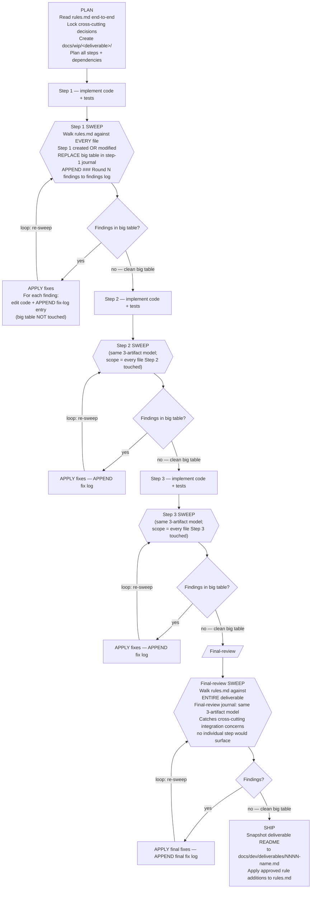

<!--
Copyright (c) DCSV. All rights reserved.
-->

<a name="top"></a>

# D2-WORX Rules

The complete, verbose, authoritative requirements for ANY code change in this repository. **Read this entire document during the PLAN phase of every deliverable** so you know upfront what you're being held to. Use it as the audit checklist after every step (looped until a pass returns zero findings) and again at final-review (scope = whole deliverable).

---

> ## ⚠️ MISSION CONTEXT — READ FIRST
>
> **D²-WORX is being built as an enterprise-level, production-ready, robust SaaS framework.** Every line of code that ships from this repository is held to that standard — not "works on my machine," not "good enough for now," not "we'll harden it later."
>
> Code that ships under this standard MUST:
>
> - Survive bad input, hostile input, malformed input, and oversized input without crashing or leaking
> - Survive infrastructure failure (DB down, broker unreachable, cache miss + downstream timeout, JWKS endpoint slow, network partition) gracefully — degrade, retry, circuit-break, or fail-closed; never silently swallow signal
> - Never leak PII (user input, broker URIs, presigned URLs, file names, IPs, emails, addresses, message bodies) into logs, metrics, traces, or message-broker headers
> - Survive concurrent access without races, double-fetches, deadlocks, or torn writes
> - Be testable, observable, and maintainable by future engineers who weren't in the room when it was written
> - Follow the established patterns and conventions of THIS codebase, not generic best practices from training data
>
> **If a predicate in this document feels like overkill for the task at hand, that's the discipline working — the cost of reading and applying it is minutes; the cost of skipping it is a production incident, a security disclosure, or a multi-week rework.** Don't optimize for short-term speed at the expense of robustness. The user's value is design + architectural review; the agent's value is delivering work that doesn't need user-side bug-hunting.

<sup>[↑ jump to top](#top)</sup>

---

## How to use this doc

1. **PLAN phase** — read end-to-end. Understanding the requirements upfront prevents architectural mistakes that cost rework later.
2. **Pre-execute pass** — before writing each step's code, walk the categories with intent: which predicates apply to this step? Surface the relevant ones in the step journal under "Pre-emptive gate checks" so you write code that passes the audit on round 1.
3. **Audit loop** — after writing the code, walk every category, every predicate. Answer Y/N with required evidence (grep results, file:line lists, "checked X by Y, found Z"). Vibes are not evidence. Findings get fixed in the same round; the next round runs against post-fix state. Loop until a round produces zero findings across every category. 10-iteration ceiling per scope; iteration 11 means escalate to user.
4. **Final-review** — same loop, scope = whole deliverable. Catches cross-step inconsistencies.

> **Verbose by design.** Every predicate exists because of a real past failure. The cost of reading the catalog is minutes per round; the cost of skipping a predicate is a future audit round (or a bug shipped). New predicates get appended at deliverable ship via the self-improvement loop ([process.md §5](process.md#5-self-improvement-loop)).

> **Companion docs**: [process.md](process.md) (the loop protocol + sub-agent architecture + audit-loop mechanics), [deliverables/](deliverables/README.md) (past final reports + lessons), [../PATTERNS.md](../PATTERNS.md) (what each pattern IS — this doc enforces THAT they're followed).

## Table of contents

**Glossary**: [Project-specific terms used throughout this catalog](#glossary--project-specific-terms-used-throughout-this-catalog) — define-once reference for KEEP doc, big table, sweep, round, sister-sweep, K=12 + Aggregator, smart-constructor, Plan-Audit, behavioral interface, meta-doc, etc. Read this first if any term-of-art in a predicate isn't self-evident.

**Code-quality categories** (the 26 categories the audit walks against the code — §1 – §23, §25, §26; §24 is the meta-discipline category covered separately below):

1. [Test Discipline](#1-test-discipline) — incl. §1.25 (aggregate counts ≠ test executed), §1.26 (live-DB integration tests for EF-mapping / anonymization), §1.27 (struct capture in assertion closures), §1.28 (TypeSpec decorator `$fn` direct-unit tests for V8 src/ coverage), §1.29 (TypeSpec rejection tests assert `hasError()` + catalog-integrity test), §1.30 (platform-dependent real-socket transport tests — honest skip + cross-platform unit matrix + same-platform canary + deploy-target container proof), §1.31 (§1.3 sharpening — DI seam resolution-tested in its OWN registering extension's test, not only cross-module), §1.32 (test double for unbuilt collaborator MUST assert the real seam contract — no hollow canned-return doubles)
2. [Bug-Fix Regression Testing](#2-bug-fix-regression-testing)
3. [PII / Logging Safety](#3-pii--logging-safety) — incl. §3.16 (live forwarded-credential wrapper — full leak-surface matrix, not a single redaction assertion)
4. [Concurrency / Race Conditions](#4-concurrency--race-conditions)
5. [C# Code Conventions](#5-c-code-conventions) — incl. §5.8a (blank-line padding around control-flow blocks and multi-line statements)
6. [TypeScript / SvelteKit Code Conventions](#6-typescript--sveltekit-code-conventions)
7. [Naming, File Headers, Folder Casing](#7-naming-file-headers-folder-casing)
8. [Build & Tooling Hygiene](#8-build--tooling-hygiene)
9. [Architectural Layer Hygiene](#9-architectural-layer-hygiene) — incl. §9.35 (parallel persistence-write converter symmetry), §9.37 (EF-as-DDD — retire per-op Repository handlers), §9.38 (flat-Record + pure-mapper persistence for sum-type state machines), §9.39 (live credential captured only after all inbound auth gates — symmetric across transports), §9.40 (shared port lives in the lowest common layer both consumers reference)
10. [Security (Endpoints / Auth / Secrets / Input)](#10-security-endpoints--auth--secrets--input)
11. [Documentation Parity & Best Practices](#11-documentation-parity--best-practices) — incl. §11.40 (code-example signature correctness + registry completeness + integrated gate), §11.41 (doc-reconciliation sweep-beyond-focus), §11.42 (survivor-preservation in model-change reconciliation), §11.43 (doc-set tier hierarchy + ephemeral-holding-pen lifecycle), §11.44 (plain language — no flourishes)
12. [i18n Discipline](#12-i18n-discipline)
13. [Permission / Action Discipline](#13-permission--action-discipline)
14. [Phase / Audit / Conversation Verbiage Hygiene](#14-phase--audit--conversation-verbiage-hygiene)
15. [Object Disposal & Resource Lifetime](#15-object-disposal--resource-lifetime)
16. [OOTB Shared-Lib Tooling — Use What's There](#16-ootb-shared-lib-tooling--use-whats-there)
17. [D2Result Usage & Extensions](#17-d2result-usage--extensions) — incl. §17.8 (`IsUnhandledException` excluded from retry-eligibility)
18. [Graceful Degradation & Failure Modes](#18-graceful-degradation--failure-modes)
19. [User Experience (UX)](#19-user-experience-ux)
20. [Developer Experience (DX)](#20-developer-experience-dx)
21. [Observability Completeness](#21-observability-completeness)
22. [Idempotency & Exactly-Once Semantics](#22-idempotency--exactly-once-semantics)
23. [Configuration Hygiene](#23-configuration-hygiene)
25. [Temporal Types (date / time / clock)](#25-temporal-types-date--time--clock)
26. [Codegen Discipline (spec / proto / schema-derived types)](#26-codegen-discipline-spec--proto--schema-derived-types) — incl. §26.9 (EF migrations excluded from StyleCop via `.editorconfig`), §26.10 (DSL parsers fail-loud on typo/ambiguous input), §26.11 (spike-port vs locked-vocabulary sweep), §26.12 (hand-mirrored cross-language constants require provenance + parity test or tracked follow-up), §26.13 (regenerating a shared cross-service registry verified by the shared / full-solution test run), §26.14 (security-critical cross-cutting auto-wired into generated DI, never a host-must-chain docstring), §26.15 (generators validated independently with real seams or faithful doubles — never "pending a consumer"), §26.16 (committed validation ledger per emitter — what each is validated against + replace-trigger), §26.17 (conversation/decision IDs banned in emitter source + emitted output + tests + docs — full pattern-class sweep), §26.18 (hand-authored file MUST NOT carry a generated banner or `.g.*` extension), §26.19 (per-package semver + CHANGELOG via the commit-footer release runner — versioning discipline for consumable shared packages), §26.20 (after touching any consumable source, re-seed `.release-fingerprint` before committing — pre-commit gate blocks stale baselines)

**Meta categories** (govern HOW the audit documents itself + how the deliverable closes out):

24. [Audit Evidence Discipline (meta — how to audit)](#24-audit-evidence-discipline-meta--how-to-audit)
    - [Three-artifact journal model](#three-artifact-journal-model-one-big-table--append-only-findings-log--append-only-fix-log)
    - [Predicates §24.0 – §24.29 (incl. §24.0h K=1 carve-out, §24.0i Opus-for-Auditors, §24.16 Plan-Audit-required, §24.19 uncommitted-deliverable working-tree, §24.20 tool-invisible convention lens, §24.21 full-solution gate-verify, §24.22 source-xmldoc step-ref scan, §24.23 Fixer no-workspace-IDs in own additions, §24.24 Auditor scope = git-verified authored surface, §24.25 baseline-dismissal git-verification, §24.26 closure-by-absence requires artifact existence, §24.28 Fixer greps deliverable-wide for pattern-class before fixing, §24.29 Fixer self-greps own diff before returning)](#predicates--24-audit-evidence-discipline)
    - [Deliverable workflow chart — order of operations with loops](#deliverable-workflow-chart--order-of-operations-with-loops)
    - [Deliverable completeness checklist (the gate before user review)](#deliverable-completeness-checklist-the-gate-before-user-review)
    - [Loop count expectations](#loop-count-expectations)

**Process** (catalog growth + closing notes):

- [Self-improvement loop](#self-improvement-loop)
- [Final reminder](#final-reminder)

<sup>[↑ jump to top](#top)</sup>

---

## Glossary — project-specific terms used throughout this catalog

This section defines the project-specific terms-of-art used across the predicates below. First-use of any term in a predicate should be self-contained or link here; this section is the single source of truth.

- **KEEP doc** — long-lived documentation that ships with the code in production and is read by developers consuming or maintaining that code. KEEP docs describe **current reality** (present tense, no forward-framing, no historical narration). The full surface enumeration + allowlist of NON-KEEP paths lives at §11 "Definition — 'KEEP doc'"; that section is the authoritative scope source.
- **Big table** — the per-step / per-final-review evidence table embedded in the journal under the `## Latest sweep results` heading. One row per numbered subsection in this catalog. Replaced wholesale on every sweep (never appended to). See §24.0 / §24.0f.
- **Sweep** — one complete walk of every rules.md numbered subsection against the current code, performed by a fresh Auditor sub-agent. Produces a big table + appends a findings-log entry. See §24.0a / §24.0e.
- **Round** — one Auditor sweep + (if findings) one Fixer pass. Rounds are numbered (Round 1, Round 2, ...); each round dispatches FRESH sub-agents. See §24.0e.
- **Findings log** — the journal section under `## Sweep findings log (append-only)`. Per-round subsections (`### Round N findings (timestamp)`) preserve every FINDING ever surfaced in that sweep, verbatim. Append-only — never deleted, re-ordered, or reclassified. See §24.0a / §24.0c.
- **Fix log** — the journal section under `## Fix log (append-only)`. Chronological per-fix entries citing rules.md subsection + finding round + what changed + `file.ext:NN` + timestamp. Append-only. See §24.0b / §24.0g.
- **Sister-sweep** — when a Fixer applies a fix, the supplementary scan over the predicate's FULL applicability scope (NOT just the originating file's directory) to surface adjacent sister occurrences before handing back to the next Auditor. See §24.13.3 / §24.13.3a-d.
- **Tamper-evident** — Fixer verification protocol requiring literal-quote-the-output BEFORE + AFTER the fix + `git diff --stat` BEFORE + AFTER, all four pasted into the fix-log entry. Used for previously-false-closed findings or user-emphasized findings. See §24.14.
- **K=12 + Aggregator** — the canonical audit-round dispatch: 12 parallel cluster Auditors (each scoped to one §-range cluster, per process.md §3) + 1 Aggregator sub-agent (Fable per the [Sub-agent model policy per role](process.md#sub-agent-model-policy-per-role) canonical table) that merges the 12 partial outputs into the canonical journal big table. See §24.0h + §24.0i.
- **K=1 carve-out** — single-Auditor dispatch (instead of K=12 + Aggregator); requires explicit per-round user permission per §13.14 / §24.0h. Never self-invoked by the orchestrator.
- **Cluster A1 / A2 / B1 / B2 / B3 / C1 / C2 / C3 / D1 / D2 / E1 / E2** — the 12-way partition of rules.md predicates used by parallel Auditor dispatch. Cluster boundaries are defined in process.md §3 "Auditor cluster partition (canonical K=12)". Used here at §24.16 to enumerate per-cluster Plan-Audit verifications.
- **Smart-constructor** — domain-validation pattern: `Domain.Create(input) → D2Result<Domain>` returning a result rather than throwing. The handler calls `Create` at the top of `ExecuteAsync` and bubbles failure. See §9.4.
- **Plan-Audit** — the K=12 + Aggregator audit pass performed on a step's PLAN section BEFORE the Implementer is dispatched. Catches design errors at the cheapest moment. See §24.16.
- **Plan-amender** — sub-agent role analogous to Fixer, scoped to editing the journal's `## Plan` section in response to Plan-Audit findings. See §24.16.
- **Meta-record** — small hand-coded type used by the source-gen pipeline to surface generated-catalog metadata to consumers (e.g., `SpecMetadata`, `EmitResult`). Explicitly carved out from the §26.1 spec-mirror-DTO ban because the meta-record's shape is NOT a spec mirror. See §26.1 "Allowed".
- **Behavioral interface** — interface that defines API surface (methods consumers call), as opposed to data shape (fields a spec declares). Behavioral interfaces are NOT §26.1 spec-mirror violations even when they sit alongside spec-derived data. See §26.1 "Allowed".
- **Source-gen destination assembly** — any csproj / package that ships to consumers (anything a consumer can `using` / `import`). Distinct from a source-gen INTERNAL csproj (Roslyn analyzer, `IsRoslynComponent=true`) whose types never leak. The §26.1 ban applies to destination assemblies only; §26.2 carves out source-gen internals. See §26.1 / §26.2.
- **Meta-doc** — a doc that DIRECTS the work (process, predicates, orchestration), as opposed to a KEEP doc that DESCRIBES the code. The canonical 4-meta-doc set is `docs/dev/rules.md`, `docs/dev/process.md`, `CLAUDE.md`, `.github/copilot-instructions.md`. Cross-references between meta-docs (and from meta-docs to `docs/v2/`) are exempt from the §11.9 KEEP-doc citation ban. See §11.9 META-DOC ALLOWLIST + §14.1 meta-doc empirical-citation allowlist + §24.15.
- **PASS-borderline** — big-table status value for a row where the predicate passes the literal check but the Auditor wants to flag the case for orchestrator review (e.g., a carve-out applied that's defensible but worth surfacing). Counts as PASS for convergence purposes; emoji prefix is `🟡`. See §24.10.

<sup>[↑ jump to top](#top)</sup>

---

## 1. Test Discipline

The #1 cost driver of multi-pass audits is "thin glue" code (DI extensions, gRPC plumbing, factory wrappers, source-generator emitters) shipped without tests. Every public path needs at least one test on the FIRST pass.

### Predicates — §1 test discipline

- **1.1** Does every `public` method introduced in this scope have ≥1 test?
  - Evidence: `<method qualified-name> -> <test file:line>` for each, or "no public methods in scope."
  - **Why**: Real example — a `GrpcClientBuilderExtensions` registration extension shipped with an unused `<TClient>` generic; no test exercised the call so the bug hid until a second audit pass. Same round: OIDC `ConfigurationManager` was constructed via the 2-arg ctor that uses a static default `HttpClient` instead of our `IHttpClientFactory` — no test verified our HttpClient was actually being used.
  - **How**: "hard to test in isolation" is a smell, not an excuse. Find a way: compile-time test (existence of test file proves call shape compiles), DI smoke test, runtime registration assert.

- **1.2** Does every public method / API surface / input parameter have EXHAUSTIVE adversarial coverage across EVERY applicable category below — NOT merely "≥1 adversarial test" (that's lazy and defeats the purpose of non-happy-path tests)? If you can think of an untested scenario that can be written into a test and has not been done yet, **WRITE IT**. "Too many tests" is never the failure mode; "production broke as soon as someone deviated from happy path" is.
  - **Mandatory adversarial categories** (write tests for EVERY category that applies to the surface — Implementer enumerates which apply in the Plan; Auditor flags absent applicable categories as FINDING-HIGH):
    1. **Input validation**: null / empty (`""`, empty collection, default-initialized struct) / whitespace-only / over-max-length / under-min-length / special characters / unicode edge cases (combining marks, surrogate pairs, RTL, zero-width chars, normalization forms NFC/NFD) / wrong type (where dynamic typing / JSON deserialization allows) / malformed format violations (regex / parse / schema) / boundary values (`int.MinValue`, `int.MaxValue`, min/max ± 1, `0`, `-1`, `Guid.Empty`).
    2. **Cross-field dependencies**: field A requires field B (test omitting B) / field A's value constrains field B's allowed values (test invalid combinations) / mutually exclusive fields (test both set) / conditional-required (field B required iff field A has specific value).
    3. **State / lifecycle**: calling method twice (idempotency where claimed; OR assert observable behavior either way when not claimed) / calling method in wrong order (e.g. `Close` before `Open`) / calling method on disposed / closed / completed object / calling method after an error state was returned (does the object remain usable or does it stay in error?).
    4. **Concurrency** (where the surface is reachable from multiple threads / requests): multiple concurrent readers / reader during writer / concurrent writers / cancellation token canceled mid-operation / timeout during operation / lost-update race.
    5. **Resource exhaustion** (where the surface allocates / opens resources): out-of-memory simulation (over-large input that would OOM if unbounded) / disk full (where applicable) / network failure (DNS / TCP / TLS) / external-dependency failure (DB down, RMQ down, Redis down, OIDC discovery slow / unreachable) / connection pool exhaustion.
    6. **Error propagation**: inner exception preserved (where appropriate) / error code surfaced correctly per `D2Result` semantics / partial-success state correctly reported (`SOME_FOUND` vs `NOT_FOUND` vs `OK`) / sanitized rendering used (no PII via `ex.Message`).
    7. **Domain-specific adversarial** (per the surface's domain — Plan enumerates):
       - Temporal: per §25.12 categories (IANA / DST / leap / cross-language parity / determinism / TestClock).
       - Auth / tokens: malformed JWT (missing segment / wrong algorithm / `none` algorithm) / expired token / not-yet-valid (`nbf` in future) / signature mismatch / wrong audience / wrong issuer / replayed token / oversized claim payload / unicode in claims.
       - Cache: TTL boundary (exactly-expired, expired-by-1ms, never-expires sentinel) / eviction race / serialization failure (corrupt cached blob) / key collision / Redis backplane down (degraded local-only mode).
       - Geo / location: lat/lng out of range (`> 90`, `< -90`, `> 180`, `< -180`) / antimeridian crossing / pole degeneracy / invalid postal code / invalid ISO 3166-1/2 code / mixed-case identifier normalization.
       - Messaging: oversized payload / corrupt envelope / replayed message / out-of-order delivery / DLQ routing on poison message / consumer-isolation (one bad message doesn't kill the consumer).
       - I/O / file: zero-byte file / corrupt file / wrong MIME type / oversized file / filename with traversal sequences (`..`, `/`, `\`, NUL, control chars) / symlink / file-system permission denied.
    8. **Security-adversarial** (where the surface is reachable from untrusted input): SQL-injection-shaped strings / path-traversal sequences / template-injection / log-injection (CRLF in user input) / unicode normalization attacks / IDOR (request with another user's ID).
  - **NOT every method needs every category** — only the categories that apply to that surface. But the Implementer MUST enumerate WHICH apply (and WHY the others are N/A) in the Plan section. The Auditor MUST cross-walk the test file against the enumeration — any applicable category with ZERO covering tests is a FINDING-HIGH (not "polish", not "borderline", not "follow-up").
  - **Evidence**: per public surface introduced or modified → an adversarial-coverage matrix in the Plan / Implementer journal entry listing (a) which categories apply, (b) per applicable category, the test name(s) covering it. The big-table row cites the matrix file:line + the test file. Missing applicable category = FINDING-HIGH (severity HIGH by default; HIGH→CRITICAL if the missing category corresponds to a reachable production failure mode like PII leak / IDOR / unbounded resource consumption).
  - **Why**: happy-path-only tests pin behavior under good input but not under garbage input — which is what production actually delivers. An enterprise framework MUST survive malicious / malformed / accidental garbage gracefully. The previous form of this predicate ("≥1 adversarial input") was satisfied by writing a single `null` test and calling it done — the lazy interpretation that empirically shipped to production. The 0009 Step 1 temporal-test gap (4 audit rounds walked §1.2 but didn't flag absence of DST / leap / IANA coverage because "1 adversarial test" was technically present) is the canonical failure of the weak form. **"Better to have a shit ton of tests than code that breaks as soon as someone doesn't happy path input."** Write more tests, not fewer.
  - **How**: at PLAN time, enumerate the applicable categories per public surface in the Plan section under "Adversarial coverage matrix" (table form: surface × category × test name). Implementer writes tests category-by-category, one test per scenario, behavior-descriptive name per §1.8. Auditor reads the matrix → opens the test file → confirms every applicable category has at least one covering test, NOT one test claiming to cover multiple categories (one test = one scenario). Missing category → FINDING-HIGH. Categories the Plan omitted but the Auditor identifies as applicable → FINDING-HIGH against §1.22 (Plan enumeration gap) AND §1.2 (test absence).
  - **Cross-refs**: §25.12 is the canonical domain-specific application of this predicate (temporal types). §1.7 (factory wrappers) and §1.18 (per-VALUE pin) are complementary surfaces this predicate also governs. §1.22 (Plan enumeration) and §1.23 (Auditor mandate) operationalize the enforcement.

- **1.3** Are all DI extension methods (`Add*`, `Use*`, `Configure*`) tested via composition resolution (build a `ServiceProvider`, resolve the registered service, assert shape)? Does the composition test `GetRequiredService<>()` EVERY seam the extension registers — not a representative sample?
  - **Why every seam**: descriptor-presence in the `ServiceCollection` is NOT the same as resolvability — a handler registered with a missing dependency compiles clean and appears in `services`, but throws at runtime when resolved. A composition test that resolves 3 of 8 registered handlers leaves 5 unverified and ships latent `InvalidOperationException` failures. The only evidence that a seam is resolvable is a successful `GetRequiredService<IXxxHandler>()` call.
  - **Required**: the composition-resolution test iterates (or explicitly calls) `GetRequiredService<>()` for EVERY public handler interface + every other publicly-injectable seam (`I<Op>Handler`, keyed resolvers, options-configured services) that the extension method registers. Missing a seam = FINDING-HIGH.
  - Evidence: `<extension method> → <test file:line>` that resolves EVERY registered seam, with each seam listed individually. A test that resolves a sample (e.g. one handler to prove "the service collection builds") without covering all registered types = FINDING-HIGH.

- **1.4** Are all gRPC client/server registration helpers tested (call shape compiles + dispatches)?
  - Evidence: `<helper> -> <test that calls through it>`.

- **1.5** Are all source-generator emitters covered by snapshot tests (input spec → expected source, AST-equivalent)?
  - Evidence: emitter → snapshot test file.

- **1.6** Do reflection-based tests pin every `[LoggerMessage]` partial-method signature against accepting `Exception` (since `ex.Message` leaks broker URIs / user input)?
  - Evidence: `<partial method> -> <reflection test asserting param list>`.
  - **Pattern**: `Phase8FixVerificationTests.F3F4L5_LogDelegate_DoesNotTakeRawException` was the canonical one (now redistributed to `Telemetry/LoggerMessageDelegateContractTests.cs`).

- **1.7** Are all factory wrappers (`From*` / `Create*` / smart-constructor static methods on records / classes) tested EXHAUSTIVELY per §1.2's applicable adversarial categories — NOT merely "happy + one degenerate"? Factories are the validation gate for domain types; an under-tested factory is the silent-bug surface that lets malformed data through to handlers / repos / wire.
  - Evidence: per factory → adversarial-coverage matrix row (per §1.2 evidence requirement) showing which categories apply + which tests cover each. Single-category "degenerate input" coverage = FINDING-HIGH (insufficient per §1.2 strengthened form).
  - **Why**: factories are domain boundaries. A `Country.Create(string iso2)` factory that only tests `"US"` and `null` lets through `"us"` (case), `" US "` (whitespace), `"USA"` (length), `"u​s"` (zero-width char), and so on — every gap is a wire-format bug that surfaces in production when a real user submits real-world malformed data. The §1.2 mandate to enumerate categories applies HERE specifically because factories are the most common adversarial-surface in the codebase.

- **1.8** Do test method names use **behavior-descriptive** names? No `F2_`, `AuditN_`, `PhaseN_`, `Audit{Letter}_`, `R5_`, `H4_`, `M2_`, `L3_`, `O1_`, `S2_`, `Q1_`, combo labels like `F3F4L5_`.
  - Evidence: `grep -rEn 'public[[:space:]]+(async[[:space:]]+)?(void|Task|ValueTask)[[:space:]]+(Audit[0-9]+_|Audit[A-Z]_|Phase[0-9]+_|[HMFLORSQ][0-9]+_|F[0-9]+F[0-9]+L[0-9]+_)' <test files>` returns empty.
  - **Why**: future readers don't care which audit pass added the test — they care what behavior it pins.

- **1.9** Are test files named after the FEATURE they cover, not the audit round? Forbidden: `Phase*Tests.cs`, `*Audit*Tests.cs`, `*Sweep*Tests.cs`, `*Round[0-9]*Tests.cs`, `AuditFixesRegressionTests.cs`, `SecondAuditFixesRegressionTests.cs`.
  - Evidence: `git ls-files` against the forbidden glob set returns empty.

- **1.10** Does the test project's `<ProjectReference>` graph include every new lib introduced in this scope?
  - Evidence: list new libs → `<ProjectReference>` line in test csproj.

- **1.11** Do integration tests exist for behaviors that genuinely need them (race conditions, broker behavior, DB constraint behavior, end-to-end gRPC dispatch, Redis pub/sub backplane, multi-instance coordination)? Unit tests against mocks aren't enough for those.
  - Evidence: per integration-needing behavior → integration test file.

- **1.12** Do tests cover graceful degradation under outages (DB unavailable, broker unreachable, cache miss + downstream timeout, JWKS endpoint slow, OIDC discovery failure)?
  - Evidence: per graceful-degradation behavior → test.

- **1.13** Are private helpers made `internal` (with `[InternalsVisibleTo]`) when needed for direct unit testing rather than fragile end-to-end tests?
  - Evidence: per `internal` promotion → corresponding test + `InternalsVisibleTo` attribute.

- **1.14** Test-scope `Random.Shared` discipline (no `new Random()` in test code). Covered by §4.7's repo-wide scope — walk §4.7 against `tests/` as the canonical predicate.

- **1.15** Are test fixtures (counter listeners, HTTP message handlers, time providers) one-type-per-file under `Fixtures/`?
  - Evidence: per fixture type → dedicated file.

- **1.16** Do test fixtures that touch the file system, env vars, or network use ISOLATED paths (TempDir, explicit non-existent file names, mocked env, sandboxed network)? Tests MUST NEVER load real-environment data into the test process.
  - Evidence: per file-system / env-var / network-touching fixture → isolation mechanism.
  - **Why**: a test that calls `.env`-discovery with default file names will walk up the working directory to the repo root and silently load `.env.secrets` into the test process state — real secrets in test process memory, cross-test contamination, log-grep exposure surface. Same class: tests that resolve `IConfiguration` from a real file, hit a real localhost port, or call into `Environment.GetEnvironmentVariable` without a fixture-scoped override.
  - **Pattern**: pass an explicit non-existent file name (so discovery short-circuits cleanly) OR scope to a `TempDir` fixture OR mock the env-var accessor.
  - **Critical security gap class.**

- **1.17** Tests with names of the form "X bypasses Y" / "X overrides Y" / "X wins over Y" must construct the scenario such that BOTH X and Y would individually trigger — proving the precedence, not just observing one outcome.
  - Evidence: per "bypasses" / "overrides" / "wins" test → setup confirms both predicates would fire individually.
  - **Why**: a test named `OceFromCt_BypassesTransientClassifier` that runs against a classifier which wouldn't classify `OperationCanceledException` as transient anyway passes WITHOUT actually exercising the bypass. It claims to pin the catch filter; it's actually pinning the classifier. To genuinely prove the bypass, invert the classifier (e.g. `IsTransient: _ => true`) so the test PROVES the catch filter is what bails out, not the classifier.

- **1.18** Do tests pin per-public-VALUE for every constant / enum value / static-class member (not just per-class smoke)? `nameof(X)`-captured constants need explicit wire-value `Should().Be("X")` pinning so a refactor that replaces `nameof(X)` with a literal can't silently change the wire value.
  - Evidence: per public constant / enum value → dedicated pin test (e.g. `[Theory] [InlineData(...)]` matrix or per-value `[Fact]`).
  - **Why**: a per-class smoke test that asserts "the constants exist and aren't empty" passes after a rename like `CLIENT_ID` → `clientid` because no test pins the actual wire value. Same anti-pattern: `ErrorCodes.X = nameof(X)` constants — the wire format consumed by clients, audit-log queries, alerting rules is the contract; a `nameof(X)` → literal replacement would silently change the wire value without breaking the build.

- **1.19** For libs whose runtime composition / wire-up has its own failure modes that pure unit tests cannot surface (logging pipelines, telemetry SDK setup, middleware pipelines, message-bus subscribers, hosted services with cross-component handshake), are per-step integration tests with mocked inputs MANDATORY (not optional)?
  - **Convention**: harness lives at `server/shared/dotnet/tests/Integration/<lib>/Infrastructure/`; per-feature test cases live at `server/shared/dotnet/tests/Integration/<lib>/<Feature>Tests.cs`.
  - **Preferred**: in-memory capture (e.g. an in-memory Serilog sink, an in-memory OTel exporter, a TestServer-hosted middleware pipeline) over external fakes (Testcontainers, real broker). External fakes belong to the broader integration-test bucket (§1.11), not per-step composition coverage.
  - **Negative-regression tests pin design decisions** that cross-cut runtime composition (e.g. "RemoteIp NEVER appears in the rendered log line", "the OTel resource always carries the `d2.*` attribute set", "the locked middleware order is preserved end-to-end").
  - Evidence: per wire-up-risk lib added or modified in this scope → integration test file path + test count covering the wire-up surface; per cross-cutting design decision → corresponding negative-regression test.
  - **Why**: pure unit tests against mocks pin the API surface; they do NOT pin the runtime behavior of the lib's composition. Real-world cite: a logging-enricher expansion caught Serilog 9.x's `AddPropertyIfAbsent` silently dropping `IDiagnosticContext.Set` calls for HTTP `RequestId` / `RequestPath` AFTER Serilog had pre-bound them — a design assumption (last-writer-wins) that pure unit tests against `IDiagnosticContext` would have rubber-stamped. The integration test surfaced the actual runtime behavior and forced an honest README + xmldoc correction.
  - **How**: when planning a wire-up-risk lib, the Plan section includes a "Runtime composition test plan" listing the wire-up surfaces to pin via integration tests + the negative-regression assertions to guard the design decisions. Implementation ships those tests in the same step. Distinct from §1.11 (which covers integration tests for behaviors that genuinely need real-broker / real-DB orchestration); §1.19 covers in-memory wire-up tests that must exist for the lib to be considered shippable, before any external-resource tests are even considered.

- **1.20** For test infrastructure code (parity gates, contract tests, cross-language consistency assertions, security-critical assertions), does the Implementer prove fail-path DURING execution, not at audit? At minimum: introduce 3 deliberate-drift cases against shipped tests; verify each FAILS with a useful error message naming the drifted field/value; revert + verify clean. Document each negative-validation case in the Implementer's journal entry as `negative-validation: <test name> failed when <drift introduced> with message '<excerpt>'; reverted; passed clean.`
  - **Why**: a test that always passes provides false confidence. Real-world cite: deliverable 0006's parity test infrastructure caught a TAUTOLOGICAL `PropagatedContext` parity test (round-tripped a fixture into itself) ONLY because deliberate-drift discipline was mandatory; without it, the parity gate would have shipped as a non-functional gate that always passed regardless of cross-language drift. The same hazard applies to any test that ASSERTS a contract — a security gate that always grants, a fixture comparator that always reports equal, a cross-language consistency check that compares a value to itself.
  - **How**: the Plan section explicitly enumerates the deliberate-drift cases to be introduced (3+ representative drifts spanning field-add / field-remove / value-change; 1+ cross-spec consistency negative). The Implementer captures literal stderr excerpts in the journal Implementer entry, one per drift, showing the test failed with a useful diagnostic naming the drifted field/value before being reverted. The Auditor verifies the negative-validation entries exist + the test logic is non-tautological by reading the test source (not merely trusting the journal entry).
  - **When**: applies to test infrastructure that ASSERTS contracts (parity tests, cross-spec consistency tests, fixture comparators, security gates, codegen-output validators). Does NOT apply to standard unit tests covering single-language behavior — those are §1.1 / §1.2 territory.
  - Evidence: per parity / contract / consistency test file → at least 3 negative-validation entries documented in the same Implementer round, each citing the specific drift introduced + the literal stderr excerpt showing the test failed usefully.

- **1.21** For every wire-serialized spec-driven record (any record carrying `[JsonPropertyName]` attributes — or the TS-side equivalent — for wire-protocol field naming), does the scope ship a `Serialize_WireKeysSubsetOfCatalog`-equivalent **catalog-pin structural guard test** that: (a) serializes a fully-populated instance to JSON, (b) extracts the wire-key set from the serialized output, (c) asserts every wire-key is a member of the spec-emitted `FieldNames` catalog?
  - **Evidence**: per wire-serialized record introduced or modified in scope → catalog-pin guard test file:line. Test asserts BOTH directions — every emitted key is in the catalog AND every catalog entry is reachable through some serialization path (the latter prevents catalog entries that no code path actually emits).
  - **Why**: a wire-serialized record is a contract — every public property either (a) carries `[JsonPropertyName(catalog.X)]` mapping it to a cataloged wire key, or (b) carries `[JsonIgnore]` excluding it from the wire. The structural guard mechanically enforces "no third option" — every newly-added public property MUST land in (a) or (b) or the test fails. Without it, the failure mode is silent leakage: a new public property (a computed boolean helper, a debug-convenience accessor, a refactor's accidental promotion of an internal property to public) ships with default JSON behavior — its name appears on the wire — and no compile error / no existing test catches it until production observability or a cross-language consumer surfaces the drift. Empirical cite: deliverable 0007 Step 4 discovered 17 `D2Result.Booleans.Is*` derived-helper properties + `Failed` leaking on the wire because no catalog-pin guard existed; the fix landed `D2ResultJsonShapeTests.Serialize_DoesNotLeakIsBooleanHelpers` + `Serialize_WireKeysSubsetOfCatalog` as the canonical regression. The deliverable's final-review cross-cutting verification found `DlqFailureMetadata` LACKED the same guard — same class of bug could ship undetected on the next record-shape change. The predicate codifies the catalog-pin pattern as a permanent gate so the next record-shape ship cannot recur the failure mode.
  - **How**: when adding or modifying any wire-serialized spec-driven record, ship a `Serialize_WireKeysSubsetOfCatalog` test (or rename-equivalent) ALONGSIDE the record. The test constructs a fully-populated instance (every nullable + non-nullable property assigned), serializes via the production `JsonSerializerOptions`, parses the JSON into a key set, and asserts subset-of-catalog. Pair with a `Serialize_DoesNotLeakX` style test enumerating the specific derived-helper / debug-property names that MUST stay off the wire (per §1.18 per-VALUE pin pattern — the catalog test catches structural drift; the enumerated leak test catches specific named-property regressions). When introducing a NEW catalog entry, ALSO add a per-VALUE pin test (per §1.18) that the catalog constant resolves to the expected wire string.
  - **When**: applies to every cross-language wire-serialized record (HTTP / gRPC trailers / AMQP envelope / persisted JSON blob whose schema crosses code boundaries). Distinct from §1.18 (per-VALUE pin for individual constants) — §1.21 is per-RECORD structural pin for the property set.

- **1.22 (Plan-phase adversarial-category enumeration)** Does the Plan section for any step introducing new public methods / API surfaces / input parameters include an **Adversarial coverage matrix** that enumerates (a) every public surface introduced, (b) per surface, which §1.2 categories apply (with one-sentence justification for any category marked N/A), (c) per applicable category, the specific test name(s) to be written?
  - **Evidence**: Plan section contains a table (or equivalently-structured enumeration) with columns `Surface | Category | Applicable? | Test name | Rationale if N/A`. Audit row cites the Plan file:line of the matrix. Plan without a matrix for a scope introducing public surfaces = FINDING-HIGH (Plan-phase gap; the matrix is the cheapest moment to catch missing coverage — before the Implementer writes code).
  - **Why**: the 0009 Step 1 temporal-test gap had the Plan listing "every public class gets ≥1 test" + happy-path test names only — no category enumeration. 4 audit rounds walked §1.2 without flagging absence because the matrix didn't exist to walk against. Codifying the matrix as a Plan-phase artifact moves the catch from "audit round N discovers missing test" to "Plan-Audit Cluster A flags missing matrix" — orders of magnitude cheaper. Per §24.16 Plan-Audit Cluster A check.
  - **How**: at PLAN time, the Planner sub-agent populates the matrix as part of the Plan section. For each public surface, walk the §1.2 category list, mark each Applicable / N/A, and for Applicable assign a behavior-descriptive test name per §1.8. Categories that are domain-specific (temporal / auth / cache / geo / messaging / I/O / security-adversarial) require the Planner to explicitly consider the domain and enumerate domain-relevant scenarios — generic "category applies" without specific scenarios = FINDING-MEDIUM. Plan-Auditor (Cluster A) verifies the matrix exists + every applicable category has named tests; missing matrix = FINDING-HIGH; matrix with gaps = FINDING-HIGH per gap.
  - **Cross-refs**: §1.2 (the category catalog this matrix enumerates against); §1.23 (Auditor cross-walk); §24.16 (Plan-Audit cluster check); §25.12 (canonical domain-specific application — temporal).

- **1.23 (Auditor cross-walk mandate — absent applicable categories are FINDING-HIGH)** Does the per-step Auditor (and the final-review Auditor) cross-walk the test file(s) for each public surface introduced in scope against the §1.22 Adversarial coverage matrix AND against the §1.2 category catalog independently — flagging EVERY applicable category that lacks a covering test as FINDING-HIGH (severity HIGH minimum; CRITICAL if the missing category corresponds to a reachable production failure mode)?
  - **Evidence**: per public surface in scope → the audit row cites (a) the matrix file:line per §1.22, (b) the test file:line for each applicable category, (c) per missing applicable category, the FINDING entry in the findings log with severity + suggested test name + production failure mode. Auditor MUST NOT mark §1.2 PASS based on "the matrix says all categories are covered" alone — MUST open the test file and verify the test exists AND exercises the scenario meaningfully (not a stub / not a happy-path test mislabeled as adversarial).
  - **Why**: the empirical anti-pattern that this predicate prevents — "audit walked §1.2 and rubber-stamped because at least one adversarial test existed" — produced the 0009 Step 1 R1–R4 gap. The §1.2 strengthened form requires CATEGORY coverage, not "≥1"; the Auditor's enforcement bar must match that strengthening or the predicate is non-functional. **No "polish", no "borderline", no "follow-up", no "deferred" — missing applicable category = FINDING-HIGH, fixed in the same round, OR explicit user deferral per §13.4 / §13.14.**
  - **How**: Auditor opens the matrix → opens the test file(s) → for each applicable category in the matrix, finds the named test, opens the test source, confirms the test actually exercises the scenario (not a stub, not a mislabel). Auditor independently re-walks §1.2's category catalog against the surface — categories the matrix marked N/A get re-validated against the surface's domain to catch Plan-phase mis-enumeration. Missing test for matrix-claimed category = FINDING-HIGH (Implementer gap). Missing category from matrix that Auditor identifies as applicable = FINDING-HIGH against §1.22 (Plan gap) AND §1.2 (test gap) — same finding cited under both predicates per §24.13.3a.
  - **Cross-refs**: §1.2 (the categories), §1.22 (the matrix), §24.0 (3-artifact journal model — findings get logged), §24.16 (Plan-Audit catches missing matrix at PLAN time), §25.12 (domain-specific canonical application — temporal).

- **1.24 (test root-resolution MUST be sentinel-based, NEVER a hardcoded `..`-count walk-up)** Do test files that resolve the repo root / `contracts/` / any shared fixture directory use a SENTINEL-BASED root finder (walk up the directory tree until a marker like `.git` / a repo-root sentinel file is found) rather than a hardcoded `..`-count walk-up (`Path.Combine(dir, "..", "..", "..")`, `path.join(here, "..", "..")`, a `[CallerFilePath]`-relative fixed-depth climb)? A fixed `..`-count breaks SILENTLY when the test file moves to a different directory depth — the climb lands on the wrong directory, the fixture load throws ENOENT / FileNotFoundException, and if the package has no test runner wired (or the test is skipped in the default run), the failure stays LATENT until someone runs that suite.
  - **Scope**: every test (xUnit `.cs`, Vitest / Jest `.ts`, and equivalents) that resolves a path OUTSIDE its own directory — loading a shared fixture from `contracts/`, reading a spec file, locating the repo root for a cross-language parity test. Tests that only reference files within their own directory tree (no boundary-crossing walk-up) are out of scope.
  - **Required**: a sentinel-based resolver — walk up from `[CallerFilePath]` (.NET) / `import.meta.url` / `__dirname` (TS) until a directory containing a known marker (`.git`, a repo-root sentinel like `pnpm-workspace.yaml` / `D2.slnx`, or a contracts-root marker) is found, then resolve the target relative to that anchor. The resolver is depth-invariant: it works regardless of how deep the test file sits.
  - **Forbidden**: a fixed `..`-count walk-up (`Path.Combine(AppContext.BaseDirectory, "..", "..", "..", "..", "contracts")`, `join(fileURLToPath(import.meta.url), "..", "..", "..")`) — the count silently mis-resolves the moment the test file's depth changes.
  - **Evidence**: grep moved / new test files for `..`-count walk-ups (`Path.Combine(.*"\.\."`, `join\(.*"\.\."`, `resolve\(.*"\.\."` with 2+ consecutive `..` segments) → per hit, confirm it is sentinel-based (PASS) or rewrite to sentinel-based (FINDING). For a MOVED test file, re-verify the `..`-count matches the NEW depth (a moved test with a stale count is an active latent failure). Any fixed-count walk-up crossing the package boundary = FINDING-MEDIUM (latent ENOENT trap); a MOVED test whose count no longer matches its depth = FINDING-HIGH (active break, possibly masked by a missing test-runner wiring).
  - **Why**: a hardcoded `..`-count encodes the test file's CURRENT depth into its path resolution. When the file moves (folder reorg) the count is wrong, the fixture fails to load, and the failure is invisible if the suite isn't in the default run. Validated during the 0010 shared-folder reorg: moved test files carried `..`-count walk-ups whose depth no longer matched the new location; some failures were masked because the relocated package had no test-runner wiring yet, so the broken resolution stayed latent. A sentinel-based finder is depth-invariant and survives any reorg.
  - **How**: reorg audits grep MOVED test files for `..`-count walk-ups and re-verify the depth at the new location; new tests use sentinel-based resolution from the start (a shared `RepoRoot.Find()` / `findRepoRoot()` helper that walks up to a marker is the canonical shape). Cross-ref §1.16 (test fixtures use ISOLATED paths — sentinel resolution must still anchor inside the repo, not walk up into `.env.secrets`-bearing parent dirs) and §9.34 (the MSBuild-manifest sibling of this path-stability discipline).

- **1.25 (aggregate test counts do NOT prove a specific test passed or a specific scenario was covered)** When a fix adds a required field / property to an existing type — OR changes an interface that tests construct inline — does the verification confirm the AFFECTED TESTS EXECUTED (their names appear individually in runner output AND the skipped count is 0), NOT merely that the aggregate passed count held steady or increased?
  - **Evidence**: per change that adds a required field / property / ctor parameter to a type constructed inside a test → either (a) the test runner output listing the specific affected test name(s) showing they ran (not just a total count), OR (b) a structural read of the test source confirming the construction site was updated to supply the new required member before the count is trusted.
  - **Why**: empirical failure — deliverable 0015 final-review: a Fixer's "5423 pass" was unchanged across a fix that left an inline test entity construction missing two now-required complex properties. The construction would throw at `SaveChangesAsync` — but the aggregate count did not detect it because the test runner never reached that point (another path exited first) OR the test never executed at all (silently passing as a no-op). A stable aggregate count is NOT evidence that the tests exercising the changed construction site ran. The only reliable evidence is the test name appearing in output + skipped count = 0.
  - **How**: when any change adds a required member to a type constructed in tests, (a) grep the test source for ALL construction sites of that type (NOT just the production code), (b) update every construction site that omits the new required member, (c) confirm the specific test names appear in the runner output rather than relying on a total-count unchanged. Auditors MUST NOT accept "total count held" as §2.3-equivalent evidence when the change touches a type constructed inline in existing tests. Cross-ref §2.1 (every fix has a regression test), §2.3 (test confirmed failing before fix).

- **1.26 (EF-mapping and anonymization changes require live-DB Testcontainers integration tests — model-introspection unit tests are insufficient)** Does any step that introduces or modifies an EF value-converter mapping, a `ComplexProperty` mapping, or an `IAnonymizationEngine`-driven erasure path ship at least ONE live-DB integration test (Testcontainers, real PostgreSQL / SQLite in-process) that exercises the mapping end-to-end via a real provider, not only model-introspection (`GetEntityType` / `FindProperty` / `GetValueConverter`) unit tests?
  - **Scope**: any step that (a) adds or modifies a `HasConversion<T>` / value-converter registration, (b) adds or modifies a `ComplexProperty` mapping with column names / converters / `[RedactData]` decoration, OR (c) adds or modifies a `D2:Anonymize` annotation that an `IAnonymizationEngine` must execute. Model-introspection unit tests that examine EF metadata are NOT sufficient alone for these surfaces; they must be paired with a live-DB round-trip test.
  - **Evidence**: per step meeting the scope criteria above → at least one Testcontainers (or equivalent live-DB provider) integration test file:line that: (a) inserts an entity carrying the changed mapping through a real `DbContext`, (b) reads it back and asserts the mapped value survives the round-trip correctly, and (c) for anonymization changes: calls `IAnonymizationEngine.AnonymizeUserAsync` / `AnonymizeOrgAsync` through the real provider and asserts the tombstone was written, NOT merely that the annotation is present in the model.
  - **Why**: empirical from deliverable 0015: (a) the same-VO-twice navigation bug — where the anonymization engine resolved `AdminLocation` mapped twice (billing + shipping) to the first CLR-typed navigation for both, producing duplicate SQL columns (Tier-A) and cross-entity data leakage (Tier-B) — was caught ONLY by a live-DB integration test; model-introspection unit tests passed completely clean; (b) the value-converter coercion bug — `Convert.ChangeType` on a value-converted column in the Tier-A bulk path threw silently and left PII un-erased — was caught ONLY by the integration test that actually committed the erasure to a real DB and read back the result. Both bugs were production-severity (PII not erased; cross-entity leak) and are structurally invisible to model-introspection because model-introspection reads the EF metadata graph, not the SQL wire output. A real provider must materialize the SQL, execute it, and return results for these classes of bug to surface.
  - **How**: when planning a step that meets the scope criteria, the Plan explicitly enumerates: (a) which value-converter / complex-property / anonymization paths need live-DB coverage, (b) the Testcontainers fixture shape (provider, schema bootstrap, tear-down), (c) per path: the insert + read-back scenario + assertion. Ship the integration test in the SAME step as the mapping / converter change (per §11.1). Cross-ref §1.11 (integration tests for behaviors that genuinely need them), §1.19 (per-step integration tests for wire-up-risk libs), §3.15 (anonymization path must be tested end-to-end).

- **1.27 (In assertion closures, capture the struct value — not the `IDisposable` wrapper — to avoid captured-variable-disposed warnings)** In xUnit / AwesomeAssertions / FluentAssertions test assertion closures that contain a lambda, does the lambda capture only the non-disposable value (e.g. `CancellationToken` from a `CancellationTokenSource`, a `DatabaseFacade` property from a `DbContext`) — NOT the enclosing `IDisposable` object that owns the value (`CancellationTokenSource`, `DbContext`) — when the outer variable is disposed before the lambda can run?
  - **The pattern**: when a lambda assertion needs to inspect a value that lives on a `using`-scoped or `finally`-disposed object, extract the non-disposable value into a local variable BEFORE the lambda is constructed; close over the local, not the outer disposable. JetBrains `inspectcode` fires `"The expression is always closed over captured variable which is disposed in the outer scope"` when a lambda captures a `CancellationTokenSource`, a `DbContext`, or any other `IDisposable` that is disposed in a `finally` / `await using` block surrounding the lambda.
  - **Why**: the `jb inspectcode` zero-warnings gate (§5.22) treats this as a real finding, not a style suggestion — the captured variable IS disposed in the outer scope, and the lambda may or may not run before disposal depending on test framework execution order. Even when the lambda runs synchronously, `inspectcode` cannot prove it, so the warning fires. Extracting the value eliminates the captured-IDisposable concern in the static analysis and makes the intent explicit.
  - **How**: before the assertion lambda, add a local: `var ct = cts.Token;` / `var dbFacade = ctx.Database;`, then reference `ct` / `dbFacade` inside the lambda instead of `cts` / `ctx`. This pattern applies to `Assert.Throws` / `await Assert.ThrowsAsync` / AwesomeAssertions `act.Should().Throw` / any other lambda-accepting assertion helper.
  - Evidence: `grep -rEn 'using var|await using var' <test scope>` → per outer `IDisposable` in scope → confirm any lambdas in the same block close over the extracted value variable (local struct / value-type / non-disposable property), not the outer `IDisposable` variable. Zero `inspectcode` `AccessToDisposedClosure` / `"disposed in the outer scope"` warnings on the test project.

- **1.28 (TypeSpec decorator `$fn` suites MUST include direct-unit tests for V8 `src/` coverage — integration-only suites achieve 0% coverage)** For any TypeSpec decorator package, does the test suite include BOTH (a) TypeSpec test-host integration tests that compile a `.tsp` program and read state back via `program.stateMap(key)`, AND (b) direct-unit tests that call each `$fn` body directly from `src/` with a lightweight mock `DecoratorContext`?
  - **Evidence**: the TypeSpec test host loads `$fn` bodies from the compiled `dist/` JS; V8 only instruments `src/` files for coverage. A suite consisting entirely of test-host round-trips passes `vitest run` but fails `test:coverage` with 0% function/statement/line coverage on the `$fn` module, because V8 never sees a direct call into `src/decorators.ts`. Per decorator `$fn` → at least one direct-unit test importing the function from its source module (not from `dist/`) + a mock `DecoratorContext` that spies on `program.stateMap(key).set`. Gate command = `test:coverage` (the threshold script), NOT bare `vitest run`.
  - **Why**: a 100% branch-coverage threshold gating CI catches regressions early. Without direct-unit tests for `$fn` bodies, the coverage gate is structurally unachievable — the integration tests exercise the decorator logic via `dist/` (V8-invisible to the source coverage instrumentor) so the gate either permanently fails or is silently excluded from CI. Empirical: deliverable 0018 Step 1 audit FINDING-H F-A2 surfaced this class — `vitest run` reported green, `test:coverage` exited non-zero with 0% on `decorators.ts`. The fix added direct-unit tests per `$fn`; both integration and direct-unit tests then co-exist, each serving a different purpose.
  - **How**: for every TypeSpec decorator `$fn` (the function TypeSpec calls when the decorator fires — typically named `$d2Xxx`): (1) write a direct-unit test that imports `$d2Xxx` from its source module path, (2) constructs a `DecoratorContext` stub (`{ program: { stateMap: () => new Map() } }` or equivalent with spy), (3) calls `$d2Xxx(ctx, target, ...args)` directly, (4) asserts `stateMap(KEY).set` was called with the expected value. Run `test:coverage` (the threshold script) — not bare `vitest run` — as the per-step build gate. Keep the integration round-trip tests alongside; they validate the end-to-end compile path. The two test types are complementary, not substitutes.
  - **When**: applies to every TypeSpec decorator package in the repo. Per step that adds or modifies a `$fn` body → the same step ships the corresponding direct-unit test AND confirms `test:coverage` passes. Missing direct-unit test for a `$fn` = FINDING-HIGH (coverage gate is structurally broken).
  - *Provenance: deliverable 0018 Step 1 (FINDING-H F-A2 — `vitest run` passed, `test:coverage` exited non-zero with 0% on `src/decorators.ts` because the TypeSpec test host exercises `dist/`, not `src/`).*

- **1.29 (TypeSpec diagnostic rejection tests MUST assert `program.hasError() === true`, not just code presence — severity regression is otherwise invisible)** In any TypeSpec decorator package, does every rejection test (a test verifying that an invalid decorator invocation produces a diagnostic) assert BOTH (a) the expected diagnostic code is present in `program.diagnostics` AND (b) `program.hasError() === true`? Does the test suite also include a dedicated catalog-integrity test confirming every `$lib.diagnostics` entry has `severity === "error"`?
  - **Evidence**: `program.diagnostics` contains diagnostics of both `"error"` and `"warning"` severity. A test asserting only that the expected code appears in `program.diagnostics` cannot detect a severity regression from `"error"` to `"warning"` — the test passes but the build no longer fails for the contract-violation case. Per rejection test in scope → two assertions: (1) expected code present (e.g. `.some(d => d.code.endsWith("<code>"))`), AND (2) `expect(program.hasError()).toBe(true)`. Catalog-integrity test: a single test named `lib_AllDiagnosticsHaveErrorSeverity` (or equivalent) that iterates `Object.values($lib.diagnostics)` and asserts each entry's `severity === "error"`.
  - **Why**: the user-facing contract of a TypeSpec validation decorator is "invalid configs FAIL THE BUILD." A `"warning"`-severity diagnostic satisfies code-presence but not fail-the-build — the author gets no red build, only a warning squiggle. The two-level assertion (code presence + `hasError()`) is the minimum test for the fail-the-build contract. The catalog-integrity test guards against a future spec entry accidentally shipping with `severity: "warning"` — it makes severity-regression visible at test-authoring time rather than at user-observed "why didn't my build fail?" time. Empirical: deliverable 0018 Step 3 Plan-Audit FINDING-H-1 caught this gap before implementation; propagating the fix throughout all Tier-A/B/C rejection tests ensured no single rejection test was severity-blind.
  - **How**: in every TypeSpec decorator test file, standardize rejection test structure: (1) compile a `.tsp` snippet carrying the invalid invocation, (2) assert `program.diagnostics.some(d => d.code.endsWith("expected-code"))`, (3) assert `program.hasError() === true`. Ship one `lib_AllDiagnosticsHaveErrorSeverity` test per `$lib` that iterates the diagnostics catalog and asserts all entries have `severity === "error"`. The catalog-integrity test catches accidental `"warning"` additions before they silence the rejection tests.
  - **When**: applies to every TypeSpec decorator package. Per step adding a new diagnostic code → the same step ships the catalog-integrity test update AND the new rejection test follows the two-assertion pattern. Existing rejection tests for prior codes must be retrofitted to the two-assertion pattern in the same deliverable. Missing `hasError()` assertion on any rejection test = FINDING-HIGH.
  - *Provenance: deliverable 0018 Step 3 Plan-Audit FINDING-H-1 (rejection tests asserted code presence only; a `"warning"` severity could pass all tests while silently not failing the build).*

- **1.30 (a real-socket / platform-dependent transport test that cannot run on the developer OS MUST be proven in the deploy-target container — honest skip + cross-platform unit matrix + same-platform canary, NEVER a fake pass)** For any test that exercises a real socket or a platform-dependent transport path (a mutual-TLS handshake over a real TCP connection, a Unix-domain-socket bind, a platform-specific TLS-stack behavior) that CANNOT run on the developer's OS, does the scope ship all three: (1) an HONEST platform-skip on the incompatible OS — a `Skip` / `[SkippableFact]` / runtime-platform-guard that reports SKIPPED, never a fake / auto / unconditional pass; (2) a deterministic cross-platform UNIT matrix for the underlying logic (the certificate / token validator, the wire parser, the policy decision) that runs everywhere; (3) a same-platform CANARY covering the platform-INDEPENDENT slice of the path? Is the full real-socket path then proven in the deploy-target container (Docker / Linux)?
  - **Scope**: any test whose pass/fail depends on a transport behavior the developer OS cannot exercise — most commonly a real-socket mutual-TLS handshake whose success depends on the OS TLS stack, but also UDS binds, platform-specific certificate-chain validation, or any kernel-level socket option unavailable on the dev OS. A test that runs identically on every OS (pure logic, in-memory streams) is out of scope — it's a normal unit test.
  - **The three required artifacts** (all three, not a subset):
    - **Honest platform-skip** — on the OS where the real-socket path cannot run, the test reports SKIPPED via a real skip mechanism (`[SkippableFact]` + `Skip.IfNot(...)`, an xUnit `Skip`, a runtime `OperatingSystem.IsLinux()` guard that skips). A test method that returns early with a green assertion (`Assert.True(true)`), a `[Fact(Skip = ...)]` that hides a path which was never made to work, or any "auto-pass on this OS" is FORBIDDEN — it claims coverage that does not exist.
    - **Cross-platform unit matrix** — the underlying decision logic (the cert / token validator, the handshake-policy evaluator, the wire parser) is extracted and unit-tested deterministically on EVERY OS, decoupled from the socket. This is where the adversarial coverage lives (malformed cert, expired cert, wrong SAN, untrusted issuer, etc.) — it must not be gated behind the platform-skipped socket test.
    - **Same-platform canary** — a test that covers the platform-INDEPENDENT slice of the path (the parts that DO run on the dev OS — e.g. constructing the TLS options, building the cert chain in memory, the pre-handshake validation) runs on the dev OS and proves the non-socket portion.
  - **Forbidden**: marking a platform-incompatible test "green" on an OS where it cannot actually exercise the path. A fake-green real-socket test is strictly worse than an honest skip — it reports coverage that does not exist, so the gap is invisible until the deploy-target container (or production) surfaces the untested path.
  - **Evidence**: per platform-dependent transport test in scope → (a) the skip mechanism file:line showing an HONEST skip (SKIPPED in the runner output on the incompatible OS, not a green pass); (b) the cross-platform unit-matrix test file:line covering the underlying logic adversarially; (c) the same-platform canary file:line; (d) the deploy-target container test invocation (the Docker/Linux CI job or `docker run` that actually exercises the real-socket path) proving the full path green where it CAN run. A real-socket test that reports GREEN on an OS that cannot run the path = FINDING-HIGH (fake coverage). Missing cross-platform unit matrix = FINDING-HIGH (the adversarial logic coverage is gated behind a skip). Missing deploy-target container proof = FINDING-HIGH (the real path is never exercised anywhere).
  - **Why**: a mutual-TLS real-socket handshake test depends on the OS TLS stack; on a developer OS whose stack rejects the handshake (or lacks the socket capability), the test cannot succeed. The tempting wrong fix is to make it pass unconditionally on that OS — an `Assert.True(true)` early-return or a hidden `Skip` that masks a path that was never made to work — which reports green coverage for a path that never ran. The correct shape splits the concern: the platform-independent LOGIC (cert / token validation) is unit-tested everywhere with full adversarial coverage; the platform-DEPENDENT socket path is skipped HONESTLY on the incompatible OS (reported SKIPPED, visible in the runner) and proven for real in the deploy-target container. The honest skip keeps the gap VISIBLE; the container proof closes it where the path can actually run. A fake green hides the gap until production.
  - **How**: when planning a platform-dependent transport feature, the Plan enumerates: (a) the underlying logic to extract + unit-test cross-platform (with the adversarial matrix per §1.2), (b) the same-platform canary for the platform-independent slice, (c) the honest skip mechanism for the incompatible OS, (d) the deploy-target container job that runs the real-socket path. The Implementer ships all four in the same step. Use a real skip primitive (`[SkippableFact]` + `Skip.IfNot(OperatingSystem.IsLinux())` / equivalent) so the incompatible-OS run reports SKIPPED — never a green assertion. Cross-ref §1.2 (the adversarial matrix lives in the cross-platform unit tests), §1.11 (integration tests for behaviors that genuinely need a real transport), §1.16 (test fixtures self-provision isolated state — the container test provisions its own trust material), §24.27 (the orchestrator re-runs environment-touching gates from a clean state — a real-socket green that depended on a diagnostic-installed trust root is a false-green).
  - **When**: applies to every real-socket / platform-dependent transport test (mutual-TLS handshake, UDS bind, platform-specific TLS-stack behavior) where the developer OS cannot exercise the path. Does NOT apply to transport tests that run identically on every OS (in-memory streams, pure protocol-parsing logic) — those are ordinary §1.1 / §1.2 unit tests.
  - *Provenance: deliverable 0022 Step 5 (clean-Windows real-socket mTLS over a private CA proved intractable — Schannel's `SslStreamCertificateContext.Create` throws for any non-OS-trusted-root chain, MS-documented; resolved by honest-skipping the 6 cert-presenting real-socket cases on Windows + running them in the Docker/Linux deploy-target container, the `SpiffeSanPeerValidator` matrix proving the logic cross-platform + a no-cert canary on every OS).*

- **1.31 (§1.3 sharpening — a DI seam an extension registers is `GetRequiredService<>`-resolved in THAT extension's OWN test, not only a downstream cross-module test that happens to resolve it)** For every seam a DI-registration extension (`AddX`) registers, does a resolution test in THAT extension's OWN test file `GetRequiredService<>()` the seam — rather than relying solely on a cross-module / composed-host test that happens to resolve it transitively?
  - **Scope**: every publicly-injectable seam an `AddX` extension registers (handler interfaces, ports, keyed resolvers, options-configured services). This sharpens §1.3 (which mandates resolving EVERY seam) by pinning WHERE the resolution test lives: in the registering extension's own test, not borrowed from a downstream consumer's integration test. Out of scope: a seam that genuinely has no standalone registration extension (registered inline by a host composition root only) — but that is itself usually a §9.22 smell.
  - **The rule**: the extension that OWNS the registration owns the resolution proof. `AddX`'s own test file builds a `ServiceProvider` from `AddX` (plus the minimal real dependencies the seam needs) and calls `GetRequiredService<ISeam>()` for every seam `AddX` registers. A seam proven resolvable ONLY in a downstream composed-host test (`AddHostEverything` resolves it among fifty others) leaves `AddX`'s OWN contract unverified — the next change to `AddX` that breaks that seam's registration passes `AddX`'s test suite and only fails the unrelated downstream test (if that test even covers it).
  - **Evidence**: per `AddX` extension in scope → its own test file contains a `GetRequiredService<ISeam>()` (or singleton-resolution) call for every seam it registers, each seam listed individually (per §1.3). A seam registered by `AddX` whose only resolution proof is in a different module's integration test = FINDING (descriptor-presence-adjacent for `AddX` specifically — the §1.3 gap localized to the owning extension).
  - **Why**: descriptor-presence ≠ resolvability (§1.3), AND resolvability-proven-elsewhere ≠ the owning extension's contract being tested. A seam resolved only in a downstream composed-host test is invisible to `AddX`'s own suite: a regression in `AddX`'s registration (a missing dependency, a wrong lifetime, a typo'd type) passes `AddX`'s tests and surfaces — if at all — as a confusing failure in an unrelated module that happens to compose `AddX`. Empirical: 0023 FINAL-REVIEW M-2 — the `IAmbientRequestScopeAccessor` seam was `GetRequiredService`-resolved in a cross-module composed-host test but NOT in `AddD2AuthHttp`'s own extension test; the fix added the `GetRequiredService<IAmbientRequestScopeAccessor>()` + singleton-resolution assertions to the extension's own test file.
  - **How**: when writing or modifying an `AddX` extension, add (in `AddX`'s own test file) a composition-resolution test that builds the provider from `AddX` and resolves every seam `AddX` registers; do not treat a downstream consumer's integration test as a substitute. Cross-ref §1.3 (resolve EVERY seam — this localizes that mandate to the owning extension), §9.21 (DI registration verified per handler), §9.22 (each layer exports its own `AddX`).
  - *Provenance: deliverable 0023 FINAL-REVIEW M-2 — the `IAmbientRequestScopeAccessor` seam was resolution-tested cross-module but not in `AddD2AuthHttp`'s own extension test.*

- **1.32 (A test double standing in for an unbuilt collaborator MUST assert the real seam contract — a hollow double that returns a canned value without asserting is a finding)** When a code generator's (or any component's) validation suite uses a test double to stand in for a collaborator that does not yet exist (an unbuilt host, an unregistered consumer, a not-yet-wired DI integration), does the double CAPTURE and ASSERT the inputs the component passes across the seam, AND verify the outputs the component processes in return — rather than vacuously returning a canned value with no structural assertion?
  - **Scope**: any test that uses a mock / stub / fake / spy to substitute for a real collaborator that is either (a) not yet built, (b) not yet wired into the hosting surface the generator/component ultimately targets, or (c) exists as a real shared lib but must be isolated for independent generator validation. This predicate governs the BEHAVIORAL FIDELITY of those doubles, not merely their presence.
  - **The rule**: a seam-contract double must:
    - Capture the INPUTS the component-under-test passes to it (method arguments, wire bytes, emitted string content) and assert they match the expected contract values at that seam.
    - Return a REALISTIC RESPONSE that exercises the component's handling of the collaborator's wire format — not a trivially-truthy canned sentinel that would pass even if the component sent garbage.
    - Document IN THE LEDGER (per §26.16) what real collaborator the double stands in for and what the replace-trigger is.
  - **Hollow double = FINDING-HIGH**: a double that returns `"ok"` / `true` / an empty struct without asserting any input is not a seam-contract test — it is a vacuous pass that provides no contract coverage. It is indistinguishable from a test that was never written, and it will not catch the component sending malformed, missing, or semantically wrong data to the real collaborator.
  - **Evidence**: per test double standing in for an unbuilt collaborator → (a) the double's setup code asserting specific input values (`Verify(m => m.Emit(It.Is<Spec>(s => s.Field == expectedValue)))` or equivalent); (b) the double returning a realistic response exercising the component's downstream handling; (c) a ledger entry (per §26.16) naming the double + the real collaborator + the replace-trigger. A spy/mock with ZERO input assertions whose verify step is absent or uses `It.IsAny<T>()` across the board = FINDING-HIGH.
  - **Why**: a hollow double gives the impression of coverage while providing none. The generator validation suite exists to prove the generator produces correct output and correctly handles collaborator responses — the seam is the only place that proof can live when the real collaborator is absent. A double that asserts nothing lets a completely wrong emitter output pass green; the regression surfaces only when the real collaborator is built and wired, at which point the fix costs are orders of magnitude higher.
  - **How**: when authoring a double for an unbuilt collaborator: (1) use a spy or mock framework that lets you assert specific argument values; (2) in the assertion / verify step, name the specific wire-value or structural property the component must pass (the emitted error-code string, the generated TK constant path, the exact JSON field-name produced); (3) return a response that makes the component do something non-trivial downstream (a non-empty result set, a realistic structured response — not `null` / `true` / `string.Empty`). Record the double in the validation ledger per §26.16 alongside the real-collaborator name + the event that retires the double.
  - **Cross-refs**: §26.15 (generators validated independently — this predicate governs the QUALITY of the doubles used in that independent validation); §26.16 (the ledger that names what the double stands in for); §1.5 (snapshot tests for emitter output — complementary but distinct surface); §1.2 (adversarial coverage — the double's realistic response exercises error/empty/malformed paths, not only the happy path).

<sup>[↑ jump to top](#top)</sup>

---

## 2. Bug-Fix Regression Testing

Every bug fix in this scope must land with a regression test that **fails-without-fix** and **passes-with-fix** in the same change. Without it, "fixed" is unverifiable and a future refactor can silently regress the same bug.

### Predicates — §2 bug-fix regression testing

- **2.1** Does every fix made during this audit loop have a regression test?
  - Evidence: per finding fixed in any round → test file:line.
  - **No fix without a test, no exceptions.**

- **2.2** Does each regression test name encode the issue (descriptive, not audit-prefixed)? Format: `<Behavior>_<Condition>` (e.g. `MarkSeenFails_MessageRoutesToDlq_HandlerNotReplayed`, `DlqDetail_DropsExceptionMessage`, `ReadAttemptCount_OnlyCountsExpiredAndRejected`).
  - Evidence: per regression test → name format check.

- **2.3** Was the regression test confirmed-failing BEFORE the fix was applied (or, when not separable, does the test comment document the fail-without-fix expectation)?
  - Evidence: per test → confirmation note in journal. Ideally the test goes in FIRST and is confirmed failing before the fix code is applied — empirical proof the test actually covers the bug.

- **2.4** Is the test type (unit / integration) appropriate for what the bug exercises?
  - PII-safety on log delegates → reflection unit test (fast, reliable)
  - Race condition / consumer pipeline behavior / cross-service interaction → integration test (real broker / real DB)
  - Composition-time validation → unit test resolving from `ServiceProvider`
  - Evidence: per test → unit/integration classification + 1-sentence justification.

- **2.5** When a private helper needed to be made `internal` (with `[InternalsVisibleTo]`) for direct testing, is that change documented in the journal as part of the fix?
  - Evidence: per `internal` promotion → journal entry.
  - **Example**: `SubscriberChannel.ReadAttemptCount` was made `internal` so x-death-reason filter could be unit-tested across 7 cases.

<sup>[↑ jump to top](#top)</sup>

---

## 3. PII / Logging Safety

User input, message bodies, presigned URLs, AMQP URIs, broker passwords, IPs, emails, addresses, names, file metadata, fingerprints — all PII. The biggest leak vector in this codebase is logging exception messages (broker libs embed credentials in their `ex.Message`).

### What counts as PII (non-exhaustive)

- Email addresses (any form, even hashed if reversible)
- Phone numbers
- IP addresses (v4 + v6)
- Geographic / location data (lat/long, addresses, city+postal beyond country)
- Names (first, last, display, business)
- User-generated content (messages, posts, descriptions, comments)
- File names, file content, file metadata
- Presigned URLs (contain credentials in query params)
- AMQP / DB / Redis connection strings (contain passwords)
- JWT tokens, session tokens, API keys, refresh tokens
- Browser fingerprints, device fingerprints
- Authentication state (user IDs in some contexts)
- Audit trail content (who did what when)

### Predicates — §3 PII / logging safety

- **3.1** Does any `[LoggerMessage]` partial-method declaration in this scope accept `Exception` as a parameter? (Y = bug; the log sink will format `ex.ToString()` and leak `ex.Message`.)
  - Evidence: `grep -rEn '\[LoggerMessage' <scope>` → for each hit, inspect parameter list → confirm none take `Exception`.
  - **Real-example leak**: `BrokerUnreachableException.Message` embeds the AMQP URI INCLUDING the password. Same class: `OperationInterruptedException.Message` from RabbitMQ.Client includes broker-side text (PRECONDITION_FAILED arg dumps); `RedisException.Message` from StackExchange.Redis can include connection-string fragments + command details; `Npgsql.PostgresException.Message` includes row data in constraint-violation messages; ANY user-handler exception in a subscriber-isolation `catch` carries arbitrary user-input.
  - **No per-call-site carve-out.** The receiving log delegate signature IS the contract; future callers will pass real exceptions even if today's call site synthesizes a controlled one (e.g. `new InvalidOperationException(result.ErrorCode ?? "unknown")`). The next refactor that adds an inline-catch site through the same delegate inherits the leak risk for free.
  - **Carve-out** (rare, must be pinned by a contract test): `ContinueWith`-only fault sinks where the handled exception path NEVER sees user-input-derived content (e.g. unobserved background-task faults). When a delegate has BOTH a sanitized inline-catch site AND a fault-sink ContinueWith site, SPLIT it into two delegates with separate names so each shape is independently pinned — never share.
  - **Canonical enforcement**: a reflection-based contract test (`LeakProneLogDelegates` `TheoryData` listing every leak-prone delegate + per-delegate carve-out `[Fact]`s for the explicit fault-sink exceptions). See `tests/Unit/Messaging/Telemetry/LoggerMessageDelegateContractTests.cs` for the pattern.

- **3.2** Does any `try/catch` log `ex.Message` directly (string interpolation, structured field, format arg) without going through a sanitized renderer (e.g. `SanitizedExceptionRender.TypeName(ex)` + `FirstFrame(ex)`)?
  - Evidence: `grep -rEn 'ex\.Message\|exception\.Message' <scope>` → per hit, classify safe/unsafe.
  - **Pattern**: emit `TypeName` + `FirstFrame` as separate structured fields; never the raw `Message`.

- **3.3** Does any logged structured field carry user input (email, IP, address, message body, AMQP URI, presigned URL, file name) without `[RedactData]` on its declaring type?
  - Evidence: per logged field → type declaration → `[RedactData]` check.
  - **How**: `[RedactData]` lives on the type, applies to ALL Serilog logging recursively, reflection-cached. Don't reach for per-handler RedactionSpec when `[RedactData]` does the job.

- **3.4** Does any AMQP message header carry sensitive context plaintext (instead of being inside the encrypted `ContextEnvelope` payload)? (Brokers store headers as plaintext at-rest.)
  - Evidence: per `IBasicProperties.Headers` write → classify field as routing-only (W3C `traceparent`/`tracestate`) or context.
  - **Sensitive context → encrypted envelope.** Routing tracing → plaintext header.

- **3.5** Does any OTel span attribute or metric tag carry PII?
  - Evidence: per `Activity.SetTag` / `Counter.Add(..., new TagList { ... })` → classify each tag value.
  - **Allowed**: outcome (`success` / `fail` / `not_found`), code-path identifiers, error categories. **Forbidden**: emails, IPs, names, message bodies.

- **3.6** Does any test fixture log a raw exception via a code path that production also reaches?
  - Evidence: walk test fixtures touching `ILogger` → confirm no production code path shares the same logging sink.

- **3.7** Are user-input strings (HTTP body, query params, JWT claim values, message payloads) length-validated upstream of any storage / log emission?
  - Evidence: per user-input boundary → length-validation call site (e.g. `MAX_AUDIENCE_LENGTH` checks, `_MAX_JWT_PAYLOAD_SEGMENT_LENGTH` cap on token-exchange).

- **3.8** Does sign-out / logout clear ALL auth state (server session via Auth, in-memory JWT invalidation, SvelteKit `invalidateAll()`, Redis session entries, cookie cache)?
  - Evidence: per sign-out path → trace each surface.

- **3.9** Are API key / secret / token comparisons constant-time (`CryptographicOperations.FixedTimeEquals`)? Plain `==` is a timing-attack vector.
  - Evidence: per `apiKey == ` / `secret == ` / `token == ` → switch to `FixedTimeEquals`.

- **3.10** Does client-side telemetry (Faro user identity) include only `userId` + `username`? No email, real name, contact details?
  - Evidence: per Faro identity setter → fields confirmed.

- **3.11** Was `Grep` run against `secrets/` or `.env.secrets` by name? (Behavioral rule — never grep these.)
  - Evidence: tool-call history check → expect no hits.
  - **If a secret accidentally enters context** (runtime output, grep match), STOP and tell the operator immediately so they can rotate the exposed value.

- **3.12** When a presigned URL is generated, does it have the shortest reasonable TTL? (Long TTLs become long-lived secrets.)
  - Evidence: per presigned URL generation → TTL value + justification.

- **3.13** Are tokens / secrets / fingerprints in flight always encrypted (TLS) and at rest in cache layers always treated as sensitive (encrypted in Redis where possible; ephemeral TTL otherwise)?
  - Evidence: per cache write of token → encryption + TTL confirmed.

- **3.14** Do log messages include enough context to debug WITHOUT including PII? (e.g. log `userId` hash + outcome instead of `email`.)
  - Evidence: per log message in scope → information sufficiency vs PII trade-off documented.

- **3.15** Is at-rest PII anonymization (GDPR right-to-erasure) implemented via `D2.Shared.DataGovernance` (`[Anonymizable]` / fluent `.Anonymize*` → `D2:Anonymize` annotation + `IAnonymizationEngine`) rather than ad-hoc NULL-wipes or hard-deletes?
  - **Faux / tombstone values** are non-i18n developer-supplied literals. Anonymization (at-rest overwrite) is **strictly separate** from `[RedactData]` (Serilog log-masking) — decoration is independent in both directions; the startup guard does NOT cross-check `[RedactData]` completeness.
  - **Decoration is opt-in** per field; a forgotten PII field is the consumer's responsibility, not a boot failure.
  - **`AnonymizationModelValidator` (deny-by-default)** enforces declared-rule integrity and fails host startup with a PII-safe message before traffic. Validated rules: ownership marker + `IAnonymizationTrackable` on decorated entities; Tier A/B only (no Tier C); template sibling existence; attribute-without-convention; divergent attribute+fluent double-declaration; `SetNull` only on nullable columns.
  - **Engine logging omits the subject id** (logs a fresh per-sweep `sweepId` + counts + model-metadata names only; never a raw or hashed user/org id).
  - Evidence: per entity carrying PII fields → entity type + field decoration confirmed via `[Anonymizable]` or fluent `.Anonymize*`; engine is wired through `IAnonymizationEngine.AnonymizeUserAsync`/`AnonymizeOrgAsync`; no raw `null`-assignments or hard-delete paths for erasure.
  - **Why**: ad-hoc NULL-wipes are undiscoverable (no startup guard, no idempotency, no Tier classification, no test coverage gate), and hard-deletes lose the audit trail required by GDPR Art. 17 compliance. `D2.Shared.DataGovernance` makes erasure observable, testable, and startup-guarded. The vocabulary separation from `[RedactData]` is intentional: log-masking hides PII from telemetry sinks at runtime; anonymization overwrites PII at rest on subject erasure — conflating them causes consumers to skip one layer believing the other covers it.
  - **How**: decorate each PII field with `[Anonymizable(<kind>)]` (attribute) or `.Anonymize*(...)` (fluent) at model-build time. Register via `services.AddD2DataGovernance(...)` + `builder.Services.AddDbContext<TContext>(...)` so the `AnonymizationModelValidator` runs at startup. Call `IAnonymizationEngine.AnonymizeUserAsync(userId)` / `AnonymizeOrgAsync(orgId)` on subject erasure.

- **3.16 (A live forwarded credential held in request state is a redacting value type whose FULL leak surface is proven by a matrix — never a single redaction assertion)** When a live credential (a raw bearer token forwarded byte-for-byte to a downstream hop, a captured API key, any secret retained in request-scoped state for later use) is wrapped in a value type, is that type's complete never-logged guarantee proven by a LEAK-SURFACE MATRIX covering every vector — not one `ToString()`-redacts assertion?
  - **Scope**: any hand-built wrapper value type (`readonly struct` / `record`) that carries a live secret in request-scoped state for forwarding or later reuse — distinct from `[RedactData]`-decorated PII data types (which §3.3 governs) because the raw bytes must remain reachable through a single explicit reveal seam. Out of scope: a secret that is consumed immediately and never held in a typed wrapper (no leak surface to matrix).
  - **The required shape**: the raw secret lives in a PRIVATE field reachable ONLY via one explicit reveal method (`.RevealForX()`); `ToString()` / `IFormattable` / serialization all return a constant placeholder; the type carries `[RedactData]`; the type is structurally ISOLATED from the enrichment / log-OK projection (it is NEVER a field on the request-context type that the logging pipeline walks); it is NEVER a `[LoggerMessage]` parameter.
  - **The matrix (every vector pinned, not a subset)**: (a) `ToString()` returns the placeholder (not the secret); (b) the secret value is EXCLUDED from the request-context / enrichment field-set — a structural test asserts the log-OK projection AND the context contract contain no field of the wrapper type; (c) log-capture across a real capture→reveal→forward cycle shows the placeholder, never the secret, in the rendered output; (d) a reflection scan asserts no `[LoggerMessage]` partial-method takes the wrapper as a parameter (the §1.6 sibling for this type); (e) a live-tree source scan pins the SOLE production caller of the reveal seam (the one credential-attach site) — non-vacuously guarded, test files excluded.
  - **Evidence**: per live-credential wrapper introduced in scope → one test file:line per matrix vector (a)-(e); the private-field + single-reveal-seam shape confirmed by reading the type; the structural-isolation test naming the field-set it walks. A wrapper proven only by a `ToString()`-redacts assertion (vector (a) alone) = FINDING-HIGH (the other four vectors are each an independent leak path that (a) does not cover).
  - **Why**: a never-logged guarantee is only as strong as its WEAKEST vector. A wrapper that redacts `ToString()` but (i) exposes the secret through a public property the `{@x}` destructuring operator walks, (ii) sits on the request-context type every enricher projects, (iii) is passed to a `[LoggerMessage]` delegate, or (iv) has its reveal seam called from an unexpected site that re-logs the result — leaks despite the redaction. The empirical leak-path-exhaustion table for the `ForwardedJwt` wrapper enumerated 18 distinct vectors (ToString / `{@x}` destructure / `{x}` plain / public property / implicit-conversion / `IFormattable` / `ISerializable` / System.Text.Json / Newtonsoft / `[LoggerMessage]` param / enricher projection / unexpected reveal caller / reveal-result re-log / channel-build capture / cross-request bleed / forged-token capture / revoked-token capture / placeholder constant); a single redaction assertion would have rubber-stamped a wrapper that leaked through any of the other seventeen. This is the §3 analogue of the 0022 mTLS log-contract reflection-guard shape.
  - **How**: when building a live-credential wrapper, ship the full matrix in the SAME step — one behavior-descriptive test per vector (per §1.8), the structural-isolation test asserting the enrichment field-set excludes the wrapper type, the reflection no-`[LoggerMessage]`-param scan, and the live-tree sole-reveal-caller scan. At PLAN time the adversarial-coverage matrix (§1.22) enumerates the leak vectors as the domain-specific (auth/secret) category. Cross-ref §3.1 / §1.6 (no `[LoggerMessage]` raw-secret param), §3.3 (`[RedactData]` on the type), §1.18 (per-VALUE placeholder pin), §9.39 (the symmetric capture-ordering rule for the same credential).
  - *Provenance: deliverable 0023 Step 2 — the `ForwardedJwt` redacting wrapper; the FINAL-REVIEW R1 leak-path-exhaustion table enumerated 18 distinct leak vectors, and a single `ToString()`-redacts assertion would have left the other seventeen unproven.*

- **3.17 (Every redaction marker declares an ACCURATE data-classification reason — the codegen emitter fails loud on a bare marker rather than defaulting silently to PII)** Does every log-redaction marker (`[RedactData]` on a KEEP data type, the codegen `@d2Redact` decorator on a spec field) declare an ACCURATE `RedactReason` data-classification naming the field's TRUE class — with the codegen emitter REQUIRING the reason (fail-loud on a bare marker) rather than silently defaulting to `PersonalInformation`, so secret-adjacent material is never misclassified as PII?
  - **The rule**: `RedactReason` is a mandatory argument on the `@d2Redact` decorator; the emit path errors out on a marker carrying no reason instead of emitting a default. Secret-adjacent material (raw signing input, key bytes, token fragments) names `SecretInformation`; genuine personal data names `PersonalInformation`; each marker names its own true class. The mask fires the same either way — the reason exists to route the value into the correct data-governance regime, not to decide whether the value is masked.
  - **Evidence**: `contracts/typespec/key-custodian/key-custodian.tsp` — `signingInput` (secret-adjacent) carries a `SecretInformation` reason, not the PII default; the `@d2Redact` decorator definition + the `csharp-dto-emitter.ts` emit path require the reason and fail-loud on its absence; the `RedactReason` enum lives in `D2.Shared.Utilities`. A bare marker the emitter accepts by defaulting to `PersonalInformation` = FINDING-HIGH.
  - **Why**: the redaction mask fires regardless of the reason, but the reason drives data-governance routing — and the PII regime and the secret regime are STRICTLY SEPARATE (cross-ref §3.15). A hard-coded `PersonalInformation` default is wrong-for-a-class: it silently mislabels every future secret-adjacent field as personal data, so the value flows through the PII / GDPR-erasure path instead of the secret-handling path. Fail-loud forces the author to state the true class at declaration time, when they know it.
  - **How**: keep the reason a mandatory decorator argument; the emitter throws on a bare marker (it never defaults). Each marker names its true class — `SecretInformation` for secret-adjacent material, `PersonalInformation` for personal data. Cross-ref §3.15 (anonymization vs log-masking vocabulary separation — the same PII-vs-secret regime split), §3.3 (`[RedactData]` on PII types), §3.16 (leak-surface matrix for a held live credential).

<sup>[↑ jump to top](#top)</sup>

---

## 4. Concurrency / Race Conditions

The bugs that don't fail unit tests because unit tests are sequential.

### Predicates — §4 concurrency / race conditions

- **4.1** Does any `Singleflight.ExecuteAsync` body re-check the cache inside the singleflight before doing the expensive operation?
  - **Race**: lookup → miss → singleflight → ALSO miss because no recheck → double-fetch.
  - Evidence: per singleflight call site → confirm cache-recheck inside body.

- **4.2** Does any "atomic" operation on a distributed cache use a real atomic primitive (`SET NX`, `EVAL` Lua, transaction), or is it a sequence of non-atomic ops that look atomic in isolation?
  - Evidence: per atomic-claimed op → primitive used.

- **4.3** Does any code holding multiple locks document the lock acquisition order (preventing AB / BA deadlock)?
  - Evidence: per multi-lock site → ordering doc.

- **4.4** Does every backplane subscriber unsubscribe on dispose? (Otherwise subscriptions leak across test runs and the second test sees the first test's events.)
  - Evidence: per subscribe → corresponding unsubscribe in `IAsyncDisposable.DisposeAsync`.

- **4.5** Does every `IHostedService` respect the cancellation token in its loop body (not just at loop entry)?
  - Evidence: per hosted service → token check inside body.
  - **Specifically**: `await Task.Delay(interval, ct)` not `await Task.Delay(interval)` then check.

- **4.6** Is any `ValueTask` awaited more than once? (Documented antipattern — call `.AsTask()` once, store the `Task`, reuse.)
  - Evidence: per `ValueTask` field/local → call count check.

- **4.7** Is any code using `new Random()` instead of `Random.Shared`? (Latter is thread-safe.)
  - Evidence: `grep -rEn 'new Random\(' <scope>` → expect zero.

- **4.8** Does any database write happen WITHOUT a transaction when multiple rows are coordinated?
  - Evidence: per multi-row write → `BeginTransactionAsync` confirmed.

- **4.9** Does any cache write that needs cluster-wide L1 invalidation use the `*AndBroadcast*` variant (publishes on backplane)?
  - Evidence: per cache-write → confirm broadcast variant when other instances cache the same key.

- **4.10** Are HTTP retries idempotent? (Non-idempotent operations need an idempotency key, not just retry-on-failure.)
  - Evidence: per HTTP-retry config → idempotency strategy.

- **4.11** Does any `Task.Run` / `ConfigureAwait(false)` pattern correctly preserve / drop the synchronization context as appropriate for ASP.NET Core / library code?
  - Evidence: per `ConfigureAwait` site → correct choice.
  - **In library code**: `ConfigureAwait(false)`.
  - **In ASP.NET Core handler code**: omit (defaults work).

- **4.12** Does any code mutate shared state (static field, singleton DI service field) without a lock / `Interlocked` / `Volatile.Read`/`Write`?
  - Evidence: per static / singleton mutation → synchronization primitive confirmed.

- **4.13** When holding a lock, is the duration minimized (no I/O, no async-await, no allocation in the critical section when avoidable)?
  - Evidence: per `lock` body → I/O / await / allocation audit.

- **4.14** Does shutdown of any `IHostedService` complete in finite time? (No infinite loop without ct check; no `await Task.Delay(Timeout.InfiniteTimeSpan)` without ct.)
  - Evidence: per hosted service → shutdown trace within 30s SIGTERM grace period.

- **4.15** Do consumer / publisher channels handle reconnect cleanly? (Per `ChannelPool` / `IConnection` rebuild paths.)
  - Evidence: per channel use → reconnect scenario tested.

- **4.16** Are dictionaries / sets accessed concurrently using `ConcurrentDictionary` / `ConcurrentBag` / similar — NOT plain `Dictionary` / `HashSet` with manual locking unless justified?
  - Evidence: per concurrent collection use → type confirmed.

- **4.17** Are row-update operations that other writers may also touch protected with optimistic concurrency (rowversion / `xmin` / version column / `[ConcurrencyCheck]`)? Is `DbUpdateConcurrencyException` caught and converted to `D2Result.Conflict()` (or retried with backoff for idempotent updates)?
  - **Why**: without this, two concurrent writers can clobber each other (last-write-wins), losing data or invariants. Real example: F7.5 M2 audit fix on `IntakeFile` — concurrent intake of the same file lost the earlier write.
  - Evidence: per row-update handler → concurrency token + exception mapping confirmed.

- **4.18** Is fire-and-forget background work (raw `Task.Run` / `_ = SomeAsync()` / unmonitored async) avoided in favor of explicit hosted services or background queues?
  - **Why**: fire-and-forget swallows exceptions silently, doesn't respect SIGTERM, and obscures observability. F7.5 M3 audit fix found "raw upload cleanup fire-and-forget" — failure surfaced only via storage growing unboundedly.
  - **Allowed**: when truly best-effort AND failures are logged AND the operation has no business correctness impact. Document the "best-effort" choice in the call-site comment.
  - Evidence: per non-awaited async invocation → category (allowed best-effort with logging / use hosted service / use background queue).

<sup>[↑ jump to top](#top)</sup>

---

## 5. C# Code Conventions

The set of in-language rules that show up everywhere. Memory of these is the difference between first-pass clean and round-3 cleanup.

### Null / empty / parse helpers (highest-frequency)

- **5.1** Are all null / empty / whitespace / `Guid.Empty` checks using `Falsey()` / `Truthy()` extensions from `D2.Shared.Utilities.Extensions`?
  - **Forbidden**: `string.IsNullOrEmpty(s)`, `string.IsNullOrWhiteSpace(s)`, `coll is null || coll.Count == 0`, `coll?.Any() != true`, `guid == Guid.Empty`, `s != null && s != ""`.
  - **Required**: `s.Falsey()`, `coll.Falsey()`, `guid.Falsey()` (and `Truthy()` inverses) — they handle null themselves so never combine with `is null` checks. After early return on `Falsey()`, use `value!` (one of the few valid `!` uses).
  - **Also forbidden**: redundant size check after `.Falsey()` (`coll.Falsey()` already covers null + empty; a follow-up `coll.Count == 0` is dead code).
  - Evidence: `grep -rEn 'IsNullOrEmpty\|IsNullOrWhiteSpace\|== Guid\.Empty' <scope>` → expect zero (or justify each).
  - **Where defined**: `D2.Shared.Utilities.Extensions` — `StringExtensions.cs`, `GuidExtensions.cs`, `EnumerableExtensions.cs`.

- **5.1a** Do required-argument guards on string / collection / Guid values use `x.ThrowIfFalsey()` instead of raw BCL guards or hand-rolled throws?
  - **Forbidden** (for string / collection / Guid args): `ArgumentException.ThrowIfNullOrWhiteSpace(s)`; `ArgumentNullException.ThrowIfNull(coll)` paired with a manual empty-check; hand-rolled `if (s.Falsey()) throw new ArgumentException(...)`.
  - **Required**: `s.ThrowIfFalsey()` / `coll.ThrowIfFalsey()` / `guid.ThrowIfFalsey()` — BCL-split (`ArgumentNullException` for literal null; `ArgumentException` for present-but-falsey: empty/whitespace string, empty collection, `Guid.Empty`); `[CallerArgumentExpression]` auto-captures the parameter name (pass an explicit `paramName` only for indexed or computed sites such as `additionalScopes[i]`).
  - **Carve-outs** — at each carve-out site, add a one-line comment citing this predicate:
    - **Plain reference-type null-guards**: DI services / loggers / options where there is no present-but-falsey concept — use BCL `ThrowIfNull`.
    - **Generated files + codegen emitter-output strings** (§26): never hand-edit generated output.
    - **Projects that do not reference `D2.Shared.Utilities` due to a GENUINE DEPENDENCY CYCLE**: e.g. the `I18n.Abstractions ← Utilities` dependency cycle — adding the reference would introduce a cycle. This carve-out is for genuine cycles ONLY. Do NOT decline a `D2.Shared.Utilities` reference for "purity" / "minimal-deps aesthetics" when no cycle exists — if the project CAN reference Utilities without a cycle, it MUST, and hand-rolled `== Guid.Empty` / `IsNullOrEmpty` / `Count == 0` guards there are a §5.1 / §5.1a violation.
    - **Bespoke-message guards**: `ThrowIfFalsey` has no custom-message overload; when the exception message must carry domain-specific guidance (e.g. the `ForScopes` "use `HarmlessEndpoint`" hint), keep the explicit `throw new ArgumentException(...)` and comment the carve-out.
  - **Where defined**: `D2.Shared.Utilities.Extensions.GuardExtensions`.
  - **Why**: extends §5.1's Falsey/Truthy unification to guard clauses — one call covers null + empty + whitespace + empty-collection + `Guid.Empty` with the idiomatic BCL exception split, eliminating fragmented two-step guards.
  - Evidence: `grep -rEn 'ArgumentException\.ThrowIfNullOrWhiteSpace\|ArgumentNullException\.ThrowIfNull' <scope>` → per hit, confirm carve-out applies or convert.

- **5.2** Are all `TryParse` patterns using `D2.Shared.Utilities.Extensions` (`str.TryParseTruthyNull(out Guid? r)` / `str.TryParseTruthyNull<TEnum>(out var r)`)?
  - **Forbidden**: hand-rolled `if (str is not null && Guid.TryParse(...))` / `Enum.TryParse<T>(...)`.
  - **Required**: the extension that collapses null/empty/whitespace/Guid.Empty/unparseable → `null` in one call.
  - Evidence: `grep -rEn 'Guid\.TryParse\|Enum\.TryParse' <scope>` → for each, justify or convert.
  - **Applies**: hand-written code AND codegen emitter output. When MutableEmitter / TKEmitter / ScopesEmitter generate code that touches strings or Guids, the emission should produce code that calls these extensions.

- **5.3** Are all `D2Result` failure constructions using semantic factories (`Ok`, `Created`, `NotFound`, `Unauthorized`, `Forbidden`, `ValidationFailed`, `Conflict`, `ServiceUnavailable`, `UnhandledException`, `PayloadTooLarge`, `Canceled`, `SomeFound`)?
  - **Forbidden**: raw `Fail()` with manual `statusCode` when a factory exists.
  - **Allowed**: raw `Fail` ONLY when no factory matches (e.g. re-mapping arbitrary upstream status codes).
  - Evidence: `grep -rEn '\.Fail\(' <scope>` → per hit, justify or convert.
  - **Partial-success pattern**: `NOT_FOUND` (none found) → `SOME_FOUND` (partial, data returned) → `OK` (all found).
  - **If a typed/generic semantic factory is missing** that should exist (e.g. `D2Result<T>.ServiceUnavailable()`): that's a bug in `D2.Shared.Result`, not a justification for raw `Fail`. Add the factory.

- **5.4** Does code at boundaries (proto/DB/external) use `.ToNullIfEmpty()` instead of letting `""` survive into domain types?
  - Evidence: per boundary → `ToNullIfEmpty` confirmed.
  - **Returns**: `null` if the string is null, empty, or whitespace-only (trims first).

- **5.5** Is `string.Empty` used everywhere instead of `""` (StyleCop SA1122)?
  - Evidence: build clean confirms.

### Syntax and structure

- **5.6** Are extension methods using C# 14 extension-members syntax (`extension(T target) { ... }`) instead of the old `this T` parameter style?
  - **Carve-out**: extension methods on nested generic async receivers (e.g. `ValueTask<D2Result<T>>`) and fluent async chains may use the old `this T target` parameter style when the C# 14 `extension(T target) { ... }` block form fails to resolve (CS1061 on the nested-generic receiver) or triggers spurious CA2012 "ValueTask awaited multiple times" warnings on fluent intermediates. Document the carve-out with a one-line comment at the file head citing this predicate — this is a permitted exception to §7.16's "default to no comments" rule because the compiler-bug rationale is exactly the "WHY non-obvious" §7.16 carve-out criterion. Revisit when C# 15+ resolves the underlying compiler limitations OR when the fluent extension pattern is refactored. Reference instance: `server/shared/dotnet/result/core/D2ResultAsyncExtensions.cs`.
  - **Carve-out application criterion** (mechanical, not "I tried it once"): the carve-out applies ONLY when BOTH (a) the C# 14 block form was attempted in the same file AND (b) the build surfaced CS1061 OR CA2012 specifically against the block-form extension's receiver. Generic CS1061s caused by unrelated bugs (missing using, wrong receiver type, typo) do NOT trigger the carve-out. The comment cites the specific error code seen.
  - Evidence: per new extension → syntax confirmed, or carve-out documented at file head with reference to this predicate + the specific compiler error code that justified the carve-out.

- **5.7** Are all concrete classes / records / exceptions / attributes marked `sealed`?
  - **Carve-outs**: (1) types that are explicit base classes for other types in the codebase (e.g. `D2Result` stays unsealed because `D2Result<TData>` derives from it; xUnit collection-fixture bases qualify under this carve-out); (2) static classes (already implicitly sealed). Test classes are otherwise sealed (xUnit instantiates reflectively but does not subclass).
  - **Why**: enables JIT devirtualization on virtual / interface call sites and signals "this is not an extension point." Unsealing later is cheap; sealing retroactively is not.
  - Evidence: per new concrete type → `sealed` confirmed or carve-out documented.

- **5.8** Are single-line `if`/`while`/`for`/`foreach` bodies WITHOUT braces, and multi-line bodies WITH braces?
  - **Rule**: visually multi-line bodies (body wraps onto multiple lines because the body itself wraps, or a constructor / method call breaks across lines) ALWAYS get braces, regardless of how many statements they logically contain.
  - **Why**: a multi-line body without braces lets the next sibling statement visually merge with the body — the C dangling-`else` footgun, real source of bugs when refactoring.
  - **Two acceptable brace-less forms — use one or the other, no in-between**:
    - **Form A — single line**: `if (cond) return foo;` — entire if + body on one source line. No padding required (this is the standard guard-clause pattern at the top of methods).
    - **Form B — two-liner with `if` on its own line**: permitted ONLY with blank lines BOTH above AND below the if-block. The brace-less body needs visual breathing room; without padding, the body reads as a continuation of the surrounding sequential code.
    - Three-or-more-line bodies (or wrapped/multi-line bodies) MUST have braces — SA1519 already enforces this.
  - Evidence: spot-check new control flow; `grep -rEn '^[[:space:]]+if[[:space:]]\([^)]+\)[[:space:]]*$' <scope>` finds Form-B candidates whose padding then needs visual verification.

- **5.8a** Does every C# method body place a single blank line **before AND after** every control-flow block and every multi-line statement?
  - **Scope**: applies to hand-authored `.cs` files. Does NOT apply to generated files (`*.g.cs`, files under `Generated/`) or EF migration files.
  - **Required blank-line padding on both sides for**:
    - Every `if` / `else if` / `else` / `while` / `for` / `foreach` / `switch` block and `using`-statement.
    - Every **multi-line statement** — a single statement spanning ≥2 physical lines (a wrapped extension-method chain, a multi-line method call, a multi-line `return` / object-initializer used as a statement).
  - **Consecutive simple single-line statements** (sequential assignments, simple `return`s, simple method calls that each fit on one line) do NOT require padding between them — group them naturally.
  - **StyleCop interaction** (never violate these constraints while adding padding):
    - SA1505 — no blank line after an opening brace.
    - SA1507 — no double blank lines anywhere (single blank line ONLY).
    - SA1508 — no blank line before a closing brace.
    - SA1510 — no blank line immediately BEFORE a `catch` / `finally` / `else` / `else if` / `do…while`-`while` continuation keyword. The "blank line before every control-flow block" requirement does NOT extend to these continuation keywords: a `catch` is part of the same `try` statement as the block above it, an `else` is part of the same `if`, and the `while` of a `do…while` closes the loop above it. Mechanically padding before `catch` / `else` to satisfy the "blank line before every block" instinct trips SA1510. Padding still applies before the OPENING `try` / `if` / `do` and after the WHOLE statement closes — just never between a block and its own continuation keyword.
    - SA1516 — member separator (blank line between type members) is pre-existing; the per-method body padding adds blank lines WITHIN a method body and does not conflict with SA1516.
  - **Cross-ref**: §5.8 (brace rules) is the sibling predicate. §5.8 Form-B already mandates blank lines above AND below a brace-less two-liner `if` — §5.8a generalizes that requirement to every control-flow block and every multi-line statement inside a method body.
  - **Why**: control-flow blocks and wrapped statements create visual noise when packed against surrounding sequential code. Blank lines on both sides make the boundary between "decision / complex expression" and "simple sequential flow" scannable at a glance — the eye can parse the method in one pass without counting keywords. The pattern also naturally exposes when a method does too much (dense padding is a signal to extract).
  - **How** — gold-standard example (from KeyCustodian `CompromiseKeyHandler`, adopted 2026-06-18, deliverable 0022):
    ```csharp
    var kidResult = Kid.Create(input.Kid);

    if (kidResult.BubbleOnFailure<Kid, CompromiseKeyOutput>(out var bubbled, out var kid))
        return bubbled;

    var record = await db.Keys
        .Live()
        .FirstOrDefaultAsync(k => k.Kid == kid!.Value, ct)
        .ConfigureAwait(false);

    if (record is null)
        return KeyCustodianFailures<CompromiseKeyOutput?>.KeyNotFound();
    ```
    Note: the `await db.Keys…` chain is a multi-line statement → blank line before AND after. Each `if` block → blank line before AND after. Simple single-liners (`var kidResult = …`) do NOT get padding against each other.
  - Evidence: read each new or modified `.cs` file in scope (not grep — tool-invisible); confirm every `if`/loop/switch/`using`-statement and every wrapped statement has a blank line on both sides; no doubles (SA1507), no blanks at block start/end (SA1505/SA1508).
  - *Provenance: deliverable 0022 (the blank-line readability convention surfaced from the post-step user review; the SA1510 caveat from the S4 audit catching catch-after-try padding).*

- **5.9** Is `this.` qualifier absent? (Codebase doesn't use it; field prefixes already disambiguate.)
  - Evidence: `grep -rEn 'this\.' <scope C# files>` → expect zero in introduced code.

- **5.10** Is `namespace` declared BEFORE `using` directives in every `.cs` file? (Codebase convention: file-scoped `namespace X;` on line N, blank line, then `using` block.)
  - Evidence: per new `.cs` file → ordering confirmed.

- **5.29** Does every concrete handler implementation file (a non-abstract `<Op>Handler` deriving `BaseHandler<…>` / `BaseRepoHandler<…>`) declare the three file-scoped `using` aliases `H` / `I` / `O` and use them in all five canonical slots?
  - **The triad** (file-scoped `using` directives, placed after the file-scoped `namespace …;` per §5.10):
    - `using H = <FQN>.I<Op>Handler;` — the handler's OWN interface (the `H` of "handler").
    - `using I = <input-type-FQN>;` — the operation's input type.
    - `using O = <output-type-FQN>;` — the operation's output type.
  - **The five slots that MUST use the aliases**: (1) `BaseHandler<TSelf, I, O>` / `BaseRepoHandler<TSelf, I, O>` type args; (2) the implemented-interface position — `… , H`; (3) the `ExecuteAsync(I input, CancellationToken ct)` parameter; (4) the `ValueTask<D2Result<O?>>` return; (5) any `D2Result<O?>` constructed in the body for the op's own output (`new O(...)`, `D2Result<O?>.Ok(...)`).
  - **TSelf is NEVER aliased**: the handler's own class name stays spelled out in the `BaseHandler<TSelf, …>` first slot (it names the type for OTel span naming). There is no `S`/`Self` alias.
  - **`I` here is the INPUT-TYPE alias — NOT the `I`-prefix interface-naming rule.** Do not flag `using I = <Op>Input;` as an interface-naming convention violation (§7) — `I` is a deliberate one-letter alias for the input type, mirroring `O` for output and `H` for handler. (Auditor false-positive guard.)
  - **Domain types in the body are NOT aliased** — only the op's input/output get `I`/`O`. Domain aggregates / VOs / nested projections (`PendingKey`, `ActiveKey`, `Kid`, nested DTOs) keep their real names.
  - **Aliases are PER-FILE, never global** — each op needs a different `H`/`I`/`O`, so globalizing them would collide. Optional convenience aliases for frequently-referenced dependency namespaces (a `ReadRepo = …` / `CreateRepo = …`) are permitted but not part of the mandatory triad.
  - **Scope / carve-out**: applies to concrete handler implementation files. The interface file `I<Op>Handler.cs` does NOT take the triad. A module-within-host's handlers (KeyCustodian, the auth module) are in scope.
  - **Why**: a handler's type args, implemented interface, and `ExecuteAsync` signature repeat the input/output/interface FQNs up to five times; for ops whose I/O are generated transport DTOs the fully-qualified names dominate the declaration. The three-letter triad makes the signature scannable — the file reads as "this is the H for I→O." Established v1 shape reinstated.
  - **Evidence**: per concrete handler file → confirm the three aliases are present AND used in all five slots; confirm TSelf is spelled out (not aliased); confirm the aliases are file-scoped (absent from `GlobalUsings.cs`). A handler spelling out the FQNs instead of the aliases = FINDING. A handler missing one alias, or aliasing TSelf, = FINDING.
  - **How**: place the file-scoped `namespace …;` first (§5.10), then the using block ending with the three aliases; declare `public sealed class <Op>Handler(…) : BaseHandler<<Op>Handler, I, O>(ctx), H`; write `ExecuteAsync(I input, CancellationToken ct)` returning `ValueTask<D2Result<O?>>`. Reference: every `server/services/edge/key-custodian/app/Application/Handlers/**/<Op>Handler.cs`.
  - *Provenance: deliverable 0026 sub-step 4a — the v1 `H`/`I`/`O` alias convention reinstated + retrofit across the 11 KeyCustodian handlers.*

### Records, collections, options patterns

- **5.11** Are entities using `record` types with `required init` properties + empty collection initializers (`[]`)?
  - Evidence: per new entity → record + `required init` + collection-expression defaults.

- **5.12** Are collection expressions (`[a, b, c]` / `[]`) used instead of `new T { ... }` / `new[] { ... }` / `Array.Empty<T>()`?
  - **Required when** target type is `IEnumerable<T>` / `IReadOnlyList<T>` / `IList<T>` / `T[]` / `Span<T>` (or any constructible collection). Compiler picks the best concrete type for the slot (often a stack-allocated span or a single allocation) and call sites read at half the noise level.
  - **Allowed**: explicit `new List<T>()` / `new T[N]` when you need that exact concrete type, a specific capacity hint, or a mutable list reference.
  - **Hot-spots**: defaults for `IReadOnlyList<T>` parameters, fallback values in ternaries (`x ? values : [defaultValue]`), single-item array args.
  - Evidence: per collection literal → expression form.

- **5.13** Do small Options records (≤4 properties) use the nullable-param ctor + `?? default` body pattern? Pattern at canonical `D2.Shared.Resilience.CircuitBreaker.CircuitBreakerOptions`.
  - **Shape**: parameterized ctor with EVERY param nullable + `?? default` body assignment, plus a parameterless ctor that chains `: this(null, null, ...)` to inherit defaults. Yields `new(failureThreshold: 3)` / `new()` / `new(3, TimeSpan.FromSeconds(5))` call sites.
  - **For 5+ properties**: stay on init-only properties + object initializer (positional ordering becomes hard to read).
  - **Sentinel-free**: explicit non-null values (including `0` / `TimeSpan.Zero`) pass through unchanged.
  - Evidence: per new Options record → pattern confirmed.

- **5.14** Are nullable types used for optional domain fields (`string?`, `bool?`, `int?`, `DateTime?`)? Never `= string.Empty` on optional record properties. `null` = "not provided."
  - Evidence: per optional field → `?` form + no empty-string default.

### Async / threading / asynchrony

- **5.15** `ValueTask` single-await discipline. See §4.6 for the canonical predicate (concurrency category is the natural home). This row is the §5 cross-pointer; walk §4.6 for evidence.

- **5.16** Are async methods consistently named with the `Async` suffix?
  - Evidence: per async method → suffix confirmed.

- **5.17** Are `await`-ed calls passed a `CancellationToken` whenever the API supports it?
  - Evidence: per `await` of a ct-accepting API → ct passed.

### Public-API surface

- **5.18** Do all `public` types / methods have XML doc comments?
  - **Format**: `<summary>`, `<param>`, `<returns>`, `<exception>` as appropriate. Wrap onto multiple lines if needed for line-length compliance.
  - **Synchronously-invoked callback parameters** (`onX`, `onSomething`, `Action<>` / `Func<>` ctor args invoked inside `lock` / on the calling thread) MUST document throw-behavior in their XML `<param>` block — specifically, what happens to the upstream exception if the callback throws. Default platform behavior is "the thrown exception REPLACES the upstream exception that triggered the invocation" — a buggy logger inside the callback can silently swap a meaningful "TimeoutException from upstream X" for "InvalidOperationException from logger" and make outage diagnosis painful. Document loudly so callers wrap in their own try/catch (or stick to log/metric calls that won't throw).
  - Evidence: per new public symbol → `<summary>` confirmed; per callback param → throw-behavior `<para>` block confirmed.

- **5.19** Does each handler implement its declared interface (for DI registration)?
  - Evidence: per new handler → interface implementation confirmed.

### Regex (ReDoS discipline)

- **5.20** Do `[GeneratedRegex]` patterns classify into the right backtracking bucket and apply timeout discipline accordingly?
  - **Bucket 1 — no backtracking → NO timeout.** Single greedy quantifier with no following pattern (`\s+`); single char-class match with no quantifier (`[^\d]`, `[^\p{L}\p{N}\s\-'.,]`); quantifier whose char class is disjoint from the next required token (`\w+\}` — `\w` can't match `}`).
  - **Bucket 2 — linear backtracking AND input upstream-bounded → NO timeout.** Greedy quantifier followed by an overlapping required token, but each backtrack attempt is O(1) and total attempts grow at most linearly with input length. Example: `[^@\s]+\.[^@\s]+`. Document the linear-time guarantee + the input-length assumption in the pattern's XML doc so future-you can audit when adding new call sites.
  - **Bucket 3 — super-linear backtracking → set tight `matchTimeoutMilliseconds` (10–25 ms) AND pre-warm the JIT.** Nested quantifiers (`(a+)+`, `(a*)*`); alternation with overlap (`(a|aa)+`); polynomial / exponential backtracking. Pre-warm via `static readonly bool sr_jitWarmedUp = WarmUpHelper();` field initializer so first user-visible call doesn't pay JIT cost inside the timeout window.
  - **Document the bucket** in the pattern's `<summary>`. A pattern change that promotes Bucket-1/2 → Bucket-3 needs a timeout + pre-warm added in the same edit.
  - **Why**: ReDoS attacks rely on super-linear backtracking. A _tight_ timeout on linear patterns occasionally fails under GC pauses / scheduling jitter even on sub-microsecond matches.
  - Evidence: per new `[GeneratedRegex]` → bucket classification + matching timeout discipline.

### Build cleanliness (zero tolerance)

- **5.21** Does `dotnet build server/D2.slnx` produce zero StyleCop (SA\***\*), CS\*\*** warnings, null ref warnings? Never suppress with `#pragma warning disable`, `!` (for silencing warnings), or analogous.
  - **Container coordination (cross-ref §8.2)**: host `dotnet build server/D2.slnx` collides with `dotnet watch` containers via the shared `obj/` mount and crashes geo/gateway/signalr. Before running this gate while Compose is up, EITHER stop the active .NET containers (`docker compose stop <containers>`) OR run the build INSIDE a container. Re-start containers after the gate passes.
  - Evidence: build output, plus `docker compose ps` snapshot showing .NET containers stopped (or build-in-container trace) when Compose was active.

- **5.22** Does `jb inspectcode server/D2.slnx --severity=WARNING` produce zero JetBrains/Rider warnings? (Catches `[MustDisposeResource]` misuse, captured variable/closure issues, `AccessToModifiedClosure`, `AccessToDisposedClosure` — invisible to `dotnet build`.)
  - Evidence: inspectcode output.

- **5.23** Are ALL warnings/errors encountered ANYWHERE in the project fixed (zero-tolerance)? Never dismiss as "pre-existing."
  - Evidence: `git diff main` cross-check confirms no leftover warnings.

- **5.24** Foundational shared libs (the lib that DEFINES a convention) MUST eat their own dogfood. The lib that exports `Falsey()` cannot use `string.IsNullOrEmpty` internally; the lib that exports `TryParseTruthyNull` cannot hand-roll `Guid.TryParse` + null check; the lib that exports the `[RedactData]` attribute cannot log raw user input. Foundation libs are the strictest dogfood site in the codebase — any lib that publishes a "use this not that" helper must be the canonical demonstration of using it.
  - Evidence: when auditing a foundation lib, grep its OWN source for the forbidden patterns the convention prohibits; expect zero hits.

- **5.25** Does production code that emits codegen'd member names (Serilog diagnostic-property keys, OTel span-tag keys, OTel metric-tag keys, JSON field names that mirror an interface property, telemetry counter labels, AMQP header names that mirror a domain property) use `nameof(SourceOfTruthType.Member)` rather than raw string literals?
  - **EXEMPTION**: spec-pinning tests that explicitly assert "this exact name exists on the wire" KEEP literal strings — the literal IS the pin. Same exemption applies to constants whose literal value IS the wire format (e.g. JWT claim-type constants, OAuth scope constants, AMQP exchange names) — those are spec-anchored and should never be `nameof`-derived.
  - Evidence: `grep -rEn 'diagnosticContext\.Set\("|Activity\.SetTag\("|AddTag\("|new TagList \{ \{ "' <production scope>` returns zero raw-literal hits where a `nameof(IInterface.Member)` form would compile. Test files that intentionally pin literal wire values are exempted in the per-row N/A reason.
  - **Why**: raw literals defeat compile-time rename safety. When the source-of-truth member is renamed (e.g. `IRequestContext.SessionId` → `IRequestContext.UserSessionId`), every raw literal `"SessionId"` in production emission code silently drifts to the WRONG wire value while still compiling. Loki / Tempo / Elasticsearch queries that filtered on `SessionId` continue to work for old log lines; new log lines emit the new name; operators see a partial-data outage with no compile-time signal. `nameof(IRequestContext.UserSessionId)` makes the rename surface as a build break in every emission site, forcing an explicit migration decision.
  - **How**: when emitting a structured-log property, span tag, metric tag, JSON field, or any other wire-format key that mirrors a domain interface member, use `nameof(IInterface.Member)` not the raw string literal. Spec-pinning tests that assert "the literal `\"SessionId\"` appears in the rendered output" stay literal (the pin is the entire point). When in doubt, the rename test is: "if I rename the source-of-truth member tomorrow, do I want this site to break the build?" If yes → `nameof`. If no → literal is correct.

- **5.25a** After a `.Should().NotBeNull()` assertion (AwesomeAssertions), is the null-forgiving operator `!` absent from any immediately following member access on the same variable?
  - **Required**: use `x.Member` — NOT `x!.Member`. After `.Should().NotBeNull()`, AwesomeAssertions flows a non-null post-condition that the C# compiler AND `jb inspectcode` both recognize. The `!` operator is therefore redundant, and `jb inspectcode` flags it as unnecessary.
  - **Why**: matches the §5.21 / §5.22 zero-warnings-both-tools mandate. Redundant `!` operators specifically appear in sub-agent-written test code after `NotBeNull()` assertions; this predicate makes the violation explicitly auditable.
  - **False-positive carve-out — AwesomeAssertions 9.x does NOT ship `[NotNull]`**: AwesomeAssertions' `.Should().NotBeNull()` returns `AndConstraint<T>`, not the original value, and the method carries no `[NotNull]` post-condition attribute. As a result, C# nullable flow analysis does NOT infer non-null on the original variable after the call — the compiler still considers `x` nullable, and `x!.Member` on the next line is COMPILER-REQUIRED, not redundant. (By contrast, FluentAssertions 6+ ships `[NotNull]` on `NotBeNull()`, making the `!` there genuinely redundant.) When the assertion library is AwesomeAssertions, `x!.Member` following `.Should().NotBeNull()` is NOT a §5.25a violation — flag it N/A in the audit row with this rationale, and do not dispatch a Fixer to remove the `!`.
  - Evidence: `grep -rEn '\.Should\(\)\.NotBeNull\(\)' <test scope>` → per hit, confirm the following access on the same variable does NOT carry `!`; if it does, check whether the assertion library is AwesomeAssertions (carve-out applies) or FluentAssertions (violation).

### Global usings (the two-tier frequency-driven policy)

- **5.26** Does the global-usings set follow the two-tier frequency-driven policy — no duplicates of SDK ImplicitUsings or Tier-1 entries, no unused globals flagged by inspectcode? (Canonical: [ADR-0020](../adrs/0020-service-project-structure.md) "the global-usings policy".)
  - **Tier-1 — service-project scope** (central `<Using>` items in `server/services/Directory.Build.targets`): `D2.Shared.Result` · `D2.Shared.Utilities.Extensions` + `.Attributes` + `.Enums` · `D2.Shared.I18n`. Service projects (`server/services/`) reliably reference the full D2 runtime stack; the `netstandard2.0` condition in the targets file excludes source-gen shells. **Shared libs (`server/shared/dotnet/`) are excluded** — `D2.Shared.I18n` is split across three assemblies (`I18n.Abstractions`, `I18n.Keys`, `I18n` core) and the Tier-1 libs form a dependency chain; a blanket runtime-wide global produces hard CS0246 errors in libs that sit below the full stack. Shared libs keep explicit usings.
  - **Tier-2 — per project** (`GlobalUsings.cs` per project, frequency-driven): a project MAY globalize ANY namespace it legitimately references — including `Microsoft.EntityFrameworkCore`, `Microsoft.Extensions.DependencyInjection`, `Microsoft.Extensions.Options`, `System.Security.Cryptography`, or any vendor SDK — when that namespace is repeated across roughly ≥3 files in that project. The dependency law is enforced by `<ProjectReference>` edges in the csproj (compile-time), not by per-file using visibility; a global using is per-project and cannot leak the namespace across the layer boundary. Per-file usings remain for low-frequency (1–2 file) namespaces. Reference implementation: KeyCustodian `domain/GlobalUsings.cs` + `app/GlobalUsings.cs` + Edge `tests/GlobalUsings.cs`. (`NodaTime` is Tier-2 not Tier-1 because it is the domain's #1 import but absent from pure-DTO projects — central globalization would force a NodaTime package ref into projects that never use it.) **SA1200 exemption**: `GlobalUsings.cs` files are exempt from SA1200 (the inside-namespace placement rule) via a `[**/GlobalUsings.cs]` section in `.editorconfig` — `global using` directives are top-level by C# language rule and cannot be nested inside a namespace declaration.
  - **Global aliases are permitted** — the established `global using IClock = D2.Shared.Time.IClock;` alias in every project that uses both NodaTime and `D2.Shared.Time` resolves the `NodaTime.IClock` vs `D2.Shared.Time.IClock` CS0104 ambiguity project-wide, eliminating per-file alias repetition.
  - **Hard constraints** (regardless of frequency): (a) never duplicate a namespace already covered by SDK ImplicitUsings (`System`, `System.Collections.Generic`, `System.Threading`, `System.Threading.Tasks`, etc.); (b) never duplicate a Tier-1 entry; (c) never globalize in a shared lib (`server/shared/dotnet/`) — shared libs keep explicit usings.
  - **Why**: the dependency law is enforced at the `<ProjectReference>` boundary, not at using-directive visibility. A domain project that does not reference `Microsoft.EntityFrameworkCore.dll` cannot compile any EF type regardless of whether a global using appears in the project — the csproj reference graph is the compiler-enforced layer boundary. Frequency-driven globals eliminate the highest-repetition usings with no loss of signal; low-frequency usings stay explicit as a natural readability cue.
  - **Cleanup that rides along**: keep `<ImplicitUsings>enable` (already on); delete redundant central `<Using>` items that the ImplicitUsings default set already covers (`System`, `System.Collections.Generic`, `System.Threading`, `System.Threading.Tasks`).
  - Evidence: per `GlobalUsings.cs` → (a) compare each global entry against the SDK ImplicitUsings default set + Tier-1 entries — any overlap = FINDING (duplicate); (b) run `jb inspectcode` → zero "using directive is not required" warnings on `GlobalUsings.cs` files (an entry that is never resolved in the project = unused global = FINDING); (c) per project reference graph → confirm `<ProjectReference>` edges respect the one-direction dependency law (§9.36) — a global using in a domain project for `Microsoft.EntityFrameworkCore` with no EF csproj reference is a csproj violation, not a global-using violation, and is caught by §9.36 evidence. Cross-ref §9.36 (dependency-direction law).

- **5.27** Is `[Required]` NEVER used on a non-nullable struct property (it is a no-op), with a real range/custom validator used instead?
  - **Forbidden**: `[Required]` on a value-type property (`[Required] public TimeSpan Cadence`, `[Required] public int Size`) — a value type is never "missing," so `ValidateDataAnnotations` never fires; the annotation LOOKS like validation but validates nothing.
  - **Required**: a real range validator (`[Range(typeof(TimeSpan), "00:00:01", "365.00:00:00")]`) or a custom `.Validate(o => …, "…")` predicate on the options pipeline, AND the domain VO's smart constructor as the second floor (it rejects the invalid value on every path — config, future API, test).
  - **Why**: belt-and-suspenders — the options validator catches config errors at boot (an operator typo'd a `0` cadence); the domain VO catches every path. `[Required]` on a struct is the trap that passes review because it *reads* as validation. Empirical origin: an as-built `RotationPolicyOptions` carried `[Required] public TimeSpan Cadence` — a silent no-op.
  - Evidence: `grep -rEn '\[Required\]' <options scope>` → per hit, confirm the decorated property is a reference type (nullable struct or class); a non-nullable struct property carrying `[Required]` = FINDING (replace with `[Range(typeof(…),…)]` / custom validator). Cross-ref §23 (configuration hygiene), [ADR-0020](../adrs/0020-service-project-structure.md) (options pipeline).

- **5.28** (Prettier-clean commits — CODE files; Markdown is EXCLUDED) Are all of a commit's touched Prettier-handled CODE files Prettier-clean? The Prettier scope is `.ts` / `.js` / `.mjs` / `.cjs` / `.json` / `.svelte` / `.html` / `.css` / `.yaml` / `.yml`. The `.husky/pre-commit` hook enforces it mechanically — it runs `prettier --check` on the staged subset of that glob and BLOCKS a commit whose staged code files are not clean.
  - **Required**: before committing, the touched code files pass `prettier --check` (respecting `.prettierignore`). Run `pnpm format` (write) or `pnpm format:check` first. The pre-commit hook is the mechanical backstop; never `--no-verify` past it to land a dirty code file. Generated output (`**/*.g.ts`, `Generated/`, the machine-emitted fixtures) is `.prettierignore`d — formatting is the emitter's responsibility, not Prettier's.
  - **Markdown carve-out — NEVER Prettier a `.md` file**: `**/*.md` is in `.prettierignore`, and `md` is dropped from the `format` / `format:check` globs + the hook glob. Prettier's Markdown emphasis-normalization (`*` ↔ `_`) cannot distinguish an emphasis marker from an underscore inside an identifier or an asterisk in a glob, so on `--write` it CORRUPTS this identifier-heavy docs tree — `SCREAMING_SNAKE` → `SCREAMING*SNAKE`, `*.json` → `_.json`, `PHASE_3.md` → `PHASE*3.md` — and `--check` then calls the garbled output "clean" because it is stable. There is no Prettier option to disable emphasis-normalization. Markdown is governed by the documentation conventions in §11, NOT by Prettier.
  - **Why**: a clean code-formatting baseline keeps diffs reviewable and commits free of whitespace churn; the mechanical hook prevents the slow re-accumulation of drift. The Markdown carve-out exists because a repo-wide `prettier --write` on the docs silently mangled ~121 identifier-heavy Markdown files before it was caught — the corruption passes `--check`, so it is invisible to the gate and only a content read surfaces it.
  - **How**: code files → `pnpm format` + the hook. Markdown → the doc conventions (§11) + manual editing; if `prettier` is ever about to touch a `.md`, stop — the ignore + globs should already prevent it.
  - **Evidence**: `pnpm format:check` → exit 0 (zero dirty code files); `.prettierignore` contains `**/*.md`; the `format` / `format:check` / hook globs do NOT contain `md`; `.husky/pre-commit` is executable and blocks a dirty staged code file. Empirical origin: the repo-wide Markdown corruption recovery that motivated this carve-out.

<sup>[↑ jump to top](#top)</sup>

---

## 6. TypeScript / SvelteKit Code Conventions

### Predicates — §6 TypeScript / SvelteKit conventions

- **6.1** Is TypeScript `strict` mode enabled in every `tsconfig.json`?
  - Evidence: per `tsconfig.json` touched → `"strict": true` confirmed.

- **6.2** Are type-only imports using `import type { ... }` syntax?
  - Evidence: per import touching only types → `import type` form.

- **6.3** Is `undefined` preferred over `null` for "absent" semantics? Use optional syntax (`field?: string`) instead of `field: string | null`.
  - **Exception**: explicit three-state semantics for pre-auth flags (`boolean | null`).
  - Evidence: per new optional field → `?: T` form (not `T | null`).

- **6.4** Is `truthyOrUndefined()` used at boundaries (user input, DB rows, proto values → domain types)? Returns `undefined` if the string is null, empty, or whitespace-only.
  - Evidence: per boundary → call confirmed.

- **6.5** Do Zod schemas use `.optional()` (not `.nullable()` / `.nullish()`) for domain-aligned validation?
  - **Why**: domain types use `?: T` (undefined), so Zod must match.
  - Evidence: per new Zod schema → `.optional()` form.

- **6.6** Does `pnpm exec svelte-check` produce zero errors / warnings in `server/web/`?
  - Evidence: command output.

- **6.7** Does `pnpm exec eslint .` produce zero warnings in `server/web/`?
  - Evidence: command output.

- **6.8** Does `pnpm exec prettier --check .` produce zero formatting failures in `server/web/`?
  - Evidence: command output.

- **6.9** Were diagnostics checked via `mcp__cclsp__get_diagnostics` after every TS edit?
  - Evidence: tool-call history shows diagnostic checks.

### SvelteKit BFF specifics

- **6.10** Are REST client modules the ONLY place that calls `fetch`? Components and pages call client functions, never `fetch("/api/...")` directly.
  - **Layout**: `$lib/client/rest/*-client.ts` modules expose per-feature client API and own credentials / headers / timeouts; `$lib/shared/rest/` holds isomorphic low-level helpers (e.g. `gateway-response.ts` — gateway response parser used by both server-side and browser-side clients). Raw `fetch()` allowed inside `$lib/shared/rest/` helpers AND inside `*-client.ts` files; NOT in components, pages, or any other path.
  - Evidence: `grep -rEn 'fetch\(' <scope>` → per hit, classify (allowed/forbidden).

- **6.11** Async / server-loaded data shows a `<Skeleton>` placeholder until ready. See §19.1 for the canonical predicate (UX category is the natural home). This row is the §6 cross-pointer; walk §19.1 for evidence.

- **6.12** Navigation must use `resolve("/path")` from `$app/paths` (not bare `href="/path"` / `goto("/path")`). See §12.7 for the canonical predicate — i18n locale routing is the underlying reason. This row is the §6 cross-pointer; walk §12.7 for evidence.

- **6.13** Are query strings appended outside the typed pathname call? `` `${resolve("/path")}?key=value` `` (NOT inside `resolve(...)`).
  - Evidence: per query-string usage → form confirmed.

- **6.14** Is the SvelteKit BFF pure SSR? (Browser → Edge directly for auth state mutations. Server-side route guards (`requireAuth`, `requireOrg`, etc.) at `server/web/src/lib/server/auth/`. Browser-side `authClient` at `server/web/src/lib/client/auth/`.)
  - Evidence: per new auth surface → location confirmed.

- **6.15** Are TypeScript optional fields declared with the shorthand `field?: T` rather than the explicit union `field: T | undefined`? Are `T | null` unions absent from all interface fields, function return types, and local variables?
  - **Shorthand `field?: T` required on interface fields**: `field: T | undefined` on an interface field is forbidden — use `field?: T`. The shorthand is more permissive at the call site (callers can omit the field entirely, not just pass `undefined` explicitly) and matches the C# `T?` shorthand convention (§5 + §7).
  - **`T | null` forbidden everywhere**: use `T | undefined` for return types / local variables where "explicitly absent" is the intended semantic, or `field?: T` for optional interface fields. `null` is a distinct value requiring an explicit branch (`=== null`) and has no place in domain types — `undefined` satisfies the "absent" semantic universally.
  - **Allowed — `T | undefined` on function return types**: when the precise semantic is "this function explicitly returns `undefined` on failure / absent, NOT optional parameter omission," the explicit `T | undefined` union on a return type or local variable is acceptable. Example: `resolve(input: string): CountryCode | undefined` (clearly signals "caller must handle the undefined return path").
  - **`boolean | null` exception** (per §6.3): explicit three-state semantics for pre-auth flags only.
  - **Language-forced `T | null` exception**: a `T | null` type that is mandated by a built-in language/runtime API's return type is exempt — there is no idiomatic `undefined`-typed alternative. Canonical example: `RegExpExecArray | null` from `RegExp.prototype.exec()`, required by the `while ((m = re.exec(s)) !== null)` loop idiom. The §6.15 ban targets AUTHORED types, not language-forced return types.
  - **Evidence**: `grep -rEn ": [A-Za-z][A-Za-z0-9<>, ]* \| undefined" server/shared/typescript/**/*.ts` on interface field lines → zero matches expected (interface fields must use `?:` form). `grep -rEn ": [A-Za-z][A-Za-z0-9<>, ]* \| null" server/shared/typescript/**/*.ts` → zero matches expected (excluding the `boolean | null` pre-auth exception and language-forced built-in return types).
  - **Why**: consistent with C#'s `T?` shorthand convention; call-site ergonomics — `field?: T` callers can omit the field in object literals, while `field: T | undefined` forces `field: undefined` in every object that includes the field. JSON-wire `null` from .NET nullable value types normalizes to `undefined` at the Zod deserialization boundary, so `T | null` in domain types creates a false expectation of a three-state wire value.
  - **How to apply**: refactor any `field: T | undefined` on interfaces → `field?: T`; audit all call sites when doing so — switching to `?:` form may allow callers to simplify `{ field: undefined }` → `{}`. For JSDoc annotations on optional fields, use `{T} [field]` form (not `{T|undefined}`).

<sup>[↑ jump to top](#top)</sup>

---

## 7. Naming, File Headers, Folder Casing

### C# Naming

- **7.1** Do C# identifiers follow the convention table?

| Element                          | Convention      | Example             |
| -------------------------------- | --------------- | ------------------- |
| Classes/Records/Interfaces       | `PascalCase`    | `GetReferenceData`  |
| Methods/Properties               | `PascalCase`    | `HandleAsync`       |
| Private instance fields          | `_camelCase`    | `_memoryCache`      |
| Private readonly instance fields | `r_camelCase`   | `r_getFromMem`      |
| Private static fields            | `s_camelCase`   | `s_instance`        |
| Private static readonly fields   | `sr_camelCase`  | `sr_activitySource` |
| Static readonly (non-private)    | `SR_PascalCase` | `SR_ActivitySource` |
| Private constants                | `_UPPER_CASE`   | `_BATCH_SIZE`       |
| Public/Internal constants        | `UPPER_CASE`    | `MAX_ATTEMPTS`      |
| Local constants (tests)          | `snake_case`    | `expected_count`    |
| Local variables                  | `camelCase`     | `result`            |

- **Carve-out**: handlers using **primary constructors** — constructor parameters do NOT take `r_` prefix (they're parameters, not fields, even though they're accessed like fields inside the class body). The carve-out applies ONLY to handler primary-constructor parameters; regular fields keep their prefixes.
  - Evidence: per new field / property / class → convention check.

- **Test-local naming clarification (avoiding the most common slip)**: in test code, `snake_case` is permitted ONLY for `const` declarations (e.g. `const int expected_count = 5;`). NON-`const` test locals — `var foo = ...`, `string[] foo = ...`, `out var foo`, etc. — MUST use `camelCase` per the "Local variables" row of the table above. Examples:
  - ✅ `const int expected_count = 5;` (test-local const → snake_case)
  - ✅ `var sessionId = Guid.NewGuid();` (test-local non-const → camelCase)
  - ❌ `var session_id = Guid.NewGuid();` (snake_case is for consts only)
  - ❌ `out var claim_value` (out-vars are not consts → camelCase)
  - **Why**: `snake_case` for non-const locals reads ambiguously (data fixture? const? something else?) and the rule table is explicit. The `_` is a marker for compile-time inlining (constants) — using it on mutable / out-bound locals dilutes the signal.

### TypeScript Naming

- **7.2** Do TypeScript identifiers follow: `camelCase` for variables/functions, `PascalCase` for types/classes/interfaces/components, `kebab-case` for module file names?
  - Evidence: per new identifier / file → convention check.

### Folder casing

- **7.3** Are folders OUTSIDE a project (csproj-grouping, organizational) lowercase / kebab-case for multi-word? (`server/`, `services/`, `edge/`, `app/`, `clients/`, `dotnet/`, `problem-details/`, `source-gen-shared/`, `service-defaults/`, `infra/`, `tools/`, `docs/`)
- **7.4** Are folders INSIDE a project (namespace-mapping, where Rider auto-creates folders from namespace operations) PascalCase? (`Application/`, `Infrastructure/`, `Handlers/`, `Commands/`, `Queries/`, `Entities/`, `ValueObjects/`, `Rules/`, `Persistence/`, `Messaging/`, `Postgres/`, `RabbitMq/`) For a SERVICE project the in-project folder set is governed by the structure standard (§9.24 + [ADR-0020](../adrs/0020-service-project-structure.md)); this predicate is only the *casing* check — the killed letter-tier / mirror-tree / `Models/` / `CQRS/` folder names are §9.24 FINDINGS, not casing exceptions.
- **7.5** Are `.cs` file names PascalCase (matching the type they contain — one-class-per-file)?
- **7.6** Are `.csproj` file names PascalCase, dot-separated (`D2.Shared.Handler.csproj`) — the csproj filename IS the assembly name?

> **The rule**: if Rider auto-generates a folder from a namespace operation, that folder must be PascalCase. Anything else is lowercase.

### File headers

- **7.7** Does every source file you created or modified carry the standard copyright header for its language? Files that don't support comments (`.json`, `.lock`, `.snap`) and machine-generated files (EF migrations, paraglide compile output, proto-codegen, husky shims, JetBrains `.idea/`, lock files) are exempt.
  - **Scope boundary vs §24.13.4 (prose-grep file scope)**: §7.7's exemption applies to HEADER-PRESENCE only — comment-less files like `.json` cannot carry a copyright header. It does NOT exempt the file's PROSE CONTENT (e.g., `$note` / `description` / `doc` string fields inside `contracts/**/*.json`) from §11.x / §14.x prose-framing predicates. §24.13.4 explicitly pulls those JSON string fields into the prose-grep scope. The two predicates are orthogonal: §7.7 governs file-level headers; §24.13.4 governs string-field-level prose.

#### Header forms by comment family

**`//` line comments** — C#, TypeScript, JavaScript, Proto, Go, Rust, Java (`.cs`, `.ts`, `.tsx`, `.js`, `.cjs`, `.mjs`, `.proto`, `.go`, `.rs`, `.java`):

For C# (`.cs`) — StyleCop SA1633 enforces XML `<copyright>` element:

```csharp
// -----------------------------------------------------------------------
// <copyright file="FileName.cs" company="DCSV">
// Copyright (c) DCSV. All rights reserved.
// </copyright>
// -----------------------------------------------------------------------
```

Everything else in this family:

```ts
// -----------------------------------------------------------------------
// Copyright (c) DCSV. All rights reserved.
// -----------------------------------------------------------------------
```

**`/* */` block comments** — CSS / SCSS / LESS:

```css
/* -----------------------------------------------------------------------
 * Copyright (c) DCSV. All rights reserved.
 * ----------------------------------------------------------------------- */
```

**`#` line comments** — Bash, YAML, Dockerfile, PowerShell, Makefile, Grafana Alloy, env files, gitignore-family, editorconfig, npmrc, prettierignore, TOML, INI, Python, Ruby, R.

For shebang-bearing files, shebang stays on line 1; header follows:

```bash
#!/usr/bin/env bash
# -----------------------------------------------------------------------
# Copyright (c) DCSV. All rights reserved.
# -----------------------------------------------------------------------
```

For files without shebang, header is line 1.

**`<!-- -->` HTML-comment block** — Markdown, HTML, Svelte, Vue:

```markdown
<!--
Copyright (c) DCSV. All rights reserved.
-->
```

For `.svelte` / `.vue`, the header lives at the very top of the file before `<script>` / `<template>`.

**`<!-- -->` XML-comment block** — XML, csproj, slnx, props, targets:

```xml
<Project>
  <!--
  Copyright (c) DCSV. All rights reserved.
  -->
  ...
</Project>
```

(or before the root element when an `<?xml ... ?>` declaration is present)

**`--` line comments** — SQL, Lua, Haskell, Ada:

```sql
-- -----------------------------------------------------------------------
-- Copyright (c) DCSV. All rights reserved.
-- -----------------------------------------------------------------------
```

Evidence: per new/modified file → header line 1 confirmed (or shebang + line 2).

#### Adding a new language

If you encounter a language not listed above and it supports comments, the header content stays `Copyright (c) DCSV. All rights reserved.` — only the comment delimiter changes.

### Translation key naming

- **7.8** Do translation keys follow the convention?
  - Auth pages: `auth_{feature}_{purpose}` (e.g., `auth_sign_in_title`)
  - App pages: `webclient_app_{page}_{purpose}` (e.g., `webclient_app_profile_title`)
  - Design/demo/debug: `webclient_{section}_{purpose}` (e.g., `webclient_debug_session_title`)
  - Common UI/errors: `common_ui_*` / `common_errors_*`
  - Backend handler messages: use `common_errors_*` keys where possible
  - Reuse existing keys where they match
  - Evidence: per new key → convention check.

### Scope vs Permission terminology

- **7.9** Does code use **"scope"** as the primary term throughout (not "permission")? JWT carries them as the OAuth-canonical `scope` claim (space-separated string). Code references them as constants in `D2.Shared.Auth.Scopes`.
  - Evidence: per new code touching authz → "scope" terminology.

### Git conventions

- **7.10** Do branch names follow the prefix convention? `feat/...`, `fix/...`, `docs/...`, `refactor/...`, `test/...`, `infra/...`, `chore/...`, `ci/...`.

- **7.11** Do commits use conventional-commit format with scope? (`feat(edge): add primary locales`).

- **7.12** Are `Co-Authored-By` lines absent? (Enforced by `.husky/commit-msg` hook; will reject if present.)

- **7.13** Are markdown tables in committed docs aligned for plain-text readability?
  - Evidence: per touched markdown table → alignment check.

### Universal style (applies across all source + KEEP docs)

- **7.14** Are lines ≤ 100 chars in `.cs` / `.ts` / `.tsx` source?
  - **Apply to**: human-authored source code, XML doc summaries, parameter lists, string literals.
  - **Wrap strategies**: break long XML doc summaries onto multiple lines; split long parameter lists across lines; break long string literals into concatenations or interpolations across lines; extract long expressions into named locals.
  - **Allowlist**: rare unbreakable long URLs / connection strings / encoded strings — note the reason in the surrounding comment (`// long URL — cannot wrap`).
  - **Carve-out — auto-generated source is EXEMPT**: `.g.cs` / `.g.ts` files plus any committed source-generator output (e.g. files under a `Generated/` directory) are NOT subject to the 100-char rule. Generated XML doc / JSDoc lines copied verbatim from spec `doc` fields may exceed 100 chars; that is expected because generated catalogs are consumed via IntelliSense / type completion, not read as source. The rule applies to source the engineer types and reviews diffs against. Emitters MUST NOT carry wrap helpers (`WrapWords` / `wrapWords` / `MAX_LINE_LENGTH`) just to satisfy this predicate on generated output — that infrastructure is dead weight + flaky snapshot pins.
  - **Carve-out — the limit is on CODE lines, NOT string-literal CONTENT**: the 100-char ceiling governs the structure of a line of code — its declarations, expressions, parameter lists, and call chains. It does NOT govern the human-readable CONTENT inside a single string literal. A test description string (`it("…")` / `describe("…")` / a `[Fact(DisplayName = "…")]`), a diagnostic-message / `paramMessage` template, and a test-data string literal are EXEMPT when the literal itself runs past 100 chars. Breaking such a literal — splitting it into a `+`/template concatenation or a `\n`-stitched multi-line string purely to satisfy the column count — HURTS readability and breaks grep/searchability (you can no longer find the message by its text). Prettier already leaves a single long string literal intact (it does not break string contents), so the line is tool-accepted as-is. The exemption is for the literal's CONTENT only: the surrounding code (the function call, the assignment, the array) still wraps normally, and a literal that is genuinely a concatenation of code-level fragments is NOT exempt. When a long literal sits on its own line, that line is allowed to exceed 100 chars.
  - **Carve-out — a `using`-alias directive is EXEMPT**: a `using X = <fully-qualified-type>;` alias is not subject to the 100-char ceiling. The alias target is an indivisible fully-qualified type reference — there is no legal wrap that brings the target line under 100 — and a mandatory convention (§5.29 handler `H` / `I` / `O` aliases) can force a namespace path that alone exceeds 100 chars (the longest KeyCustodian handler aliases hit 123 chars; the fully-qualified name by itself is already over 100). The alias line is accepted as-is; there is nothing to wrap.
  - **Why**: enforces visual scannability; reflects on a 13" laptop without horizontal scroll; review diffs are sane. The string-content carve-out keeps that goal honest — a wrapped message literal is LESS scannable and LESS greppable than one long line, so the column rule would work against its own purpose if applied to literal text.
  - Evidence: `awk 'length > 100' <new/modified .cs/.ts files — EXCLUDING .g.cs / .g.ts / Generated/**>` returns expected/empty — modulo lines whose only over-length content is a single string literal (test description, diagnostic-message template, or test-data string), which are accepted. 60+ such instances already live in-tree (test descriptions + message templates) and pass both Prettier and the build.

- **7.15** Is all spelling American English (no British / Canadian variants)?
  - **Apply EVERYWHERE**: comments, doc strings, identifier names, README text, log messages, error messages, test names, commit messages.
  - **Common splits**:
    - `behavior` not `behaviour` (and `behaviors`, `behavioral`)
    - `color` not `colour` (and `colors`, `colored`, `coloring`)
    - `analyze` not `analyse` (and `analyzed`, `analyzing`, `analyzer`, `analysis` is identical)
    - `honor` not `honour` (and `honored`, `honoring`)
    - `canceled` not `cancelled` (single L — matches BCL `OperationCanceledException`); `canceling` not `cancelling`; `cancellation` is identical (double L is correct here)
    - `favorite` not `favourite`
    - `defense` not `defence`
    - `recognize` not `recognise` (and `recognized`, `recognizing`)
    - `optimize` not `optimise` (and `optimized`, `optimizer`, `optimization`)
    - `organization` not `organisation` (and `organize`, `organized`)
    - `prioritize`, `customize`, `categorize`, `utilize`, `realize`, `minimize`, `maximize`, `emphasize`, `criticize`, `summarize`
    - `program` not `programme`
    - `modeled`, `modeling` (single L) — not `modelled`, `modelling`
    - `signaled`, `signaling`, `labeled`, `labeling`, `traveled`, `traveling`
    - `neighbor` not `neighbour`
    - `materialize` not `materialise` (and `materialized`, `materializing`, `materialization`)
    - `catalog` not `catalogue` (and `catalogs`, `cataloged`, `cataloging`)
    - `serialize`, `centralize`, `specialize`, `standardize`, `finalize`, `initialize`, `harmonize`, `pressurize` (and conjugations) — not the `-ise` forms
    - `defense`, `license` (verb), `practice` (verb) — `-se` not `-ce`
  - **Allowlist**: proper nouns, third-party identifiers (e.g. a UK org's name), quoted user content. Note inline (`// proper noun — keep British spelling`). The `en-GB.json` locale file is exempt — by definition.
  - **Audit grep**: enumerate root + conjugations (`-e/-ed/-es/-ing/-ation/-able/-er`). Bare `\b<root>\b` is INSUFFICIENT — word boundaries reject the conjugated forms (`\brecognise\b` does NOT match `recognised`). Use:
    ```
    grep -rEn '\b(analys(e|ed|es|ing|er)|behaviour(s|al|ally)?|cancell(ed|ing)|catalogu(e|es|ed|ing)|categoris(e|ed|es|ing|ation)|centralis(e|ed|es|ing|ation)|colour(s|ed|ing|ful)?|customis(e|ed|es|ing|ation|able)|defence|emphasis(e|ed|es|ing)|favour(s|ed|ing|ite|ites|able)?|finalis(e|ed|es|ing|ation)|harmonis(e|ed|es|ing|ation)|honour(s|ed|ing|able)?|initialis(e|ed|es|ing|ation)|labell(ed|ing)|licence(s)?|materialis(e|ed|es|ing|ation)|maximis(e|ed|es|ing|ation)|minimis(e|ed|es|ing|ation)|modell(ed|ing)|neighbour(s|hood|ing)?|optimis(e|ed|es|ing|ation|er)|organis(e|ed|es|ing|ation)|practis(e|ed|es|ing)|pressuris(e|ed|es|ing|ation)|prioritis(e|ed|es|ing|ation)|programme(s)?|realis(e|ed|es|ing|ation)|recognis(e|ed|es|ing|able)|serialis(e|ed|es|ing|ation|er)|signall(ed|ing)|specialis(e|ed|es|ing|ation)|standardis(e|ed|es|ing|ation)|summaris(e|ed|es|ing)|synchronis(e|ed|es|ing|ation)|travell(ed|ing)|utilis(e|ed|es|ing|ation))\b' <scope>
    ```
    `cancell(ed|ing)` deliberately excludes `cancellation` (double-L is correct in American English for that one noun). `defence` / `licence` are root-only (no common conjugations differ from American forms).
  - Evidence: per-scope grep result.

- **7.16** Are comments minimal? Default to writing **NO comments**. Add one only when the WHY is non-obvious — a hidden constraint, a subtle invariant, a workaround for a specific bug, behavior that would surprise a reader.
  - **Forbidden**:
    - Explaining WHAT the code does (well-named identifiers do that — `_userMaxRetries = 3` doesn't need `// max retries for user`)
    - Referencing the current task / fix / callers (`// used by X`, `// added for the Y flow`, `// handles the case from issue #123`) — those belong in the PR description and rot as the codebase evolves
    - Multi-paragraph docstrings on non-public symbols
    - Multi-line comment blocks (>1 line) for trivial explanations
    - Commented-out code (delete it; git remembers)
    - Conversation-scoped IDs (`// F2_ regression`, `// audit decision X`) — see §14
  - **Allowed**:
    - One short line max for non-obvious WHY
    - XML doc comments on public APIs (per §5.18)
    - Long-form `<remarks>` blocks on public APIs explaining edge cases / invariants / when-to-call-vs-not
    - Bucket classification on `[GeneratedRegex]` (per §5.20)
  - Evidence: per new/modified file → comment audit (every comment justifies its existence).

- **7.17** Are commit messages following conventional-commit format AND describing the "why" (not just the "what")?
  - **Format**: `type(scope): summary`. Types: `feat`, `fix`, `docs`, `refactor`, `test`, `infra`, `chore`, `ci`. Scope: lib / service / area touched.
  - **Body** (when needed): explains motivation, trade-offs, what alternatives were rejected, what to watch for. Wrap at 72 chars in body.
  - **Forbidden**: `Co-Authored-By` lines (enforced by husky hook).
  - Evidence: per commit → format + body audit.

- **7.18** Is the commit `type` correctly classified? Confusing `fix` with `chore` / `refactor` is the most common slip.
  - `feat` — wholly new feature / capability that didn't exist before.
  - `fix` — something was BROKEN (incorrect behavior, exception, security flaw, regression) and is now fixed. Reserved for actual bug fixes.
  - `chore` — dependency removal, version bumps, pipeline consolidation (e.g. removing direct Loki sink in favor of Alloy-only), config cleanup, tooling updates. NOT a bug fix even if it removes a problematic dep.
  - `refactor` — restructuring without observable behavior change (rename, file move, extract method, change internal data structure, no new feature, no bug fix).
  - `docs` — documentation-only changes (README, comments, doc files).
  - `test` — test-only changes (adding coverage, refactoring tests, no production code change).
  - `infra` — infrastructure / deployment / Docker Compose / CI runtime / observability stack.
  - `ci` — CI workflow / GitHub Actions / pre-commit hook config (NOT runtime infra).
  - **When in doubt**: lean `chore` over `fix`. `fix` should be defensible as "something user-observable was broken; now it isn't."
  - Evidence: per commit → type classification justified.

- **7.19** When creating a PR, does the body follow `.github/pull_request_template.md` (Summary / Changes / Details / Testing / Checklist sections)?
  - **Why**: reviewers (including any GitHub Copilot review bot) expect the standard format; deviating creates friction.
  - **How**: read `.github/pull_request_template.md` first; fill in each section; use the predefined Changes list (Documentation / New feature / Bug fix / etc.) rather than freeform bullets.
  - Evidence: PR body matches template structure.

### Service project shape (the structure standard)

- **7.20** Does a standalone service take the full five-project shape, and does a module-within-host correctly take the carve-out? (Canonical: [ADR-0020](../adrs/0020-service-project-structure.md); cross-ref §9.24.)
  - **Standalone service** (`Courier`, `Notifications`, `Files`, `Audit`, a future `Payments`) = five runtime projects (`domain` / `app` / `infra` / `api` / `tests`) + consumer-facing `clients/` + (when it owns a per-domain error-code spec) a `netstandard2.0` source-gen shell. The `api/` project (`Microsoft.NET.Sdk.Web`) is the composition root (`Program.cs` + host wiring + transport adapters + transport mappers).
  - **Module-within-host** (KeyCustodian, the auth module — both inside Edge) = the standard `domain`/`app`/`infra` **but omits `api/` and its own `tests/`**: the host's `api/` is the composition root (the module exposes `AddD2<Module>()` as its only api-shaped surface; the host calls it from `Program.cs`), the host's api does the module's transport mapping (§9.28 surface 1), and the module's tests live in the host's test project under a `<Module>/` subtree. The carve-out is **explicit and named** — the five-project shape is the default; a module never silently becomes the default.
  - **Promotion trigger**: a module is promoted to a full standalone service the moment it needs an independent deployable, an independent database lifecycle, or independent scaling — at which point it gains its own `api/` + `tests/` and `domain`/`app`/`infra` carry over unchanged.
  - **Why**: a standalone service's `Program.cs`, transport adapters, and wire mappers ship + deploy + integration-test with it and are the seam every cross-service caller hits — declaring them out-of-scope leaves every service to re-derive the same wiring. The carve-out keeps a host-embedded module's composition + transport + tests with the host that composes it, which is where the *composed* module actually exists.
  - Evidence: per service → project set matches its classification (standalone = 5 + clients; module = 3, no own `api`/`tests`); a module-within-host that grew its own `api/` or `tests/` without the promotion trigger = FINDING; a standalone deployable missing `api/` = FINDING. Per module that has grown its own `api/` or `tests/` — confirm the promotion trigger (own deployable, own DB lifecycle, or own independent scaling) is documented in the owning deliverable's ADR or journal; an `api/` present with no documented trigger = FINDING-L.

- **7.21** Is every DTO either co-located with its operation (`<Op>Input`/`<Op>Output` in the op folder) or, when shared by 2+ operations, promoted to a domain VO — and is there NO flat DTO bucket (`app/Models/` or equivalent)?
  - **Forbidden**: a flat `Models/` (or `Dtos/` / `Contracts/` shape-bucket) folder in the app project collecting inputs/outputs/projections with no per-shape owner; a wire/proto-mirroring DTO hand-written in app (that is a §26.1 codegen violation — it is generated into source-gen internals).
  - **Required**: an operation's input/output and any operation-private record live in the op folder (suffixed `<Op>Input`/`<Op>Output`/`<Op><Role>`, or a `private` nested type); a shape returned by 2+ operations earns domain residency as a VO (or a `Rules/` projection target).
  - **Why**: a flat DTO folder is where shapes go to lose their owner — a reader cannot tell which operation owns which record. Co-location by operation (or promotion to domain) gives every shape exactly one home. Cross-ref §9.24 (per-op folders), §26.1 (no hand-written spec-mirror DTOs).
  - Evidence: grep the app project for a `Models/` / `Dtos/` folder → expect zero; per DTO → home is its op folder or a domain VO.

- **7.22** Do service-project folder names use the structure-standard concern vocabulary, with a MANDATORY tech/vendor/protocol subfolder under every `infra/` concern (even a sole impl), and does the namespace keep the `.App`/`.Infra` layer segment verbatim?
  - **Concern vocabulary**: `app/Infrastructure/` + `infra/` group by capability concern — a **PascalCase singular capability noun** (`Persistence`, `Messaging`, `Email`, `Sms`, `Realtime`, `Storage`, `Outbound`, `Vault`, `Scheduling`, `Configuration`, `RateLimiting`, `WhoIs`, …). `Vault/` not `Secrets/` — a `Secrets/` folder collides with the universal `secrets/` key-material convention on case-insensitive filesystems. The noun set is open-but-deliberate: a new concern noun is a standard amendment ([ADR-0020](../adrs/0020-service-project-structure.md) + [PATTERNS.md](../PATTERNS.md#service-project-structure)), not an ad-hoc per-service coinage. The generic `Providers/` wrapper is forbidden.
  - **Mandatory subfolder**: every `infra/<Concern>/` carries a tech/vendor/protocol subfolder — `infra/Persistence/Postgres/`, `infra/Messaging/RabbitMq/`, `infra/Email/Resend/`, `infra/Outbound/Grpc/` — **even when only one implementation exists today**. `infra/Persistence/SomeAdapter.cs` directly under the concern (no vendor subfolder) = FINDING.
  - **Namespace keeps the layer segment**: the namespace is the folder path verbatim INCLUDING `.App`/`.Infra` (`D2.<Area>.<Service>.App.Infrastructure.Persistence` for a port vs `D2.<Area>.<Service>.Infra.Persistence.Postgres` for an adapter) — NOT collapsed via a `RootNamespace` trick that drops the layer segment.
  - **Why**: the mandatory subfolder is the seam a second vendor lands on without a reshuffle (consistency-of-shape across services beats the marginal nesting cost). In a service the layer IS semantics — collapsing `.App.Infrastructure` → `…Infrastructure` saves one segment but forces every reader to memorize a folder-vs-namespace mismatch.
  - Evidence: per `infra/` concern folder → a vendor/tech/protocol subfolder is present (FINDING if an adapter sits directly under the concern); per service `.cs` namespace → the `.App`/`.Infra` segment matches the folder; grep for a `Providers/` folder → expect zero.

- **7.23** Is every test-only / fixture-only symbol's OWN name (the leaf identifier, not merely its enclosing namespace) carrying a clear `Fixture` / `Fake` / `Stub` / `Test` / `Sample` marker — across fixtures, test doubles, seams, harnesses, AND generated fixture DTOs / proto messages / enums / models / handler interfaces / gRPC services / clients / dispatchers / route registrations? A production-looking leaf name, or a name distinguished only by its namespace, is a FINDING.
  - **Evidence**: per fixture-generated or fixture-hand-authored symbol → its leaf name contains a marker token. Pre-flight grep over the fixture-generated set + the fixture `.tsp` sources for bare production-shaped leaves (e.g. `\b(Sign|Enum|PlaceOrder|DeepNest|Temporal|Order|Session)(Input|Output|Line|Widget|Part)\b` without a `Fixture` segment; bare enum names `\b(KeyKind|Level|Status|AccountKind)\b`) → expect zero in the fixture set.
  - **Why**: a symbol is read at its USE site, where the namespace is elided by a `using` / `import`. At that point a bare `SignOutput` or `KeyCustodianSigner` is indistinguishable from a real production type — which is exactly how a fixture can come to squat real wire identity, and how a human or an agent mistakes a test shape for a shipping one. The marker makes test-only status self-evident wherever the symbol appears.
  - **How**: in a codegen pipeline, the marker is driven from the `.tsp` (or schema) SOURCE — rename the op / model / enum / `@d2GrpcMethod` / `@d2ServedBy`, regenerate, NEVER hand-edit the `.g.*` (§26.5). Use a `<Family>Fixture<Role>` leaf convention (op `signFixture` → record `SignFixtureInput`, model `OrderLine` → `OrderFixtureLine`, enum `KeyKind` → `FixtureKeyKind`). Carve-out: SHARED real types a fixture merely CONSUMES (e.g. canonical wire composites in `contracts/typespec/common/`, `D2Result`, framework seams already prefixed `D2Generated*`) are NOT fixtures and keep their real names. Cross-ref §26.5 (fix the generator, not the output), §7.1 (the naming table).

<sup>[↑ jump to top](#top)</sup>

---

## 8. Build & Tooling Hygiene

### Predicates — §8 build & tooling hygiene

- **8.1** Was any service started manually (`dotnet run`, `pnpm dev`, `pnpm preview`, any long-running server) outside of a test that self-manages its infrastructure (Testcontainers, child processes with cleanup)?
  - **Why**: services are managed by Docker Compose; manual starts collide with the supervised processes.
  - Evidence: tool-call history check.

- **8.2** Did any host `dotnet build` run while .NET containers were active? (Crashes geo/gateway/signalr via shared `obj/` mount; always build inside container or stop all .NET containers first.)
  - Evidence: `docker compose ps` state check around build commands.

- **8.3** Did any `pnpm install` run mid-session without coordinating Node container restarts? (Rotates symlinks; breaks every Node container.)
  - Evidence: tool-call history check + container restart trace.

- **8.4** If Docker Compose was running, were affected containers verified healthy (`docker compose --env-file .env.local --env-file .env.secrets ps`) after changes? Were any unhealthy containers restarted?
  - Evidence: `ps` output + restart trace.

- **8.5** When editing shared `.NET` libs in `server/shared/dotnet/`, was `dotnet build server/D2.slnx` run to verify all consumers still compile?
  - **Container coordination (cross-ref §8.2)**: before running the host build with Compose up, stop active .NET containers (or build inside a container). Mirrors the §5.21 container-coordination clause; the two predicates co-apply for shared-lib edits.
  - Evidence: build output, plus `docker compose ps` snapshot showing .NET containers stopped (or build-in-container trace) when Compose was active.

- **8.6** Are dependencies / NuGet packages added intentionally? (Don't add a new dep when an existing utility / shared lib covers the need. New deps need explicit justification — security surface, license, maintenance burden.)
  - Evidence: per new `<PackageReference>` / `<dependency>` → justification + `Directory.Packages.props` entry.

- **8.7** When verifying SvelteKit / Node code, was `pnpm build` (root) used (which runs `pnpm run format && pnpm run lint && pnpm -r run build` — auto-fixing formatting, linting, then building all packages) — NOT just `pnpm format:check` + `pnpm lint` + individual `tsc`?
  - **Why**: `pnpm format:check` only reports issues without fixing them. `pnpm build` is the canonical verification step.
  - Evidence: tool-call history shows `pnpm build` invocation.

<sup>[↑ jump to top](#top)</sup>

---

## 9. Architectural Layer Hygiene

The most expensive class of failure — wrong layer chosen at design time, code already written, refactor cost is high. The goal is to catch this at the PLAN phase via "alternatives considered" notes; the audit catches what slipped through.

### Predicates — §9 architectural layer hygiene

- **9.1** For every public-API decision made in this scope (which constructor of a third-party type, which interface to implement, which layer to put a check at, which lib to depend on), are alternatives documented in the journal with rejection rationale?
  - Evidence: per design decision → journal entry showing alternatives + why rejected.
  - **Real example**: OIDC `ConfigurationManager` 2-arg ctor uses default static HttpClient (bypasses `IHttpClientFactory`). 3-arg ctor takes our named client. Without "alternatives considered" notes, the wrong ctor was picked silently.

- **9.2** Are JWT signature / expiry / audience / fingerprint-binding validations at the TRANSPORT layer (auth middleware), NOT on per-handler `HandlerOptions`?
  - **Why**: same validation running twice is redundancy, not depth. Per-handler opt-out becomes a token-relay vector. Audience doesn't VARY per handler; it's a per-service constant.
  - **Allowed per-handler**: `RequiredScopes` (varies by operation), `LogInput`/`LogOutput` toggles, slow/critical thresholds.
  - **Reading `IAuthContext.Audience` from a handler is fine** — handlers may inspect "what audience was this token minted for" for audit logging. The validation toggle doesn't belong; the property is just data exposure.
  - Evidence: per `HandlerOptions` consumer → confirm `ValidateAudience` not per-handler.

- **9.3** Do endpoints derive org/user scope from session/claims, NEVER from user-supplied input? (IDOR prevention.)
  - Evidence: per new endpoint → request shape confirmed; no `userId`/`orgId`/`role` in body when session has them.

- **9.4** Do handlers validate input via smart-constructor `Domain.Create(input) → D2Result<Domain>` at the TOP of `ExecuteAsync`, then `BubbleFail` on the result? Primitive-level rules use `string?.TryParse*` from `D2.Shared.Utilities`; cross-field rules belong in the composite `Create`.
  - **Why**: never let Redis / DB be the first to reject invalid data.
  - Evidence: per new handler → first 3 lines of `ExecuteAsync` confirm.

- **9.5** Do health checks use the SAME code path as production (e.g. EF Core, not raw `pool.query()`)?
  - **Why**: a check that bypasses the ORM won't detect ORM-layer issues.
  - Evidence: per health check → code path confirmed.

- **9.6** Do gRPC outbound calls use `handleGrpcCall` / equivalent error wrapper, NOT manual try/catch per handler?
  - Evidence: per gRPC outbound site → wrapper confirmed.

- **9.7** Do RabbitMQ publishes use `handlePublish` / equivalent error wrapper, NOT manual try/catch per publisher?
  - Evidence: per publish site → wrapper confirmed.

- **9.8** Shared-lib `<ProjectReference>` edits update the dep graph in `server/shared/dotnet/README.md` in the same change. See §11.29 for the canonical generalized predicate (covers `<ProjectReference>` + `<PackageReference>` + TS workspace deps). Chart convention: solid arrows for `<ProjectReference>`, dashed for `OutputItemType="Analyzer"` edges. Walk §11.29 for evidence.

- **9.9** Does multi-instance migration safety use a PG advisory lock (only one replica migrates, others wait), AND does the startup ensure-db path treat BOTH `23505` (unique_violation) and `42P04` (duplicate_database) as the benign concurrent-create outcome?
  - **Why the dual-SqlState rule**: when multiple replicas race to create the database on cold-start, the replica that arrives first produces `23505` (an insert-level unique constraint violation from the system catalog) or `42P04` (database-already-exists at the CREATE DATABASE statement level) depending on which leg of the race wins. Catching only one SqlState crash-loops the other replicas on the likelier race timing — a silent startup failure under the most common multi-replica cold-start scenario.
  - Evidence: per migration runner → PG advisory lock acquisition confirmed; per ensure-db catch block → both `23505` and `42P04` are treated as benign (success / no-op), not re-thrown.

- **9.10** Was every database migration generated via the appropriate generator? NEVER hand-write migration `.cs` / `.sql` / snapshot / journal files for any platform.
  - **.NET (EF Core)**: `dotnet ef migrations add <Name>`. Hand-writing puts EF Core's internal model snapshot out of sync with actual schema — future diffs miscompute silently.
  - **Node (Drizzle)**: `pnpm db:generate --name <short_description>` from the package directory (e.g. `cd backends/node/services/auth/infra && pnpm db:generate --name short_description`). NEVER hand-write `_journal.json` entries, `meta/{N}_snapshot.json`, or migration SQL files. Picking a `when` timestamp arbitrarily (e.g. far-future) silently blocks every subsequent generated migration — drizzle's runtime applied-check is `Number(lastDbMigration.created_at) < migration.folderMillis`.
  - **If the generator fails**: STOP and ask. Do not patch by hand.
  - **If you already poisoned a Drizzle journal** (one-time repair only, with explicit user approval): edit `_journal.json` `when` to a real past timestamp slotted between neighbors → `UPDATE drizzle.__drizzle_migrations SET created_at = <new_when> WHERE id = <row>` → restart service.
  - Evidence: per new migration file → `git log` shows generator output, not hand-edits.

- **9.11** Does sync between services go via gRPC (HTTP/2)? Async via RabbitMQ? Sensitive RMQ payloads encrypted via `D2.Shared.Encryption`?
  - Evidence: per inter-service call → transport confirmed; per sensitive payload → encryption confirmed.

- **9.12** Do all notification deliveries go through D2.Courier → contact resolution? (No direct emails / texts from any other service.)
  - Evidence: per delivery site → courier path confirmed.

- **9.13** Do auth flags (`IsAuthenticated`, `IsTrustedService`, `IsUserImpersonating`) initialize to `null` (not `false`)? `null` = "not yet determined"; `false` = "confirmed not."
  - Evidence: per declaration → `bool?` confirmed.

- **9.14** For every nullable domain field, is the corresponding proto field declared `optional`? (Receivers must distinguish "not provided" from `""` / `0` / `false`.)
  - Evidence: per nullable domain field → proto declaration.

- **9.15** Are empty strings (`""`) NEVER used to represent absent data? Allowed only: Svelte `bind:value` form init, string concatenation building, `string.Empty` in C# hash/fingerprint computation, OTel span attributes (SDK requires non-null).
  - **At all other boundaries** (user input, DB, proto mapping): convert empty strings via TS `truthyOrUndefined()` or C# `.ToNullIfEmpty()`.
  - Evidence: per `""` literal in scope → classify (allowed/convert).

- **9.16** Does CORS `allowHeaders` include every custom `X-D2-*` header any middleware reads in this scope? (Missing → preflight blocks.)
  - Evidence: per new `X-D2-*` read → CORS config check.

- **9.17** Are infrastructure paths (health, metrics, OIDC discovery) exempt from ALL business middleware via shared `InfrastructurePaths.IsInfrastructure()`? (No per-middleware bypass.)
  - Evidence: per new infra path → `InfrastructurePaths` membership confirmed.

- **9.18** Are multi-column key lookups using paired predicates `(col1=A AND col2=1) OR (col1=B AND col2=2)`, NOT independent `OR`s producing cross-product false positives?
  - Evidence: per multi-column lookup → predicate shape.

- **9.19** Does any code introduce a NEW pattern when an existing one would fit? (Don't invent — follow existing patterns. If no pattern fits, ASK before inventing.)
  - Evidence: per new pattern shape → justification.

- **9.20** Does any handler return `Ok()` after a branching operation unconditionally? (If a nested handler / provider can fail, check its result. Returning `Ok()` after a try/catch that swallows failures is almost always a bug. Either `BubbleFail` or explicitly handle the error.)
  - Evidence: per `ExecuteAsync` returning `Ok` → branching trace confirmed.

- **9.21** Was DI registration verified for every new handler? (Missing registrations are silent at compile time and only crash at runtime. After creating a handler, immediately add its registration.)
  - Evidence: per new handler → registration line in extension method.

- **9.22** Does each layer export an `AddXxx(services)` extension method for its DI registration?
  - Evidence: per layer → extension method.

- **9.23** SAGA pattern for cross-service updates. See §22.4 for the canonical predicate (exactly-once semantics is the precise framing). This row is the §9 cross-pointer; walk §22.4 for evidence.

- **9.24** Does the service project follow the structure standard — the dependency-direction law + the two-section app split + per-operation handler folders + the naming law? (Canonical: [ADR-0020](../adrs/0020-service-project-structure.md); the [Service project structure](../PATTERNS.md#service-project-structure) section of PATTERNS.md is the operational form.)
  - **Dependency-direction law** (`Domain ← App ← Infra ← Api`): domain references shared primitives only (no EF / Options / DI / logging / vendor SDK); app references domain + abstractions + EF *types* but declares only ports + shapes (never a concrete adapter) and is transport-agnostic (`<Op>Input`/`<Op>Output`, never proto/REST shapes); infra is the only vendor-SDK-touching layer; **api is the only project allowed to reference infra.** See §9.36 for the per-edge audit.
  - **Two-section app split**: `app/Application/` (per-op handlers + `Observability/` + the `AddD2<Service>App()` DI extension at the `Application/` root) and `app/Infrastructure/` (ports + shapes only — `<Concern>/` + `Configuration/`); nothing else at the project root. The `infra/` project mirrors `app/Infrastructure/`'s concern folders with the adapters.
  - **Per-operation handler folders + naming law**: one folder per operation under its category (`Application/Handlers/{Commands,Queries}/<Operation>/`), co-locating `I<Operation>Handler.cs` / `<Operation>Handler.cs` / `<Operation>Input.cs` / `<Operation>Output.cs`. File name = type name; input is always `<Op>Input` (never `Request`/`Command`); output is always `<Op>Output` (never document-style `Outcome`/`Plan`). One interface per file; consumers `using` the folder namespace directly (no `partial` aggregation, no grouping aliases). The `Interfaces/` ⇄ `Implementations/` mirror split is forbidden — co-locate the interface with its impl.
  - **Domain folder set**: `Entities/` (aggregates + state-machine sum-types + audit entities), `ValueObjects/`, `Enums/`, `Rules/` (pure logic — §9.36a), `Errors/` + `Generated/` when codegen present.
  - **No DTO bucket**: `app/Models/` (or any flat DTO folder) is forbidden — a DTO co-locates with its operation, or (when shared by 2+ operations) is promoted to a domain VO. See §7.21.
  - **Namespaces keep the layer segment**: the namespace is the folder path verbatim including `.App`/`.Infra` (`D2.<Area>.<Service>.App.Infrastructure.Persistence` vs `…Infra.Persistence.Postgres`); not collapsed via `RootNamespace` tricks. See §7.22.
  - **Module-within-host carve-out**: a service-shaped module inside a host (KeyCustodian, the auth module — both inside Edge) takes the standard `domain`/`app`/`infra` but omits `api/` and its own `tests/` (the host's api is its composition root + transport mapper; its tests live in the host's test project under a `<Module>/` subtree). The five-project shape is the default; the carve-out is explicit. See §7.20.
  - **Forbidden (the kill list)**: letter-tier handler folders (`C/Q/U/X`), the `CQRS/` TLC folder name, the `Interfaces/`/`Implementations/` mirror trees, a third "Complex" handler category, a `U/` utility-handler tier, a generic `Providers/` wrapper, `.gitkeep` placeholder folders, document-style output names.
  - Evidence: per new/modified service project → layer set + section split + per-op folder placement + naming + namespace segment confirmed; grep the app project for `Models/`, `CQRS/`, `Interfaces/`, `Implementations/`, `/C/`, `/Q/`, `/U/`, `/X/` folder names → expect zero.

- **9.25** Is each handler's category (`Commands/` vs `Queries/`) determined SOLELY by the binary side-effect rule? (Canonical: [ADR-0020](../adrs/0020-service-project-structure.md) "Command vs Query".)
  - **The rule**: a handler is a `Command` iff the operation mutates persistent/shared state via any of — a DB write, a distributed-cache write, an external write, or a message publish. None of the four → `Queries/`. **The verb in the name is irrelevant** — a retrieval-named operation (`Find…`, `Get…`) with a write side effect (find-or-create, cache-warm-on-read that broadcasts) is a `Command`. There is no third category.
  - **Local/in-memory caching does NOT disqualify a Query**: instance-scoped ephemeral state (a per-instance `ILocalCache`, a module-scoped `Lazy<FrozenDictionary>`) is not shared-state mutation; only distributed-cache writes (`*AndBroadcast*`, anything other instances observe) push an operation to `Commands/`.
  - **Why**: the "Complex" tier had no crisp boundary against `Commands/` (both mutate); the binary side-effect test makes the third tier unnecessary and the placement unambiguous. Test: "if the process dies right after, did state change persist?" → yes ⇒ `Command`; no ⇒ `Query`.
  - Evidence: per new handler → folder = side-effect classification (enumerate the four mutation kinds; confirm presence/absence matches the folder).

- **9.26** Are verb semantics correct? **Find** = "Resolve this for me" (may fetch from external source, may cache/persist; e.g., `FindWhoIs`). **Get** = "Give me this by ID" (direct lookup, read-only; e.g., `GetWhoIsByIds`). This is *naming* guidance only — it no longer maps to a folder (the side effect does — §9.25).
  - Evidence: per new method → verb semantic confirmed.

- **9.27** Are content-addressable entities (`Location`, `WhoIs`) using SHA-256 hash IDs (64-char hex) computed via factory method? (Enables dedup.)
  - Evidence: per content-addressable entity → factory + hash form.

- **9.28** Is every mapper placed by the uppermost-node rule and written as a pure C# 14 extension-member class? (Canonical: [ADR-0020](../adrs/0020-service-project-structure.md) "The uppermost-node mapper rule"; the [Mappers](../PATTERNS.md#mappers) section of PATTERNS.md is the operational form.)
  - **The rule**: a mapping lives in the highest layer that actually touches the foreign representation; every layer beneath it speaks domain (or `<Op>Input`/`<Op>Output` at the handler boundary). The five surfaces + homes:
    - **1. Transport** (proto / REST JSON ↔ `<Op>Input`/`<Op>Output`) → **`api/Mappers/`** (the *host's* api for a module-within-host). App keeps zero proto/REST reference.
    - **2. Persistence** (EF record ↔ domain aggregate) → **`app/Infrastructure/Persistence/`** (beside the record). It is a pure mapper over the app-owned record shape with no EF dependency.
    - **3. Provider SDK** (vendor type ↔ domain) → **`infra/<Concern>/<Vendor>/`** (inside the adapter). The SDK type never escapes the adapter.
    - **4. Messaging wire** (spec-generated event ↔ domain values) → **`infra/Messaging/<Broker>/`** (inside the publisher). The wire DTO never reaches app.
    - **5. Primitives** (`string`/`int`/bytes → domain VO) → **domain** (`Create` factories + `Rules/` projections).
  - **Shape**: every mapper is a pure static `<ForeignType>Mapper` class of C# 14 extension members — no DI, no IO, no validation (§5.6 block form, never `this T`).
  - **Why transport in api not app**: putting it in app forces app to reference the generated proto types, coupling the orchestration layer to one wire format and breaking transport-agnosticism. **Why persistence stays in app**: app is the uppermost node of the persistence path under EF-as-DDD ([ADR-0017](../adrs/0017-ef-as-ddd-persistence.md)); placing the record mapper in infra is structurally impossible (app may not reference infra) and would resurrect the per-query repository layer ADR-0017 retired.
  - Evidence: per new mapper → surface identified + home matches the table + extension-member syntax confirmed. A transport mapper found under `app/` = FINDING; a persistence mapper found under `infra/` = FINDING.

- **9.29** Are batch operations using `input.HashIds.Chunk(_BATCH_SIZE)` via Options pattern (default 500)?
  - Evidence: per batch op → chunking confirmed.

- **9.30** Is .NET ↔ Node platform parity preserved for any cross-platform shared concept?
  - **Applicability**: this predicate fires only when BOTH platforms are in active build for the relevant area. If the Node side hasn't been built yet (current state for most shared libs), the .NET side is NOT blocked — but the parity gap MUST be tracked so the Node mirror is on the roadmap when that platform comes online. Re-flagging the same gap on every shared-lib audit before Node is being built is noise; tracking it once with a documented disposition is sufficient.
  - **Rule (when applicable)**: if a concept is a separate project / package on one platform (e.g. `D2.Shared.Translation.Default`), it MUST be a separate package on the other (e.g. `@d2/translation`). Same naming theme, same responsibility boundaries.
  - **Why**: developers working in either platform transfer mental models instantly when packages mirror each other. Divergence creates confusion + duplicate concept names that drift over time.
  - **When creating any new shared package on one platform**: check if the corresponding package exists on the other. If both platforms are active, create the mirror in the same change. If only one platform is active (current state for v2 .NET-only libs), document the parity gap as a tracked deliverable for when the other platform builds.
  - **Cross-ref**: [docs/PARITY.md](../PARITY.md) tracks intentional cross-platform parity + the "Why exclusive?" framework for genuinely platform-specific tools.
  - Evidence: per new shared package → corresponding-platform package exists, OR is in tracked plan, OR §9.30 is documented as not-yet-applicable for this lib's domain.

- **9.31** For every stateful domain aggregate, are illegal state transitions made UNCOMPILABLE by modeling the aggregate as an abstract base + sealed per-state types, with the status enum serving only as a persistence discriminator derived from the type (never the authority on which transitions are legal)? And for every domain entity with a `Status` field that admits multiple values, is there an EXPLICIT valid-transitions table or state-machine declaration that the test suite asserts against?
  - **The rich sum-type mandate (primary shape for new stateful aggregates)**: stateful domain aggregates MUST be modeled as an `abstract` base record/class + `sealed` derived types — one per state. Illegal transitions become uncompilable: a method that only exists on the `Pending` subtype cannot be called on the `Active` subtype — no runtime guard required. The `Status` enum is derived-and-secondary: it is the persisted discriminator (e.g. `KeyStatus.Active`) computed from the domain type at persistence time (`switch (key) { case ActiveKey => KeyStatus.Active, ... }`), NOT the authority on which transitions exist. The enum's role is fast DB lookups + human-readable wire values; domain logic branches on type, not enum value.
  - **When the explicit-transitions-table form applies**: for existing aggregates that cannot yet be migrated to the sum-type shape, OR for entities whose transition rules are used only in a handful of handlers (not yet warranting the full sum-type migration), the prior form remains valid — an explicit valid-transitions structure declared adjacent to the status enum: either (a) a transition predicate method `IsValidTransition(from, to) → bool`, (b) a typed transitions table (e.g. `static readonly Dictionary<(Status from, Status to), bool> Transitions`), OR (c) a state-machine declaration (Stateless, custom DSL). The test suite asserts every legal transition + asserts illegal transitions are rejected.
  - **Forbidden**: a `Status` field whose transition rules live ONLY in handler if-statements scattered across the codebase (implicit-state-machine drift — each new handler can introduce a transition the original author didn't anticipate, and no test enforces correctness); any use of the `Status` enum as the sole authority for determining which transitions are valid in a new aggregate (enum values are open-ended, sealed subtype hierarchies are closed).
  - **Evidence**: per domain aggregate carrying state → either (a) the abstract base + sealed per-state hierarchy cited at `file.cs:NN`, OR (b) the transitions structure cited at `file.cs:NN` + test suite citation at `file.cs:NN` asserting legal + illegal transitions.
  - **Why**: silent state-machine drift is a recurring class of correctness bug. The sum-type shape promotes the enforcement to compile time — a PR that adds a method only to `PendingKey` cannot accidentally call it on `ActiveKey`; the compiler rejects it. The explicit-transitions-table form (the older predicate shape) is still valid for entities not yet migrated; what is forbidden in ALL cases is the scattered-handler-if implicit machine. Canonical: [ADR-0017](../adrs/0017-ef-as-ddd-persistence.md).
  - **How**: when adding a new stateful aggregate, default to the abstract base + sealed per-state shape. When extending an existing Status-field entity, add the transitions structure if absent. Ship the sum-type hierarchy or transitions structure + the asserting test in the same change.

- **9.32** After every EF Core single-row UPDATE / DELETE, is `rowsAffected == 1` asserted with a `NotFound()` / `Conflict()` `D2Result` returned when the assertion fails?
  - **Scope**: every EF Core handler that calls `SaveChangesAsync()` after an UPDATE or DELETE on what's expected to be a single row (per-ID lookup + mutate; per-ID lookup + delete). Multi-row operations (bulk-update, bulk-delete) carry their own per-row-count assertions where applicable.
  - **Required**: after `SaveChangesAsync()`, inspect the returned `int rowsAffected`. If `rowsAffected == 0`, return `D2Result.NotFound()` (the row was deleted by a concurrent writer OR the ID was never present). If `rowsAffected > 1`, return `D2Result.Conflict()` or throw (something is structurally wrong — the WHERE clause matched more rows than expected).
  - **Forbidden**: ignoring the return value of `SaveChangesAsync()`. Silent zero-row-affected results = the caller believes the UPDATE landed but no DB row was modified. Empirical class of bug: stale-key UPDATEs (typo in the key constant, key shape changed in a refactor and the in-memory entity's key no longer matches the DB row), concurrent DELETEs (another writer removed the row between SELECT + UPDATE).
  - **Concurrency-token carve-out (interaction with §9.38)**: the `rowsAffected == 0 → NotFound()` branch applies ONLY to single-row writes on entities WITHOUT a concurrency token. An aggregate carrying an `xmin` / RowVersion token (§9.38 — every sum-type state-machine aggregate persists via `UseXminAsConcurrencyToken()`) does NOT silently return 0 on a zero-row match: EF THROWS `DbUpdateConcurrencyException`, which `IDbExceptionClassifier` converts to `D2Result.ConcurrencyConflict()`. So `rowsAffected` can never be 0 for a tokened UPDATE — the `== 0` branch is unreachable dead code, and a unit test pinning it only passes against a token-less InMemory context. **For a tokened handler, add NO `rowsAffected == 0` branch** — the throw → `ConcurrencyConflict` path (§9.38) IS the protection; capturing the return purely for the `> 1` structural-sanity check is optional and usually noise on a keyed single-row UPDATE. Auditors: do NOT re-flag §9.32 on a §9.38 aggregate — cite the `xmin` mapping + classifier as the disposition.
  - **Evidence**: per EF UPDATE / DELETE handler → assertion site cited at `file.cs:NN` (the `rowsAffected == 1` check + the `D2Result.NotFound()` / `Conflict()` return when it fails).
  - **Why**: EF silently succeeds on zero-row matches — `SaveChangesAsync()` returns `0`, no exception thrown. **This silent-zero behavior is specific to entities WITHOUT a concurrency token**; an `xmin`-tokened aggregate (§9.38) instead THROWS `DbUpdateConcurrencyException` → `ConcurrencyConflict`, so the rowcount-0 branch is N/A there (see the concurrency-token carve-out above). The caller assumes success, ships the response, downstream consumers re-fetch the unchanged row + log confused errors. The assertion catches stale-key + concurrency issues at the boundary where they can be cleanly converted to `D2Result.NotFound()`. Origin: prior audit-checklist surface ("EF UPDATE/DELETE row-count assertion").
  - **How**: when writing or reviewing any EF handler with a single-row UPDATE / DELETE, the `await context.SaveChangesAsync()` call's return is checked + branched. The unit test pins both the success path (rowsAffected == 1 → Ok) AND the not-found path (rowsAffected == 0 → NotFound).

- **9.33** For every gRPC service modified or introduced in this scope, do the client-side and server-side proto-generated stubs reference the SAME proto-package version (no version drift between caller and implementor)?
  - **Scope**: every gRPC service where the client lib (`*.Client` csproj or `@d2/*-client` package) and the server impl (`*.API` csproj or `@d2/*-api` package) consume proto-generated stubs. Cross-language gRPC services (.NET client → Node server, or vice versa) are the highest-risk surface.
  - **Required**: both client + server reference the SAME proto-source-of-truth (`contracts/protos/<topic>/<version>/*.proto`) AND the SAME generated-stub artifact version. When the proto file is modified, BOTH the client + server regenerate stubs in the SAME change.
  - **Forbidden**: client csproj / package.json pinning an older proto-stub version while the server consumes the latest — that's wire-format drift waiting for a runtime crash. Same class: hand-written stub partials that diverge from the proto shape on either side.
  - **Evidence**: per gRPC service modified in scope → client + server csproj / package.json diff cited; same proto-source path cited; regenerated stubs landed in the same commit per §11.1.
  - **Why**: gRPC's wire format is brittle to schema drift — adding an optional field that the consumer doesn't know about silently fails to deserialize when the consumer can't find a corresponding field tag. The empirical class is "we added a field to the proto, regenerated the server-side stub, but forgot to regenerate the client stub" — both sides build clean, but runtime calls fail with confusing `BAD_REQUEST` / serialization errors. Same-commit regeneration enforces the discipline structurally. Origin: prior audit-checklist surface ("Proto-contract caller/implementor match").
  - **How**: when modifying any proto file, the SAME change regenerates BOTH client + server stubs + commits all three (proto source + .NET .g.cs + TS .g.ts) together. CI ideally fails when a proto file changes without corresponding stub changes; until that gate ships, this predicate is the catch.

- **9.34 (MSBuild items referencing OUTSIDE the project tree MUST use a solution-root property, NEVER a depth-counted relative path)** For every MSBuild item that references a path OUTSIDE the project's own directory tree — `<AdditionalFiles>`, `<Compile Include>`, `<Content Include>`, `<None Include>`, `<EmbeddedResource>` (ALL five path-bearing include types, not a subset) — does the `Include=` value use a solution-root MSBuild property (`$(D2RepoRoot)`, `$(D2ContractsRoot)`, `$(D2SharedDotnetRoot)`, `$(D2SourceGenSharedRoot)`, `$(D2ToolsRoot)` — defined in `server/Directory.Build.props`) rather than a depth-counted `..\..\` relative path?
  - **Scope**: every `.csproj` (and `.props` / `.targets`) item whose `Include=` resolves to a path outside the project's own folder — typically a source-gen pulling spec files from `contracts/`, a project pulling shared `AdditionalFiles` from `server/shared/dotnet/`, or a tool referencing `tools/`. Items referencing paths WITHIN the project's own tree (relative `Foo/Bar.cs` with no `..` boundary crossing) are out of scope — they move with the project.
  - **Required**: the `Include=` uses the appropriate root property. Example: `<AdditionalFiles Include="$(D2ContractsRoot)geo\countries.spec.json" />` — NOT `<AdditionalFiles Include="..\..\..\..\contracts\geo\countries.spec.json" />`. The properties resolve from `MSBuildThisFileDirectory` in `Directory.Build.props`, so they are invariant to the consuming project's nesting depth.
  - **Forbidden**: any depth-counted `..\` (or `../`) sequence in an `Include=` that crosses the project-tree boundary. A correct-today `..`-count is a latent depth-trap: the moment a folder reorg changes the project's nesting depth, the `..`-count silently resolves to the wrong path (or fails to resolve) with no compile error until the item's consumer (a source-gen, a content-copy step) misbehaves.
  - **Evidence**: grep the deliverable's `.csproj` / `.props` / `.targets` for `Include="\.\.[\\/]` (and the five item-type element names) → per hit, confirm the path stays within the project tree (PASS) or is rewritten to a root property (FINDING if it crosses the boundary with a `..`-count). The prohibition covers ALL five path-bearing include types — a sweep that checks only `<Compile>` or only `<AdditionalFiles>` is incomplete. Any boundary-crossing `..`-count `Include=` = FINDING-MEDIUM (latent depth-trap).
  - **Why**: depth-counted relative paths encode the CURRENT folder nesting into the manifest. A solution-root property encodes the INVARIANT (repo root / contracts root / shared-dotnet root) that survives any reorg. Validated during the 0010 shared-folder reorg: moving libraries between nesting depths broke `..\..\`-counted `AdditionalFiles` includes feeding source-gens (the spec file silently failed to resolve at the new depth), and the fix was to introduce the `D2*Root` property set in `Directory.Build.props` and rewrite every boundary-crossing include to use it. The property indirection makes future reorgs path-stable.
  - **How**: when adding or editing any MSBuild item that references a path outside the project's own tree, use the matching root property (`$(D2RepoRoot)` for repo-root-relative, `$(D2ContractsRoot)` for `contracts/`, `$(D2SharedDotnetRoot)` for `server/shared/dotnet/`, `$(D2SourceGenSharedRoot)` for the shared source-gen core, `$(D2ToolsRoot)` for `tools/`). If a needed root has no property yet, ADD it to `server/Directory.Build.props` (deriving from `$(D2RepoRoot)`) rather than counting `..`. Cross-ref §9.8 / §11.29 (`<ProjectReference>` dep-graph parity — the sibling MSBuild-reference hygiene predicate).

- **9.35 (parallel persistence-write paths MUST apply value conversions symmetrically — every tier that writes a column applies the column's converter)** When a persistence-write engine has two or more code paths that reach the same column (e.g. a bulk SQL `UPDATE` path and a materialize-then-save path), does EVERY path apply the column's value converter before writing? A converter applied on one path and absent on another is a silent correctness gap: the path that skips the converter produces a wrong or unconvertible value, often silently succeeds at the storage call, and leaves the column in an incorrect state — causing a PII-erasure miss, a type-coercion error, or data corruption depending on the column type.
  - **Evidence**: per persistence-write engine that has N ≥ 2 paths → enumerate each path that reaches a value-converted column; confirm EACH path calls the column's registered converter (or the single shared helper that all paths delegate to). A path that uses `Convert.ChangeType` / raw cast / string format directly instead of the column's `IValueConverter.ConvertToProvider` is a FINDING-HIGH. Verify with a per-path adversarial test using a value-converted column as the target (see **How** below).
  - **Why**: empirical from deliverable 0015 final-review E1 (FINDING-HIGH): the anonymization engine's Tier-A bulk `ExecuteUpdate` path used raw `Convert.ChangeType(constantValue, columnClrType)` to coerce a tombstone value, while the Tier-B materialize-and-save path called `ConvertValue(columnClrType, ruleConstant, valueConverter)` — applying the EF value converter. For a value-converted column (`EmailAddress` / `PhoneNumber`, stored as their Value strings) with a `Constant`/`SetEmpty` tombstone and no `{UserId}` template (= Tier-A eligible), the Tier-A path hit `Convert.ChangeType` on a non-`IConvertible` CLR type → threw → was silently swallowed by the catch block → setter skipped → **PII was NOT erased**. Latent in practice (every live value-converted column happened to use a Template tombstone → Tier-B), but a `Constant`-tombstone host (phone-only entity with a digit-string constant) hits the gap immediately. The class is not specific to anonymization engines: ANY tiered-write engine (multi-tenant write, audit-log write, soft-delete write, etc.) can carry the same asymmetry if converter application is not a factored concern. Parallel paths drift; a correctness step added to one is invisibly absent from the other until an input shape hits the cold path.
  - **How**: (a) factor the value-conversion step into ONE helper function (`ConvertValue(clrType, rawValue, converter)` or equivalent) that ALL write paths delegate to; (b) add a per-path adversarial test with a value-converted column as the target: construct an entity with the column mapped to a real `IValueConverter` and drive each write path with a `Constant`/`SetEmpty` tombstone (or the equivalent non-template value), then assert the column's stored form matches the converter's expected output — NOT the raw tombstone string. If any path skips the converter, the test surfaces the deviation before code review. Cross-ref §1.26 (live-DB integration tests for EF-mapping / anonymization paths are mandatory for catching this class of bug), §3.15 (anonymization engine must erase PII on every write tier), §9.20 (do not return success after an unchecked-branch write).

- **9.36 (the Domain ← App ← Infra ← Api dependency-direction law is preserved on every edge)** For every project reference and every `using` introduced in a service project, does it respect the one-direction dependency law — domain depends on nothing but shared primitives; app depends on domain (+ abstractions + EF *types*) but never a concrete adapter; infra depends on app + domain (+ vendor SDKs); api depends on app + infra; **api is the ONLY project that may reference infra**?
  - **Scope**: every `<ProjectReference>` in a service's `domain`/`app`/`infra`/`api` csproj + every `using` in those projects' source.
  - **Forbidden** (each is a FINDING): domain referencing `Microsoft.EntityFrameworkCore` / `Microsoft.Extensions.Options` / `Microsoft.Extensions.DependencyInjection` / any logging framework (Serilog / `Microsoft.Extensions.Logging`) / any vendor SDK / any app or infra type; app referencing a concrete vendor SDK or an infra type; app referencing a transport (proto/REST/SSE) type (app speaks `<Op>Input`/`<Op>Output` only); any project OTHER than api referencing infra.
  - **Allowed**: domain → `D2.Shared.Result` / `D2.Shared.I18n` (`TK.*` + generated `<Service>Failures`) / `D2.Shared.Utilities` / `D2.Shared.Time` (incl. `IClock` as a *parameter*) / `System.Security.Cryptography` (BCL crypto is ambient) / pure shared VO/catalog libs; app → EF Core *types* via the `I<Service>DbContext` port (EF-as-DDD — [ADR-0017](../adrs/0017-ef-as-ddd-persistence.md)); infra → vendor SDKs; api → app + infra + transport libs.
  - **Why**: the dependency law is the invariant behind every structure rule ([ADR-0020](../adrs/0020-service-project-structure.md)). The compiler enforces it through `<ProjectReference>` edges in the csproj — a domain project that does not reference `Microsoft.EntityFrameworkCore.dll` cannot compile any EF type regardless of per-file or global usings. Vendor churn touching one layer, a transport-reusable orchestration layer, and an infrastructure-free testable domain ALL collapse if an edge points the wrong way.
  - **How**: when adding a `<ProjectReference>` or a `using` in a service project, check it against the law; the tie-breaker for an ambiguous placement is "which layer still compiles if I delete the layer below the candidate?". Evidence: per service project → enumerate `<ProjectReference>` edges + confirm no project but api references infra + `grep -rEn 'using (Microsoft\.EntityFrameworkCore|Microsoft\.Extensions\.(Options|DependencyInjection|Logging)|Serilog)' <domain scope>` → domain expects zero (the csproj does not reference these assemblies; any such using would fail to compile) + app scope: EF types allowed via the `I<Service>DbContext` port (EF-as-DDD), Options/DI references in DI-extension methods only, zero in handler bodies beyond what `BaseHandler` provides. Cross-ref §9.8 / §11.29 (dep-graph parity), §5.26 (frequency-driven global-usings policy).

- **9.36a (PROC-1 — pure domain behavior lives in the domain; app handlers orchestrate, they do not host domain logic)** Is every piece of pure, stateless, no-IO logic that operates on the domain model placed in domain `Rules/` (or as a method on the entity/VO it is intrinsic to), NOT hosted in the app layer behind a handler or strategy interface?
  - **The predicate**: if a piece of logic needs no injected port (no DI-resolved service) and performs no IO (no DB, no network, no file, no DI-resolved clock — `IClock` is a permitted method *parameter*, not an injected dependency), it is domain logic. When it is *behavior over* the model (a decision rule, a generator, a verifier, a projection, a factory) rather than a method intrinsic to one type's construction, it lives in domain `Rules/`. A "rule" carries no DI, no `IOptions<>`, no logger — a tunable (e.g. an RSA modulus size, a secret length) is passed in as a method *parameter* by the handler that reads `IOptions<T>`.
  - **Forbidden**: a generator / verifier / projection / minter implemented as an app-layer handler, an app-layer `static` helper, or a DI-registered strategy interface (`IKeyGenerator`, `ISmokeTester`) when the logic is pure. The app handler orchestrates (loads, calls the rule, persists, publishes); it does not *contain* the domain logic. A strategy *interface* registered in DI is justified only for a genuinely *open* strategy set; a closed, small set collapses to one pure `Rules/` dispatcher with an internal `switch`.
  - **Why**: pure logic hosted in app leaves the domain anemic (only data, no behavior) and makes the logic un-unit-testable without the handler machinery and (for an options-reading generator) without a bound options object. The make-the-domain-rich principle: behavior belongs with the model it operates on. Empirical origin: as-built crypto generators / smoke tester / JWK projection / kid minter sat in the app layer behind interfaces they did not need; each is pure and moves to domain `Rules/`.
  - **How**: when writing logic in a service, ask "does this need a port or do IO?" — no ⇒ it is domain (`Rules/` if behavior-over-model, a method on the type if intrinsic). When a rule needs a config value, take it as a method parameter; the handler reads `IOptions<T>` and passes the primitive down. Evidence: per app-layer `static` helper / strategy interface / handler whose body is pure (no port call, no IO) → FINDING (move to domain `Rules/`); per domain `Rules/` class → confirm zero DI / `IOptions<>` / logger. Cross-ref §9.4 (smart-constructor validation at the top of `ExecuteAsync`), §9.24 (domain folder set includes `Rules/`).

- **9.37 (EF-as-DDD — CQRS handlers use `DbContext` + aggregates + LINQ directly; the per-op Repository handler is retired)** Are CQRS handlers (Commands and Queries) accessing relational data by composing queries against the `I<Service>DbContext` contract + domain aggregates + LINQ directly — NOT through a per-op Repository handler layer?
  - **The rule**: handlers inject the `I<Service>DbContext` port (declared in `app/Infrastructure/Persistence/`) and compose EF Core queries inline. The `BaseHandler` / `BaseRepoHandler` base classes retain ALL cross-cutting concerns (logging, telemetry, PII redaction, `D2Result` shaping, exception classification) — the retirement is of the per-op Repository handler *layer* (the `I<Op>Repo` + `<Op>Repo` pair that lived between the handler and EF). The registered `IDbExceptionClassifier` translates DB exceptions into typed `D2Result` failures (`UniqueViolation`, `ConcurrencyConflict`, `DbDeadlock`, `DbTimeout`, etc.) so handlers never catch raw `DbException`.
  - **What is retired**: a per-op `I<Op>Repository` interface + `<Op>Repository` implementation class that wrapped individual EF queries. The wrapper added a layer with no behavior — handlers now compose those same queries inline, with the cross-cutting provided by the base class and the exception classifier.
  - **What is NOT retired**: the `I<Service>DbContext` port (the app-layer DB contract), the `app/Infrastructure/Persistence/` concern folder (where the port, the flat record, the mapper, and query extensions live), the `infra/Persistence/Postgres/` adapter (where the concrete `DbContext` implementation, `IEntityTypeConfiguration`, and `Migrations/` live). None of those move.
  - **Forbidden**: a per-op `I<Op>Repository` / `<Op>Repository` class in `app/Infrastructure/Persistence/` that wraps a single EF query and is injected into the handler solely to perform that query. If the class has no behavior beyond forwarding to EF, it is the retired layer.
  - **Evidence**: per handler that reads or writes relational data → it injects `I<Service>DbContext` (or the concrete `DbContext` via the port), composes EF queries directly, and calls `SaveChangesAsync()` / `ToListAsync()` inline. No per-op `I<Op>Repository` type in the handler's constructor parameters (or in the DI registration). Per `infra/Persistence/Postgres/` → a `<Service>DbContext` implementing the port, `IEntityTypeConfiguration<>` configurations, and `Migrations/` — no per-op adapter class.
  - **Why**: the per-op Repository layer added no behavior beyond forwarding; it fragmented query logic across two files (handler + repo), duplicated DI registrations, and obscured the EF composition from the test that needed to verify it. EF-as-DDD centralizes the query in the handler (where the orchestration logic already lives), backed by the cross-cutting base class and the exception classifier. Canonical: [ADR-0017](../adrs/0017-ef-as-ddd-persistence.md). Cross-ref §9.24 (service structure), §9.28 (mapper home), §9.36 (dependency-direction law).

- **9.38 (Flat-`Record` + pure-mapper persistence for immutable sum-type state-machine aggregates)** When persisting an immutable sum-type state-machine aggregate (§9.31 abstract base + sealed per-state hierarchy), is the persistence shape a single flat non-polymorphic record (`<Entity>Record`) plus a pure `ToDomain` mapper and a `ProjectOnto` update helper — NOT Table-Per-Hierarchy (TPH) with an EF discriminator column + derived EF entities?
  - **The rule**: the flat record carries a `Status` column (the persisted discriminator), an `xmin` concurrency token, and the full column set of the union of all per-state fields (columns absent for states that don't use them are nullable). The pure mapper (`ToDomain`) reads the `Status` column and reconstructs the correct sealed subtype via a `switch`. Saving a state transition does NOT delete + re-insert; it calls `ProjectOnto` to overwrite the existing record's mutable columns in place and updates `Status`. Audit-log entries for the transition are written in the SAME EF `SaveChangesAsync` transaction.
  - **Why not TPH**: EF Core 10 (spike, ADR-0016) confirmed that TPH-with-abstract-base produces a `DELETE` + re-`INSERT` round-trip for every state transition — exposing a gap between delete and insert, losing the concurrency token, and requiring a `SET IDENTITY_INSERT` dance. The flat-record shape is an UPDATE, which is atomic, preserves the `xmin` token, and keeps the audit in the same transaction. TPH was falsified by the empirical spike. Canonical: [ADR-0016](../adrs/0016-keycustodian-lifecycle-store.md) + [ADR-0017](../adrs/0017-ef-as-ddd-persistence.md).
  - **Physical homes** ([ADR-0020](../adrs/0020-service-project-structure.md)): the `<Entity>Record`, the `<Entity>RecordMapper` (pure extension members — `ToDomain()` / `ProjectOnto(aggregate)`), and the `<Entity>RecordQueryExtensions` all live in `app/Infrastructure/Persistence/`. The concrete `DbContext`, `IEntityTypeConfiguration<<Entity>Record>`, and `Migrations/` live in `infra/Persistence/Postgres/`.
  - **Concurrency + audit**: `xmin` is mapped as a concurrency token on `<Entity>Record` via `UseXminAsConcurrencyToken()`. A concurrent UPDATE that lands in the gap between the handler's SELECT and its `SaveChangesAsync` throws `DbUpdateConcurrencyException`, caught by `IDbExceptionClassifier` and converted to `D2Result.Conflict()`. Audit entries are created by the handler BEFORE calling `SaveChangesAsync` so they are committed in the same transaction.
  - **Evidence**: per stateful aggregate in scope → (a) a single `<Entity>Record` with a `Status` column (not a TPH hierarchy); (b) `ToDomain()` mapper implementing a `switch` on the `Status` column to construct the correct sealed subtype; (c) `ProjectOnto` mapper overwriting mutable columns from the new aggregate state (no delete + insert); (d) `xmin` concurrency token present on the `IEntityTypeConfiguration`; (e) audit-log entry written inside the same `SaveChangesAsync` call. A TPH discriminator column on `<Entity>Record` with derived EF entity types = FINDING-HIGH.
  - **Why**: the flat-record shape keeps the domain aggregate EF-free (the abstract base and sealed subtypes have zero EF dependencies — they are pure C# records), preserves `xmin`-based concurrency protection across transitions, and guarantees audit atomicity. Cross-ref §9.31 (sum-type state machines), §9.32 (row-count assertion after UPDATE — note its concurrency-token carve-out: for `xmin`-tokened aggregates the rowcount-0→NotFound branch is N/A; this throw→`ConcurrencyConflict` path is the protection), §9.37 (EF-as-DDD handler shape), §4.17 (optimistic concurrency via `xmin`).

- **9.39 (A captured live credential enters request-scoped state ONLY after ALL inbound auth gates pass — symmetrically across every transport)** For every inbound transport that captures a live credential for later forwarding / reuse (the auth middleware on HTTP, the auth interceptor on gRPC), is the capture-into-the-holder the LAST pre-continuation operation — behind every inbound gate (malformed / missing / signature-or-claims-validation-failure / **session-liveness / revocation**) — and is that ordering IDENTICAL across all transports?
  - **Scope**: any inbound pipeline that stashes a raw credential into request-scoped state to forward or reuse it downstream (the forwarded-bearer holder, a captured API key retained for a fan-out call). Applies once per transport the service accepts (HTTP middleware + gRPC interceptor + any future transport). Out of scope: a credential validated and discarded in the same step (never retained), and per-operation authorization (scope checks) that legitimately runs after capture.
  - **The rule**: the holder is populated ONLY on full inbound-success — after the signature/claims validation AND the session-liveness / revocation gate. On EVERY reject path (malformed, missing, invalid-signature, failed-claims, revoked-session) the holder stays UNSET so a revoked or rejected credential never transiently occupies request state during the error-response phase. The capture site carries a comment enumerating every pre-capture gate. The ordering is the SAME on each transport — one transport capturing before liveness while another captures after is a forbidden asymmetry, even when the post-capture continuation never runs (the asymmetry is an untested divergence on a security-surface path + a divergence from the documented guarantee).
  - **Evidence**: per transport in scope → the capture site is the last operation before the downstream continuation, behind every gate (read the code + the enumerating comment); a holder-state regression test PER FAILING GATE PER TRANSPORT asserting the holder stays unset on that reject path (malformed / missing / validation-fail / liveness-fail × HTTP + gRPC); a success-path test asserting the holder is populated only on full success. A capture before any inbound gate, or a capture-ordering that differs between transports, or a missing per-gate holder-state test = FINDING (HIGH when the gap leaves a rejected/revoked credential in request state on a reachable path).
  - **Why**: a live credential sitting in request-scoped state during the 401/503 error phase is a latent leak/relay surface — even when the continuation never executes, the credential is reachable by anything that inspects request state during error handling, and the divergence between "HTTP captures before liveness, gRPC captures after" is exactly the kind of untested cross-transport asymmetry that ships a security regression. Empirical: the 0023 FINAL-REVIEW M-1 — the HTTP middleware captured the bearer into the forwarded-JWT holder BEFORE the session-liveness check while the gRPC interceptor captured AFTER all checks; the capture comment listed only malformed / missing / validation-failure (NOT liveness), so the stated "captured after validation success" guarantee diverged from the gRPC posture and from the ADR text, on a security-surface path, untested. The targeted per-step audit verified each transport's capture-after-validation in isolation but did not cross-check transport-to-transport symmetry against the FULL inbound gate sequence.
  - **How**: place the capture as the final pre-continuation statement in each transport's inbound path, behind a comment that enumerates every gate it sits after; write the holder-state regression matrix (one unset-on-reject test per gate per transport + the populated-on-success test) in the SAME step; when a second transport is added later, diff its capture ordering against the first as a Plan-Audit check. Cross-ref §3.16 (the wrapper that holds the credential — its leak-surface matrix), §9.2 (JWT validations live at the transport layer — this rule pins WHERE in that layer the capture sits), §9.3 (session/claims as the authority), §1.2 (the per-gate adversarial holder-state coverage).
  - *Provenance: deliverable 0023 FINAL-REVIEW M-1 — the HTTP middleware captured the bearer into the holder before the session-liveness check while the gRPC interceptor captured after all gates, so a revoked-session token transiently sat in the forwarded-JWT holder during the error-response phase (safe in practice since the continuation never ran, but asymmetric across transports + untested on a security path + divergent from the documented capture-after-validation guarantee).*

- **9.40 (A shared port / abstraction lives in the LOWEST common layer both consumers already reference — never one layer too high)** When two (or more) projects need a shared port / abstraction / interface, is it placed in the lowest-layer package that BOTH consumers ALREADY reference — rather than in one consumer's package (forcing the other to take a new dependency edge) or in a layer above both (inverting the layer law)?
  - **Scope**: any new shared interface / port / abstraction consumed by two or more projects across a layer or package boundary. Out of scope: a single-consumer type (it lives with its one consumer) and a type whose only natural home is dictated by a framework dependency it must carry.
  - **The rule**: find the set of packages BOTH consumers already reference; the shared abstraction goes in the lowest-layer member of that set (typically the framework-free leaf — an `*.Abstractions` package). Placing it in consumer-A's package forces consumer-B to add a new `B → A` ProjectReference edge — which can invert the dependency law, drag A's transitive dependencies (a framework reference, a vendor SDK) onto B, or break a deliberate framework-free property of B. The correct home is the existing common ancestor, not whichever consumer was written first.
  - **Evidence**: per new shared port in scope → it sits in a package both consumers already referenced BEFORE the port was added (confirm via the pre-existing `<ProjectReference>` edges); adding the port introduced NO new cross-package edge between the consumers; if the port carries a framework-free property, the chosen home carries no framework reference. A shared port placed in one consumer's package that forces the other consumer to add a new ProjectReference (especially one that inverts the layer law or drags transitive deps onto a framework-free consumer) = FINDING.
  - **Why**: a port placed one layer too high (or in one consumer's lib) forces an unnecessary dependency edge that can (a) invert the Domain ← App ← Infra ← Api law (§9.36), (b) pull a framework reference (`Microsoft.AspNetCore.*`) onto a lib that was deliberately framework-free, or (c) create a cycle. The lowest-common-layer placement is the minimal-coupling choice and preserves every consumer's existing dependency posture. Empirical: the 0023 `IAmbientRequestScopeAccessor` port was first locked into `auth/outbound`; the Implementer relocated it to `auth/abstractions` — the framework-free leaf that BOTH the outbound credential AND the transport adapters already referenced — which killed a would-be `auth/http → auth/outbound` edge and kept the outbound lib framework-free; the Auditor ratified the relocation.
  - **How**: when introducing a shared port, list the packages each consumer already references, intersect them, and place the port in the lowest-layer member of the intersection (prefer the existing `*.Abstractions` leaf). If the intersection is empty, that itself is the signal — the consumers do not yet share a common ancestor, so introduce (or identify) the correct shared leaf rather than forcing a lateral edge. Cross-ref §9.36 (the dependency-direction law the wrong placement would violate), §9.8 / §11.29 (dep-graph parity — the new edge would show up in the chart), §9.24 (service / package structure).
  - *Provenance: deliverable 0023 — the `IAmbientRequestScopeAccessor` port relocated `auth/outbound` → `auth/abstractions`, eliminating the `auth/http → auth/outbound` edge and keeping `auth/outbound` framework-free (Auditor-ratified).*

- **9.41 (Authority-grade facts are recomputed FRESH per establishment boundary — a propagated/forwarded value is NEVER trusted for an authority decision)** At every request-context ESTABLISHMENT boundary, are the authority-grade identity facts (`RequestOrigin`, `ImmediateCaller`) recomputed FRESH from that boundary's own local unforgeable transport evidence — with any inbound wire-supplied value IGNORED (never fed into an authority decision)?
  - **The rule**: an establishment boundary derives `Origin` / `ImmediateCaller` from its OWN transport evidence and treats a propagated / forwarded value as untrusted — a value carried across a hop is never fed into an authority decision. The establishment fields carry NO serialization slot on the wire (no `propagate:true`), so there is nowhere for a forged value to ride inbound; non-propagation is a structural property of the contract, not a runtime check.
  - **Cross-process `ImmediateCaller` is cert-only**: on a cross-process hop the immediate caller is sourced from the validated mTLS peer certificate (the SPIFFE SAN, via `GetD2PeerWorkloadIdentity()`) ONLY — never a header, claim, or payload fallback. The one unforgeable local evidence for "who is calling me right now" is the TLS peer identity; nothing off the request body substitutes for it.
  - **Evidence**: `contracts/request-context/IRequestContext.spec.json` — the `Origin` / `ImmediateCaller` establishment fields carry NO `propagate:true` (no serialization slot exists for a forged wire value); `PropagatedEmitter.cs` `CollectPropagated` (only `propagate:true` fields reach the generated `PropagatedContext`); the five establishment boundaries each recompute locally — `RequestOriginEdgeInboundMiddleware`, `RequestOriginCrossProcessInterceptor` (`ctx.ImmediateCaller = httpContext.GetD2PeerWorkloadIdentity();`, cert-only), `InProcessModuleBoundary`, `SystemRequestContextBootstrap`, `PropagatedContextClientInterceptor`. A boundary that reads `Origin` / `ImmediateCaller` off an inbound `IRequestContext` or a propagated header, or a cross-process `ImmediateCaller` sourced from anything but the peer certificate = FINDING-HIGH.
  - **Why**: a value derived once and carried across a hop stops being a fact about the current hop and becomes an unverifiable claim about a hop the current boundary never observed; structural exclusion from the wire (no propagate slot) means there is nowhere for a forged value to ride in, so the "trust only local evidence" rule cannot be bypassed by a crafted payload.
  - **How**: any establishment boundary added later re-derives `Origin` / `ImmediateCaller` from its own transport evidence — it MUST NOT read them off an inbound `IRequestContext` or a propagated header, and a cross-process boundary MUST source `ImmediateCaller` from the mTLS peer certificate only. Cross-ref §9.39 (capture-after-gates timing on the credential-holder path), §9.2 (JWT validations live at the transport layer), §9.42 (the establishment enum's fail-closed zero value).

- **9.42 (Fail-closed default — the establishment enum's type-zero value is a first-checked DENY)** Does every capability-authority rule that consumes an establishment-derived enum treat its type-level zero / default (`RequestOrigin.Unestablished`) as an explicit, FIRST-checked DENY — so a context no boundary has established fails closed rather than falling through to an allow branch?
  - **The rule**: the enum's zero member (`RequestOrigin.Unestablished = 0`) carries deny-by-construction semantics; the FIRST line of every authority rule reading it is an `== <zero>` deny check, executed before any other branch. A forgotten / missing establishment call therefore produces a loud universal rejection, never a silent accidental allow. The default-of-the-type is the failure state, so the "someone forgot to establish the context" path is structurally the same path as "explicitly denied."
  - **Evidence**: `RequestOrigin.cs` (`Unestablished = 0`); `WorkloadCapabilityAuthority.cs` — `AuthorizeSigning` arm 1 (`if (origin == RequestOrigin.Unestablished) return KeyCustodianFailures.RequestOriginUnestablished();`) and `AuthorizeMinterSigning` with the SAME first-arm check. An authority rule that reaches an allow branch without first denying the zero value = FINDING-HIGH.
  - **Why**: a forgotten or missing establishment call becomes a loud universal rejection (every legitimate call denied — caught immediately in the first test that exercises the path) instead of a silent accidental allow (a door left open that no test notices). Fail-closed on the type's default value is the difference between a visible outage and an invisible breach.
  - **How**: give the enum's zero member deny-by-construction semantics (it names the never-established state, not a legitimate origin); make the first line of every authority rule reading it an `== <zero>` deny check before any other branch. Cross-ref §9.41 (fresh-per-boundary establishment of the value being checked), §9.3 (session / claims as the authority).

- **9.43 (Telemetry-only accumulating hop-trace fields are STRUCTURALLY excluded from authority decisions)** Does a propagated, accumulating hop-trace field (the CallPath / trace-of-hops) stay a DIFFERENT TYPE than the authority-grade fields and never appear as a parameter to any authority rule — a structural exclusion, not a convention or a comment?
  - **The rule**: a propagated accumulating hop-trace value keeps its OWN type (`CallPathEntry` / `CallPathKind`), distinct from the authority-grade `RequestOrigin` / `ImmediateCaller`, and is NEVER a parameter to an authority rule. The exclusion is structural — the telemetry type simply does not appear in any authority method's signature — not a comment saying "do not use this here" that a later edit can quietly ignore.
  - **Evidence**: `CallPathEntry.cs` / `CallPathKind.cs` are a distinct record / enum from `RequestOrigin` / `ImmediateCaller`; `WorkloadCapabilityAuthority.cs` — no public method signature takes a `CallPath` / `IReadOnlyList<CallPathEntry>` parameter (every authority method takes only `immediateCaller` / `origin` / `target` / `callerWorkloadId` / `allowedSigningDomainsForCaller`). An authority rule that accepts the telemetry type as a parameter = FINDING-HIGH.
  - **Why**: a propagated accumulating value's integrity depends on every prior hop having appended honestly (a large trust surface — any one compromised hop can lie about the trace); a locally-recomputed authority fact depends only on the current boundary's own evidence (a strictly smaller trust surface). Accumulating telemetry must never be pluggable into an authority decision, because doing so would silently widen the authority trust surface to every prior hop.
  - **How**: give telemetry-only accumulating fields their own type (never overloaded with an authority-grade field); a review / architecture check confirms no authority rule's parameter list contains the telemetry type. Cross-ref §9.41 (fresh-per-boundary authority facts), §9.42 (fail-closed establishment default).

- **9.44 (Capability-gated seam for a cluster-root-grade secret — the confused-deputy structural fix)** Does authority over a cluster-root-grade secret (the single highest-value target otherwise reachable through a general-purpose authority surface) route through a DEDICATED capability seam registered in exactly ONE composition root — structurally unreachable from the general / shared registration — rather than a boolean / branch guard inside the general authority rule that every caller's request eventually reaches?
  - **The rule**: the cluster-root-grade secret gets a structural deny on the general authority surface (independent of origin / caller — it rejects for EVERY origin) PLUS a dedicated capability interface + implementation registered ONLY in the one legitimate consumer's composition root, so a provider outside that composition cannot even RESOLVE the seam. Authority over the highest-value target is thereby a build-time, review-visible fact, not a runtime boolean guard sitting inside a rule the whole system funnels through.
  - **Evidence**: `WorkloadCapabilityAuthority.cs` — `MinterOnlySigningDomains.Contains(target) → MinterCapabilityRequired` rejects the cluster root (`jwks-signing`) for EVERY origin on the general `AuthorizeSigning` surface; `IJwtSigningCapability.cs` + `JwtSigningCapabilityServiceCollectionExtensions.cs` (`AddD2JwtSigningCapability()`) registered SEPARATELY from `AddD2KeyCustodianClients()`; the DI-isolation test `server/services/edge/tests/Unit/KeyCustodian/App/JwtSigningCapabilityDiTests.cs` proves the general registration CANNOT resolve the seam and the dedicated one CAN. A boolean / branch guard inside the general rule (e.g. "not cross-process", or any single runtime-checkable condition) standing in for the dedicated seam = FINDING-HIGH.
  - **Why**: a boolean / branch guard inside the general rule ("not cross-process", or any single runtime-checkable condition) is the exact shape that produces confused-deputy risk — it is satisfiable by a request that entered externally and later executed on a trusted plane, so the guard passes for a caller it was meant to stop. A capability a provider cannot even resolve outside one composition root removes the check from the runtime path entirely — the wrong caller fails at DI-resolution, a build-time, review-visible fact, not a request-time decision that depends on getting one branch right.
  - **How**: identify the cluster-root-grade secret; add a structural deny for it on the general surface (independent of origin / caller); create a dedicated interface + implementation; register the impl ONLY in the one legitimate consumer's composition; ship a DI-isolation test proving (a) the general registration cannot resolve it and (b) the dedicated registration can. Boundary: this is NOT covered by §9.2 (transport-layer JWT validation) or §9.39 (credential-holder capture timing) — a different mechanism and a different threat (confused-deputy over a shared authority surface). Cross-ref §9.41 (fresh local establishment), §9.42 (fail-closed default), §26.1 (spec-mirror DTOs forbidden — the seam's shapes autogen from the spec, never hand-mirrored).

<sup>[↑ jump to top](#top)</sup>

---

## 10. Security (Endpoints / Auth / Secrets / Input)

Security predicates recur and need explicit checking. **D²-WORX is being built to ship to production with real users; security predicates are non-negotiable.**

### Predicates — §10 security

- **10.1** Do all list queries enforce pagination limits (default 50, max 100)?
  - Evidence: per list query → limit cap confirmed.

- **10.2** Are PG constraint errors caught and mapped to appropriate HTTP status (PG `23505` → 409 Conflict, not 500)?
  - Evidence: per PG-touching path → catch + mapping confirmed.

- **10.3** Is auth middleware visible at the route declaration (`.RequireAuth()`, `.RequireServiceKey()`, `.RequireOrg()`)? Not implicit.
  - Evidence: per new route → middleware decoration visible.

- **10.4** Are new JWT custom claims namespaced with `d2_` (snake_case — `act["d2_kind"]`, `d2_session_id`)? Documented in `docs/JWT-CLAIMS.md` (when published)?
  - Evidence: per new claim → prefix + doc.

- **10.5** Are sensitive IDs absent from JWT (admin user IDs, internal audit data stays server-side / session only)?
  - Evidence: per JWT mint → claim audit.

- **10.6** Does auth middleware fail-closed on missing config (missing JWKS / issuer / liveness config or missing secrets = 401 immediately, never silently bypass)?
  - Evidence: per auth middleware → fail-closed branch confirmed.

- **10.7** Does sign-out clear ALL auth state? (Cross-ref §3.8.)

- **10.8** Constant-time API-key / token / secret comparisons. See §3.9 for the canonical predicate. This row is the §10 cross-pointer; walk §3.9 for evidence.

- **10.9** Is multi-instance migration safety enforced? (Cross-ref §9.9.)

- **10.10** Are SQL queries parameterized (no string concatenation building SQL)?
  - Evidence: per `dbContext.FromSqlRaw` / `db.Database.ExecuteSqlRaw` → parameterization confirmed.

- **10.11** Is user-rendered HTML escaped / sanitized (XSS prevention)? (Svelte handles this natively for `{interpolated}` content; raw HTML via `{@html ...}` requires explicit sanitization.)
  - Evidence: per `{@html}` use → sanitizer call.

- **10.12** Are CSRF protections in place for state-mutating browser forms? (Built-in to SvelteKit form actions when used correctly; bypassed if you call mutating APIs directly via fetch with credentials but no CSRF token.)
  - Evidence: per state-mutating endpoint → CSRF strategy.

- **10.13** Does rate limiting protect every public endpoint (per the rate-limit tier system in [`docs/v2/PHASE_3_RATE_LIMITING.md`](../v2/PHASE_3_RATE_LIMITING.md))?
  - Evidence: per new endpoint → rate-limit tier assignment.

- **10.14** Are session cookies `HttpOnly` + `Secure` + `SameSite=Strict` (or `Lax` if cross-site links needed)?
  - Evidence: per cookie set → flag check.

- **10.15** Are uploaded files scanned for malware (via ClamAV / equivalent) before persistent storage?
  - Evidence: per upload path → scan step confirmed.

- **10.16** Are file-type validations done by content-sniffing (magic bytes), not just extension or `Content-Type` header (which are user-controlled)?
  - Evidence: per upload validation → content-sniffing confirmed.

- **10.17** Does session rotation happen on auth-state change (login, sign-out, password change, MFA enrollment)?
  - Evidence: per auth-state-change handler → session rotation confirmed.

- **10.18** Is JWT signing key rotation supported via the JWKS overlap pattern (old key valid during overlap window after new key published)?
  - Evidence: per key rotation flow → overlap window confirmed.

- **10.19** Are user passwords never logged, never sent in error messages, never persisted in session state?
  - Evidence: per password-touching code → secrecy audit.

- **10.20** Does the codebase NEVER log JWTs / API keys / OAuth tokens (even truncated)?
  - Evidence: per token-handling code → log audit.

- **10.21** Are URL parameters validated as untrusted? (Path traversal `../` blocked; ID-shaped params parsed via TryParseTruthyNull.)
  - Evidence: per URL param read → validation step.

- **10.22** Are admin / staff actions audit-logged with userId + targetId + action + timestamp + outcome?
  - Evidence: per admin/staff action → audit log entry.

<sup>[↑ jump to top](#top)</sup>

---

## 11. Documentation Parity & Best Practices

Doc drift is constant unless the doc edit lives in the SAME change as the code edit. Checklist enumerations (telemetry tags, counter lists, config tables, public API surfaces) drift the moment you defer.

This category covers BOTH (a) keeping docs in sync with code (parity) AND (b) writing docs that are actually useful — structure, style, accuracy, brevity, and the absence of common anti-patterns.

### Definition — "KEEP doc"

"KEEP doc" is shorthand throughout this catalog for **long-lived, long-term documentation that lives with the code in production and is read by developers consuming or maintaining that code**. KEEP docs are written as if shipping to production today — they describe **current reality** of the system, not its development journey.

**What's IN the KEEP-doc surface** (all in scope for §11.x / §14.x predicates):

- **READMEs** at every layer: parent overview READMEs (`server/shared/dotnet/README.md` / `server/shared/typescript/README.md`), per-csproj / per-package READMEs, per-service READMEs.
- **Cross-cutting framework docs**: `docs/PATTERNS.md`, `docs/PARITY.md`, `docs/TESTS.md`, `docs/SRC_GEN.md`, `docs/dev/process.md`, `docs/dev/rules.md`.
- **Source code comments** of every form: `//` single-line + `/* */` block + xmldoc `///` summaries / remarks / params (`.cs`, `.ts`, `.tsx`, `.svelte`, `.css`, `.go`, `.py`, etc.); shell `#` comments in scripts; `<!-- -->` HTML / XML comments in `.md` / `.csproj` / `.cshtml`.
- **Spec / contract JSON `$note` + `description` fields**: `contracts/**/*.json` `$note` / `description` / `doc` / `$comment` strings (these propagate to consumer documentation + sometimes verbatim into codegen output).
- **Test method names + describe-block titles**: visible in test runner output, CI dashboards, failure reports.
- **Generated-code source-of-truth surfaces**: emitter source files (`tools/ts-codegen/src/**/*.ts`, .NET SourceGen `.cs` files) whose prose propagates verbatim into committed `.g.ts` / `.g.cs` outputs; csproj / props / targets XML `<!-- -->` comments.
- **Reference data file headers**: `$note` / `lastEditedAt` / `catalogVersion` in `contracts/geo/*.spec.json` + similar.
- **CLAUDE.md / agent-facing docs** (with exemptions per §11.9 — KEEP docs MUST NOT cite CLAUDE.md from within themselves, but CLAUDE.md is itself a KEEP-equivalent surface for §11.x / §14.x predicate purposes).

**What's NOT a KEEP doc** (allowlisted out of §11.x / §14.x scope — these are EXPLICITLY phase / development-tracking artifacts):

- **`docs/v2/`** — the architectural roadmap + per-phase tracking docs (V2.md, PHASE\_\*.md). Phase verbiage here is their entire purpose.
- **`docs/dev/deliverables/`** — immutable per-deliverable snapshots; their content IS the historical narration of how that deliverable shipped.
- **`docs/wip/`** — gitignored per-deliverable workspaces; freely use phase / round / amendment / TODO framing here.
- **`docs/archive/`** — historical snapshots; preserved verbatim.
- **`MEMORY.md`**, **`CHANGELOG.md`** — by their nature carry temporal / journey content.

**KEEP-doc framing rules** (the spirit §11.9, §11.19, §11.20, §11.28, §14.1, §14.3 enforce):

- Describe what IS, in present tense — never "will be" / "going to" / "planned for" / "future X lib's job" (those belong in `docs/v2/` or `docs/wip/` per-deliverable PLANs).
- Describe the current state, not the journey — never "previously hand-written" / "we used to" / "migrated from" / "v1's old approach" (those belong in `docs/dev/deliverables/` snapshots or commit messages).
- Describe the convention directly — never cite CLAUDE.md sections, phase numbers, audit round IDs, decision IDs, or deliverable IDs FROM INSIDE a KEEP doc (those are conversation-scoped + rot quickly).
- Write for a future-developer reader who knows nothing about the project's current state of development — every sentence should still be true and useful in six months, a year, or three years.

A KEEP doc with "this will eventually..." / "for now, ..." / "currently we don't yet have..." / "Phase 1 carry-forward from v1..." prose is a §11.x / §14.x violation regardless of where in the system it lives — the SURFACE (README / source comment / `$note` / xmldoc / etc.) doesn't change the rule. The forward-looking / historical-narration content belongs in the ALLOWLISTED dev-tracking docs above.

### Predicates — §11 documentation parity

- **11.1** Are doc edits in the SAME change as the code edits (not a separate commit)?
  - Evidence: per code change → corresponding doc change in same commit.
  - **Within-step ordering**: write code → write tests → verify tests pass → THEN write docs (in the same commit as the code, not as a separate follow-up). Docs reflect the FINAL state of the code, not the planned state — and the planned state often shifts during implementation. Updating docs first means re-updating them after the code stabilized; updating last means doing it once correctly. The "same commit" rule means same change, NOT "docs first." Rationale per `feedback_docs_after_tests`.

- **11.2** Do telemetry tag enumerations / counter lists / metric tables in READMEs match the code in this scope?
  - Evidence: per telemetry-related doc → enumeration matches `Counter.Add` call sites.

- **11.3** Does the per-lib `README.md` public-API list match the actual public surface (no removed methods listed, no added methods missing)?
  - Evidence: per lib → API list diff vs `public` symbol scan.
  - **Includes ALL code references**: every code reference in a KEEP doc must resolve to its cited location in the current codebase. The scope explicitly covers:
    - **Filenames** — every `*.cs` / `*.ts` / `*.svelte` / `*.json` / `*.csproj` filename mentioned must exist at the named path. Codegen output paths (`obj/Generated/...`, `*.g.cs`, `*.g.ts`) are particularly drift-prone — a file rename in the source generator silently breaks every consuming README's "File layout" table without a build error.
    - **Line citations** — every `file.cs:NN` / `file.ts:NN` style citation must point at the cited line in current HEAD (or to a range that still contains the cited symbol / behavior). Stale line numbers are evidence the doc was last touched against an older code state.
    - **Fully-qualified symbol names** — every cited class, method, property, field, enum value, or constant (e.g. `D2.Shared.Caching.Abstractions.ITieredCache.GetOrSetAsync`, `@d2/result.D2Result.NotFound`, `BaseHandler<TSelf,TInput,TOutput>`) must resolve via Grep / LSP against current HEAD to the type / member the doc names. Stale fully-qualified names are silent-drift land mines.
    - **Package names** — every `@d2/X` / `D2.Shared.X` / `D2.<Service>.<Layer>` package or csproj name must exist in the workspace (`pnpm-workspace.yaml` for TS, `D2.slnx` for .NET). Renames during refactor frequently miss consumer README references.
  - Audit grep: enumerate every token matching `` `*.cs` ``, `` `*.ts` ``, `` `D2.Shared.* ``, `` `@d2/* `` in touched READMEs → corresponding `Glob` / Grep / LSP `find_workspace_symbols` result confirming the reference still resolves to what the doc claims. Any unresolved reference is a finding — an auditor must be able to confidently fail any code reference in a doc that no longer resolves to its cited location.
  - **Includes Required helpers**: when a per-lib README enumerates "Public API" or "Required helpers", the enumeration must cross-reference §5 / §16 — every "Required" / "Use this not that" helper has a section. A lib that publishes `Falsey()` / `TryParseTruthyNull` / `[RedactData]` cannot ship a README that omits them; the README is the discovery surface for new consumers.

- **11.4** Was [PATTERNS.md](../PATTERNS.md) updated for any new pattern introduced (handler / service-structure / DI registration / `D2Result` factory usage / RedactionSpec / mapper / repo pattern)?
  - Evidence: per pattern introduced → PATTERNS.md edit.

- **11.5** Was the relevant doc per CLAUDE.md §3.5 Doc Update Map updated for cross-cutting changes? CLAUDE.md §3.5 is the canonical doc-mapping source — every entry in that map is in scope for this predicate.
  - **Why** (single-source-of-truth): the cross-cutting doc set evolves (docs added, deleted, renamed). Enumerating the doc list inline here drifts the moment CLAUDE.md §3.5 changes. The canonical mapping lives in CLAUDE.md §3.5; this predicate points there rather than restating.
  - Evidence: per change → matching CLAUDE.md §3.5 Doc Update Map row → doc edit landed in the same commit per §11.1.

- **11.6** Mermaid dep-graph parity for `<ProjectReference>` edits. See §11.29 for the canonical generalized predicate; this row is the §11 cross-pointer covering the specific .NET parent-overview README case. Walk §11.29 for evidence.

- **11.7** When project tracking state changes (status update, open question, tracked issue, scope decision), is the current tracking doc (presently `docs/v2/V2.md`) updated?
  - Evidence: per tracking change → doc edit.

- **11.8** When an architectural decision overrides a prior plan, is the current tracking doc (presently `docs/v2/V2.md`) updated AND a new ADR added per `docs/adrs/README.md`?
  - Evidence: per overriding decision → tracking-doc entry + ADR entry.

- **11.9** Does any KEEP doc / README / source comment cite "CLAUDE.md §X" or reference `PHASE_*.md` / `V2.md` from outside `docs/v2/`?
  - **Why**: KEEP docs describe current reality, not the journey. CLAUDE.md is internal-to-Claude; readers don't need to know it exists. `PHASE_*.md` / `V2.md` are forward-looking tracking docs — citing them as "the canonical home" from a KEEP doc muddles the present-tense / forward-looking distinction.
  - Evidence: `grep -rEn 'CLAUDE\.md\|PHASE_[0-9_]*\.md\|V2\.md' <scope KEEP files>` → expect zero (modulo the carve-out below).
  - **CARVE-OUT — forward-pointer when no shipped canonical exists yet**: when a pattern / library / subsystem has design content in `docs/v2/PHASE_*.md` but no shipped KEEP-doc canonical home exists yet (e.g. the lib hasn't been built, so the lib's README doesn't exist), a KEEP doc MAY cite `docs/v2/PHASE_*.md` as the design home, **PROVIDED** the citation includes the explicit disambiguation framing `Canonical: not yet shipped; design at <path>. Will migrate to <shipped-home> when <thing> ships.` (or equivalent wording that names all three: not-yet-shipped status, current design path, future shipped home). This framing signals to the reader that the cited content is design intent — not shipped reality — and that the canonical home will migrate once the shipped lib README exists. Without the disambiguation framing, the citation is a §11.9 violation. With the framing, it's a PASS (with a §11.1 re-audit trigger when the cited shipped canonical emerges).
  - **Why the carve-out exists**: sometimes the design IS the only thing that exists. PATTERNS.md surfaces a cross-cutting pattern whose canonical per-lib home doesn't ship until a future phase (e.g. SAGA / Multi-Instance Scaling routing to PHASE*3_EDGE.md before the Edge lib README exists). Forbidding all citations would force either (a) deleting the directory entry entirely (loses reader value), (b) inlining the full design content (creates a duplication / drift class against PHASE*\*.md), or (c) scaffolding an empty stub README just to satisfy the predicate (churn without information value). The carve-out preserves directory-pointer value while keeping the citation honest about its forward-looking nature.
  - **How**: when adding a forward-pointer citation under the carve-out, write the disambiguation framing inline at the citation site — NOT in a separate footnote or appendix. Example shape: `Canonical: not yet shipped; design at [`docs/v2/PHASE*3_EDGE.md §6`](../v2/PHASE_3_EDGE.md#6-cross-service-saga-pattern). Will migrate to the Edge lib README when the service ships.` When the cited shipped canonical later ships, the citation MUST be updated to the new canonical home (the §11.1 doc-edit-in-same-change discipline applies — the same change that ships the lib README updates the KEEP doc's citation). Auditors verifying §11.9 must: (a) check every PHASE*\*.md citation outside `docs/v2/` for the disambiguation framing; absence = violation; presence = PASS; (b) for each carve-out PASS, note whether the cited shipped canonical has emerged since the citation was authored — if yes, the citation needs the §11.1 migration update.
  - **META-DOC ALLOWLIST**: cross-references WITHIN the meta-doc set — `docs/dev/rules.md`, `docs/dev/process.md`, `CLAUDE.md`, `.github/copilot-instructions.md` — OR from those meta-docs OUT to `docs/v2/*` tracking docs are exempt from §11.9. These are structural cross-refs in the framework-direction layer (the layer that DIRECTS the work — see §24.15 scope definition), not canonical-source claims about shipped functionality. The same precedent is already established by the §14.1 / §14.3 meta-doc empirical-citation allowlist (deliverable / round / step tokens), which carves out the same 4-doc set for the same reason: meta-docs cite each other and cite tracking docs as part of their structural job; that's not the failure mode §11.9 / §14.x exist to prevent. KEEP docs (PATTERNS.md, per-lib READMEs, per-service READMEs, framework cross-cutting docs) do NOT get this allowlist — citations from those surfaces remain §11.9 findings unless the forward-pointer carve-out applies. The 4-meta-doc set is BOUNDED; new docs joining it require explicit user approval (mirrors §14.1 wording).

- **11.10** Docs describe what IS, not what isn't. See §11.37 for the canonical predicate (including the live-design-rationale carve-out). This row is the documentation-parity surface for the broader "describe what isn't" anti-pattern; walk §11.37 for evidence.

- **11.11** Does any doc misframe shared infrastructure as scope-limited ("BaseHandler is for CQRS handlers", "D2Result is for ...")? Frame broadly or list multiple consumers (CQRS handlers, repo handlers, messaging consumers, scheduled jobs, anything handler-shaped).
  - Evidence: scan summary lines on shared infra types.

- **11.12** Does every project / module have a `README.md` (`server/services/{service}/README.md`, `server/shared/dotnet/{lib}/README.md`)? When adding new handlers / entities / config options / public APIs → was the relevant README updated?
  - Evidence: per change touching public surface → README edit.

- **11.13** Are user-facing copy strings (toasts, emails, modals) free of brand names? "Your account" not "your {ProductName}". Brand changes shouldn't require translation migrations.
  - Evidence: per user-facing string → brand-name audit.

- **11.14** Are XML doc summaries on public symbols accurate (describe what the method does + when to call it + what it returns + edge cases)?
  - Evidence: per public symbol → summary review.

### Documentation best practices (style, structure, brevity)

- **11.15** Do per-lib `README.md` files follow the standard structure?
  - **Required sections**:
    1. **Title + one-line purpose** at the top — what problem does this lib solve, in one sentence
    2. **Public API** — primary types / methods, what they do, when to call them
    3. **Configuration / Options** — Options records + their defaults + when to override
    4. **Dependencies** — what this lib depends on (project refs + external NuGet packages with versions)
    5. **Usage examples** — at least one realistic call site
    6. **Telemetry** — counters / spans / metrics emitted, with tag enumerations
    7. **Edge cases / gotchas** — known limits, failure modes, anything that surprised the author
  - **Optional sections**: Architecture diagram, Performance notes, Migration notes (when relevant)
  - **CARVE-OUT — source-gen / abstractions / pure-data-shape libs**: libs whose nature makes specific Required sections trivially-empty MAY legitimately omit those sections, provided the README includes a one-sentence inline justification in the position the omitted section would have occupied. Specifically:
    - **SourceGen libs** typically have NO runtime Telemetry (compile-time-only); NO runtime Configuration / Options (the consumer's runtime carries those); NO runtime Usage examples (the consumed `.g.cs` output is what's used at runtime).
    - **Abstractions-only libs** (interface declarations + Options records with no runtime behavior) typically have NO Usage examples (the impl libs carry those); NO Telemetry (the impl libs emit it).
    - When omitting, the README MUST include a one-sentence inline justification at the place the section would have appeared, e.g. `### Telemetry\n\nN/A — this lib is compile-time-only; runtime telemetry surfaces in the consuming lib's README.` or `### Usage examples\n\nN/A — abstractions-only lib; consume via the impl-lib README (link).` Bare omission without the justification line is a §11.15 finding.
  - Evidence: per new/touched lib README → section presence (or carve-out justification for legitimate omissions).

- **11.16** Do per-service `README.md` files include operational sections beyond the per-lib ones?
  - **Additional required**:
    1. **Run locally** — how to start (Docker Compose target, env vars needed)
    2. **Health check / debugging** — health endpoint URL, how to inspect logs / DLQ / DB state
    3. **External dependencies** — DB names, broker queues / exchanges, downstream services
  - **CARVE-OUT — stub READMEs**: a per-service README whose entire body is the §11.31 canonical `> **Status: NOT IMPLEMENTED — tracked at <link>**` stub block is NOT required to ship the operational sections until the service implementation lands. The §11.31 stub block IS the doc that satisfies §11.1 for the impl-pending state — i.e., the stub README + tracking link IS the present-tense documentation of "what exists today: nothing, tracked at <link>." When the impl later lands, the full operational sections land in the SAME commit as the impl code (per §11.1's same-change discipline applied to the impl-landing commit, NOT to the stub-creation commit). Stub READMEs MUST still follow the §11.31 canonical form (status line + tracking link).
  - Evidence: per service README → either (a) section presence (impl shipped), or (b) §11.31 canonical stub form (impl pending).

- **11.17** Are XML doc comments on public types / methods complete?
  - **Required**: `<summary>` (what + when-to-call), `<param>` per parameter (purpose + constraints), `<returns>` (what's returned + edge case shapes), `<exception>` per documented throw (when), `<remarks>` for non-obvious invariants / threading guarantees / disposal expectations.
  - **Quality bar**: NOT just `<summary>does the thing</summary>`. Explain the WHY / WHEN / EDGE CASES that aren't obvious from the signature.
  - **Wrap to 100 chars** within doc comments (per §7.14); long summaries get multiple `///` lines.
  - Evidence: per public symbol → XML doc completeness check.

- **11.18** Do markdown docs use consistent style?
  - **Headings**: ATX-style (`#`, `##`, `###`); one H1 per file (the doc title).
  - **No heading-level skipping**: heading depth increments by at most one. An H2 (`##`) may be followed by another H2 or by an H3 (`###`) — NEVER by an H4 (`####`). An H3 may be followed by H2 / H3 / H4 — never H5. Skipped levels break the document's semantic outline (screen readers, TOC generators, autolink anchors all rely on monotonic depth) AND signal an author who copied a fragment without reconciling structure. Audit grep: enumerate heading lines via `grep -nE '^#{1,6} '` per doc → assert depth never jumps by 2+.
  - **Tables**: aligned columns for plain-text readability (per §7.13).
  - **Links**: relative paths for in-repo links (`[label](../path/to.md)`); absolute URLs for external.
  - **Code fences**: triple-backtick with language tag (` ```csharp `, ` ```ts `, ` ```bash `) for syntax highlighting.
  - **Lists**: `-` for unordered (consistent), `1.` for ordered.
  - **Emphasis**: `**bold**` for strong, `*italic*` sparingly. No ALL-CAPS for emphasis (use bold).
  - **Line length**: markdown is NOT subject to §7.14's 100-char limit (long table rows + long URL refs are normal in docs); but try to keep prose paragraphs under ~120 chars for readability.
  - Evidence: per new/touched doc → style check.

- **11.19** Are docs free of these common anti-patterns?
  - ❌ **Historical narration** ("This used to use X but we switched to Y because...") — describe what IS, not what WAS.
  - ❌ **Comparison to nonexistent alternatives** ("unlike most libraries, this one...") — the reader doesn't know "most libraries"; just describe what THIS does.
  - ❌ **"Why no X" / "Why we don't have Y" sections** — see §11.37 for the canonical predicate covering both the rule + the live-design-rationale carve-out.
  - ❌ **Marketing prose** ("powerful", "robust", "elegant", "modern") — describe capabilities concretely.
  - ❌ **Multi-paragraph filler** in summary sentences — first sentence should hook + summarize.
  - ❌ **Stale code examples** — every code example must compile against current `main`.
  - ❌ **Unexplained acronyms** in user-facing docs (DLQ / TLC / 2LC OK in technical docs since they're project vocabulary; clarify on first use in onboarding docs).
  - ❌ **Self-references** ("see this very document below" / "as mentioned above") when a section anchor or link would do.
  - ❌ **CLAUDE.md / PHASE\_\*.md / V2.md citations from KEEP docs** (per §11.9).
  - Evidence: scan for each pattern.

- **11.20** "Describe what IS" reinforcement. See §11.37 for the canonical predicate (carve-out for live design-rationale framing belongs there). This row exists for back-compat with prior journals citing §11.20; walk §11.37 for evidence.

- **11.21** Are docs brief? Long docs aren't more rigorous; they're harder to read and easier to drift.
  - **Heuristic**: per-lib README ≤ 300 lines, per-service README ≤ 500 lines, XML doc summary ≤ 5 lines (use `<remarks>` for longer).
  - **When more is needed**: split into linked sub-docs rather than one wall.
  - **TOC mandate for long docs**: any markdown doc over 300 lines MUST carry a table-of-contents block at the top (immediately under the doc's title + one-line purpose) with section jump-links (`[Section name](#section-anchor)`) for every `##` section AND every `###` subsection the reader is plausibly searching for. Without a TOC, a 600-line README forces every reader to scroll-scan — making the doc effectively write-only. The TOC is the reader's index. CLAUDE.md, rules.md, process.md, and the cross-cutting framework docs are the canonical reference shape. Evidence: per touched doc > 300 lines → TOC present + every `##` heading enumerated + jump-links resolve to existing anchors (per §11.23 link integrity).
  - Evidence: line counts on touched docs.

- **11.22** Do all code examples in docs compile / run against the current codebase?
  - **Why**: stale examples are worse than no examples — they teach the wrong thing and erode trust in all docs.
  - Evidence: per touched code example → compile / mental-run check.

- **11.23** Are link cross-references valid (no broken in-repo links, no broken anchor refs)?
  - Evidence: per touched doc → link audit (file exists, anchor present in target).

- **11.24** Do CHANGELOG entries (when `versionize` runs) accurately reflect the change scope, with conventional-commit-derived categorization?
  - **Note**: don't hand-edit CHANGELOG.md; let `dotnet versionize` generate from conventional commits.
  - Evidence: post-versionize CHANGELOG → matches commit log.

- **11.25** When introducing a NEW concept / pattern, is it explained ONCE in the canonical doc (PATTERNS.md / per-lib README) with the explanation linked from elsewhere — not re-explained in every consumer?
  - **Why**: prevents drift; one source of truth for each concept.
  - Evidence: per concept → single-source-of-truth confirmed.

- **11.26** Are README universal claims ("never throws X", "always returns Y", "no Z accepted", "the result is binary") either GREP-VERIFIED at audit time OR qualified at write time with an explicit carve-out reference?
  - **Why**: a README that says "implementations never throw `ArgumentException` for caller mistakes" rots silently the moment a sibling method introduces a registration-time `InvalidOperationException` carve-out (or any other not-quite-fits exception path). Readers will rely on the universal claim; the eventual surprise costs more than qualifying the claim upfront would.
  - **Acceptable forms**: (a) "never throws X **for per-call mistakes** — construction-time / DI registration is a separate lifecycle concern, see [link]"; (b) "always returns Y **except for the documented carve-outs in [link]**"; (c) at audit time, run `grep` to confirm zero counter-examples and note the grep result inline.
  - **Forbidden**: bare unqualified universal claims that don't survive a grep gate.
  - Evidence: per universal claim in a touched README → grep result OR carve-out reference confirmed.

- **11.27** Are README "X% coverage" / "100% lines / 100% branches" prose claims either backed by a coverage tool gate (codecov, coverlet threshold, or equivalent CI fail-on-drop) OR rephrased qualitatively ("adversarial coverage across every public surface")?
  - **Why**: unverified percentage claims drift the instant a new method ships without a test. A "100% lines" claim with no enforcement reads as marketing prose and erodes trust in the rest of the README.
  - **Acceptable forms**: (a) coverage gate wired up + percentage claim + reference to the gate; (b) qualitative "adversarial coverage across every public surface" framing without numbers.
  - Evidence: per coverage claim → gate reference OR qualitative rephrasing.

- **11.28** Are KEEP docs (READMEs, per-lib docs, xmldoc summaries / remarks, source comments) free of forward-looking framing about future / deferred work?
  - **Forbidden tokens / phrasings** (in any KEEP doc — README, xmldoc, source comments — outside the allowlisted paths in §14.1):
    - `the future <X> lib`
    - `the future <X> module`
    - `future aggregator` / `future <X> aggregator` / `future <X> <Y> aggregator` (and same for `lib` / `module` / `matcher` / `middleware` / `extractor` / `emitter` — i.e. any `future [<adjective(s)>] <noun>` framing where 0-3 adjective tokens may sit between `future` and the architectural noun, including hyphenated compound adjectives like `cross-cutting`)
    - `<X> will eventually`
    - `<X> will likely`
    - `will live in <X>` / `will live there` (speculative future location of code)
    - `when <X> ships`
    - `until <X> is shipped`
    - `for now`, `for the time being`, `currently this is X` (when the implication is "soon Y will be...")
    - `not yet`, `pending <X>`
    - `in a later phase`, `in a future phase`, `later phase`, `in future phases`
    - any framing that requires the reader to know about a deferred future state to interpret the current text
  - **Allowed**:
    - Present-tense architectural-boundary statements: "X is OUT OF SCOPE for this lib", "responsibility lives in Y" (without temporal "future" / "will" verbs)
    - Present-tense facts about cross-lib integration: "logs reach OTLP collectors via the MEL pipeline (`writeToProviders: true`); the OTLP exporter wiring is owned by separate observability infrastructure"
    - Forward-looking framing inside the explicitly-allowlisted paths from §14.1 (`docs/v2/`, `docs/dev/deliverables/`, `MEMORY.md`, `CHANGELOG.md`) — those are tracking docs where deferred-work mention is the point
    - Forward-looking framing inside `docs/wip/` (gitignored deliverable workspace — same allowlist rationale)
    - **Tracking-doc allowlist (explicit cross-ref to §14.1)**: `docs/v2/V2.md`, `docs/v2/PHASE_*.md`, and any other doc explicitly marked as a phase / wave tracking doc are EXEMPT from this predicate — their job IS phase / deferred-work tracking, and forward-framing ("the future X lib", "will live in", "in a later phase") IS the legitimate content of those docs. The §14.1 allowlist (`docs/v2/`, `docs/dev/deliverables/`, `MEMORY.md`, `CHANGELOG.md`) plus `docs/wip/` (gitignored deliverable workspace) is the authoritative scope.
  - Evidence: `grep -rEn 'the future [A-Z]|future(\s+[a-zA-Z][a-zA-Z\.-]*){0,3}\s+(aggregator|lib|module|matcher|middleware|extractor|emitter)\b|will eventually|will likely|will live (in|there)|when [A-Z][a-zA-Z\.]+ ships|until [A-Z][a-zA-Z\.]+ is shipped|for now,|for the time being|not yet [a-z]|pending [A-Z]|in a later phase|in a future phase|later phase|in future phases' <KEEP scope minus allowlist>` returns expected/empty. The `future ... <noun>` clause allows 0-3 adjective tokens (including hyphenated compounds like `cross-cutting`) between `future` and the architectural noun, with `\b` anchoring the noun so plurals like `future modules` and adjacent words like `future moduleX` aren't false-positives.
  - **Why**: KEEP docs describe CURRENT reality, not the journey from-or-to other states. "The future Y lib's job" rots the moment Y ships (Y is then current; the doc is now wrong). It also implies a reader who knows about deferred work — exactly the v1-retrospective / phase-aware framing CLAUDE.md §3.5 forbids in KEEP docs. The §11.19 "Historical narration" anti-pattern forbids the SYMMETRIC backward-looking case (`This used to use X`); §11.28 closes the forward-looking gap. §14.1 covers the explicit phase-token case (`Phase N`, `Wave N`); §11.28 covers the generic forward-framing case without a phase number.
  - **How**: when describing cross-lib integration in a KEEP doc, frame in present-tense with explicit responsibility boundaries. Bad: "OpenTelemetry SDK setup — that's the future D2.Shared.Telemetry lib's job." Good: "OpenTelemetry SDK setup is OUT OF SCOPE for this lib." Bad: "the canonical matcher will likely live there once `D2.Shared.AspNetCore` ships." Good: "the canonical cross-middleware matcher lives in `D2.Shared.AspNetCore` (or in this lib if the consumer set is empty)."

- **11.29** When a project file's dependency set changes (`<ProjectReference>` or `<PackageReference>` add/remove in any `.csproj`; `dependencies` / `devDependencies` / `workspace:*` add/remove in any `package.json`), is the corresponding parent overview README's Mermaid dep-graph AND descriptive cross-subgraph dep list updated in the SAME change?
  - **Scope**: any per-lib / per-service / per-package project file that participates in a parent overview README's dep graph. `.NET`: parent overview is `server/shared/dotnet/README.md` (or per-service equivalent) — the §9.8 + §11.6 predicates already enforce this for `<ProjectReference>` edges. `TypeScript`: parent overview is the equivalent shared-TS overview README (e.g. `server/shared/typescript/README.md` when it exists, or `server/web/README.md` for BFF-internal workspace deps) — the analog of §9.8 + §11.6 for the TS workspace. The parent README's Mermaid diagram + descriptive prose listing cross-subgraph deps must reflect the change in the same commit as the project-file edit.
  - **Evidence**: per project-file dep-set diff → per parent overview README diff in the SAME commit. The Mermaid graph nodes / edges + the descriptive cross-subgraph dep list both reflect the change. Audit grep: `git diff --name-only HEAD~1` on a commit with `.csproj` / `package.json` dep changes → corresponding parent README also in the diff.
  - **Why**: cross-doc dep parity drift is structurally invisible to pre-flight grep — no regex spans `csproj` → Mermaid graph or `package.json` → README prose. The §9.8 + §11.6 .NET predicates already exist for the `<ProjectReference>` case; this predicate generalizes to ALSO cover `<PackageReference>` (NuGet) edits AND the TS-workspace analog (when a parent overview exists). The single-csproj-edit minimality of "I just added one ProjectReference" is exactly the surface where the parent-README check feels out-of-scope and silently slips. Codifying the predicate makes the Implementer's mental checklist explicit: every dep-set edit triggers a parent-README check, regardless of size.
  - **How**: when editing any project file's dependency set, identify the parent overview README that documents the workspace's dep graph (`.NET`: `server/shared/dotnet/README.md`; TS: the equivalent overview, or none if no parent README exists for that workspace). If a parent README exists, update its Mermaid graph (add / remove the edge or node) AND its descriptive cross-subgraph dep list (the prose enumeration of "X depends on Y, Z") in the SAME commit as the project-file edit. If no parent README exists for the workspace yet, propose creating one in the deliverable's distillation rather than letting the gap persist silently.

- **11.30** Are constant catalogs that meet ANY of these criteria spec-driven via codegen, NOT hand-mirrored?
  1. **Hand-mirrored across languages** — a constant catalog exists in BOTH `D2.Shared.X` AND `@d2/x` (or any pair of language packages consuming the same wire value set). Single source MUST be a spec; codegen emits both.
  2. **Wire-protocol contract** — any header / claim / status code / error code / message field / topic name / encoding token that crosses the network. Single source MUST be a spec; codegen emits language-specific constants.
  3. **Dual-binding within one language** — e.g., HTTP middleware writes a slot key that gRPC interceptor reads; both bindings must use the same string. Single source MUST be a spec; codegen emits to both binding csprojs.
  - **Forbidden** (anti-patterns this predicate eliminates):
    - Two parallel `.cs` / `.ts` files defining the same constant set, kept in sync by convention or by a parity test asserting `expect(TS.X).toBe(.NET.X)` — both files should be DELETED and their constants regenerated from a single spec.
    - A `nameof()` / hand-typed string used as a wire value without a spec — wire values are contracts; contracts have specs.
    - A constant catalog in one language with NO equivalent in the other when both languages consume the same wire format — either the missing language emits from the same spec, or the catalog isn't wire-format and #1 doesn't apply.
    - An emitter-side closed list inside a SourceGen / TS emitter that hand-mirrors part of the catalog the spec would otherwise own — same hand-written-catalog smell, just hidden inside emitter source code.
  - **Evidence**: per new constant catalog in scope → spec file path + codegen runner cited in journal; per cross-language consumption → both languages consume from same spec file path. Pre-flight grep: `find <scope> -name "*.cs" -o -name "*.ts" | xargs grep -l 'public const string\|export const.*= {' | xargs grep -L '\.g\.cs\|\.g\.ts'` → for each hit, justify (e.g. test fixture, domain enum value, non-wire constant) or migrate to spec. Manual reading required per §24.13.2; the regex catches catalog-shaped constants but NOT closed-list smells nested inside emitter source.
  - **Why**: cross-language constant drift is structurally invisible to compile-time checks and to most parity tests (a test that asserts `TS.X === .NET.X` only catches missing entries, not subtle value differences in entries both sides have). Spec-driven codegen makes drift impossible: ONE source, codegen emits both, every consumer of either side reads the same value. The cost of writing the spec + emitter once is minutes; the cost of catalog drift in production is multi-hop tracing breakage / audit-query confusion / silent wire-format breakage. Same logic applies to dual-binding within one language (HTTP slot key + gRPC slot key reading the same string) and to wire-protocol contracts (header names, claim names, error codes that cross the network).
  - **How**: when introducing any constant set that meets one of the criteria above, FIRST ask "what's the spec?" Author the spec under `contracts/<topic>/`; author per-language emitter at `tools/ts-codegen/src/<topic>-emit.ts` (TS) and `server/shared/dotnet/<topic>-source-gen/` (.NET); commit the `.g.ts` + `.g.cs` outputs (per the spec-driven catalog migration's `prebuild`-hook + commit-output discipline); add per-VALUE pin tests on the emitted catalogs (per §1.18). The spec-driven catalog migration in deliverable 0006's spec-driven catalog migration step (`contracts/headers/`, `contracts/jwt-claims/`, `contracts/in-process-keys/` + the four `D2.Shared.Headers.*` per-transport catalogs) is the canonical reference shape for this work.

- **11.30.1 (cross-producer field-emission parity over a shared wire format — every producer writes every field)** When ≥2 producers (across runtimes OR across transports within a runtime) emit the SAME wire format (the same RFC 7807 ProblemDetails JSON, the same gRPC response envelope, the same AMQP frame), does EVERY field that ANY one producer writes get written by ALL producers — so a consumer receives the same field-set regardless of which producer originated the payload?
  - **Boundary vs §11.30 / §26.3**: §11.30 governs the spec-driven CONSTANT SET (the field NAMES are emitted from one spec, never hand-mirrored). §26.3 governs two EMITTERS producing equivalent OUTPUT from a spec (the generated constants agree across languages). §11.30.1 governs runtime PRODUCERS at emit time — the code that actually POPULATES the wire payload. A field can be spec-declared (§11.30 ✓) and both code-generators emit the constant (§26.3 ✓) yet one runtime PRODUCER forgets to SET it on the wire (§11.30.1 ✗). This is the gap downstream of both: the constant exists, the producer just doesn't write it.
  - **Evidence**: per shared wire format with ≥2 producers → enumerate the producers (grep the serializer / builder per runtime + per transport) + assert the field-set each producer writes is identical; a per-producer emission test pins each producer's output field-set against the shared catalog. A producer that omits a field a sibling producer writes = FINDING (a consumer parsing that producer's payload loses the field). PARITY.md's wire-format rows enumerate the producers per format (per the lockstep PARITY.md update).
  - **Why**: spec-driven constants (§11.30) + emitter parity (§26.3) both pin the field NAMES and the GENERATED constants — but neither pins that every runtime producer actually POPULATES every field. Empirical: 0017 final review found the BFF's ProblemDetails builder dropped the `category` extension while both .NET producers emitted it — a consumer parsing a BFF-originated ProblemDetails silently lost the category. The spec declared the field, both code-generators emitted the constant, and the .NET producers wrote it; the gap was purely a third producer not populating the field on the wire.
  - **How**: adding a field to a shared wire format updates EVERY producer in the SAME change + ships a per-producer emission test asserting each producer's output field-set matches the shared catalog. At PLAN time, any deliverable touching a shared wire format enumerates ALL producers (across runtimes + transports) so a field addition has an explicit producer list to update. At audit time the §11.30.1 row enumerates the producers + asserts field-set identity across them.
  - *Provenance: deliverable 0017 final review (the BFF ProblemDetails builder dropping the category extension that both .NET producers emitted).*

- **11.31** Are substantive technical claims about runtime behavior + functionality-described-as-shipped either (a) verifiable by reading the cited implementation, (b) stubbed with an explicit `Status: NOT IMPLEMENTED` block when the functionality doesn't exist yet, or (c) rephrased qualitatively to remove the unverifiable specificity?
  - **Scope (a) — substantive technical claims**: any prose claim about runtime behavior — transport choice ("calls reach the service over gRPC"), infrastructure used ("backed by Redis SET NX"), encryption posture ("payloads are AES-GCM encrypted before publish"), validation strategy ("input is validated via the smart-constructor pattern before any I/O"), control flow ("the handler returns `ServiceUnavailable` if the broker is unreachable"). The cited implementation `file.cs:NN` MUST actually exhibit the claimed behavior — symbol existence alone is NOT sufficient (a method named `EncryptPayload` that no-ops doesn't satisfy a "payloads are encrypted" claim).
  - **Scope (b) — functionality described as shipped**: any section that reads in present tense as if the functionality exists in the codebase today (handler X behaves Y way; library Z provides W API; service S exposes endpoint E). If the functionality is NOT in the codebase, the section MUST open with an explicit stub block of the form `> **Status: NOT IMPLEMENTED — tracked at <link>**` (link = `docs/v2/`, deliverable plan, tracked issue, or equivalent). Implicit-present-tense framing for unbuilt code is forbidden — it tricks readers (and future agents) into believing the system already does what the section describes.
  - **Acceptable forms**: (i) substantive claim + `file.cs:NN` citation whose code IS the claim verbatim; (ii) explicit `Status: NOT IMPLEMENTED` stub block at section top with a tracking link; (iii) qualitative rephrasing that removes the specific claim ("the handler validates input before performing I/O" → no specific strategy claimed → no claim to verify).
  - **Forbidden**: (i) present-tense prose describing libraries / handlers / endpoints that don't exist in the codebase; (ii) substantive claims citing symbol existence (`grep "AES-GCM"`) but not behavior; (iii) "Status: TODO" / "Status: planned" / "Coming soon" framings (those are §11.28 forward-framing violations — the only acceptable stub framing is `Status: NOT IMPLEMENTED — tracked at <link>` to a tracking-doc-allowlisted target).
  - **Evidence**: per substantive technical claim in a touched KEEP doc → citation to impl `file.cs:NN` + auditor MUST READ the cited code (per §24.13.2 manual-reading discipline) to confirm semantic match (not just symbol presence). Per "functionality described as shipped" section → either the codebase ACTUALLY exhibits it (file:line citation) OR the section opens with the explicit stub block + tracking link.
  - **Why**: this generalizes §11.26 (universal claims grep-verifiable) and §11.27 (coverage % claims backed by gate) to the substantive-technical-claim + state-honesty class. Empirical motivating failure: a prior cross-cutting operational-guarantees doc described rate-limiting, idempotency, and request-enrichment as shipped — at a time when none of those libraries existed in the codebase. Readers (and future agents reaching for the docs as authoritative reference) believed the framework provided those guarantees; consumers were misled into assuming they could rely on rate-limiting / idempotency that wasn't there. Symbol existence ≠ semantic match: a `grep "rate limit"` in source returns hits from comments and parameter names, but no actual implementation. The auditor MUST read the cited impl code, not just confirm a symbol exists. The cost of the explicit stub block is one paragraph; the cost of misleading-as-shipped framing is a downstream consumer who builds on a guarantee that isn't there.
  - **How**: when writing any substantive technical claim, cite the impl `file.cs:NN` and re-read it to confirm the code IS the claim. When writing a section that describes functionality, ASK: does this exist in the codebase today? If yes, cite it. If no, open the section with the `Status: NOT IMPLEMENTED — tracked at <link>` stub block OR rephrase qualitatively to remove the specific claim. Auditor verification per §24.13.2: open the cited `file.cs:NN`, read the surrounding 20-30 lines, confirm the code's runtime behavior matches the doc's claim — NOT just that the symbol exists.

- **11.32** Where intentional duplication of content exists between KEEP docs (e.g., CLAUDE.md §5 "Critical Reminders" condensing rules.md §5 predicates for fast-access mental-model purposes), does each duplicated section carry an explicit duplication annotation + cross-pointer to the canonical full version?
  - **Required annotation elements** (form-agnostic): every duplication annotation MUST satisfy four elements: (a) identify the canonical source (file + section), (b) link to it (proper markdown link, not bare text), (c) state the duplication is by design (e.g., the word "Duplicate of" / "Duplicated from"), (d) name the lockstep-update requirement (cite §11.32 OR spell out "update both in lockstep").
  - **Acceptable forms** (both satisfy the four required elements — pick the form that fits the section's prominence):
    - **Terse footer (default)** — single-line italic immediately adjacent to the duplicated content: `_Duplicate of [<short-label>](<full-path-with-anchor>) — keep in lockstep per §11.32._` Use this form for routine duplications where the section's own framing already signals what it is (e.g., a "Critical Reminders" condensed catalog, a duplicated naming table, a MANDATORY block whose canonical source is obvious from the surrounding context). The terse form is the default because it minimizes visual noise while still satisfying the four required elements.
    - **Verbose annotation (for high-priority sections that warrant explicit explanation)** — blockquote with full framing: `> **Duplicated from <canonical-doc> §<section> for at-a-glance reference. The canonical full version with examples, evidence patterns, and rationale lives at [<link>](<link>) — update both in lockstep.**` Use this form when the duplication relationship is non-obvious, when readers benefit from the explicit "what's canonical vs what's condensed" framing, or when the section's stakes warrant the additional emphasis (e.g., the first time a reader encounters a critical safety predicate).
  - **Forbidden**: bare duplication between KEEP docs WITHOUT the annotation — that's an accidental two-sources-of-truth situation that fails §11.25 (single source of truth). When auditors find content matching across docs without the annotation, the SAME content MUST be deduplicated (one canonical home, every other reference is a link).
  - **Bounded duplication only**: even annotated duplication is bounded — duplicated content should be a condensed / summarized form of the canonical, NOT a full copy. The annotated condensed copy serves the fast-access reader; the canonical full version serves the deep-dive reader. If both copies are full-length, deduplicate.
  - **Evidence**: per content match found via cross-doc grep → either (a) annotation present + cross-pointer link resolves + condensed-vs-full relationship is honest, OR (b) deduplicate by moving content to one canonical home + linking. Audit grep: pick 5+ headings / phrases that appear in multiple KEEP docs (CLAUDE.md ↔ rules.md, PATTERNS.md ↔ per-lib README, etc.) → verify each pair carries the §11.32 annotation OR is deduplicated.
  - **Why**: bare duplication is the failure mode where two docs say similar things, an author updates one but forgets the other, and the docs silently disagree from that point forward. The §11.25 single-source-of-truth predicate forbids accidental duplication; §11.32 recognizes that some duplication is legitimate (CLAUDE.md's "Critical Reminders" section EXISTS to give a condensed at-a-glance view of rules.md's verbose catalog — that's not an accident, that's the design). The annotation + lockstep-update mandate is what keeps legitimate duplication from drifting into accidental two-sources-of-truth.
  - **How**: when consciously duplicating content from a canonical doc into a condensed access-surface (CLAUDE.md from rules.md, per-lib README from PATTERNS.md, etc.), add the §11.32 annotation immediately adjacent. When updating either copy, update the other in the SAME commit (per §11.1 doc-edit-in-same-change discipline). When auditing, treat un-annotated duplication as a finding — either annotate (if legitimate) or deduplicate (if accidental).
  - **Canonical legitimate-duplication sites** (the worked examples this predicate's annotation form applies to verbatim):
    - **CLAUDE.md §5 "Critical Reminders"** condenses the predicate catalog from rules.md §1-§23 for at-a-glance fast-access reference. Annotation form: identify rules.md as canonical, link, name lockstep-update mandate.
    - **CLAUDE.md §6 "C# Naming" table** condenses rules.md §7.1 for at-a-glance reference. Annotation form: identify rules.md §7.1 as canonical, link, name lockstep-update mandate.
    - **CLAUDE.md MANDATORY block 0 "Orchestrator-only main thread"** condenses the orchestrator + sub-agent architecture from process.md §3 (Sub-agent architecture). Annotation form: identify process.md §3 as canonical, link, name lockstep-update mandate.
    - **CLAUDE.md MANDATORY block 2 "Audit evidence & proof discipline"** condenses the 3-artifact journal model from rules.md §24.0. Annotation form: identify rules.md §24.0 as canonical, link, name lockstep-update mandate.
    - **CLAUDE.md MANDATORY block 3 "Deliverable completeness checklist"** condenses the Deliverable completeness checklist from this rules.md doc. Annotation form: identify the rules.md checklist as canonical, link, name lockstep-update mandate.
    - **PATTERNS.md directory entries** condense per-lib README content for at-a-glance directory access. Annotation form: identify the per-lib README as canonical, link, name lockstep-update mandate.
    - **`.github/copilot-instructions.md`** condenses rules.md + CLAUDE.md predicates for GitHub Copilot Code Review's at-a-glance reference. Annotation form: identify rules.md / CLAUDE.md as canonical, link, name lockstep-update mandate.

- **11.33** Is every `.md` file in the repo (excluding the §11 KEEP-doc allowlist exclusions: `docs/wip/`, `docs/archive/`, `docs/dev/deliverables/`, `MEMORY.md`, `CHANGELOG.md`, `docs/v2/`) reachable from a root-level entry README via a chain of markdown links?
  - **Reachability roots**: build the reachability graph from the canonical entry points — top-level `README.md`, `CLAUDE.md`, `CONTRIBUTING.md`. Walk every linked `.md` recursively (following only `[label](relative/path.md)` links). Assert every in-scope `.md` in the repo is visited at least once.
  - **Forbidden**: orphan `.md` files with no inbound link from a higher-level README. An orphan README 5 folders deep with no parent-link is effectively invisible — the reader has to know the file exists to find it, which means the doc only serves people who already know the system. That defeats the purpose of having a README at all 90% of the time.
  - **Allowed exceptions**: (a) READMEs intentionally external to the doc graph (e.g., a single-purpose script README that's only ever read alongside the script itself — but those are rare and should be justified inline); (b) the allowlisted `docs/wip/` / `docs/archive/` / `docs/v2/` / `docs/dev/deliverables/` / `MEMORY.md` / `CHANGELOG.md` paths per §11 KEEP-doc definition.
  - **Evidence**: per audit round, the auditor builds the reachability graph from `README.md` + `CLAUDE.md` + `CONTRIBUTING.md`, walks all `[*](*.md)` links recursively, enumerates the visited set, then diffs against the full in-scope `.md` set (`find . -name '*.md' -not -path './docs/wip/*' -not -path './docs/archive/*' -not -path './docs/dev/deliverables/*' -not -path './docs/v2/*' -not -name MEMORY.md -not -name CHANGELOG.md`). The unvisited remainder = orphan READMEs = §11.33 findings.
  - **Why**: discoverability is a foundational doc-quality property. A README that no other doc links to might as well not exist for any reader who doesn't already know the codebase. New contributors find docs by following links from `README.md` and `CLAUDE.md` outward; AI agents do the same. Orphan READMEs accumulate when authors create per-service / per-lib READMEs without updating the parent overview's link list — a silent class of miss because no compile / lint check catches it.
  - **How**: when authoring or substantially editing a `.md` file in the repo, the SAME change adds an inbound link from the parent overview README (e.g., a new `server/shared/dotnet/foo/README.md` triggers a link addition to `server/shared/dotnet/README.md`'s lib list). When auditing, run the reachability walk + diff against the in-scope `.md` set; any orphan is a finding requiring an inbound-link fix (in the SAME audit round per §24.0d no-silent-carryover discipline).

- **11.34** Does every KEEP doc's opening (Title + first 5 lines) make EXPLICIT both (a) WHO the doc is for + (b) WHAT problem it solves / question it answers?
  - **WHO** = the named consumer / audience. Examples: "operators running this service in production", "new contributors onboarding to the codebase", "module authors integrating with this lib", "consumers of the `IFooHandler` interface", "Claude Code agents executing the audit loop". The audience must be NAMED — not implied by the doc's location or title alone.
  - **WHAT** = the problem solved or question answered. Examples: "how to debug a failed Geo migration", "the canonical reference for the TLC/2LC/3LC folder convention", "the operational runbook for KeyCustodian compromise scenarios", "the public API + usage examples for `D2.Shared.Caching.Redis`". The WHAT must be a specific problem or question — not generic ("documentation for this lib").
  - **Acceptable opening shape**: `# <title>\n\n<one-sentence WHO + WHAT>\n\n<optional further context>`. Example: `# D2.Shared.Caching.Redis\n\nRedis-backed implementation of the IDistributedCache interface for module authors integrating distributed caching into their handlers — covers public API, configuration, redaction posture, and known gotchas.`
  - **Forbidden**: docs that require reading paragraphs to figure out who should care — "mystery meat" openings that signal the author didn't think about consumers. A title like `# D2.Shared.Caching.Redis README` is enough WHAT (the package name implies "Redis caching"), but it doesn't clarify WHO (operators? module authors? both?) — that's a MEDIUM finding per the severity table below (missing WHO entirely).
  - **Severity**: missing WHO entirely = MEDIUM. Missing BOTH WHO and WHAT = HIGH (the doc is unanchored). Both present but unclear / generic = LOW.
  - **Evidence**: per touched KEEP doc → read first 5 lines (title + opening prose) → assert WHO is explicitly identifiable (named consumer) AND WHAT is explicitly identifiable (specific problem / question). Implicit-only identification (e.g., title alone clarifies subject matter but doesn't name audience) is a §11.34 finding.
  - **Why**: audience clarity is a foundational doc-quality predicate that §11.15 (required README structure) implies but doesn't mandate. Mystery-meat docs that require the reader to scan paragraphs to figure out their relevance waste reader time and signal an author who wrote without thinking about consumers. Audience clarity is the prerequisite for every other doc-quality predicate — if the reader doesn't know whether the doc is for them, they can't tell whether the content satisfies their need.
  - **How**: when authoring or editing a KEEP doc opening, the first one or two sentences explicitly state WHO the doc is for + WHAT problem it solves. When auditing, read only the first 5 lines and ask: "If I had no context, could I tell whether this doc is for me + what question it answers?" If no → §11.34 finding.

- **11.35** Is the SAME concept named the SAME across KEEP docs?
  - **Scope**: concepts that appear in 2+ KEEP docs MUST use ONE canonical name everywhere. Examples: "scope" (not "permission" — per §7.9, canonical OAuth-standard JWT terminology); "Tier 1 / Tier 2 / Tier 3 cache" (one consistent tier numbering across PATTERNS.md, per-lib READMEs, and source comments); domain terms ("Geopolitical Entity", "WhoIs", "RedactionSpec", "KeyCustodian") all carry ONE definition in their canonical doc + every other reference cross-links to that definition.
  - **Required**: when introducing a new domain term, (a) define it ONCE in the canonical doc (per-lib README for lib-scoped terms, PATTERNS.md / cross-cutting framework doc for repo-wide terms), (b) every subsequent reference uses the canonical term verbatim, (c) every doc introducing the term to a new reader cross-links to the canonical definition. When two docs use different names for the same concept, ONE name is canonical (pick the one most consistent with established conventions per §7.9 and similar) and the other doc is updated to match in the SAME change.
  - **Forbidden**: same concept under different names across docs ("scope" in JWT docs, "permission" in handler docs); same name for different concepts ("Tier 1" meaning L1 cache in one doc and "primary locale" in another without disambiguation); domain-term aliases that diverge over time (one doc says "WhoIs lookup", another says "IP intelligence lookup", a third says "IPinfo enrichment" — all referring to the same operation).
  - **Acceptable forms**: (i) one canonical name + every other reference uses the same name; (ii) when two terms genuinely refer to different concepts that sound similar, both docs explicitly disambiguate ("Tier 1 cache (L1 in-process)" vs "Tier 1 locale (primary user locale)"); (iii) renaming a term in one doc triggers the SAME-commit rename across every consumer doc per §11.1.
  - **Evidence**: per audit round, the auditor enumerates concepts appearing in 2+ touched docs (manual reading per §24.13.2 — grep alone misses synonym drift), verifies consistent naming, flags drift. The §7.9 "scope" rule is the canonical example: it's enforced as a C# / domain-naming predicate (§7.9 in code), and §11.35 enforces the doc-level mirror (same word in every doc).
  - **Why**: terminology drift across docs creates ambiguity. A reader sees "scope" in one doc and "permission" in another and can't tell whether they refer to the same thing or two different things — forcing them to either ask, guess, or read the implementation. Either failure mode costs more than the discipline of consistent naming. §7.9 covers the code-side rule (use "scope" in C# / TS); §11.35 covers the doc-side rule (use "scope" in every README, source comment, xmldoc, $note). The two predicates together close the gap end-to-end.
  - **How**: when introducing a domain term, write its definition ONCE in the canonical doc and use that canonical name in every other doc. When editing a doc that uses an existing term, verify the term matches the canonical name (Grep for the term across `*.md` files to spot variants). When introducing a synonym is unavoidable (e.g., gradual rename in flight), the doc carries an explicit cross-pointer ("X (formerly known as Y; see canonical definition in [link]") and a follow-up renames every alias in a subsequent commit.

- **11.35.1** When the SAME `Tier N` / `Layer N` nomenclature is used across multiple subsystems with different meanings, is each per-subsystem usage explicitly disambiguated with a qualifier the FIRST time the tier is introduced in each doc?
  - **Scope**: bare "Tier 1" / "Tier 2" / "Tier 3" / "Layer 1" / "Layer 2" references across multiple subsystem docs where the SAME ordinal labels denote DIFFERENT concepts (e.g. cache "Tier 1/2/3" = L1 in-process / L2 distributed / L3 persisted; resilience pipeline "Tier 1/2/3" = registration layer / call-site layer / middleware layer; geo data "Tier 1/2/3" = primary catalog rank / secondary catalog rank / tertiary catalog rank).
  - **Required**: the FIRST mention of the tier-token in any doc MUST include a parenthetical qualifier disambiguating which subsystem's tier-numbering applies. Examples: `Tier 1 (L1 in-process cache)` vs `Tier 1 (registration layer of the resilience pipeline)` vs `Tier 1 (primary geo catalog rank)`. Subsequent references within the same doc may drop the qualifier IF the disambiguation is established at first-mention.
  - **Forbidden**: bare `Tier 1` / `Tier 2` references across multiple subsystem docs that look identical to a cross-doc reader. Same-token-different-concept is a §11.35.1 finding because the reader sees the same word and assumes the same concept.
  - **Sub-predicate of §11.35**: this codifies the "same name for different concepts" half of the §11.35 forbidden-form clause, with concrete enforcement against the recurring `Tier N` collision class. The §11.35 parent predicate's "same concept under different names" half remains separately governed.
  - **Evidence**: per doc using `Tier N` / `Layer N` tokens, the first-mention parenthetical is present (or the doc only deals with ONE subsystem's tier-numbering so disambiguation is unnecessary). Grep: `grep -nE '\b(Tier|Layer)[ -][0-9]\b' <touched docs>` → per hit, verify disambiguation present at first-mention OR doc scope is single-subsystem.
  - **Why**: collisions between e.g. cache tiers and resilience tiers and geo-catalog tiers cause cross-doc readers to mis-attribute behavior. A reader who learns "Tier 1 = L1 in-process" from PATTERNS.md and then encounters "Tier 1" in the resilience README assumes the same meaning — which silently misreads the resilience-tier predicate. The disambiguating qualifier is one parenthetical; the cost of skipping it is repeated reader confusion.
  - **How**: when authoring or editing a doc that references `Tier N` / `Layer N` for one of the multi-subsystem-overloaded labels, ensure the first mention in the doc carries the qualifier. When auditing, grep for the tokens across touched docs; verify disambiguation at first-mention.

- **11.36** Does every folder-root README that catalogs its child directories use the strict `<lib>/README.md` link form (NOT bare `<lib>/` directory links) AND give a one-line description of each child?
  - **Scope**: any folder containing a `README.md` that enumerates its sub-folders or significant files (parent overview READMEs such as `server/shared/dotnet/README.md`, `server/shared/typescript/README.md`, `tools/README.md`, `contracts/README.md`, etc.).
  - **Required**: every child README listed in a parent overview MUST be linked via its README path (`[label](child-folder/README.md)`) — NOT via a bare directory link (`[label](child-folder/)`) — AND carry a one-line description making the child's purpose clear from the parent. Bare directory links satisfy filesystem navigation but break the §11.33 reachability graph because the walker follows `[label](path/README.md)` links specifically. The one-line description IS the reader's first impression of the child; without it, the child README is functionally orphaned even when technically reachable.
  - **Forbidden**: bare directory links like `[foo/](foo/)` or `[bar/](bar/)` in any parent overview README. Folders that have a non-trivial child README without an inbound link from the parent overview are also a §11.36 finding (the child is unreachable from the parent's enumeration).
  - **Evidence**: per touched parent overview README → grep for `](.*?/)` patterns matching bare-dir form → expect zero (or per-hit justification). Per child README with non-trivial content in the folder → confirm parent overview's Contents / Index section lists the child via `<child-folder>/README.md` link + one-line description.
  - **Why**: discoverability is foundational doc quality (cross-ref §11.33). A child README that's technically reachable but practically invisible (because the parent only has `[child/](child/)` with no description) defeats the purpose of having a child README at all. The strict `README.md` link form also makes the §11.33 reachability walker's behavior deterministic — without it, the walker either has to follow every directory link (false-positive reachability for empty dirs) or skip them all (false-negative for legitimate children). Empirical motivating failure: deliverable 0010-markdown-audit found multiple parent overview READMEs whose child enumeration used bare-directory links, leaving the children effectively orphaned from the reachability graph despite the parent's intent to surface them.
  - **How**: when adding a new child lib / module / package to a folder that has a parent overview README, the SAME change adds (a) the child's `README.md` link to the parent's Contents / Index / catalog section AND (b) the one-line description. When auditing, grep parent overview READMEs for bare-dir link patterns; flag each.

- **11.37** Are `Why no X` / `Why not Y` / `X is intentional absence` section headings absent from KEEP docs?
  - **Scope**: `## Why no X` / `## Why not Y` / `## X is intentionally absent` / `### Intentional absence` / equivalent framings in any KEEP doc (READMEs, cross-cutting framework docs, source code comments, xmldoc, JSON `$note` fields, generated-code source-of-truth surfaces). The KEEP-doc surface enumeration is the same as §11.x.
  - **Required**: KEEP docs describe what IS, not what isn't. Sections titled `Why no X` / `Why not Y` describe a deliberately-absent concept — which implies a reader who already knows about the concept (otherwise they wouldn't be looking for it). That's exactly the v1-retrospective / dead-concept framing §11.10 + §11.19 + §11.20 forbid.
  - **Reframe**: replace `Why no X` headings with positive scope framings — `Scope: this lib does Y` replaces `Why not X` when X is out of scope. If the rationale for an absent thing is genuinely necessary (e.g. for a deliberately-rejected industry-standard alternative whose presence the reader might reasonably assume), it belongs in `docs/v2/` decision-record docs OR an explicit `Out of scope` section in a deliverable / planning doc, NOT in a KEEP-doc README.
  - **Forbidden**: any KEEP-doc section heading matching `Why no ` / `Why not ` / `Why we don'?t` / `Intentional absence` / similar dead-concept framings.
  - **CARVE-OUT — design-rationale FAQ**: §11.37 forbids `Why no X` / `Why not Y` framings that describe DEAD concepts — concepts that don't exist + were never planned + the reader's awareness of them is purely v1-retrospective. It does NOT forbid design-rationale sections that explain LIVE deliberate choices vs reasonable alternatives a future contributor might propose (e.g. `no BaseHandler wrapping` with a perf-rationale body explaining the ~60 ns vs ~5 µs delta; `custom parser over Roslyn` with a dependency-cost rationale; `overlays vs hand-editing Tier 1 src-data` with a refresh-survival rationale). The distinguishing test: does the body explain a deliberate choice about something that DOES exist + would a wrong-turn cost real effort/time? If yes → not the antipattern, the rationale belongs in the README. Per the carve-out, framings MUST prefer present-tense `Design rationale: <thing>` headings over `Why no X` / `Why not Y` framings — the former signals live design choice + reads forward; the latter pattern-matches the dead-concept antipattern surface even when the body is legitimate. The `Why X instead of Y` framing (live trade-off between two real choices) is permitted but `Design rationale: X over Y` is still preferred.
  - **Evidence**: per touched KEEP doc → grep for forbidden heading patterns: `grep -rEn '^#{1,6}[[:space:]]*(Why no |Why not |Why we don'\''?t |Intentional absence |No X )' <KEEP scope>` → expect zero (or per-hit reframing to positive scope statement, OR per-hit carve-out applicability check + rename to `Design rationale: <thing>` form).
  - **Why**: dead-concept framing implies a reader who knows what they're missing. KEEP docs serve readers who don't know — a `Why no X` section signals an author writing for past collaborators rather than future readers. Empirical motivating failure: deliverable 0010-markdown-audit found 5 `Why no X` headings in 5 per-lib READMEs, each implying a v1-aware reader. The rewrite to positive scope framings ("Scope: this lib does Y", with X simply absent from the scope) restores forward-readability. Carve-out justification: deliverable 0011-doc-cleanup Step 4 surfaced that 4 of those 5 headings (`caching-local-default` no BaseHandler wrapping, `caching-tiered` no ICacheSet, `loggermessage-splitter` custom parser over Roslyn, `geo/overlays` overlays vs hand-editing) document LIVE deliberate choices a contributor might reasonably re-propose — deleting the rationale risks the next contributor wasting effort on the rejected path. Renaming to `Design rationale: <thing>` keeps the rationale (and the protective effect) while shedding the dead-concept surface pattern.
  - **How**: when authoring a section that explains why a concept is absent, ask whether the reader needs to know about the absent concept at all. If no → don't write the section. If yes AND the concept is genuinely dead (never planned, no contributor would propose it) → either (a) place the rationale in an explicit `Out of scope` section (positive framing about what IS in scope, with the absent concept noted as outside), or (b) move the rationale to `docs/v2/` or an ADR where decision-record framing IS the legitimate content. If yes AND the choice is LIVE (a contributor might reasonably propose the rejected alternative) → use the `Design rationale: <thing>` carve-out form, NOT `Why no X` / `Why not Y`.

- **11.38** Stub READMEs MUST follow the §11.31 canonical `Status: NOT IMPLEMENTED` form, not ad-hoc framings.
  - **Scope**: any README for a service / lib / package whose implementation has not yet shipped — including `server/services/{stub-service}/README.md`, `server/shared/{dotnet,typescript}/{stub-lib}/README.md`, and equivalent stubs across the repo.
  - **Required**: the stub README opens with the canonical block: `> **Status: NOT IMPLEMENTED — tracked at <link>**` where `<link>` points at a tracking doc (`docs/v2/V2.md`, a `docs/v2/PHASE_*.md`, a tracked issue, or the deliverable in flight). The body MAY include a one-paragraph scope statement; it MUST NOT include implementation-described-as-shipped prose (per §11.31).
  - **Forbidden**: stub READMEs using `Status: TODO` / `Status: planned` / `Status: coming soon` / `When to expand this README` / `(placeholder)` / "Will be implemented in" framings — these are §11.28 forward-framing violations + §11.31 violations rolled together.
  - **Evidence**: per stub README → presence of the canonical `> **Status: NOT IMPLEMENTED — tracked at <link>**` block (verbatim form, NOT a paraphrase).
  - **Why**: a stub README that uses `Status: TODO` / `Status: coming soon` is a forward-framing violation (per §11.28) AND a §11.31 functionality-described-as-shipped violation if it describes the future impl in present tense. The canonical `Status: NOT IMPLEMENTED — tracked at <link>` form signals to readers + agents that the lib is INTENTIONALLY a stub awaiting impl, with a clear pointer at where the impl is tracked. Empirical: deliverable 0010-markdown-audit found 8 stub READMEs (5 service-stub + 3 lib-stub) using inconsistent stub framings; the canonical form was authored to close the class.
  - **How**: when creating a stub README for a service / lib / package that hasn't shipped yet, use the canonical form verbatim. When the lib later ships, the stub block is replaced by the full §11.15 / §11.16-required README structure in the same change as the impl lands. Cross-ref §11.16 carve-out (stub READMEs are exempt from per-service operational sections until impl ships).

- **11.39 (moved-path references fix all three forms together: link TARGET + backtick DISPLAY LABEL + non-rendering COMMENT)** When updating a markdown reference to a path that moved, are ALL THREE forms the path can take fixed in the SAME edit — (a) the link TARGET inside `](path)`, (b) the backtick DISPLAY LABEL `` [`path`] `` (or any inline `` `path` `` code-span naming the old location), AND (c) non-rendering comment text where the path appears (Mermaid `%%` diagram comments, HTML `<!-- -->` comments)?
  - **Scope**: any KEEP doc (per §11 definition) where a moved file / folder path is referenced — README link tables, cross-doc references, dependency-graph diagrams, file-layout tables, and any `` `path` `` code-span that names a location. Fires whenever a deliverable moves a file that other docs reference.
  - **Required**: a single fix edits the target, the display label, AND any comment occurrence in lockstep. A markdown link `` [`server/shared/dotnet/auth-abstractions/Foo.cs`](../auth-abstractions/Foo.cs) `` that moved to `auth/abstractions/` requires updating BOTH the backtick label text `` `…auth-abstractions/Foo.cs` `` AND the `](…)` target — fixing only the target leaves the rendered label lying about the location. Mermaid `%%` node comments and HTML `<!-- -->` comments naming the old path get the same fix.
  - **Forbidden**: fixing only the `](…)` target and leaving a stale backtick display label or diagram comment. Link-resolution checkers (and §11.23 link-integrity audits) pass on a correct target while the rendered text still names the old location — the doc reads as correct to a tool and lies to a human.
  - **Evidence**: per moved-path token → grep it as BOTH a `](…)` target AND a `` [`…`] `` / `` `…` `` display label AND `%%` / `<!--` comment text across touched docs (e.g. `grep -rn 'auth-abstractions' docs/ server/` returning zero stale occurrences in ALL three forms). Any stale display label or comment occurrence surviving a target-only fix = FINDING-MEDIUM (rendered-text drift; the next sweep re-flags it).
  - **Why**: a moved-path reference has up to three independent textual occurrences and link-resolution tooling only validates one of them. The 0010 shared-folder reorg surfaced repeated wasted audit rounds where a Fixer corrected the `](…)` target but left the backtick display label (and a Mermaid `%%` dependency-graph comment) naming the old `auth-abstractions/` path — the next sweep re-flagged the stale label as a §11.3 code-reference-resolution finding, costing a full Fixer + re-sweep cycle that a lockstep three-form fix would have avoided.
  - **How**: when fixing any moved-path reference, grep the old path token across the doc set, classify each hit as target / label / comment, and fix all three forms in one edit. Pair with the §11.3 code-reference-resolution check (the label must resolve to the same moved location the target points at) and §11.23 (link integrity).
  - **When**: applies to every deliverable that moves a referenced file / folder. Cross-ref §24.13.3c (Fixer mechanical sister-sweep across KEEP-doc READMEs) — the three-form fix is part of the sister-sweep scope.

- **11.40 (doc code-examples must match the real signature; registry / feature lists must enumerate every overload / receiver; gate verification must run the integrated full-solution build, not a per-file subset)** Do code examples in KEEP docs use the correct parameter order + names as declared in the current source? Do registry lists and feature catalogs enumerate EVERY overload, receiver, and variant — not a partial subset? Does a claimed "inspect 0" / "build clean" gate certificate reflect a FULL-SOLUTION run, not a subset?
  - **Evidence**: per code example in a touched KEEP doc → (a) grep / LSP the cited method signature, (b) confirm the example's argument order + parameter names match the actual signature; any inversion or stale name = FINDING-MEDIUM. Per registry / feature catalog in a touched KEEP doc → enumerate the cataloged items vs every overload / receiver in the source (`Grep` the builder / extension class for `public` method count); any omitted overload / receiver = FINDING-MEDIUM. Per "inspect 0 warnings" / "build clean" claim in a journal or README → confirm the command was `jb inspectcode server/D2.slnx ...` (full solution) OR `dotnet build server/D2.slnx`, NOT a per-lib or per-file subset; a per-file subset that yields 0 while the integrated run emits warnings = FINDING-HIGH (false gate certificate). Cross-ref §24.21 (gate-verify MUST run full-solution `jb inspectcode`) — §11.40 is the KEEP-doc parity complement for doc-side examples and registry completeness.
  - **Why**: empirical from deliverable 0015 final-review R1 + R2: (a) the `CreateD2Index` doc example in two READMEs had the table-name and column-name arguments inverted vs the actual method signature (callers following the example would produce wrong SQL); (b) the `D2.Shared.DataGovernance.EntityFrameworkCore` README's "What this lib provides" registry listed 3 of 4 anonymize-receiver families — the `ComplexTypePropertyBuilder<T>` overload set added in Step 4a was absent; (c) a second occurrence of `[JsonConverter(typeof(JsonStringEnumConverter))]` in the same README was missing the `typeof()` (a per-doc scan would pass; an integrated build with the enum in scope would catch the typo); (d) a Fixer's "inspect 0" certificate was from a per-file `jb inspectcode <feature.csproj>` subset that hid 2 warnings visible only on the full-solution run. Each miss (a)–(d) was caught only in the integrated audit round and required its own Fixer + closure cycle.
  - **How**: when writing or auditing any KEEP doc code example, (1) look up the referenced method's current signature via Grep / LSP `get_hover` / `find_definition` and verify the example's argument order + names match. When writing or auditing any registry / feature catalog, (2) count the overloads / receivers by grepping the builder class for `public` + the method family name and verify the catalog row count matches. When recording a gate verification result, (3) confirm the command was the full-solution invocation (`jb inspectcode server/D2.slnx` or `dotnet build server/D2.slnx`) and record the literal command in the journal — not a per-lib proxy. Cross-ref §11.22 (code examples must compile), §11.3 (code-reference resolution), §24.21 (full-solution gate-verify discipline).

- **11.41 (doc-reconciliation sweep-beyond-focus — the focus-section list scopes the EDITS, never the AUDIT)** When reconciling KEEP or tracking docs to a model / decision change, is the named focus-section list treated as the EDITING starting point ONLY — with the reconciliation audit sweeping the ENTIRE document (and the whole doc-set) for the superseded model, not just the named focus sections?
  - **Scope**: any deliverable that reconciles existing docs to a model / decision change — a pivot, an ADR amendment, a renamed convention, a superseded pattern. The plan typically names a focus-section list (the sections KNOWN to describe the old model). That list scopes where editing STARTS; it does NOT scope where the audit LOOKS. A finding is any old-model statement ANYWHERE in a touched doc, not just one inside a named focus section.
  - **Required**: the reconciliation Implementer brief names the focus sections (efficient editing entry points); the reconciliation AUDIT brief mandates a whole-doc sweep — grep the old-model vocabulary across the entire document + the whole doc-set, then read each hit — NOT scoped to the focus list. Un-reframed pockets OUTSIDE the named focus sections are the dominant miss-class for this work; the audit MUST be scoped to catch them.
  - **Forbidden**: an audit that walks only the focus-section list and declares the doc reconciled. That leaves the old model live in unlisted sections — silent in-doc contradictions that surface (and mislead) deliverables later.
  - **Evidence**: per reconciled doc → the audit's grep of the old-model vocabulary spans the WHOLE doc (`grep -nE '<old-model terms>' <full doc path>`, not a line-range subset) + every hit read + classified; the journal records the whole-doc grep command, not a focus-section-only proxy. Any old-model statement surviving in a non-focus section = FINDING.
  - **Why**: a focus-list scopes edits efficiently, but used AS the audit scope it leaves the old model live in unlisted sections → silent in-doc contradictions. Empirical from deliverable 0021: Step-4's targeted audit found 7 stale pockets in `PHASE_3_AUTH.md` §1 / §10 / §12 / §6.x — ALL outside the §3.2 / §6.6 / §8 / Q11 / Q24 / §13 focus list (the focus sections were clean first-pass); Steps 5–6 surfaced more in `V2.md` / README references. The focus-list was necessary but NOT sufficient.
  - **How**: at PLAN time, name the focus sections for the Implementer + enumerate the old-model vocabulary tokens for the audit. The Implementer edits starting from the focus list; the Auditor greps the vocabulary across the entire doc + doc-set, reads every hit, and classifies it (cross-ref §11.42 reframe-vs-survivor). Cross-ref §11.9 / §11.19 / §11.28 / §11.37 (the present-tense / describe-what-IS predicates the un-reframed pockets violate) + §24.13 (cross-cutting sister-sweep over full scope).
  - *Provenance: deliverable 0021 (the auth mint-once-forward pivot — Step-4's 7 stale pockets all sat outside the named focus sections).*

- **11.42 (survivor-preservation in model-change reconciliation — enumerate Survivors, classify every old-model mention reframe-vs-preserve)** A change that supersedes part of a system leaves SURVIVORS — unchanged subsystems whose docs still carry surface mentions of the old model. Before reconciling, is an explicit Survivors list enumerated, with each old-model mention classified as "reframe the stale framing" vs "survivor — preserve"?
  - **Scope**: any model / decision-change reconciliation (same surface as §11.41). The superseded change rarely touches everything — adjacent subsystems survive unchanged, but their docs reference the old model on the surface. Those surface mentions LOOK stale (they name the old model) while the subsystem they describe is unchanged. Gutting a survivor while reframing the genuinely-stale framing is the over-reconciliation failure mode.
  - **Required**: the deliverable plan maintains an explicit Survivors list; every reframe Implementer / Auditor brief carries it + a per-mention "describes-old? Y/N" classification. Each old-model mention is classified as either "reframe the stale framing" (the subsystem changed; the framing is now wrong) or "survivor — preserve" (the subsystem is unchanged; the mention is still accurate). The classification is the gate that distinguishes the two.
  - **Forbidden**: a reconciliation that sweeps the old-model vocabulary and reframes / deletes every hit without the survivor classification — that guts working content. A survivor's surface mention is NOT a finding; reframing it INTO inaccuracy IS.
  - **Evidence**: the Survivors list + a per-mention "describes-old? Y/N" classification in the reconciliation plan; per old-model mention in a touched doc → either reframed (stale framing, subsystem changed) or preserved-as-survivor (subsystem unchanged) per the classification. Gutting a survivor = FINDING.
  - **Why**: a survivor's surface mentions look stale (they reference the old model) but the subsystem is unchanged; over-reconciling guts working content. Empirical from deliverable 0021: the RFC 8693 `act`-chain (kept its §2.1 wire structure, depth limit, strict parsing — reframed ONLY the "grows per hop" framing), the BFF→Edge boundary token, `x-d2-context` / `PropagatedContext`, and anon-mint all SURVIVED the mint-once-forward pivot because the Survivors list caught them; the `auth/abstractions` act-chain was the explicitly-flagged over-reconciliation trap (structure kept, framing reframed).
  - **How**: at PLAN time, enumerate the Survivors (the unchanged subsystems whose docs mention the old model) alongside the focus-section list (§11.41). Every reframe brief carries the Survivors list + the reframe-vs-survivor classification; the Implementer reframes stale framing + preserves survivor mentions verbatim; the Auditor flags both un-reframed stale framing AND gutted survivors. Cross-ref §11.41 (whole-doc sweep — the sweep FINDS the mentions; this predicate CLASSIFIES them).
  - *Provenance: deliverable 0021 (the `act`-chain / BFF→Edge token / `x-d2-context` / anon-mint survivors of the mint-once-forward pivot; the `auth/abstractions` act-chain over-reconciliation trap).*

- **11.43 (doc-set tier hierarchy + ephemeral-holding-pen lifecycle)** Does the doc set follow the fixed tier hierarchy, with each tier pointing to the tier below rather than restating it — and are ephemeral holding-pens pruned once their work ships?
  - **Tier structure** (persistent — survive forever):
    - Tier 1 — `docs/v2/V2.md`: whole-project phase map + one-line status per phase + vision.
    - Tier 2 — `docs/v2/PHASE_N.md`: per-phase deliverable DAG + per-deliverable scope/status/deps + build order.
    - Tier 3 — `docs/dev/deliverables/NNNN.md` + ADRs: per-deliverable ship doc + decisions + lessons.
    - Reference — KEEP docs (`PATTERNS`, `rules`, `process`, `TESTS`, …) + per-lib/service READMEs: current-truth API and conventions.
  - **Ephemeral holding-pens** (fold in on ship, then pruned): research docs, design annexes (`docs/v2/PHASE_N_<concern>.md`), `docs/wip/NNNN/` working journals. Once their deliverable ships, the durable form is the ship doc + ADRs; the holding-pen is pruned.
  - **The pointer rule**: each tier points to the tier below — it does not restate what that tier owns. No two docs are a redundant source of truth for the same status or plan.
  - **Evidence**: per new or modified doc → confirm it lands at its correct tier; per shipped deliverable → confirm the holding-pen is pruned or tracked-to-prune; per cross-tier reference → confirm it is a pointer (link), not a restatement. Full tier table: `docs/README.md` "How the docs are organized."
  - **Why**: redundant sources of truth drift independently. A tracking doc and two design annexes each claiming a different status corrupts progress tracking and produces silent contradictions. The tier model makes altitude unambiguous and pruning the holding-pen on ship removes the stale artifact before it misleads future agents.
  - **How**: place new doc content at its correct tier; collapse cross-tier duplication to a pointer link; schedule holding-pen pruning as part of the SHIP step; update `docs/README.md` when a new tier-level category is introduced.

- **11.44 (plain language — no flourishes)** Do docs, ADRs, and code comments use plain, direct language — cutting adjectives and metaphors that say less than their literal rewrite?
  - **Forbidden forms**: phrases where the literal rewrite carries more information than the flourish — e.g. "load-bearing properties" (just say "required properties" or name them), "by physics" (state the actual constraint), "battle-tested" (cite the evidence), "non-trivially", "inherently", "fundamentally" (adverbs that add nothing).
  - **Evidence**: per touched KEEP doc → spot-check for adjectives / metaphors whose removal would make the sentence more precise, not less. Flag any sentence where the reader must decode the metaphor to understand the literal meaning.
  - **Why**: flourishes obscure meaning and read as filler. A reader who doesn't know the codebase cannot decode "load-bearing" without already knowing what it protects — the literal statement is both shorter and clearer.
  - **How**: prefer the literal statement. Before publishing a sentence, ask: "does the adjective / metaphor add information, or just rhythm?" If rhythm only, cut it.

<sup>[↑ jump to top](#top)</sup>

---

## 12. i18n Discipline

ALL user-visible strings — UI, backend handler messages (`D2Result.messages`), input errors (`D2Result.inputErrors`), notification content (D2.Courier) — go through translation keys. No hardcoded strings, not even for dev/debug pages.

### Predicates — §12 i18n discipline

- **12.1** Are all user-visible UI strings using Paraglide translations (`m.key_name()` from `$lib/paraglide/messages.js`)? Includes `<title>`, meta tags, OG tags, headings, labels, placeholders, error messages.
  - Evidence: `grep -rEn '"[A-Z][a-z][a-z]+ [a-z]' <scope .svelte files>` (English-looking literals) → per hit, justify or convert.

- **12.2** Are backend handler messages (`D2Result.messages`) and input errors (`D2Result.inputErrors`) using translation keys from `contracts/messages/` (not hardcoded strings)?
  - Evidence: per `D2Result.*` call → key reference confirmed.

- **12.3** Are D2.Courier notification templates using translation keys (not hardcoded content)?
  - Evidence: per template → key reference confirmed.

- **12.4** When adding translation keys, are they added to ALL present locale files in `contracts/messages/*.json` (kept in sync)?
  - Evidence: `ls contracts/messages/*.json | xargs jq 'keys' | sort | uniq -c` → key sets identical across locales. Run Paraglide compile from `server/web/` for frontend keys.

- **12.5** Are translation keys referenced via `TK.*` constants from `@d2/i18n` / `D2.Shared.I18n` (instead of bare TK key strings)? **Applies to TEST assertions as well as production source.** Carve-outs where the bare literal IS the API or the test (keep bare; audit treats as `⚪ N/A`, not a finding):
  - **(a) `D2Result` factory defaults** — bare strings are the API (`@d2/result` is zero-dependency).
  - **(b) i18n generation-verification tests** that pin the constant→string mapping — converting → tautology (`expect(c).toBe(c)`), testing nothing.
  - **(c) cross-language wire-contract / parity tests** — the bare literal is a drift tripwire independent of the catalog: a coordinated key rename must FAIL the test, so the assertion cannot reference the catalog (which would move in lockstep and hide the rename).
  - **(d) simulated-wire INPUT fixtures** — a raw external (e.g. .NET) payload literal entering a transform/parser; it represents external data, not our own code referencing our catalog.
  - **(e) orphan keys with no catalog entry** — test-only mock keys where no constant exists to reference.
  - Evidence: `grep -rEn '"(common|webclient|auth|geo|comms)_' <scope>` → per hit, convert OR confirm it matches carve-out (a)–(e).

- **12.6** Do new SvelteKit pages include `<svelte:head>` with translated `<title>`, `<meta name="description">`, OG tags (`og:title`, `og:description`, `og:type="website"`), `noindex` if not indexable?
  - Evidence: per new page → svelte:head block.

- **12.7** Does every navigation use `resolve("/path")` from `$app/paths` instead of bare `href="/path"` / `goto("/path")`? (Without this, i18n locale routing breaks for non-default locales.)
  - Evidence: `grep -rEn 'href="/\|goto\("/' <scope>` → per hit, confirm `resolve` wrap or justify.

- **12.8** When using SVG flags for locales, are `/static/flags/4x3/{code}.svg` assets used instead of emoji flags? (Windows doesn't render flag emoji.)
  - Evidence: per locale-flag display → SVG asset.

- **12.9** Are translation keys reused when an existing key matches the meaning?
  - Evidence: per new key → search for prior similar keys done.

<sup>[↑ jump to top](#top)</sup>

---

## 13. Permission / Action Discipline

Inferring permission from prior turns is a class of bug that compounds quickly. Each occurrence of a high-blast-radius action needs explicit fresh permission.

### Predicates — §13 permission / action discipline

- **13.1** Was any commit created during this scope without explicit user permission for THIS commit (not "go ahead" from earlier)?
  - Evidence: `git log` of commits in scope → cross-reference with user messages → confirm explicit ask + approval per commit.

- **13.2** Was any bulk file operation (sed across N files, mass rename, multi-file delete, bulk format-write) executed without first declaring scope (file count, glob, what changes) and giving the user the chance to redirect?
  - Evidence: per bulk op → journal entry with pre-execution scope statement.

- **13.3** Was any destructive git operation (force push, hard reset, branch delete, checkout that overwrites uncommitted work) used without explicit user authorization? Was `git stash` used by a sub-agent? (Sub-agents must NEVER use stash or other destructive git ops.)
  - Evidence: per destructive op → journal entry with authorization quote.

- **13.4** Was any planned work deferred / skipped without explicit user permission? (Default is to ASK, not unilaterally skip.)
  - Evidence: per planned-but-not-shipped item → journal entry with "asked, user said skip."

- **13.5** Was any architectural decision change made mid-execution without ASKING (when implementation surfaced a reason to deviate from the locked PLAN)?
  - Evidence: per deviation → journal entry with question + user response.

- **13.6** When the user gave feedback during REVIEW, was each item captured first and confirmed before fixing (not fixed-on-sight)?
  - Evidence: per review feedback → capture entry → user confirmation → fix.

- **13.7** Were ALL errors / warnings encountered anywhere in the project fixed (not just in branch-modified files)? (Zero-tolerance rule — never dismiss as "pre-existing.")
  - Evidence: per error/warning seen → fix or escalation note.

### Sub-agent discipline (when delegating work to spawned agents)

- **13.8** Did sub-agents avoid running tests during their work? (Tests run ONLY at the end from the main thread, after all sub-agent changes complete.)
  - **Why**: parallel agents running tests cause file-lock conflicts + spurious failures + wasted compute.
  - Evidence: per sub-agent prompt → "Do NOT run tests" instruction included; agent's tool history shows no test invocations.

- **13.9** Did sub-agents build only their specific project (`dotnet build ProjectName.csproj`), NOT the full solution?
  - **Why**: full-solution builds from parallel agents cause `obj/` file-lock conflicts and cascade failures across other agents' work.
  - Evidence: per sub-agent prompt → per-project build instruction; agent's tool history shows scoped builds only.

- **13.10** Were sub-agents launched with `run_in_background: true` so the main thread stays responsive to user communication?
  - **Why**: blocking the main thread on a long-running agent prevents the user from communicating, providing course corrections, or seeing progress. Real incident: hour-long block during CA1848 fix.
  - Evidence: per sub-agent launch → `run_in_background: true` confirmed.

- **13.11** Did sub-agents avoid ALL destructive git operations (`git stash`, `git checkout --`, `git restore`, `git clean`, `git reset`, etc.)?
  - **Why**: parallel agents using `git stash` nuked other agents' completed work. Real incident cost an hour of work.
  - Evidence: per sub-agent prompt → "Only use Read/Edit/Write tools, no git commands" instruction; agent's tool history confirms.

### Audit / sweep technique discipline

- **13.12** When sweeping docs for cross-cutting patterns (phase refs, V2 mentions, transitional framing, deprecated concepts, doc-cleanup tasks), was each file READ individually (via the Read tool) — NOT primarily discovered by Grep?
  - **Why**: grep matches exact patterns and misses oblique references ("see the phase 5 reference doc" without `.md`), section-style refs (`§5.4`, `per the v2 architecture`), prose mentions, and context that changes whether a match is actually problematic. User's exact words: "don't grep, manually look thru these docs - you keep missing shit."
  - **How**: enumerate files via Glob → Read each one individually (batch in parallel for speed) → use Grep ONLY as a final verification pass after manual reads, never as the source of truth for content audits.
  - Evidence: per content-sweep task → tool history shows Read calls per file, Grep only as verification.

- **13.13** When Implementation discovers that the Plan's hypothesis is WRONG (runtime / library / framework behavior differs from what the Plan claimed), did the Implementer (a) DOCUMENT the discovered behavior in the Implementation journal section under a "Plan-vs-reality reconciliation" subsection, (b) PIN the discovered behavior via a regression test (§2.1 cross-ref), AND (c) UPDATE the per-lib README + xmldoc + journal to reflect REALITY — never force-fit the implementation to the wrong Plan claim, never silently narrow the contract to "what works"?
  - Evidence: per Implementation that diverges from a Plan claim → journal "Plan-vs-reality reconciliation" subsection citing the Plan claim + the discovered reality + the test that pins the reality + the README / xmldoc lines updated to reflect it.
  - **Why**: silent narrowing ("the contract now says X because that's what the runtime does, no need to mention the original hypothesis") is HONEST about behavior but DISHONEST about the discovery process. Future readers — including future Auditors and future engineers who hit the same wrong-hypothesis class — gain ZERO from a silent narrowing; they gain the entire failure-mode-prevention value from an explicit Plan-vs-reality reconciliation note. Force-fitting (the inverse — making the implementation match the wrong Plan claim by hacking around runtime behavior) is the failure mode this predicate prevents at the EXTREME end. Distinct from §13.5 — §13.5 is about whether to ASK before deviating from the locked PLAN; §13.13 is about how to DOCUMENT the discovery once the deviation is implemented (and the reality is now in the code).
  - **How**: at Implementation, when a runtime behavior surprises you and forces a Plan deviation, add a "Plan-vs-reality reconciliation" subsection to the Implementation journal entry. Format: (1) Plan claimed: <quote>; (2) Reality: <discovered behavior with file:line cite>; (3) Test pinning reality: <test file:line>; (4) Docs updated: <README / xmldoc lines>. The subsection MUST exist regardless of whether the deviation is large or small — small deviations that go undocumented compound into trust loss.
  - **Implementer-side reminder — §13.13 is HONEST DOCUMENTATION, NOT a substitute for §13.4 / §13.5 user-permission-before-deferral**: §13.13 applies when REALITY (runtime / framework / library / external API) diverges from the Plan claim — i.e., the Plan's hypothesis was empirically wrong and the Implementer had no choice but to take a different approach. §13.13 does NOT apply when the Implementer's OWN scope-limits (orchestrator brief constraints, sub-agent task scope, perceived time pressure, "I think this is good enough") diverge from the Plan — that case is §13.4 (deferring planned work) / §13.5 (mid-execution architectural deviation), and BOTH require ASKING the user FIRST. Documenting an Implementer-self-imposed narrowing as a §13.13 reconciliation after the fact is a process-integrity violation: §13.13 cannot retroactively grant permission that §13.4 / §13.5 require be asked for in advance. **Test for which predicate applies**: did REALITY force the deviation (the API doesn't behave as Plan claimed; the framework forbids the Plan approach; the library version doesn't expose the Plan-named method) → §13.13. Did the IMPLEMENTER decide to narrow scope (the orchestrator brief restricted my surface area; I judged the test wasn't worth the effort; I think the helper port is out-of-scope for this step) → STOP, ASK the user per §13.4 / §13.5; only AFTER user authorizes a different approach do you document the §13.13 reconciliation (which now legitimately captures "Plan claimed X; user authorized narrowing to Y per <quote>; reality reflects Y").
  - **Examples of legitimate §13.13 use**: (a) Plan claimed `pnpm --filter X build` excludes broken sibling deps; runtime showed pnpm builds the full transitive graph regardless — Implementer pivoted to per-package directory invocation + documented the API divergence + added a regression test pinning the corrected behavior. (b) Plan claimed every per-lib README would fit in ≤80 lines; reality showed the public API surface required 95-115 lines for honest enumeration of public types + remarks — Implementer adjusted line-count budget + documented the per-README size + cross-referenced §11.21's ≤300-line ceiling.
  - **Examples of MISUSE (these required §13.4 / §13.5 ASK first)**: (a) Plan called for bidirectional parity tests; orchestrator brief restricted .NET-source modifications, so Implementer narrowed to forward-only and documented as §13.13 reconciliation — WRONG, the constraint was self-imposed (the Implementer could have asked the user to lift the restriction; user response when finally consulted was "extend the .NET emitter to consume the spec" — i.e., the right answer was scope EXPANSION, not narrowing). (b) Plan called for porting the `Clean()` helper alongside the new utility; Implementer judged it out-of-scope and skipped it without asking — WRONG, when finally consulted the user authorized the port. In both cases the Implementer's documentation discipline was correct (the §13.13 entry was honest about what happened), but the documentation came in lieu of asking — exactly the substitution this predicate forbids.

- **13.14** (Process-bypass requires explicit written naming of specific rules / steps being skipped) Was any process step / rule predicate skipped during this scope? If yes, does the journal cite the EXPLICIT user message authorizing the bypass — including the SPECIFIC rule §-number or step name being skipped? Implicit / inferred / "go ahead" / "looks good" authorization from earlier in conversation is NOT sufficient — every bypass requires per-occurrence user-quoted authorization naming the specific rule or step.
  - **Scope**: applies to every process activity governed by this rules.md catalog AND every step in the deliverable workflow — audit rounds (cross-ref §24.0h for the K=1 special case), Fixer dispatches, commits (cross-ref §13.1), test writing (cross-ref §2.1), journal entries (cross-ref §24.x), per-step gates (cross-ref the Deliverable completeness checklist), final-review gates. Verbal `go ahead` / `looks good` / implicit consent from prior conversation does NOT authorize bypass.
  - **Required**: when the orchestrator / Implementer / sub-agent believes a bypass is justified, the orchestrator writes a proposed-bypass message to the user enumerating: (a) the specific rule §-number or step name being skipped, (b) why the bypass is justified for THIS scope, (c) what evidence-trail discipline is being forfeited. The user responds with explicit authorization quoting the specific rule / step. Approvals do NOT carry forward to subsequent steps / rounds / deliverables — every bypass requires fresh per-occurrence user-quoted authorization.
  - **Acceptable bypass phrasings** (these qualify, per CLAUDE.md MANDATORY block 1): `skip the journal for this`, `no audit needed for this typo fix`, `just commit it directly`, `don't write a test for this`, `K=1 approved for this round`, `defer the X work for now`.
  - **NOT acceptable** (these do NOT qualify): `go ahead`, `looks good`, `keep going`, `that's fine`, silence after a prior bypass, `we agreed earlier`, `same as last time`.
  - **Evidence**: per bypass surfaced in any journal artifact → journal cites the explicit user message authorizing the bypass (verbatim quote + identification of the specific rule / step being skipped). A bypass that lacks the explicit user-quoted authorization is a §13.14 violation, and the work performed under that bypass is process-integrity-breached — the orchestrator MUST stop, surface the gap to the user, and either retroactively obtain authorization (acknowledging the breach) or re-run the work with the bypassed step included.
  - **Why**: silent process drift is the failure mode this entire framework exists to prevent. "We agreed earlier" is exactly how rules erode — the agent rationalizes that prior approval covers the current situation, the user doesn't notice the scope creep, and the bypass becomes a default. Empirical motivating evidence: deliverable 0008-geo-data-pipeline R-final-V self-invoked K=1 was rationalized as "Fixer changes are narrow and tamper-evident proof exists" — exactly the self-justification pattern §24.0h was authored to forbid; this predicate generalizes that pattern across the entire rules.md catalog. Without §13.14, every other process predicate is open to silent erosion.
  - **How**: every audit / Fixer / commit / test-write / journal-edit / per-step gate defaults to FULL process compliance. If the orchestrator / Implementer believes bypass is justified, ASK in writing and wait for the user to name the specific rules / steps being skipped. Until that explicit authorization arrives, proceed with full process. The phrase tests above identify which user responses qualify as bypass authorization; when in doubt, ask again rather than assume.

### Deferral posture (do-it-now is the default)

- **13.15** (Requested / in-scope functionality is BUILT, not reflexively deferred) Was any functionality the user explicitly requested — or any in-scope, host-independent, doable-now work — proposed for deferral / de-scoping / "track it as a limitation" / "minimum-viable + follow-ups," when it was actually buildable now? The default posture is **do-it-now**: deliver what was asked, in full. Deferral is legitimate ONLY when the work is GENUINELY blocked — and even then it is SURFACED + ASKED (§13.4 / §13.14), never unilaterally tracked.
  - **The test for "genuinely-blocked"** is a **missing build dependency** — something that must exist before the work can be built AND proven in isolation: an unbuilt collaborator with no faithful §1.32 test-double, an undesigned decision whose outcome changes the work's shape, missing infrastructure, or a running host/process needed to register LIVE wiring into. The following are NOT build dependencies and NEVER justify deferral: "no consumer exists yet", "not wired into the live host yet", "not exercised cross-process yet", "a test fixture / tracker row / ADR labels it deferred", "the real config or domain values don't exist yet". Proving in isolation (Testcontainers + an in-memory transport TestServer + faithful §1.32 doubles) needs no live host and no real consumer. Therefore: if the work is in-scope / on the roadmap and no build dependency is missing, BUILD AND PROVE IT NOW — do not wait for the first consumer; waiting is how no-dependency work gets silently forgotten. A genuine blocker still gets a committed tracker row (§24 / the relevant phase-doc ledger), never a comment- or journal-only TODO. YAGNI applies only to work that is NOT known-needed.
  - **Scope**: applies hardest to functionality the user EXPLICITLY requested (anywhere in the conversation, including an up-front "remember to support X" ask). For explicitly-requested functionality, "track it" / "recommend deferring" / "out of scope for this step" / "known limitation" / "specified-deferred" is NOT an acceptable default — it carries the same user-permission burden as §13.4, and the agent must show the work is GENUINELY blocked (per the build-dependency test above), not merely larger / cleaner / "orthogonal" / "pre-existing" to defer.
  - **Why**: reflexive deferral of doable, requested work erodes momentum, accumulates silent debt, forces the user to re-prompt for what they already asked for, and "dumbs down" the delivered scope below what was requested. "It's cleaner / safer / smaller / orthogonal / pre-existing to defer" is NOT a valid reason when the work is buildable now. This is a recurring, training-baked reflex — empirically, within one session the agent proposed deferring MUT-1 production-client wiring, the nested-model gRPC transport-mapper, temporal zoned-types, and the OpenAPI emitter; every one was host-independent + doable, several were explicitly requested up-front, and each drew a sharp user objection ("stop deferring shit"). A second recurring form of the same reflex: marking work "inert until a consumer" or "ready but deferred to the live-wiring step" when the work was fully buildable and provable in isolation — there was no missing build dependency, only the absence of a live downstream caller.
  - **How**: before proposing ANY deferral / de-scope / track-as-limitation, run the build-dependency test — "Is a build dependency genuinely missing, or am I reflexively de-scoping because it is larger / cleaner / not wired to a live consumer yet?" If no build dependency is missing → BUILD AND PROVE IT NOW; do not surface it as a deferral candidate at all. If a build dependency IS missing → surface + ASK (§13.4), name the specific blocker, and lean toward "do it all properly now" over "ship the lean version + a pile of follow-ons." When the user has explicitly requested the functionality, the bar to defer is USER PERMISSION, not agent judgment.
  - **Evidence**: per deferral / de-scope / track-as-limitation proposed → a specific missing build dependency named (not "cleaner / orthogonal / larger / pre-existing / no consumer yet / not wired live"); OR, absent a genuine build dependency, the work was built and proven in isolation in-scope. A roadmap "tracked limitation" / "specified-deferred" row created for explicitly-requested functionality without a user-quoted authorization is a §13.15 violation (and compounds §13.4).
  - Related: §13.4 (never defer planned work without permission — §13.15 is the broader DEFAULT-POSTURE rule: do-it-now; deferral is the justified-as-blocked + asked exception); §13.5 (mid-execution deviation); §13.14 (bypass requires explicit user naming). Codifies the MEMORY.md `no-default-deferral` feedback.

<sup>[↑ jump to top](#top)</sup>

---

## 14. Phase / Audit / Conversation Verbiage Hygiene

KEEP docs (see §11 for the full surface enumeration: READMEs, cross-cutting framework docs, all source code comments, spec / contract JSON `$note` fields, test method names, generated-code source-of-truth surfaces, reference data file headers) describe CURRENT reality. Phase / round / amendment / dev-journey tracking lives EXCLUSIVELY in the allowlisted dev-tracking docs (`docs/v2/`, `docs/dev/deliverables/`, `docs/wip/`, `docs/archive/`, `MEMORY.md`, `CHANGELOG.md`). This category's predicates enforce the boundary.

### Predicates — §14 phase / audit verbiage hygiene

- **14.1** Is there NO phase / wave / sweep / audit verbiage in source or KEEP docs? Forbidden tokens: `Phase N`, `Phase-N` (hyphenated form, e.g. `Phase-0-lib`), `Wave N`, `Wave-N`, `Sweep N`, `Sweep-N`, `Audit pass`, `audit decision`, `audit row`, `Round N`, `Round-N`, `R N findings` / `RN findings` (audit-round identifiers, e.g. `Round 1`, `Round-2`, `R1 findings`), `Step N`, `Step-N`, `Step NA` / `Step-NA` (digit + uppercase letter suffix, e.g. `Step 1B`, `Step-1B`), `Step N.N`, `Step-N.N`, `Plan Amendment`, `Plan-Amendment`, `Amendment A` / `Amendment B` / `Amendment N` (Plan-amendment labels, with letter or digit suffix), `Plan-Amendment-X`, `gap closure`, `pre-fix`, `post-fix`, `temporary for`, `previously lacked`, `Plan's Risk #N`, `Plan Risk #N`, `Risk #N` (Plan-row references — describe the constraint itself instead).
  - **Allowlisted paths**: `docs/v2/`, `docs/dev/deliverables/`, `docs/archive/`, `MEMORY.md`, `CHANGELOG.md`. **Rationale**: these docs' job IS phase / wave / sweep / audit / round / amendment tracking — that verbiage IS their legitimate content, not a violation (`docs/archive/` contains historical phase-tracking snapshots, preserved verbatim — same rationale as §11's "What's NOT a KEEP doc" list). The §11.28 forward-framing predicate carries the symmetric clarification for "future X lib" / "will live in" framings (those are also legitimate inside the same allowlist + `docs/wip/`).
  - **Meta-doc empirical-citation allowlist**: the 4 named meta-docs — `docs/dev/rules.md`, `docs/dev/process.md`, `CLAUDE.md`, and `.github/copilot-instructions.md` — MAY use `deliverable 00XX-name` / `Step NN` / `Round N` / `R-final-N` tokens WHEN those tokens are the empirical-evidence citation that motivates a predicate, process rule, or convention. The empirical citation IS the predicate's evidence (per the Self-improvement loop); stripping it would amputate the "why" from the rule. Per-lib README + per-service README + framework KEEP-doc surfaces (PATTERNS.md / SRC_GEN.md / per-cross-cutting-doc) do NOT get this carve-out — citations in those surfaces are §14.1 findings. The 4-meta-doc allowlist is BOUNDED; new docs joining it require explicit user approval. Empirical motivation: deliverable 0010-markdown-audit found that rules.md predicates rely on `deliverable 0008` / `deliverable 0007` empirical-evidence citations as the "Why" block's core evidence; stripping them under a blanket §14.1 sweep would erase the predicate's justification.
  - **Algorithm / control-flow step comments carve-out**: numbered step labels that describe a FUNCTION'S OWN sequential algorithm (e.g. `// Step 1: derive intent from the diff`, `// Step 0c: no-op guards`, `// --- Step 2: validate inputs`) are code documentation, not provenance, and are ALLOWED. The forbidden class is a label that references a DELIVERABLE, an AUDIT cycle, a PHASE of the project, or a CONVERSATION (e.g. `// Step 4 of 0024`, `// audit round 2 fix`, `// Phase-3 gate`). The distinction is provenance-leakage (banned) vs describing the code's own sequential logic (fine). When an Auditor's grep fires on a `Step N` token in a function body, read the comment before filing a finding: if it narrates that function's own algorithm, it is N/A under this carve-out.
  - Evidence: `grep -rEn 'Phase[ -][0-9]\|Wave[ -][0-9]\|Sweep[ -][0-9]\|Round[ -][0-9]\|R[0-9]+ findings\|Step[ -][0-9]+[A-Z]?\b\|Plan[ -]?Amendment\|Amendment[ -][A-Z0-9]\b\|audit pass\|audit decision\|audit row\|gap closure\|pre-fix\|post-fix\|previously lacked\|Plan'\''s Risk #[0-9]\|Plan Risk #[0-9]\|Risk #[0-9]' <scope minus allowlist>` → expect zero. The `[ -]` character class catches both spaced (`Phase 0`, `Round 1`, `Amendment A`) and hyphenated (`Phase-0`, `Round-1`, `Amendment-A`) forms; `[0-9]+[A-Z]?` on the Step variant catches plain digits AND digit+uppercase-letter suffixes (`Step 1`, `Step-1`, `Step 1B`, `Step-1B`) without false-positiving lowercase `step into` or bare `Step`. The `Amendment[ -][A-Z0-9]\b` clause covers letter-suffixed (`Amendment B`) and digit-suffixed (`Amendment 2`) forms; `Plan[ -]?Amendment` catches both `Plan Amendment` and `Plan-Amendment` and bare `PlanAmendment`. Per-hit manual read is required to apply the algorithm/control-flow carve-out before filing a finding.

- **14.2** Is `TODO` / `FIXME` / `HACK` absent from committed code? (Use a tracked issue instead.)
  - Evidence: `grep -rEn 'TODO\|FIXME\|HACK' <scope>` → expect zero.

- **14.3** Are conversation-scoped IDs (`F2_`, `R2`, `Audit3_`, `PhaseX_`) absent from code, tests, and docs?
  - Evidence: scan + 14.1 overlaps.
  - **Meta-doc empirical-citation allowlist** (mirrors §14.1): the 4 named meta-docs — `docs/dev/rules.md`, `docs/dev/process.md`, `CLAUDE.md`, `.github/copilot-instructions.md` — MAY use `R-final-N`, `Round N`, or similar finding-ID tokens WHEN they are the empirical-evidence citation behind a predicate (e.g. `R-final-V` cited as the failure-mode that motivated §24.0h). Per-lib / per-service / cross-cutting framework KEEP docs do NOT get this carve-out.
  - **Guard / scanner test file allowlist**: a test file whose purpose is to SCAN source for ID patterns necessarily embeds example tokens from the pattern-class it scans — otherwise the scanner test could not prove it detects violations. Such files are exempt from the §14.3 scan they implement. Currently allowlisted: `server/shared/typescript/typespec-emitters/tests/emitter-source-labels.test.ts` (scans emitter output for leaked source-label IDs; its own detection examples, e.g. `SC1`, `SC<N>`, document the pattern under test). Any future guard or lint test that scans for §14.1 / §14.3 / §26.17 ID-pattern violations falls under this same carve-out when the file's stated purpose is detection and the tokens appear only in pattern-documentation strings, not in production assertion paths. Audit rows for allowlisted files carry `⚪ N/A — guard-file-documents-its-own-patterns`.

- **14.4** Comments-minimal discipline (no WHAT-explaining comments, no conversation-scoped IDs). See §7.16 for the canonical predicate — the §7.16 Forbidden / Allowed lists are authoritative. This row is the §14 cross-pointer; walk §7.16 for evidence.

- **14.5 (folder-move / relocation steps sweep moved source for PRE-EXISTING conversation / audit-scoped IDs that rode along)** For any step that moves files or relocates folders, does the audit sweep the MOVED source for pre-existing conversation- / audit-scoped IDs that rode along from a prior deliverable — `Step-N`, hypothesis IDs (`H-N`), finding IDs (`F-N`), round IDs (`R-N`), `Amendment N` — wherever they appear in `//` / `/* */` comments, xmldoc `///` summaries / remarks, test-method names, or test `ActivitySource` / span / trace names? The move "touches" the file, so branch hygiene (per the §5.21 / §14.3 own-what-you-touch discipline) owns the cleanup even though the author of the IDs was a prior deliverable.
  - **Scope**: every move / relocation step's moved-file set (`git status --short` `R` / `RM` rows). The sweep covers comments, xmldoc, test-method names, and test ActivitySource / span / trace string names — NOT just code identifiers. Pure-content steps with no moves are N/A (cite the step-scope reason).
  - **Required**: grep the moved files for conversation- / audit-scoped ID forms in comment / name contexts and strip any survivors per §14.3 (reasoning stays; provenance moves to git / PR). The move step OWNS these even though it didn't author them.
  - **Forbidden**: leaving a `// H3: ...` comment, an `Amendment 2` xmldoc note, an `R5_` test-method prefix, or a `new ActivitySource("Step3.Foo")` span name in a moved file because "it was already there." A move that touches the file inherits ownership of its cleanliness.
  - **Evidence**: per move step → grep the moved files for `\bH[0-9]\b`, `\bR[0-9]\b`, `\bF[0-9]\b`, `Step[- ]?[0-9]`, `Amendment [0-9]` in comment / name / span-name contexts → expect zero (excluding legitimate format specifiers like `:F6` / `:R` numeric-format strings, domain literals, and markdown HTML headings). Any survivor in a moved file = FINDING-MEDIUM (rode-along conversation-scoped ID; §14.3 violation surfaced by the move).
  - **Why**: these IDs were invisible at original-author time (the prior deliverable's audit walked them under a different scope, or they predate the predicate), but a relocation surfaces them as §14.3 violations because the move brings the file into the current deliverable's audit scope. The 0010 shared-folder reorg validated this: moved source carried `Step-N` / `Amendment N` framing from the deliverables that originally authored those files, and the reorg's audit owned stripping them. Catching the sweep at relocation time avoids shipping the rode-along IDs forward indefinitely.
  - **How**: include the conversation-scoped-ID sweep in every relocation step's audit scope. Run the §14.1 / §14.3 canonical greps against the moved-file set specifically (not just the deliverable diff at large), filter the known false-positives (`:F6` numeric formats, domain literals, HTML heading IDs), and strip survivors in the same step. Cross-ref §14.1 (the token catalog + grep), §14.3 (the conversation-scoped-ID prohibition), §24.7 (per-step scope includes every file the step touched — moved files included).

<sup>[↑ jump to top](#top)</sup>

---

## 15. Object Disposal & Resource Lifetime

Resource leaks are silent in dev, costly in production. Every `IDisposable` / `IAsyncDisposable` MUST have its lifetime documented and enforced.

### Predicates — §15 object disposal & resource lifetime

- **15.1** Are `[MustDisposeResource]` annotations correct? `true` = caller disposes (factory methods returning `IDisposable`). `false` = framework/DI manages lifetime (DI-injected services, `IHostedService` subclasses, test fixtures with `IAsyncLifetime`).
  - Evidence: per factory returning `IDisposable` → annotation present + correct.

- **15.2** Does every type that owns an `IDisposable` field implement `IDisposable` (or `IAsyncDisposable` if any field is `IAsyncDisposable`)?
  - Evidence: per type holding disposable field → dispose pattern.

- **15.3** Does dispose cascade correctly to all owned `IDisposable` fields (no missed dispose)?
  - Evidence: per `Dispose` / `DisposeAsync` → field enumeration.

- **15.4** Is dispose idempotent (calling twice doesn't throw)?
  - Evidence: per `Dispose` → idempotency confirmed (typical pattern: bool `_disposed` flag).

- **15.5** Does dispose synchronously NEVER block on async work? (Use `IAsyncDisposable` / `DisposeAsync` for async cleanup.)
  - Evidence: per `Dispose` body → no `.Result` / `.Wait()` calls.

- **15.6** Are factory methods returning disposables annotated `[MustDisposeResource(true)]`? Are DI-managed services annotated `[MustDisposeResource(false)]` (or unannotated, default behavior)?
  - Evidence: per factory / DI service → annotation confirmed.

- **15.7** Are scoped DI services correctly disposed at end of scope (per ASP.NET Core's automatic scope disposal)?
  - Evidence: per scoped service → no leak by inspection.

- **15.8** Do `using` statements / `using` declarations bracket every locally-acquired disposable?
  - Evidence: per disposable acquisition → `using` confirmed.

- **15.9** Are tests using fixtures that implement `IAsyncLifetime` / `IClassFixture` correctly to share / clean up resources?
  - Evidence: per test fixture → lifecycle.

- **15.10** Does `IHostedService.StopAsync` actually clean up resources (cancel loops, dispose channels, close connections) within the SIGTERM grace window?
  - Evidence: per hosted service → `StopAsync` audit.

<sup>[↑ jump to top](#top)</sup>

---

## 16. OOTB Shared-Lib Tooling — Use What's There

This codebase has a substantial shared-lib stack. Reaching for raw .NET / npm primitives when a shared lib exists is the #2 cost driver after deferred testing. **Always check the shared libs before hand-rolling.**

### What's available (catalog)

| Lib                                            | When to reach for it                                                                                                                                                                                                |
| ---------------------------------------------- | ------------------------------------------------------------------------------------------------------------------------------------------------------------------------------------------------------------------- |
| `D2.Shared.Result` (`@d2/result`)              | Every operation that can fail — never throw + catch + return for control flow. Use semantic factories (§5.3).                                                                                                       |
| `D2.Shared.Utilities` (`@d2/utilities`)        | String / Guid / Enum / collection helpers. `Falsey()`, `Truthy()`, `ToNullIfEmpty()`, `TryParseTruthyNull()`, `CleanStr()`, `TryParseEmail()`, `TryParsePhoneNumber()`. Cache constants. Array / UUID helpers (TS). |
| `D2.Shared.Caching.Abstractions`               | Inject `ILocalCache` (per-process), `IDistributedCache` (cluster-wide), or `ITieredCache` (composed L1+L2). Every op returns `D2Result<T>`. Null/empty inputs → `ValidationFailed`.                                 |
| `D2.Shared.Caching.Local.Default`              | The default local cache implementation. Atomic ops (CAS-style) supported.                                                                                                                                           |
| `D2.Shared.Caching.Distributed.Redis`          | Redis-backed distributed cache. Includes pub/sub `ICacheInvalidationBackplane` for L1 coherency. `*AndBroadcast*` write variants publish on the backplane.                                                          |
| `D2.Shared.Resilience`                         | `ResilientPipeline` for retries / circuit breakers / timeouts. Don't hand-roll retry loops.                                                                                                                         |
| `D2.Shared.Encryption`                         | AES-256-GCM payload encryption. Use for sensitive RMQ payloads (per §9.11) and any persistence of secret-equivalent data.                                                                                           |
| `D2.Shared.Messaging`                          | RabbitMQ pub/sub via `[MqPub]` / `[MqSub]` attributes + spec-driven codegen. Don't hand-roll AMQP channel management.                                                                                               |
| `D2.Shared.Handler`                            | `BaseHandler<TSelf, TInput, TOutput>` with using aliases (`H`, `I`, `O`), `IHandlerContext`, `DefaultOptions` override. Per-handler PII redaction via `[RedactData]` + `DefaultOptions` overrides.                  |
| `D2.Shared.Handler.Repo` (+ `.Postgres`)       | EF→D2Result classification (PG `23505` → Conflict, FK violation → ValidationFailed, etc.). Use for any repository handler.                                                                                          |
| `D2.Shared.RequestContext` (+ `.Abstractions`) | `MutableRequestContext` filled by middleware; injected as `IRequestContext` everywhere. Carries traceId, userId, orgId, scopes, fingerprints.                                                                       |
| `D2.Shared.Auth.Abstractions`                  | `ActorEntry`, `ImpersonationKind`, `ActionSensitivity`, `OrgType`, `Role`, `JwtClaimTypes`, `RequestHeaders`, codegen-emitted `Scopes` + `Audiences`.                                                               |
| `D2.Shared.Auth.Outbound`                      | The per-request forwarded-transaction-token `CallCredentials` (the forward-unchanged service-to-service default — internal hops forward the boundary-minted token unchanged, ADR-0022), the workload-certificate mTLS leaf presentation (the calling workload's identity, ADR-0023), and `ITokenExchangeClient` (RFC 8693) for the cases that genuinely re-mint — the Edge boundary mint + the deliberate exceptions (cross-trust-domain, narrowing, async scope reduction, impersonation); NOT a per-hop default. Don't hand-roll OAuth flows or per-hop token mints.                                                                                                                                                                                                                                                                                                                                                                                  |
| `D2.Shared.Service.Defaults`                   | One-call OTel SDK bootstrap (`setupTelemetry`). Standard service config.                                                                                                                                            |
| `D2.Shared.I18n` (+ `.Abstractions`)           | Translation key constants (`TK.*`) — see §12.5.                                                                                                                                                                     |
| `D2.Shared.Logging` (Node)                     | `ILogger` + Pino impl, auto-instrumented via OTel.                                                                                                                                                                  |
| `@d2/handler` (Node)                           | `BaseHandler` parity with .NET — auto-injects traceId, OTel spans + 4 metrics.                                                                                                                                      |
| `D2.Shared.Tests` (`@d2/testing`)              | Custom xUnit / Vitest matchers, fixtures.                                                                                                                                                                           |

### Predicates — §16 OOTB shared-lib tooling

- **16.1** When a need arises that one of the shared libs covers, is the shared lib used (not hand-rolled)?
  - Evidence: per non-trivial helper / pattern → matched against the catalog above; if duplicating capability → justify or refactor to use shared lib.

- **16.2** When a needed extension doesn't exist yet in `D2.Shared.Utilities.Extensions`, is the new extension proposed (don't hand-roll inline)? Check the v1 (`/old/v1/`) and DeCAF (`/old/DeCAF-DCSV/`) snapshots first — they often had the helper and the pattern was carried forward intentionally.
  - Evidence: per inline helper hand-roll → "checked utilities, not present, proposing addition" or "found in /old/, ported forward."

- **16.3** Are caching tier choices appropriate?
  - `ILocalCache` — per-process, ephemeral. OK for read-cache that doesn't need cluster coherency.
  - `IDistributedCache` — cluster-wide. Use for cross-instance state (sessions, rate-limit counters, idempotency keys).
  - `ITieredCache` — composed L1+L2. Reads check L1 → fall through to L2 → populate L1. Writes go L2-first. Use when read-heavy + cluster-coherent.
  - `*AndBroadcast*` write variants — publish on backplane to invalidate other instances' L1.
  - Evidence: per cache injection → tier justified.

- **16.4** When a `netstandard2.0` Roslyn source generator can't reference `D2.Shared.Utilities` (TFM mismatch — Roslyn analyzers can't load `net10`-targeted assemblies), is the missing helper provided via a local `Polyfills/StringExt.cs` (or equivalent) that mirrors the real semantics exactly?
  - **Required pattern**: a polyfill class under `Polyfills/`, namespace-scoped to the source-gen project, with the SAME signature and semantics as the canonical helper (e.g. `Falsey()` covers null + empty + whitespace, no `string.IsNullOrEmpty` shortcut). Implement via primitive operations (a `for` loop over chars) — never via the BCL helpers the convention forbids.
  - **Forbidden**: using `string.IsNullOrEmpty` / `string.IsNullOrWhiteSpace` inside the source-gen because "we can't reference utilities anyway." Polyfill it; the convention is universal regardless of TFM.
  - Evidence: per source-gen project that needs Falsey-class behavior → `Polyfills/StringExt.cs` (or named equivalent) confirmed; per use site → polyfill called, not the BCL forbidden helper.

- **16.5** Is `ResilientPipeline` (or equivalent) used for any retryable network call, NOT a hand-rolled `for (int i = 0; i < 3; i++) try {...}`?
  - Evidence: per retry site → `ResilientPipeline` confirmed.

<sup>[↑ jump to top](#top)</sup>

---

## 17. D2Result Usage & Extensions

`D2Result` replaces exceptions for control flow. Every operation that can fail returns a `D2Result<T>`. Master the extension methods so call sites stay clean.

### Predicates — §17 D2Result usage & extensions

- **17.1** Is `D2Result.BubbleFail` / `BubbleOnFailure` used to early-return from a handler when a nested operation fails? (Not manual `if (!result.Success) return D2Result<TOut>.Fail(...)`.)
  - Evidence: per nested handler call → bubble pattern confirmed.

- **17.2** Is `D2Result.Combine` used to aggregate multiple parallel `D2Result<T>` values into a single tuple / list result with combined errors?
  - **5 fixed-arity overloads (2-5)** + `IEnumerable<T>` overload.
  - **Eager evaluation**. All-success → tuple/list of unwrapped values + first non-null traceId. Any-failure → aggregated `ValidationFailed` with concatenated messages + inputErrors. Empty `IEnumerable` → `Ok` empty.
  - Evidence: per multi-result aggregation → `Combine` use.

- **17.3** Are partial-success paths handled correctly? `NOT_FOUND` (none found) → `SOME_FOUND` (partial, data returned) → `OK` (all found).
  - Evidence: per multi-fetch handler → tri-state outcome.

- **17.4** Does every `D2Result` carry `traceId` (auto-populated by `BaseHandler`)?
  - Evidence: per result → traceId presence.

- **17.5** Are typed factories preferred? `D2Result<string>.ServiceUnavailable()` instead of `BubbleFail(D2Result.ServiceUnavailable())`.
  - Evidence: per factory call → typed form when available.

- **17.6** Do extension methods on `D2Result` follow the `extension(D2Result<T> r) { ... }` C# 14 syntax (per §5.6)?
  - Evidence: per new D2Result extension → syntax confirmed.

- **17.7** When mapping arbitrary upstream status codes (e.g., from a third-party HTTP API), is raw `D2Result.Fail(statusCode, ...)` justified in journal? Otherwise convert to a semantic factory.
  - Evidence: per raw `Fail` use → justification.

- **17.8** Is `IsUnhandledException` excluded from `IsTransientRetryable` and every retry-eligibility check?
  - **Rule**: `IsTransientRetryable` covers `IsServiceUnavailable || IsRateLimited` only. `IsUnhandledException` MUST NOT appear in any retry-eligibility predicate.
  - **Forbidden**: `if (result.IsTransientRetryable || result.IsUnhandledException) retry(...)` — treating an unknown exception as retryable.
  - **Evidence**: `grep -rEn 'IsUnhandledException' <scope>` → per hit, confirm the hit is NOT inside a retry-eligibility branch. `D2Result.Booleans.cs` + `docs/PATTERNS.md` D2Result section document the intentional exclusion.
  - **Why**: an unhandled exception means unknown system state. Auto-retrying it risks masking bugs and double-executing side effects on non-idempotent operations. Only `IsServiceUnavailable` and `IsRateLimited` are known-safe to retry — their failure modes are infrastructure-transient, not logic-failure.
  - **How**: retry helpers use `result.IsTransientRetryable` (which already excludes `IsUnhandledException`). Any hand-rolled retry predicate must enumerate the retryable codes explicitly and omit `IsUnhandledException`.

<sup>[↑ jump to top](#top)</sup>

---

## 18. Graceful Degradation & Failure Modes

Production code MUST degrade gracefully. Identify every dependency, document its failure mode, and make sure the handler doesn't crash / hang / silently break when the dependency fails.

### Predicates — §18 graceful degradation & failure modes

- **18.1** For every external dependency (DB, broker, cache, third-party API, OIDC discovery, JWKS endpoint), what happens when it's unavailable?
  - Evidence: per dependency → degradation strategy documented (fail-closed / fail-open / use stale cache / circuit-break / retry with backoff).

- **18.2** Are retryable errors classified differently from non-retryable errors?
  - **Retryable**: 5xx, network timeout, rate-limited (429), broker temporarily unreachable.
  - **Non-retryable**: 4xx client errors, validation failures, auth failures, 404s.
  - Evidence: per error path → retry decision documented.

- **18.3** Are timeouts set on EVERY network call (HTTP, gRPC, DB query, broker publish)?
  - **Why**: default infinite timeouts cause hung handlers, exhausted thread pools, eventual cascade.
  - Evidence: per network call → timeout value confirmed.

- **18.4** Are circuit breakers in place for downstream services that can become unhealthy? (Use `D2.Shared.Resilience.CircuitBreaker`.)
  - Evidence: per cross-service call → circuit breaker state.

- **18.5** Are fallback values correct when degradation kicks in? (Don't return wrong data; return `D2Result.ServiceUnavailable()` or stale-but-flagged data.)
  - Evidence: per fallback path → correctness audit.

- **18.6** Does the handler distinguish between "transient failure, retry" and "permanent failure, give up"?
  - Evidence: per failure-handling code → classification.

- **18.7** Are partial failures handled (e.g., batch operation where 8/10 succeed, 2 fail)?
  - Evidence: per batch op → partial-failure shape.

- **18.8** Does the system fail-closed on critical security checks (auth, authz)? Fail-open is unacceptable for security-critical paths.
  - Evidence: per auth/authz check → fail-closed branch confirmed.

- **18.9** When a downstream service returns malformed data (truncated JSON, unexpected schema, encoding errors), is the failure caught and converted to `D2Result` rather than propagated as a raw exception?
  - Evidence: per parse / deserialize site → catch + convert.

- **18.10** Are CancellationTokens propagated end-to-end? (Long-running operations must respect ct so they're cancelable when the request is canceled.)
  - Evidence: per long-running op → ct passed through.

- **18.11** Does shutdown drain in-flight requests within the SIGTERM grace window? (No abrupt termination of a request mid-flight; either complete or rollback.)
  - Evidence: per shutdown handler → drain mechanism.

- **18.12** Are bulkheads / concurrency limits in place to prevent one failing dependency from saturating thread pool?
  - Evidence: per heavy-async service → concurrency cap.

<sup>[↑ jump to top](#top)</sup>

---

## 19. User Experience (UX)

Production-ready UX means: data shows up when expected, loading states tell the user something's happening, errors are actionable, empty states make sense, the UI doesn't crash on weird inputs.

### Predicates — §19 user experience (UX)

- **19.1** Does every component displaying async / server-loaded data show a `<Skeleton>` placeholder until the data is ready?
  - Evidence: per async-data component → Skeleton confirmed.

- **19.2** Does every list / grid / table have a defined "empty state" message when there's nothing to show? (Not blank.)
  - Evidence: per list view → empty-state component.

- **19.3** Does every form field show validation errors inline (not swallowed silently and not blocking submit without explanation)?
  - Evidence: per form field → error-display surface.

- **19.4** Do form errors clear when the user fixes them (blur → re-validate → if valid, error clears)?
  - Evidence: per form → blur/clear cycle tested.

- **19.5** Does every page have a translated `<title>` so the browser tab is meaningful?
  - Evidence: per page → svelte:head title.

- **19.6** Are loading states distinguishable from empty states (don't show "no data" while still loading)?
  - Evidence: per data-display component → loading-vs-empty branching.

- **19.7** Are error states actionable? ("Something went wrong" with retry button beats a blank screen.)
  - Evidence: per error boundary → recovery action.

- **19.8** Do destructive actions (delete, irreversible state change) require explicit confirmation?
  - Evidence: per destructive action → confirm dialog.

- **19.9** Are keyboard shortcuts and accessibility attributes (aria-\*, role) present on interactive elements?
  - Evidence: per interactive component → a11y audit.

- **19.10** Does the UI work on small viewports (mobile-first responsive, or explicit non-responsive justification)?
  - Evidence: per page → viewport scan.

- **19.11** Does the UI handle slow networks (loading spinners during longer-than-skeleton operations, no double-submit, optimistic updates where appropriate)?
  - Evidence: per slow-prone operation → UX accommodation.

- **19.12** Are toast notifications used for transient feedback (success / failure / info)?
  - Evidence: per state-changing user action → toast confirmation.

- **19.13** Do pages use semantic HTML (`<nav>`, `<main>`, `<article>`, `<section>`, `<header>`, `<footer>`) so screen readers / SEO work?
  - Evidence: per page → semantic structure.

<sup>[↑ jump to top](#top)</sup>

---

## 20. Developer Experience (DX)

Code that future engineers (including future-you) can read, debug, extend, and refactor without reverse-engineering. Sensible defaults. Ergonomic call sites. No footguns.

### Predicates — §20 developer experience (DX)

- **20.1** Are sensible defaults provided for every Options record, so call sites can be `new()` for "I'll take the defaults"?
  - **Pattern**: §5.13 (nullable-param ctor + `?? default`).
  - Evidence: per Options record → defaults hold up to inspection.

- **20.2** Are footguns absent from public API surface? (No methods that look right but silently do the wrong thing — e.g., accepting `string?` and treating null as a special sentinel without documenting.)
  - Evidence: per public API → footgun audit.

- **20.3** Are call sites concise? `client.ExchangeAsync(subjectToken, ct)` beats `client.ExchangeAsync(new TokenExchangeOptions { ... }, ct)` when defaults work.
  - Evidence: per public method → call-site readability.

- **20.4** Do error messages include enough context to debug WITHOUT including PII? (e.g., "JWKS fetch failed for issuer=<issuer>; status=<httpStatus>; outcome=<outcome>" — issuer is config, not PII).
  - Evidence: per error message → context sufficiency.

- **20.5** Are exceptions thrown only for truly exceptional conditions (system invariant violations, programmer errors), not for control flow? (`D2Result` is the control-flow type.)
  - Evidence: per `throw` → exceptional-condition justification.

- **20.6** Do public APIs follow the principle of least surprise? (Given the type signature, what does a developer expect? Does the implementation deliver that?)
  - Evidence: per public API → "would I be surprised?" check.

- **20.7** Are dependency injections explicit (constructor params), not service-locator style (`provider.GetService<T>()` mid-method)?
  - Evidence: per service resolution → injection point.

- **20.8** Are interfaces minimal (Interface Segregation Principle — small, focused interfaces beat fat ones)?
  - Evidence: per new interface → method count + coherence.

- **20.9** Do tests serve as documentation (clear names, focused assertions, "given-when-then" structure where helpful)?
  - Evidence: per test → readability check.

- **20.10** Are XML doc summaries on public APIs accurate and helpful for IntelliSense / hover? (Not just `<summary>does the thing</summary>`.)
  - Evidence: per public symbol → summary quality.

- **20.11** Is debug logging available at appropriate verbosity? (Production logs at INFO; DEBUG / TRACE available for troubleshooting.)
  - Evidence: per non-trivial flow → logging coverage.

- **20.12** Are sensible config defaults documented in the README so an onboarding engineer can run the service without reading the source?
  - Evidence: per service README → defaults documented.

- **20.13** Are common debugging scenarios covered in the README (how to inspect DLQ, how to read Tempo / Loki traces, how to query the audit log)?
  - Evidence: per service README → ops docs.

- **20.14** Are public extension methods discoverable (named clearly, namespaced consistently, not hidden in obscure namespaces)?
  - Evidence: per new extension → namespace + name.

<sup>[↑ jump to top](#top)</sup>

---

## 21. Observability Completeness

Production code that you can't observe is production code you can't debug, can't optimize, and can't trust. Every operation must emit traces + metrics + logs at the right granularity.

### Predicates — §21 observability completeness

- **21.1** Does every handler emit an OTel span via `BaseHandler` (auto)?
  - Evidence: per handler → span emission confirmed.

- **21.2** Do all logs and spans include the universal correlation fields (per §7.9 table)?
  - `traceId`, `correlationId`, `userId`, `orgId`, `service`.
  - Evidence: per log/span site → fields present.

- **21.3** Does every counter / gauge / histogram have a documented unit + meaningful tag set?
  - Evidence: per `Meter.Create*` → unit + tags documented.

- **21.4** Are span attributes structured (key-value pairs), not concatenated strings?
  - Evidence: per `Activity.SetTag` → key-value form.

- **21.5** Is every long-running operation (> 1s typical) instrumented with a histogram for duration?
  - Evidence: per long-running op → histogram present.

- **21.6** Are error counters tagged with outcome categories (e.g., `outcome=fetch_success`, `outcome=fetch_fail_network`, `outcome=fetch_fail_validation`)?
  - Evidence: per error counter → outcome taxonomy.

- **21.7** Are debug logs sufficient to reconstruct a failed request's flow without reproducing it?
  - Evidence: per non-trivial flow → log-trace audit.

- **21.8** Are health checks comprehensive (DB connectivity, broker connectivity, downstream service availability, key custodian readiness)?
  - Evidence: per service → health check enumeration.

- **21.9** Are slow-operation thresholds set per handler (via `HandlerOptions`)?
  - Evidence: per latency-sensitive handler → threshold value.

- **21.10** When a spec catalog enumerates a closed set of telemetry / wire-identifier tag VALUES (not just tag NAMES) — e.g. an OTel messaging activity tag whose value is constrained to `publish` / `consume` / `process`, an outcome-category enum constrained to `success` / `fail_network` / `fail_validation`, a span-status enum, a metric-tag closed list — does the scope ship runtime-emission pin tests asserting each enumerated value is ACTUALLY emitted by at least one production code path?
  - **Evidence**: per spec-catalog value → pin test asserting the value reaches the production telemetry surface (e.g. listener-fixture capturing the emitted activity tag + asserting the value matches the catalog entry). For each catalog entry: `<catalog.X = "value">` → `<test file:line that emits and observes "value">`.
  - **Why**: spec-driven catalog NAMES are pinned at the wire boundary by parity tests + catalog-pin guards (§1.21) — drift in the tag NAME is caught structurally. Tag VALUES are a SECOND drift surface that the name-level pins do not cover: a call site can emit a value not in the spec's enumeration (silent over-emission), OR the spec can enumerate a value no code path produces (silent under-emission). Neither failure mode breaks a build or surfaces in pure unit tests — both ship as production observability gaps that take a real incident or downstream alerting failure to detect. Empirical cite: deliverable 0007 Step 5 spec-driven the OTel messaging activity tag NAMES — eliminating the active `messaging.operation` vs `messaging.operation.type` consumer-publisher semconv drift bug at the name level. But the VALUES that those tags carry (`publish` / `consume` etc.) remained call-site-emitted; without runtime-emission pin tests, a refactor that renames a publisher's emission from `"publish"` to `"send"` would NOT fail any name-level test — the wrong value would silently flow to OTel, breaking downstream dashboards / alerting rules that filter on the catalog value. Cluster E's final-review recommendation surfaced this as the next-tier discipline: spec-driven catalog NAMES close one drift surface, runtime-emission pins close the other.
  - **How**: when introducing a closed-set value catalog for telemetry, ship a corresponding `Emit_<ValueName>_IsActuallyEmittedBySomeCodePath` test per catalog entry — or a single table-driven `[Theory]` with one `[InlineData]` row per entry. The test exercises the production code path that should emit the value (via TestHost / in-memory `ActivityListener` / `MeterListener` capture), then asserts the captured tag carries the spec value verbatim. For pure-publisher-side catalogs (the code emits to OTel; no downstream code reads back), the test fixture captures via `ActivityListener.ActivityStarted` / `ActivityStopped` callbacks. For consumer-side catalogs (the code reads an incoming activity tag), the test injects a span carrying the catalog value + asserts the consumer's behavior. Pair with the structural §1.21 catalog-pin guard (catches name drift) — together the two predicates close both drift surfaces.
  - **When**: applies to any spec catalog enumerating closed-set VALUES (telemetry tag values, span-status enums, metric-tag closed lists, wire-identifier enums consumed by both emitter + observer). Does NOT apply to open-set values (e.g. user-id tags, free-form metadata fields). Does NOT apply to spec catalogs that enumerate only NAMES (those are covered by §1.21 structural guards + per-VALUE pin tests per §1.18).

- **21.11** Does every telemetry tag KEY (e.g. `"capability"`, `"reason"`), closed-set tag VALUE (reason codes like `"minter-required"`, capability names, sentinels like `"<none>"`) that a hand-authored metric or log emits live as a NAMED CONSTANT (single source of truth), referenced at EVERY use site (the emitting `.Add(...)`, any `switch` producing it, any `==`/`is` comparison against it), rather than a raw string literal duplicated across those sites?
  - **The rule**: a bounded / closed set of observability strings is defined ONCE as named `const string`s (UPPER_CASE per §7), co-located with the counter / logger definition, or via the codebase's tag-constant convention (the spec-generated `AuthTelemetryTags.g.cs` shape for spec-driven meters). Hand-authored, non-spec-driven meters STILL name their closed sets. One wire-contract pin test protects the values.
  - **Evidence**: `server/services/edge/key-custodian/app/Application/Observability/KeyCustodianMetrics.cs` `AuthorityRejections` (`TAG_CAPABILITY` / `TAG_REASON` + nested `Reason` / `Capability` / `Workload` consts); `SignHandler.DenyWithTelemetry` + `JwtSigningCapability.DenyWithTelemetry` reference them; `AuthorityTelemetryTests.AuthorityRejectionTags_PinWireContract` pins the wire values; the spec-driven analog is `AuthTelemetryTags.g.cs`.
  - **Why**: a closed set of magic strings scattered across a `switch` + a `==` compare + a `.Add()` + prose silently rots on a typo — `reason == "minter-required"` against a bare literal is the classic footgun (a typo makes the branch quietly dead with NO compile error). Named constants give one source of truth plus a single pin test. "It's just a bounded metric-tag value, the emitted-constant rule does not apply" is not a license for scattered literals.
  - **How**: define the closed set as constants (or a small nested static class per enum); reference the constants at every emit / switch / compare site; add one wire-contract pin test. BOUNDARY: this requires NAMED constants, NOT generated ones — do not over-engineer a hand-authored meter into a spec / codegen pipeline just to satisfy it. Cross-ref §26.21 (the spec-emitted-constant analog: §26.21 covers values a generator owns; this covers hand-authored closed sets no generator owns), §5 (naming), §21 (observability completeness).

<sup>[↑ jump to top](#top)</sup>

---

## 22. Idempotency & Exactly-Once Semantics

Distributed systems retry. Operations must tolerate retries without doubling effects.

### Predicates — §22 idempotency & exactly-once semantics

- **22.1** Does every state-mutating HTTP endpoint accept an `Idempotency-Key` header (or equivalent) and dedupe on it?
  - Evidence: per state-mutating endpoint → idempotency middleware.

- **22.2** Does every RabbitMQ consumer use the idempotency-store pattern (check `MarkSeen` before processing; re-route to DLQ if seen)?
  - Evidence: per consumer → MarkSeen check.

- **22.3** Are external API calls (especially payment, notification dispatch) protected by idempotency keys forwarded to the upstream when supported?
  - Evidence: per external call → key forwarding.

- **22.4** Is exactly-once semantics achieved via the SAGA pattern for cross-service updates? (E.g., Geo-first → Auth-second → compensate Geo on auth failure → fatal log if rollback fails.)
  - Evidence: per cross-service update → SAGA shape.

- **22.5** Are idempotency-key TTLs sensible (long enough to cover client retry windows; short enough not to bloat storage)?
  - Evidence: per idempotency store → TTL value + justification.

- **22.6** Do INCR-class atomic ops (`IncrementAsync` and equivalents — anything that does read-modify-write on a numeric counter via an atomic primitive) PRESERVE existing TTL on subsequent calls? The TTL applied at first creation must NOT be re-applied on every call (that turns rate-limit / throttling counters into "ever" instead of "5 minutes" under sustained load).
  - **Pattern (Redis)**: gate `PEXPIRE` on `redis.call('PTTL', KEYS[1]) < 0` so it fires only when the key has no existing TTL.
  - **Pattern (in-process)**: read existing absolute expiration from the parallel TTL-tracking dictionary and re-apply it verbatim instead of falling back to the default-TTL helper.
  - **Required regression test**: SET with a short TTL (e.g. 2 minutes) → INCR → assert `GetTtl` reports remaining ≤ original window (NOT default expiration). Pin per impl.
  - **Why**: the bug is silent — counter values keep working; only the TTL window stretches. Rate-limit / throttle counters under sustained load never expire, so the rate becomes effectively "ever."
  - Evidence: per atomic-op impl → Lua / locked-block code path inspected for TTL-preservation gate + regression test linked.

<sup>[↑ jump to top](#top)</sup>

---

## 23. Configuration Hygiene

Secrets, env vars, defaults, and the `.env.local` / `.env.secrets` split.

### Predicates — §23 configuration hygiene

- **23.1** Are env vars indexed correctly when representing a list? `PREFIX__0`, `PREFIX__1` (matching .NET `IConfiguration` array binding) AND parsed via `parseEnvArray()` in Node.
  - **Forbidden**: comma-separated lists in env vars.
  - Evidence: per array-shaped config → indexed convention.

- **23.2** Do services read env vars directly via `D2Env.Load()`? (NOT via AppHost injection — AppHost is only for container infra.)
  - Evidence: per service init → env-loading site.

- **23.3** Are secrets never committed to git? (`.env.secrets` is gitignored; `.env.secrets.example` is the template.)
  - Evidence: `git log` of `.env.secrets` → expect no commits.

- **23.4** Are new secrets added via the standard workflow?
  1. Edit `.env.secrets.example` adding `NEW_THING_API_KEY=replace_with_real_value`
  2. Update `infra/compose/compose.yml` to load it into the right service
  3. Tell the operator: "Added `NEW_THING_API_KEY` — copy into `.env.secrets`, set the real value, restart the service"
  4. Operator manually syncs (Claude cannot edit `.env.secrets` — deny rule)
  - Evidence: per new secret → workflow followed.

- **23.5** Are encryption keys generated via `tools/scripts/gen-dev-keys.sh` (not hand-typed)?
  - Evidence: per new key domain → generator script updated.

- **23.6** Are config defaults sane for production (not "works in dev, breaks in prod" surprises)?
  - Evidence: per Options default → production-applicability check.

- **23.7** Are config validations done at startup (fail fast) rather than on first use (fail late)?

- **23.8** Every placeholder value in `.env.local.example` / `.env.secrets.example` (and any other `*.env*.example` template under git) is realistic (`replace_with_real_value`-shape, intent-bearing format like `tw_replace_me_with_real_value` for Twilio tokens, `pk_test_replace_me` for Stripe keys), NOT `<TODO>` / `XXX` / `???` / `tbd` / empty-string placeholders.
  - **Scope**: every `.env.local.example` / `.env.secrets.example` / equivalent `*.example` template at the repo root + per-service + per-package level. Includes every key the operator is expected to populate before booting the service.
  - **Required**: each placeholder either (a) reads as a realistic shape that signals "this needs replacement" (`replace_with_real_value`, `tw_replace_me_with_real_value`, `pk_test_replace_me`, `https://your-tenant.example.com`), OR (b) carries an inline comment that names what the operator should look up.
  - **Forbidden**: bare `<TODO>` / `XXX` / `???` / `tbd` / `placeholder` / `change me` / empty-string values. These look like in-progress dev artifacts accidentally shipped — the operator can't tell whether the placeholder is intentional (waiting for them to fill) or whether the template itself is half-done.
  - **Evidence**: per `*.example` template touched in scope → grep for forbidden placeholder patterns: `grep -nEi '=[[:space:]]*(<?todo>?|xxx+|\?\?\?+|tbd|placeholder|change[_ -]me)[[:space:]]*$' <file>` → expect zero (or per-hit justification — usually fixable to a realistic placeholder).
  - **Why**: realistic placeholders signal intent (this needs replacement, the template is finished) without looking like in-progress dev artifacts. Empirical surface: operators reading a `.env.secrets.example` with `STRIPE_KEY=<TODO>` can't tell whether the template is complete (and they should fill in their key) OR whether the template author was mid-edit and forgot to come back. The realistic-placeholder convention removes the ambiguity. Origin: prior audit-checklist surface ("`.env.example` placeholder realism").
  - **How**: when adding any new secret / env var to a `*.example` template, the placeholder reads as a realistic shape that's obviously not a real credential — `tw_replace_me_with_real_value` for a Twilio token, `pk_test_replace_me` for a Stripe key, `https://your-tenant.auth0.com` for an OAuth issuer. Pair with `tools/scripts/gen-dev-keys.sh` for keys the operator generates locally rather than fetches from a third party.
  - Evidence: per config-using service → startup validation.

<sup>[↑ jump to top](#top)</sup>

---

## 24. Audit Evidence Discipline (meta — how to audit)

This category enforces HOW the audit documents itself in step / final-review journals. The other 23 categories enforce WHAT the code looks like; this category enforces what THE AUDIT LOOKS LIKE so the journal is trustworthy as evidence of process integrity.

> ## ⚠️ MANDATORY ANTI-LAZINESS DIRECTIVE
>
> **DO NOT BE LAZY. WALK EVERY NUMBERED SUBSECTION IN rules.md. NO SKIPPING. NO ASSUMING IRRELEVANCE WITHOUT EVIDENCE. LEAVE NO STONE UNTURNED.**
>
> Short-circuiting the audit ("I checked the relevant ones, the rest don't apply") IS the failure mode this whole framework exists to prevent. Most subsections in rules.md WILL apply to most code. Be skeptical of your own urge to mark N/A. When in doubt, walk the predicate, find the evidence, cite it.
>
> The audit table in each step / final-review journal is the GATE. If the table has fewer rows than there are numbered subsections in rules.md, the audit is INCOMPLETE — the step is NOT done. If a row says "PASS" without a file:line citation, the row is INCOMPLETE. If a row says "N/A" without a step-scope-specific reason, the row is INCOMPLETE.
>
> The cost of walking every predicate is minutes; the cost of skipping one is a future bug + a future audit round.

### Three-artifact journal model: ONE big table + append-only findings log + append-only fix log

Every step / final-review journal contains THREE artifacts with strictly separated roles. **Read these together — none of them stand alone, and they must NEVER be collapsed.**

| Artifact                                   | Section in journal                    | Behavior                                                                                                                                                                        | Written by                                                                                                                                                                                                                                                  |
| ------------------------------------------ | ------------------------------------- | ------------------------------------------------------------------------------------------------------------------------------------------------------------------------------- | ----------------------------------------------------------------------------------------------------------------------------------------------------------------------------------------------------------------------------------------------------------- |
| **Big table** (latest sweep snapshot)      | `## Latest sweep results`             | REPLACED on every sweep — table reflects ONLY the most recent walk's findings against the current code.                                                                         | Sweep activity ONLY. Fix-applying agents NEVER touch this. Under the canonical K=12 parallel-Auditor dispatch (process.md §3 / §4), the **Aggregator** (Fable per [process.md §3 Sub-agent model policy per role](process.md#sub-agent-model-policy-per-role)) writes the merged canonical table; per-cluster Auditors only write to their disposable partial files. |
| **Findings log** (per-round audit history) | `## Sweep findings log (append-only)` | APPEND-ONLY. Each sweep appends a `### Round N findings (timestamp)` subsection with every FINDING surfaced in that sweep. Never deleted, never re-ordered, never reclassified. | Sweep activity ONLY. Under K=12 dispatch, the **Aggregator** (Fable per [process.md §3 Sub-agent model policy per role](process.md#sub-agent-model-policy-per-role)) writes the consolidated round subsection covering all 12 clusters + cross-cluster findings (process.md §3 Aggregator role).                                                                      |
| **Fix log** (chronological fix activity)   | `## Fix log (append-only)`            | APPEND-ONLY. Each fix appends one entry citing rules.md subsection + finding round + what changed + the `file.cs:NN` of the change. Never deleted, never re-ordered.            | Fix-applying agent ONLY.                                                                                                                                                                                                                                    |

The big table is the canonical "what is true RIGHT NOW" — every PASS in it is a fresh file:line citation against the current code, freshly walked in the latest sweep. There is no inheritance of PASS from earlier sweeps.

Closure is proven ONLY by the absence of a FINDING from the next sweep's big table. The fix log captures intent and action; it does NOT certify outcome.

**Dispatch model** (canonical): per audit round the orchestrator dispatches K=12 parallel cluster Auditors per [process.md §3 Sub-agent architecture](process.md#3-sub-agent-architecture) (each with `model: "opus"` per [§24.0i](#24-audit-evidence-discipline-meta--how-to-audit)), then one Aggregator (Fable per the [Sub-agent model policy per role](process.md#sub-agent-model-policy-per-role) canonical table) per the Aggregator-role definition in process.md §3. The §24 predicates apply to the Aggregator's merged output — that output IS the canonical journal record. Per-cluster sister-sweeps under §24.13.3 happen WITHIN each Auditor's cluster scope; the Aggregator runs the CROSS-cluster sister-sweep + cross-cutting verification that no single cluster Auditor could see. K=1 carve-out predicate-of-record: §24.0h. Sub-agent model policy predicate-of-record: §24.0i.

### Predicates — §24 audit evidence discipline

- **24.0** Does the journal contain the THREE artifacts (big table + findings log + fix log) under their canonical headings?
  - Evidence: open the step / final-review journal file in `docs/wip/<deliverable>/<NN>-<step>/journal.md` → all three sections present (`## Latest sweep results`, `## Sweep findings log (append-only)`, `## Fix log (append-only)`). The big table has ONE ROW per numbered subsection in `rules.md`. The anti-laziness preamble (24.9) appears immediately above the big table.
  - **Why**: a journal with only the big table loses per-round audit history when sweeps replace it. A journal with only logs has no canonical current-state snapshot. Both pieces are needed for the model to work.
  - **How**: from the first sweep onward, the journal carries all three artifacts. Prose summaries supplement, never substitute.

- **24.0a** Was the big table written into the journal IMMEDIATELY after the sweep's rules.md walk was complete — BEFORE any fix was applied? And was the same sweep's findings appended to the findings log under a `### Round N findings` subsection?
  - Evidence: timestamp of big-table write precedes any fix-log entry for the round. Findings log has a `### Round N findings (timestamp)` subsection containing every FINDING in the new big table (so the per-round history is preserved when the table later gets replaced).
  - **Why**: writing the table only AFTER fixes are done lets findings quietly disappear. Pre-fix big-table snapshot AND simultaneous append to the findings log make every finding a tracked commitment.

- **24.0b** Are fixes recorded EXCLUSIVELY in the append-only fix log — never as edits to the big table?
  - Evidence: scan the journal's `## Fix log` section → every fix appears as one chronological entry (`- [timestamp] §X.Y (Round N): edited file.cs:NN to ...`). The big table is not touched between sweeps.
  - **Why**: if the fix-applying agent could flip a row to PASS, failure mode: fix doesn't actually take (typo, wrong line, partial replacement, cascade) → agent writes PASS anyway → next sweep "trusts" the PASS and skips re-walking the predicate → bug ships. Sweep-only-replacement of the big table removes this entirely. Every PASS in every sweep's table is freshly walked against current code; no stale PASS can be inherited.

- **24.0c** Are findings + fixes BOTH append-only? (No deletion, no re-ordering, no silent reclassification.)
  - Evidence: each round's `### Round N findings` subsection in the findings log preserves the original sweep output verbatim. Fix-log entries are chronological. If a fix turned out to be wrong, a NEW corrective entry is appended — the old entry is never deleted or edited.
  - **Why**: append-only preserves the audit trail. An agent that could delete a fix entry could quietly hide reversals or corrections. The "what did the agent actually do, in what order" question must always be answerable from the journal.

- **24.0d** Are ALL FINDING rows in the latest big table addressed before the next sweep is run? (No silent carryover.)
  - Evidence: at sweep-end, every FINDING in the latest big table has a corresponding fix-log entry (or an explicit "deferred per user approval [quote]" entry — also append-only).
  - **Why**: silent carryover of unresolved findings is how things become stale and forgotten. Either fix it now or get explicit permission to defer.

- **24.0e** Does the NEXT sweep re-walk the FULL rules.md catalog independently, REPLACE the big table with the new sweep's output, and APPEND a `### Round N+1 findings` subsection to the findings log? Does the loop continue until ONE sweep produces a big table with zero FINDING rows?
  - Evidence: round N+1's sweep produces a complete new big table covering the same step scope (one row per rules.md subsection). A row that was a FINDING in Round N's findings log and is now PASS in Round N+1's big table = closed (proven by absence). A row STILL a FINDING in Round N+1's table = fix didn't take, append more fix entries, run Round N+2.
  - **Why**: cascade is real. A fix that satisfies one predicate can break another. The only way to know convergence has been reached is a complete-table walk that finds nothing — repeatedly, with sweep-fresh evidence each time. "Walked it once, fixed everything, done" is the failure mode this loop exists to prevent.

- **24.0f** Does the table reflect ONLY the latest sweep — never carry stale rows from earlier sweeps?
  - Evidence: every PASS row in the latest big table has a file:line citation that was checked DURING the latest sweep (not inherited from an earlier sweep). Every FINDING row was found DURING the latest sweep.
  - **Why**: the big table is the canonical "right now" snapshot. Stale rows compromise that guarantee. If row content needs to be carried across sweeps because it didn't change, the next sweep MUST re-walk and re-cite anyway.

- **24.0g (Fixer dispatch brief MUST mandate fix-log entry as a deliverable)** Does every Fixer sub-agent's dispatch prompt (the brief the orchestrator sends to spawn the Fixer) EXPLICITLY require the Fixer to append a fix-log entry to the journal under `## Fix log (append-only)` BEFORE the Fixer returns? Does the dispatch brief enumerate the five-field minimum for the entry: (a) the rules.md subsection being addressed, (b) the finding round (e.g. `Round 3` / `R-final-2` / `R-final-3`) being addressed, (c) what changed, (d) the `file.cs:NN` of the change, (e) the timestamp / commit reference? Does the Fixer's returned summary cite the appended entry's `journal.md:NN` location, and does the orchestrator verify the entry exists before declaring the Fixer round complete?
  - **Evidence**: open any Fixer-dispatch brief in the deliverable's orchestrator log / shared-context file → the brief contains an explicit "Fix log entry MUST be appended before return" instruction enumerating the five required fields. The Fixer's returned summary cites a `journal.md:NN` line range pointing at the appended entry. The orchestrator's subsequent action (next sweep dispatch, or step-completion declaration) cites the verified fix-log entry presence.
  - **Why**: Fixers that complete edits successfully but skip the fix-log append produce an invalid §24.0c fix-log artifact — the audit trail is broken, and subsequent rounds cannot verify what was changed when. Empirical evidence: deliverable 0008-geo-data-pipeline R-final-V surfaced that Final Fixer 2 + Final Fixer 3 both completed code edits successfully but failed to append fix-log entries; the gap was caught only because the R-final-V Verifier independently re-ran the predicate greps and noticed the missing audit trail. R-final-2 Fixer had to retroactively reconstruct entries by reading `git diff HEAD` of the working tree — a forensic recovery that should never have been needed. The cost of one extra dispatch-brief sentence is dwarfed by the cost of a broken audit trail, the additional verification round needed to discover the gap, and the retroactive-reconstruction round needed to remediate it.
  - **How**: every Fixer dispatch brief includes an explicit numbered step (typically the LAST step) of the form: "Append a fix-log entry to `<journal-path>` under `## Fix log (append-only)` documenting: (a) the rules.md §X.Y subsection addressed, (b) the finding round (e.g. `Round 3`), (c) what changed, (d) the `file.ext:NN` of the change, (e) timestamp / commit reference. Return the `journal.md:NN` line range of the appended entry in your summary." The orchestrator's post-Fixer routing (per process.md §4 Audit-loop mechanics) reads the Fixer summary, verifies the cited `journal.md:NN` location actually contains the entry, and only then dispatches the next round (R+1) or declares the step complete. A Fixer return summary that does NOT cite a `journal.md:NN` fix-log entry location is a §24.0g violation; the orchestrator MUST re-dispatch the Fixer with explicit instruction to append the missing entry before any next-round dispatch.

- **24.0h (K=1 audit-round dispatch requires explicit per-round user permission)** Does every audit round (per-step AND final-review) use K=12 parallel-cluster Auditor dispatch + Aggregator (Fable per the [Sub-agent model policy per role](process.md#sub-agent-model-policy-per-role) canonical table) (per [process.md §3 Sub-agent architecture](process.md#3-sub-agent-architecture) + [process.md §4 Audit-loop mechanics](process.md#4-audit-loop-mechanics)) unless the user has explicitly approved K=1 for THIS round? Self-invoked K=1 (any reasoning pattern: "narrow scope" / "tamper-evident proof exists" / "mechanical change" / "I already verified the fix") is a §24.0h violation — these reasoning patterns are exactly the cheating failure mode this framework exists to prevent.
  - **Evidence**: per audit round in the orchestrator log → either (a) the round dispatched K=12 (canonical default) OR (b) the round dispatched K=1 with a quoted user message granting per-round approval. A K=1 round without a verbatim-quoted user authorization in the orchestrator log is a §24.0h violation; the round MUST be re-run as K=12.
  - **Why**: empirical justification — deliverable 0008-geo-data-pipeline R-final-V cycle (shipped under K=5; today's canonical default is K=12 — the lesson applies identically to any K>1 baseline). After R-final-1 K=5 batch + Final Fixer, orchestrator self-invoked K=1 verification reasoning "Fixer changes are narrow and tamper-evident proof exists." K=1 surfaced 2 brand-new findings + a process-integrity breach. User required K=5 batch (R-final-2) which independently surfaced ONE FURTHER finding K=1 missed. A second K=5 batch (R-final-3) was then required to certify closure. K=12's 12-cluster + Aggregator structure IS the coverage guarantee; collapsing to K=1 collapses the guarantee. The 12 partials + Aggregator structure each give independent fresh-context perspective + cross-cluster sister-sweep catches what single-Auditor walks structurally cannot.
  - **How**: every audit round defaults to K=12. If the orchestrator believes K=1 is appropriate, the orchestrator writes a proposed-K=1 message to the user enumerating: (a) the exact scope, (b) why partitioning offers no parallelism win, (c) what coverage guarantees are forfeited. User responds with explicit `K=1 approved` per occurrence. Approvals do NOT carry forward to subsequent rounds. Verification rounds after Fixer are the prime target for the policy — those are exactly where the orchestrator is most tempted to rationalize K=1 ("the Fixer's tamper-evident proof shows the change landed"). The post-Fixer verification round defaults to K=12 per the standard policy; the Fixer's tamper-evident output (per §24.14) speeds up each cluster Auditor's verification but does NOT eliminate the need for K=12's independent angles + cross-cluster sister-sweep.
  - **When**: applies to every audit round in every deliverable, per-step AND final-review. There is no scope-based exception (a one-line typo fix still gets K=12 unless user explicitly approves K=1 for THAT round). Cross-ref §13.14 (general process-bypass-requires-explicit-naming) — §24.0h is the K=1-specific instance of the broader §13.14 pattern.

- **24.0i (Sub-agent model policy per role)** Is every sub-agent dispatch's model selection consistent with the canonical role-to-model policy table (Opus-default roles: Auditor / Plan-Auditor / Final-reviewer / Implementer / Fixer / Investigator; Fable-default roles: Orchestrator / Planner / Plan-amender / Aggregator)? Self-invoked Fable dispatch for an Opus-default role (any reasoning pattern: "this scope is too complex for the workhorse tier" / "I want extra rigor on this round" / "the Implementer's work is bigger than expected") is a §24.0i violation unless the dispatch meets the documented Sweeping carve-out criteria below OR the user has explicitly approved per-occurrence.
  - **Evidence**: per `Agent` invocation in the orchestrator log → the invocation's `model` selector matches the canonical table below. Opus-default roles carry an explicit `model: "opus"` override (or equivalent runtime selector). Fable-default roles inherit the parent's default model OR carry an explicit `model: "fable"` override. Absence of the required selector on any dispatch is a §24.0i violation; the round MUST be re-run with the correct dispatch model. The sub-agent's return self-attestation (per the Self-documentation requirement below) provides the orthogonal evidence channel.
  - **Why** (role-by-role rationale):
    - **Orchestrator (Fable)** — main-thread decision-making + delegation + trust-but-verify discipline (per [process.md §4 Orchestrator verification of sub-agent outputs](process.md#orchestrator-verification-of-sub-agent-outputs)). Cannot outsource the spot-check / re-run / adversarial-challenge discipline that catches workhorse-side hallucinations or short-circuits. A workhorse-tier model on the orchestrator would collapse the verification asymmetry the policy depends on.
    - **Planner (Fable)** — the Plan section is the canonical contract every downstream sub-agent reads. Plan quality is the single highest-leverage low-volume artifact in the framework: a missed gate-check in the Plan cascades into Implementer + Auditor + Fixer cycles to catch it post-hoc. Fable-class reasoning at Plan-authoring time prevents the cascade.
    - **Plan-amender (Fable)** — writes to the same canonical Plan artifact the Planner authored; same high-leverage low-volume reasoning. Mid-execution amendments must be coherent with the original Plan's framing, locked decisions, and downstream dispatch briefs; a workhorse-tier model here risks introducing internal inconsistency the next Implementer builds against.
    - **Aggregator (Fable)** — merges 12 cluster Auditor partials + performs cross-cluster sister-sweep + cross-cutting verification. The merge alone exceeds smaller-context budgets (12 partials × full big-table chunk + findings list each); Fable's large context window provides sufficient budget. Cross-cluster reasoning across 12 thematic perspectives benefits from Fable-class capability.
    - **Auditor / Plan-Auditor / Final-reviewer (Opus)** — pattern-matching against `rules.md` predicates + grep verification + file:line citations. This is workhorse-shaped work — bounded predicate scope per cluster, structured output format (the partial-file template), no synthesis required (the Aggregator owns synthesis). Fable is over-specified; the finite Fable budget is better spent on synthesis (Aggregator) and high-leverage planning (Planner / Plan-amender). K=12 Auditor dispatch is the highest-volume sub-agent invocation pattern in the framework (12 parallel × multiple rounds × multiple steps per deliverable); Fable here blocks Fable availability for the roles where capability actually matters.
    - **Implementer / Fixer (Opus)** — bounded code/test authorship per a specific brief (Implementer) OR mechanical application of pre-specified fix scope (Fixer). The Plan / Aggregator / orchestrator have already done the hard reasoning; the Implementer / Fixer executes against a tight contract. Opus handles this well. **Sweeping carve-out applies** (see below) for the unusual cases where the brief's scope is too large for the workhorse tier to hold coherently.
    - **Investigator / Research (Opus)** — bounded-scope investigation tasks returning structured reports (file paths, grep counts, line citations, summaries). Opus's bread and butter — focused queries with concrete deliverables. The orchestrator consumes the report and routes; no cross-cutting synthesis needed in the Investigator itself.
    - **Cost-quality trade-off**: Fable is materially more expensive per token + scarcer in the user's weekly budget. The policy's value lives in spending Fable where its capability actually moves outcomes (synthesis + high-leverage planning + trust-but-verify) and using Opus where its capability already saturates the task (pattern-matching + bounded execution + structured reporting). Misallocating Fable to workhorse-shaped work doesn't just waste budget — it depletes Fable availability for the roles where Opus would visibly under-perform.
    - **Verification discipline shift**: when the orchestrator dispatches to Opus-default workhorse sub-agents, it takes on additional verification responsibility (per [process.md §4 Orchestrator verification of sub-agent outputs](process.md#orchestrator-verification-of-sub-agent-outputs)) — spot-sample partial evidence, re-run gate samples, adversarially challenge "all green" reports, re-read changed files for high-stakes work. The trust-but-verify discipline IS the structural compensation for the cost-quality trade-off; without it, workhorse dispatch risks shipping unverified outputs.
  - **How**: every `Agent` tool invocation's parameters match the canonical table:
    - Opus-default roles (Auditor / Plan-Auditor / Final-reviewer / Implementer / Fixer / Investigator): include `model: "opus"` (literal string, lowercase) — or the runtime-equivalent Opus selector.
    - Fable-default roles (Planner / Plan-amender / Aggregator): include `model: "fable"` (literal string, lowercase) — or inherit the parent orchestrator's default if the parent is already Fable. Fable's large context window accommodates the Aggregator's 12-partial merge.
    - **Sweeping carve-out** (Implementer / Fixer Fable escalation) — see sub-block below.
    - **Self-documentation requirement** (every return self-attestation) — see sub-block below.
  - **When**: applies to every sub-agent dispatch in every phase (PLAN / EXECUTE / FINAL-REVIEW), every audit round (per-step AND final-review), every Plan-Audit round, every Fixer dispatch. There is no scope-based exception. K=1 Auditor dispatches (when user-approved per §24.0h) ALSO carry `model: "opus"` by default — the model selection is independent of K.
  - **Combined K=1 + Fable authorization** (Auditor-only): when the user wants BOTH K=1 AND Fable on the same Auditor round, the bypass authorization message MUST name BOTH explicitly (e.g., `K=1 + Fable approved for this round` or equivalent). A bare `K=1 approved` authorizes K=1 with Opus (the default); a bare `Fable approved for Auditors` is not a valid combined authorization (the §24.0h K count must also be explicit). Per §13.14 the user names the SPECIFIC predicates / parameters being bypassed; the orchestrator does not infer the combined form from partial approval.
  - **Boundary vs §24.0h**: §24.0h governs the K count (parallelism); §24.0i governs the model selector (capability per role). The two are independent dispatch-shape gates that compose explicitly — a K=12 Auditor batch with `model: "opus"` per Auditor satisfies both; a K=1 Auditor with `model: "fable"` requires per-occurrence approval of BOTH bypasses.
  - **Boundary vs Sweeping carve-out**: the carve-out below is the ONE codified Opus-default → Fable escalation that does NOT require per-occurrence user approval. Any Opus-default role escalation that does NOT meet the carve-out criteria DOES require explicit per-occurrence user approval per §13.14.
  - Cross-ref §24.0h (K=1 discipline), [process.md §3 Sub-agent model policy per role](process.md#sub-agent-model-policy-per-role) (canonical table — single source of truth for the role-to-model mapping), [process.md §4 Orchestrator verification of sub-agent outputs](process.md#orchestrator-verification-of-sub-agent-outputs) (trust-but-verify discipline that compensates for workhorse dispatch).

  **Sweeping carve-out** (Implementer / Fixer Fable escalation — codified bypass requiring no per-occurrence user approval):

  An Implementer or Fixer dispatch qualifies for Fable escalation when it meets ≥1 of the following criteria. The orchestrator's dispatch brief MUST cite the triggering criterion + a brief justification; the sub-agent's return self-attestation MUST echo the same citation (per the Self-documentation requirement below).

  1. **Atomic large-file-set** — the dispatch touches >40 files atomically (cannot be split into smaller dispatches without breaking the build between commits, or without producing intermediate states that fail audit).
  2. **Multi-concern dispatch** — the dispatch spans >3 distinct concerns where splitting would create coordination overhead exceeding the Opus premium (e.g., a single Implementer brief covers a new handler + its DI wiring + its test file + its README + its proto wiring).
  3. **Cross-runtime refactor** — the dispatch requires coordinated changes across .NET + TS runtimes (e.g., naming-convention sweep across both runtimes, cross-language type rename, parity-test alignment after a spec change). Coordinating a workhorse-tier model across two runtimes risks runtime-A solution that doesn't mirror runtime-B; Fable's cross-runtime context helps.
  4. **Cascading pipeline change** — the dispatch changes a code-generation pipeline (or pipeline-input) and requires regenerating downstream consumer assemblies that depend on the pipeline output (e.g., spec change → regen → multiple consumer libs update + their tests update + their READMEs update).

  **Citation requirement** — every Fable dispatch under this carve-out includes in the orchestrator's dispatch brief (visible to user) the exact form:

  > `Fable carve-out criterion {1|2|3|4}: <brief justification — e.g., "atomic 67-file rename across .NET + TS spans criterion 1 + criterion 3">`

  And the sub-agent's return self-attestation (per the Self-documentation requirement below) MUST echo the same citation verbatim. The dual-citation gives retroactive auditability — after N deliverables, a sweep can identify which Fable dispatches under the carve-out could've been Opus (the justification was weak) and which Opus dispatches needed re-do (the justification was missing). The self-learn loop tunes the carve-out criteria over time.

  **Out-of-scope for the carve-out** — Auditor / Plan-Auditor / Final-reviewer / Investigator escalations to Fable require explicit per-occurrence user approval per §13.14. The carve-out is Implementer / Fixer ONLY because those two roles are the ones where bounded-brief execution can occasionally exceed the workhorse tier's bounded-context comfort zone; Auditor-shaped work (predicate walking + grep verification + structured output) does NOT exceed the workhorse tier's comfort zone at any K count or scope, so no automatic carve-out is justified there.

  **Self-documentation requirement** (every sub-agent return summary):

  Every sub-agent's return summary MUST include at the top, before any other content, a model-attestation block of the form:

  ```
  Model: <claude-model-id — e.g., claude-fable-5 or claude-opus-4-8>
  Fable carve-out reason (if dispatched to Fable from an Opus-default role): <criterion # + justification, verbatim from dispatch brief>
  ```

  - **Evidence**: every sub-agent return in the orchestrator's dispatch log opens with the two-line attestation block. Opus-default-role returns that include only `Model: <opus-id>` (no carve-out reason) are valid. Fable-default-role returns that include only `Model: <fable-id>` (no carve-out reason) are valid. Opus-default-role returns that dispatched to Fable MUST include both lines — the carve-out reason is REQUIRED, not optional. Absence of the attestation block is a §24.0i compliance failure; the orchestrator MUST re-prompt the sub-agent for the attestation before treating the return as valid.
  - **Orchestrator dispatch-log requirement**: the orchestrator's per-step journal MUST record per dispatch — (a) the dispatched model, (b) the role being filled, (c) if Fable dispatched from an Opus-default role: the carve-out criterion invoked + the verbatim justification. This gives retroactive auditability for self-learn loops: after N deliverables, the orchestrator (or a Final-reviewer) can sweep dispatch logs and identify which Opus dispatches needed re-do (the role-to-task fit was wrong) vs which Fable dispatches could've been Opus (the carve-out justification was weak). The self-learn loop tunes the policy over time.
  - **Why dual-channel attestation (dispatch brief + return self-attestation)**: the dispatch brief is the orchestrator's pre-commitment to a model choice; the return self-attestation is the sub-agent's post-execution confirmation that it ran on the model the orchestrator selected. The two together close the verification loop — if the runtime silently routed a Fable-dispatched brief to an Opus model (or vice versa), the mismatch surfaces. Single-channel attestation (orchestrator-only OR sub-agent-only) leaves a verification gap.

- **24.1** Does every step / final-review audit-loop journal entry contain a complete evidence table with ONE ROW per numbered subsection in `rules.md`?
  - Evidence: count rows in journal table → equal to count of numbered subsections in rules.md (currently ~290 across §1.1 through §26.x, including every §24.0a-i and §24.13.x sub-predicate). The exact count drifts as predicates land; the gate is one-row-per-numbered-subsection, NOT a fixed integer.
  - **Why**: short-circuited audits miss predicates outside the agent's mental model — exactly where the surprises live.
  - **How**: the table is the gate. If a row is missing, the audit is incomplete. The step is NOT done.

- **24.2** Does every `PASS` row carry a `file:line` citation as evidence?
  - Evidence: grep journal table for `PASS` rows; verify each has a `file.cs:NN` or `file.json:NN` style citation.
  - **Why**: "verified ✓", "looks good", "checked it" are vibes, not evidence. The journal is the process-integrity trail; vague entries make spot-checks impossible.

- **24.3** Does every `N/A` row carry a step-scope-specific REASON?
  - Evidence: grep journal table for `N/A` rows; verify each has a step-scope-specific reason (e.g. "no TS code in this step", "no DI extensions added"), NOT a generic "doesn't apply" / "irrelevant".
  - **Why**: liberal use of N/A is the most common form of audit short-circuit. A per-row REASON keeps the agent honest.

- **24.4** Does every `FINDING` row carry all four: severity (HIGH/MEDIUM/LOW) + `file:line` + specific description + suggested fix?
  - Evidence: per FINDING row → all 4 fields present.

- **24.5** Did the audit loop terminate via a COMPLETE-TABLE CLEAN round (zero FINDING rows across every section)?
  - Evidence: last round's table → zero rows with FINDING status.
  - **Why**: a step that "stopped fixing" without a final clean walk has unverified post-fix state. The clean round is the convergence proof.

- **24.6** When fixes were applied during a round, did the NEXT round re-walk the FULL table (not just the previously-failing rows)?
  - Evidence: round N+1 table has same row count as round N → full re-walk happened.
  - **Why**: fixes can introduce new issues elsewhere. Re-walking only the rows you fixed misses cascading regressions.

- **24.7** Per-step audit scope includes EVERY file the step touched (incl. files modified from prior steps), not just freshly-created files?
  - Evidence: per-step journal big table cites file:line evidence covering both new and modified files for that step.
  - **Why**: cross-step drift (constants renamed, telemetry tags diverged, docstrings out-of-sync) is caught at the per-step level when the audit scope properly includes everything the step touched. No separate tier-audit layer needed.

- **24.8** Final-review audit: does the deliverable-wide audit walk the FULL table against the entire deliverable?
  - Evidence: final-review journal has its own complete table covering all step output across the deliverable.

- **24.9** Is the mandatory anti-laziness preamble (the "DO NOT BE LAZY..." block) present verbatim above EVERY audit table in EVERY journal entry?
  - Evidence: grep each step / final-review journal → preamble block present immediately above its table.
  - **Why**: the preamble is enforcement scaffolding — its presence triggers the agent's own mental model into the right shape. Removing it (because "I know already") is the first step toward short-circuiting.

- **24.10** Is the audit table format consistent across journals (`| § | Predicate | Status | Evidence / Reason / Finding |` with the canonical status values prepended by their visual emoji indicator: `✅ PASS` / `⚪ N/A` / `❌ FINDING-HIGH` / `❌ FINDING-MEDIUM` / `❌ FINDING-LOW` / `🟡 <anything-else>` (e.g. `🟡 DEFERRED` / `🟡 PENDING` / `🟡 PASS-borderline` / `🟡 PARTIAL`))?
  - Evidence: visual scan of journals confirms format match; every Status cell starts with one of `✅` / `❌` / `⚪` / `🟡` followed by a single space then the status word; no bare `PASS` / `N/A` / `FINDING-*` rows missing the emoji prefix; no ad-hoc status values like "ok", "see fix", "later".
  - **The Status column MUST prepend the emoji indicator: ✅ PASS / ❌ FINDING-\* / ⚪ N/A / 🟡 anything else. Visual scan-ability is the goal — operators reviewing the journal can spot findings instantly.**

- **24.11** Are findings classified accurately by severity?
  - HIGH = blocks step completion (security, correctness, PII leak, data loss, race that can corrupt state).
  - MEDIUM = should fix before step CLEAN (graceful-degradation gap, missing test for a real-world failure mode, doc/code drift that affects consumers).
  - LOW = style / consistency / nice-to-have (naming preference, doc improvement, refactor candidate).
  - Evidence: per FINDING-HIGH/MEDIUM/LOW row → severity matches the predicate's real-world impact.

- **24.12 (self-audit compliance)** Does the sweep that walks rules.md INCLUDE walking §24 itself against the journal it writes into? In other words, does the latest big table have rows for §24.0, §24.0a-i, §24.1-§24.27 (incl. §24.13.1-4 and §24.13.3a-d) — each one PASS-cited or FINDING'd against the journal file itself?
  - Evidence: open the latest big table → §24.x rows are present, each carrying a citation pointing at the relevant section of the journal (e.g. §24.0 PASS at `journal.md:120-300` for the table; §24.0c PASS at `journal.md:400` for the append-only `## Fix log` section).
  - **Why**: §24 governs the journal itself. If a sweep skips §24 (or walks it carelessly), the journal can drift out of compliance silently — append-only sections get edited, the big table gets stale rows, the findings log goes missing — and no other category fires because they only check the code, not the journal. §24 self-audit is what keeps the meta-discipline meta-honest.
  - **How**: when generating the big table, the agent walks §24 against the very journal file the table is being written into. The §24 rows are no different from §1.1 rows — same PASS/N/A/FINDING status, same file:line citations.

- **24.13** Did the Implementer run the rules.md "Evidence" greps as PRE-FLIGHT gates BEFORE handing the step to the Auditor — and document the pre-flight grep results (with grep commands + zero-match counts) in the Implementation journal entry?
  - Evidence: Implementation section in journal contains a "Pre-flight Evidence greps" subsection enumerating each grep run + result. Auditor's first sweep round should not surface mechanical-hygiene findings already covered by predicate Evidence greps (§5.1 Falsey/Truthy, §5.5 string.Empty, §5.21 build-clean, §7.14 line length, §7.15 American English, §14.1 phase tokens, §14.2 TODO/FIXME, etc.).
  - **Why**: post-hoc Auditor sweeps catching grep-detectable misses is the most preventable category of audit findings — they cost a full Round 1 + Fixer + Round 2 to close, when the Implementer could have caught them at write-time in seconds. Round 1 surfacing zero mechanical-hygiene findings is the operational signal that pre-flight greps actually ran.
  - **How**: at the end of Implementation, BEFORE marking the step ready for Auditor, the Implementer enumerates every grep command from rules.md "Evidence" lines whose category applies to the step's surface area, runs each, and pastes the result (`<command>` → `0 matches`) into the journal Implementation section. Any non-zero result MUST be addressed before handoff (or explicitly flagged in the journal as "intentional, see line N for justification"). The grep-run record gives the Auditor a fast independent re-verify path AND establishes a post-hoc evidence trail showing the discipline was applied, not just claimed.

- **24.13.1** Were the Implementer's pre-flight Evidence greps (per §24.13) drawn from the **canonical pre-flight grep checklist** enumerated below, NOT constructed ad-hoc? Did the Implementer paste the EXACT command output (the literal grep invocation + the literal stdout — not paraphrased "0 matches") into the journal Implementation section so the Auditor can re-run the same command verbatim and reproduce the result?
  - **Evidence**: Implementation journal section contains a `### Pre-flight Evidence greps` subsection that enumerates EVERY checklist entry whose category applies to the step's surface area, each with its literal command + literal output (zero-paraphrasing). Auditor's Round 1 sweep should not surface mechanical-hygiene findings already covered by checklist entries.
  - **Canonical checklist** (pulled mechanically from the inline `Evidence regex:` / `Evidence:` lines below; entries marked N/A get a one-sentence step-scope reason):
    - §1.8 (audit-prefixed test method names) — `grep -rEn 'public[[:space:]]+(async[[:space:]]+)?(void|Task|ValueTask)[[:space:]]+(Audit[0-9]+_|Audit[A-Z]_|Phase[0-9]+_|[HMFLORSQ][0-9]+_|F[0-9]+F[0-9]+L[0-9]+_)' <test files>` → expect zero
    - §1.14 (Random.Shared in tests) — `grep -rEn 'new Random\(' tests/` → expect zero
    - §3.1 ([LoggerMessage] no Exception param) — `grep -rEn '\[LoggerMessage' <scope>` → per hit, inspect parameter list
    - §3.6 (no `ex.Message` logging) — `grep -rEn 'ex\.Message\|exception\.Message' <scope>` → per hit, classify safe/unsafe
    - §4.7 (Random.Shared) — `grep -rEn 'new Random\(' <scope>` → expect zero
    - §5.1 (Falsey/Truthy) — `grep -rEn 'IsNullOrEmpty\|IsNullOrWhiteSpace\|== Guid\.Empty' <scope>` → expect zero (or justify each)
    - §5.1a (ThrowIfFalsey guards) — `grep -rEn 'ArgumentException\.ThrowIfNullOrWhiteSpace\|ArgumentNullException\.ThrowIfNull' <scope>` → per hit, confirm carve-out applies or convert
    - §5.2 (TryParseTruthyNull) — `grep -rEn 'Guid\.TryParse\|Enum\.TryParse' <scope>` → for each, justify or convert
    - §5.3 (D2Result semantic factories) — `grep -rEn '\.Fail\(' <scope>` → per hit, justify or convert
    - §5.5 (`string.Empty` vs `""`) — covered MECHANICALLY by `dotnet build` zero-StyleCop predicate (§5.21); not a separate pre-flight grep, but the Implementer should call this out as "covered by build, not pre-flight grep" in the checklist run
    - §5.9 (no `this.` qualifier) — `grep -rEn 'this\.' <scope C# files>` → expect zero in introduced code
    - §5.21 / §5.22 — `dotnet build` and `jb inspectcode` are MECHANICAL gates not pre-flight greps; checklist entry documents the distinction
    - §5.25 (nameof discipline) — `grep -rEn 'diagnosticContext\.Set\("|Activity\.SetTag\("|AddTag\("|new TagList \{ \{ "' <production scope>` → expect zero raw-literal hits
    - §6.10 (REST clients only) — `grep -rEn 'fetch\(' <scope>` → per hit, classify (allowed/forbidden)
    - §6.12 (resolve() for navigation) — `grep -rEn 'href="/\|goto\("/' <scope>` → per hit, confirm resolve wrap
    - §7.14 (line length ≤ 100) — `awk 'length > 100' <new/modified .cs/.ts files>` → expect empty (modulo allowlist)
    - §7.15 (American English) — root + conjugation enumeration (bare `\b<root>\b` cannot match conjugated forms — see §7.15 inline regex):
      ```
      grep -rEn '\b(analys(e|ed|es|ing|er)|behaviour(s|al|ally)?|cancell(ed|ing)|catalogu(e|es|ed|ing)|categoris(e|ed|es|ing|ation)|centralis(e|ed|es|ing|ation)|colour(s|ed|ing|ful)?|customis(e|ed|es|ing|ation|able)|defence|emphasis(e|ed|es|ing)|favour(s|ed|ing|ite|ites|able)?|finalis(e|ed|es|ing|ation)|harmonis(e|ed|es|ing|ation)|honour(s|ed|ing|able)?|initialis(e|ed|es|ing|ation)|labell(ed|ing)|licence(s)?|materialis(e|ed|es|ing|ation)|maximis(e|ed|es|ing|ation)|minimis(e|ed|es|ing|ation)|modell(ed|ing)|neighbour(s|hood|ing)?|optimis(e|ed|es|ing|ation|er)|organis(e|ed|es|ing|ation)|practis(e|ed|es|ing)|pressuris(e|ed|es|ing|ation)|prioritis(e|ed|es|ing|ation)|programme(s)?|realis(e|ed|es|ing|ation)|recognis(e|ed|es|ing|able)|serialis(e|ed|es|ing|ation|er)|signall(ed|ing)|specialis(e|ed|es|ing|ation)|standardis(e|ed|es|ing|ation)|summaris(e|ed|es|ing)|synchronis(e|ed|es|ing|ation)|travell(ed|ing)|utilis(e|ed|es|ing|ation))\b' <scope>
      ```
      → expect zero (modulo `en-GB.json` locale + proper-noun allowlist)
    - §11.9 (no CLAUDE.md / PHASE*\*.md / V2.md cross-doc citation in KEEP docs) — `grep -rEn 'CLAUDE\.md\|PHASE*[0-9_]\*\.md\|V2\.md' <scope KEEP files>` → expect zero
    - §11.3 / §11.5 deletion-aware README sweep — for each PUBLIC symbol DELETED or path RELOCATED in this scope: `grep -rEn '<deleted_symbol_or_old_path>' server/shared/*/README.md docs/*.md docs/v2/*.md` → expect zero (modulo justified hits in immutable shipped deliverable snapshots, predicate text using the symbol or path as a canonical example, or phase-tracking docs describing past state). Per-hit: manually classify each surviving reference as legitimate scope-out OR stale reference requiring forward-framed rewrite per §11.28. The Implementer's checklist run enumerates one grep per deleted symbol or relocated path; the immediately-affected packages alone are an insufficient scope — the FULL dep graph of READMEs across `server/shared/`, `docs/`, and `docs/v2/` must be swept, since consuming-package READMEs and parent-overview READMEs frequently cite the deleted symbol from outside the package whose source was edited.
    - §11.28 (KEEP doc forward-framing) — see §11.28 inline regex
    - §11.10 / §11.19 / §11.20 / §11.28 historical-narration tokens — `grep -rEn '(no longer|previously|moved to|renamed to|formerly|used to|deprecated in favor of|now lives in)' <new/modified README files in scope>` → per hit, manually classify as legitimate historical reference (e.g. SECURITY runbook describing a CVE, phase-tracking doc describing past state) OR rewrite to forward-framed prose describing what IS, not what was. The token enumeration is a mechanical safety net per §24.13.2 (regex-as-TOOL): the regex flags candidates; manual reading classifies legitimate vs anti-pattern, and catches the subtler paraphrased forms ("preserves the historical surface", "Replaces the deleted ...") the token list doesn't enumerate.
    - §12.1 (Paraglide translations) — `grep -rEn '"[A-Z][a-z][a-z]+ [a-z]' <scope .svelte files>` → per hit, justify or convert
    - §12.5 (TK constants, not bare strings) — `grep -rEn '"common_errors_\|"webclient_\|"auth_' <scope>` → per hit, justify or convert
    - §14.1 (phase / wave / sweep / round / audit / amendment verbiage) — see §14.1 inline regex; the canonical regex enumerates `Phase`, `Wave`, `Sweep`, `Round`, `R N findings`, `Step`, `Plan Amendment`, `Amendment [A-Z0-9]`, `audit pass`, `audit decision`, `audit row`, `gap closure`, `pre-fix`, `post-fix`, `previously lacked`, `Plan's Risk #N` — but the SPIRIT of §14.1 is broader (any conversation / journal / deliverable-scoped framing in KEEP source). Per §24.13.2, run the regex AND manually verify the spirit by reading the modified source files.
    - §14.2 (no TODO/FIXME/HACK) — `grep -rEn 'TODO\|FIXME\|HACK' <scope>` → expect zero
    - **NEW EMIT SURFACES (committed `.g.*` codegen output, fixture files, generated manifest documents, JSON output committed to disk)** — pre-flight Evidence greps MUST explicitly enumerate the emit-output paths in addition to source-paths, AND MUST cover the full emit-output content for every text-based predicate the source-paths get checked against (§7.14 line length, §7.15 American English, §11.9 rules.md / CLAUDE.md / PHASE**.md / V2.md cross-doc citations, §14.1 phase / sweep / round verbiage, §14.2 TODO/FIXME/HACK, §11.28 forward-framing). Example: a step that adds `server/shared/typescript/contract-tests/fixtures/*.json`MUST include`pnpm exec prettier --check server/shared/typescript/contract-tests/fixtures/`in its pre-flight checklist (NOT just source-side prettier checks named after the step's source surface) AND`grep -rEn 'rules\.md|CLAUDE\.md|PHASE*[0-9_]+\.md|V2\.md' server/shared/dotnet/\*_/Generated/`for committed`.g.cs`files. The Implementer's final-clean verification phase MUST explicitly target the emit dirs as scope. The Auditor independently re-verifies via full-repo`pnpm exec prettier --check .` (and the equivalent for any other mechanical-style checker the step's emit surface invokes) AND a full-repo grep of all rules.md / CLAUDE.md / PHASE\__.md / V2.md cross-doc citation tokens against `git ls-files '*.g.cs' '*.g.ts'` to catch emitter-source comments leaking rules.md citations into committed generated files. Real-world cites: deliverable 0006 emitted 21 fixture JSON files with CRLF (the Implementer's prettier pre-flight named source paths only — "step surface"; Auditor caught via full-repo scope expansion); deliverable 0006 Final-review surfaced `PropagatedContextSerializer.g.cs:68` carrying `// ... per rules.md §5.1` from `PropagatedEmitter.cs:270` (the per-step emit-targets enumeration enumerated prettier-format checks against fixture dirs but did NOT enumerate the rules.md / CLAUDE.md / PHASE\_\*.md / V2.md citation grep against generated `.g.cs` content). Recurring-class hazard: any step adding NEW codegen-emitted files / fixtures / manifests / generated docs has the same surface, easily escaping the Implementer's "step source files" mental model — the predicate walks against modified source MUST extend through to the source's emit output.
  - **Canonical prose-framing regex set (§11.19 + §11.20 + §11.28 + §14.1 + §14.2 + §14.3)** — single named reference reused by §24.13.4 (Fixer self-grep) + §24.13.3b (sister-sweep scope) + Aggregator cross-cluster baseline sweeps (process.md §3 Aggregator role). The regex set covers the recurring prose-drift failure classes empirically surfaced across multiple deliverables; future predicate additions in this family MUST extend the canonical set rather than fork their own narrow enumeration. The set:
    - **§11.19 / §11.20 historical-narration + paraphrases**: `grep -rEn '(no longer|previously|previously[ -]hand[ -]written|formerly|used to|deprecated in favor of|now lives in|moved to|renamed to|was consolidated|migrated from|prior versions|preserves the historical|Replaces the prior|Replaces the deleted|\blegacy\b|Resolved the CRITICAL|Fixed a latent|TYPE LIE|type[- ]lie|Pre-Alpha|Before spec-driving)' <scope>` — the literal-token enumeration is the safety net; manual reading per §24.13.2 catches subtler paraphrases.
    - **§11.28 forward-framing (full enumeration covering paraphrases)**: `grep -rEn '(future\s+(TS|RabbitMQ|aggregator|lib|module|matcher|middleware|extractor|emitter|consumer|service|decoder|encoder|reader|writer|ops|subscriber|publisher|subscribers|publishers)|future\s+[A-Z]\w+|a future|the future|once\s+\S+\s+ships|when\s+\S+\s+lands|will be consumed by|TS-side D2\.Notifications)' <scope>` — extends the §11.28 inline regex with paraphrases empirically surfaced (R3→R4 Fixer R3 substituted in `future RabbitMQ subscribers` / `a future TS decoder` while fixing §11.28 hits, each falling outside the original §11.28 regex but inside the predicate's spirit).
    - **§14.1 phase / wave / sweep / round / amendment verbiage**: per the §14.1 inline regex (`Phase`, `Wave`, `Sweep`, `Round`, `R N findings`, `Step`, `Plan Amendment`, `Amendment [A-Z0-9]`, `audit pass`, `audit decision`, `audit row`, `gap closure`, `pre-fix`, `post-fix`, `previously lacked`, `Plan's Risk #N`).
    - **§14.2 TODO/FIXME/HACK**: `grep -rEn 'TODO|FIXME|HACK' <scope>` → expect zero.
    - **§14.3 conversation-scoped IDs**: `grep -rEn '\b(F[0-9]+_|R[0-9]+\b|Audit[0-9]+_|Phase[0-9]+_|Q[0-9]+\b|H[0-9]+\b|R[0-9]+F[0-9]+L[0-9]+_)' <scope>` (e.g. `F2_`, `R2`, `Audit3_`, `PhaseX_`, `QN`, `HN`).
    - **File scope** (applicable to ALL of the above when used by §24.13.4 Fixer self-grep or §24.13.3b sister-sweep): `git diff --name-only <branch-base>` filtered to `*.md *.csproj *.json *.cs *.ts *.tsx *.svelte`, INCLUDING `contracts/**/*.json` (schema docstrings propagate) + `tools/ts-codegen/src/**/*.ts` (emitter source comments propagate to `.g.ts` / `.g.cs`) + per-csproj XML `<!-- ... -->` comments. Narrowing scope to `*.md` only is a §24.13.4 / §24.13.3b violation.
  - **Why**: closes both EXECUTION-fidelity (the grep ran but its result was wrong because the regex was looser than the predicate intended) AND ENUMERATION-completeness (the Implementer's pre-flight set was constructed ad-hoc and missed §11.9's cross-doc-citation pattern entirely) failure modes. Both classes of miss are addressable by formalizing the checklist + requiring literal command output (so the Auditor can re-run verbatim and surface any drift).
  - **How**: at the END of Implementation, BEFORE marking the step ready for Auditor, enumerate every checklist entry above whose category applies to the step's surface area. For each: paste the literal command (with the actual scope substituted for `<scope>`) + the literal stdout (typically empty for "expect zero" entries). Non-zero results MUST be addressed before handoff (or explicitly flagged with `// intentional, see line N for justification`). Checklist entries that DON'T apply to the step (e.g. `*.svelte` greps for a pure-C# step) get one-sentence step-scope reasons in the journal and skipped. Future predicate additions that include an Evidence regex MUST also append themselves to the canonical checklist in the same edit — the §24.13.1 enumeration is the canonical source of truth that Implementers consult.

- **24.13.2 (regex is a TOOL, not a SOURCE OF TRUTH)** Did the Implementer + Auditor treat pre-flight Evidence greps and the §24.13.1 canonical checklist as MECHANICAL AIDS to the predicate walk — NOT as exhaustive verification? Did each PASS row in the big table carry both (a) the canonical-regex grep output (zero hits, or per-hit justification) AND (b) confirmation that the predicate's SPIRIT was manually verified against the modified source by reading the files — not merely inferred from the regex returning empty?
  - **Evidence**: per audit row whose predicate has an Evidence regex → row carries the literal grep result AND a one-line manual-read confirmation (e.g. "Manually verified §14.1 spirit by reading <files>; no paraphrased / oblique violations.") OR the manual-read is implicit in a file:line citation that demonstrates the Auditor opened the file. A row whose only evidence is "grep returned zero" without any indication the Auditor read the affected source is a §24.13.2 violation.
  - **Why**: pre-flight greps catch the LITERAL token enumeration in their regex; they do NOT catch paraphrased forms, oblique references, conjugations the regex didn't anticipate, new tokens that match the predicate's SPIRIT but fall outside its enumeration, or context-dependent violations that require human judgment. Empirical track record across multiple deliverables: the §7.15 American-English-conjugation gap (regex enumerated `\b<root>\b` only, missed every conjugated form like `cancelled`/`organising`); the §14.1 Plan-Amendment-label gap (regex enumerated `Phase / Wave / Sweep / Step` only, missed `Plan Amendment B` even though the spirit clearly forbids); the §1.16 test-time real-secret gap (no regex catches the class — only Auditor reading test code does). Each of these classes was caught by manual reading AFTER the canonical grep returned zero hits and the Implementer trusted the result. The regex is a SAFETY NET, not a SOURCE OF TRUTH. Treating "grep returned zero" as sufficient verification is the structural failure mode this predicate exists to prevent.
  - **How**: when walking each predicate, the Auditor (a) runs the canonical pre-flight grep from §24.13.1 (or the inline Evidence regex), (b) records the literal output, AND (c) opens the affected source files and reads them with the predicate's SPIRIT in mind — looking for violations the regex doesn't enumerate (paraphrased forms, oblique references, new token classes, context-dependent violations). If the manual read surfaces ANYTHING the regex missed, the row is a FINDING regardless of the regex result. When in doubt: read the file, don't trust the grep. When a recurring class of regex-miss surfaces across deliverables (as with §7.15 / §14.1), propose a §24.13.1 canonical-checklist augmentation in the deliverable's distillation so the regex catches the next instance — but the augmented regex is STILL just a safety net, never a substitute for manual reading.

- **24.13.3 (Fixer sister-sweep scope = predicate's applicability scope, NOT original finding's narrow file location)** Under the canonical K=12 parallel-Auditor dispatch (process.md §3 / §4), §24.13.3 applies at TWO levels: (a) each per-cluster Auditor sister-sweeps WITHIN their cluster's §-scope across the full applicability path-set; (b) the Aggregator (process.md §3 Aggregator role step 4, run on Fable per the [Sub-agent model policy per role](process.md#sub-agent-model-policy-per-role) canonical table) runs the CROSS-cluster sister-sweep for drift classes that span clusters — e.g. a §14.1 phase-verbiage hit in Cluster D1's scope should fire a sister-sweep covering Cluster B3's recently-introduced shared-lib doc additions too, since the same prose can violate multiple cluster predicates at once. The Fixer predicate text below covers the original within-scope responsibility; the cross-cluster lift is the Aggregator's. When a Fixer applies a fix for a FINDING, does the sister-occurrence sweep enumerate the PREDICATE'S full applicability scope rather than the original finding's narrow file location? The original finding's file is the SAMPLE that surfaced the predicate; the FIX scope is the predicate's full applicability. Narrowing the sister-sweep to the originating file's directory triggers unnecessary subsequent audit rounds — each round is expensive (a fresh sub-agent walks every numbered rules.md subsection (~280 currently), reads the affected files, and writes the 3-artifact journal model), and any sister occurrence the Fixer missed re-fires the loop.
  - **Evidence**: the Fixer's fix-log entry for each finding cites (a) the predicate's applicability scope as a concrete path-set or glob (e.g. "§14.3 applies to ALL KEEP files: `server/**/*.cs`, `server/**/*.ts`, `server/**/*.md`, `docs/**/*.md`, `contracts/**/*.{proto,md}`, `tools/**/*.{cs,ts,md}` excl. `docs/wip/` + `docs/dev/deliverables/`"), (b) the literal sister-sweep command run against that scope, and (c) the literal command output (zero hits, or per-hit justification / fix). A fix-log entry whose sister-sweep scope is narrower than the predicate's applicability — without a one-sentence justification for the narrowing — is a §24.13.3 violation.
  - **Applicability-scope examples** (the predicate's full reach, NOT the originating file's directory):
    - §14.1 / §14.3 (no phase / conversation-scoped IDs in KEEP source) — applies to ALL KEEP files (`.cs`, `.ts`, `.md` across `server/`, `docs/`, `contracts/`, `tools/`); the originating finding being in a `tests/` file does NOT scope the sweep to `tests/`.
    - §11.28 (forward-framing in KEEP docs) — applies to ALL KEEP-doc READMEs: `server/shared/*/README.md` + `server/services/*/README.md` + `docs/**/*.md` (excl. gitignored `docs/wip/` + immutable `docs/dev/deliverables/` snapshots).
    - §5.1 (Falsey/Truthy dogfood) — applies to ALL production .NET code in scope: `server/shared/dotnet/**/*.cs` + `server/services/**/*.cs` (test scope per per-step convention).
    - §5.1a (ThrowIfFalsey guards) — applies to ALL production .NET code in scope: `server/shared/dotnet/**/*.cs` + `server/services/**/*.cs`.
    - §5.24 (foundational lib dogfood; no helper re-declaration) — applies cross-language: a `UUID_RE` re-declaration surfaced in a TS file triggers a sweep across all `@d2/*` source AND parallel C# helpers for similar drift, since the predicate governs convention-defining libs in BOTH languages.
    - §11.29 (cross-doc dep parity on `<ProjectReference>` / `package.json` dep changes) — applies to ALL parent-overview READMEs in the dep graph of every edited `.csproj` / `package.json`; sister-sweep enumerates dep-graph parents, not just the immediately-edited package's own README.
    - §11.3 / §11.5 deletion-aware README sweep — applies to FULL dep graph of READMEs (per §24.13.1 entry): `server/shared/*/README.md` + `docs/*.md` + `docs/v2/*.md`; the immediately-affected packages alone are insufficient scope.
    - §24.13.1 historical-narration tokens grep — applies to ALL new/modified READMEs in change scope, not just the README that surfaced the originating token.
  - **Why**: a recurring class of Fixer behavior across deliverables is to scope the sister-sweep to the originating finding's narrow file location ("the violation was in `tests/`, so I checked `tests/` for sister occurrences and confirmed clean"), then hand back to the Auditor. The Auditor's next sweep enumerates the predicate's full applicability scope, surfaces sister occurrences in `shared/` or in a parent README that the Fixer never checked, and fires another fix round. Each unnecessary round is a fresh sub-agent walking the entire rules.md subsection catalog plus reading affected files plus writing the 3-artifact journal — meaningfully expensive. Empirical evidence: deliverable 0006 surfaced this class twice — once in deletion-aware README sweep (immediately-affected-packages scope; full dep-graph would have caught two more sister sites in one round); once in conversation-scoped audit-IDs (originating-file's `tests/` directory scope; predicate's KEEP-file applicability would have caught two more sites in `shared/` source + parent README in one round, avoiding an entire subsequent sweep + fix cycle).
  - **How**: BEFORE applying a fix, the Fixer (a) reads the offending predicate's "Evidence" line + its inline scope language (e.g. "applies to ALL KEEP files", "applies cross-language", "applies to all parent-overview READMEs in the dep graph") to determine the FULL applicability path-set, (b) constructs the sister-sweep command against that full path-set (with explicit exclusions for legitimate scope-outs like `docs/wip/` + `docs/dev/deliverables/`), (c) runs the command and pastes the literal invocation + literal output into the fix-log entry, (d) fixes every sister occurrence the sweep surfaced before handing back. When the Fixer genuinely cannot determine the predicate's applicability scope (the predicate's wording is ambiguous), the Fixer ASKS the orchestrator rather than narrowing scope by default. Auditor verification: the Auditor checks the Fixer's sister-sweep COMMAND SCOPE against the predicate's applicability — a fix-log entry reporting "sister-sweep clean across `tests/`" for a violation of a predicate that applies to ALL KEEP files is INSUFFICIENT and the Auditor flags it as a §24.13.3 finding even if the Auditor's own walk of the predicate happens to surface no sister occurrences.

- **24.13.3a (Aggregator dedup classification rule)** When the SAME violation site is surfaced by multiple cluster Auditors through different predicate angles, does the Aggregator classify the consolidated finding under the ORIGINATING PREDICATE — defined as **the predicate whose APPLICABILITY SCOPE is narrowest** (most-specific in domain reach, e.g. §11.30 "hand-mirrored cross-language wire identifier" applies more narrowly than §11.19 "historical-narration prose"; the wire-identifier predicate wins because its applicability domain is tighter, even if the surrounding prose also fails the broader predicate) — and note the additional predicate angles in the finding's provenance?
  - **Evidence**: per consolidated finding in the Aggregator's `### Round N findings` subsection that was surfaced by 2+ cluster Auditors → finding carries one canonical `§X.Y` classification (chosen by applicability-scope narrowness, NOT by regex-token literal-match count) + a provenance note enumerating the additional `§A.B`, `§C.D` angles that also flagged the site (e.g. `also flagged via §11.28, §24.13.3 sister-sweep gap`). A consolidated finding presented as a separate row per cluster Auditor that surfaced it (instead of one row with combined provenance) is a §24.13.3a violation; a consolidated finding with no provenance trail back to the multiple angles is also a violation (loses the audit trail).
  - **Disambiguation rule** (applicability-scope narrowness is canonical, NOT regex-token-match count): "most-specific predicate" has two possible readings — (a) the predicate whose Evidence regex tokens most literally match the violation prose, OR (b) the predicate whose APPLICABILITY SCOPE is narrowest in domain reach. **The canonical reading is (b)** — applicability-scope narrowness wins. The two readings AGREE in the common case (the predicate whose regex tokens match also tends to have the narrower applicability scope), but DIVERGE in edge cases. Example divergence: a hand-mirrored cross-language constant carrying past-framing prose around it ("previously hand-written `XYZ_HEADER`") fails both §11.19 (past-framing tokens — broad applicability across all KEEP doc prose) and §11.30 (hand-mirrored cross-language wire identifier — narrow applicability across the constants surface only). Reading (a) might classify under §11.19 because the literal regex match is on `previously`; reading (b) classifies under §11.30 because the wire-identifier domain is narrower and the past-framing prose is incidental to the wire-identifier violation. Reading (b) wins because narrow-applicability predicates carry tighter, more-actionable fix guidance + their violations represent more-specific architectural drift that broad predicates would underspecify. When the readings AGREE (the typical case), no disambiguation is needed; when they DISAGREE, reading (b) applies.
  - **Example**: past-framing prose in a README failing both §11.19 (historical-narration tokens) and §11.28 (KEEP-doc forward-framing / reality framing) → both predicates apply to KEEP-doc prose with comparable applicability scope, so the readings AGREE: classified as §11.19 (more specific — its enumerated tokens directly match the prose AND its applicability scope is the same as §11.28's) with `also flagged via §11.28, §24.13.3 sister-sweep gap` in provenance. Another example: a hand-mirrored cross-language constant surfaced by Cluster D (§11.19 past-framing in surrounding prose), Cluster E (§24.13.3 sister-sweep gap on the Aggregator's cross-cluster scan), AND Cluster B (§11.30 hand-mirror predicate) → readings DIVERGE: reading (a) would classify under §11.19 (regex tokens match prose); reading (b) classifies under §11.30 (narrower applicability scope — wire-identifier surface vs broad doc prose). Per the disambiguation rule above, reading (b) wins: classified as §11.30 with `also flagged via §11.19, §24.13.3` in provenance.
  - **Why**: when multiple cluster Auditors surface the same site through different angles, presenting it as multiple separate findings inflates the FINDING count and confuses Fixer scope (Fixer can't tell whether to apply one fix or three). Dedup with provenance preserves the full audit trail (every Auditor's contribution remains traceable) while presenting Fixer-actionable scope (one site, one fix). Classification under the originating predicate (the one whose specific enumeration most directly catches the violation) keeps the fix-log entry's rule citation accurate; provenance entries ensure no Auditor's contribution is silently discarded.
  - **How**: when merging cluster partials in step 2 of the Aggregator's six-responsibility flow (§3b), the Aggregator (a) groups partial findings by file:line + violation site, (b) for each group with ≥2 partials, identifies the originating predicate (the predicate whose Evidence regex / wording most directly matches the violation — typically the MOST SPECIFIC predicate, not the most general), (c) emits ONE consolidated finding under the originating predicate's §-number with severity + file:line + description + suggested fix, (d) appends a one-line provenance note enumerating the additional `§A.B, §C.D` angles. The dedup happens BEFORE the big table is written, so the table never carries duplicate rows for the same site.

- **24.13.3b (sister-sweep scope = full deliverable diff, NEVER originating-finding's directory)** When applying §24.13.3 sister-sweep, was the SCOPE the FULL deliverable diff (`git diff --name-only <branch-base>`) filtered to the predicate's applicability file-types — NOT the directory of the originating finding's cited site? Sister-sweeps narrowed to the originating site's directory (e.g. "the finding was in `aspnetcore/`, so I checked `aspnetcore/` for sister occurrences") fail to surface drift in adjacent directories the deliverable also touched, firing unnecessary subsequent audit rounds when the next sweep enumerates the predicate's applicability scope properly.
  - **Evidence**: per §24.13.3 sister-sweep in a fix-log entry → the literal sister-sweep command's path argument is `git diff --name-only <branch-base>` (or the deliverable's full modified-file set captured by an equivalent invocation) filtered to the predicate's applicability file-types (e.g. `-- '*.cs' '*.ts'` for line-length / build-clean predicates; `-- '*.md' '*.csproj' '*.ts'` for §11.x doc-framing predicates; `-- '*.md'` for §14.x verbiage predicates). A sister-sweep whose path argument is a single directory (e.g. `server/shared/dotnet/aspnetcore/`) without an explicit one-sentence justification for narrowing — when the deliverable's diff touches multiple directories — is a §24.13.3b violation. The fix-log entry MUST cite the literal `git diff --name-only` invocation that produced the sweep's scope.
  - **Why**: §24.13.3 establishes the principle (sister-sweep scope = predicate's applicability scope); §24.13.3b operationalizes the principle as a concrete command discipline. Empirical track record from deliverable 0007-wire-parity Final-review R1 + R2: Fixer rounds repeatedly sister-swept WITHIN the originating-finding's directory (e.g. when a §7.14 line-length finding surfaced in `aspnetcore/`, the Fixer swept `aspnetcore/` only; when a §14.1 phase-token finding surfaced in `messaging-abstractions/README.md`, the Fixer swept that single README only). R3's Cluster B + Cluster E + Aggregator each independently surfaced sites that fell outside the narrower scope (10 §7.14 line-length residuals in adjacent shared-lib directories the deliverable also modified; 10 §14.1 / §11.28 violations in additional per-csproj READMEs in the deliverable's modified-file set). Each missed sister site fired a subsequent fix round + Auditor sweep — meaningfully expensive at K=5 + 1 Aggregator dispatch. The full-diff-scope discipline closes the class structurally: the Fixer's sister-sweep command IS the deliverable-diff-aware command, not a directory-narrowed proxy.
  - **How**: BEFORE running the sister-sweep for any finding, the Fixer (a) captures the deliverable's full modified-file set via `git diff --name-only <branch-base>` (where `<branch-base>` is the deliverable's branch base captured in the deliverable README, e.g. `nova` or a specific commit SHA), (b) filters the file set to the predicate's applicability file-types via `-- '*.cs' '*.ts'` / `-- '*.md' '*.csproj'` / etc., (c) runs the predicate's Evidence regex (or its §24.13.1 canonical-checklist equivalent) against the filtered file set, (d) pastes the literal `git diff --name-only ...` command + the literal sister-sweep command + the literal output into the fix-log entry. When the Fixer genuinely needs to narrow scope below the deliverable-diff level (e.g. a finding scoped to "constants files only" within the diff), the fix-log entry MUST include a one-sentence justification citing why directory / glob narrowing is correct for THIS predicate. Auditor verification: the Auditor checks the fix-log entry's sister-sweep command's path argument — if it's a directory the Fixer picked without justification, the Auditor flags §24.13.3b regardless of whether the Auditor's own walk surfaces additional sister occurrences.

- **24.13.3c (Fixer mechanical sister-sweep checklist for KEEP-doc READMEs at full applicability scope)** When fixing a §11.x or §14.x finding in any KEEP-doc README (per-csproj `README.md`, per-package `README.md`, per-service `README.md`, parent overview README, or cross-cutting docs like `PATTERNS.md` / `PARITY.md` / `TESTS.md` / `SRC_GEN.md`), does the Fixer mechanically sister-sweep ALL per-csproj READMEs + per-package READMEs + parent READMEs + cross-cutting docs in the deliverable's modified-file set for the SAME violation class?
  - **Evidence**: per §11.x or §14.x fix in a KEEP-doc README → fix-log entry carries (a) the literal `git diff --name-only <branch-base> -- '*.md'` command capturing the deliverable's modified-README set, (b) the literal predicate-Evidence-regex sister-sweep command run against that set, (c) the literal output (zero hits, or per-hit justification / fix). A fix-log entry whose sister-sweep covers ONLY the originating README (when the deliverable's diff touches other READMEs) is a §24.13.3c violation. The README set MUST be enumerated from `git diff --name-only` against the deliverable's branch base — NOT from the Fixer's mental model of "which READMEs are nearby."
  - **Why**: KEEP-doc READMEs are the highest-density surface for §11.x / §14.x violations across a deliverable — every per-csproj README, every per-service README, every cross-cutting doc the deliverable touches is a candidate for the same forward-framing / phase-verbiage / historical-narration / convention-drift class. Empirical evidence: deliverable 0007-wire-parity R3 Cluster D + Cluster E each surfaced 10+ sites Fixer R1/R2 had missed in per-csproj READMEs adjacent to the originating-finding's README — the same conversation-scoped framing / forward-looking prose appeared in `result/README.md`, `messaging-abstractions/README.md`, `result-extensions/README.md`, `auth-http/README.md`, etc. — because the Fixer's mental sister-sweep stayed within the originating README without consulting the deliverable's full README modified-file set. Each unnoticed README fired a subsequent sweep + fix round. §24.13.3c codifies the mechanical command discipline: every §11.x / §14.x README fix triggers a deliverable-wide README enumeration via `git diff --name-only` BEFORE the fix is declared done — the Fixer cannot rely on "I'll grep nearby READMEs" because "nearby" is exactly the failure mode this predicate eliminates.
  - **How**: BEFORE declaring any §11.x / §14.x README fix done, the Fixer (a) runs `git diff --name-only <branch-base> -- '*.md'` to enumerate the deliverable's full modified-README set (READMEs the deliverable touched), (b) extends scope to include parent overview READMEs (`server/shared/dotnet/README.md`, `server/shared/typescript/README.md`) + cross-cutting docs (`docs/PATTERNS.md`, `docs/PARITY.md`, `docs/TESTS.md`, `docs/SRC_GEN.md`) when ANY of those parents / cross-cutting docs were also touched by the deliverable's diff, (c) runs the predicate's Evidence regex against that full README set, (d) pastes the literal `git diff --name-only` command + the literal sister-sweep command + the literal output into the fix-log entry. Per §24.13.1 the literal command + literal output discipline closes the verification gap: the next Auditor sweep can re-run the same command verbatim and reproduce the result. Relationship to §24.13.3b: §24.13.3b establishes the general full-diff-scope discipline for all sister-sweeps; §24.13.3c specializes it to the high-density KEEP-doc README surface where the failure mode is most empirically common. Both apply on every §11.x / §14.x README fix — §24.13.3c does NOT replace §24.13.3b's scope discipline, it tightens it for the README case.

- **24.13.3d (sister-sweep enumeration MUST be mandated by name in every Fixer dispatch brief)** When the orchestrator spawns a Fixer to address a finding under a rules.md predicate that has any plausible wider applicability — explicitly: any §11 KEEP-doc surface predicate (e.g. §11.3 / §11.9 / §11.19 / §11.20 / §11.28 / §11.29 / §11.30), any §14 framing predicate (§14.1 / §14.2 / §14.3), any §7 naming / convention predicate (§7.1 / §7.14 / §7.15), any §5 / §6 language-convention predicate — does the dispatch brief EXPLICITLY: (a) name the specific sister-sweep grep / awk / scan command the Fixer must run, (b) enumerate the surfaces the sister-sweep must cover (e.g. "all per-csproj READMEs in the deliverable diff scope per `git diff --name-only <branch-base> -- '*.md'`", "all JSON `$note` fields in modified spec files under `contracts/**/*.json`", "all source code comments + xmldoc in modified `.cs` / `.ts` files", "all `.csproj` XML `<!-- ... -->` comments in modified `*.csproj` files"), (c) require the Fixer to paste the sister-sweep's literal stdout into its fix-log entry as evidence — not just a count, not a paraphrase, the FULL literal output per §24.14 tamper-evident wording?
  - **Evidence**: per Fixer dispatch brief addressing a §5 / §6 / §7 / §11 / §14 finding → the brief contains an explicit "Sister-sweep mandatory:" section enumerating (a) the literal command(s), (b) the full path-set surfaces, (c) the literal-output-paste requirement. The Fixer's fix-log entry quotes the sister-sweep's literal stdout (per §24.14 tamper-evident discipline). A Fixer dispatch brief that simply says "fix the finding at file:line" without a named sister-sweep section — when the predicate has wider applicability per the categories enumerated above — is a §24.13.3d violation, regardless of whether the Fixer happens to sister-sweep on their own initiative.
  - **Why**: §24.13.3 + §24.13.3a + §24.13.3b + §24.13.3c codify the Fixer-side sister-sweep discipline (scope = predicate's applicability, NOT originating file's directory; command discipline = `git diff --name-only` full-diff scope; KEEP-doc README specialization). But the recurring failure mode across deliverables is that even when those Fixer-side predicates exist, the ORCHESTRATOR'S DISPATCH BRIEF often gives the Fixer narrow file-scoped instruction without naming the sister-sweep — leaving the Fixer to either infer the sister-sweep scope from the predicate's wording (often narrowing inappropriately) or skip it entirely. Empirical evidence: deliverable 0008-geo-data-pipeline R-final-1 D-F-3 fix dispatched the Fixer to address `contracts/geo/geopolitical-entities.schema.json:Decision 6 specs` with a file-scoped instruction; the Fixer correctly fixed the originating site but did NOT sister-sweep the wider "deliverable 0009" stale-reference pattern, which left an identical contradiction in `tools/geo-data-pipeline/README.md` untouched for two additional audit rounds (R-final-V verifier missed it; R-final-2 K=5 batch finally surfaced it as MEDIUM finding R-final-3-D-F-1). The Fixer-side predicate (§24.13.3c) covers the discipline once the Fixer is running; this §24.13.3d covers the ORCHESTRATOR'S complementary discipline of giving the Fixer the right brief in the first place. Both must hold for the structural failure mode to be eliminated.
  - **How**: BEFORE dispatching any Fixer sub-agent for a finding under a §5 / §6 / §7 / §11 / §14 predicate (or any predicate with plausible wider applicability), the orchestrator includes in the Fixer's dispatch brief an explicit "Sister-sweep mandatory:" section. The section enumerates: (i) the literal sister-sweep command (typically the predicate's canonical Evidence regex per §24.13.1, scoped to the full deliverable diff per §24.13.3b: `git diff --name-only <branch-base> -- '<applicable-globs>'`), (ii) the full applicability surface set the sweep must cover (per §24.13.3's applicability-scope examples + §24.13.3c's KEEP-doc README enumeration; explicitly extend to contracts/JSON / emitter `.ts` / `.csproj` XML when those surfaces are in the deliverable diff), (iii) the literal-output-paste requirement (the Fixer's fix-log entry MUST quote the sister-sweep's literal stdout, NOT paraphrase). When the orchestrator is uncertain whether the predicate has wider applicability, the orchestrator asks the user rather than dispatching with a narrow brief. Relationship to §24.13.3c (Fixer-side) + §24.13.3b (Fixer-side scope discipline): §24.13.3d is the ORCHESTRATOR-SIDE complement — it ensures the Fixer receives the right instruction so the Fixer-side predicates have the operational hook they need.

- **24.13.4 (Fixer self-grep on own substitutions AND own new prose — FULL canonical regex set + FULL file scope)** When a Fixer applies edits to ANY KEEP-doc surface per the §11 definition — explicitly: (i) READMEs at every layer (parent, per-csproj, per-package, per-service); (ii) cross-cutting framework docs (PATTERNS.md / PARITY.md / TESTS.md / SRC_GEN.md); (iii) **all source code comments** — `//` single-line, `/* */` block, xmldoc `///` summaries / remarks / params (across `.cs`, `.ts`, `.tsx`, `.svelte`, `.css`, `.go`, `.py`, etc.), shell `#` comments, `<!-- -->` HTML / XML comments; (iv) **spec / contract JSON `$note` / `description` / `doc` / `$comment` string fields** under `contracts/**/*.json` (including `contracts/geo/*.spec.json` `$note` fields + spec `description` fields + reference-data `$note` headers); (v) test method names + describe-block titles; (vi) generated-code source-of-truth surfaces (csproj XML `<!-- ... -->` comments, `tools/ts-codegen/src/**/*.ts` emitter source comments that propagate verbatim to committed `.g.ts` / `.g.cs` output, .NET SourceGen `.cs` files whose prose propagates to generated artifacts); (vii) reference data file headers (`$note` / `lastEditedAt` / `catalogVersion` strings) — whether SUBSTITUTING existing text or ADDING new prose — does the Fixer run the FULL CANONICAL PREDICATE-WIDE regex set covering §11.19 + §11.20 + §11.28 + §14.1 + §14.2 + §14.3 (per the §24.13.1 canonical regex catalog, NOT a narrowly-scoped subset derived from the originating finding's specific tokens) against the LITERAL edit output BEFORE declaring the fix done, and paste the literal grep invocation + literal stdout into the fix-log entry as evidence?
  - **Evidence**: per Fixer edit to a KEEP doc or KEEP-equivalent surface → fix-log entry carries (a) the literal §14.1 phase / wave / sweep / round / amendment regex command against the modified file set + its literal output (zero hits, or per-hit justification), (b) the literal §11.28 forward-framing regex (per the §24.13.1 canonical entry) + output, (c) the literal §11.19 / §11.20 historical-narration + "what isn't" regex (per the §24.13.1 canonical entry) + output, (d) the literal §14.2 TODO/FIXME/HACK regex + output, (e) the literal §14.3 conversation-scoped ID regex + output. A fix-log entry whose only evidence is "applied fix; sister-sweep clean against original scope" without self-grep output against the FIXER'S OWN modified file set is a §24.13.4 violation. A fix-log entry whose self-grep regex enumerates ONLY the originating finding's specific tokens (e.g. "I caught my fix of `previously hand-written` with `grep 'previously hand-written'`" — missing the hyphenated `previously-hand-written` form, missing paraphrases like `future RabbitMQ subscribers` / `a future TS decoder`, missing the `\blegacy\b` spirit of §11.19 / §11.20) is also a §24.13.4 violation — the regex MUST be the full canonical set per §24.13.1, not a narrow subset.
  - **File scope**: the self-grep file scope MUST be `git diff --name-only` against the working tree, filtered to ALL prose-bearing surfaces — NOT just `*.md` READMEs. Specifically the scope MUST include (i) all KEEP-doc READMEs (`*.md` excl. `docs/wip/` + `docs/dev/deliverables/`), (ii) `*.cs` source comments + xmldoc, (iii) `*.ts` source comments + JSDoc, (iv) `*.csproj` XML `<!-- ... -->` comments, (v) `contracts/**/*.json` `description` / `doc` string fields (schema docstrings propagate to generated code), (vi) `tools/ts-codegen/src/**/*.ts` emitter source comments (propagate verbatim to committed `.g.ts` / `.g.cs` outputs per the §24.13.1 NEW EMIT SURFACES recurring class), (vii) any other path where prose lands in the deliverable's diff. A self-grep scope narrowed to `*.md` only — when the diff also touches `.csproj`, `contracts/*.json`, or emitter `.ts` files — is a §24.13.4 violation. The Fixer cannot rely on "I'll grep the obvious README surface" because schema docstrings + emitter source comments + csproj XML are exactly the failure mode this predicate's scope codification eliminates.
  - **Why**: §24.13.3 sister-sweep enforces walking the PREDICATE'S full applicability scope so sister occurrences outside the originating file get caught. But §24.13.3 implicitly assumes the Fixer's edits land in files already inside the predicate's scope — it does not catch the orthogonal failure mode where the Fixer INTRODUCES a fresh violation INTO their own edit (either by SUBSTITUTING in a replacement token that itself appears in the forbidden list, OR by ADDING new prose that contains forbidden tokens / forward-framing / historical narration). Empirical evidence: deliverable 0007-wire-parity surfaced the class twice in distinct contexts in early rounds — (i) a Fixer fixing a §14.1 finding substituted in `pre-fix` (itself a §14.1 forbidden token), shipped, was caught by the next Auditor sweep, fired an additional sweep + fix cycle; (ii) a Fixer adding fresh PATTERNS.md / PARITY.md / contract-tests README content while fixing §11.3 registry gaps wrote new prose containing forbidden conversation-scoped framing. R3→R4 then surfaced a THIRD recurrence proving the original §24.13.4 wording was correct in INTENT but wrong in COVERAGE: R3 Fixer DID run a self-grep + DID paste the output + DID claim zero hits, but the regex enumerated only the originating finding's narrow token set (`previously hand-written` literal — missed the hyphenated `previously-hand-written` form in `messaging-rabbitmq.csproj:56`; missed paraphrases like `future RabbitMQ subscribers` / `a future TS decoder` that R3 Fixer SUBSTITUTED IN themselves; missed the `\blegacy\b` spirit of §11.19 / §11.20), AND the file scope excluded `contracts/**/*.json` (where `encryption-frame/schema.json:4` carried `TS-side D2.Notifications encryption-frame decoder`) + `tools/ts-codegen/src/**/*.ts` (where `encryption-frame-emit.ts:129` carried the same forbidden prose, propagating verbatim to the committed `.g.ts:16` output). Three recurrences across two empirical rounds; codifying both the FULL canonical regex set AND the FULL file scope eliminates the regex-narrowness + file-scope-narrowness failure modes structurally.
  - **How**: AFTER applying all edits but BEFORE handing back to the Auditor, the Fixer (a) identifies the literal modified-file set via `git diff --name-only` against the working tree filtered to include `*.md *.csproj *.json *.cs *.ts *.tsx *.svelte` (the full prose-bearing file-type set; the `*.json` glob captures `contracts/**/*.json` schema doc-strings + spec doc-strings), (b) runs the FULL canonical §11.19 + §11.20 + §11.28 + §14.1 + §14.2 + §14.3 regex set from the §24.13.1 canonical catalog against just that set (NOT a narrow subset derived from the originating finding's tokens — the regex MUST be the canonical reusable reference enumerated in §24.13.1), (c) pastes the literal command invocation + literal stdout into the fix-log entry, (d) if ANY hit fires inside the Fixer's own edits → rewrite + re-grep + repeat until clean. The discipline is "eat your own dog food before handing back" — the Fixer self-verifies their own edits against the same FULL regex set against the FULL prose-bearing scope the next Auditor sweep will run. Auditor verification: the Auditor checks the Fixer's fix-log entry contains the self-grep output AND the regex enumeration matches the §24.13.1 canonical set AND the file scope includes all prose-bearing surfaces (not just `*.md`) AND the regex hits zero; a fix-log entry whose self-grep regex or file scope is narrower than the §24.13.1 canonical reference is a §24.13.4 violation regardless of whether the Auditor's own walk surfaces additional hits. Relationship to §24.13.3 / §24.13.3b / §24.13.3c: §24.13.3 + §24.13.3b + §24.13.3c cover PRE-EXISTING-code sister occurrences across the predicate's applicability scope; §24.13.4 covers FRESH violations introduced by the Fixer's own edits. All apply on every fix; they are complementary, not overlapping.

- **24.14 (tamper-evident Fixer dispatch for previously-false-closed or user-emphasized findings)** When the orchestrator dispatches a Fixer to address a finding that was previously claimed CLOSED but a subsequent Auditor surfaced as STILL_PRESENT — OR a finding the user has flagged as a #1 / special-emphasis concern — does the dispatch brief MANDATE that the Fixer use a tamper-evident verification protocol (literal-quote-the-output BEFORE applying the fix + literal-quote-the-output AFTER applying the fix + a `git diff --stat <baseline>` BEFORE the fix + a `git diff --stat <baseline>` AFTER the fix), paste all four literal outputs into the fix-log entry as inline evidence, and refuse to declare CLOSED if the AFTER outputs don't show the expected change?
  - **Evidence**: the orchestrator's Fixer-dispatch prompt for the round explicitly enumerates the BEFORE / AFTER literal-command invocations the Fixer MUST run + paste; the Fixer's fix-log entry contains the four literal quote blocks (BEFORE predicate-grep / AFTER predicate-grep / BEFORE `git diff --stat` / AFTER `git diff --stat`); the AFTER `git diff --stat` is non-empty for any operation expected to modify files (e.g. running a regen, hand-editing a `$note`, applying a `sed` rename). For regen-based fixes specifically (e.g. `pnpm <some>:build` that should cascade source-template edits into committed output files), the AFTER `git diff --stat` MUST be non-empty against the baseline HEAD or the regen genuinely never landed.
  - **Why**: empirically, prose Fixer self-reports for high-stakes findings have produced false-CLOSED outcomes that the next Auditor surfaces — wasting a full audit round (fresh K=5 + Aggregator at ship time; today's canonical default is K=12) per false closure. Deliverable 0008-geo-data-pipeline R1 Fixer B + R3 Fixer both self-reported "ran `pnpm tier-2:build` → regenerated 6 spec files" while the underlying spec files stayed BYTE-IDENTICAL to committed HEAD across both Fixer rounds — the F-3 phase-verbiage cleanup (the user's #1 special-emphasis target) was claimed CLOSED twice in a row without the regen ever actually landing on disk. R4 Fixer dispatch added the literal-quote-the-output requirement and surfaced the failure mode immediately: the BEFORE `git diff --stat` was empty (proving prior false closures) and the AFTER `git diff --stat` was non-empty (proving the actual regen succeeded). The cost of one extra orchestrator-prompt sentence is dwarfed by the cost of a false-closure shipping under the user's nose AND the cost of additional audit rounds to re-surface it.
  - **How**: BEFORE dispatching a Fixer sub-agent for any (a) previously-claimed-CLOSED-but-resurfaced finding OR (b) user-flagged special-emphasis finding OR (c) finding whose fix is a regeneration step where the consumer can't trust the regen actually executed without seeing committed diff evidence, the orchestrator includes in the Fixer's dispatch brief an explicit "TAMPER-EVIDENT VERIFICATION PROTOCOL" section enumerating: (i) the literal BEFORE-evidence commands the Fixer must run + paste output of, (ii) the atomic-fix action(s), (iii) the literal AFTER-evidence commands + paste output of, (iv) the expected diff direction between BEFORE and AFTER. The Fixer's returned fix-log entry must carry all four literal outputs inline. The next Aggregator can verify the fix without re-running every command — the fix log IS the verification artifact. Per the §24.13.4 relationship: §24.13.4 catches self-grep failures inside the Fixer's prose edits; §24.14 catches false-closure failures for ANY high-stakes fix operation (regen / sed rename / config change / etc.) where the next Auditor can't trust a prose self-report. Both apply concurrently when relevant; §24.14 specifically targets the cross-round false-closure escalation pattern.

- **24.15 (framework-doc internal consistency — meta-doc cross-coherence is a GATE)** Across the framework / meta-doc set — `CLAUDE.md`, `docs/dev/rules.md`, `docs/dev/process.md`, `.github/copilot-instructions.md`, plus any other doc that DIRECTS the audit / workflow / orchestration (as opposed to documenting CODE) — are predicates / process rules / mandated artifacts semantically EQUIVALENT wherever they appear in 2+ meta-docs, AND do cross-references between meta-docs (e.g. "see CLAUDE.md §3.5", "per rules.md §24.0g", "process.md §3 Sub-agent architecture") resolve to existing sections that say what's claimed?
  - **Scope (meta-doc set)**: the docs that DIRECT the work (not the docs that DESCRIBE the code). Canonical members: `CLAUDE.md`, `docs/dev/rules.md`, `docs/dev/process.md`, `.github/copilot-instructions.md`. Any doc that prescribes process / predicates / verdicts is in scope; docs that describe code patterns (`PATTERNS.md`, per-lib READMEs) are §11.x-governed, not §24.15. When in doubt, ask: does this doc direct what the agent DOES, or describe what the code IS? Direct-what-the-agent-does → meta-doc → §24.15 applies.
  - **Semantic equivalence required**: when the same predicate / process rule / mandated artifact appears in 2+ meta-docs (e.g., the "every code change goes through PLAN → EXECUTE → REVIEW" mandate appears in BOTH CLAUDE.md MANDATORY BLOCK 1 AND process.md §1; the §3 PII safety predicate appears in BOTH CLAUDE.md §5 AND rules.md §3), the wordings MUST be semantically equivalent. Differences in tone / brevity are fine (CLAUDE.md condenses, rules.md expands per §11.32 annotated-duplication discipline); differences in MEANING are NOT (one doc says "every fix needs a regression test"; another says "regression tests are recommended" — that's a §24.15 violation, an inherent contradiction).
  - **Cross-reference integrity required**: any meta-doc citation pointing at another meta-doc (`CLAUDE.md §3.5`, `rules.md §11.28`, `process.md §3`, `.github/copilot-instructions.md` lines) MUST resolve to an existing section in the target doc that says what the citation claims it says. A reference to `CLAUDE.md §99` (when CLAUDE.md has no §99) is a §24.15 violation; a reference to `rules.md §11.x` whose target section is about a different concept is a §24.15 violation.
  - **Severity**: contradictions between meta-docs = HIGH (the framework directs the work; contradictions break the agent's ability to execute correctly without resolving the ambiguity case-by-case). Broken cross-references = MEDIUM (the agent / reader can usually find the intended target, but trust erodes). Mismatched-but-not-contradictory wordings (e.g. CLAUDE.md condensed phrasing diverges in nuance from rules.md verbose phrasing) = LOW unless the divergence creates ambiguity.
  - **Evidence**: per audit round (per-step AND final-review), the auditor spot-checks 5+ cross-meta-doc claims and 5+ cross-meta-doc citations. For each: (a) read the source statement, (b) read the target statement / section, (c) assert semantic equivalence (for shared predicates) OR resolution (for citations). Any contradiction / broken-resolution is a §24.15 finding with HIGH / MEDIUM severity per the scale above. The audit's spot-check selection MUST sample across all meta-docs in the deliverable's scope (not all 5+ checks from the same pairing).
  - **Why**: the framework / meta-docs DIRECT the work. If CLAUDE.md says "every audit round is K=12 + Aggregator" and rules.md §24 says something different about cluster partitioning, the agent has rule-ambiguity that cannot be resolved without asking the user — meaning EITHER rule may be silently violated until the next user check-in. The empirical catalyst for this predicate: the user explicitly flagged a prior audit-checklist surface vs `rules.md` "stepping on each other's toes" as the motivating gap that triggered the doc-cleanup prerequisite work. Contradictions in directing docs break the agent's ability to execute deterministically; the only structural fix is a gate that catches them. Why §24 and not §11? Because §11 governs docs that describe the CODE; the meta-docs govern the WORK ITSELF. §24 is the meta-discipline category that already houses self-audit (§24.12) — meta-doc internal consistency belongs to the same family.
  - **How**: per audit round, sample 5+ shared predicates / process rules / mandated artifacts that appear in 2+ meta-docs. For each, read the original AND every other instance, assert semantic equivalence. Sample 5+ cross-meta-doc citations (`§X.Y` style references between meta-docs), follow each to its target, assert resolution + semantic match. Any contradiction is HIGH; any broken citation is MEDIUM; any nuance drift is LOW unless it creates ambiguity (then MEDIUM). When the predicate fires, the fix is to reconcile the meta-docs in the SAME audit round (per §24.0d no-silent-carryover) — typically by aligning the divergent doc to match the canonical source AND adding a §11.32 annotated-duplication marker if the duplication is intentional going forward. The K=10 Auditor dispatch for the 0010-markdown-audit deliverable is the first canonical exercise of this predicate — Auditors walking the meta-doc set with §24.15 as a primary gate.

- **24.16 (Plan-Audit required before Implementer dispatch)** For every step's PLAN that introduces new types, new patterns, OR has scope >50 files, does the orchestrator dispatch a K=12 Plan-Audit (cluster-partitioned over the same §-ranges as code audits per [process.md §3 Auditor cluster partition](process.md#auditor-cluster-partition-canonical-k12)) + Aggregator (Fable per the [Sub-agent model policy per role](process.md#sub-agent-model-policy-per-role) canonical table) BEFORE the Implementer is dispatched? Does the Plan-Audit's findings get addressed by a Plan-amender sub-agent (Fable per the same policy table, scoped to journal Plan-section edits) before the Implementer brief is written?
  - **Scope**: applies to per-step PLAN sections (the `## Plan` artifact a Planner sub-agent appends to `docs/wip/<deliverable>/<NN>-<step>/journal.md` per [process.md §1 EXECUTE](process.md#execute) step 1). Final-review PLAN sections (cross-step focus areas, deliverable-wide concerns) ALSO get a Plan-Audit before the Final-reviewer K=12 dispatches, scoped to the cross-cutting Plan content.
  - **What the K=12 Plan-Auditors verify** (per cluster, same partition as code audits — clusters A1 / A2 / B1 / B2 / B3 / C1 / C2 / C3 / D1 / D2 / E1 / E2):
    - **Cluster A1 (tests / coverage)**: does the Plan honor §1 test-discipline predicates (every public path tested first-pass, §1.2 adversarial coverage planned)?
    - **Cluster A2 (regression / races / disposal / degradation / idempotency)**: does the Plan honor §2 regression-pin discipline for any cited bug class? Does the Plan acknowledge concurrency / disposal / graceful-degradation / idempotency concerns where relevant (§4 / §15 / §18 / §22)?
    - **Cluster B1 (C# conventions)**: does the Plan honor §5 (C# 14 extension members per §5.6, Falsey/Truthy per §5.1, ThrowIfFalsey guards per §5.1a, D2Result semantic factories per §5.3)?
    - **Cluster B2 (TS conventions + naming)**: does the Plan honor §6 (REST clients per §6.10) and §7 naming + folder casing?
    - **Cluster B3 (shared-lib hygiene + D2Result)**: does the Plan name OOTB shared-lib primitives (§16) instead of hand-rolled equivalents? Does the Plan honor §17 D2Result usage + extensions?
    - **Cluster C1 (PII/logging + operations)**: does the Plan honor §3 PII / logging safety (no `[LoggerMessage]` with Exception, `[RedactData]` on PII types)? Does the Plan honor §8 build/operations cleanliness?
    - **Cluster C2 (architectural layer)**: does the Plan honor §9 architectural-layer hygiene (transport vs handler concerns, input-validation-at-top, EF migrations not hand-written)?
    - **Cluster C3 (security + permissions)**: does the Plan honor §10 security (constant-time comparisons, IDOR checks, audience validation at transport)? Does the Plan honor §13 permission-discipline gates?
    - **Cluster D1 (KEEP doc parity)**: does the Plan enumerate the doc updates per CLAUDE.md §3.5 Doc Update Map (§11.5)? Does the Plan honor all §11 KEEP-doc parity + framing predicates?
    - **Cluster D2 (i18n + no-phase verbiage)**: does the Plan honor §14 phase / audit verbiage hygiene (no `Phase N` / `AuditN_` tokens in source / KEEP docs)? Does the Plan honor §12 i18n discipline (every user-visible string through translation keys)?
    - **Cluster E1 (UX + DX + observability + config)**: does the Plan honor §19 / §20 / §21 / §23 (UX, DX, observability completeness, configuration hygiene)? Does the Plan acknowledge cross-language parity (§11 / PARITY.md) if multi-lang?
    - **Cluster E2 (audit-meta + temporal + codegen)**: does the Plan enumerate adversarial test scenarios for temporal scope (§25.12)? **Does the Plan honor the §26 codegen discipline — specifically, when the step introduces types that interface with a spec / proto / schema, does the Plan mandate autogen rather than hand-written spec-mirror DTOs (§26.1 / §26.2)? When the step's intent is to FIX an issue in a generated artifact (`*.g.cs`, `*.g.ts`, Tier-2 `*.spec.json`, Drizzle migration, etc.), does the Plan locate the fix at the GENERATOR / INPUT / PIPELINE-STRUCTURE layer — never at the generated output (§26.5)?** Does the Plan honor §24 self-audit discipline for any audit-shaped artifact it introduces?
    - **Cross-cluster (Aggregator-owned, run on Fable per [process.md §3 Sub-agent model policy per role](process.md#sub-agent-model-policy-per-role))**: reality alignment (Plan claims match actual codebase state — file counts, existing types, dependency layout, locale counts, tsconfig extends paths, naming of existing patterns), stale assumptions inherited from prior journals / docs, anti-pattern checks across §§ boundaries.
  - **Carve-outs (Plan-Audit NOT required)**:
    - Trivial single-file edits (<5 net-new files, no new types, no new patterns, no new public surface — definitions below)
    - Pure-doc deliverables (no source code changes; KEEP-doc edits only)
    - Step 0 branch-checkout / scaffolding-only steps
    - Sub-dispatches within a step that already had upfront Plan-Audit (e.g., Step 2 decomposed into 2a / 2b / 2c sub-implementations; the Step 2 Plan-Audit covers them collectively — each sub-dispatch does not re-trigger Plan-Audit)
  - **Carve-out term definitions** (mechanical, to prevent orchestrator self-classification):
    - "New types" = any new `record` / `class` / `interface` / `enum` / `type alias` / TypeScript `type` declaration introduced in the step's scope.
    - "New patterns" = any handler shape / DI registration shape / extension-method shape / cache-tier-injection shape / repo shape / middleware shape that is not already used elsewhere in the codebase (i.e., the step is the first instance). If the step is the second or later instance of a pattern already established in PATTERNS.md or another already-shipped lib, it is NOT a new pattern.
    - "New public surface" = any new `public` type, method, property, field, or constant added to a destination assembly's public API (anything a consumer can `using` / `import`). Adding a `public` method to an existing `public` class IS new public surface. Promoting an `internal` member to `public` IS new public surface. Adding a `private` / `internal` member is NOT.
    - When the orchestrator is uncertain whether ANY of these apply, the carve-out does NOT apply and the Plan-Audit is mandatory. The carve-out is opt-in by clear-evidence; it is NOT opt-out by "I think it's small enough."
  - **Plan-amender role** (predicate-of-record for the role): when the Plan-Audit's Aggregator surfaces FINDING rows, the orchestrator dispatches a fresh Plan-amender sub-agent (Fixer-equivalent role) scoped to the journal's `## Plan` section only. The Plan-amender (a) addresses each finding by editing the Plan section, (b) appends a `## Plan-Audit fix log` entry per finding citing §-row + finding round + what changed + `journal.md:NN` of the change, (c) returns a summary. After Plan-amender returns, the orchestrator dispatches a brand-new K=12 Plan-Audit (Round 2) to verify closure — same loop shape as code-audit per §24.0e. Plan-Audit terminates on a CLEAN round (zero FINDING rows in the Plan-Audit big table).
  - **Evidence**: per step journal that meets the scope criteria → presence of a `## Plan-Audit results` section (the big table + findings log + fix log, same three-artifact model as §24.0 but scoped to the Plan section) BEFORE the `## Implementation` section. The orchestrator's dispatch log shows: (a) Planner dispatch → Plan section appended, (b) K=12 Plan-Audit dispatch → 12 partial files + Aggregator (Fable per the [Sub-agent model policy per role](process.md#sub-agent-model-policy-per-role) canonical table) → `## Plan-Audit results` written, (c) (if findings) Plan-amender dispatch → Plan section edited + Plan-Audit fix log appended, (d) (if findings) Round 2 K=12 Plan-Audit → CLEAN, (e) Implementer dispatch with the AMENDED Plan as input. For steps qualifying for a carve-out, the orchestrator log explicitly cites which carve-out applies (e.g. "Step 4 carve-out: <5 net-new files, no new types").
  - **Why**: empirical catalyst — deliverable `n/geo-libs` Step 2 Plan-Audit (the FIRST canonical exercise of this predicate) returned 35 findings (13 HIGH + 13 MEDIUM + 9 LOW) including naming-convention violations against established patterns, stale assumptions inherited from a prior journal, wrong tsconfig extends paths, wrong locale counts cited from a stale source, and ONE security flaw. Without the Plan-Audit, the Implementer would have built directly against those naming bugs / stale assumptions / wrong paths / wrong counts / the security flaw — producing code that the subsequent CODE-Audit would then catch round-by-round, costing multiple Implementer + Fixer cycles (each ~hours of wall-clock) plus the risk of the security flaw landing on a commit. A 10-minute Plan-Audit's wall-clock cost is dramatically dominated by the saved Fixer cycles AND the risk reduction of catching the security flaw at design time instead of at code-review time. Plan errors compound — every Plan claim the Implementer takes as input that is wrong produces downstream code that is wrong; Plan-Audit catches them at the cheapest moment.
  - **How**: at PLAN completion (Planner sub-agent returns + Plan section appended to journal), the orchestrator writes the Plan-Audit shared-context file (`docs/wip/<deliverable>/<NN>-<step>/plan-audit-r{N}-shared-context.md`) identical in shape to the code-audit shared-context (per [process.md §4 Per-round dispatch protocol](process.md#per-round-dispatch-protocol)) but with mission scoped to the Plan section + cluster verification questions enumerated above. Dispatches K=12 Plan-Auditors in parallel (each with `model: "opus"` per §24.0i + [process.md §3 Sub-agent model policy per role](process.md#sub-agent-model-policy-per-role)), each scoped to its cluster against the Plan section. After all 12 partials return, dispatches the Aggregator (Fable per the same policy table) to merge → `## Plan-Audit results` lands in journal. (If findings) dispatches Plan-amender (Fable per the same policy table — same high-leverage Plan-authoring rationale as Planner) to address each → `## Plan-Audit fix log` appended. (If findings) dispatches Round 2 K=12 Plan-Audit to verify closure. Loop terminates on CLEAN Plan-Audit; orchestrator then dispatches the Implementer with the AMENDED Plan as input. K=1 carve-out for Plan-Audit follows the same explicit-per-round-user-approval discipline as §24.0h — never self-invoked. Cross-ref §24.0a-f (mandatory round sequence applies identically), §24.0g (Plan-amender fix-log entry discipline mirrors Fixer fix-log entry discipline), §24.0h (K=1 carve-out discipline applies identically), §24.0i (sub-agent model policy applies identically), §26 (spec-mirror DTO anti-pattern is a primary Cluster E2 Plan-Audit check).
  - **When**: applies to every per-step PLAN that meets the scope criteria (new types / new patterns / >50-file scope) + every final-review PLAN. Carve-outs are documented explicitly in the orchestrator log per occurrence. There is no scope-based exception beyond the four enumerated carve-outs — the orchestrator does not get to self-judge "this Plan is simple enough to skip the audit" outside the carve-out set; that's exactly the failure-mode this predicate exists to prevent. **Aggregator runs on Fable** (per §24.0i + [process.md §3 Sub-agent model policy per role](process.md#sub-agent-model-policy-per-role)) — Plan-Audit Aggregator merges 12 Plan-Audit partials with the same context + reasoning budget requirements as code-audit Aggregator merges.
  - **Boundary vs §13.5 (mid-execution architectural deviation)**: §24.16 is the BEFORE-IMPLEMENTER gate (audits the Plan before code lands); §13.5 is the DURING-IMPLEMENTATION gate (asks before deviating from a locked Plan). The two are sequentially related: a Plan that passed §24.16 still triggers §13.5 if the Implementer surfaces a reason to deviate. Skipping §24.16 (self-invoked carve-out outside the four enumerated) does NOT exempt the Implementer from §13.5 — both apply independently.

- **24.17 (Plan currency before next-dispatch — mid-deliverable Plan amendments MUST be written into the Plan artifacts synchronously)** When ANY architectural / scope / approach decision is made or amended during EXECUTE that contradicts, supersedes, or amends the deliverable's Plan as locked at PLAN exit (or as amended in a prior round), does the orchestrator update ALL THREE Plan artifacts — (a) journal amendment entry under `## Plan amendment N+1 (<UTC>)`, (b) `docs/wip/<deliverable>/README.md` Living State + relevant Step section + stale prose removal, (c) Cross-cutting decisions table row with amendment number + summary + rejected alternatives + `journal.md:NN` back-reference — in the SAME orchestrator turn that locks the decision, BEFORE the next Planner / Implementer / Auditor / Plan-amender / Fixer / Final-reviewer sub-agent is dispatched? Conversation-only ("in MEMORY", "still floating in the chat") decisions are explicitly INVALID as a state to dispatch from.
  - **Scope**: applies to every mid-deliverable decision class that contradicts the Plan — architectural pivots, naming changes, scope additions / removals, ordering changes, library shape changes, decision reversals, cycle-resolution choices, cross-cutting reminders that fire at multiple later dispatch points. Applies during EXECUTE (per-step audit loop) AND during FINAL-REVIEW (deliverable-wide). Applies to Plans amended after a Plan-Audit (§24.16) ran clean — a clean Plan-Audit does NOT freeze the Plan, it only certifies the Plan as walked-clean AT THAT MOMENT.
  - **Evidence**: per dispatch the orchestrator issues during EXECUTE / FINAL-REVIEW → the dispatch brief references a Plan whose Living State / Step sections / Decisions table reflect every architectural decision made up to that moment in the conversation. Walk the journal's `## Plan amendment N` subsections in chronological order — each amendment's amendment-timestamp MUST precede the next dispatch's brief-timestamp. A dispatch brief that references a Plan section contradicted by a later conversation decision (where the contradiction is visible in conversation transcript but absent from the Plan artifacts) is a §24.17 violation. **Inverse test**: open the deliverable's Plan file as a fresh reader — every decision the orchestrator made in conversation MUST be findable in the Plan artifacts; if a fresh reader would dispatch a sub-agent against the wrong architecture based on the Plan alone, §24.17 was violated.
  - **Why**: sub-agents have no conversation context — they read ONLY artifacts the orchestrator points them at (journal + Plan + rules.md + shared-context file + paths enumerated in the dispatch brief). The orchestrator's conversation memory is INVISIBLE to every sub-agent (per [process.md §3 Why this is structural, not stylistic](process.md#why-this-is-structural-not-stylistic) — fresh-context property is what prevents leniency / motivated-stopping / stale-memory failure modes, but it ALSO means decisions floating in conversation context never cross the dispatch boundary). Dispatching against an out-of-date Plan causes the next sub-agent to build the WRONG thing — and the sub-agent is right to do so because the Plan is the contract. The downstream cost compounds: an Auditor finding ("Implementation doesn't match the architectural pivot we discussed") → a Fixer round → a re-Implementer round, multiplied across however many sub-agents touched the stale Plan. The cost of the three-update mechanism is one orchestrator turn (~minutes); the cost of skipping it is multiple wall-clock-hour cycles plus the cognitive cost of unwinding partial work that was correct-against-stale-Plan but wrong-against-real-intent. Empirical catalyst: deliverable 0009-geo-libs Step 3a Amendment 41 — the orchestrator locked six architectural decisions in conversation (single-shape architecture, Option B naming, Approach A cycle resolution, Option (c) collection shape, two-pass populate, cache-aside reminder firing at three later dispatch points), then was about to re-dispatch the Implementer when a docs-update pass surfaced that the Plan file still described the pre-amendment architecture. Had the re-dispatch fired against the stale Plan, the Implementer would have rebuilt the prior architecture with the pre-amendment naming — exactly the failure mode this predicate prevents.
  - **How**: at every conversation turn where the orchestrator locks a decision that amends the Plan, BEFORE the orchestrator writes the next dispatch brief, the orchestrator runs the three-update mechanism in one turn: (1) append `## Plan amendment N+1 (<UTC>)` subsection to the step's `journal.md` enumerating what changed + what it supersedes + rationale + user-quoted authorization (when §13.5 / §13.14 applies); (2) edit the deliverable's `docs/wip/<deliverable>/README.md` so the Living State + Step section + any prose that contradicted the amendment all reflect the new state (stale contradicting prose removed or struck-through — future sub-agents reading the Plan see ONE consistent state, not Plan-says-X + amendment-says-Y); (3) append a row to the Cross-cutting decisions table in the root README citing the amendment number + summary + rejected alternatives + `journal.md:NN` back-reference. ONLY THEN is the dispatch brief written. The brief references the AMENDED Plan as input. Detailed mechanism + worked example → [process.md §4 Plan currency before dispatch](process.md#plan-currency-before-dispatch).
  - **When**: applies to every mid-deliverable decision that amends the Plan, in every EXECUTE step AND in FINAL-REVIEW. There is no scope-based exception (a "small" architectural pivot still requires the three-update mechanism — small amendments that go un-recorded are exactly how the failure mode lands).
  - **Boundary vs §13.5 (mid-execution architectural deviation)**: §13.5 governs the ASK gate — when the Implementer / orchestrator surfaces a reason to deviate from the locked Plan, the orchestrator MUST ASK the user before deciding. §24.17 governs what happens AFTER the deviation is decided (whether by user-approved deviation per §13.5 or by an authorized PLAN refinement that doesn't require user permission): the decision MUST be written into the Plan artifacts before the next dispatch. §13.5 = "ASK before deciding"; §24.17 = "RECORD before dispatching." Both apply independently; satisfying §13.5 (the user said yes) does NOT satisfy §24.17 (the Plan artifacts must still be updated).
  - **Boundary vs §13.13 (Plan-vs-reality reconciliation)**: §13.13 is the Implementer-side honest-documentation discipline when REALITY (runtime / library / framework behavior) diverges from a Plan claim. §24.17 is the orchestrator-side currency gate that ensures the next dispatch sees the reconciled Plan. The two are sequentially related: §13.13 reconciliation in an Implementer's journal entry creates the FACT of the divergence; §24.17 requires the orchestrator to roll that fact into the Plan artifacts before the next dispatch sees the stale Plan.
  - **Boundary vs §24.16 (Plan-Audit before initial Implementer dispatch)**: §24.16 audits the Plan ONCE at step entry (catches stale assumptions / wrong paths / missing predicates before the Implementer starts). §24.17 keeps the Plan honest across the REST of EXECUTE — every subsequent amendment lands in the Plan artifacts before the next sub-agent reads them. A clean §24.16 Plan-Audit does NOT freeze the Plan; it only certifies the Plan as walked-clean at that moment. Amendments locked after the Plan-Audit still require §24.17 three-update mechanism + (when scope criteria per §24.16 are met) a re-run Plan-Audit Round on the amended Plan before the next Implementer dispatch.

- **24.18 (folder-move / file-relocation audits MUST verify the git INDEX, not only the working tree)** For any deliverable that moves files or relocates folders, does each move-step's audit (and the final review) verify the git INDEX (staged state) is consistent with the working tree — NOT only that the working tree builds? `git mv` stages the rename, but the subsequent content edits that a move REQUIRES (`<ProjectReference>` path fixes, import-path rewrites, manifest `Include=` updates) land in the working tree and remain UNSTAGED unless explicitly re-added. A commit taken from a partial index ships the staged rename WITHOUT the content fixes — and a passing build does NOT catch this, because `dotnet build` / `pnpm build` read the working tree, not the index.
  - **Scope**: every step (and the final review) of any deliverable whose changed-file set includes renames / moves (`git status --short` showing `R` / `RM` status, or any `git mv` in the step's command trace). Pure-content steps with no moves are N/A (cite the step-scope reason).
  - **Required**: at each move-step close + at final review, run `git status --short` and confirm NO lingering `RM` (renamed-with-unstaged-modifications) or `AM` (added-with-unstaged-modifications) rows for the moved files; for the path-fix content, run `git show :<path>` (the `:`-prefix reads the staged blob) and confirm the staged content carries the path fixes — not the pre-fix version. The index and working tree must agree on the moved files before the step is declared done.
  - **Forbidden**: declaring a move-step done on build-green alone. Build-green proves the WORKING TREE compiles; it says nothing about whether the INDEX a commit would capture carries the same content. A green build over a partial index is the canonical false-confidence trap this predicate closes.
  - **Evidence**: per move-step + final review → `git status --short` output cited (showing no lingering `RM` / `AM` for moved files), plus a `git show :<path>` excerpt for at least one representative path-fixed moved file confirming the staged blob carries the fix. Lingering `RM` / `AM` rows or a staged blob lacking the path fix = FINDING-HIGH (commit-safety gap).
  - **Why**: build-green ≠ commit-safe when the index lags the working tree. `git mv old new` stages the rename atomically, but the engineer then edits `new` (or its consumers' `<ProjectReference>` paths) in the working tree — those edits are unstaged until a fresh `git add`. If the commit is taken at that moment (or a sub-agent stages only a subset), the rename ships without the fixes; consumers fail to resolve the moved project at the NEXT clean checkout even though the authoring machine's working tree built fine. Validated during the 0010 shared-folder reorg: the index-vs-worktree divergence is invisible to every build gate and only surfaces at a clean-checkout build or a reviewer's `git show :<path>`.
  - **How**: at each move-step close + final review, diff the index against the working tree (`git status --short` + `git diff --cached --stat` + `git diff --stat`), confirm the moved files + their path-fix edits are BOTH staged, and stage the verified content before declaring the step done. The audit big-table §24.18 row cites the `git status --short` output + the representative `git show :<path>` excerpt.
  - **When**: applies to every move / relocation step and to the final review of any deliverable that moves files. No scope-based exception — a single-file move still gets the index check, because a single unstaged consumer-path fix breaks the clean checkout exactly the same way.

- **24.19 (Audit dispatch briefs for uncommitted deliverables MUST instruct sub-agents to read the on-disk working tree)** When auditing a deliverable whose latest work is UNCOMMITTED — i.e., the deliverable's changes exist only on disk and have NOT been committed to git HEAD — does every Auditor / Fixer dispatch brief explicitly instruct sub-agents to read the on-disk working tree, NOT git HEAD or `git diff` against HEAD?
  - **Required**: dispatch briefs for uncommitted-deliverable audit rounds MUST include an explicit instruction such as: "Read files from the on-disk working tree (the actual source files on disk). Do NOT rely on `git diff HEAD`, `git show HEAD:…`, or any git operation that reads committed content — the deliverable's latest changes are uncommitted and are not present in HEAD."
  - **Why**: a fresh Auditor sub-agent that defaults to reading committed HEAD will observe a stale pre-change snapshot and report findings that the Implementer already addressed — producing false FINDING rows for work already done (and potentially missing genuine findings in the uncommitted state). Empirically surfaced during deliverable 0013: a fresh auditor reading committed HEAD reported stale findings that the uncommitted working tree had already fixed; this predicate was added as a result.
  - **How**: in the shared-context file written by the orchestrator (per process.md §4 Per-round dispatch protocol step 1), add a prominent "Working-tree note" paragraph: "All files in this deliverable's scope should be read from the on-disk working tree. The latest Implementer / Fixer output is uncommitted. Do NOT use `git diff HEAD` or `git show HEAD:path` to inspect deliverable files — read them directly via file-read tools." Include the same note in every individual Auditor + Fixer dispatch brief. After the deliverable is committed, this note may be omitted (committed HEAD and working tree agree).
  - **When**: applies to every per-step AND final-review audit round for a deliverable whose latest step output has not yet been committed. A deliverable is "committed" for the purpose of this predicate when every Implementer + Fixer output for the current step is reflected in `git show HEAD` output. The orchestrator is responsible for tracking commit state and including / excluding the working-tree note accordingly.

- **24.20 (tool-invisible convention audit lens)** Does every audit round READ each modified `.cs` / `.ts` file in scope to scan for conventions that NEITHER `dotnet build` NOR `jb inspectcode` enforce — and FLAG any violation as a FINDING?
  - **The three mandatory tool-invisible lenses** (every Auditor MUST scan for all three by reading; a gate-green build does NOT imply convention-clean source):
    1. **Line length ≤ §7.14 limit (100 chars)** — wrapped over-limit lines trigger SA1519 (single-stmt body without braces after wrapping) and SA1516 (missing trailing blank after multi-line member); the scan must cover BOTH the over-length and the SA1519/SA1516 cascades.
    2. **Blank line after a multi-line statement** before the next statement — a statement that wraps across >1 physical line and is immediately followed by the next statement with no blank line between them is a convention violation. Neither tool enforces this.
    3. **`var` for locals where the type is evident** — carve-outs: `const` locals, types that determine overload resolution, non-inferable return types. Neither tool enforces `var` preference; auditors must read the local-declaration sites.
  - **Evidence**: per modified `.cs` / `.ts` file → either (a) "READ — no tool-invisible violations found" with a brief description of the scan, OR (b) a FINDING entry in the findings log with the specific line:col, which of the three lenses fired, and the suggested fix. "Build passed" is not evidence; "inspectcode clean" is not evidence.
  - **Why**: multiple deliverables accumulated tool-invisible convention violations across every step because the audit lens was limited to `dotnet build` + `jb inspectcode` gates. Line-length violations and missing post-multi-line-statement blanks were flagged only by the user mid-deliverable. Codifying the three lenses as mandatory per-round reading discipline closes the class structurally — violations cannot accumulate across steps when every Auditor reads for them.
  - **How**: for each `.cs` / `.ts` file the deliverable touched in the step's scope, the Auditor opens the file, reads through the local declarations (lens 3) and multi-line statements (lens 2), and checks that no line exceeds 100 chars after wrapping (lens 1). The §24.13.1 canonical pre-flight checklist already includes `§7.14 line length` via `awk 'length > 100'`; lens 1 confirms the Auditor also inspects the SA1519/SA1516 cascades that the `awk` command does not catch. Lenses 2 and 3 have no canonical regex equivalent — they require reading.

- **24.21 (gate-verify MUST build the tests project AND run full-solution `jb inspectcode`)** Does the gate-verification step BUILD the tests project (not only the single feature csproj) AND run `jb inspectcode server/D2.slnx` at full-solution scope (not a per-lib or per-project scope)?
  - **Required build scope**: at minimum `dotnet build <tests-csproj>` (or the full solution `dotnet build server/D2.slnx`) — a green single-feature-csproj build with non-compiling test files is a silent first-pass-coverage gap.
  - **Required inspectcode scope**: `jb inspectcode server/D2.slnx --severity=WARNING --format=Text --no-build` at FULL SOLUTION scope. A per-project scope (`jb inspectcode <feature.csproj>`) is NEVER sufficient for two independent reasons: (1) it UNDER-COVERS — a source-csproj-scoped run never inspects the test project, so test-file findings accumulate invisibly; (2) it produces FALSE POSITIVES — single-project mode cannot resolve `<ProjectReference>` source types, causing types from referenced projects to appear as unknown and generating spurious "unused using" warnings that are NOT present in the canonical solution-scoped run. Claiming closure from a per-project inspectcode run is invalid: its false positives tempt sub-agents to defer real findings as "false-positives-to-leave," and its under-coverage silently accumulates real test-file findings. Only the full-solution run resolves all `<ProjectReference>` types correctly and covers every project including the test project.
  - Evidence: gate-verify journal entry cites the literal command invoked — expect either `dotnet build server/D2.slnx` or `dotnet build <tests-csproj>` AND `jb inspectcode server/D2.slnx ...`. A gate-verify entry citing only a single-project build or a per-project inspectcode is a §24.21 violation regardless of the count reported.
  - **Why**: deliverable 0014 ran `jb inspectcode` on the lib csproj only per-step; 43 test-file findings accumulated invisibly (mostly §5.25a redundant-`!`-after-NotBeNull recurrence) and were caught only by the K=12 final-review's full-solution sweep. First-pass test files with missing `using Xunit;` never compiled; the single-project build passed while test coverage was silently zero. Deliverable 0020 added the second failure mode: the per-stage source-csproj inspectcode runs (Stages A and C) produced false-positive "unused using" findings on types from `<ProjectReference>` assemblies; two sub-agents over-claimed those findings as "false-positives-to-leave," and only the canonical solution-scoped run revealed the truth — 12 genuine test-file findings that required fixing. The false-positive temptation is structurally produced by the per-project scope and cannot be reliably distinguished from real findings without running the solution-scoped command. Both gaps close together only with `jb inspectcode server/D2.slnx`.
  - **How**: in the Implementer's pre-flight evidence section AND in any gate-verify step, document both commands: (a) `dotnet build server/D2.slnx` (or tests-csproj build) confirming test files compile, (b) `jb inspectcode server/D2.slnx --severity=WARNING --format=Text --no-build --output=inspectcode.log && cat inspectcode.log` confirming full-solution zero findings. Cross-ref §11.40 (code-example claims in KEEP docs must cite `jb inspectcode server/D2.slnx`, not a per-lib proxy).

- **24.22 (auditor MUST scan source-file XML-docs + code comments for deliverable-step / phase / SHIP / forward-ref framing)** Does every audit round scan the step's modified source files' XML-docs and code comments — in addition to READMEs — for deliverable-step / phase / `SHIP` / `(added at SHIP)` / forward-ref / rules-`§` / `CLAUDE.md §` framing and FLAG any hit as a FINDING?
  - **Scope**: every modified `.cs` / `.ts` / `.tsx` file's `///` xmldoc summaries, `//` single-line comments, `/* */` block comments, `.csproj` XML `<!-- -->` comments, and `contracts/**/*.json` `$note` / `description` fields. The §24.13.4 self-grep and §24.13.3b sister-sweep already apply to these surfaces in the Fixer role; this predicate makes the same scan mandatory in every AUDITOR round (not only Fixer self-greps).
  - Evidence: per modified source file with xmldocs or comments → audit row carries either (a) "READ — xmldocs + comments contain no step/phase/SHIP/forward-ref/rules-§/CLAUDE.md-§ framing" with file name, OR (b) a FINDING entry with file:line, the offending text, and the suggested rewrite to current-reality prose.
  - **Why**: deliverable 0014 Step 1 leaked `Step 2/3/4/5` references and `ADR-0015 (added at SHIP)` forward-refs into Abstractions xmldocs. The API-design Auditor explicitly marked the XML-doc step-refs "clean" — an audit-criteria gap (the predicate did not exist). The §24.13.4 self-grep covers Fixer substitutions; this predicate closes the AUDITOR-round gap. Note: §24.13.4 already covers source comments in Fixer self-greps — §24.22 makes the same lens an AUDITOR obligation per round, so every round independently verifies it rather than relying solely on Fixer self-verification.
  - **How**: when walking the §14.1 / §14.3 / §11.x rows in the big table, the Auditor explicitly extends scope from README surfaces to source-file xmldocs + comments in the step's touched files. Open each modified `.cs` / `.ts` file, scan the xmldoc blocks and comment lines for tokens matching the §24.13.1 canonical prose-framing regex set (§14.1 phase/step tokens, §14.2 TODO/FIXME/HACK, §14.3 conversation-scoped IDs, §11.28 forward-framing). Any hit = FINDING. Cross-ref §24.13.4 (Fixer-side self-grep on own edits) — §24.22 is the Auditor-round complement.

- **24.23 (Fixers MUST NOT embed finding-IDs / round-labels / workspace-scope tokens in the source or test code they introduce — and closure sweeps MUST grep the Fixer's OWN added lines)** When a Fixer sub-agent writes new source code, test code, or comments to address a finding, does the introduced code contain ZERO audit-round IDs / finding-IDs / workspace-scope tokens (e.g. `E1`, `F-A1-01`, `F-B3-1`, `R1`, `R2`, `Round 1`, `Step 4c`, audit-report shorthand of any form)?
  - **Evidence**: per Fixer dispatch round → the closure Auditor's §14.3 sweep includes the literal git diff of the Fixer's additions (the `git diff <pre-fix>` range, NOT only the pre-existing source) to catch workspace IDs the Fixer introduced. Pre-flight self-grep: the Fixer runs the §24.13.1 canonical §14.3 regex against its OWN modified-file set BEFORE returning (per §24.13.4 — Fixer self-grep discipline). A closure sweep that greps only the pre-existing source and not the Fixer's own additions is a §24.23 violation.
  - **Why**: empirical from deliverable 0015 final-review R2: Round-1 Fixers — while fixing OTHER workspace-ID findings in unrelated code — introduced `E1`, `F-A1-01`, and `F-B3-1` into the test comments they authored as part of their fixes. The closure Auditors (Round-2) greping for workspace IDs scanned the pre-existing source and found all prior findings closed, but the Fixer's OWN new additions were implicitly treated as "clean by authoring" — they weren't. A fresh Round-3 closure Auditor re-grepping the entire diff (including Fixer additions) surface the violations. Two additional Fixer + Auditor cycles were required to close them. The root failure: §14.3 / §24.22 greps are correctly run against the deliverable's modified file set, but the file set used by in-round Auditors typically reflects the Fixer's INPUT state, not the Fixer's OUTPUT state. Requiring the Fixer to self-grep its own additions (§24.13.4) AND requiring the closure Auditor to scope its §14.3 grep to the FIXER'S DIFF range closes the gap structurally. *Reinforcement (deliverable 0017 final review):* the SAME class recurred — Round-1 Fixers leaked deliverable-0017 finding-IDs into committed test `describe()` names + comments across 5 files (caught by 3 independent auditors, fixed the next round), and a SECOND fixer-introduced leak (a British `cancelled` fixture label) surfaced a round later. The recurrence confirms that the closure sweep MUST grep the Fixer's OWN added lines, not only the pre-existing source: the Fixer's own additions are the highest-risk surface for fresh conversation-ID (and convention) leaks, precisely because "clean by authoring" is the instinct that lets them through.
  - **How**: (a) every Fixer self-grep (§24.13.4) MUST include the `git diff --name-only` of the Fixer's OWN working-tree modifications, not only the deliverable's historical baseline; (b) every closure Auditor's §14.3 / §14.1 sweep runs against `git diff <pre-fixer-sha>` (or `git diff --stat HEAD~1` if the Fixer committed) to include the Fixer's new lines; (c) Fixer dispatch briefs explicitly state: "Your self-grep MUST cover the lines YOU introduced — run `git diff --name-only` against the working tree and include your added files in the §14.1 / §14.3 regex scan." Cross-ref §14.3 (conversation-scoped IDs forbidden), §24.13.4 (Fixer self-grep canonical set), §24.22 (Auditor-round xmldoc + comment scan).

- **24.24 (Auditor scope = the deliverable's AUTHORED surface, git-verified — NOT pre-existing code the work merely sits adjacent to)** Does each audit round scope its findings to the surface the deliverable AUTHORED — a file the deliverable's commit set touched (`git log <base>..<head> -- <file>` non-empty) OR a ref / issue the deliverable INTRODUCED (absent on the base) — and NOT pre-existing code the work merely sits adjacent to? When an Auditor flags an item as "new on the branch," does the ORCHESTRATOR trust-but-verify via git (file untouched AND ref pre-exists on base → OUT of scope) BEFORE dispatching a Fixer?
  - **Boundary vs §24.13.3 / §24.13.3b / §24.13.3c**: those govern FIXER sister-sweep scope — deliberately WIDENING from the originating finding's narrow file to the predicate's full applicability ACROSS THE DELIVERABLE'S DIFF (so sister occurrences inside the authored surface get caught). §24.24 is the complementary AUDITOR / orchestrator discipline — NOT widening into PRE-EXISTING code OUTSIDE the authored surface. The two share an upper bound: the full deliverable diff (`git diff --name-only <base>..<head>`) is the ceiling for BOTH — §24.13.3b widens UP TO it; §24.24 forbids going BEYOND it into untouched pre-existing code. Branch-hygiene §5.21 ("own the cleanliness of the area you touched") still applies to files the deliverable DID touch.
  - **Allowed exception**: a pre-existing-and-untouched item MAY be surfaced as an explicit OUT-OF-SCOPE ledger entry (a candidate for a future repo-hygiene sweep, or a pointer to an existing tracked follow-up) — surfaced to the user at convergence, NOT silently deferred, NOT fixed as if in-scope. The distinction is sharp: in-scope findings get fixed in the round; out-of-scope items get LEDGERED + surfaced, never fixed-on-sight (which would balloon the deliverable into unrelated subsystems).
  - **Evidence**: per HIGH / scope-sensitive finding flagged as "new here" → the orchestrator's git verification: `git log <base>..<head> -- <file>` (empty → the file is untouched by the deliverable) + `git show <base>:<file>` / equivalent (the flagged ref / construct present on the base → pre-existing). In-scope requires the file IN the diff OR the ref ABSENT on base. Untouched + pre-existing-ref → out-of-scope ledger entry, NO Fixer dispatched. A Fixer dispatched against an untouched, pre-existing-ref site without this verification = a §24.24 scope breach.
  - **Why**: 0017 final review hit this class TWICE. (1) An Auditor flagged a pre-existing geo render bug as "new on the branch" — git showed the line pre-exists on the deliverable's base, untouched by the deliverable, and is already covered by a tracked follow-up; "absent on main" was true only because main predates the geo line entirely (a base-vs-main confusion). (2) A later round raised several LOW findings (`§`-refs / `#pragma` in pre-existing fixtures, a `.editorconfig` British-spelling entry) — all git-verified pre-existing AND untouched, correctly excluded; the Round-1 K=12 Auditors had correctly scoped to the authored surface from the start. Without trust-but-verify, a Fixer would have edited unrelated subsystems chasing findings the deliverable never authored — burning rounds and risking regressions in code outside the deliverable's mandate.
  - **How**: the Auditor dispatch brief scopes the Auditor to the deliverable's diff (`git diff --name-only <base>..<head>`, with `<base>` = the deliverable's branch base captured in the deliverable README). For ANY "new here" claim, the orchestrator runs the two git checks (file-touched? ref-present-on-base?) BEFORE dispatching a Fixer; pre-existing-and-untouched → ledger entry + surface to user at convergence. Cross-ref §24.13.3b (full-diff upper bound shared with the Fixer sister-sweep), §5.21 (branch hygiene for files the deliverable DID touch), §13.4 / §13.14 (deferral of in-scope work still requires explicit user permission — the ledger exception is ONLY for genuinely pre-existing-and-untouched items, not for in-scope work the round chose to skip).
  - *Provenance: deliverable 0017 final review (the base-vs-main scope ruling on the pre-existing geo render bug + the out-of-scope ledger for pre-existing fixture / `.editorconfig` items).*

- **24.25 (baseline-dismissal validity — "pre-existing / baseline / flaky" is only valid when the cited baseline ACTUALLY EXISTED)** When a sub-agent dismisses a failing test or gate error as "pre-existing," "baseline," or "flaky," does the dismissal rest on a verifiable claim that the failing item EXISTED on the cited baseline commit — i.e., that the test file and the specific test method were present at the branch's base before any of the current deliverable's changes were applied? For any item introduced by the current deliverable (test files added by the current step, test methods written by the current Implementer or Fixer), a "pre-existing / baseline" dismissal is structurally impossible — the item is new on the branch, so every failure it produces is a real finding until proven otherwise.
  - **Required verification**: before a sub-agent dismissal of a test failure as "pre-existing / baseline / flaky" is accepted by the orchestrator, the orchestrator MUST git-verify: `git show <branch-base>:<test-file-path>` (file absent on base → item is NEW; failure cannot be pre-existing) AND `git log <branch-base>..HEAD -- <test-file-path>` (non-empty → the deliverable introduced or modified the file; every failure in it is in-scope). Unverified dismissals are §24.25 violations.
  - **The "flaky" carve-out is NARROW**: a failure is validly dismissed as flaky ONLY when (a) the test file pre-exists on the base commit AND (b) the failure is in a test category documented as infrastructure-dependent / concurrency-sensitive (e.g. Testcontainers integration tests), AND (c) the failure reproduces intermittently (not on every run). A test introduced by the current deliverable that fails EVERY run cannot be "flaky" — it is a bug in the newly written test or the newly written production code.
  - **Evidence**: per dismissal claim in any Fixer / Auditor / Orchestrator summary → either (a) a quoted `git show <base>:<path>` showing the test file and method existed at the base, OR (b) an explicit retraction + reclassification as a real finding. An orchestrator that accepts a dismissal without the git verification bears §24.25 responsibility for the downstream false-clean.
  - **Why**: the "pre-existing baseline" rationalization is a high-frequency false-clean failure mode. When a deliverable introduces a new resilience library, a new handler, or a new service, ALL of its tests are new on the branch — every failure they report is a real finding in the new code. A sub-agent motivated to declare convergence can incorrectly characterize new-code failures as "pre-existing infra flakiness" and move on, leaving real bugs shipped. The git-verification step is mechanical (one `git show` command), costs seconds, and closes the gap structurally: a test that did not exist before the deliverable began cannot have a pre-existing failure.
  - **How**: the orchestrator's trust-but-verify discipline (per process.md §4 Orchestrator verification of sub-agent outputs) includes, for any "pre-existing / baseline / flaky" claim in a sub-agent return summary: run `git show <branch-base>:<cited-test-file>` — if the command errors (file absent) or the method body is absent in the output, the dismissal is invalid; re-dispatch the sub-agent as a Fixer with the classification corrected to FINDING. Cross-ref §24.24 (Auditor scope = git-verified authored surface — §24.25 is the complementary orchestrator gate on dismissal validity); §5.23 / §13.7 (zero-tolerance — never dismiss as "pre-existing").

- **24.26 (closure-by-absence requires the artifact to exist — empty grep on a missing path is a FALSE-CLEAN)** When any sub-agent, orchestrator step, or gate-verify procedure concludes "clean" / "zero findings" / "closed" by running a grep, a read, or a count against a report artifact (TRX file, inspectcode log, test results XML, coverage report, or any file the pipeline is expected to write), does that conclusion rest on confirmed artifact existence — i.e., that the artifact file was actually written and is non-empty before the grep was applied?
  - **Required**: before interpreting zero grep hits against a report path as a clean result, confirm: (a) the file exists (`ls <path>` / `Test-Path <path>` returns the file); (b) the file is non-empty (has at least one content byte); (c) for structured reports (TRX, XML), the relevant summary element is present (e.g. `<Counters>` in a TRX, a `<summary>` or `<resultssummary>` in other formats). An empty grep on a MISSING or NEVER-WRITTEN path is a FALSE-CLEAN — no finding was produced because the tool had nothing to scan, not because the tool scanned a clean artifact.
  - **Evidence**: per "zero findings" / "clean" claim derived from grepping a report artifact → the journal entry or fix-log entry cites (a) the `ls` / `Test-Path` output confirming the file exists, (b) the non-empty content confirmation (e.g. file size or key structural element present), THEN (c) the grep/read result. A clean claim backed only by the grep output (with no artifact-existence confirmation) is a §24.26 violation.
  - **Why**: the failure mode is structurally silent. When a gate command (`dotnet test --report-trx`) fails to write its TRX output due to a path, permissions, or invocation error, subsequent greps of the TRX path return empty. Without artifact-existence confirmation, "empty grep = clean" is the natural (wrong) conclusion — the test run appears to have produced zero failures because the result file was never written. The orchestrator or sub-agent sees a clean closure and moves on while real failures are invisible. The existence check adds one command and makes the gap impossible to miss: a `Test-Path` returning `False` immediately flags the non-written artifact before any interpretation of "emptiness" is attempted.
  - **How**: in every gate-verify step or closure-verification step that reads a report artifact, precede the content grep with an explicit existence check and include both in the journal citation. For TRX reports specifically: `Test-Path <path>` (PowerShell) / `ls <path>` (bash) must return true BEFORE `Select-String` / `grep` is applied. If the file does not exist, the gate is FAILED (the artifact was not written) — re-run the pipeline step that should produce it, confirm it writes the file, then re-run the content check.

- **24.27 (gate-claim verification MUST run from a CLEAN environment — diagnostic work can mutate machine / OS / global state and produce a FALSE-GREEN)** When a sub-agent reports an "all green" gate (full suite passing, integration tests passing, handshake succeeding) for work whose tests touch machine / OS / global state — the OS certificate / trust store, installed trust roots, globally-installed tools, a machine-wide config file, a registered service — does the orchestrator independently re-run the gate from a CLEAN environment state before accepting convergence, rather than trusting the sub-agent's run on its own (possibly mutated) machine state?
  - **Scope**: any gate whose pass/fail can depend on state OUTSIDE the repo working tree and outside the test process — OS trust stores, installed root certificates, machine-wide environment, globally-installed binaries, registered daemons. Gates that depend ONLY on the repo working tree + the test process's own in-memory state (pure unit suites, in-process fakes) are lower-risk; the clean-environment re-run is mandatory specifically when the gate exercises a real OS / machine / global resource.
  - **Required**: before accepting a sub-agent's green claim for an environment-touching gate, the orchestrator re-runs the gate from a clean state — a fresh checkout, a container with no diagnostic mutations, or an explicit teardown of any state the sub-agent's diagnostics may have installed (remove the trust root it added, reset the machine config it edited). A green that does not reproduce on the clean re-run is a FALSE-GREEN: the pass depended on a side effect of the sub-agent's own diagnostic work, not on the code.
  - **Evidence**: per environment-touching "all green" claim accepted at convergence → the orchestrator's clean-environment re-run result (fresh-checkout / container run, or documented teardown-then-rerun) showing the gate still passes. A convergence accepted on the sub-agent's machine-state run alone, with no clean re-run for an environment-touching gate, is a §24.27 violation.
  - **Why**: a sub-agent debugging a platform-dependent test mutates machine / OS / global state as a side effect of diagnosis — it installs a trust root into the OS store to make a handshake succeed, registers a tool globally, edits a machine-wide config — and then reports the suite green. The pass is real ON THAT MACHINE but does not reproduce on a clean checkout: the next engineer (or CI, or a fresh container) hits the same failure because the trust root the diagnostic installed was never part of the code or the test fixture. The green is an artifact of the debugging environment, not of the deliverable. A clean re-run is the only evidence that the gate passes because of the code, not because of accumulated diagnostic side effects.
  - **How**: the orchestrator's trust-but-verify discipline (per process.md §4 Orchestrator verification of sub-agent outputs) treats any environment-touching green claim as requiring a clean re-run: re-run the gate in a fresh checkout or a clean container, OR explicitly tear down the candidate mutations (uninstall the trust root, reset the global config) and re-run in place. If the clean run fails, the gate is NOT green — re-dispatch a Fixer to make the test self-provision its own trust material / state (a test-scoped fixture per §1.16), so the pass depends on the fixture, not on the developer's machine. Cross-ref §1.16 (test fixtures use ISOLATED state — never the real environment), §24.25 (baseline-dismissal validity — the complementary gate on "pre-existing" claims), §24.26 (closure-by-absence requires the artifact to exist).
  - *Provenance: deliverable 0022 Step 5 (a Fixer reported the mTLS harness 825/825 green; the orchestrator's independent clean re-run found 7/7 failures — the Fixer's diagnostic had installed the test CA root into the Windows `CurrentUser\Root` store, so the server started only on that polluted machine).*

- **24.28 (A Fixer addressing a pattern-CLASS finding greps the ENTIRE deliverable for the class and fixes every instance — partial fixes resurface as STILL-PRESENT in the next sweep)** When a Fixer sub-agent addresses a finding that is a PATTERN-CLASS violation — a convention breach, a leaked token, an anti-pattern that can recur in multiple files — does the Fixer's dispatch brief MANDATE and the Fixer's work INCLUDE a deliverable-wide grep for every instance of the pattern class, followed by fixes to EVERY instance found (not only the auditor-cited file:lines)?
  - **Pattern-class findings**: any finding where the auditor cited one or more specific file:lines but the underlying violation is a convention, a structural anti-pattern, or a token leak that CAN appear in any file in the deliverable's scope. Examples: conversation-ID in committed source (§14.3), hand-rolled check where a shared util exists (§5.1), missing blank-line padding (§5.8a), TK string-literal instead of constant (§12.5 / §26.7), missing file header (§7.7), wrong field prefix (§7.1). A finding classified as "pattern-class" in the findings log requires deliverable-wide scope, not cited-line-only scope.
  - **The rule**: the Fixer dispatch brief MUST:
    1. Name the pattern class explicitly (e.g. "conversation-ID tokens per §14.3 / §14.1", "bare `string.IsNullOrEmpty` per §5.1", "TK path-literal per §26.7").
    2. Name the grep command the Fixer MUST run against the full deliverable diff scope (every file in scope, not only the cited files).
    3. Mandate that the Fixer fixes EVERY instance the grep returns — not only the auditor-cited lines.
    4. Require the Fixer to paste the literal grep output (pre-fix and post-fix) into the fix-log entry as tamper-evident evidence of scope and closure.
  - **Partial fix = FINDING-HIGH at next sweep**: a Fixer that addresses only the auditor-cited instance while leaving sibling instances in the same deliverable produces a STILL-PRESENT finding in the next sweep — a waste of an audit round that this predicate prevents structurally by requiring up-front scope expansion.
  - **Evidence**: per pattern-class finding in any findings log → the corresponding fix-log entry cites (a) the grep command run against the full scope, (b) the literal grep output listing every instance found, (c) a fix entry per instance (or a single grouped entry if all instances received the same mechanical fix). A fix-log entry that cites only the auditor's original file:lines with no broadening grep = FINDING-HIGH (§24.28 violation — the Fixer did not scope to the pattern class).
  - **Why**: per-instance fixes for pattern-class findings are structurally incomplete. When a convention-gap exists in one file, the same gap typically exists across every file the same author touched in the same deliverable — because the author applied the same wrong pattern consistently. Fixing only the cited instance leaves the remaining instances to surface in the next sweep, costing another audit round. Empirical: two consecutive Fixers during deliverable 0019 final-review fixed the cited conversation-ID instances only; a third sweep found 6 additional instances in files neither Fixer had checked because neither was instructed to scope to the pattern class deliverable-wide. The third sweep's fix was one grep + one bulk replacement — the cost of two prior partial Fixers was entirely avoidable.
  - **How**: the orchestrator's dispatch brief for any Fixer addressing a pattern-class finding prepends: "SCOPE EXPANSION REQUIRED — grep the full deliverable diff scope (`git diff --name-only nova` minus gitignored paths) for `<pattern>` before touching any individual file. Fix EVERY hit. Paste literal pre-fix and post-fix grep outputs into the fix-log entry." The Fixer runs the grep first (BEFORE applying any fixes), enumerates every hit, then applies fixes file-by-file, then re-runs the grep to confirm zero hits, then pastes both grep outputs. Cross-ref §24.14 (tamper-evident dispatch — the before/after grep IS the tamper evidence for pattern-class fixes), §24.23 (Fixer must not embed finding-IDs in introduced code — a corollary discipline), §14.3 / §14.1 (canonical pattern-class finding: conversation / audit / phase IDs in committed source).

- **24.29 (A Fixer self-verifies that its OWN diff introduces no new instance of the class being fixed — in particular, doc edits must not add round/Fixer/audit-process references or partial cross-links; self-grep the diff before returning)** Before a Fixer sub-agent returns its fix-log entries to the orchestrator, does the Fixer run a self-verification grep against its OWN changed lines — confirming that the fix additions introduce zero NEW instances of the pattern class being addressed, AND zero conversation-scope tokens, audit-process references, or partial cross-links in any doc edits?
  - **Self-verification requirement**: before returning, the Fixer runs `git diff HEAD` (or the equivalent unstaged-diff command) and applies the same grep pattern it used for the deliverable-wide scope sweep (per §24.28) against its OWN diff output. If any hit appears in the Fixer's OWN added lines (prefixed `+` in the diff), the Fixer treats it as a self-introduced violation and fixes it before returning — without requiring a new audit round to catch it.
  - **Doc-edit self-check**: when the Fixer edits a `.md` doc (README, rules.md subsection, CLAUDE.md mirror, process.md section), the self-verification grep ALSO checks for:
    - Round / Fixer / audit-process references: `Round [0-9]`, `Fixer`, `audit pass`, `sweep`, `this round`, `the prior Fixer`, `STILL_PRESENT`. These belong in the journal (gitignored), NOT in KEEP docs.
    - Partial cross-links: a `§N` reference that does not resolve to a real numbered subsection in the referenced doc (the link target must exist).
    - Finding-ID tokens: `F-[A-Z0-9]+`, `C-[0-9]+`, `D-[A-Z0-9]+`, `H-[0-9]+`, `M-[0-9]+`, `L-[0-9]+` in contexts that are not empirical-evidence citations under the §14.1 meta-doc allowlist.
  - **Evidence**: per Fixer round → the Fixer's fix-log entry includes a final paragraph titled `"Self-grep"` citing (a) the grep command run against `git diff HEAD`, (b) the literal output (zero hits expected), OR (c) any self-introduced violation found + the inline correction applied before returning. A Fixer return with NO self-grep entry = FINDING-MEDIUM (the self-verification step was skipped); a self-grep that returned hits the Fixer did not fix before returning = FINDING-HIGH.
  - **Why**: two consecutive Fixers during deliverable 0019 final-review introduced doc edits that contained `F-3` references (finding-ID tokens) in a KEEP-doc section, and a partial cross-link to a `§26.X` predicate that did not yet exist at the time of the edit. Neither Fixer ran a self-check; both violations surfaced in the next sweep. A self-grep costs one command and makes this class of self-introduced violation structurally impossible to ship. The doc-edit self-check is particularly important because Fixers frequently update documentation as part of their fix scope (adding a note, updating a cross-reference, mirroring a predicate in CLAUDE.md) — and doc edits are the most common surface for audit-process framing leakage.
  - **How**: at the end of the Fixer's work — after all code and doc edits are applied — the Fixer runs `git diff HEAD` and applies the same pattern-class grep to its own diff. For doc-edits, additionally grep for round/audit/finding-ID tokens in the `+` lines. Fix any self-introduced hits in-place. Append a `"Self-grep"` section to the final fix-log entry citing the command + output. Cross-ref §24.23 (Fixer must not embed finding-IDs in introduced code), §24.28 (pattern-class scope expansion before fixing), §14.3 (conversation-scope tokens in committed source), §24.14 (tamper-evident before/after discipline — the self-grep is the inbound tamper-evidence for the Fixer's own changes).

- **24.30 (A Fixer's OWN edits must not introduce an audit/finding-ID into a committed comment/string, nor leave a VALIDATION-ledger / test-count number stale after the same fix added or removed tests)** When a Fixer (or any sub-agent) applies a fix, do its OWN additions avoid BOTH of these two recurring self-introduced classes: (a) an audit-process / finding ID (`R1-*`, `F-N`, `Step-N`, `Round-N`, `H-N` / `M-N` / `L-N`, and the full §14.1 / §26.17 pattern-class) appearing in a committed comment, string literal, or test name; and (b) a stale count in a committed VALIDATION ledger, README test-count line, `EXPECTED_*` pin, or validation-count assertion AFTER the same fix added, removed, or renamed tests?
  - **Boundary vs §24.23 / §24.29**: §24.23 governs finding-IDs in introduced SOURCE/TEST code and the closure-Auditor's grep of the Fixer's diff; §24.29 governs the Fixer's own self-grep step and doc-edit framing. §24.30 names the SECOND class — a numeric ledger/count that the SAME fix invalidated by changing the test set — and pairs it with class (a) because both share one root: the fresh re-sweep proves closure by ABSENCE, so a Fixer's own newly-introduced ID or its newly-stale count is NOT caught by the closure-by-absence model (the ID/count was not present in the prior sweep's surface) and surfaces only on the NEXT full round, costing an extra cycle. The two together are the "fixer-output hygiene" pair.
  - **The count half (specific)**: when a fix adds a test (regression pin), removes a test, or renames a test file, every committed number that counts those tests MUST be updated in the SAME change — a generator's `EXPECTED_SPEC_COUNT` / `EXPECTED_*` pin, a VALIDATION.md / README "N tests" line, a cross-runtime registry count, or a `.Should().HaveCount(N)` over the test/registry set. A stale count does not fail the build (the assertion may still pass against the old number elsewhere, or the ledger is prose), so it slips the closure-by-absence sweep and only a fresh count-aware Auditor catches it.
  - **Evidence**: per Fixer round → the Fixer's `"Self-grep"` entry (§24.29) ALSO greps its own `+` lines for the §14.1 / §26.17 ID pattern-class (zero hits expected) AND, when the fix touched any test file, cites the count-bearing artifacts it re-derived (the `EXPECTED_*` pin, the VALIDATION/README count line, the registry-count assertion) with their before→after numbers. A Fixer that added a regression test but left a `VALIDATION` / README test-count or `EXPECTED_*` pin at the old number = FINDING-MEDIUM (stale ledger); a Fixer that introduced an audit/finding-ID into its own committed comment/string = FINDING-HIGH (per §24.23). A closure Auditor MUST grep the Fixer's diff for both classes, not only the pre-existing surface.
  - **Why**: empirical from this branch's contract-versioning fix rounds — across the deliverable's many Fixer cycles, BOTH classes recurred and each cost an extra audit round: a Fixer left a finding-/round-ID in a comment it authored while fixing an unrelated item, and a separate Fixer added a regression test without updating the VALIDATION-ledger test-count, so the next sweep had to reopen the work. Closure-by-absence (the framework's core proof) is blind to a Fixer's OWN fresh introductions and to a count the SAME fix invalidated — neither was present in the prior sweep's big table, so neither is "still present"; both appear NEW in the next sweep. Naming them as an explicit pre-return self-check converts two recurring extra-round costs into a one-command pre-flight.
  - **How**: the Fixer's pre-return self-grep (§24.29) is extended: (a) run the §14.1 / §26.17 ID-pattern grep against `git diff HEAD` `+` lines and fix any self-introduced hit in-place; (b) if the fix touched any test file (`git diff --name-only` includes a test path), enumerate every committed count that counts the affected tests — `EXPECTED_*` pins, VALIDATION/README count lines, registry-count assertions — re-derive each, update any that drifted, and cite the before→after in the fix-log entry. The closure Auditor scopes its §14.3 sweep to include the Fixer's diff range (per §24.23) and additionally checks that test-set-changing fixes carry matching count updates. Cross-ref §24.23 (finding-IDs in introduced code + closure grep of the Fixer's diff), §24.29 (the self-grep step this extends), §1.25 (aggregate counts ≠ test executed — the count-discipline analog on the authoring side), §11.40 (doc/registry completeness in the same change), §26.8 (a parsed count that drives behavior must stay current).

<sup>[↑ jump to top](#top)</sup>

---

## 25. Temporal Types (date / time / clock)

Temporal bugs are notoriously hard to detect at runtime — DST transitions happen twice a year, leap days every four years, IANA tzdb updates ship every few months. Production failure modes are silent: scheduled jobs that don't fire, fire twice, fire at non-existent local times, crash on tzdb update, or silently corrupt data when a zone alias is dropped. This category enforces the temporal-design discipline codified at `D2.Shared.Time` (.NET) + `@d2/time` (TS) introduction time so the same disciplines carry forward to every consumer (Contacts, Edge, Notifications/scheduling, Files, Search, Auth).

**The catalog**: `IClock` is the single injection seam. `NodaTime` (.NET) / `Temporal` (TS) types are mandatory in production — never BCL `DateTime` / JS `Date`. Every temporal field is assigned one of three categories at design time (Cat 1 `ZonedInstant` / Cat 2 bare `Instant` / Cat 3 `LocalAnchoredEvent`). Cat 1 + Cat 3 records are constructed only via `Create(...)` smart-constructor factories returning `D2Result<T>`. DST resolution is encapsulated in `LocalAnchoredEvent.ComputeNextFire()`. Wire format is ISO 8601. Adversarial coverage at lib-introduction time is mandatory per `feedback_temporal_adversarial_test_required`.

**Canonical references**: [`server/shared/dotnet/time/README.md`](../../server/shared/dotnet/time/README.md), [`server/shared/typescript/time/README.md`](../../server/shared/typescript/time/README.md), `feedback_temporal_adversarial_test_required` (codified adversarial scenarios memory).

### Predicates — §25 temporal types

- **25.1** Does production code inject `IClock` and call `clock.GetCurrentInstant()` (.NET) / `clock.getInstant()` (TS) for "what time is it now?", rather than calling any system clock API directly?
  - **Forbidden tokens** (.NET, in non-test / non-composition-root paths): `SystemClock.Instance`, `NodaTime.SystemClock.Instance`, `DateTime.UtcNow`, `DateTime.Now`, `DateTimeOffset.UtcNow`, `DateTimeOffset.Now`.
  - **Forbidden tokens** (TS, in non-test / non-composition-root paths): `Temporal.Now.instant()`, `Temporal.Now.zonedDateTimeISO()`, `Temporal.Now.plainDateTimeISO()`, `Date.now()`, `new Date()`.
  - **Exceptions**: composition roots binding `IClock → SystemClock` in production / `IClock → TestClock` in tests; `D2.Shared.Time.SystemClock` / `@d2/time` `SystemClock` internal delegation to the underlying platform API; `TestClock` infrastructure itself.
  - Evidence: grep the forbidden token set against production code with composition-root + test-infra exclusions → expect zero hits, OR per-hit "checked, justified at <file:line> because <reason>".
  - **Why**: determinism. Tests inject `TestClock` to make time programmable; direct system-clock calls hardcode "now" and break test determinism. Wall-clock drift, leap seconds, tzdb policy changes, and DST transitions are all unobservable to tests that can't manipulate the clock.
  - **How**: any handler / domain entity / service / job / middleware needing "now" takes `IClock` via constructor injection (or DI registration of equivalent). When porting third-party code that calls a system clock, wrap at the boundary.

- **25.2** Does production code use `NodaTime` (.NET) / `Temporal` (TS) types exclusively for temporal values — never BCL `DateTime` / `DateTimeOffset` / `TimeSpan` (.NET) or JS `Date` (TS)?
  - **Forbidden types** (.NET, in production code): `System.DateTime`, `System.DateTimeOffset`, `System.TimeSpan`. Use `NodaTime.Instant` / `NodaTime.LocalDateTime` / `NodaTime.LocalDate` / `NodaTime.LocalTime` / `NodaTime.ZonedDateTime` / `NodaTime.DateTimeZone` / `NodaTime.Duration` / `NodaTime.Period` / `NodaTime.OffsetDateTime`.
  - **Forbidden types** (TS, in production code): `Date`, `Date.parse(...)`, `Date.now()`, `new Date(...)`. Use `Temporal.Instant` / `Temporal.PlainDateTime` / `Temporal.PlainDate` / `Temporal.PlainTime` / `Temporal.ZonedDateTime` / `Temporal.Duration`.
  - **Interop carve-out**: third-party SDKs / BCL APIs that return BCL temporal types MUST convert at the boundary (e.g., `Instant.FromDateTimeUtc(...)` ONCE at receive, then NodaTime everywhere downstream). The conversion site is the only place a BCL type may legally appear.
  - **§25.2.a — netstandard2.0 source-gen internals + provenance constants carve-out**: `DateTimeOffset` / BCL temporal types are permitted in (i) `netstandard2.0` Roslyn source-gen internals (the generator dll is a build-time analyzer, never a runtime consumer; `NodaTime` cannot be referenced in a `netstandard2.0` generator without boxing the project into a separate TFM), AND (ii) provenance constants emitted into a deliberately NodaTime-free leaf assembly (`geo/abstractions/Generated/`) where the `DateTimeOffset CatalogPublishedAt` constant is spec-metadata that consumers must NOT treat as a live clock value.
  - **§25.2.b — spec-gen-driven wire-boundary types carve-out**: `DateTimeOffset?` — or the NON-nullable `DateTimeOffset` when the field is always populated at construction / append-time — is permitted on spec-gen-driven destination-assembly wire-boundary types (`IRequestContext`, `IAuthContext`, the generated `MutableRequestContext`, and `CallPathEntry.Timestamp` — a spec-declared, `propagate=true`, JSON-wire-serialized hop-trace field whose establishment / append boundaries already convert `Instant → DateTimeOffset` at append-time, so it is always populated and takes the non-nullable form) where (i) the `.spec.json` declares the field as `DateTimeOffset` / `DateTimeOffset?` for JSON interop with the inbound JWT / HTTP header / hop-trace pipeline, AND (ii) the generated xmldoc on the property mandates conversion to `NodaTime.Instant` at the consumer boundary before any temporal computation. This remains a NARROW carve-out strictly scoped to spec-declared wire-propagated types — hand-written code that introduces new `DateTimeOffset` fields does NOT inherit it.
  - Evidence: grep `\bDateTime\b`, `\bDateTimeOffset\b`, `\bTimeSpan\b` in `.cs` production files; grep `new Date\s*\(`, `Date\.now\s*\(`, `Date\.parse\s*\(` in `.ts` production files. Exclude `*Tests.cs` for interop test scope; exclude composition roots + documented interop boundaries.
  - **Why**: BCL `DateTime.Kind` is ambiguous (`Unspecified` / `Local` / `Utc`) — same calendar value carries different semantics at runtime depending on construction path, producing silent off-by-N-hour bugs. JS `Date` has no zone awareness — comparisons / formatting silently use the runtime's local zone. NodaTime + Temporal force explicit zone handling at the type level: an `Instant` is unambiguously UTC, a `LocalDateTime` / `PlainDateTime` is unambiguously wall-clock-no-zone, a `ZonedDateTime` carries its zone with it.
  - **How**: when accepting input from an interop boundary (BCL deserialization, JS `Date` from a browser event, third-party SDK), convert immediately: `Instant.FromDateTimeUtc(bclDateTime)` / `Temporal.Instant.fromEpochMilliseconds(jsDate.getTime())`. After that point the value flows as a NodaTime / Temporal type to all downstream consumers.

- **25.3** Does every new temporal field have an explicit category assignment (Cat 1 / Cat 2 / Cat 3) at design time, with the storage shape + custom type matching the category?
  - **Cat 1 — past instant with optional original context** (audit logs, sign-in events, message-received events where the original wall-clock context must be preserved for display): use `ZonedInstant` (`Instant + ianaIdentifier`). Storage: `<name>_instant TIMESTAMPTZ NOT NULL` + `<name>_iana TEXT NOT NULL` (or `NULL` if context is optional and bare `Instant` is the type).
  - **Cat 2 — future fixed instant OR generic UTC timestamp** (JWT `exp`, session expiry, idempotency TTL, `created_at`, `updated_at`): use bare `Instant` (.NET) / bare `Temporal.Instant` (TS). Storage: `<name> TIMESTAMPTZ NOT NULL`.
  - **Cat 3 — future local-anchored event** (cron-like schedules, recurring appointments, scheduled jobs where the user's wall-clock intent must survive tzdb policy changes): use `LocalAnchoredEvent` (`scheduledLocal + ianaIdentifier + nextFireUtc?`). Storage: `<name>_scheduled_local TIMESTAMP NOT NULL` + `<name>_iana TEXT NOT NULL` + `<name>_next_fire_utc TIMESTAMPTZ NULL` (NULL only during the brief window between create and first `ComputeNextFire()` cache).
  - Evidence: PLAN-phase predicate — every new temporal field in the Plan / migration / entity definition has a category assignment in its xmldoc summary or docstring. Code review confirms storage shape matches the assigned category.
  - **Why**: each category encodes a different invariant. Cat 1 preserves "where was the user when this happened" for replay / forensics. Cat 2 is the simple unambiguous UTC case. Cat 3 keeps the user's local-time intent stable across tzdb updates (a recurring 9:00 AM meeting stays at 9:00 AM in the user's zone even if the country changes DST policy mid-year). Wrong category = wrong storage = production bug under tzdb update or display.
  - **How**: Plan reviewer matches each temporal field to a category; rejects ambiguous "is it Cat 1 or Cat 2?" with explicit rationale. New migrations cite the category in the migration comment. Per the canonical table at `server/shared/dotnet/time/README.md` (the "Three timestamp categories" table) — both lib READMEs document the same three-category model identically.

- **25.4** Are `ZonedInstant` and `LocalAnchoredEvent` instances constructed EXCLUSIVELY via the static `Create(...)` factory returning `D2Result<T>`?
  - Evidence: grep `new ZonedInstant\s*\(`, `new LocalAnchoredEvent\s*\(` (.NET) and `new ZonedInstant\s*\(`, `new LocalAnchoredEvent\s*\(` (TS) across the entire codebase outside the lib's own internals → expect zero hits. The type system already enforces this in .NET (private positional constructor) and TS (private constructor), but the predicate documents the discipline + catches a regression if anyone makes the constructor public.
  - **Why**: the `Create` factory validates the IANA identifier (`null` / empty / whitespace / `"Invalid/Zone"` / fixed-offset notation rejection), canonicalizes deprecated aliases (`"US/Pacific"` → `"America/Los_Angeles"`, `"Asia/Saigon"` → `"Asia/Ho_Chi_Minh"`), and returns `D2Result.ValidationFailed` with `TK.Common.Time.INVALID_IANA_IDENTIFIER` on bad input. Direct construction would bypass all of this and accept garbage IANA strings into domain state.
  - **How**: code review; the smart-constructor pattern (per `docs/PATTERNS.md`) is the universal mechanism for any value type that needs validation invariants. If a need arises that the `Create` overload set doesn't satisfy, add an overload — do not relax the constructor visibility.

- **25.5** When comparing or sorting temporal values, does the comparison use the UTC `Instant` (.NET) / `Temporal.Instant` (TS) representation — never `LocalDateTime` / `PlainDateTime` directly across zones?
  - **Forbidden patterns**: `ORDER BY <col>_local`, `ORDER BY <col>_scheduled_local`, `WHERE <col>_local [<>=] ...`, `Temporal.PlainDateTime.compare(a, b)` when `a` and `b` are in different zones, `localA.CompareTo(localB)` (.NET) across zones.
  - **Required patterns**: `ORDER BY <col>_instant` / `ORDER BY <col>_next_fire_utc`, `instant.CompareTo(other)` (.NET), `Temporal.Instant.compare(a, b)` (TS).
  - Evidence: grep `ORDER BY .*_local`, `ORDER BY .*_scheduled_local`, `\.ScheduledLocal\s*[<>=]`, `Temporal\.PlainDateTime\.compare` in handlers / queries / repos outside the Time lib → expect zero hits, or per-hit "checked, comparing within same zone documented at <file:line>".
  - **Why**: `LocalDateTime` / `PlainDateTime` values across zones cannot be linearly ordered — `2:30 PT < 2:30 ET`? It depends on the date (DST), the country (DST policy), and the historical tzdb. UTC `Instant` values are points on the absolute timeline and ARE linearly ordered. For Cat 3 `LocalAnchoredEvent`, the denormalized `next_fire_utc` column (per §25.11) is what makes Instant-based queries fast.
  - **How**: every `WHERE` / `ORDER BY` / inequality comparison over temporal fields uses the UTC column. For range queries on Cat 3 schedules, query against `<col>_next_fire_utc BETWEEN ...`.

- **25.6** Is DST gap/overlap resolution (LenientResolver / `"compatible"` disambiguation) encapsulated EXCLUSIVELY inside `LocalAnchoredEvent.ComputeNextFire()` (.NET) / `localAnchoredEvent.computeNextFire()` (TS), never called directly from handler code?
  - **Forbidden patterns** (in code outside the Time lib): `Resolvers\.`, `\.AtLeniently\(`, `\.AtStrictly\(`, `Resolvers\.LenientResolver`, `disambiguation:\s*['""](?:compatible|earlier|later|reject)['""]`, `\.toZonedDateTimeISO\([^)]*disambiguation`.
  - Evidence: grep the forbidden token set across handlers / services / domain code outside the Time lib → expect zero hits.
  - **Why**: single source of truth for DST strategy. The lib internally applies `NodaTime.Resolvers.LenientResolver` (.NET) and `Temporal` `disambiguation: "compatible"` (TS) — both deterministic, both pick earlier for fall-back ambiguous times, both map forward for spring-forward skipped times, both verified equivalent via the `contracts/temporal/temporal-adversarial.fixture.json` cross-language fixture. Changing strategy = ONE file change in the Time lib instead of N call sites scattered across the codebase. Hand-rolled resolver calls also bypass the cross-language parity guarantee.
  - **How**: if a handler needs "what UTC instant corresponds to this local + zone?", call `evt.ComputeNextFire()` and consume the returned `D2Result<Instant>`. If a different DST strategy is genuinely needed for a specific feature, add a new factory or method to the Time lib + cross-language parity test + ADR — do NOT inline the resolver call at the consumer.

- **25.7** Do DB columns for temporal fields follow the per-category convention?
  - **Cat 1** (`ZonedInstant`): `<name>_instant TIMESTAMPTZ NOT NULL` + `<name>_iana TEXT NOT NULL` (per [`time/README.md` "Three timestamp categories" table](../../server/shared/dotnet/time/README.md#three-timestamp-categories)).
  - **Cat 2** (bare `Instant`): `<name> TIMESTAMPTZ NOT NULL` — single column, no IANA suffix.
  - **Cat 3** (`LocalAnchoredEvent`): `<name>_scheduled_local TIMESTAMP NOT NULL` + `<name>_iana TEXT NOT NULL` + `<name>_next_fire_utc TIMESTAMPTZ NULL`.
  - Evidence: migration review against the field's assigned category (per §25.3). EF entity property → column-name convention check. Per migration → each temporal column matches the expected shape for its category.
  - **Why**: consistent storage means query patterns match across services. Cat 3's `next_fire_utc` denormalization enables fast Instant-based queries (§25.5) and is what the tzdb-update job rewrites for future events (§25.11). Mixing column shapes within a category breaks the cross-cutting tooling that depends on the convention (migration generators, repo handler EF mappings, tzdb-update jobs).
  - **How**: migration author checks the category assignment before writing column definitions. EF entity declares the columns with the exact suffix convention so the Npgsql NodaTime value converters (per `AddD2NodaTime()` in `D2.Shared.Time.EfCore`) wire automatically.

- **25.8** Are temporal values serialized to the wire using ISO 8601 according to the per-type convention?
  - **`Instant`** → ISO 8601 with `Z` suffix (e.g. `"2026-03-10T21:30:15.123Z"`).
  - **`LocalDateTime`** / **`PlainDateTime`** → ISO 8601 without zone suffix (e.g. `"2026-03-10T14:30:00"`).
  - **`ZonedInstant`** → JSON object: `{"instant": "...Z", "ianaIdentifier": "..."}`.
  - **`LocalAnchoredEvent`** → JSON object: `{"scheduledLocal": "...", "ianaIdentifier": "...", "nextFireUtc": "...Z"}` — `nextFireUtc` MAY be absent on inbound payloads (the server recomputes via `ComputeNextFire()` before persistence); MUST be present on outbound payloads (clients depend on it for display + sort).
  - Evidence: JSON converter contract tests (`CrossLanguageTemporalParityTests` in .NET, `cross-language.test.ts` in TS — both consume `contracts/temporal/temporal-adversarial.fixture.json`); API integration tests assert serialized shape; codegen emitter spec defines the shape per type.
  - **Why**: ISO 8601 is the single wire format both languages agree on. Native NodaTime / Temporal binary formats don't interop across the .NET ↔ TS boundary. Object-wrapping Cat 1 and Cat 3 (vs concatenated string) keeps the IANA identifier addressable as its own field — enabling validation at the receiver + clean handling of the optional fields without string parsing.
  - **How**: API design predicate at endpoint definition; JSON serializer config registered once per service in composition root; codegen emitter shape defined once for the type and applied everywhere the type appears on the wire.

- **25.9** When displaying a historical timestamp in a user's local zone, does the display code convert via `instant.InZone(iana).LocalDateTime` (.NET) / `instant.toZonedDateTimeISO(iana)` (TS) using the ORIGINAL stored IANA identifier — never via manual offset arithmetic on cached or derived values?
  - **Forbidden patterns**: hand-rolled offset addition (`addMinutes(60 * offsetHours)`, `+5:30`, `instant + TimeSpan.FromHours(offset)`), looking up "current offset for zone" and applying it to a historical instant, caching an offset value and reusing it across dates.
  - Evidence: grep for manual offset arithmetic patterns in display / formatter code; per display site → uses `InZone(iana)` / `toZonedDateTimeISO(iana)` then formats via `IFormatProvider` (.NET) / `Intl.DateTimeFormat` (TS).
  - **Why**: the tzdb encodes historical zone-rule timelines — DST start/end dates have changed over decades, countries have abolished or introduced DST mid-year (Egypt 2011), countries have moved zones entirely (Samoa Dec 30 2011 skipped to UTC+13). The current offset for a zone is NOT the historical offset for arbitrary past instants. Manual offset arithmetic gets dates near boundaries wrong by an hour and gets policy-change-spanning dates catastrophically wrong.
  - **How**: display code calls `Instant.InZone(iana)` (.NET) / `instant.toZonedDateTimeISO(iana)` (TS) — these consult the live tzdb at the resolved instant and produce the correct historical local wall-clock. Then format via the platform's locale-aware formatter (`IFormatProvider` / `Intl.DateTimeFormat`) so the rendered string respects user locale conventions.

- **25.10** Are stored IANA identifiers treated as already-canonical on read (no re-normalization at consumers)?
  - **The contract**: `ZonedInstant.Create` and `LocalAnchoredEvent.Create` smart-constructors canonicalize at the WRITE path (`"US/Pacific"` → `"America/Los_Angeles"`, `"Asia/Saigon"` → `"Asia/Ho_Chi_Minh"`, etc., per the per-lib README "Construction (smart-constructor pattern)" section). What lands in the DB / domain entity IS canonical.
  - **Forbidden at READ**: re-running `TimeZoneIdNormalizer.Canonicalize(entity.IanaIdentifier)` or equivalent re-validation on values already pulled from persistence; falling back to "if the lookup fails, try canonicalizing first" patterns.
  - Evidence: smart-constructor invariant documented in xmldoc on `ZonedInstant.Create` / `LocalAnchoredEvent.Create`; consumer-side code reads `entity.IanaIdentifier` / `entity.ianaIdentifier` directly without re-normalization; tests assert canonical form post-construction.
  - **Why**: single source of truth + tzdb-update safety. When a future tzdb release drops a link (e.g. removes the `"US/Pacific"` → `"America/Los_Angeles"` alias entirely), already-stored values are unaffected because they were normalized at write time. Re-normalizing on read would suddenly start failing on data that was valid at write — a silent data-corruption regression triggered by an infrastructure update. Double-normalization is also pure overhead.
  - **How**: consumer-side code trusts `entity.IanaIdentifier` as canonical. If a feature needs to validate / display a zone, it can call `DateTimeZoneProviders.Tzdb[entity.IanaIdentifier]` (.NET) or `Temporal.TimeZone.from(entity.ianaIdentifier)` (TS) directly — these expect canonical input and the stored form satisfies that contract.

- **25.11** For Cat 3 `LocalAnchoredEvent` entities, is `next_fire_utc` persisted via `evt.ComputeNextFire()` at write time, AND is there a background job that recomputes `next_fire_utc` for FUTURE events on every tzdb-update deploy?
  - **Write-path requirement**: every Cat 3 entity insert / update calls `ComputeNextFire()` and persists the resulting `Instant` to `<col>_next_fire_utc` BEFORE the transaction commits.
  - **Tzdb-update job requirement**: the deploy pipeline / scheduled job runs after every `tzdata` version bump (NodaTime tzdb-only NuGet OR `temporal-polyfill` upgrade) and re-runs `ComputeNextFire()` against every Cat 3 entity whose `next_fire_utc > now` — past events are immutable history and MUST NOT be touched.
  - Evidence: EF entity has the `NextFireUtc` column; write-path handler calls `ComputeNextFire()` before insert / update (citation: handler file:line); the tzdb-update job exists for any service that persists Cat 3 entities (citation: job file:line + scheduled trigger). For services that don't yet persist Cat 3 entities, the predicate is `N/A` with explicit reason "no Cat 3 entities in this service".
  - **Why**: fast querying — `WHERE next_fire_utc BETWEEN ...` is index-scannable; recomputing from `scheduled_local + iana` on every read would be CPU-bound and would also need to re-do DST resolution per row. Tzdb-update correctness — when a country changes DST policy, future scheduled events stored as wall-clock-anchored must have their UTC firing instants recomputed so the scheduler fires at the new correct moment. Past events are history and must not be rewritten (the audit log of "this fired at 5:30 PM UTC" is the truth of what happened).
  - **How**: write-path: Cat 3 repo handler computes `nextFireUtc` immediately before persistence; entity carries the field; migration includes the column. Tzdb-update job: deploy-time hook (or scheduled job) iterates Cat 3 entities with `next_fire_utc > clock.GetCurrentInstant()`, re-runs `ComputeNextFire()`, persists the new value in a batched transaction. The scheduling lib ships this job for the Cat 3 entities it owns; service-specific Cat 3 entities ship their own equivalent.

- **25.12** Does any Plan introducing a temporal / date / time / clock / scheduling type or operation enumerate adversarial test scenarios from `feedback_temporal_adversarial_test_required`, AND does the Implementer write tests for each enumerated scenario, AND does the Auditor flag absence as FINDING (not "polish" / "borderline" / "follow-up")?
  - **Mandatory adversarial categories** (per `feedback_temporal_adversarial_test_required`):
    1. **IANA validation**: null / empty / whitespace / `"Invalid/Zone"` / fixed-offset notation (`"UTC+5"`) / deprecated alias normalization / renamed zone / already-canonical pass-through.
    2. **DST transitions**: spring-forward skipped time (e.g. 2:30 AM on US DST day) / fall-back ambiguous time (e.g. 1:30 AM on US DST day) / explicit resolver strategy documentation / mid-year DST policy change (Egypt 2011) / country offset change (Samoa Dec 30 2011).
    3. **Calendar edges**: leap day in leap year (Feb 29 2024) / leap day in non-leap year (Feb 29 2025 rejection) / Gregorian leap rule (1900 not leap, 2000 leap) / invalid date (Feb 30, Apr 31) / year boundaries (year 1, year 9999, NodaTime min/max) / leap-second documentation.
    4. **Cross-language parity**: when both .NET + TS pair exists — identical observable behavior OR explicitly documented divergence (e.g. Temporal CLAMPS `seconds = 60` to 59 vs NodaTime throws).
    5. **Idempotency / determinism**: store-then-recompute produces identical result; recomputation after tzdb update is deterministic OR explicitly handled; construction is pure.
    6. **TestClock**: concurrent reads under writer mutation (thread-safety only meaningful for .NET); negative-duration `Advance` crossing epoch boundary; Min / Max `Instant` boundary (no overflow).
  - Evidence: Plan section enumerates categories explicitly; tests exist for each enumerated scenario (one test per scenario, behavior-descriptive name per §1.8); audit walks the matrix against the test file → every category has ≥1 test, OR per-missing-category FINDING.
  - **Why**: temporal bugs are silent until they fire — DST transitions twice a year, leap days every four years, tzdb updates every few months. Production failure modes per `feedback_temporal_adversarial_test_required`: scheduled jobs that don't fire / fire twice / fire at non-existent local times / crash on tzdb update / silently corrupt data when a zone alias is dropped. Adversarial coverage at lib-introduction time is dramatically cheaper than the data-corruption incident downstream. The empirical catalyst was 0009 Step 1, where 4 audit rounds (R1-R4) walked §1.2 adversarial coverage but didn't flag the absence of DST / leap / IANA tests — user surfaced at USER REVIEW PAUSE, costing a pre-commit redo + ~3 hours rework. The discipline gap was the Plan-phase enumeration.
  - **How**: Plan template includes an adversarial-categories checklist for any temporal-touching scope (operationalized through the §1.22 Adversarial coverage matrix — temporal scopes populate the matrix with §25.12's category list). Implementer writes one test per enumerated scenario using behavior-descriptive names (per §1.8 — no `Audit2_DST_` prefixes). Auditor cross-walks the test file against the enumeration in `feedback_temporal_adversarial_test_required` per §1.23 — any missing category is a FINDING under §25.12 (and concurrently under §1.2 adversarial coverage + §1.22 matrix gap + §1.23 cross-walk gap), severity MEDIUM minimum; if the missing category corresponds to a behavior that is reachable in production (e.g. a Cat 3 entity that can be created at a DST boundary), severity HIGH. Cross-ref §1.2 (general adversarial coverage — §25.12 is the canonical domain-specific application of the §1.2 category mandate), §1.22 (Plan-phase matrix), §1.23 (Auditor mandate), §1.6 (reflection-pin) for related test-discipline gates.

<sup>[↑ jump to top](#top)</sup>

---

## 26. Codegen Discipline (spec / proto / schema-derived types)

When a `.proto`, `.spec.json` + `.schema.json`, OpenAPI spec, GraphQL schema, or any other multi-language type contract exists for a type, hand-written spec-mirror types in any DESTINATION assembly (assembly that ships to consumers) are FORBIDDEN — they create a third source of truth (schema + spec + DTO) where every drift is a silent-bug surface schema validation alone cannot catch (the DTO field that doesn't exist in the schema gets silently dropped on parse; the schema-required field missing from the DTO gets silently un-required at the DTO layer). The empirical motivating failure: `SubdivisionSpec.cs` carried an `EndonymOfficialName` field NOT present in the schema AND omitted `parentISO31662Code` from the schema's required-set — exactly the silent-drop drift this category prevents.

Hand-coded spec-mirror DTOs INSIDE the source-gen project itself (as deserialization shims that never ship to consumers) are PERMITTED under two structural conditions: (a) the source-gen csproj is a Roslyn analyzer (`netstandard2.0` + `IsRoslynComponent=true`) so the DTOs cannot leak to consumer assemblies — only the `.g.cs` output the source-gen EMITS ships; AND (b) where a TypeScript counterpart emitter exists, cross-language parity tests verify the same JSON spec produces equivalent output on both sides, so drift between the .NET internal DTO interpretation and the TS counterpart is structurally detectable. Without parity tests, an internal DTO becomes the same anti-pattern as a destination-leaked one — silently divergent emitter behavior between languages from the same spec.

This category is its own conceptual surface (just like §25 Temporal got its own section) because codegen discipline cuts across architecture, conventions, and shared-lib hygiene without belonging cleanly to any of them. The predicates apply at PLAN time (Plan-Audit per §24.16 verifies them as a primary Cluster E check) AND at code-audit time (any new source-gen producing DTOs is a §26 audit row).

### Predicates — §26 codegen discipline

- **26.1 (No hand-coded spec-mirror types in DESTINATION assemblies)** When a multi-language type contract exists for a type (`.proto`, `.spec.json` + `.schema.json`, OpenAPI spec, GraphQL schema, JSON Schema, or any other declarative type spec), are hand-coded `record` / `class` / `interface` / `type alias` declarations whose field set + types + nullability mirror that spec's entry structure FORBIDDEN in any DESTINATION assembly (any assembly that ships to consumers — i.e. anything that is NOT a Roslyn analyzer `*-source-gen` csproj scoped per §26.2)?
  - **Boundary vs §11.30**: §11.30 governs cross-language CONSTANT CATALOGS (header names, claim names, status codes whose values cross the network); §26.1 governs DESTINATION-ASSEMBLY DTO SHAPES (records / interfaces whose field structure mirrors a spec entry). The two co-apply on enum-like DTO catalogs (a destination type that is both a constant catalog AND mirrors a spec entry). Per §24.13.3a disambiguation, classify under §26.1 when the violation is the type's FIELD STRUCTURE; classify under §11.30 when the violation is the CATALOG'S VALUES crossing the wire without spec-driven codegen. When both apply, classify under §26.1 (the destination-assembly leak is the narrower / more-architectural surface) with provenance noting §11.30 also flags it.
  - **Scope**: any type whose shape is defined by a checked-in spec file (`.proto`, `.spec.json` + `.schema.json` pair, `.openapi.yaml`, `.graphql`, etc.) AND whose declaration lives in a destination assembly (the `*.csproj` / `package.json` that compiles to a DLL or package consumers depend on). The scope is the LEAK SURFACE — types that real consumers can `using` / `import`. Source-gen internals (Roslyn analyzer projects per §26.2) are explicitly out of scope here.
  - **Allowed (NOT violations — complementary, not spec-mirror)**:
    - **Behavioral interfaces / extension methods**: `IGeoReference`, `IGeoNameResolver`, etc. — these define API surface (methods consumers call), not data shape (fields the spec declares).
    - **Typed primitives / catalog instances** that the codegen catalogs are INSTANCES of (e.g., `TKMessage` record with `internal` ctor where `TK.g.cs` emits `TKMessage` instances; `Scope` typed primitive where `AuthScopes.g.cs` emits `Scope` constants). The hand-coded type DEFINES the shape of one catalog ENTRY; the source-gen emits POPULATED INSTANCES from spec data. The hand-coded type is NOT a mirror of the spec's per-entry field set; it's a behavioral wrapper the spec entries inhabit.
    - **Meta-records used by consumers** (`SpecMetadata`, `EmitResult`, etc. that legitimately need to ship to consumers because they're surfaced via public API): explicit carve-out, cited in the audit row by name + reason.
  - **Forbidden in destination assemblies**:
    - `public record FooSpec(string Bar, string Baz, ...)` where `FooSpec` mirrors a JSON spec entry shape and ships to consumers — autogenerate from the schema instead (or move the DTO into the source-gen internals per §26.2).
    - `public interface IFoo { string Bar { get; } string Baz { get; } }` where the interface mirrors a spec entry's field structure.
    - TS `export interface FooSpec { bar: string; baz: string; }` or `export type FooSpec = { ... }` hand-coded in a published `tsconfig.json`-rooted package that mirrors a spec.
    - Any hand-coded type in a destination assembly whose field set + types + nullability is a duplicate of a schema's property declarations.
  - **Evidence**: enumerate destination assemblies FIRST (every `*.csproj` that is NOT `<IsRoslynComponent>true</IsRoslynComponent>` + every published TS package that is NOT a source-gen internal); ONLY THEN grep the destination-assembly file set for `record [A-Z][A-Za-z]+Spec\b`, `interface I[A-Z][A-Za-z]+Entry\b`, `record [A-Z][A-Za-z]+Entry\b`, `type [A-Z][A-Za-z]+Spec\s*=`, `interface [A-Z][A-Za-z]+Spec\s*\{`. Running the regex naively across the whole repo without filtering out source-gen csprojs FIRST will surface false positives in §26.2-permitted internal DTOs. Per hit, read the declaration AND cross-reference to the corresponding spec / schema file. If the hit is a behavioral interface / typed primitive / catalog-instance type → PASS with explicit reason cited in the audit row (e.g. `PASS — TKMessage is a typed primitive; TK.g.cs emits instances of it; cited at TKMessage.cs:12`). If the hit mirrors a spec entry's field structure AND lives in a destination assembly → FINDING-HIGH (spec-mirror drift class). Cross-reference §26.2 carve-out — if the hit is in a Roslyn analyzer csproj, this predicate does NOT apply; evaluate under §26.2 instead.
  - **Why**: destination types are public API by definition — every consumer can deserialize / construct / serialize them. Hand-coded mirrors of spec content in destination assemblies create exactly the silent-drop / silent-un-required drift documented in `SubdivisionSpec.cs` above. The 0008 destination-leak audit found ZERO destination duplicates of spec content across the codebase — that "zero duplicates" finding is the baseline this predicate locks in. Source-gen internals are a different surface (no consumer can ever see them; only the emitted `.g.cs` ships) and are covered by §26.2's no-leak + parity-test conditions instead of an outright ban.
  - **How**: at PLAN time (per §24.16 Plan-Audit Cluster E check) AND at code-audit time, any new spec-derived type added to a destination assembly MUST either (a) be autogenerated via the source-gen pipeline so the destination assembly receives only `.g.cs` output, OR (b) be a complementary typed primitive / behavioral interface the codegen catalogs are instances of (cited explicitly in the audit row). Existing destination-assembly spec-mirror types = tech debt; apply the rule retroactively on next-touch (when a new field needs to land, the entire DTO migrates to autogen OR moves into source-gen internals in the same change — do NOT add the new field to the hand-coded destination DTO).

- **26.2 (Source-gen INTERNAL DTOs allowed under no-leak + parity-test conditions)** When a source-gen needs a deserialization shim to read its JSON spec (an `internal sealed record FooSpec(...)` consumed only by the source-gen's JSON parser, never emitted to consumers), is the source-gen project structured so the DTO cannot leak to consumer assemblies, AND — where a TypeScript counterpart emitter exists — do cross-language parity tests verify the .NET emitter and the TS emitter produce equivalent output from the same JSON spec?
  - **Boundary vs §16.4 (Polyfills/ pattern)**: §16.4 mandates that string / Guid / collection helpers INSIDE a `netstandard2.0` source-gen csproj use `Polyfills/StringExt.cs` (etc.) instead of the BCL helpers the convention forbids — that applies UNIVERSALLY inside the source-gen, including INSIDE the §26.2-permitted internal spec-mirror DTOs. The §26.2 carve-out covers the DTO's SHAPE (hand-coded mirror is OK if no-leak + parity); it does NOT exempt the DTO's INTERNAL USE of helpers from §16.4. A `FooSpec` internal record that calls `string.IsNullOrEmpty` inside a validation method violates §16.4 even though §26.2 permits the record itself.
  - **Scope**: any `internal sealed record` / `internal sealed class` / `internal interface` inside a `*-source-gen/*.csproj` project that mirrors a JSON spec entry shape for the purpose of deserializing the spec at codegen time. The DTO never appears in the source-gen's emitted `.g.cs` output and never references a consumer-facing type.
  - **Conditions BOTH required for the carve-out to apply**:
    - **(a) No leak — structural csproj guarantee**: the source-gen csproj has `<TargetFramework>netstandard2.0</TargetFramework>` AND `<IsRoslynComponent>true</IsRoslynComponent>` (Roslyn analyzer convention — the analyzer assembly runs in the compiler process and its types are NEVER added to consumer assemblies' reference set). The DTO is declared `internal` (not `public`), so even within the analyzer csproj its visibility cannot accidentally widen. Only the `.g.cs` files the source-gen EMITS via `context.AddSource(...)` end up in consumer assemblies.
    - **(b) Parity tests (where a TS counterpart exists)**: per §26.3, a cross-language parity test exists that loads the SAME JSON spec file from `contracts/`, runs (or compares output of) both the .NET source-gen and the TS counterpart emitter, and asserts equivalent output — same set of keys, same constant names, same wire-format values, same semantic coverage. The test fails on drift. If no TS counterpart emitter exists (and none is planned per the deliverable's Plan), this sub-condition is N/A.
  - **Evidence**: per source-gen project containing internal spec-mirror DTOs → (1) open the csproj and verify `<TargetFramework>netstandard2.0</TargetFramework>` + `<IsRoslynComponent>true</IsRoslynComponent>` are both present; cite both lines (`Foo.SourceGen.csproj:LL`); (2) grep the analyzer's referenced project assemblies' bin output for the DTO type name — verify ZERO hits (proves no-leak structurally); (3) for §26.2(b), enumerate parity tests per §26.3 evidence requirements; cite the test file. If both conditions hold → PASS with both citations in the audit row. If (a) fails → FINDING-HIGH (leak surface — DTO can reach consumers). If (b) fails (TS counterpart exists, no parity test) → FINDING-HIGH (drift surface — emitters can diverge silently); see §26.3.
  - **Why**: deserialization shims are pragmatic — a 12-field `internal sealed record SubdivisionSpec(string ParentIso31662, ...)` consumed only by `System.Text.Json` inside the analyzer is genuinely useful and is NOT the leak surface §26.1 prevents (because Roslyn analyzers structurally cannot ship their internal types). The 0008 destination-leak audit confirmed this: hand-coded spec-mirror records inside `*-source-gen/*.csproj` projects produced ZERO consumer-side duplicates. The remaining risk is cross-LANGUAGE drift — the .NET source-gen and TS counterpart emitter consuming the same spec but interpreting fields differently — which is what §26.3 parity tests detect. With both conditions in place (csproj structure + parity tests), the internal-DTO pattern is safe.
  - **How**: at PLAN time, any source-gen-touching deliverable confirms (a) every source-gen csproj that ships internal spec-mirror DTOs has the `netstandard2.0` + `IsRoslynComponent=true` target framework set, and (b) per §26.3, every source-gen with a TS counterpart has parity tests OR adds them in the same deliverable. The audit row cites both — csproj structure with file:line + parity test reference (or N/A reason if no TS counterpart). Migrating a hand-coded DTO OUT of a destination assembly (per §26.1 retroactive cleanup) and INTO the source-gen internals satisfies §26.2 as long as both conditions hold.

- **26.3 (Cross-language parity tests required for source-gens with TS counterparts)** For any source-gen that has a TypeScript counterpart emitter (e.g., `auth-scopes-source-gen` ↔ `tools/ts-codegen/src/auth-scopes-emit.ts`), does a cross-language parity test exist that loads the same JSON spec file, runs (or compares emitted output of) both emitters, and asserts equivalent output — same set of keys / same constant names / same wire-format values / same semantic coverage — failing on drift?
  - **Boundary vs §1.19 (runtime composition / wire-up integration tests)**: §1.19 covers RUNTIME WIRE-UP failure modes (logging pipelines, telemetry SDK setup, middleware order, message-bus subscribers — the in-memory composition surface). §26.3 covers EMITTER-OUTPUT EQUIVALENCE between two languages from the same spec — a different failure class (drift between cross-language emitters, not drift between API + runtime behavior). A source-gen WITH a TS counterpart triggers BOTH: §1.19 for the consumer's integration of `.g.cs` / `.g.ts` into runtime composition; §26.3 for cross-language emitter parity. PASS on §26.3 does NOT transitively PASS §1.19 (parity proves emitter agreement, not consumer wire-up correctness). Both apply concurrently; auditors walk them as independent rows.
  - **Scope**: every pairing of a .NET source-gen + TS emitter that consumes the same checked-in JSON spec. Enumerated by walking `*-source-gen/*.csproj` projects and matching each to its TS counterpart (typically under `tools/ts-codegen/src/` or `server/shared/typescript/*/`); pairings with no TS counterpart (.NET-only) are out of scope per the carve-out below.
  - **Required test properties**:
    - **Same spec input**: the test loads the SAME JSON spec file from `contracts/` (NOT a fork, NOT a separate fixture per language) — guarantees both emitters are evaluated against identical input.
    - **Equivalence assertion**: the test asserts the .NET-emitted output and the TS-emitted output are equivalent on the dimensions that matter: same set of constant names, same wire-format string values, same `enum` member coverage, same key ordering where order is semantic. Trivial formatting differences (whitespace, comment headers, language-specific syntax) are OK; semantic equivalence is the bar.
    - **Drift detection**: adding a key / value / member to the spec MUST cause the test to fail until BOTH emitters' outputs reflect the change. Removing a key must fail until both reflect the removal. Renaming likewise. The test is the structural guard against one emitter being updated without the other.
  - **Canonical pattern reference**: 0009 Step 1 (`D2.Shared.Time`) shipped a cross-language fixture pattern at `contracts/temporal/temporal-adversarial.fixture.json` consumed by both `server/shared/dotnet/tests/Unit/Time/CrossLanguageTemporalParityTests.cs` (.NET) and `server/shared/typescript/time/tests/cross-language.test.ts` (TS). The same JSON fixture drives both test suites and identical assertions run on both sides — adding a fixture case fails on both languages until both implementations cover it. Use this pattern as the canonical reference for adding parity tests where missing.
  - **Carve-out**: source-gens that are .NET-only (no TS counterpart exists AND none is planned per the active project tracking doc) are exempt — cite the carve-out reason in the audit row (e.g. `N/A — geo-context-source-gen is .NET-only; no TS counterpart planned per docs/v2/V2.md`).
  - **Evidence**: enumerate every `*-source-gen/*.csproj`; for each, search `tools/ts-codegen/src/` + `server/shared/typescript/**/` for a counterpart emitter (file naming convention: `{name}-emit.ts` or `{name}.ts` consuming the same spec); per pairing, search the test trees for a file that loads the shared JSON spec AND asserts on both emitters' outputs — cite the test file (e.g. `CrossLanguageScopeParityTests.cs:NN` + `cross-language-scopes.test.ts:NN`) + the spec file the test loads. If a TS counterpart exists with no parity test → FINDING-HIGH (drift surface). If the parity test exists but only checks one side's output (no actual cross-language assertion) → FINDING-MEDIUM (test name implies parity but doesn't enforce it).
  - **Why**: without parity tests, the §26.2 "internal DTOs allowed" carve-out is structurally unsafe — the .NET source-gen's interpretation of the spec and the TS counterpart's interpretation can drift silently. A field added to the spec might land in .NET emitted output but not TS (because the TS emitter's hand-coded type system doesn't know about it) or vice versa. Schema validation catches spec-vs-emitter drift WITHIN one language; only cross-language parity tests catch DIVERGENT interpretations BETWEEN languages from the same spec. The 0009 Step 1 cross-language fixture pattern proved this works in practice — the fixture is a single source of truth that both `CrossLanguageTemporalParityTests.cs` and `cross-language.test.ts` consume, and adding fixture cases pressures BOTH implementations equivalently.
  - **How**: at PLAN time for any source-gen-touching deliverable, the Plan section enumerates every source-gen the deliverable touches AND verifies (or schedules in the same deliverable) parity test coverage for each that has a TS counterpart. At audit time, the §26.3 row cites either (a) the parity test file + the shared spec file it loads, OR (b) the carve-out reason for .NET-only source-gens. New source-gens with TS counterparts MUST land their parity tests in the same deliverable that adds the source-gen — not deferred to a follow-up.

- **26.3.1 (Fixture-reflection patterns are permitted for cross-language parity tests)** When a cross-language parity test (per §26.3) consumes a shared cross-language ground-truth fixture (e.g., `contracts/geo/fixtures/confusables.fixture.json`, `contracts/geo/fixtures/records.json`, `contracts/temporal/temporal-adversarial.fixture.json`), MAY the test walk the fixture rows via reflection / iteration — asserting field-set / shape / outcome equivalence per row — instead of being expanded into per-case `[Theory] [InlineData]` / `it.each` declarations? Yes, when all three carve-out criteria are met.
  - **Scope**: parity tests covered by §26.3 (cross-language emitter-output equivalence OR cross-runtime outcome equivalence from a shared spec / fixture). This sub-predicate carves OUT fixture-reflection patterns from the broader "each test case should be enumerated as `[Theory] [InlineData]`" presumption that applies to single-runtime behavioral tests. It does NOT carve out single-runtime behavioral testing — see "Boundary vs traditional InlineData" below.
  - **Carve-out criteria (all three must hold)**:
    - **(a) Shared fixture is the cross-language ground truth**: the test loads a fixture file checked into `contracts/` (or equivalent shared location) that BOTH runtimes consume — not a TS-only fixture, not a .NET-only fixture, not a per-language fork. The fixture file IS the canonical case enumeration.
    - **(b) Field-set / shape / outcome equivalence asserted via walking the fixture**: the test iterates fixture rows (e.g., `for (const row of fixture.cases) { ... }` / `[Theory] [MemberData(nameof(FixtureCases))]`) and asserts per-row equivalence on the dimensions §26.3 enumerates (field set, constant names, wire-format values, resolution outcomes). Reflection is permitted when the assertion is over types' SHAPES (field-set membership) rather than per-field hard-coded literal expectations.
    - **(c) Both runtimes consume the same fixture as ground truth**: a sister-test on the OTHER runtime walks the SAME fixture file with structurally-equivalent assertions. Adding a row to the fixture pressures BOTH runtimes' tests identically. The pair of fixture-walker tests IS the parity proof — neither alone is sufficient.
  - **Boundary vs traditional `[Theory] [InlineData]` / `it.each`**: per-case enumerated test cases are STILL REQUIRED for: (1) single-runtime behavioral tests (unit tests against one language's implementation only — fixture-reflection isn't appropriate when there's no cross-language ground truth to walk); (2) tests that pin specific input → output expectations NOT captured in a cross-language fixture (e.g., a one-off regression test for a bug); (3) tests where the cases ARE the spec (e.g., parser edge cases enumerated in test code because no shared fixture exists). Fixture-reflection is NOT a shortcut to avoid writing actual test cases — it is the structurally correct pattern ONLY when the cross-language fixture IS the case enumeration.
  - **Evidence**: per parity test using the fixture-reflection pattern → cite (1) the fixture file under `contracts/` that both runtimes load (e.g., `contracts/geo/fixtures/confusables.fixture.json:LL`); (2) the .NET sister test that walks the same fixture (e.g., `ConfusablesTests.cs:LL`); (3) the TS sister test that walks the same fixture (e.g., `geo-name-resolver.parity.test.ts:LL`); (4) the reflection / iteration mechanism in the assertion body (e.g., `for (const row of fixture.cases)` / `[MemberData(nameof(FixtureCases))]` / `Object.keys(GEO_RECORDS_META)`). If any of the three carve-out criteria fails — fixture not shared across runtimes, no sister test on the other runtime, or the pattern is being used to AVOID writing tests for a non-fixture surface — the carve-out does NOT apply and the test should be re-shaped to traditional per-case enumeration. PASS rows under §26.3 that use fixture-reflection cite §26.3.1 alongside the standard §26.3 evidence (e.g., `PASS — fixture-reflection per §26.3.1 (a/b/c met); fixture at contracts/geo/fixtures/confusables.fixture.json + sister at ConfusablesTests.cs:NN + TS at geo-name-resolver.parity.test.ts:NN`).
  - **Why**: cross-language parity is structurally a fixture-walker problem — the cross-language ground truth IS a row-wise table, and repeating each fixture row as `[Theory] [InlineData(...)]` declarations in test code DUPLICATES the fixture (the fixture file becomes one source of truth; the InlineData becomes a second, and any drift between them silently passes). Reflection over the fixture preserves SINGLE SOURCE OF TRUTH: a row added to `confusables.fixture.json` immediately runs through BOTH runtimes' tests with no test-code edits, and the test fails the moment the fixture and the runtime implementation disagree. The traditional InlineData presumption exists because most tests have NO shared cross-language ground truth — when one DOES exist (a `contracts/*/fixtures/*.fixture.json` file consumed by both runtimes), the fixture-walker pattern is the structurally correct expression of "these cases come from the fixture, not from the test code." Canonical examples already in the codebase: `geo-records.parity.test.ts` walks `records.json` with reflection over `GEO_RECORDS_META`; `geo-name-resolver.parity.test.ts` walks `confusables.fixture.json` row-by-row asserting resolution outcomes; `confusables.test.ts` (TS-side fixture consumer) walks the same fixture; `.NET ConfusablesTests.cs` walks the same fixture with `[Theory] [MemberData]` over fixture rows.
  - **How to apply (when fixture-reflection is appropriate vs when traditional cases are required)**: at PLAN time for any deliverable adding parity tests, the Plan section names the chosen pattern: **fixture-reflection per §26.3.1** when a shared cross-language fixture is the ground truth AND a sister test exists on the other runtime, OR **traditional enumerated cases (`[Theory] [InlineData]` / `it.each`)** when the cases are test-code-local (no shared fixture) or single-runtime. At audit time, the §26.3 row cites the chosen pattern and (if fixture-reflection) cites §26.3.1 evidence (a/b/c). Auditors do NOT flag fixture-reflection patterns as missing-`InlineData`-coverage when the three carve-out criteria are met — this carve-out exists specifically to stop that recurring miscategorization.
  - **When**: applies at every cross-language parity test added or modified (any commit / deliverable that touches a `*parity*.test.ts` / `*ParityTests.cs` or equivalent file is a §26.3 + §26.3.1 audit row). Also applies at PLAN time when the Plan proposes parity test coverage — the Plan must name the chosen pattern (fixture-reflection or enumerated) per the "How to apply" guidance above.

- **26.3.2 (cross-runtime API + diagnostic parity — a capability or a hard-fail diagnostic on one runtime gains its twin)** When a cross-runtime pair (.NET source-gen ↔ TS emitter, .NET codec ↔ TS codec) gains a CAPABILITY (a new parameter, a codec helper, an exposed option) OR a hard-fail DIAGNOSTIC (a build-error on malformed input, a closed-set cross-check, a collision guard), does the twin runtime gain the equivalent — so neither side is silently more permissive or less capable than the other?
  - **Boundary vs §26.3**: §26.3 pins emitter-OUTPUT equivalence (the same keys / values / member coverage produced from a shared spec). §26.3.2 pins API + FAIL-behavior parity (the capabilities each side EXPOSES + the malformed inputs each side REJECTS). The two are orthogonal: a TS emitter that `continue`s past a malformed spec entry while the .NET source-gen fires a build diagnostic is an output-parity NON-event (both emit valid output for valid specs) but a §26.3.2 violation (one side fails loud on bad input, the other silently skips). A codec helper present on one runtime's public surface but absent on the twin is the same class.
  - **Evidence**: per cross-runtime pair → enumerate (a) the public capabilities / parameters each side exposes and (b) the hard-fail diagnostics each side fires; assert each has a twin on the other runtime. A capability or diagnostic on one side with no equivalent on the other = FINDING (capability gap or fail-behavior asymmetry). PARITY.md's wire-format / codec rows enumerate the capability + diagnostic surface per pair (per the lockstep PARITY.md update).
  - **Why**: cross-language OUTPUT parity (§26.3) passes when both emitters produce the same constants from a valid spec — but it does NOT catch a capability one runtime exposes and the other doesn't, nor a malformed-input case one runtime rejects and the other silently swallows. Empirical: 0017 final review found (a) a TS gRPC call wrapper lacking a `traceId` parameter the .NET twin threaded through, (b) a TS catalog-discovery path that silently skipped a malformed spec where the .NET source-gen fires a build diagnostic, and (c) a missing collision-guard diagnostic on one runtime. Output parity passed in each case; the divergence was capability + fail behavior — exactly the surface §26.3.2 enumerates.
  - **How**: when adding a parameter / helper / option / diagnostic to one runtime's generator or codec, add the twin in the SAME deliverable. At PLAN time the Plan section enumerates the capability + diagnostic surface per cross-runtime pair the deliverable touches; PARITY.md tracks the capability + diagnostic surface per pair so a future addition to one side has an explicit twin to mirror. At audit time the §26.3.2 row enumerates each side's capabilities + diagnostics and asserts each has a twin.
  - **When**: applies whenever a cross-runtime generator / codec pair is added or modified (any commit touching one side of a `.NET ↔ TS` source-gen / codec pair is a §26.3.2 audit row alongside §26.3). Also applies at PLAN time for any deliverable that touches one side of such a pair.
  - *Provenance: deliverable 0017 final review (cross-runtime gRPC-codec capability gap + the catalog-discovery + collision-guard diagnostic asymmetries).*

- **26.4 (If you autogen DTOs, use established tools — not one-off generators)** If a source-gen chooses to autogenerate DTOs from JSON Schema (rather than hand-code internal spec-mirror DTOs per the §26.2 carve-out), does it use either (a) a custom Roslyn `IIncrementalGenerator` project-consistent with existing source-gen infrastructure (e.g. `D2.Shared.Context.SourceGen`) OR (b) `NJsonSchema` (mature third-party C# JSON-Schema-to-DTO library)? For TypeScript autogen from JSON Schema, does the source-gen use `json-schema-to-typescript`? For proto-derived types, does the source-gen rely on the established `@bufbuild/buf` + `ts-proto` (TS) or `Grpc.Tools` + `Google.Protobuf` (.NET) pipeline?
  - **Boundary vs §16.1 (shared-libs-first) and §8.6 (dep justification)**: §16.1 says "reach for shared libs before hand-rolling"; §8.6 says "new deps need explicit justification." §26.4 narrows the choice SET for codegen specifically — when the source-gen needs a SCHEMA-to-DTO tool, the established external tools (NJsonSchema / json-schema-to-typescript / `@bufbuild/buf` / `Grpc.Tools`) take precedence over a hand-rolled internal generator. §16.1's "shared lib first" remains true for everything ELSE the source-gen needs (Falsey/Truthy via §16.4 polyfill, D2Result via §17, etc.); §26.4 only carves out the schema-to-DTO step. §8.6's justification still applies when the established tool is added as a new package dep — but "established codegen tool over hand-roll" IS the justification.
  - **Scope**: any source-gen that opts to autogenerate DTOs from a spec (as opposed to using the §26.2 hand-coded internal-DTO carve-out). This predicate is OPTIONAL in the sense that hand-coded internal DTOs are now permitted under §26.2 — but IF the source-gen authors choose autogen, the tool choice is constrained.
  - **PASS / N/A boundary when §26.2 was chosen**: when the source-gen takes the §26.2 hand-coded internal-DTO route (and produces NO autogen output), §26.4 is N/A for that source-gen. The audit row cites `N/A — source-gen uses §26.2 hand-coded internal DTOs at <file:line>; no autogen output to evaluate against tool-discipline.` §26.4 only fires PASS / FINDING when autogen output exists.
  - **Evidence**: per source-gen project that autogenerates DTOs → its `csproj` (`<PackageReference Include="NJsonSchema" ... />`) or `package.json` (`"json-schema-to-typescript": "..."`) shows the autogen tool dependency. For custom Roslyn `IIncrementalGenerator` usage: the source-gen project follows the established structure in `server/shared/dotnet/context/abstractions/` (or equivalent canonical reference) — `[Generator]` attribute, `Initialize(IncrementalGeneratorInitializationContext)` method, schema reader + emitter separation. For proto pipelines: `buf.gen.yaml` + `pnpm-workspace.yaml` entries for TS; `<ProjectReference>` to a `*.proto`-bearing project + `Grpc.Tools` package for .NET. Source-gens using the §26.2 hand-coded internal-DTO carve-out are N/A here — cite the §26.2 evidence in the audit row instead.
  - **Why**: consistent tool choice across the codebase means (a) one set of mental models for contributors (you don't need to learn a new emitter framework per source-gen), (b) shared escape hatches when an autogen tool produces wrong output (one place to add an emitter override / post-processor), (c) ecosystem support (the established tools have community-driven schema-feature coverage; one-off implementations always lag). Empirical: the existing project source-gen infrastructure (`D2.Shared.Context.SourceGen`) IS the canonical reference for .NET Roslyn-based DTO emission; new source-gens that diverge from its structure produce inconsistent build output, inconsistent diagnostic shape, and inconsistent integration with the broader `D2.slnx` build flow. The proto pipeline (`@bufbuild/buf` + `ts-proto` for TS, `Grpc.Tools` for .NET) is similarly canonical per existing project memory.
  - **How**: at PLAN time (per §24.16 Plan-Audit Cluster B check — OOTB tool discipline + Cluster E codegen check), the Plan section names the chosen approach: hand-coded internal DTOs per §26.2 (with the no-leak + parity-test conditions verified), OR autogen via the tools listed above. For .NET autogen, the choice between Roslyn `IIncrementalGenerator` and `NJsonSchema` depends on whether the source-gen needs incremental-build awareness (Roslyn) or one-shot pre-build generation (NJsonSchema works as a build-time tool). The Plan documents the choice + rationale in the same line. Plan-Audit Cluster E rejects any Plan that proposes a one-off generator implementation when an established tool fits.

- **26.5 (Hand-edits of GENERATED output are FORBIDDEN — fix the generator, the input, or extend the pipeline)** Is every generated artifact in the repo free of hand-edits — i.e., the only path that mutates a generated file is the generator / emitter / pipeline that produces it (or, transitively, the spec / overlay / third-party-source input that feeds the pipeline)? Direct edits to generated output are a process-integrity failure: the next pipeline run silently overwrites the "fix," so reproducibility is gone and the fix rots without warning.
  - **Scope**: "Generated" includes (non-exhaustive — when in doubt, treat as generated):
    - Any file whose extension matches `*.g.<ext>` (`*.g.cs`, `*.g.ts`, `*.g.json`, etc.) — the `.g.` segment is the codebase's canonical generated-file marker.
    - Any file under a directory literally named `Generated/` / `generated/` / `obj/Generated/` / `src/generated/` / equivalent.
    - Any file produced by a documented build / codegen / data pipeline — including but not limited to: Roslyn source-gen output, `tools/ts-codegen` emitter output, `@bufbuild/buf` + `ts-proto` proto-derived files, `Grpc.Tools` + `Google.Protobuf` proto-derived files, Drizzle migration artifacts (`drizzle-kit generate` output — never hand-write SQL / journal / snapshot), Paraglide-compiled locale output, and **Tier-2 spec files produced by data pipelines** (e.g. `contracts/geo/*.spec.json` built by the 0008 geo data pipeline from Tier-1 Wikidata + CLDR + IPinfo sources).
    - Any file whose header banner contains `GENERATED`, `auto-generated`, `do not edit`, `DO NOT MODIFY`, `<auto-generated>`, or equivalent self-declared-generated marker.
  - **Forbidden**:
    - Editing a `*.g.cs` / `*.g.ts` to "tweak" output the emitter produces incorrectly — instead, fix the emitter.
    - Editing a checked-in `contracts/**/*.spec.json` (or equivalent Tier-2 artifact) to correct data-quality issues — instead, fix the Tier-1 source data, add a spec-overlay layer to the pipeline, or extend the pipeline's transform / validation step.
    - Editing a Drizzle migration SQL / journal / snapshot by hand to make a schema change "stick" — instead, edit the Drizzle schema source + re-run `drizzle-kit generate`.
    - Editing a Paraglide-compiled `messages.js` / locale output to add or correct a translation — instead, edit the source locale JSON in `messages/<locale>.json`.
    - Editing proto-derived `*.pb.cs` / `*_pb.ts` to fix a wire-format mismatch — instead, fix the `.proto` source + re-run the codegen toolchain.
    - Any commit whose diff touches a generated file without a corresponding diff in its generator / input / pipeline-config in the same commit.
  - **Allowed (NOT violations — surface-level fixes through the right layer)**:
    - Editing the GENERATOR / emitter / pipeline code (the thing that PRODUCES the generated file). The generator's own source code is hand-edited code; the OUTPUT it produces is generated.
    - Editing the INPUT (spec source, third-party data file, schema, overlay file, transform-rule file the pipeline consumes). A correction at the input layer survives the next pipeline run.
    - EXTENDING the pipeline to handle a fix the existing pipeline surfaces can't express — adding a new overlay file, adding a new transform step, adding a new validation predicate, adding a codegen-time diagnostic that fails the build until the upstream issue is fixed. The new mechanism becomes the surface; future corrections of this class flow through it.
    - Deletion of an obsolete generated file when the corresponding generator / spec entry is being deleted in the same change (the generated file IS the deletion's evidence; this is not a "hand-edit").
    - Re-running the generator after a generator / input change, even if the only diff in the resulting commit is to generated files — the commit's PROVENANCE is the generator / input change in a prior commit (or earlier in the same commit chain); the regeneration is the mechanical follow-through.
  - **Evidence**: walk the deliverable's changed-file set; for each changed file, classify generated vs hand-coded via the scope criteria above (extension marker, `Generated/` directory, banner header, documented pipeline output, Tier-2 spec). For every generated file in the diff → verify the SAME commit / deliverable also contains the corresponding generator / input / pipeline change that PRODUCES the generated diff (cite both file paths in the audit row). If a generated file is touched WITHOUT a corresponding generator-side change in the same commit → FINDING-HIGH (silent overwrite class; the next pipeline run obliterates the "fix"). When auditing a deliverable that introduces a new generator, the generator itself + its first emitted output BOTH count as Allowed because the regeneration is the mechanical follow-through.
  - **Why**: every generated artifact's value is its reproducibility — `re-run the pipeline + get the same output` IS the contract that makes generated code trustworthy. A hand-edit breaks that contract silently: the next pipeline run produces a DIFFERENT output (the un-fixed one), and the hand-edit either (a) gets clobbered without warning, (b) creates an interminable merge-conflict every time the pipeline runs, or (c) gets re-applied by hand on every regen, which is the same anti-pattern accumulating cost over time. The 0008 geo data pipeline empirical failure: an Implementer hand-edited `contracts/geo/countries.spec.json` to correct a data-quality issue in a Tier-2 file built from Tier-1 Wikidata + CLDR + IPinfo sources. The fix worked AT REST but the moment anyone re-runs the pipeline, the hand-edit is gone and the data-quality issue returns — the "fix" never existed from the pipeline's perspective. The right surface was the pipeline (overlay file, transform step, or source-data correction), not the output. Generalizing: every hand-edit of a generated file is a future regression waiting for the next pipeline run to surface it.
  - **How**: when you find an issue in a generated artifact, the first question is "what produced this file?" — find the generator / emitter / pipeline (its source code, its input data, its config). The fix lands at one of three layers: (a) the GENERATOR (when the emitter logic is wrong — e.g. the spec emitter mis-orders fields), (b) the INPUT (when the spec / third-party-source / overlay data is wrong — e.g. a Wikidata claim needs an overlay correction), (c) the PIPELINE STRUCTURE (when neither generator nor input can express the fix — e.g. add a new overlay mechanism, add a transform step, add a validation predicate that fails the build when output doesn't satisfy a property). Re-run the pipeline. Verify the regenerated file now carries the corrected value. Commit the generator / input / pipeline-config change; the regenerated file's diff is the mechanical follow-through evidence in the same commit. Codegen-time diagnostic gates (fail-loud when output validation matters) are encouraged at the pipeline layer — but the FIX still happens at the generator / input / pipeline-structure layer, never at the output. Violations get reverted + the underlying fix re-applied at the right surface.
  - **When**: applies at every code-audit walk (any commit / deliverable whose diff touches a generated file is a §26.5 audit row) AND at PLAN time (per §24.16 Plan-Audit Cluster E2 — when a Plan proposes "edit the generated file to fix X," the Plan-Audit MUST surface this as a Plan-level FINDING and force the Plan to relocate the fix to the generator / input / pipeline-structure layer).
  - **Boundary vs §24.17 (Plan currency before next-dispatch)**: §24.17 governs Plan-artifact currency across the orchestrator's dispatch boundary — every architectural decision must land in the Plan before the next sub-agent reads it. §26.5 governs the LAYER at which fixes to generated output must land — the generator / input / pipeline, never the output. The two co-apply when a mid-deliverable Plan amendment relocates a generated-file fix from "hand-edit the output" to "fix the generator": §24.17 requires the amendment to land in the Plan artifacts before re-dispatch; §26.5 requires the actual fix to land at the generator / input / pipeline layer. Both apply independently; neither subsumes the other.
  - **Boundary vs §26.1 (no hand-coded spec-mirror types in destination assemblies)**: §26.1 governs the STRUCTURAL CHOICE of where DTO types live (hand-coded spec-mirror types are forbidden in destination assemblies — autogenerate from the schema instead). §26.5 governs the BEHAVIORAL DISCIPLINE around generated output once it exists (no hand-edits of the produced file). The two are sequentially related: §26.1 keeps the destination clean of hand-coded spec-mirrors; §26.5 keeps generated output's reproducibility intact. A `*.g.cs` file produced by a §26.1-compliant source-gen still triggers §26.5 if hand-edited.
  - **Boundary vs §26.3 (cross-language parity tests)**: §26.3 detects DRIFT between two emitters consuming the same spec; §26.5 prevents DRIFT between a generated file and its generator (hand-edits are the most aggressive form of this drift — the output literally diverges from what the generator would produce). Both apply independently: parity tests pin emitter-to-emitter agreement, §26.5 pins emitter-to-output agreement.

- **26.5.1 (standing byte-parity gate TEST per committed generated file — drift FAILS a test, not a human's `git diff`)** For every generated artifact committed to the repo (`.g.cs`, `.g.ts`, generated `.g.json`, the committed fixture / manifest outputs of a documented pipeline — the §26.5 scope), does a standing test assert the committed output is BYTE-IDENTICAL to a fresh regeneration from the current spec / generator — so a stale-commit / un-regenerated-output drift FAILS a test rather than relying on a human noticing a diff?
  - **Boundary vs §26.5**: §26.5 forbids hand-EDITING the output (the prohibited ACT — the next pipeline run would clobber it). §26.5.1 requires a standing TEST that mechanically detects when the committed output diverges from a fresh regeneration (the permanent GUARD — the test fails the moment someone edits a spec / emitter without re-committing the output, OR hand-edits the output). Both apply: §26.5 governs the act, §26.5.1 governs the standing detector.
  - **Boundary vs §1.18 / §1.21**: §1.18 pins per-public-VALUE constants; §1.21 pins the per-RECORD wire-key SET against the spec catalog. §26.5.1 pins the WHOLE FILE byte-for-byte — it catches dimensions the per-value / per-key-set tests do NOT enumerate (member reordering, banner / header drift, whitespace / formatting drift, helper members the value pins don't reach). The three are complementary, not substitutes: a scope can PASS §1.18 + §1.21 (every cataloged value + key pinned) yet FAIL §26.5.1 (the committed `.g.cs` was never re-run after the emitter changed its member ordering).
  - **Non-vacuous-gate requirement**: the byte-parity gate is test infrastructure that ASSERTS a contract per §1.20 — it MUST be proven non-tautological (a deliberate-drift case fails the gate with a useful diagnostic naming the drifted file / field, then is reverted). A gate that regenerates into the SAME buffer it compares against (so it can never fail) is the tautology §1.20 exists to catch.
  - **Evidence**: per committed generated file in scope → the byte-parity gate test (file:line) that regenerates the artifact in-process (or re-runs the emitter against the committed spec) and asserts byte-equality with the committed bytes. A committed generated file with NO standing byte-parity gate = FINDING-HIGH (drift guarded by human discipline, not a test). The §1.20 negative-validation entry proving the gate fails on deliberate drift is cited alongside.
  - **Why**: a generated file's entire value is reproducibility — `re-run the pipeline + get the same output` is the contract (per §26.5 Why). Without a standing test, that contract is enforced only by a human remembering to run `git diff` after every spec / emitter change — exactly the "invariant guarded by discipline, not by a test" miss. Empirical: 0017 final review surfaced 8 committed `.g.*` files with no byte-parity gate (the only drift detector was a manual `git diff`); the fix landed 9 standing gates so a future emitter change that isn't re-committed FAILS a test instead of silently shipping a stale artifact.
  - **How**: ship a `*OutputParityTests` (.NET) / byte-parity case (TS) alongside every committed generated artifact — the test runs the emitter in-process (or re-reads the committed spec + re-emits) and asserts byte-identity with the committed output. Prove the fail-path per §1.20 (deliberate-drift case → gate fails naming the file → revert → passes clean) and cite the negative-validation entry. New committed generated artifacts land their byte-parity gate in the SAME deliverable that adds them — not deferred to a follow-up.
  - **When**: applies at every code-audit walk whose diff touches a committed generated file (the file is a §26.5 row AND a §26.5.1 row) AND at PLAN time (the Plan section for any deliverable committing new generated output names the byte-parity gate it will ship + the deliberate-drift case proving it non-vacuous).

- **26.6 (Error codes are SPEC-DECLARED — code + httpStatus + category + userMessageKey originate in one spec entry; constants, typed factories, and merged registry are GENERATED)** Is every error code declared in a `*-error-codes.spec.json` catalog (the cross-cutting generic catalog `contracts/error-codes/` OR a per-domain `contracts/<domain>-error-codes/`), each entry carrying its `httpStatus`, semantic `category`, and a `userMessageKey`? Are the .NET + TS code constants, the typed `D2Result` failure factories, and the merged cross-service registry GENERATED from that spec — never hand-written, never a free-text code string, never a hand-mapped `Fail(statusCode, "message")` where a spec entry could declare it?
  - **Boundary vs §11.30 / §5.3**: §11.30 governs the wire-VALUE of any cross-network identifier (the code string is one such value); §5.3 governs USING the generated semantic factory at the call site (no raw `Fail()` when a factory exists). §26.6 is the upstream STRUCTURAL predicate — code, status, category, and message-key all ORIGINATE in one spec entry, and the constants + factories + registry are codegen-emitted from it. When a hand-written code violates all three (free-text value crossing the wire + bypassing the factory + having no spec entry), classify under §26.6 (the narrowest / most-architectural origin — the missing spec entry is the root cause) with provenance noting §11.30 + §5.3 also flag it.
  - **Forbidden**:
    - A free-text code literal with no backing spec entry.
    - A `D2Result.Fail(409, someTk)` hand-mapping a status + message a spec entry should own (per §5.3 a semantic factory exists; per §26.6 that factory should itself be spec-generated).
    - A per-domain code without the enforced `<DOMAIN>_` prefix.
    - A hand-written `<Domain>Failures` / `<Domain>ErrorCodes` class duplicating generated output (this is also a §26.1 destination-assembly spec-mirror violation).
  - **Allowed (NOT violations)**:
    - The reserved unprefixed generic namespace (`NOT_FOUND`, `CONFLICT`, …) owned by the generic catalog `contracts/error-codes/`.
    - The hand-rolled non-code-derived `D2Result` members explicitly carved out at §17 / §5.3 (`Ok` / `Created` / raw `Fail`, the monadic `Bubble` / `Combine` family, the data-carrying `SomeFound` / partial-success members) — these do not derive a code from a spec entry.
  - **Evidence**: per new code in scope → its spec entry (file:line in the appropriate `*-error-codes.spec.json`) + the generated constant + the generated factory. Pre-flight: grep the diff for inline code-string literals + `Fail\(\s*\d{3}` hand-mappings; per hit confirm a spec entry backs it (or classify as the §5.3-allowed arbitrary-upstream-remap carve-out). A code with no spec entry, or a hand-mapped status + message a spec entry could own, = FINDING-HIGH.
  - **Why**: before deliverable 0017 the code ↔ TK ↔ status link lived in three disconnected catalogs plus buried inside C# factory bodies, with unvalidated free-text codes and no way to resolve a localized message from a code alone. A spec-declared code is the single source for the `(code, httpStatus, category, userMessageKey)` tuple, so any service can branch on the wire code and render the localized message WITHOUT importing the producer's catalog — the merged cross-service registry resolves any code to its metadata. This is the structural origin that §11.30 (wire value) and §5.3 (call-site factory) both depend on.
  - **How**: declare the code in the appropriate `*-error-codes.spec.json`; run the generator; consume the emitted `<Domain>Failures(.<T>)` (domain) or `D2Result(.<T>)` (framework / generic) factory. The call site NAMES the scope — `D2Result.X()` for the generic catalog, `<Domain>Failures(.<T>).X()` for a domain catalog (per the PATTERNS.md "Spec-driven error codes" convention). At PLAN time (per §24.16 Plan-Audit Cluster E codegen check), any deliverable introducing a new error code names the spec catalog the code lands in + the generated factory the call site will consume.
  - *Provenance: deliverable 0017 (spec-driven error codes — locked architecture in the 0017 ADRs).*

- **26.7 (Emitters reference the TK CONSTANT — never a string-literal of the key / symbol-path)** When a source-gen / emitter produces code referencing a translation key (a `tk(...)` call in TS, a `TK.X.Y.Z` reference in C#), does the emitted output reference the generated TK CONSTANT (whose VALUE is the real `snake_case` catalog key) — never a hard-coded string-literal of the symbol-path (`tk("TK.Auth.Errors.UNAUTHORIZED")`)? A path string-literal silently bypasses the catalog: it is not a real key, so it renders the raw path AND diverges from the runtime that uses the constant.
  - **Boundary vs §12.5**: §12.5 governs HAND-WRITTEN code referencing TK keys via constants (not bare strings). §26.7 is the EMITTER-OUTPUT analog — the violation is in the GENERATOR's emit logic, so the fix lands at the emitter per §26.5 (never the `.g.*` output). Both apply: §12.5 to hand-authored references, §26.7 to emitter-produced references.
  - **Required test guard**: a cross-runtime render / resolve test asserting every spec's `userMessageKey` resolves to a real catalog key AND *renders* (not the raw key / path) in BOTH runtimes — the symbol-vs-snake drift is invisible to a constants-only byte-parity diff; only a render test catches it.
  - **Evidence**: per emitter that references a TK → read the emitter source + a representative `.g.*` output line; grep the emitter source + committed output for `tk\("TK\.` / `"TK\.[A-Z]` → any hit is a FINDING (the emitted reference is a symbol-path literal, not the constant). Cite the cross-runtime render test that pins resolution + rendering.
  - **Why**: the constant's VALUE is the real `snake_case` key; a symbol-path string (`"TK.Auth.Errors.UNAUTHORIZED"`) matches no catalog entry — it compiles + ships but renders the raw path to the user AND is wire-inconsistent with the runtime that uses the constant. The drift is invisible to a constants-only byte-parity diff (both sides emit a string; the strings differ in a way the parity assertion may not reach); only a render / resolve test surfaces it. Empirical: 0017 Step 2 caught this class in the error-code factory emitters; the broader pre-existing geo / time recurrence is the same bug class — this predicate gates new occurrences at emit time.
  - **How**: the emitter transforms the spec's PascalCase `userMessageKey` symbol-path into the runtime's CONSTANT access path (mirroring the .NET `TK.*` constant access), so the emitted reference resolves through the catalog. The same deliverable ships the cross-runtime resolve + render test. The fix for any violation lands at the emitter per §26.5 — never the generated output.
  - *Provenance: deliverable 0017 Step 2 (error-code factory emitters — the symbol-path-vs-snake-key render bug).*

- **26.8 (A spec / config field the generator READS must be EXERCISED or FAIL LOUD — no parsed-but-inert fields)** When a source-gen deserializes a spec / config field (e.g. `factoryShape`, an emit toggle, a shape selector), does that field actually DRIVE emitted behavior — OR, if a given value is not yet implemented, does the generator FAIL LOUD (a build-time diagnostic) rather than silently ignoring it?
  - **Boundary vs §21.10 / §1.18**: §21.10 pins runtime-emitted telemetry / wire-identifier tag VALUES; §1.18 pins per-public-VALUE wire constants. §26.8 covers GENERATOR INPUT FIELDS read at codegen time — a different surface (the field is consumed by the emitter, not emitted to the wire). A field that is deserialized into the generator's model but never referenced in any emit path, with no fail-loud diagnostic, is the parsed-but-inert class §26.8 catches.
  - **Evidence**: per generator-read field → EITHER a test proving a change to the field changes the emitted output, OR a build-time diagnostic firing on an unimplemented value. A field deserialized into the model but referenced nowhere in emit logic, with no fail-loud diagnostic = FINDING (parsed-but-inert — claims to drive behavior but doesn't).
  - **Why**: a field that claims to drive behavior but silently doesn't is worse than an absent field — a future author reads the spec, sets the field, and assumes it took effect. Empirical: 0017 Step 1 emitted a `factoryShape` field the emitter silently ignored (caught by two auditors); the resolution was a fail-loud build diagnostic for unimplemented values, so an unhandled `factoryShape` value FAILS the build instead of silently emitting the default shape.
  - **How**: every generator-read field is either exercised by an emit-path test (a change to the field's value provably changes the emitted output) OR guarded by a fail-loud diagnostic (an unimplemented value emits a build error naming the field + value). At PLAN time (per §24.16 Plan-Audit Cluster E codegen check), the Plan names which fields the generator reads + how each is exercised-or-guarded.
  - *Provenance: deliverable 0017 Step 1 (the parsed-but-inert `factoryShape` field + the fail-loud-diagnostic resolution).*

- **26.9 (EF-generated migration `.cs` files are excluded from StyleCop via `.editorconfig` `[**/Migrations/*.cs] generated_code = true`)** Does every service that uses EF Core migrations carry an `.editorconfig` file (or a root `.editorconfig` section) with `[**/Migrations/*.cs]` set to `generated_code = true`, so that EF-emitted migration `.cs` files are excluded from StyleCop analysis?
  - **Why**: EF Core emits migration `.cs` files via `dotnet ef migrations add <Name>` that violate project StyleCop conventions (`SA1200` — `using` outside namespace; `SA1413` — trailing comma; `SA1633` — missing file header). These files are generated output (§26.5 scope — never hand-edited); the correct fix is the `.editorconfig` config-exclusion, NOT per-rule `#pragma warning disable` suppressions or hand-editing the generated file to add headers / rearrange usings.
  - **Note on file extension**: EF migration files are `*.cs`, NOT `*.g.cs` — the EF toolchain does not apply the `.g.` convention. The `.editorconfig` exclusion is the only mechanism to tell StyleCop (via `generated_code = true`) that these files should be treated as generated. The `[**/Migrations/*.cs]` glob reliably selects all EF migration files (UP migration, snapshot) while excluding hand-authored files.
  - **Fleet convention**: this is the standard for every v2 service that runs EF migrations. When a new service introduces its first migration, the `.editorconfig` exclusion lands in the SAME commit as the migration (per §11.1).
  - **Forbidden**: `#pragma warning disable SA1200` / `SA1413` / `SA1633` (or the equivalent `<NoWarn>`) on the migration file or project; hand-editing the generated `.cs` to add missing file headers or rearrange usings; leaving the SA* warnings outstanding and relying on the per-project `<NoWarn>` list.
  - Evidence: per service that has a `Migrations/` folder → the `.editorconfig` file (at the service root or a parent) contains a `[**/Migrations/*.cs]` section with `generated_code = true`. A service with migrations and no `.editorconfig` exclusion that produces SA1200 / SA1413 / SA1633 warnings on the generated files = FINDING.

- **26.10 (Expression/DSL parsers fail-loud on ambiguous or typo input with a fix hint — never silent-accept)** When a codegen pipeline includes an expression or DSL parser that recognizes a closed vocabulary (known policy names, known keywords, known enum values), does the parser emit a diagnostic with a hint phrase for any input that MATCHES a known vocabulary item but is used incorrectly (bare name where a call-expression is expected, known name in wrong position, etc.) — never silently accepting it as a default or falling through to positional binding?
  - **Evidence**: a user facing a silent no-op has no signal to correct their expression; downstream emitters then consume the parsed AST and silently produce wrong output. Per expression/DSL parser in scope → adversarial test cases covering: (a) known vocabulary item used syntactically incorrectly (e.g. bare policy name without required `()`, known keyword in wrong position), (b) near-miss typos that partially match a known token, (c) empty / whitespace / malformed input. Each adversarial case asserts a diagnostic is emitted AND the parser did NOT produce a success result for that case.
  - **Why**: a parser that silently accepts known-broken input creates two problems simultaneously. The author problem: they get a no-diagnostic no-op that looks like success but produces wrong codegen output. The downstream problem: the emitter consumes a silently-wrong AST and emits wrong code — the failure mode surfaces at runtime, not at author-time. A build-failing diagnostic with a hint is strictly better DX in every dimension. Empirical: deliverable 0018 Step 3 targeted audit FINDING-L-2 — `retry(circuitBreaker)` (missing `()`) was silently accepted by the `@d2Resilience` DSL parser's positional-binding path; the parser consumed `circuitBreaker` as positional slot 0 (`maxAttempts`), set `canonicalKey = "maxAttempts"`, and returned success with empty tunables + no inner policy. The fix added `resilience-malformed` with a parens-hint ("bare policy name 'X' — did you mean 'X()'?") turning the silent no-op into a build error.
  - **How**: for any expression/DSL parser that recognizes a closed vocabulary: (1) when a token MATCHES a known vocabulary item, check the next token before dispatching — if the syntax is wrong (no `(` where a call-expression is required), emit a diagnostic with a hint phrase rather than falling through; (2) adversarial test cases must exist for each typo/ambiguous input category — added in the SAME step as the parser, not deferred; (3) the parser's catch-all / unknown-token branch must NOT be reachable for known-vocabulary-used-incorrectly inputs — those inputs must be intercepted by the vocabulary-aware error path BEFORE reaching the catch-all. At PLAN time, the Planner enumerates the vocabulary's error-path cases in the adversarial coverage matrix (§1.22); Plan-Audit Cluster E flags absence as FINDING-HIGH.
  - **When**: applies to every codegen pipeline containing a hand-rolled expression or DSL parser (e.g. TypeSpec decorator argument parsers, spec-field value parsers, emitter-config parsers). Does NOT apply to parsers that use established parser generators (those produce their own diagnostics) — confirm via the §26.4 tool-discipline row.
  - *Provenance: deliverable 0018 Step 3 targeted audit FINDING-L-2 (`@d2Resilience` DSL parser silently accepted `retry(circuitBreaker)` missing `()`, producing a misleading no-op with empty tunables and no inner policy).*

- **26.11 (Spike-ported types are swept against the locked design-pass / ADR vocabulary before porting — faithful-spike ≠ faithful-locked-shape)** When porting types from a spike or proof-of-concept artifact into a production deliverable, does the Planner (and the Plan-Auditor) explicitly diff each ported type's spike shape against the locked design-pass / ADR / spec shape BEFORE the Implementer dispatch — and document any divergence as a named decision in the Plan section?
  - **Evidence**: a spike is a proof-of-concept, not the locked vocabulary. Porting the spike faithfully while diverging from the locked shape creates a breaking rename in the very next step. Per spike-port step → the Plan section contains a table or enumeration with columns `Type / Decorator | Spike shape | Locked shape (design-pass §N / ADR-NNN) | Divergence | Resolution`. Implementer dispatch names the LOCKED shape as the authority, not the spike artifact. Plan without this comparison for a spike-port step = FINDING-HIGH (Plan-phase gap per §1.22 / §24.16 Plan-Audit Cluster E check).
  - **Why**: minimal spike ports that faithfully copy the spike while diverging from the locked vocabulary create a breaking rename requirement in the very next step — costing an audit round and a re-alignment pass. The 0018 `@d2Scope` case is canonical: Step 1 ported the spike's single-arg `@d2Scope(scope: string)` faithfully; the design-pass §1 had already locked `@d2Scope` into two variadic decorators (`@d2RequireAnyScope` / `@d2RequireAllScopes`). The mismatch required a post-audit amendment and a breaking rename before Step 2 could build on the ported shape. The cost was one extra audit round + the amendment turn; the cause was the Planner treating the spike as the locked vocabulary. The fix is to compare at PLAN time, where the cost of the comparison is near-zero and the correction is a one-line Plan amendment.
  - **How**: before any spike-port implementation is dispatched, the Planner sub-agent opens the design-pass doc (or the equivalent ADR/spec) and explicitly compares each type's spike shape to its locked shape. Any divergence is documented in the Plan as `"spike uses X; locked vocabulary says Y; porting Y"`. The Plan-Auditor (Cluster E) verifies the comparison exists for every ported type; a Plan that lists ported types without the spike-vs-locked-shape comparison = FINDING-HIGH (Plan-Auditor blocks dispatch until the comparison is present). After the Implementer lands, the targeted-audit step verifies the ported shapes match the locked vocabulary, not the spike.
  - **When**: applies to any step described as a "spike port" or "port from SC{N} spike" or "adapt spike artifact." Also applies when a step references a gitignored spike directory (e.g. `tools/typespec-spike/`) as a "port source" in its Plan — that phrasing triggers the spike-vs-locked-shape comparison requirement. Steps that implement from scratch against the locked design-pass (no prior spike artifact) are out of scope.
  - *Provenance: deliverable 0018 Step 1 post-audit amendment (`@d2Scope` ported faithfully from spike as single-arg; design-pass §1 had already locked it to two variadic decorators; mismatch required a breaking rename pass before Step 2 could build on it).*

- **26.12 (Hand-mirrored cross-language constant values ship with a provenance comment AND a parity test or a concrete tracked follow-up — doc-comments alone rot silently)** When a leaf package in one runtime (TypeScript, Go, etc.) hand-copies constant VALUES from another runtime's source-of-truth (C# .NET, etc.) — such as default values for shared tunables, threshold constants, or configuration defaults — does the package ship BOTH (a) a provenance comment naming the C# source file + the constant symbols copied, AND (b) either a cross-runtime parity test that fails CI when the values drift, OR a concrete tracked follow-up entry in the deliverable's kinds-of-misses log naming the test shape?
  - **Evidence**: `program.diagnostics` contains diagnostics of both `"error"` and `"warning"` severity. Per hand-mirrored constant block in scope → (a) the source file carries a provenance doc-comment of the form `// Mirrors <C#-source-file>: <ConstantA>, <ConstantB>, ...` within 3 lines of the constant declaration; AND (b) EITHER (i) a cross-runtime parity test file:line asserting `tsConstant === csConstant` (both sides loaded from their source files or exported values), OR (ii) a tracked follow-up entry in the deliverable's root README kinds-of-misses log stating the test shape (e.g. `"a test asserting retrySchema.maxAttempts === RetryDefaults.MAX_ATTEMPTS"`). A hand-mirrored block with only a provenance comment and no parity test + no tracked follow-up = FINDING-MEDIUM (the guard is human-discipline-only; the comment will rot silently when the C# source changes).
  - **Why**: constant values duplicated across language boundaries without a machine-checked sync guard will drift. A doc-comment names the source-of-truth but cannot fail CI when that source changes — it's a human-readable cross-reference, not a build-time constraint. Empirical: deliverable 0018 Steps 2 and 3 hand-copied `D2.Shared.Resilience` defaults (retry `maxAttempts`, circuit-breaker `failureThreshold`, etc.) into the TypeScript tunable schema. The sync guard was a provenance comment only. A future .NET default change will not surface until an emitter produces wrong output at runtime — the "guard" rots silently. Both occurrences deferred the cross-runtime parity test; this predicate gates the deferral to a TRACKED follow-up (named test shape, not a vague "we should add a test someday").
  - **How**: when copying constants from another runtime: (1) add a provenance comment immediately above or within 3 lines of the constant block — format `// Mirrors <C#-source-file>: <ConstantA> = <value>, <ConstantB> = <value>`; (2) in the SAME deliverable step, EITHER write the cross-runtime parity test (preferred — fails CI on drift) OR add a kinds-of-misses log entry with a concrete test shape ("a test that imports both the TS schema default and reads the C# constant via a reflection fixture and asserts equality") — the follow-up must be actionable, not just a note. At PLAN time, the Planner enumerates hand-mirrored constant blocks and marks each "parity test" or "tracked follow-up"; Plan-Audit Cluster E flags any unmarked hand-mirror block. Tracked follow-up entries without a concrete named test shape = FINDING-MEDIUM (as non-actionable as "we should add a test").
  - **When**: applies to any package that includes a comment of the form "mirrors X" or "defaults from X" or "matches D2.Shared.Y" alongside numeric constants. Also applies when a Plan section says "copy the C# defaults into the TS schema." Any new hand-mirrored constant in a committed file triggers the provenance + parity-or-tracked-followup requirement. Pre-existing hand-mirrored blocks without provenance comments or parity tests must be brought into compliance on next-touch (when the deliverable touches the file that contains them).
  - *Provenance: deliverable 0018 Steps 2 + 3 (D2.Shared.Resilience defaults hand-copied into the TypeScript tunable schema in two places; both times the parity test was deferred with a provenance comment as the only guard — which rots silently on C# constant changes).*

- **26.13 (Regenerating a SHARED cross-service registry MUST be verified by the SHARED / full-solution test run — not the owning service's filter)** When a change modifies spec-declared inputs (error codes, advisory-lock identifiers, TK translation keys) that feed a SHARED, cross-service GENERATED artifact — the merged error-codes registry, the advisory-lock catalog, the TK translation-key catalog — does the verifying test run execute the SHARED registry's test project (or the full-solution suite), NOT merely the owning service's test filter?
  - **Scope**: any spec edit whose codegen output is a registry MERGED across services (every service's codes folded into one cross-service registry; every domain's locks folded into one advisory-lock catalog; every key folded into one TK catalog). A change that ONLY regenerates a service-local artifact (no shared merge) is out of scope — the service filter suffices there.
  - **Evidence**: per spec edit that regenerates a shared registry → the gate run is `dotnet test server/D2.slnx` (full solution) OR an explicit `--filter` that INCLUDES the shared registry's test project (e.g. the project holding the merged-registry count-pin / completeness-check tests), AND the runner output shows those shared-registry tests EXECUTED individually (per §1.25 — names appear, skipped count 0). A gate run scoped to `--filter` on only the owning service's test project, with no shared-registry test in the executed set, is a §26.13 violation.
  - **Why**: the regenerated shared artifact carries count-pins and completeness-checks that live in the SHARED test project, not the owning service's. A service-scoped filter compiles + runs the owning service's tests green while NEVER touching the shared registry's pin — so a regenerated merged registry that broke its own count-pin (one too many / one too few entries, a duplicate code, a missing completeness mapping) stays RED in a project the filter silently skipped. The failure is invisible: the developer's chosen filter passes, the shared pin is never executed, and the broken registry ships. The fix is mechanical — widen the gate to the shared project (or the full solution) whenever the change regenerates a cross-service registry.
  - **How**: at PLAN time, identify whether the step's spec edits regenerate a shared cross-service registry; if so, the Plan's gate-verify command is the full-solution suite (or a filter explicitly naming the shared registry's test project). The Implementer runs that wider gate as the pre-flight (§24.13) and pastes the runner output showing the shared-registry tests executed. The Auditor confirms the shared pin was in the executed set — not merely that "the service filter passed." Cross-ref §1.25 (aggregate counts do not prove a specific test ran — the shared pin must appear by name), §1.18 (per-VALUE pins for individual constants), §26.6 (error codes are spec-declared and generated), §24.21 (gate-verify builds the full surface, not a per-project scope).
  - **When**: applies to every change that edits a `*-error-codes.spec.json` whose codes merge into the cross-service registry, an advisory-lock identifier folded into the shared lock catalog, or a TK key folded into the shared translation-key catalog. Does NOT apply to spec edits whose generated output is consumed only within the owning service.
  - *Provenance: deliverable 0022 Steps 2-3 (3 KeyCustodian error codes regenerated the shared merged `ErrorCodeRegistry`, but the `D2.Shared.Tests` count-pin stayed at 41 and broke — the Implementers ran only the Edge service filter; fixed 41→44).*

- **26.14 (Security-critical cross-cutting that EVERY generated client needs is AUTO-WIRED into the generated DI registration — fail-safe, never a forgettable host-must-chain docstring)** When a code generator emits a client (or other consumer artifact) that REQUIRES a security-critical cross-cutting chain on every instance — outbound auth credentials, the mandatory transport-encryption rail, a required interceptor — does the generator emit that chain DIRECTLY into the generated DI registration (so the safe path is the only path), rather than leaving a "the host MUST chain `.AddX()`" instruction in a docstring the host can forget?
  - **Scope**: any generator whose output is a client / consumer artifact that needs a mandatory cross-cutting registration on EVERY instance for correctness or security (outbound auth attach, required mTLS / encryption rail, a non-optional interceptor). Out of scope: genuinely optional / per-deployment configuration the generator cannot know (trust anchors, endpoint addresses, feature toggles) — those legitimately remain host-supplied (see the residual-surface carve-out below).
  - **The rule**: the generated DI-registration code emits the mandatory chain as REAL chained method calls (e.g. `.AddD2ForwardedJwt().AddD2WorkloadCertificate()`) into the generated registration body — can't-forget, fail-safe, the only path. The host's RESIDUAL surface is limited to the configuration the generator genuinely cannot invent: the one-time outbound-config registration the chain resolves, trust anchors, endpoints, the concrete services the chain depends on. A "host MUST chain X" docstring is FORBIDDEN as the mechanism for a MANDATORY chain — a docstring is a footgun (the host that forgets ships a client with no outbound auth / no encryption, and nothing fails at compile time).
  - **§26.7 tie-in**: the chain is emitted as real chained method-call syntax, NEVER a string-literal of the method path (`tk("…")`-style or an `"AddD2ForwardedJwt"` symbol-path string) — a string-literal of the method name silently bypasses the compiler check that the method exists and diverges from the runtime the host actually calls. The emitter references the extension methods as code it emits, so a rename of the extension breaks the emitter build, not silently the generated output. (This is the §26.7 emitter-references-the-constant-not-the-path-literal discipline applied to emitted DI chains.)
  - **Evidence**: per generator emitting a client that needs a mandatory cross-cutting chain → the generated `.g.cs` (and the emitter source) contain the chain as real chained calls in the DI-registration body (read both); the emitter test + byte-parity fixture pin the emitted chain; NO "host MUST chain X" docstring remains for the mandatory chain (grep the emitter output + emitter source for the dead guidance). A generated client that documents a required chain in a docstring instead of emitting it, or emits the chain as a string-literal of the method path, = FINDING-HIGH (the safe path is forgettable / the literal bypasses the compiler).
  - **Why**: a "host MUST chain `.AddX()`" docstring makes the SAFE path the OPTIONAL path — the host that forgets ships a generated client with no outbound auth (or no encryption), and the failure surfaces only at runtime on a real cross-process call, not at compile time. Auto-emitting the chain into the generated registration makes the safe path the ONLY path (fail-safe): a generated client cannot exist without its mandatory cross-cutting. Empirical: 0023 Step 4 — the gRPC-client emitter had been emitting a "host MUST chain `.AddD2ServiceIdentity()`" guidance docstring (pointed at a now-dead surface); the fix was NOT a docstring swap but auto-emitting `.AddD2ForwardedJwt().AddD2WorkloadCertificate()` directly into the generated `<Module>GrpcClientsGenerated.g.cs` DI registration, with the host's only residual setup being the one-time `AddD2ForwardedJwtOutbound()` + `AddD2WorkloadCertificateOutbound()` config the emitter cannot invent.
  - **How**: when a generator emits a client needing a mandatory cross-cutting chain, emit the chain into the generated DI registration as real chained method calls (per §26.7 — reference the methods as code, not as path-literals); regenerate the committed `.g.*` from the emitter (never hand-edit — §26.5); update the emitter test + the byte-parity fixture in the same step; delete any dead "host MUST chain X" docstring. Keep ONLY the genuinely host-specific residual config (trust anchors, endpoints, the one-time outbound-config registration) as documented host setup. Cross-ref §26.5 (never hand-edit generated output — fix the emitter), §26.7 (emit the constant / real call, not a path-literal), §26.5.1 (byte-parity gate test per committed generated file), §9.39 / §3.16 (the outbound auth the chain wires being a security-critical surface).
  - *Provenance: deliverable 0023 Step 4 — the gRPC-client emitter auto-wires `.AddD2ForwardedJwt().AddD2WorkloadCertificate()` into the generated DI registration, replacing the dead "host MUST chain `.AddD2ServiceIdentity()`" guidance docstring (a forgettable footgun pointed at a now-retired surface).*

- **26.15 (Generators are validated independently of their eventual consumers — integration tests drive the generated artifact against its real seams or faithful test doubles for unbuilt collaborators; a generator is never left "unvalidated pending a consumer")** Does every code generator ship a validation suite that exercises its emitted output against the real shared libs the output depends on (where those libs exist) AND against faithful test doubles for collaborators that do not yet exist — without requiring the eventual consumer host to be built first?
  - **Scope**: any code generator / emitter whose output depends on collaborators (shared libs, DI registrations, host wiring, downstream services). A generator whose output has NO external dependencies (a pure string-emitter, a JSON-catalog-only emitter with no consumer wiring) is lower-risk; per-step scope review determines applicability. When in doubt, treat as in-scope — the cost of the validation suite is low relative to the cost of a "works when the consumer ships" assumption.
  - **The rule**: generator validation MUST NOT wait for the consumer host to be built. The suite must:
    - Use the REAL shared lib where it exists (the real `D2.Shared.X` reference, the real codegen tool, the real spec — not an approximation).
    - Substitute a FAITHFUL TEST DOUBLE (per §1.32) only for collaborators that genuinely do not yet exist — documented in the ledger (per §26.16) with the replace-trigger.
    - Prove the generator produces correct output by exercising it against those seams in the same deliverable that ships the generator.
  - **Forbidden**: deferring the validation suite to "the consumer will test this when it's built" or leaving the generator with only snapshot tests of the emitted string content (string equality does not prove the emitted code would compile or produce correct runtime behavior when consumed).
  - **Evidence**: per generator in scope → a validation suite file:line that (a) references the real shared lib where it exists (cite the `<PackageReference>` / `import` proving it), AND (b) per unbuilt collaborator — names a faithful test double + the corresponding ledger entry (per §26.16). A generator with no validation suite, or whose sole validation is a string-snapshot test, = FINDING-HIGH.
  - **Why**: a generator validated only against string-snapshot tests can produce syntactically-correct but semantically-wrong output that compiles in isolation but fails when the consumer host imports it — the failure surface is the consumer's first build, at which point the fix involves both the generator author and the consumer host owner. Validating against real seams (or faithful doubles) collapses that surface to the generator step itself. Empirical: deliverable 0019 — the error-code source-gen shipped string-snapshot tests only; the first consumer (Edge service) surfaced a semantic mismatch in the generated factory signatures; fixing it required coordinating two deliverables.
  - **How**: at PLAN time, the Planner enumerates the generator's dependencies and classifies each as "real lib available" (use it) or "unbuilt collaborator" (faithful double + ledger entry per §26.16). The validation suite drives the generator's emitter against those seams and asserts specific semantic properties of the output (field values, method signatures, compilability, DI-resolution), not merely string equality. Cross-ref §1.32 (faithful-double behavioral contract), §26.16 (ledger requirement for doubles), §1.5 (snapshot tests for emitter output — complementary, not substitute).

- **26.16 (A generator suite ships a committed validation ledger naming, per emitter, what it is validated against — real lib vs test double + the unbuilt collaborator the double stands in for + the replace-trigger)** Does every code generator with a validation suite (per §26.15) ship a committed ledger — a durable, human-readable artifact checked into the repo — that documents, per emitter: (a) what it is validated against (real shared lib file:line of the reference, or test double class:method), (b) the unbuilt collaborator the double stands in for (package / service / DI seam name), and (c) the replace-trigger (the event that retires the double and substitutes the real collaborator)?
  - **Scope**: every generator validated under §26.15. Generators with no unbuilt-collaborator doubles and full real-lib coverage still ship a ledger entry confirming that state (one row: "all collaborators validated against real libs; no doubles in use").
  - **Required ledger artifact**: a committed file — either the generator's own `README.md` under a `## Validation ledger` section, or a dedicated `validation-ledger.md` beside the generator's test project. The ledger is NOT a code comment, NOT a journal entry (gitignored), NOT a doc-comment in the test file — it must be a committed, human-readable file visible in the repo so the next deliverable that builds the consumer can consult it.
  - **Required per-row columns**: `Emitter | Validated against | Unbuilt collaborator (if double) | Replace-trigger`.
  - **Replace-trigger definition**: a concrete, observable event (not vague intent) — e.g. "when `server/services/edge/` is scaffolded and `EdgeApp` is wired", "when `D2.Shared.AuthHttp` v2 ships and registers `IOutboundAuthHandler`", "when the `n/keycustodian` consumer host ships Step 3".
  - **Evidence**: per generator in scope → the committed ledger file:line in the repo; per row in the ledger → the three columns populated with non-vague content; per double in use → a test file:line confirming the double exists (per §1.32 behavioral contract). A generator with an integration test suite but no committed ledger = FINDING-MEDIUM (the double's replace-trigger is undocumented; the next deliverable will not know when to retire it). A generator with a ledger entry that lists "TBD" or "later" as the replace-trigger = FINDING-MEDIUM (non-actionable — the ledger entry is no better than a comment).
  - **Why**: without a committed ledger, the doubles accumulate silently. Each deliverable that touches the generator adds or adjusts doubles without a durable record of what they substitute for or when to retire them. The next owner who builds the consumer host must grep test code to discover which doubles exist, figure out what collaborator each stands in for, and decide whether it's safe to retire them — work that should have been captured at authoring time at near-zero cost. A committed ledger makes that discovery O(1): open the ledger, find the row, check if the replace-trigger event has occurred. Empirical motivation: deliverable 0019 shipped generator tests with 4 doubles; by the time the first consumer (deliverable 0022) shipped, 3 of the 4 doubles had been silently superseded by real libs whose registration had long since landed — the doubles persisted in tests because no ledger tracked the replace-triggers.
  - **How**: at PLAN time, the Planner names the ledger artifact location + the emitters it covers + the doubles anticipated; the Plan-Auditor (Cluster E) verifies the ledger location is committed. The Implementer creates the ledger in the same step as the generator. After the generator ships, each deliverable that touches the generator's consumer surfaces CHECKS the ledger first and updates or retires rows whose replace-trigger event has occurred. Cross-ref §26.15 (the validation suite the ledger documents), §1.32 (the double behavioral contract the ledger must cite), §26.5.1 (byte-parity gates — the ledger itself is a hand-authored committed artifact and carries a standard file header, not a generated banner).

- **26.17 (In a code generator, the no-conversation/decision-ID discipline extends to EMITTED-OUTPUT string literals AND runtime exception messages — these propagate into every generated file and surface at runtime; the mechanical guard must cover the full ID pattern-class across ALL committed surfaces)** Does the generator suite's §14 / §14.3 sweep cover not only the generator's OWN source files and test files, but also the EMITTED OUTPUT committed to the repo (`.g.*` files, fixture outputs, the emitter's test fixture strings) and any runtime exception messages the generator would produce — ensuring zero conversation/decision IDs (`C-N`, `CB-N`, `D-<letter>` / `D-N`, `R-O-N`, `Round-N`, `Step-N`, `Phase-N`, `F-XYZ`) appear in ANY of those surfaces?
  - **Why the emitter surface is distinct from hand-authored source**: §14 / §14.3 predicates walk hand-authored source + docs. A generator that passes the §14.3 grep against its source but emits string literals containing round-IDs / step-IDs propagates those IDs into EVERY generated file AND into the runtime output of any consuming service — the find surface is unbounded and grows with each regen. The only effective catch is a mechanical check against the emitter's output AND its runtime-exception strings at the time the generator ships.
  - **The full ID pattern-class** (extend as §14.1 is updated): `C-[0-9]+`, `CB-[0-9]+`, `D-[A-Za-z]`, `D-[0-9]+`, `R-O-[0-9]+`, `Round-[0-9]+`, `Step-[0-9]+`, `Phase-[0-9]+`, `F-[A-Z0-9]+` — these are the conversation-scope shorthand forms that have historically leaked into emitted content (finding IDs, decision IDs, round labels, phase-step labels).
  - **Required**: the §14.3 audit sweep for any generator deliverable covers ALL FOUR of:
    1. Generator source files (the emitter `.cs` / `.ts` code).
    2. Committed emitted output (`.g.cs`, `.g.ts`, fixture files, test-expectation strings in the test files that lock the emitter's output).
    3. Runtime exception messages the generator throws / emits as diagnostics.
    4. All `.md` docs committed in the same deliverable.
  - **Evidence**: per generator deliverable → the §14.3 big-table row cites the grep command + literal zero-hit output across all four surfaces enumerated above (not just the source files). A §14.3 row that greps only the generator source but not the committed emitted output = FINDING (incomplete mechanical guard — the emitted files are not covered).
  - **Why**: A Fixer that rephrases an exception message to remove a step-ID reference, but whose fix propagates an ID into the emitted output string constant the emitter uses to build the message, leaves the ID live in every generated consumer. The emitter-output surface and the exception-message surface are only inspectable at emit time; both must be part of the standard sweep. Cross-ref §14.1 / §14.3 (the conversation-ID prohibition), §26.7 (emitters reference constants not literals), §24.23 (Fixers MUST NOT embed finding-IDs in introduced code — this predicate is the emitter-output analog).

- **26.18 (A hand-authored file MUST NOT carry a generated banner or a `.g.*` extension — that mislabels it as reproducible and a §26.5 violation)** Does every hand-authored source file in the repo carry a NORMAL copyright/file header (not a `GENERATED` / `do not edit` / `auto-generated` banner) AND use a NORMAL file extension (not `*.g.cs`, `*.g.ts`, `*.g.json`, or any other `.g.*` variant)?
  - **The rule**: a hand-authored file that carries a generated banner OR a `.g.*` extension is mislabeled as reproducible — any auditor or future engineer reading it would conclude it is a §26.5-scope artifact (generated, must not be hand-edited) and might NOT hand-edit it even when the file SHOULD be hand-edited (it has no generator to re-run from). The mislabeling also creates §26.5 audit false-positives: the §26.5 predicate walk would flag edits to this file as "hand-edits of generated output" even though there is no pipeline to re-run.
  - **The complementary rule** (fixtures beside generated output): a hand-authored fixture or baseline file that lives in the same directory as generated output — e.g., a hand-crafted test input spec beside a generator's output, or a hand-crafted expected-output baseline beside a snapshot test's actual output — MUST carry a normal copyright header + a PLAIN extension (not `.g.ext`) + a ledger note (per §26.16) marking it as hand-authored so future auditors do not misclassify it.
  - **Evidence**: `grep -rEn '(GENERATED|do not edit|auto-generated|DO NOT MODIFY|<auto-generated>)' <hand-authored source scope>` → zero hits. `git ls-files | grep -E '\.g\.[a-z]+$'` → every hit is a REAL generated file (verify via its generator in the same commit or a prior one) and ZERO hits are hand-authored files named with `.g.*` convention. A hand-authored file with a generated banner = FINDING-HIGH (mislabeled; §26.5 audit false-positive; future engineers will not hand-edit a file they believe is auto-generated). A hand-authored fixture beside generated output without a ledger note = FINDING-MEDIUM (misclassification risk at next audit).
  - **Why**: the `.g.*` extension and generated-banner conventions are the §26.5 detection mechanism — the only way the §26.5 sweep distinguishes "must fix the generator, not the file" from "hand-authored, fix it here." When a hand-authored file adopts those markers, the detection mechanism produces false positives (auditors flag legitimate hand-edits as violations) and may cause the file to be passed over for manual correction. Conversely, a hand-authored fixture bearing a generated banner makes the ledger (§26.16) the only corrective mechanism — the ledger MUST mark it explicitly to restore the auditor's ability to classify correctly. Cross-ref §26.5 (the generated-file scope the banner / extension helps identify), §26.16 (the ledger that hand-crafted fixtures beside generated output must reference), §7.7 (file headers on every source file — the correct header shape for hand-authored files).

- **26.19 (Consumable shared packages are versioned PER-PACKAGE — semver + CHANGELOG derived from the build-free artifact diff; commit footers are escalation overrides; wire/contract breaks are auto-gated, library-API breaks are author-declared; registry publishing is never automatic)** Does every consumable shared package (each `D2.Shared.*` .NET library, the KeyCustodian client, and each `@d2/*` TypeScript package) carry its own `MAJOR.MINOR.PATCH` version and its own `CHANGELOG.md`, bumped by the `tools/release-runner` from the build-free artifact diff — not by hand-bumping every commit, and not as one monolithic all-packages release? Are deployable services excluded (they version as deployables on the product cadence, with no independent per-package semver)?
  - **The mechanism (default — `runDiffRelease`)**: the runner derives per-package bumps from a **build-free artifact diff** (`diff-runner.ts:runDiffRelease`): (a) a source-based output fingerprint (SHA-256 over committed source + `PublicAPI.Shipped.txt` / `etc/<pkg>.api.md` API report + resolved dep versions + declared toolchain pin, committed as `.release-fingerprint` alongside each package) and (b) a public-API-surface text diff (committed API report vs. baseline). The diff determines the floor bump: any fingerprint change → at least PATCH; any API surface change → at least MINOR; a breaking-footer → MAJOR (for stable `≥1.0.0`) / MINOR (for pre-stable `0.x`). **Commit footers (`WIRE-BREAKING:` / `BREAKING CHANGE:`) are escalation overrides only** — they can raise the diff-derived floor but never lower it. The footer also serves as the ONE conscious force-valve act for wire/API breaks: it opens the breaking-change gate valve. The same footer parser is shared by the gate and the runner (`bump-engine.ts` `parseBreakingFooters` import) so the valve signal and the bump signal cannot diverge. The legacy commit-type bump model (`runner.ts:runRelease`, enabled via `--legacy-commit-type`) is a one-cycle escape hatch, not the default.
  - **Dependent propagation**: after computing direct bumps, the runner PATCH-bumps every consumable dependent of a bumped package that the commit did not already touch directly (`tools/release-runner/src/dependency-graph.ts` — BFS closure over the reverse dependency graph, cycle-guarded). The dependent's `CHANGELOG.md` gets a `### Changed — Dependency update: <upstream>` entry. Propagation is default-ON; `--no-propagate` suppresses it. A dependent that re-exposes an upstream break must declare that via its own footer — propagation contributes only a PATCH.
  - **Commit-format enforcement**: the `.husky/commit-msg` hook machine-enforces the conventional-commit format at commit time. The allowed type set is `feat | fix | perf | chore | refactor | docs | test | ci | build | style`. Non-conforming subjects (wrong type, wrong case, no colon, subject too long) are rejected before the commit lands. Merge/revert/fixup/squash/amend commits are exempt. The hook and the runner's commit-type classifier share the same type set so only hook-passing commits produce bump signal.
  - **Pre-stable carve-out**: all packages start at `0.1.0` (pre-stable). Breaking changes on a `0.x` package bump MINOR with no force valve — the gate does not block a pre-stable break. The strict valve + MAJOR bump + gate block only activate at `≥ 1.0.0`. Graduation is a deliberate `--graduate <pkg>` act.
  - **Detection scope (the honest boundary)**: the always-on `tools/contract-gate` (`cli.ts`) AUTO-DETECTS WIRE/CONTRACT breaks only — three arms: proto (`buf breaking`, stable packages), `*.spec.json` catalogs + i18n keys (JSON-diff), and OpenAPI `*.openapi.g.json` (REST, dormant until a stable REST surface ships). It does NOT detect breaking changes in the .NET / TS library PUBLIC-API surfaces; those are AUTHOR-DECLARED via the footer. The release runner is passive — it reads footers, it does not diff API surfaces (`bump-engine.ts` "No git IO… reads footers" contract). Automated library-API break detection is a tracked future follow-on, not a silent gap.
  - **Deprecate-not-delete**: a spec entry that is going away gets a `deprecated` marker (→ `[Obsolete]` / `@deprecated`) rather than removal; deletion of even a deprecated entry is a gate break. Removal is a later, telemetry-gated act.
  - **Releases / publishing**: each consumable is independently buildable, versionable, and packable; a manual `release-libs.yml` `workflow_dispatch` cuts a GitHub Release (the atomic all-libs bundle). Registry publishing (npm / NuGet) is NEVER automatic — always a deliberate, manual step (not yet wired).
  - **Evidence**: a consumable package added or modified → confirm it carries a version slot (`<Version>` in its `.csproj` / `version` in its `package.json`), a `CHANGELOG.md`, and a committed `.release-fingerprint` baseline; confirm a wire/API break lands a `WIRE-BREAKING:` / `BREAKING CHANGE:` footer (NOT a hand-edited version number, NOT a hand-edited CHANGELOG block — the runner writes both). A new consumable with no version slot, no `CHANGELOG.md`, or no `.release-fingerprint` → FINDING-HIGH. A break landed by hand-editing the version / changelog instead of via the footer → FINDING-MEDIUM (bypasses the one-signal discipline; the gate and runner can desync). A deployable service given an independent per-package semver → FINDING-MEDIUM. Missing `--no-propagate` opt-out in a scoped dry-run when propagation is unwanted → FINDING-LOW. Verify evidence against: `tools/release-runner/src/diff-runner.ts` (`runDiffRelease`, the default engine), `tools/release-runner/src/diff-bump.ts` (`deriveBump`, fingerprint + API-diff bump logic), `tools/release-runner/src/bump-engine.ts` (`findPackageForFile`, `parseBreakingFooters`, `--legacy-commit-type` escape hatch), `tools/release-runner/src/dependency-graph.ts` (propagation via manifest fingerprint + cycle guard), `.husky/commit-msg` (commit-format enforcement, allowed-type set), `tools/contract-gate/src/cli.ts` (the three gate arms), the per-package `<Version>` / `package.json version`, `CHANGELOG.md`, and `.release-fingerprint`, `.github/workflows/release-libs.yml`.
  - **Why**: per-package semver lets a consumer pin one library by version without coupling to the whole framework's cadence. The artifact-diff engine makes the bump a direct function of what actually changed in the committed output — not of what the author wrote in the commit subject — so version metadata cannot drift from the code even when a commit message is imprecise. Footers as escalation overrides give the author explicit control when the diff cannot detect the break axis. Propagation ensures a dependency bump ripples through the dependent graph rather than leaving consumers pinned to a now-changed version. The commit-format hook closes the loop: only hook-passing commits contribute footer signal. The auto-gate / author-declare split is stated honestly so no one assumes a library-API break is caught automatically when it is not.
  - **How**: at PLAN time for any deliverable touching a consumable shared package, confirm the artifact-diff engine (`runDiffRelease`) is the bump mechanism (no hand-bumping; footers are escalation only). At audit time, the §26.19 row cites the package's version slot, `CHANGELOG.md`, and `.release-fingerprint` and (for a break) the footer; also verify the propagation dry-run was checked for a high-fan-in change. Canonical operational docs: `CONTRIBUTING.md` (Per-package versioning, Commits) and `docs/COMMANDS.md` (Per-package version + Cutting a library release).

- **26.20 (After touching any consumable shared package's source, the `.release-fingerprint` (and `.NET` `PublicAPI.Shipped.txt` / `Unshipped.txt`) must be re-seeded before committing — the pre-commit gate blocks a stale baseline)** After any change to a consumable shared package's source (including `.cs`/`.ts` files, the API report, `package.json`/`.csproj` dep versions, or the declared toolchain pin), did the contributor re-run the seed scripts to update `.release-fingerprint` and (for `.NET`) promote `PublicAPI.Unshipped.txt` to `Shipped.txt` before committing?
  - **Mechanism**: `.husky/pre-commit` runs `pnpm --filter release-runner check-baselines` (`src/fingerprint-currency-cli.ts`), which calls `checkFingerprintCurrency` per package: recomputes the source-based fingerprint over the WORKING TREE and compares it to the on-disk `.release-fingerprint`; for `.NET` consumables also asserts `PublicAPI.Unshipped.txt` is header-only. Any mismatch → exit 1 + stale-package table with remediation. The polarity is distinct from the drift check (§26.19): the drift check compares recomputed fingerprint vs. `git HEAD` and fires when source changed without a version bump (CI/PR gate); this gate compares recomputed fingerprint vs. the on-disk file and fires when source changed without re-seeding (pre-commit gate).
  - **Remediation on gate failure**: run the seed scripts printed in the error output (`node tools/scripts/seed-publicapi-baselines.mjs` for `.NET`, `pnpm --filter './server/shared/typescript/**' -r build && node tools/scripts/seed-apiextractor-baselines.mjs` for TS), re-stage the updated baseline files, and commit again. Seed scripts are the ONLY correct update path — never hand-edit `.release-fingerprint`, `PublicAPI.Shipped.txt`, or `etc/<pkg>.api.md` (§26.5).
  - **Evidence**: the pre-commit hook enforces this mechanically on every commit — a clean commit is proof the gate passed. At audit time, verify `.husky/pre-commit` invokes `src/fingerprint-currency-cli.ts`, and that the `.release-fingerprint` file beside every modified consumable matches the recompute of the working tree (`pnpm --filter release-runner check-baselines` → exit 0). If a consumable's source was modified in the deliverable and its `.release-fingerprint` was NOT updated in the same change → FINDING-HIGH (the gate would have blocked this; the baseline is stale). If `PublicAPI.Unshipped.txt` carries API entries after the deliverable (not header-only) → FINDING-HIGH (the seed was not run).
  - **Why**: the `.release-fingerprint` is the authoritative proof that what the drift check measures is stable — if it drifts from the working tree, the next PR's drift check fires spuriously (the base fingerprint no longer reflects the source). Catching this at commit time (pre-commit gate) is cheaper than catching it at CI time: the contributor has full working-tree context and the remediation is a single script invocation. The `PublicAPI.Unshipped.txt` check enforces the invariant that every committer has explicitly reviewed and promoted newly added public API to `Shipped.txt` before the commit lands (unshipped API is a signal that the seed was skipped).
  - **How**: at PLAN time for any deliverable that touches a consumable shared package, include a gate-check note ("re-seed baselines before committing"). At EXECUTE time, after writing source changes, run `pnpm --filter release-runner check-baselines` to confirm the gate passes before the commit step. The Implementer report includes baseline-currency gate state. Canonical entry point: `tools/release-runner/src/fingerprint-currency-cli.ts`; testable core: `tools/release-runner/src/fingerprint-currency.ts` (`checkFingerprintCurrency`, `formatCurrencyReport`, `isUnshippedHeaderOnly`); operational docs: `docs/COMMANDS.md` (Baseline currency check).

- **26.21 (Compare / switch against the EMITTED CONSTANT — never a raw string-literal of a spec/codegen-emitted symbol when a generated constant exists)** When hand-written code branches on a value that has a generated constant — an error code (`KeyCustodianErrorCodes.KEYCUSTODIAN_*`, the generic `ErrorCodes.*`), a generated wire-identifier, any `const` a spec emits — does every `switch` case label, `==` / `!=` operand, `is`-pattern, and dictionary-key reference use the emitted CONSTANT, never a hand-typed string-literal of that symbol's value?
  - **Boundary vs §26.7 / §12.5**: §26.7 is the EMITTER-OUTPUT analog (the GENERATOR must emit the constant reference, fix at the emitter). §12.5 governs hand-written TK-key references via constants. §26.21 is the CONSUMER-COMPARISON analog: a hand-authored branch/switch/lookup must reference the generated constant rather than re-typing its literal value.
  - **Forbidden**: `case "KEYCUSTODIAN_KEY_NOT_FOUND":` / `errorCode == "KEYCUSTODIAN_KEY_NOT_FOUND"` / `errorCode is "KEYCUSTODIAN_…"` in hand-written production code where `KeyCustodianErrorCodes.KEYCUSTODIAN_KEY_NOT_FOUND` exists; a dictionary/set built from raw code literals where the generated `<Domain>ErrorCodes.AllCodes` is the source.
  - **Allowed (NOT violations)**: test assertions that pin the WIRE VALUE under test (`result.ErrorCode.Should().Be("KEYCUSTODIAN_…")`, registry-membership tests, the `[InlineData(<Const>, "<literal>")]` value-pin which is REQUIRED to use both forms); generated output (`.g.cs`/`.g.ts`) emitting a literal (that is §26.7/§26.5, never hand-edit the `.g.*`); a literal with NO generated constant (but surface it — usually reference the cross-service registry).
  - **Evidence**: grep hand-written (non-test, non-`.g.*`) source for code-shaped literals used as comparison/case/lookup operands — `case\s+"[A-Z]{2,}_`, `==\s*"[A-Z]{2,}_[A-Z0-9_]+"`, `"[A-Z]{2,}_[A-Z0-9_]+"\s*==`, `is\s+"[A-Z]{2,}_`. Per hit in production code where a generated constant exists = FINDING.
  - **Why**: a hand-typed code literal in a `switch`/`==` is a second source of truth. When the spec renames/removes a code, the generated constant change is a COMPILE error at every reference (caught immediately) — but a raw literal silently keeps comparing against the dead value (the branch goes dead, no diagnostic).
  - **How**: reference the generated constant — `case KeyCustodianErrorCodes.KEYCUSTODIAN_X:` (C# permits `const string` case labels). Cross-ref §26.6, §26.7, §1.18.
  - *Provenance: deliverable 0026 sub-step 4a — codified alongside the handler-alias retrofit; the sweep found zero existing production violations, so the rule gates the new sign-handler deny-telemetry switch and future consumers.*

<sup>[↑ jump to top](#top)</sup>

---

## Deliverable workflow chart — order of operations with loops

This chart shows the FULL flow for a hypothetical 3-step deliverable (PLAN → Step 1 → Step 2 → Step 3 → Final-review → SHIP). Loops at every stage. Read it as a process map: every stage with a sweep has a fix-loop attached; every loop only exits when the sweep produces a clean big table. **Per-step audit scope explicitly includes every file the step touched (incl. files modified from prior steps), so cross-step drift is caught at the per-step level — no separate tier-audit layer.**



### ASCII fallback (if Mermaid doesn't render)

```
PLAN — read rules.md, lock decisions, create wip dir
  │
  ▼
┌─────────────────────────────────────────────────────────┐
│ Step 1: implement code + tests                           │
│   │                                                       │
│   ▼                                                       │
│ Step 1 SWEEP (walks rules.md against Step 1 scope)       │
│   • REPLACE big table in step-1 journal                  │
│   • APPEND ### Round N findings to findings log          │
│   │                                                       │
│   ▼                                                       │
│ Findings? ──────yes────► APPLY fixes                     │
│   │                       • edit code                     │
│   │ no (clean big table)  • APPEND fix-log entry         │
│   │                       • big table NOT touched        │
│   │                       │                               │
│   │                       └──► loop: re-sweep ───────┐   │
│   │                                                   │   │
│   │              ◄──────────────────────────────────┘   │
│   ▼                                                       │
└──┼──────────────────────────────────────────────────────┘
   │ (Step 1 has clean big table)
   ▼
┌──────────────────────────────────────────────────────────┐
│ Step 2: same model — implement, sweep, fix, re-sweep,    │
│ loop until step-2 big table is clean                     │
└──┼──────────────────────────────────────────────────────┘
   ▼
┌──────────────────────────────────────────────────────────┐
│ Step 3: same model — implement, sweep, fix, re-sweep,    │
│ loop until step-3 big table is clean                     │
└──┼──────────────────────────────────────────────────────┘
   ▼
┌──────────────────────────────────────────────────────────┐
│ FINAL-REVIEW: sweep ENTIRE deliverable                   │
│ Final-review journal carries its own 3-artifact model    │
│ Loop until final-review big table clean                  │
│ Catches cross-cutting integration concerns no individual │
│ step would surface (deliverable-wide coherence)          │
└──┼──────────────────────────────────────────────────────┘
   ▼
SHIP: snapshot README to docs/dev/deliverables/, apply
      approved rule additions, present to user
```

### Deliverable completeness checklist (the gate before user review)

**Before declaring a deliverable "ready for REVIEW," walk this entire checklist. Every box must be a YES with a citation. If any box is NO, the deliverable is NOT ready — go finish the gap and re-walk the checklist.**

This is a META-checklist over the whole deliverable's process integrity — distinct from the per-step rules.md walks. Walk it ONCE, immediately before presenting the deliverable for user review.

#### Per-step gates (walk for EACH step in the deliverable)

For each step `NN-<step-name>` in `docs/wip/<deliverable>/`:

- [ ] **Journal exists** at `docs/wip/<deliverable>/<NN>-<step>/journal.md`?
- [ ] **Big table present** under `## Latest sweep results`, with one row per rules.md numbered subsection (~280 rows currently — the gate is one-row-per-subsection, not a fixed integer)?
- [ ] **Anti-laziness preamble** verbatim above the big table?
- [ ] **Big table has zero FINDING rows** (clean sweep)? If not, step is not done.
- [ ] **Every PASS row** carries a `file.cs:NN` citation (no "verified ✓", no "looks good")?
- [ ] **Every N/A row** carries a step-scope-specific reason (no bare "doesn't apply")?
- [ ] **Findings log** under `## Sweep findings log (append-only)` with at least one `### Round N findings (timestamp)` subsection per sweep that ran?
- [ ] **Fix log** under `## Fix log (append-only)` with chronological entries for every fix that landed?
- [ ] **For every FINDING in any round's findings log**, is there a corresponding fix-log entry (or explicit user-approved deferral entry)? No silent carryover.
- [ ] **Final round of sweep** in the findings log shows zero FINDINGs (closure proven by absence)?
- [ ] **Self-audit rows §24.0 through §24.16** (incl. §24.0a-i + §24.13.1-4 + §24.13.3a-d) present in the latest big table, each PASS-cited against the journal file itself?
- [ ] **Step's code change** has corresponding test coverage (per §1.x predicates)?
- [ ] **Build clean**: `dotnet build server/D2.slnx` zero StyleCop / CS warnings against current state?
- [ ] **JetBrains inspect clean**: `jb inspectcode server/D2.slnx --severity=WARNING` zero warnings?
- [ ] **Test suite passes** at the most recent test run citation in the journal?

#### Final-review gate (the deliverable-wide sweep)

- [ ] **Final-review journal exists** at `docs/wip/<deliverable>/final-review/journal.md`?
- [ ] **Final-review SWEEPS the ENTIRE deliverable** (every step's output, every modified shared lib, every modified doc)?
- [ ] **Final-review journal carries the same 3-artifact model** (big table + findings log + fix log)?
- [ ] **Final-review big table is clean** (zero FINDINGs)?
- [ ] **Final-review surfaces and records** any deliverable-wide consistency findings (e.g. PATTERNS.md / PARITY.md / TESTS.md drift, parent README update misses, Mermaid graph drift)?

#### Deliverable-wide doc gates

- [ ] **Root README** at `docs/wip/<deliverable>/README.md` updated with the final report (kinds-of-misses log, candidate rule additions, summary)?
- [ ] **Cross-cutting docs** updated per CLAUDE.md §3.5 Doc Update Map (PATTERNS.md / TESTS.md / PARITY.md / SRC_GEN.md as relevant)?
- [ ] **Per-lib / per-service READMEs** updated for new public APIs?
- [ ] **Parent `server/shared/dotnet/README.md`** updated for any new lib (status row + Mermaid graph + redundant-edges enumeration)?
- [ ] **Tracking doc** `docs/v2/PHASE_*.md` updated (or successor) with the deliverable's status?
- [ ] **No phase / sweep / audit verbiage** leaked into KEEP docs or source code (per §14.x)?
- [ ] **No conversation-scoped IDs** (Q-IDs, F#-IDs, R# refs) leaked into KEEP docs or source code?

#### Process-integrity gates

- [ ] **No commit was made** without explicit user permission per occurrence?
- [ ] **No bulk file ops** without scope declared first?
- [ ] **No destructive git ops** without explicit authorization?
- [ ] **No deferred work** without user permission (every deferral has a fix-log entry referencing user approval)?
- [ ] **No mid-execution architectural deviation** from the locked PLAN without ASK?

#### Final attestation (the agent writes this in the deliverable's root README before user review)

> "I attest that this deliverable's process integrity has been verified against the deliverable completeness checklist in `rules.md` (Deliverable completeness checklist section). Every box is YES. The deliverable is ready for user REVIEW."
>
> Followed by per-step / final-review journal links so the user can spot-check.

**If the agent cannot honestly attest every box as YES, the deliverable is NOT ready. Go fix the gap, re-walk the checklist, and only present for user review when every box is honestly YES.**

---

### Loop count expectations

- A WELL-PLANNED step typically converges in 1-3 sweep rounds.
- A POORLY-PLANNED step (or one introducing complex new patterns) may need 5-8 rounds.
- 10-iteration ceiling per step (process.md §4). Iteration 11 = escalate to user — something is structurally wrong.
- Final-review surfaces 0-2 deliverable-wide consistency findings — typically 1-2 sweep rounds.

### Worked example (Step 1 of a hypothetical deliverable)

Imagine Step 1 implements a new `FooHandler`. The flow:

1. Code + tests written.
2. **Sweep round 1**: walks rules.md → REPLACES big table in `01-foo-handler/journal.md` with sweep-1 results. Findings log gets `### Round 1 findings (2026-05-10 14:00)` appended with 5 FINDINGs (1H + 3M + 1L).
3. Agent reads big table → starts fix work. For each FINDING: edits code + APPENDS one line to `## Fix log` (e.g. `- 2026-05-10 14:15 §3.1 (R1): SanitizedExceptionRender used in FooHandler.cs:42 to replace Exception param`).
4. All 5 R1 findings have fix-log entries.
5. **Sweep round 2**: walks rules.md again → REPLACES big table with sweep-2 results. Appends `### Round 2 findings` (1 LOW finding cascaded from R1's §3.1 fix; the 5 R1 findings are now PASS in the big table = closed by absence).
6. Agent fixes R2 LOW. Appends fix-log entry.
7. **Sweep round 3**: walks rules.md → big table now has zero FINDINGs. Step 1 is done.
8. Step 1 journal contains: latest big table (R3 clean), findings log with R1 + R2 + R3 subsections, fix log with chronological R1 + R2 fix entries.

Anyone reading the journal can see: (a) what the latest state is, (b) what was found at each round, (c) what was changed in response, (d) that closure was proven by absence in the next sweep.

<sup>[↑ jump to top](#top)</sup>

---

## Self-improvement loop

This catalog grows. Per [process.md §5 Self-improvement loop](process.md#5-self-improvement-loop), every deliverable's distillation produces proposed predicate additions. Approved additions land here. Over time the catalog approaches "every kind of miss we've ever made has a corresponding gate-check," and the audit loop converges in fewer rounds because predicates fire pre-emptively (the agent sees the predicate during PLAN's pre-emptive gate checks and avoids the miss in the first place).

### Format for proposing a new predicate

In the deliverable's root README "Proposed rule additions to rules.md" section:

```
Category: <existing category number + name, or "NEW: <name>">
Predicate: <Y/N question with required evidence>
Origin:    <which deliverable / step / round surfaced the underlying miss>
Why permanent: <not a one-off; class of miss that will recur without a gate-check>
Examples:  <1-2 specific past instances>
```

User approves / tweaks / rejects per proposal. Approved proposals get appended to this doc as part of ship's commit batch.

Rejected proposals (one-off mistakes not worth a permanent rule) get noted in the deliverable's final report so the reasoning survives.

<sup>[↑ jump to top](#top)</sup>

---

## Final reminder

**This catalog exists because D²-WORX is being built to ship to production with real users, real money, and real consequences for failure.** The verbose discipline upfront is the cost of robustness; the alternative is shipping bugs and burning trust. When in doubt about a predicate, default to applying it — the cost is minutes of reading, the cost of skipping is incidents.
