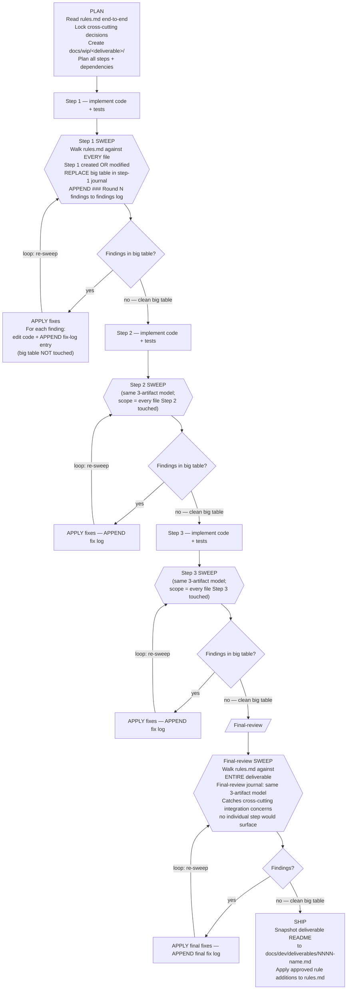

<!--
Copyright (c) DCSV. All rights reserved.
-->

<a name="top"></a>

# D2-WORX Rules

The complete, verbose, authoritative requirements for ANY code change in this repository. **Read this entire document during the PLAN phase of every deliverable** so you know upfront what you're being held to. Use it as the audit checklist after every step (looped until a pass returns zero findings) and again at final-review (scope = whole deliverable).

---

> ## ⚠️ MISSION CONTEXT — READ FIRST
>
> **D²-WORX is being built as an enterprise-level, production-ready, robust SaaS framework.** Every line of code that ships from this repository is held to that standard — not "works on my machine," not "good enough for now," not "we'll harden it later."
>
> Code that ships under this standard MUST:
> - Survive bad input, hostile input, malformed input, and oversized input without crashing or leaking
> - Survive infrastructure failure (DB down, broker unreachable, cache miss + downstream timeout, JWKS endpoint slow, network partition) gracefully — degrade, retry, circuit-break, or fail-closed; never silently swallow signal
> - Never leak PII (user input, broker URIs, presigned URLs, file names, IPs, emails, addresses, message bodies) into logs, metrics, traces, or message-broker headers
> - Survive concurrent access without races, double-fetches, deadlocks, or torn writes
> - Be testable, observable, and maintainable by future engineers who weren't in the room when it was written
> - Follow the established patterns and conventions of THIS codebase, not generic best practices from training data
>
> **If a predicate in this document feels like overkill for the task at hand, that's the discipline working — the cost of reading and applying it is minutes; the cost of skipping it is a production incident, a security disclosure, or a multi-week rework.** Don't optimize for short-term speed at the expense of robustness. The user's value is design + architectural review; the agent's value is delivering work that doesn't need user-side bug-hunting.


<sup>[↑ jump to top](#top)</sup>

---

## How to use this doc

1. **PLAN phase** — read end-to-end. Understanding the requirements upfront prevents architectural mistakes that cost rework later.
2. **Pre-execute pass** — before writing each step's code, walk the categories with intent: which predicates apply to this step? Surface the relevant ones in the step journal under "Pre-emptive gate checks" so you write code that passes the audit on round 1.
3. **Audit loop** — after writing the code, walk every category, every predicate. Answer Y/N with required evidence (grep results, file:line lists, "checked X by Y, found Z"). Vibes are not evidence. Findings get fixed in the same round; the next round runs against post-fix state. Loop until a round produces zero findings across every category. 10-iteration ceiling per scope; iteration 11 means escalate to user.
4. **Final-review** — same loop, scope = whole deliverable. Catches cross-step inconsistencies.

> **Verbose by design.** Every predicate exists because of a real past failure. The cost of reading the catalog is minutes per round; the cost of skipping a predicate is a future audit round (or a bug shipped). New predicates get appended at deliverable ship via the self-improvement loop ([workflow.md](workflow.md) §SHIP).

> **Companion docs**: [workflow.md](workflow.md) (the loop protocol), [deliverables/](deliverables/) (past final reports + lessons), [../PATTERNS.md](../PATTERNS.md) (what each pattern IS — this doc enforces THAT they're followed).

## Table of contents

**Code-quality categories** (the 23 categories the audit walks against the code):

1. [Test Discipline](#1-test-discipline)
2. [Bug-Fix Regression Testing](#2-bug-fix-regression-testing)
3. [PII / Logging Safety](#3-pii--logging-safety)
4. [Concurrency / Race Conditions](#4-concurrency--race-conditions)
5. [C# Code Conventions](#5-c-code-conventions)
6. [TypeScript / SvelteKit Code Conventions](#6-typescript--sveltekit-code-conventions)
7. [Naming, File Headers, Folder Casing](#7-naming-file-headers-folder-casing)
8. [Build & Tooling Hygiene](#8-build--tooling-hygiene)
9. [Architectural Layer Hygiene](#9-architectural-layer-hygiene)
10. [Security (Endpoints / Auth / Secrets / Input)](#10-security-endpoints--auth--secrets--input)
11. [Documentation Parity & Best Practices](#11-documentation-parity--best-practices)
12. [i18n Discipline](#12-i18n-discipline)
13. [Permission / Action Discipline](#13-permission--action-discipline)
14. [Phase / Audit / Conversation Verbiage Hygiene](#14-phase--audit--conversation-verbiage-hygiene)
15. [Object Disposal & Resource Lifetime](#15-object-disposal--resource-lifetime)
16. [OOTB Shared-Lib Tooling — Use What's There](#16-ootb-shared-lib-tooling--use-whats-there)
17. [D2Result Usage & Extensions](#17-d2result-usage--extensions)
18. [Graceful Degradation & Failure Modes](#18-graceful-degradation--failure-modes)
19. [User Experience (UX)](#19-user-experience-ux)
20. [Developer Experience (DX)](#20-developer-experience-dx)
21. [Observability Completeness](#21-observability-completeness)
22. [Idempotency & Exactly-Once Semantics](#22-idempotency--exactly-once-semantics)
23. [Configuration Hygiene](#23-configuration-hygiene)

**Meta categories** (govern HOW the audit documents itself + how the deliverable closes out):

24. [Audit Evidence Discipline (meta — how to audit)](#24-audit-evidence-discipline-meta--how-to-audit)
    - [Three-artifact journal model](#three-artifact-journal-model-one-big-table--append-only-findings-log--append-only-fix-log)
    - [Predicates §24.0 – §24.12](#predicates)
    - [Deliverable workflow chart — order of operations with loops](#deliverable-workflow-chart--order-of-operations-with-loops)
    - [Deliverable completeness checklist (the gate before user review)](#deliverable-completeness-checklist-the-gate-before-user-review)
    - [Loop count expectations](#loop-count-expectations)

**Process** (catalog growth + closing notes):

- [Self-improvement loop](#self-improvement-loop)
- [Final reminder](#final-reminder)


<sup>[↑ jump to top](#top)</sup>

---

## 1. Test Discipline

The #1 cost driver of multi-pass audits is "thin glue" code (DI extensions, gRPC plumbing, factory wrappers, source-generator emitters) shipped without tests. Every public path needs at least one test on the FIRST pass.

### Predicates

- **1.1** Does every `public` method introduced in this scope have ≥1 test?
  - Evidence: `<method qualified-name> -> <test file:line>` for each, or "no public methods in scope."
  - **Why**: Real example — `GrpcClientBuilderExtensions.AddD2ServiceIdentity()` shipped with an unused `<TClient>` generic; no test exercised the call so the bug hid until a second audit pass. Same round: OIDC `ConfigurationManager` was constructed via the 2-arg ctor that uses a static default `HttpClient` instead of our `IHttpClientFactory` — no test verified our HttpClient was actually being used.
  - **How**: "hard to test in isolation" is a smell, not an excuse. Find a way: compile-time test (existence of test file proves call shape compiles), DI smoke test, runtime registration assert.

- **1.2** Does every test cover the happy path AND at least one adversarial input (null / empty / whitespace / oversized / malformed / wrong type / wrong format / boundary value)?
  - Evidence: per-test, list of input categories exercised.
  - **Why**: Happy-path-only tests pin behavior under good input but not under garbage input — which is what production actually delivers. An enterprise framework MUST survive malicious / malformed / accidental garbage gracefully.

- **1.3** Are all DI extension methods (`Add*`, `Use*`, `Configure*`) tested via composition resolution (build a `ServiceProvider`, resolve the registered service, assert shape)?
  - Evidence: `<extension method> -> <test file:line that resolves it>`.

- **1.4** Are all gRPC client/server registration helpers tested (call shape compiles + dispatches)?
  - Evidence: `<helper> -> <test that calls through it>`.

- **1.5** Are all source-generator emitters covered by snapshot tests (input spec → expected source, AST-equivalent)?
  - Evidence: emitter → snapshot test file.

- **1.6** Do reflection-based tests pin every `[LoggerMessage]` partial-method signature against accepting `Exception` (since `ex.Message` leaks broker URIs / user input)?
  - Evidence: `<partial method> -> <reflection test asserting param list>`.
  - **Pattern**: `Phase8FixVerificationTests.F3F4L5_LogDelegate_DoesNotTakeRawException` was the canonical one (now redistributed to `Telemetry/LoggerMessageDelegateContractTests.cs`).

- **1.7** Are all factory wrappers (`From*` static methods on records / classes) tested with both happy and degenerate inputs?
  - Evidence: list factory → test.

- **1.8** Do test method names use **behavior-descriptive** names? No `F2_`, `AuditN_`, `PhaseN_`, `Audit{Letter}_`, `R5_`, `H4_`, `M2_`, `L3_`, `O1_`, `S2_`, `Q1_`, combo labels like `F3F4L5_`.
  - Evidence: `grep -rEn 'public[[:space:]]+(async[[:space:]]+)?(void|Task|ValueTask)[[:space:]]+(Audit[0-9]+_|Audit[A-Z]_|Phase[0-9]+_|[HMFLORSQ][0-9]+_|F[0-9]+F[0-9]+L[0-9]+_)' <test files>` returns empty.
  - **Why**: future readers don't care which audit pass added the test — they care what behavior it pins.

- **1.9** Are test files named after the FEATURE they cover, not the audit round? Forbidden: `Phase*Tests.cs`, `*Audit*Tests.cs`, `*Sweep*Tests.cs`, `*Round[0-9]*Tests.cs`, `AuditFixesRegressionTests.cs`, `SecondAuditFixesRegressionTests.cs`.
  - Evidence: `git ls-files` against the forbidden glob set returns empty.

- **1.10** Does the test project's `<ProjectReference>` graph include every new lib introduced in this scope?
  - Evidence: list new libs → `<ProjectReference>` line in test csproj.

- **1.11** Do integration tests exist for behaviors that genuinely need them (race conditions, broker behavior, DB constraint behavior, end-to-end gRPC dispatch, Redis pub/sub backplane, multi-instance coordination)? Unit tests against mocks aren't enough for those.
  - Evidence: per integration-needing behavior → integration test file.

- **1.12** Do tests cover graceful degradation under outages (DB unavailable, broker unreachable, cache miss + downstream timeout, JWKS endpoint slow, OIDC discovery failure)?
  - Evidence: per graceful-degradation behavior → test.

- **1.13** Are private helpers made `internal` (with `[InternalsVisibleTo]`) when needed for direct unit testing rather than fragile end-to-end tests?
  - Evidence: per `internal` promotion → corresponding test + `InternalsVisibleTo` attribute.

- **1.14** Do tests use `Random.Shared` (thread-safe) instead of `new Random()` for any randomness?
  - Evidence: `grep -rEn 'new Random\(' tests/` → expect zero.

- **1.15** Are test fixtures (counter listeners, HTTP message handlers, time providers) one-type-per-file under `Fixtures/`?
  - Evidence: per fixture type → dedicated file.

- **1.16** Do test fixtures that touch the file system, env vars, or network use ISOLATED paths (TempDir, explicit non-existent file names, mocked env, sandboxed network)? Tests MUST NEVER load real-environment data into the test process.
  - Evidence: per file-system / env-var / network-touching fixture → isolation mechanism.
  - **Why**: a test that calls `.env`-discovery with default file names will walk up the working directory to the repo root and silently load `.env.secrets` into the test process state — real secrets in test process memory, cross-test contamination, log-grep exposure surface. Same class: tests that resolve `IConfiguration` from a real file, hit a real localhost port, or call into `Environment.GetEnvironmentVariable` without a fixture-scoped override.
  - **Pattern**: pass an explicit non-existent file name (so discovery short-circuits cleanly) OR scope to a `TempDir` fixture OR mock the env-var accessor.
  - **Critical security gap class.**

- **1.17** Tests with names of the form "X bypasses Y" / "X overrides Y" / "X wins over Y" must construct the scenario such that BOTH X and Y would individually trigger — proving the precedence, not just observing one outcome.
  - Evidence: per "bypasses" / "overrides" / "wins" test → setup confirms both predicates would fire individually.
  - **Why**: a test named `OceFromCt_BypassesTransientClassifier` that runs against a classifier which wouldn't classify `OperationCanceledException` as transient anyway passes WITHOUT actually exercising the bypass. It claims to pin the catch filter; it's actually pinning the classifier. To genuinely prove the bypass, invert the classifier (e.g. `IsTransient: _ => true`) so the test PROVES the catch filter is what bails out, not the classifier.

- **1.18** Do tests pin per-public-VALUE for every constant / enum value / static-class member (not just per-class smoke)? `nameof(X)`-captured constants need explicit wire-value `Should().Be("X")` pinning so a refactor that replaces `nameof(X)` with a literal can't silently change the wire value.
  - Evidence: per public constant / enum value → dedicated pin test (e.g. `[Theory] [InlineData(...)]` matrix or per-value `[Fact]`).
  - **Why**: a per-class smoke test that asserts "the constants exist and aren't empty" passes after a rename like `CLIENT_ID` → `clientid` because no test pins the actual wire value. Same anti-pattern: `ErrorCodes.X = nameof(X)` constants — the wire format consumed by clients, audit-log queries, alerting rules is the contract; a `nameof(X)` → literal replacement would silently change the wire value without breaking the build.

- **1.19** For libs whose runtime composition / wire-up has its own failure modes that pure unit tests cannot surface (logging pipelines, telemetry SDK setup, middleware pipelines, message-bus subscribers, hosted services with cross-component handshake), are per-step integration tests with mocked inputs MANDATORY (not optional)?
  - **Convention**: harness lives at `server/shared/dotnet/tests/Integration/<lib>/Infrastructure/`; per-feature test cases live at `server/shared/dotnet/tests/Integration/<lib>/<Feature>Tests.cs`.
  - **Preferred**: in-memory capture (e.g. an in-memory Serilog sink, an in-memory OTel exporter, a TestServer-hosted middleware pipeline) over external fakes (Testcontainers, real broker). External fakes belong to the broader integration-test bucket (§1.11), not per-step composition coverage.
  - **Negative-regression tests pin design decisions** that cross-cut runtime composition (e.g. "RemoteIp NEVER appears in the rendered log line", "the OTel resource always carries the `d2.*` attribute set", "the locked middleware order is preserved end-to-end").
  - Evidence: per wire-up-risk lib added or modified in this scope → integration test file path + test count covering the wire-up surface; per cross-cutting design decision → corresponding negative-regression test.
  - **Why**: pure unit tests against mocks pin the API surface; they do NOT pin the runtime behavior of the lib's composition. Real-world cite: a logging-enricher expansion caught Serilog 9.x's `AddPropertyIfAbsent` silently dropping `IDiagnosticContext.Set` calls for HTTP `RequestId` / `RequestPath` AFTER Serilog had pre-bound them — a design assumption (last-writer-wins) that pure unit tests against `IDiagnosticContext` would have rubber-stamped. The integration test surfaced the actual runtime behavior and forced an honest README + xmldoc correction.
  - **How**: when planning a wire-up-risk lib, the Plan section includes a "Runtime composition test plan" listing the wire-up surfaces to pin via integration tests + the negative-regression assertions to guard the design decisions. Implementation ships those tests in the same step. Distinct from §1.11 (which covers integration tests for behaviors that genuinely need real-broker / real-DB orchestration); §1.19 covers in-memory wire-up tests that must exist for the lib to be considered shippable, before any external-resource tests are even considered.

- **1.20** For test infrastructure code (parity gates, contract tests, cross-language consistency assertions, security-critical assertions), does the Implementer prove fail-path DURING execution, not at audit? At minimum: introduce 3 deliberate-drift cases against shipped tests; verify each FAILS with a useful error message naming the drifted field/value; revert + verify clean. Document each negative-validation case in the Implementer's journal entry as `negative-validation: <test name> failed when <drift introduced> with message '<excerpt>'; reverted; passed clean.`
  - **Why**: a test that always passes provides false confidence. Real-world cite: deliverable 0006's parity test infrastructure caught a TAUTOLOGICAL `PropagatedContext` parity test (round-tripped a fixture into itself) ONLY because deliberate-drift discipline was mandatory; without it, the parity gate would have shipped as a non-functional gate that always passed regardless of cross-language drift. The same hazard applies to any test that ASSERTS a contract — a security gate that always grants, a fixture comparator that always reports equal, a cross-language consistency check that compares a value to itself.
  - **How**: the Plan section explicitly enumerates the deliberate-drift cases to be introduced (3+ representative drifts spanning field-add / field-remove / value-change; 1+ cross-spec consistency negative). The Implementer captures literal stderr excerpts in the journal Implementer entry, one per drift, showing the test failed with a useful diagnostic naming the drifted field/value before being reverted. The Auditor verifies the negative-validation entries exist + the test logic is non-tautological by reading the test source (not merely trusting the journal entry).
  - **When**: applies to test infrastructure that ASSERTS contracts (parity tests, cross-spec consistency tests, fixture comparators, security gates, codegen-output validators). Does NOT apply to standard unit tests covering single-language behavior — those are §1.1 / §1.2 territory.
  - Evidence: per parity / contract / consistency test file → at least 3 negative-validation entries documented in the same Implementer round, each citing the specific drift introduced + the literal stderr excerpt showing the test failed usefully.

- **1.21** For every wire-serialized spec-driven record (any record carrying `[JsonPropertyName]` attributes — or the TS-side equivalent — for wire-protocol field naming), does the scope ship a `Serialize_WireKeysSubsetOfCatalog`-equivalent **catalog-pin structural guard test** that: (a) serializes a fully-populated instance to JSON, (b) extracts the wire-key set from the serialized output, (c) asserts every wire-key is a member of the spec-emitted `FieldNames` catalog?
  - **Evidence**: per wire-serialized record introduced or modified in scope → catalog-pin guard test file:line. Test asserts BOTH directions — every emitted key is in the catalog AND every catalog entry is reachable through some serialization path (the latter prevents catalog entries that no code path actually emits).
  - **Why**: a wire-serialized record is a contract — every public property either (a) carries `[JsonPropertyName(catalog.X)]` mapping it to a cataloged wire key, or (b) carries `[JsonIgnore]` excluding it from the wire. The structural guard mechanically enforces "no third option" — every newly-added public property MUST land in (a) or (b) or the test fails. Without it, the failure mode is silent leakage: a new public property (a computed boolean helper, a debug-convenience accessor, a refactor's accidental promotion of an internal property to public) ships with default JSON behavior — its name appears on the wire — and no compile error / no existing test catches it until production observability or a cross-language consumer surfaces the drift. Empirical cite: deliverable 0007 Step 4 discovered 17 `D2Result.Booleans.Is*` derived-helper properties + `Failed` leaking on the wire because no catalog-pin guard existed; the fix landed `D2ResultJsonShapeTests.Serialize_DoesNotLeakIsBooleanHelpers` + `Serialize_WireKeysSubsetOfCatalog` as the canonical regression. The deliverable's final-review cross-cutting verification found `DlqFailureMetadata` LACKED the same guard — same class of bug could ship undetected on the next record-shape change. The predicate codifies the catalog-pin pattern as a permanent gate so the next record-shape ship cannot recur the failure mode.
  - **How**: when adding or modifying any wire-serialized spec-driven record, ship a `Serialize_WireKeysSubsetOfCatalog` test (or rename-equivalent) ALONGSIDE the record. The test constructs a fully-populated instance (every nullable + non-nullable property assigned), serializes via the production `JsonSerializerOptions`, parses the JSON into a key set, and asserts subset-of-catalog. Pair with a `Serialize_DoesNotLeakX` style test enumerating the specific derived-helper / debug-property names that MUST stay off the wire (per §1.18 per-VALUE pin pattern — the catalog test catches structural drift; the enumerated leak test catches specific named-property regressions). When introducing a NEW catalog entry, ALSO add a per-VALUE pin test (per §1.18) that the catalog constant resolves to the expected wire string.
  - **When**: applies to every cross-language wire-serialized record (HTTP / gRPC trailers / AMQP envelope / persisted JSON blob whose schema crosses code boundaries). Distinct from §1.18 (per-VALUE pin for individual constants) — §1.21 is per-RECORD structural pin for the property set.


<sup>[↑ jump to top](#top)</sup>

---

## 2. Bug-Fix Regression Testing

Every bug fix in this scope must land with a regression test that **fails-without-fix** and **passes-with-fix** in the same change. Without it, "fixed" is unverifiable and a future refactor can silently regress the same bug.

### Predicates

- **2.1** Does every fix made during this audit loop have a regression test?
  - Evidence: per finding fixed in any round → test file:line.
  - **No fix without a test, no exceptions.**

- **2.2** Does each regression test name encode the issue (descriptive, not audit-prefixed)? Format: `<Behavior>_<Condition>` (e.g. `MarkSeenFails_MessageRoutesToDlq_HandlerNotReplayed`, `DlqDetail_DropsExceptionMessage`, `ReadAttemptCount_OnlyCountsExpiredAndRejected`).
  - Evidence: per regression test → name format check.

- **2.3** Was the regression test confirmed-failing BEFORE the fix was applied (or, when not separable, does the test comment document the fail-without-fix expectation)?
  - Evidence: per test → confirmation note in journal. Ideally the test goes in FIRST and is confirmed failing before the fix code is applied — empirical proof the test actually covers the bug.

- **2.4** Is the test type (unit / integration) appropriate for what the bug exercises?
  - PII-safety on log delegates → reflection unit test (fast, reliable)
  - Race condition / consumer pipeline behavior / cross-service interaction → integration test (real broker / real DB)
  - Composition-time validation → unit test resolving from `ServiceProvider`
  - Evidence: per test → unit/integration classification + 1-sentence justification.

- **2.5** When a private helper needed to be made `internal` (with `[InternalsVisibleTo]`) for direct testing, is that change documented in the journal as part of the fix?
  - Evidence: per `internal` promotion → journal entry.
  - **Example**: `SubscriberChannel.ReadAttemptCount` was made `internal` so x-death-reason filter could be unit-tested across 7 cases.


<sup>[↑ jump to top](#top)</sup>

---

## 3. PII / Logging Safety

User input, message bodies, presigned URLs, AMQP URIs, broker passwords, IPs, emails, addresses, names, file metadata, fingerprints — all PII. The biggest leak vector in this codebase is logging exception messages (broker libs embed credentials in their `ex.Message`).

### What counts as PII (non-exhaustive)

- Email addresses (any form, even hashed if reversible)
- Phone numbers
- IP addresses (v4 + v6)
- Geographic / location data (lat/long, addresses, city+postal beyond country)
- Names (first, last, display, business)
- User-generated content (messages, posts, descriptions, comments)
- File names, file content, file metadata
- Presigned URLs (contain credentials in query params)
- AMQP / DB / Redis connection strings (contain passwords)
- JWT tokens, session tokens, API keys, refresh tokens
- Browser fingerprints, device fingerprints
- Authentication state (user IDs in some contexts)
- Audit trail content (who did what when)

### Predicates

- **3.1** Does any `[LoggerMessage]` partial-method declaration in this scope accept `Exception` as a parameter? (Y = bug; the log sink will format `ex.ToString()` and leak `ex.Message`.)
  - Evidence: `grep -rEn '\[LoggerMessage' <scope>` → for each hit, inspect parameter list → confirm none take `Exception`.
  - **Real-example leak**: `BrokerUnreachableException.Message` embeds the AMQP URI INCLUDING the password. Same class: `OperationInterruptedException.Message` from RabbitMQ.Client includes broker-side text (PRECONDITION_FAILED arg dumps); `RedisException.Message` from StackExchange.Redis can include connection-string fragments + command details; `Npgsql.PostgresException.Message` includes row data in constraint-violation messages; ANY user-handler exception in a subscriber-isolation `catch` carries arbitrary user-input.
  - **No per-call-site carve-out.** The receiving log delegate signature IS the contract; future callers will pass real exceptions even if today's call site synthesizes a controlled one (e.g. `new InvalidOperationException(result.ErrorCode ?? "unknown")`). The next refactor that adds an inline-catch site through the same delegate inherits the leak risk for free.
  - **Carve-out** (rare, must be pinned by a contract test): `ContinueWith`-only fault sinks where the handled exception path NEVER sees user-input-derived content (e.g. unobserved background-task faults). When a delegate has BOTH a sanitized inline-catch site AND a fault-sink ContinueWith site, SPLIT it into two delegates with separate names so each shape is independently pinned — never share.
  - **Canonical enforcement**: a reflection-based contract test (`LeakProneLogDelegates` `TheoryData` listing every leak-prone delegate + per-delegate carve-out `[Fact]`s for the explicit fault-sink exceptions). See `tests/Unit/Messaging/Telemetry/LoggerMessageDelegateContractTests.cs` for the pattern.

- **3.2** Does any `try/catch` log `ex.Message` directly (string interpolation, structured field, format arg) without going through a sanitized renderer (e.g. `SanitizedExceptionRender.TypeName(ex)` + `FirstFrame(ex)`)?
  - Evidence: `grep -rEn 'ex\.Message\|exception\.Message' <scope>` → per hit, classify safe/unsafe.
  - **Pattern**: emit `TypeName` + `FirstFrame` as separate structured fields; never the raw `Message`.

- **3.3** Does any logged structured field carry user input (email, IP, address, message body, AMQP URI, presigned URL, file name) without `[RedactData]` on its declaring type?
  - Evidence: per logged field → type declaration → `[RedactData]` check.
  - **How**: `[RedactData]` lives on the type, applies to ALL Serilog logging recursively, reflection-cached. Don't reach for per-handler RedactionSpec when `[RedactData]` does the job.

- **3.4** Does any AMQP message header carry sensitive context plaintext (instead of being inside the encrypted `ContextEnvelope` payload)? (Brokers store headers as plaintext at-rest.)
  - Evidence: per `IBasicProperties.Headers` write → classify field as routing-only (W3C `traceparent`/`tracestate`) or context.
  - **Sensitive context → encrypted envelope.** Routing tracing → plaintext header.

- **3.5** Does any OTel span attribute or metric tag carry PII?
  - Evidence: per `Activity.SetTag` / `Counter.Add(..., new TagList { ... })` → classify each tag value.
  - **Allowed**: outcome (`success` / `fail` / `not_found`), code-path identifiers, error categories. **Forbidden**: emails, IPs, names, message bodies.

- **3.6** Does any test fixture log a raw exception via a code path that production also reaches?
  - Evidence: walk test fixtures touching `ILogger` → confirm no production code path shares the same logging sink.

- **3.7** Are user-input strings (HTTP body, query params, JWT claim values, message payloads) length-validated upstream of any storage / log emission?
  - Evidence: per user-input boundary → length-validation call site (e.g. `MAX_AUDIENCE_LENGTH` checks, `_MAX_JWT_PAYLOAD_SEGMENT_LENGTH` cap on token-exchange).

- **3.8** Does sign-out / logout clear ALL auth state (server session via Auth, in-memory JWT invalidation, SvelteKit `invalidateAll()`, Redis session entries, cookie cache)?
  - Evidence: per sign-out path → trace each surface.

- **3.9** Are API key / secret / token comparisons constant-time (`CryptographicOperations.FixedTimeEquals`)? Plain `==` is a timing-attack vector.
  - Evidence: per `apiKey == ` / `secret == ` / `token == ` → switch to `FixedTimeEquals`.

- **3.10** Does client-side telemetry (Faro user identity) include only `userId` + `username`? No email, real name, contact details?
  - Evidence: per Faro identity setter → fields confirmed.

- **3.11** Was `Grep` run against `secrets/` or `.env.secrets` by name? (Behavioral rule — never grep these.)
  - Evidence: tool-call history check → expect no hits.
  - **If a secret accidentally enters context** (runtime output, grep match), STOP and tell the operator immediately so they can rotate the exposed value.

- **3.12** When a presigned URL is generated, does it have the shortest reasonable TTL? (Long TTLs become long-lived secrets.)
  - Evidence: per presigned URL generation → TTL value + justification.

- **3.13** Are tokens / secrets / fingerprints in flight always encrypted (TLS) and at rest in cache layers always treated as sensitive (encrypted in Redis where possible; ephemeral TTL otherwise)?
  - Evidence: per cache write of token → encryption + TTL confirmed.

- **3.14** Do log messages include enough context to debug WITHOUT including PII? (e.g. log `userId` hash + outcome instead of `email`.)
  - Evidence: per log message in scope → information sufficiency vs PII trade-off documented.


<sup>[↑ jump to top](#top)</sup>

---

## 4. Concurrency / Race Conditions

The bugs that don't fail unit tests because unit tests are sequential.

### Predicates

- **4.1** Does any `Singleflight.ExecuteAsync` body re-check the cache inside the singleflight before doing the expensive operation?
  - **Race**: lookup → miss → singleflight → ALSO miss because no recheck → double-fetch.
  - Evidence: per singleflight call site → confirm cache-recheck inside body.

- **4.2** Does any "atomic" operation on a distributed cache use a real atomic primitive (`SET NX`, `EVAL` Lua, transaction), or is it a sequence of non-atomic ops that look atomic in isolation?
  - Evidence: per atomic-claimed op → primitive used.

- **4.3** Does any code holding multiple locks document the lock acquisition order (preventing AB / BA deadlock)?
  - Evidence: per multi-lock site → ordering doc.

- **4.4** Does every backplane subscriber unsubscribe on dispose? (Otherwise subscriptions leak across test runs and the second test sees the first test's events.)
  - Evidence: per subscribe → corresponding unsubscribe in `IAsyncDisposable.DisposeAsync`.

- **4.5** Does every `IHostedService` respect the cancellation token in its loop body (not just at loop entry)?
  - Evidence: per hosted service → token check inside body.
  - **Specifically**: `await Task.Delay(interval, ct)` not `await Task.Delay(interval)` then check.

- **4.6** Is any `ValueTask` awaited more than once? (Documented antipattern — call `.AsTask()` once, store the `Task`, reuse.)
  - Evidence: per `ValueTask` field/local → call count check.

- **4.7** Is any code using `new Random()` instead of `Random.Shared`? (Latter is thread-safe.)
  - Evidence: `grep -rEn 'new Random\(' <scope>` → expect zero.

- **4.8** Does any database write happen WITHOUT a transaction when multiple rows are coordinated?
  - Evidence: per multi-row write → `BeginTransactionAsync` confirmed.

- **4.9** Does any cache write that needs cluster-wide L1 invalidation use the `*AndBroadcast*` variant (publishes on backplane)?
  - Evidence: per cache-write → confirm broadcast variant when other instances cache the same key.

- **4.10** Are HTTP retries idempotent? (Non-idempotent operations need an idempotency key, not just retry-on-failure.)
  - Evidence: per HTTP-retry config → idempotency strategy.

- **4.11** Does any `Task.Run` / `ConfigureAwait(false)` pattern correctly preserve / drop the synchronization context as appropriate for ASP.NET Core / library code?
  - Evidence: per `ConfigureAwait` site → correct choice.
  - **In library code**: `ConfigureAwait(false)`.
  - **In ASP.NET Core handler code**: omit (defaults work).

- **4.12** Does any code mutate shared state (static field, singleton DI service field) without a lock / `Interlocked` / `Volatile.Read`/`Write`?
  - Evidence: per static / singleton mutation → synchronization primitive confirmed.

- **4.13** When holding a lock, is the duration minimized (no I/O, no async-await, no allocation in the critical section when avoidable)?
  - Evidence: per `lock` body → I/O / await / allocation audit.

- **4.14** Does shutdown of any `IHostedService` complete in finite time? (No infinite loop without ct check; no `await Task.Delay(Timeout.InfiniteTimeSpan)` without ct.)
  - Evidence: per hosted service → shutdown trace within 30s SIGTERM grace period.

- **4.15** Do consumer / publisher channels handle reconnect cleanly? (Per `ChannelPool` / `IConnection` rebuild paths.)
  - Evidence: per channel use → reconnect scenario tested.

- **4.16** Are dictionaries / sets accessed concurrently using `ConcurrentDictionary` / `ConcurrentBag` / similar — NOT plain `Dictionary` / `HashSet` with manual locking unless justified?
  - Evidence: per concurrent collection use → type confirmed.

- **4.17** Are row-update operations that other writers may also touch protected with optimistic concurrency (rowversion / `xmin` / version column / `[ConcurrencyCheck]`)? Is `DbUpdateConcurrencyException` caught and converted to `D2Result.Conflict()` (or retried with backoff for idempotent updates)?
  - **Why**: without this, two concurrent writers can clobber each other (last-write-wins), losing data or invariants. Real example: F7.5 M2 audit fix on `IntakeFile` — concurrent intake of the same file lost the earlier write.
  - Evidence: per row-update handler → concurrency token + exception mapping confirmed.

- **4.18** Is fire-and-forget background work (raw `Task.Run` / `_ = SomeAsync()` / unmonitored async) avoided in favor of explicit hosted services or background queues?
  - **Why**: fire-and-forget swallows exceptions silently, doesn't respect SIGTERM, and obscures observability. F7.5 M3 audit fix found "raw upload cleanup fire-and-forget" — failure surfaced only via storage growing unboundedly.
  - **Allowed**: when truly best-effort AND failures are logged AND the operation has no business correctness impact. Document the "best-effort" choice in the call-site comment.
  - Evidence: per non-awaited async invocation → category (allowed best-effort with logging / use hosted service / use background queue).


<sup>[↑ jump to top](#top)</sup>

---

## 5. C# Code Conventions

The set of in-language rules that show up everywhere. Memory of these is the difference between first-pass clean and round-3 cleanup.

### Null / empty / parse helpers (highest-frequency)

- **5.1** Are all null / empty / whitespace / `Guid.Empty` checks using `Falsey()` / `Truthy()` extensions from `D2.Shared.Utilities.Extensions`?
  - **Forbidden**: `string.IsNullOrEmpty(s)`, `string.IsNullOrWhiteSpace(s)`, `coll is null || coll.Count == 0`, `coll?.Any() != true`, `guid == Guid.Empty`, `s != null && s != ""`.
  - **Required**: `s.Falsey()`, `coll.Falsey()`, `guid.Falsey()` (and `Truthy()` inverses) — they handle null themselves so never combine with `is null` checks. After early return on `Falsey()`, use `value!` (one of the few valid `!` uses).
  - **Also forbidden**: redundant size check after `.Falsey()` (`coll.Falsey()` already covers null + empty; a follow-up `coll.Count == 0` is dead code).
  - Evidence: `grep -rEn 'IsNullOrEmpty\|IsNullOrWhiteSpace\|== Guid\.Empty' <scope>` → expect zero (or justify each).
  - **Where defined**: `D2.Shared.Utilities.Extensions` — `StringExtensions.cs`, `GuidExtensions.cs`, `EnumerableExtensions.cs`.

- **5.2** Are all `TryParse` patterns using `D2.Shared.Utilities.Extensions` (`str.TryParseTruthyNull(out Guid? r)` / `str.TryParseTruthyNull<TEnum>(out var r)`)?
  - **Forbidden**: hand-rolled `if (str is not null && Guid.TryParse(...))` / `Enum.TryParse<T>(...)`.
  - **Required**: the extension that collapses null/empty/whitespace/Guid.Empty/unparseable → `null` in one call.
  - Evidence: `grep -rEn 'Guid\.TryParse\|Enum\.TryParse' <scope>` → for each, justify or convert.
  - **Applies**: hand-written code AND codegen emitter output. When MutableEmitter / TKEmitter / ScopesEmitter generate code that touches strings or Guids, the emission should produce code that calls these extensions.

- **5.3** Are all `D2Result` failure constructions using semantic factories (`Ok`, `Created`, `NotFound`, `Unauthorized`, `Forbidden`, `ValidationFailed`, `Conflict`, `ServiceUnavailable`, `UnhandledException`, `PayloadTooLarge`, `Canceled`, `SomeFound`)?
  - **Forbidden**: raw `Fail()` with manual `statusCode` when a factory exists.
  - **Allowed**: raw `Fail` ONLY when no factory matches (e.g. re-mapping arbitrary upstream status codes).
  - Evidence: `grep -rEn '\.Fail\(' <scope>` → per hit, justify or convert.
  - **Partial-success pattern**: `NOT_FOUND` (none found) → `SOME_FOUND` (partial, data returned) → `OK` (all found).
  - **If a typed/generic semantic factory is missing** that should exist (e.g. `D2Result<T>.ServiceUnavailable()`): that's a bug in `D2.Shared.Result`, not a justification for raw `Fail`. Add the factory.

- **5.4** Does code at boundaries (proto/DB/external) use `.ToNullIfEmpty()` instead of letting `""` survive into domain types?
  - Evidence: per boundary → `ToNullIfEmpty` confirmed.
  - **Returns**: `null` if the string is null, empty, or whitespace-only (trims first).

- **5.5** Is `string.Empty` used everywhere instead of `""` (StyleCop SA1122)?
  - Evidence: build clean confirms.

### Syntax and structure

- **5.6** Are extension methods using C# 14 extension-members syntax (`extension(T target) { ... }`) instead of the old `this T` parameter style?
  - Evidence: per new extension → syntax confirmed.

- **5.7** Are all concrete classes / records / exceptions / attributes marked `sealed`?
  - **Carve-outs**: (1) types that are explicit base classes for other types in the codebase (e.g. `D2Result` stays unsealed because `D2Result<TData>` derives from it); (2) static classes (already implicitly sealed). Applies to test classes too (xUnit instantiates reflectively but does not subclass).
  - **Why**: enables JIT devirtualization on virtual / interface call sites and signals "this is not an extension point." Unsealing later is cheap; sealing retroactively is not.
  - Evidence: per new concrete type → `sealed` confirmed or carve-out documented.

- **5.8** Are single-line `if`/`while`/`for`/`foreach` bodies WITHOUT braces, and multi-line bodies WITH braces?
  - **Rule**: visually multi-line bodies (body wraps onto multiple lines because the body itself wraps, or a constructor / method call breaks across lines) ALWAYS get braces, regardless of how many statements they logically contain.
  - **Why**: a multi-line body without braces lets the next sibling statement visually merge with the body — the C dangling-`else` footgun, real source of bugs when refactoring.
  - **Two acceptable brace-less forms — use one or the other, no in-between**:
    - **Form A — single line**: `if (cond) return foo;` — entire if + body on one source line. No padding required (this is the standard guard-clause pattern at the top of methods).
    - **Form B — two-liner with `if` on its own line**: permitted ONLY with blank lines BOTH above AND below the if-block. The brace-less body needs visual breathing room; without padding, the body reads as a continuation of the surrounding sequential code.
    - Three-or-more-line bodies (or wrapped/multi-line bodies) MUST have braces — SA1519 already enforces this.
  - Evidence: spot-check new control flow; `grep -rEn '^[[:space:]]+if[[:space:]]\([^)]+\)[[:space:]]*$' <scope>` finds Form-B candidates whose padding then needs visual verification.

- **5.9** Is `this.` qualifier absent? (Codebase doesn't use it; field prefixes already disambiguate.)
  - Evidence: `grep -rEn 'this\.' <scope C# files>` → expect zero in introduced code.

- **5.10** Is `namespace` declared BEFORE `using` directives in every `.cs` file? (Codebase convention: file-scoped `namespace X;` on line N, blank line, then `using` block.)
  - Evidence: per new `.cs` file → ordering confirmed.

### Records, collections, options patterns

- **5.11** Are entities using `record` types with `required init` properties + empty collection initializers (`[]`)?
  - Evidence: per new entity → record + `required init` + collection-expression defaults.

- **5.12** Are collection expressions (`[a, b, c]` / `[]`) used instead of `new T { ... }` / `new[] { ... }` / `Array.Empty<T>()`?
  - **Required when** target type is `IEnumerable<T>` / `IReadOnlyList<T>` / `IList<T>` / `T[]` / `Span<T>` (or any constructible collection). Compiler picks the best concrete type for the slot (often a stack-allocated span or a single allocation) and call sites read at half the noise level.
  - **Allowed**: explicit `new List<T>()` / `new T[N]` when you need that exact concrete type, a specific capacity hint, or a mutable list reference.
  - **Hot-spots**: defaults for `IReadOnlyList<T>` parameters, fallback values in ternaries (`x ? values : [defaultValue]`), single-item array args.
  - Evidence: per collection literal → expression form.

- **5.13** Do small Options records (≤4 properties) use the nullable-param ctor + `?? default` body pattern? Pattern at canonical `D2.Shared.Resilience.CircuitBreaker.CircuitBreakerOptions`.
  - **Shape**: parameterized ctor with EVERY param nullable + `?? default` body assignment, plus a parameterless ctor that chains `: this(null, null, ...)` to inherit defaults. Yields `new(failureThreshold: 3)` / `new()` / `new(3, TimeSpan.FromSeconds(5))` call sites.
  - **For 5+ properties**: stay on init-only properties + object initializer (positional ordering becomes hard to read).
  - **Sentinel-free**: explicit non-null values (including `0` / `TimeSpan.Zero`) pass through unchanged.
  - Evidence: per new Options record → pattern confirmed.

- **5.14** Are nullable types used for optional domain fields (`string?`, `bool?`, `int?`, `DateTime?`)? Never `= string.Empty` on optional record properties. `null` = "not provided."
  - Evidence: per optional field → `?` form + no empty-string default.

### Async / threading / asynchrony

- **5.15** Is `ValueTask` not awaited more than once? (Cross-ref §4.6.)

- **5.16** Are async methods consistently named with the `Async` suffix?
  - Evidence: per async method → suffix confirmed.

- **5.17** Are `await`-ed calls passed a `CancellationToken` whenever the API supports it?
  - Evidence: per `await` of a ct-accepting API → ct passed.

### Public-API surface

- **5.18** Do all `public` types / methods have XML doc comments?
  - **Format**: `<summary>`, `<param>`, `<returns>`, `<exception>` as appropriate. Wrap onto multiple lines if needed for line-length compliance.
  - **Synchronously-invoked callback parameters** (`onX`, `onSomething`, `Action<>` / `Func<>` ctor args invoked inside `lock` / on the calling thread) MUST document throw-behavior in their XML `<param>` block — specifically, what happens to the upstream exception if the callback throws. Default platform behavior is "the thrown exception REPLACES the upstream exception that triggered the invocation" — a buggy logger inside the callback can silently swap a meaningful "TimeoutException from upstream X" for "InvalidOperationException from logger" and make outage diagnosis painful. Document loudly so callers wrap in their own try/catch (or stick to log/metric calls that won't throw).
  - Evidence: per new public symbol → `<summary>` confirmed; per callback param → throw-behavior `<para>` block confirmed.

- **5.19** Does each handler implement its declared interface (for DI registration)?
  - Evidence: per new handler → interface implementation confirmed.

### Regex (ReDoS discipline)

- **5.20** Do `[GeneratedRegex]` patterns classify into the right backtracking bucket and apply timeout discipline accordingly?
  - **Bucket 1 — no backtracking → NO timeout.** Single greedy quantifier with no following pattern (`\s+`); single char-class match with no quantifier (`[^\d]`, `[^\p{L}\p{N}\s\-'.,]`); quantifier whose char class is disjoint from the next required token (`\w+\}` — `\w` can't match `}`).
  - **Bucket 2 — linear backtracking AND input upstream-bounded → NO timeout.** Greedy quantifier followed by an overlapping required token, but each backtrack attempt is O(1) and total attempts grow at most linearly with input length. Example: `[^@\s]+\.[^@\s]+`. Document the linear-time guarantee + the input-length assumption in the pattern's XML doc so future-you can audit when adding new call sites.
  - **Bucket 3 — super-linear backtracking → set tight `matchTimeoutMilliseconds` (10–25 ms) AND pre-warm the JIT.** Nested quantifiers (`(a+)+`, `(a*)*`); alternation with overlap (`(a|aa)+`); polynomial / exponential backtracking. Pre-warm via `static readonly bool sr_jitWarmedUp = WarmUpHelper();` field initializer so first user-visible call doesn't pay JIT cost inside the timeout window.
  - **Document the bucket** in the pattern's `<summary>`. A pattern change that promotes Bucket-1/2 → Bucket-3 needs a timeout + pre-warm added in the same edit.
  - **Why**: ReDoS attacks rely on super-linear backtracking. A *tight* timeout on linear patterns occasionally fails under GC pauses / scheduling jitter even on sub-microsecond matches.
  - Evidence: per new `[GeneratedRegex]` → bucket classification + matching timeout discipline.

### Build cleanliness (zero tolerance)

- **5.21** Does `dotnet build server/D2.slnx` produce zero StyleCop (SA****), CS**** warnings, null ref warnings? Never suppress with `#pragma warning disable`, `!` (for silencing warnings), or analogous.
  - Evidence: build output.

- **5.22** Does `jb inspectcode server/D2.slnx --severity=WARNING` produce zero JetBrains/Rider warnings? (Catches `[MustDisposeResource]` misuse, captured variable/closure issues, `AccessToModifiedClosure`, `AccessToDisposedClosure` — invisible to `dotnet build`.)
  - Evidence: inspectcode output.

- **5.23** Are ALL warnings/errors encountered ANYWHERE in the project fixed (zero-tolerance)? Never dismiss as "pre-existing."
  - Evidence: `git diff main` cross-check confirms no leftover warnings.

- **5.24** Foundational shared libs (the lib that DEFINES a convention) MUST eat their own dogfood. The lib that exports `Falsey()` cannot use `string.IsNullOrEmpty` internally; the lib that exports `TryParseTruthyNull` cannot hand-roll `Guid.TryParse` + null check; the lib that exports the `[RedactData]` attribute cannot log raw user input. Foundation libs are the strictest dogfood site in the codebase — any lib that publishes a "use this not that" helper must be the canonical demonstration of using it.
  - Evidence: when auditing a foundation lib, grep its OWN source for the forbidden patterns the convention prohibits; expect zero hits.

- **5.25** Does production code that emits codegen'd member names (Serilog diagnostic-property keys, OTel span-tag keys, OTel metric-tag keys, JSON field names that mirror an interface property, telemetry counter labels, AMQP header names that mirror a domain property) use `nameof(SourceOfTruthType.Member)` rather than raw string literals?
  - **EXEMPTION**: spec-pinning tests that explicitly assert "this exact name exists on the wire" KEEP literal strings — the literal IS the pin. Same exemption applies to constants whose literal value IS the wire format (e.g. JWT claim-type constants, OAuth scope constants, AMQP exchange names) — those are spec-anchored and should never be `nameof`-derived.
  - Evidence: `grep -rEn 'diagnosticContext\.Set\("|Activity\.SetTag\("|AddTag\("|new TagList \{ \{ "' <production scope>` returns zero raw-literal hits where a `nameof(IInterface.Member)` form would compile. Test files that intentionally pin literal wire values are exempted in the per-row N/A reason.
  - **Why**: raw literals defeat compile-time rename safety. When the source-of-truth member is renamed (e.g. `IRequestContext.SessionId` → `IRequestContext.UserSessionId`), every raw literal `"SessionId"` in production emission code silently drifts to the WRONG wire value while still compiling. Loki / Tempo / Elasticsearch queries that filtered on `SessionId` continue to work for old log lines; new log lines emit the new name; operators see a partial-data outage with no compile-time signal. `nameof(IRequestContext.UserSessionId)` makes the rename surface as a build break in every emission site, forcing an explicit migration decision.
  - **How**: when emitting a structured-log property, span tag, metric tag, JSON field, or any other wire-format key that mirrors a domain interface member, use `nameof(IInterface.Member)` not the raw string literal. Spec-pinning tests that assert "the literal `\"SessionId\"` appears in the rendered output" stay literal (the pin is the entire point). When in doubt, the rename test is: "if I rename the source-of-truth member tomorrow, do I want this site to break the build?" If yes → `nameof`. If no → literal is correct.


<sup>[↑ jump to top](#top)</sup>

---

## 6. TypeScript / SvelteKit Code Conventions

### Predicates

- **6.1** Is TypeScript `strict` mode enabled in every `tsconfig.json`?
  - Evidence: per `tsconfig.json` touched → `"strict": true` confirmed.

- **6.2** Are type-only imports using `import type { ... }` syntax?
  - Evidence: per import touching only types → `import type` form.

- **6.3** Is `undefined` preferred over `null` for "absent" semantics? Use optional syntax (`field?: string`) instead of `field: string | null`.
  - **Exception**: explicit three-state semantics for pre-auth flags (`boolean | null`).
  - Evidence: per new optional field → `?: T` form (not `T | null`).

- **6.4** Is `truthyOrUndefined()` used at boundaries (user input, DB rows, proto values → domain types)? Returns `undefined` if the string is null, empty, or whitespace-only.
  - Evidence: per boundary → call confirmed.

- **6.5** Do Zod schemas use `.optional()` (not `.nullable()` / `.nullish()`) for domain-aligned validation?
  - **Why**: domain types use `?: T` (undefined), so Zod must match.
  - Evidence: per new Zod schema → `.optional()` form.

- **6.6** Does `pnpm exec svelte-check` produce zero errors / warnings in `server/web/`?
  - Evidence: command output.

- **6.7** Does `pnpm exec eslint .` produce zero warnings in `server/web/`?
  - Evidence: command output.

- **6.8** Does `pnpm exec prettier --check .` produce zero formatting failures in `server/web/`?
  - Evidence: command output.

- **6.9** Were diagnostics checked via `mcp__cclsp__get_diagnostics` after every TS edit?
  - Evidence: tool-call history shows diagnostic checks.

### SvelteKit BFF specifics

- **6.10** Are REST client modules the ONLY place that calls `fetch`? Components and pages call client functions, never `fetch("/api/...")` directly.
  - **Layout**: `$lib/client/rest/*-client.ts` modules expose per-feature client API and own credentials / headers / timeouts; `$lib/shared/rest/` holds isomorphic low-level helpers (e.g. `gateway-response.ts` — gateway response parser used by both server-side and browser-side clients). Raw `fetch()` allowed inside `$lib/shared/rest/` helpers AND inside `*-client.ts` files; NOT in components, pages, or any other path.
  - Evidence: `grep -rEn 'fetch\(' <scope>` → per hit, classify (allowed/forbidden).

- **6.11** Do components displaying async or server-loaded data show a `<Skeleton>` placeholder until the data is ready?
  - Evidence: per new async-data component → Skeleton confirmed.

- **6.12** Does every navigation use `resolve("/path")` from `$app/paths` instead of bare `href="/path"` / `goto("/path")`? (Without this, i18n locale routing breaks for non-default locales.)
  - Evidence: `grep -rEn 'href="/\|goto\("/' <scope>` → per hit, confirm `resolve` wrap or justify.

- **6.13** Are query strings appended outside the typed pathname call? `` `${resolve("/path")}?key=value` `` (NOT inside `resolve(...)`).
  - Evidence: per query-string usage → form confirmed.

- **6.14** Is the SvelteKit BFF pure SSR? (Browser → Edge directly for auth state mutations. Server-side route guards (`requireAuth`, `requireOrg`, etc.) at `server/web/src/lib/server/auth/`. Browser-side `authClient` at `server/web/src/lib/client/auth/`.)
  - Evidence: per new auth surface → location confirmed.


<sup>[↑ jump to top](#top)</sup>

---

## 7. Naming, File Headers, Folder Casing

### C# Naming

- **7.1** Do C# identifiers follow the convention table?

| Element | Convention | Example |
|---|---|---|
| Classes/Records/Interfaces | `PascalCase` | `GetReferenceData` |
| Methods/Properties | `PascalCase` | `HandleAsync` |
| Private instance fields | `_camelCase` | `_memoryCache` |
| Private readonly instance fields | `r_camelCase` | `r_getFromMem` |
| Private static fields | `s_camelCase` | `s_instance` |
| Private static readonly fields | `sr_camelCase` | `sr_activitySource` |
| Static readonly (non-private) | `SR_PascalCase` | `SR_ActivitySource` |
| Private constants | `_UPPER_CASE` | `_BATCH_SIZE` |
| Public/Internal constants | `UPPER_CASE` | `MAX_ATTEMPTS` |
| Local constants (tests) | `snake_case` | `expected_count` |
| Local variables | `camelCase` | `result` |

- **Carve-out**: handlers using **primary constructors** — constructor parameters do NOT take `r_` prefix (they're parameters, not fields, even though they're accessed like fields inside the class body). The carve-out applies ONLY to handler primary-constructor parameters; regular fields keep their prefixes.
  - Evidence: per new field / property / class → convention check.

- **Test-local naming clarification (avoiding the most common slip)**: in test code, `snake_case` is permitted ONLY for `const` declarations (e.g. `const int expected_count = 5;`). NON-`const` test locals — `var foo = ...`, `string[] foo = ...`, `out var foo`, etc. — MUST use `camelCase` per the "Local variables" row of the table above. Examples:
  - ✅ `const int expected_count = 5;` (test-local const → snake_case)
  - ✅ `var sessionId = Guid.NewGuid();` (test-local non-const → camelCase)
  - ❌ `var session_id = Guid.NewGuid();` (snake_case is for consts only)
  - ❌ `out var claim_value` (out-vars are not consts → camelCase)
  - **Why**: `snake_case` for non-const locals reads ambiguously (data fixture? const? something else?) and the rule table is explicit. The `_` is a marker for compile-time inlining (constants) — using it on mutable / out-bound locals dilutes the signal.

### TypeScript Naming

- **7.2** Do TypeScript identifiers follow: `camelCase` for variables/functions, `PascalCase` for types/classes/interfaces/components, `kebab-case` for module file names?
  - Evidence: per new identifier / file → convention check.

### Folder casing

- **7.3** Are folders OUTSIDE a project (csproj-grouping, organizational) lowercase / kebab-case for multi-word? (`server/`, `services/`, `edge/`, `app/`, `clients/`, `dotnet/`, `caching-distributed-redis/`, `geo-reference/`, `service-defaults/`, `infra/`, `tools/`, `docs/`)
- **7.4** Are folders INSIDE a project (namespace-mapping, where Rider auto-creates folders from namespace operations) PascalCase? (`Implementations/`, `Interfaces/`, `CQRS/`, `Handlers/`, `C/`, `Q/`, `U/`, `X/`, `Repository/`, `Messaging/`)
- **7.5** Are `.cs` file names PascalCase (matching the type they contain — one-class-per-file)?
- **7.6** Are `.csproj` file names PascalCase, dot-separated (`D2.Shared.Handler.csproj`) — the csproj filename IS the assembly name?

> **The rule**: if Rider auto-generates a folder from a namespace operation, that folder must be PascalCase. Anything else is lowercase.

### File headers

- **7.7** Does every source file you created or modified carry the standard copyright header for its language? Files that don't support comments (`.json`, `.lock`, `.snap`) and machine-generated files (EF migrations, paraglide compile output, proto-codegen, husky shims, JetBrains `.idea/`, lock files) are exempt.

#### Header forms by comment family

**`//` line comments** — C#, TypeScript, JavaScript, Proto, Go, Rust, Java (`.cs`, `.ts`, `.tsx`, `.js`, `.cjs`, `.mjs`, `.proto`, `.go`, `.rs`, `.java`):

For C# (`.cs`) — StyleCop SA1633 enforces XML `<copyright>` element:
```csharp
// -----------------------------------------------------------------------
// <copyright file="FileName.cs" company="DCSV">
// Copyright (c) DCSV. All rights reserved.
// </copyright>
// -----------------------------------------------------------------------
```

Everything else in this family:
```ts
// -----------------------------------------------------------------------
// Copyright (c) DCSV. All rights reserved.
// -----------------------------------------------------------------------
```

**`/* */` block comments** — CSS / SCSS / LESS:
```css
/* -----------------------------------------------------------------------
 * Copyright (c) DCSV. All rights reserved.
 * ----------------------------------------------------------------------- */
```

**`#` line comments** — Bash, YAML, Dockerfile, PowerShell, Makefile, Grafana Alloy, env files, gitignore-family, editorconfig, npmrc, prettierignore, TOML, INI, Python, Ruby, R.

For shebang-bearing files, shebang stays on line 1; header follows:
```bash
#!/usr/bin/env bash
# -----------------------------------------------------------------------
# Copyright (c) DCSV. All rights reserved.
# -----------------------------------------------------------------------
```

For files without shebang, header is line 1.

**`<!-- -->` HTML-comment block** — Markdown, HTML, Svelte, Vue:
```markdown
<!--
Copyright (c) DCSV. All rights reserved.
-->
```

For `.svelte` / `.vue`, the header lives at the very top of the file before `<script>` / `<template>`.

**`<!-- -->` XML-comment block** — XML, csproj, slnx, props, targets:
```xml
<Project>
  <!--
  Copyright (c) DCSV. All rights reserved.
  -->
  ...
</Project>
```
(or before the root element when an `<?xml ... ?>` declaration is present)

**`--` line comments** — SQL, Lua, Haskell, Ada:
```sql
-- -----------------------------------------------------------------------
-- Copyright (c) DCSV. All rights reserved.
-- -----------------------------------------------------------------------
```

Evidence: per new/modified file → header line 1 confirmed (or shebang + line 2).

#### Adding a new language

If you encounter a language not listed above and it supports comments, the header content stays `Copyright (c) DCSV. All rights reserved.` — only the comment delimiter changes.

### Translation key naming

- **7.8** Do translation keys follow the convention?
  - Auth pages: `auth_{feature}_{purpose}` (e.g., `auth_sign_in_title`)
  - App pages: `webclient_app_{page}_{purpose}` (e.g., `webclient_app_profile_title`)
  - Design/demo/debug: `webclient_{section}_{purpose}` (e.g., `webclient_debug_session_title`)
  - Common UI/errors: `common_ui_*` / `common_errors_*`
  - Backend handler messages: use `common_errors_*` keys where possible
  - Reuse existing keys where they match
  - Evidence: per new key → convention check.

### Scope vs Permission terminology

- **7.9** Does code use **"scope"** as the primary term throughout (not "permission")? JWT carries them as the OAuth-canonical `scope` claim (space-separated string). Code references them as constants in `D2.Shared.Auth.Scopes`.
  - Evidence: per new code touching authz → "scope" terminology.

### Git conventions

- **7.10** Do branch names follow the prefix convention? `feat/...`, `fix/...`, `docs/...`, `refactor/...`, `test/...`, `infra/...`, `chore/...`, `ci/...`.

- **7.11** Do commits use conventional-commit format with scope? (`feat(edge): add primary locales`).

- **7.12** Are `Co-Authored-By` lines absent? (Enforced by `.husky/commit-msg` hook; will reject if present.)

- **7.13** Are markdown tables in committed docs aligned for plain-text readability?
  - Evidence: per touched markdown table → alignment check.

### Universal style (applies across all source + KEEP docs)

- **7.14** Are lines ≤ 100 chars in `.cs` / `.ts` / `.tsx` source?
  - **Apply to**: human-authored source code, XML doc summaries, parameter lists, string literals.
  - **Wrap strategies**: break long XML doc summaries onto multiple lines; split long parameter lists across lines; break long string literals into concatenations or interpolations across lines; extract long expressions into named locals.
  - **Allowlist**: rare unbreakable long URLs / connection strings / encoded strings — note the reason in the surrounding comment (`// long URL — cannot wrap`).
  - **Carve-out — auto-generated source is EXEMPT**: `.g.cs` / `.g.ts` files plus any committed source-generator output (e.g. files under a `Generated/` directory) are NOT subject to the 100-char rule. Generated XML doc / JSDoc lines copied verbatim from spec `doc` fields may exceed 100 chars; that is expected because generated catalogs are consumed via IntelliSense / type completion, not read as source. The rule applies to source the engineer types and reviews diffs against. Emitters MUST NOT carry wrap helpers (`WrapWords` / `wrapWords` / `MAX_LINE_LENGTH`) just to satisfy this predicate on generated output — that infrastructure is dead weight + flaky snapshot pins.
  - **Why**: enforces visual scannability; reflects on a 13" laptop without horizontal scroll; review diffs are sane.
  - Evidence: `awk 'length > 100' <new/modified .cs/.ts files — EXCLUDING .g.cs / .g.ts / Generated/**>` returns expected/empty.

- **7.15** Is all spelling American English (no British / Canadian variants)?
  - **Apply EVERYWHERE**: comments, doc strings, identifier names, README text, log messages, error messages, test names, commit messages.
  - **Common splits**:
    - `behavior` not `behaviour` (and `behaviors`, `behavioral`)
    - `color` not `colour` (and `colors`, `colored`, `coloring`)
    - `analyze` not `analyse` (and `analyzed`, `analyzing`, `analyzer`, `analysis` is identical)
    - `honor` not `honour` (and `honored`, `honoring`)
    - `canceled` not `cancelled` (single L — matches BCL `OperationCanceledException`); `canceling` not `cancelling`; `cancellation` is identical (double L is correct here)
    - `favorite` not `favourite`
    - `defense` not `defence`
    - `recognize` not `recognise` (and `recognized`, `recognizing`)
    - `optimize` not `optimise` (and `optimized`, `optimizer`, `optimization`)
    - `organization` not `organisation` (and `organize`, `organized`)
    - `prioritize`, `customize`, `categorize`, `utilize`, `realize`, `minimize`, `maximize`, `emphasize`, `criticize`, `summarize`
    - `program` not `programme`
    - `modeled`, `modeling` (single L) — not `modelled`, `modelling`
    - `signaled`, `signaling`, `labeled`, `labeling`, `traveled`, `traveling`
    - `neighbor` not `neighbour`
    - `materialize` not `materialise` (and `materialized`, `materializing`, `materialization`)
    - `catalog` not `catalogue` (and `catalogs`, `cataloged`, `cataloging`)
    - `serialize`, `centralize`, `specialize`, `standardize`, `finalize`, `initialize`, `harmonize`, `pressurize` (and conjugations) — not the `-ise` forms
    - `defense`, `license` (verb), `practice` (verb) — `-se` not `-ce`
  - **Allowlist**: proper nouns, third-party identifiers (e.g. a UK org's name), quoted user content. Note inline (`// proper noun — keep British spelling`). The `en-GB.json` locale file is exempt — by definition.
  - **Audit grep**: enumerate root + conjugations (`-e/-ed/-es/-ing/-ation/-able/-er`). Bare `\b<root>\b` is INSUFFICIENT — word boundaries reject the conjugated forms (`\brecognise\b` does NOT match `recognised`). Use:
    ```
    grep -rEn '\b(analys(e|ed|es|ing|er)|behaviour(s|al|ally)?|cancell(ed|ing)|catalogu(e|es|ed|ing)|categoris(e|ed|es|ing|ation)|centralis(e|ed|es|ing|ation)|colour(s|ed|ing|ful)?|customis(e|ed|es|ing|ation|able)|defence|emphasis(e|ed|es|ing)|favour(s|ed|ing|ite|ites|able)?|finalis(e|ed|es|ing|ation)|harmonis(e|ed|es|ing|ation)|honour(s|ed|ing|able)?|initialis(e|ed|es|ing|ation)|labell(ed|ing)|licence(s)?|materialis(e|ed|es|ing|ation)|maximis(e|ed|es|ing|ation)|minimis(e|ed|es|ing|ation)|modell(ed|ing)|neighbour(s|hood|ing)?|optimis(e|ed|es|ing|ation|er)|organis(e|ed|es|ing|ation)|practis(e|ed|es|ing)|pressuris(e|ed|es|ing|ation)|prioritis(e|ed|es|ing|ation)|programme(s)?|realis(e|ed|es|ing|ation)|recognis(e|ed|es|ing|able)|serialis(e|ed|es|ing|ation|er)|signall(ed|ing)|specialis(e|ed|es|ing|ation)|standardis(e|ed|es|ing|ation)|summaris(e|ed|es|ing)|synchronis(e|ed|es|ing|ation)|travell(ed|ing)|utilis(e|ed|es|ing|ation))\b' <scope>
    ```
    `cancell(ed|ing)` deliberately excludes `cancellation` (double-L is correct in American English for that one noun). `defence` / `licence` are root-only (no common conjugations differ from American forms).
  - Evidence: per-scope grep result.

- **7.16** Are comments minimal? Default to writing **NO comments**. Add one only when the WHY is non-obvious — a hidden constraint, a subtle invariant, a workaround for a specific bug, behavior that would surprise a reader.
  - **Forbidden**:
    - Explaining WHAT the code does (well-named identifiers do that — `_userMaxRetries = 3` doesn't need `// max retries for user`)
    - Referencing the current task / fix / callers (`// used by X`, `// added for the Y flow`, `// handles the case from issue #123`) — those belong in the PR description and rot as the codebase evolves
    - Multi-paragraph docstrings on non-public symbols
    - Multi-line comment blocks (>1 line) for trivial explanations
    - Commented-out code (delete it; git remembers)
    - Conversation-scoped IDs (`// F2_ regression`, `// audit decision X`) — see §14
  - **Allowed**:
    - One short line max for non-obvious WHY
    - XML doc comments on public APIs (per §5.18)
    - Long-form `<remarks>` blocks on public APIs explaining edge cases / invariants / when-to-call-vs-not
    - Bucket classification on `[GeneratedRegex]` (per §5.20)
  - Evidence: per new/modified file → comment audit (every comment justifies its existence).

- **7.17** Are commit messages following conventional-commit format AND describing the "why" (not just the "what")?
  - **Format**: `type(scope): summary`. Types: `feat`, `fix`, `docs`, `refactor`, `test`, `infra`, `chore`, `ci`. Scope: lib / service / area touched.
  - **Body** (when needed): explains motivation, trade-offs, what alternatives were rejected, what to watch for. Wrap at 72 chars in body.
  - **Forbidden**: `Co-Authored-By` lines (enforced by husky hook).
  - Evidence: per commit → format + body audit.

- **7.18** Is the commit `type` correctly classified? Confusing `fix` with `chore` / `refactor` is the most common slip.
  - `feat` — wholly new feature / capability that didn't exist before.
  - `fix` — something was BROKEN (incorrect behavior, exception, security flaw, regression) and is now fixed. Reserved for actual bug fixes.
  - `chore` — dependency removal, version bumps, pipeline consolidation (e.g. removing direct Loki sink in favor of Alloy-only), config cleanup, tooling updates. NOT a bug fix even if it removes a problematic dep.
  - `refactor` — restructuring without observable behavior change (rename, file move, extract method, change internal data structure, no new feature, no bug fix).
  - `docs` — documentation-only changes (README, comments, doc files).
  - `test` — test-only changes (adding coverage, refactoring tests, no production code change).
  - `infra` — infrastructure / deployment / Docker Compose / CI runtime / observability stack.
  - `ci` — CI workflow / GitHub Actions / pre-commit hook config (NOT runtime infra).
  - **When in doubt**: lean `chore` over `fix`. `fix` should be defensible as "something user-observable was broken; now it isn't."
  - Evidence: per commit → type classification justified.

- **7.19** When creating a PR, does the body follow `.github/pull_request_template.md` (Summary / Changes / Details / Testing / Checklist sections)?
  - **Why**: reviewers (including any GitHub Copilot review bot) expect the standard format; deviating creates friction.
  - **How**: read `.github/pull_request_template.md` first; fill in each section; use the predefined Changes list (Documentation / New feature / Bug fix / etc.) rather than freeform bullets.
  - Evidence: PR body matches template structure.


<sup>[↑ jump to top](#top)</sup>

---

## 8. Build & Tooling Hygiene

### Predicates

- **8.1** Was any service started manually (`dotnet run`, `pnpm dev`, `pnpm preview`, any long-running server) outside of a test that self-manages its infrastructure (Testcontainers, child processes with cleanup)?
  - **Why**: services are managed by Docker Compose; manual starts collide with the supervised processes.
  - Evidence: tool-call history check.

- **8.2** Did any host `dotnet build` run while .NET containers were active? (Crashes geo/gateway/signalr via shared `obj/` mount; always build inside container or stop all .NET containers first.)
  - Evidence: `docker compose ps` state check around build commands.

- **8.3** Did any `pnpm install` run mid-session without coordinating Node container restarts? (Rotates symlinks; breaks every Node container.)
  - Evidence: tool-call history check + container restart trace.

- **8.4** If Docker Compose was running, were affected containers verified healthy (`docker compose --env-file .env.local --env-file .env.secrets ps`) after changes? Were any unhealthy containers restarted?
  - Evidence: `ps` output + restart trace.

- **8.5** When editing shared `.NET` libs in `server/shared/dotnet/`, was `dotnet build server/D2.slnx` run to verify all consumers still compile?
  - Evidence: build output.

- **8.6** Are dependencies / NuGet packages added intentionally? (Don't add a new dep when an existing utility / shared lib covers the need. New deps need explicit justification — security surface, license, maintenance burden.)
  - Evidence: per new `<PackageReference>` / `<dependency>` → justification + `Directory.Packages.props` entry.

- **8.7** When verifying SvelteKit / Node code, was `pnpm build` (root) used (which runs `pnpm run format && pnpm run lint && pnpm -r run build` — auto-fixing formatting, linting, then building all packages) — NOT just `pnpm format:check` + `pnpm lint` + individual `tsc`?
  - **Why**: `pnpm format:check` only reports issues without fixing them. `pnpm build` is the canonical verification step.
  - Evidence: tool-call history shows `pnpm build` invocation.


<sup>[↑ jump to top](#top)</sup>

---

## 9. Architectural Layer Hygiene

The most expensive class of failure — wrong layer chosen at design time, code already written, refactor cost is high. The goal is to catch this at the PLAN phase via "alternatives considered" notes; the audit catches what slipped through.

### Predicates

- **9.1** For every public-API decision made in this scope (which constructor of a third-party type, which interface to implement, which layer to put a check at, which lib to depend on), are alternatives documented in the journal with rejection rationale?
  - Evidence: per design decision → journal entry showing alternatives + why rejected.
  - **Real example**: OIDC `ConfigurationManager` 2-arg ctor uses default static HttpClient (bypasses `IHttpClientFactory`). 3-arg ctor takes our named client. Without "alternatives considered" notes, the wrong ctor was picked silently.

- **9.2** Are JWT signature / expiry / audience / fingerprint-binding validations at the TRANSPORT layer (auth middleware), NOT on per-handler `HandlerOptions`?
  - **Why**: same validation running twice is redundancy, not depth. Per-handler opt-out becomes a token-relay vector. Audience doesn't VARY per handler; it's a per-service constant.
  - **Allowed per-handler**: `RequiredScopes` (varies by operation), `LogInput`/`LogOutput` toggles, slow/critical thresholds.
  - **Reading `IAuthContext.Audience` from a handler is fine** — handlers may inspect "what audience was this token minted for" for audit logging. The validation toggle doesn't belong; the property is just data exposure.
  - Evidence: per `HandlerOptions` consumer → confirm `ValidateAudience` not per-handler.

- **9.3** Do endpoints derive org/user scope from session/claims, NEVER from user-supplied input? (IDOR prevention.)
  - Evidence: per new endpoint → request shape confirmed; no `userId`/`orgId`/`role` in body when session has them.

- **9.4** Do handlers validate input via smart-constructor `Domain.Create(input) → D2Result<Domain>` at the TOP of `ExecuteAsync`, then `BubbleFail` on the result? Primitive-level rules use `string?.TryParse*` from `D2.Shared.Utilities`; cross-field rules belong in the composite `Create`.
  - **Why**: never let Redis / DB be the first to reject invalid data.
  - Evidence: per new handler → first 3 lines of `ExecuteAsync` confirm.

- **9.5** Do health checks use the SAME code path as production (e.g. EF Core, not raw `pool.query()`)?
  - **Why**: a check that bypasses the ORM won't detect ORM-layer issues.
  - Evidence: per health check → code path confirmed.

- **9.6** Do gRPC outbound calls use `handleGrpcCall` / equivalent error wrapper, NOT manual try/catch per handler?
  - Evidence: per gRPC outbound site → wrapper confirmed.

- **9.7** Do RabbitMQ publishes use `handlePublish` / equivalent error wrapper, NOT manual try/catch per publisher?
  - Evidence: per publish site → wrapper confirmed.

- **9.8** Has any new shared lib's `<ProjectReference>` set been checked against the dep graph in `server/shared/dotnet/README.md`? Was that graph updated in the SAME change?
  - **Note**: chart uses solid arrows for `<ProjectReference>` and dashed arrows for `OutputItemType="Analyzer"` (build-time-only) edges.
  - Evidence: graph diff matches code diff.

- **9.9** Does multi-instance migration safety use a PG advisory lock (only one replica migrates, others wait)?
  - Evidence: per migration runner → lock acquisition confirmed.

- **9.10** Was every database migration generated via the appropriate generator? NEVER hand-write migration `.cs` / `.sql` / snapshot / journal files for any platform.
  - **.NET (EF Core)**: `dotnet ef migrations add <Name>`. Hand-writing puts EF Core's internal model snapshot out of sync with actual schema — future diffs miscompute silently.
  - **Node (Drizzle)**: `pnpm db:generate --name <short_description>` from the package directory (e.g. `cd backends/node/services/auth/infra && pnpm db:generate --name short_description`). NEVER hand-write `_journal.json` entries, `meta/{N}_snapshot.json`, or migration SQL files. Picking a `when` timestamp arbitrarily (e.g. far-future) silently blocks every subsequent generated migration — drizzle's runtime applied-check is `Number(lastDbMigration.created_at) < migration.folderMillis`.
  - **If the generator fails**: STOP and ask. Do not patch by hand.
  - **If you already poisoned a Drizzle journal** (one-time repair only, with explicit user approval): edit `_journal.json` `when` to a real past timestamp slotted between neighbors → `UPDATE drizzle.__drizzle_migrations SET created_at = <new_when> WHERE id = <row>` → restart service.
  - Evidence: per new migration file → `git log` shows generator output, not hand-edits.

- **9.11** Does sync between services go via gRPC (HTTP/2)? Async via RabbitMQ? Sensitive RMQ payloads encrypted via `D2.Shared.Encryption`?
  - Evidence: per inter-service call → transport confirmed; per sensitive payload → encryption confirmed.

- **9.12** Do all notification deliveries go through D2.Courier → contact resolution? (No direct emails / texts from any other service.)
  - Evidence: per delivery site → courier path confirmed.

- **9.13** Do auth flags (`IsAuthenticated`, `IsTrustedService`, `IsUserImpersonating`) initialize to `null` (not `false`)? `null` = "not yet determined"; `false` = "confirmed not."
  - Evidence: per declaration → `bool?` confirmed.

- **9.14** For every nullable domain field, is the corresponding proto field declared `optional`? (Receivers must distinguish "not provided" from `""` / `0` / `false`.)
  - Evidence: per nullable domain field → proto declaration.

- **9.15** Are empty strings (`""`) NEVER used to represent absent data? Allowed only: Svelte `bind:value` form init, string concatenation building, `string.Empty` in C# hash/fingerprint computation, OTel span attributes (SDK requires non-null).
  - **At all other boundaries** (user input, DB, proto mapping): convert empty strings via TS `truthyOrUndefined()` or C# `.ToNullIfEmpty()`.
  - Evidence: per `""` literal in scope → classify (allowed/convert).

- **9.16** Does CORS `allowHeaders` include every custom `X-D2-*` header any middleware reads in this scope? (Missing → preflight blocks.)
  - Evidence: per new `X-D2-*` read → CORS config check.

- **9.17** Are infrastructure paths (health, metrics, OIDC discovery) exempt from ALL business middleware via shared `InfrastructurePaths.IsInfrastructure()`? (No per-middleware bypass.)
  - Evidence: per new infra path → `InfrastructurePaths` membership confirmed.

- **9.18** Are multi-column key lookups using paired predicates `(col1=A AND col2=1) OR (col1=B AND col2=2)`, NOT independent `OR`s producing cross-product false positives?
  - Evidence: per multi-column lookup → predicate shape.

- **9.19** Does any code introduce a NEW pattern when an existing one would fit? (Don't invent — follow existing patterns. If no pattern fits, ASK before inventing.)
  - Evidence: per new pattern shape → justification.

- **9.20** Does any handler return `Ok()` after a branching operation unconditionally? (If a nested handler / provider can fail, check its result. Returning `Ok()` after a try/catch that swallows failures is almost always a bug. Either `BubbleFail` or explicitly handle the error.)
  - Evidence: per `ExecuteAsync` returning `Ok` → branching trace confirmed.

- **9.21** Was DI registration verified for every new handler? (Missing registrations are silent at compile time and only crash at runtime. After creating a handler, immediately add its registration.)
  - Evidence: per new handler → registration line in extension method.

- **9.22** Does each layer export an `AddXxx(services)` extension method for its DI registration?
  - Evidence: per layer → extension method.

- **9.23** Is the SAGA pattern used for cross-service updates? (E.g. Geo-first → Auth-second → compensate Geo on auth failure → fatal log if rollback fails.)
  - Evidence: per cross-service update → SAGA shape confirmed.

- **9.24** Is the TLC/2LC/3LC folder convention followed?
  - **TLC** = architectural concern (CQRS / Messaging / Repository / Caching)
  - **2LC** = implementation type (Implementations / Interfaces)
  - **3LC** = operation type — varies by TLC:
    - CQRS: `C/` Commands, `Q/` Queries, `U/` Utilities, `X/` Complex
    - Messaging: `Pub/` Publishers, `Sub/` Subscribers
    - Repository: `C/` Create, `R/` Read, `U/` Update, `D/` Delete
    - Caching: `C/` Create, `R/` Read, `U/` Update, `D/` Delete
  - Interfaces live in `Interfaces/{TLC}/Handlers/{3LC}/`. Implementations live in `Implementations/{TLC}/Handlers/{3LC}/` (app layer) or `{TLC}/Handlers/{3LC}/` (infra layer).
  - Evidence: per new handler → folder placement matches.

- **9.25** Are CQRS handler categories correctly chosen?
  - **Query**: no distributed cache write, no DB write, no external API, no message publish. Test: "if process dies after, would state persist?" → No.
  - **Command**: any of those happen. Primary intent = mutation of persistent/shared state.
  - **Complex**: primary intent = retrieval, but may mutate as side effect.
  - **Local/in-memory caching is always OK** (instance-scoped, ephemeral).
  - Evidence: per new handler → category justification.

- **9.26** Are verb semantics correct? **Find** = "Resolve this for me" (may fetch from external source, may cache/persist; e.g., `FindWhoIs`). **Get** = "Give me this by ID" (direct lookup, read-only; e.g., `GetWhoIsByIds`).
  - Evidence: per new method → verb semantic confirmed.

- **9.27** Are content-addressable entities (`Location`, `WhoIs`) using SHA-256 hash IDs (64-char hex) computed via factory method? (Enables dedup.)
  - Evidence: per content-addressable entity → factory + hash form.

- **9.28** Are mappers using C# 14 extension members (`extension(Entity e) { public DTO ToDTO() { ... } }`) and living in `{Service}.App/Mappers/`?
  - Evidence: per new mapper → location + syntax.

- **9.29** Are batch operations using `input.HashIds.Chunk(_BATCH_SIZE)` via Options pattern (default 500)?
  - Evidence: per batch op → chunking confirmed.

- **9.30** Is .NET ↔ Node platform parity preserved for any cross-platform shared concept?
  - **Applicability**: this predicate fires only when BOTH platforms are in active build for the relevant area. If the Node side hasn't been built yet (current state for most shared libs), the .NET side is NOT blocked — but the parity gap MUST be tracked so the Node mirror is on the roadmap when that platform comes online. Re-flagging the same gap on every shared-lib audit before Node is being built is noise; tracking it once with a documented disposition is sufficient.
  - **Rule (when applicable)**: if a concept is a separate project / package on one platform (e.g. `D2.Shared.Translation.Default`), it MUST be a separate package on the other (e.g. `@d2/translation`). Same naming theme, same responsibility boundaries.
  - **Why**: developers working in either platform transfer mental models instantly when packages mirror each other. Divergence creates confusion + duplicate concept names that drift over time.
  - **When creating any new shared package on one platform**: check if the corresponding package exists on the other. If both platforms are active, create the mirror in the same change. If only one platform is active (current state for v2 .NET-only libs), document the parity gap as a tracked deliverable for when the other platform builds.
  - **Cross-ref**: [docs/PARITY.md](../PARITY.md) tracks intentional cross-platform parity + the "Why exclusive?" framework for genuinely platform-specific tools.
  - Evidence: per new shared package → corresponding-platform package exists, OR is in tracked plan, OR §9.30 is documented as not-yet-applicable for this lib's domain.


<sup>[↑ jump to top](#top)</sup>

---

## 10. Security (Endpoints / Auth / Secrets / Input)

Cross-references [docs/AUDIT_CHECKLIST.md](../AUDIT_CHECKLIST.md) "Security" section. Predicates here recur and need explicit checking. **D²-WORX is being built to ship to production with real users; security predicates are non-negotiable.**

### Predicates

- **10.1** Do all list queries enforce pagination limits (default 50, max 100)?
  - Evidence: per list query → limit cap confirmed.

- **10.2** Are PG constraint errors caught and mapped to appropriate HTTP status (PG `23505` → 409 Conflict, not 500)?
  - Evidence: per PG-touching path → catch + mapping confirmed.

- **10.3** Is auth middleware visible at the route declaration (`.RequireAuth()`, `.RequireServiceKey()`, `.RequireOrg()`)? Not implicit.
  - Evidence: per new route → middleware decoration visible.

- **10.4** Are new JWT custom claims namespaced with `d2_` (snake_case — `act["d2_kind"]`, `d2_session_id`)? Documented in `docs/JWT-CLAIMS.md` (when published)?
  - Evidence: per new claim → prefix + doc.

- **10.5** Are sensitive IDs absent from JWT (admin user IDs, internal audit data stays server-side / session only)?
  - Evidence: per JWT mint → claim audit.

- **10.6** Does auth middleware fail-closed on missing config (empty service-identity client mappings or missing secrets = 401 immediately, never silently bypass)?
  - Evidence: per auth middleware → fail-closed branch confirmed.

- **10.7** Does sign-out clear ALL auth state? (Cross-ref §3.8.)

- **10.8** Are API key / token / secret comparisons constant-time? (Cross-ref §3.9.)

- **10.9** Is multi-instance migration safety enforced? (Cross-ref §9.9.)

- **10.10** Are SQL queries parameterized (no string concatenation building SQL)?
  - Evidence: per `dbContext.FromSqlRaw` / `db.Database.ExecuteSqlRaw` → parameterization confirmed.

- **10.11** Is user-rendered HTML escaped / sanitized (XSS prevention)? (Svelte handles this natively for `{interpolated}` content; raw HTML via `{@html ...}` requires explicit sanitization.)
  - Evidence: per `{@html}` use → sanitizer call.

- **10.12** Are CSRF protections in place for state-mutating browser forms? (Built-in to SvelteKit form actions when used correctly; bypassed if you call mutating APIs directly via fetch with credentials but no CSRF token.)
  - Evidence: per state-mutating endpoint → CSRF strategy.

- **10.13** Does rate limiting protect every public endpoint (per the rate-limit tier system in `docs/RATE-LIMITING.md`)?
  - Evidence: per new endpoint → rate-limit tier assignment.

- **10.14** Are session cookies `HttpOnly` + `Secure` + `SameSite=Strict` (or `Lax` if cross-site links needed)?
  - Evidence: per cookie set → flag check.

- **10.15** Are uploaded files scanned for malware (via ClamAV / equivalent) before persistent storage?
  - Evidence: per upload path → scan step confirmed.

- **10.16** Are file-type validations done by content-sniffing (magic bytes), not just extension or `Content-Type` header (which are user-controlled)?
  - Evidence: per upload validation → content-sniffing confirmed.

- **10.17** Does session rotation happen on auth-state change (login, sign-out, password change, MFA enrollment)?
  - Evidence: per auth-state-change handler → session rotation confirmed.

- **10.18** Is JWT signing key rotation supported via the JWKS overlap pattern (old key valid during overlap window after new key published)?
  - Evidence: per key rotation flow → overlap window confirmed.

- **10.19** Are user passwords never logged, never sent in error messages, never persisted in session state?
  - Evidence: per password-touching code → secrecy audit.

- **10.20** Does the codebase NEVER log JWTs / API keys / OAuth tokens (even truncated)?
  - Evidence: per token-handling code → log audit.

- **10.21** Are URL parameters validated as untrusted? (Path traversal `../` blocked; ID-shaped params parsed via TryParseTruthyNull.)
  - Evidence: per URL param read → validation step.

- **10.22** Are admin / staff actions audit-logged with userId + targetId + action + timestamp + outcome?
  - Evidence: per admin/staff action → audit log entry.


<sup>[↑ jump to top](#top)</sup>

---

## 11. Documentation Parity & Best Practices

Doc drift is constant unless the doc edit lives in the SAME change as the code edit. Checklist enumerations (telemetry tags, counter lists, config tables, public API surfaces) drift the moment you defer.

This category covers BOTH (a) keeping docs in sync with code (parity) AND (b) writing docs that are actually useful — structure, style, accuracy, brevity, and the absence of common anti-patterns.

### Predicates

- **11.1** Are doc edits in the SAME change as the code edits (not a separate commit)?
  - Evidence: per code change → corresponding doc change in same commit.
  - **Within-step ordering**: write code → write tests → verify tests pass → THEN write docs (in the same commit as the code, not as a separate follow-up). Docs reflect the FINAL state of the code, not the planned state — and the planned state often shifts during implementation. Updating docs first means re-updating them after the code stabilized; updating last means doing it once correctly. The "same commit" rule means same change, NOT "docs first." Rationale per `feedback_docs_after_tests`.

- **11.2** Do telemetry tag enumerations / counter lists / metric tables in READMEs match the code in this scope?
  - Evidence: per telemetry-related doc → enumeration matches `Counter.Add` call sites.

- **11.3** Does the per-lib `README.md` public-API list match the actual public surface (no removed methods listed, no added methods missing)?
  - Evidence: per lib → API list diff vs `public` symbol scan.
  - **Includes filenames**: every `.cs` filename mentioned in a README must exist at the named path. Codegen output paths (`obj/Generated/...`) are particularly drift-prone — a file rename in the source generator silently breaks every consuming README's "File layout" table without a build error. Audit grep: every `` `*.cs` `` token in README → corresponding `Glob` result confirming the file exists where the README says it does.
  - **Includes Required helpers**: when a per-lib README enumerates "Public API" or "Required helpers", the enumeration must cross-reference §5 / §16 — every "Required" / "Use this not that" helper has a section. A lib that publishes `Falsey()` / `TryParseTruthyNull` / `[RedactData]` cannot ship a README that omits them; the README is the discovery surface for new consumers.

- **11.4** Was [PATTERNS.md](../PATTERNS.md) updated for any new pattern introduced (handler / TLC / DI registration / `D2Result` factory usage / RedactionSpec / mapper / repo pattern)?
  - Evidence: per pattern introduced → PATTERNS.md edit.

- **11.5** Was the relevant doc per CLAUDE.md §3.5 Doc Update Map updated for cross-cutting changes (MESSAGING, OPERATIONAL-GUARANTEES, RATE-LIMITING, AUDIT_CHECKLIST, PARITY, SECURITY-RUNBOOKS)?
  - Evidence: per change → matching Doc Update Map row → doc edit.

- **11.6** Does the `server/shared/dotnet/README.md` Mermaid dep-graph reflect actual `<ProjectReference>` reality (solid arrows for `<ProjectReference>`, dashed for `OutputItemType="Analyzer"`)?
  - Evidence: graph diff vs csproj diff.

- **11.7** When phase progression / wipe state / open question / new tracked issue lands, is `docs/v2/PHASE_0.md` (or current tracking doc) updated?
  - Evidence: per tracking change → doc edit.

- **11.8** When an architectural decision overrides prior v2 plan, is `docs/v2/V2.md` updated AND noted in PHASE_0.md?
  - Evidence: per overriding decision → both docs.

- **11.9** Does any KEEP doc / README / source comment cite "CLAUDE.md §X" or reference `PHASE_*.md` / `V2.md` from outside `docs/v2/`?
  - **Why**: KEEP docs describe current reality, not the journey. CLAUDE.md is internal-to-Claude; readers don't need to know it exists.
  - Evidence: `grep -rEn 'CLAUDE\.md\|PHASE_[0-9_]*\.md\|V2\.md' <scope KEEP files>` → expect zero.

- **11.10** Does any doc describe what doesn't exist ("no org emulation", "no v1 X", "Why no Y" sections)? Describe what IS, not what isn't.
  - Evidence: scan.

- **11.11** Does any doc misframe shared infrastructure as scope-limited ("BaseHandler is for CQRS handlers", "D2Result is for ...")? Frame broadly or list multiple consumers (CQRS handlers, repo handlers, messaging consumers, scheduled jobs, anything handler-shaped).
  - Evidence: scan summary lines on shared infra types.

- **11.12** Does every project / module have a `README.md` (`server/services/{service}/README.md`, `server/shared/dotnet/{lib}/README.md`)? When adding new handlers / entities / config options / public APIs → was the relevant README updated?
  - Evidence: per change touching public surface → README edit.

- **11.13** Are user-facing copy strings (toasts, emails, modals) free of brand names? "Your account" not "your {ProductName}". Brand changes shouldn't require translation migrations.
  - Evidence: per user-facing string → brand-name audit.

- **11.14** Are XML doc summaries on public symbols accurate (describe what the method does + when to call it + what it returns + edge cases)?
  - Evidence: per public symbol → summary review.

### Documentation best practices (style, structure, brevity)

- **11.15** Do per-lib `README.md` files follow the standard structure?
  - **Required sections**:
    1. **Title + one-line purpose** at the top — what problem does this lib solve, in one sentence
    2. **Public API** — primary types / methods, what they do, when to call them
    3. **Configuration / Options** — Options records + their defaults + when to override
    4. **Dependencies** — what this lib depends on (project refs + external NuGet packages with versions)
    5. **Usage examples** — at least one realistic call site
    6. **Telemetry** — counters / spans / metrics emitted, with tag enumerations
    7. **Edge cases / gotchas** — known limits, failure modes, anything that surprised the author
  - **Optional sections**: Architecture diagram, Performance notes, Migration notes (when relevant)
  - Evidence: per new/touched lib README → section presence.

- **11.16** Do per-service `README.md` files include operational sections beyond the per-lib ones?
  - **Additional required**:
    1. **Run locally** — how to start (Docker Compose target, env vars needed)
    2. **Health check / debugging** — health endpoint URL, how to inspect logs / DLQ / DB state
    3. **External dependencies** — DB names, broker queues / exchanges, downstream services
  - Evidence: per service README → section presence.

- **11.17** Are XML doc comments on public types / methods complete?
  - **Required**: `<summary>` (what + when-to-call), `<param>` per parameter (purpose + constraints), `<returns>` (what's returned + edge case shapes), `<exception>` per documented throw (when), `<remarks>` for non-obvious invariants / threading guarantees / disposal expectations.
  - **Quality bar**: NOT just `<summary>does the thing</summary>`. Explain the WHY / WHEN / EDGE CASES that aren't obvious from the signature.
  - **Wrap to 100 chars** within doc comments (per §7.14); long summaries get multiple `///` lines.
  - Evidence: per public symbol → XML doc completeness check.

- **11.18** Do markdown docs use consistent style?
  - **Headings**: ATX-style (`#`, `##`, `###`); one H1 per file (the doc title).
  - **Tables**: aligned columns for plain-text readability (per §7.13).
  - **Links**: relative paths for in-repo links (`[label](../path/to.md)`); absolute URLs for external.
  - **Code fences**: triple-backtick with language tag (`` ```csharp ``, `` ```ts ``, `` ```bash ``) for syntax highlighting.
  - **Lists**: `-` for unordered (consistent), `1.` for ordered.
  - **Emphasis**: `**bold**` for strong, `*italic*` sparingly. No ALL-CAPS for emphasis (use bold).
  - **Line length**: markdown is NOT subject to §7.14's 100-char limit (long table rows + long URL refs are normal in docs); but try to keep prose paragraphs under ~120 chars for readability.
  - Evidence: per new/touched doc → style check.

- **11.19** Are docs free of these common anti-patterns?
  - ❌ **Historical narration** ("This used to use X but we switched to Y because...") — describe what IS, not what WAS.
  - ❌ **Comparison to nonexistent alternatives** ("unlike most libraries, this one...") — the reader doesn't know "most libraries"; just describe what THIS does.
  - ❌ **"Why no X" / "Why we don't have Y" sections** — describing absent things implies a reader who knows about them; doc the present, not the absent. (Exception: explicit migration / decision-record docs in `docs/v2/`.)
  - ❌ **Marketing prose** ("powerful", "robust", "elegant", "modern") — describe capabilities concretely.
  - ❌ **Multi-paragraph filler** in summary sentences — first sentence should hook + summarize.
  - ❌ **Stale code examples** — every code example must compile against current `main`.
  - ❌ **Unexplained acronyms** in user-facing docs (DLQ / TLC / 2LC OK in technical docs since they're project vocabulary; clarify on first use in onboarding docs).
  - ❌ **Self-references** ("see this very document below" / "as mentioned above") when a section anchor or link would do.
  - ❌ **CLAUDE.md / PHASE_*.md / V2.md citations from KEEP docs** (per §11.9).
  - Evidence: scan for each pattern.

- **11.20** Do docs describe what IS, not what isn't? (Reinforcement of 11.10.)
  - Forbidden framings: "no org emulation", "no v1 X", "Why no Y", "We don't do Z".
  - **Allowed**: explicit "Out of scope" sections in deliverable / planning docs (`docs/v2/`, deliverable READMEs) where rejection rationale is the point.
  - Evidence: scan.

- **11.21** Are docs brief? Long docs aren't more rigorous; they're harder to read and easier to drift.
  - **Heuristic**: per-lib README ≤ 300 lines, per-service README ≤ 500 lines, XML doc summary ≤ 5 lines (use `<remarks>` for longer).
  - **When more is needed**: split into linked sub-docs rather than one wall.
  - Evidence: line counts on touched docs.

- **11.22** Do all code examples in docs compile / run against the current codebase?
  - **Why**: stale examples are worse than no examples — they teach the wrong thing and erode trust in all docs.
  - Evidence: per touched code example → compile / mental-run check.

- **11.23** Are link cross-references valid (no broken in-repo links, no broken anchor refs)?
  - Evidence: per touched doc → link audit (file exists, anchor present in target).

- **11.24** Do CHANGELOG entries (when `versionize` runs) accurately reflect the change scope, with conventional-commit-derived categorization?
  - **Note**: don't hand-edit CHANGELOG.md; let `dotnet versionize` generate from conventional commits.
  - Evidence: post-versionize CHANGELOG → matches commit log.

- **11.25** When introducing a NEW concept / pattern, is it explained ONCE in the canonical doc (PATTERNS.md / per-lib README) with the explanation linked from elsewhere — not re-explained in every consumer?
  - **Why**: prevents drift; one source of truth for each concept.
  - Evidence: per concept → single-source-of-truth confirmed.

- **11.26** Are README universal claims ("never throws X", "always returns Y", "no Z accepted", "the result is binary") either GREP-VERIFIED at audit time OR qualified at write time with an explicit carve-out reference?
  - **Why**: a README that says "implementations never throw `ArgumentException` for caller mistakes" rots silently the moment a sibling method introduces a registration-time `InvalidOperationException` carve-out (or any other not-quite-fits exception path). Readers will rely on the universal claim; the eventual surprise costs more than qualifying the claim upfront would.
  - **Acceptable forms**: (a) "never throws X **for per-call mistakes** — construction-time / DI registration is a separate lifecycle concern, see [link]"; (b) "always returns Y **except for the documented carve-outs in [link]**"; (c) at audit time, run `grep` to confirm zero counter-examples and note the grep result inline.
  - **Forbidden**: bare unqualified universal claims that don't survive a grep gate.
  - Evidence: per universal claim in a touched README → grep result OR carve-out reference confirmed.

- **11.27** Are README "X% coverage" / "100% lines / 100% branches" prose claims either backed by a coverage tool gate (codecov, coverlet threshold, or equivalent CI fail-on-drop) OR rephrased qualitatively ("adversarial coverage across every public surface")?
  - **Why**: unverified percentage claims drift the instant a new method ships without a test. A "100% lines" claim with no enforcement reads as marketing prose and erodes trust in the rest of the README.
  - **Acceptable forms**: (a) coverage gate wired up + percentage claim + reference to the gate; (b) qualitative "adversarial coverage across every public surface" framing without numbers.
  - Evidence: per coverage claim → gate reference OR qualitative rephrasing.

- **11.28** Are KEEP docs (READMEs, per-lib docs, xmldoc summaries / remarks, source comments) free of forward-looking framing about future / deferred work?
  - **Forbidden tokens / phrasings** (in any KEEP doc — README, xmldoc, source comments — outside the allowlisted paths in §14.1):
    - `the future <X> lib`
    - `the future <X> module`
    - `future aggregator` / `future <X> aggregator` / `future <X> <Y> aggregator` (and same for `lib` / `module` / `matcher` / `middleware` / `extractor` / `emitter` — i.e. any `future [<adjective(s)>] <noun>` framing where 0-3 adjective tokens may sit between `future` and the architectural noun, including hyphenated compound adjectives like `cross-cutting`)
    - `<X> will eventually`
    - `<X> will likely`
    - `will live in <X>` / `will live there` (speculative future location of code)
    - `when <X> ships`
    - `until <X> is shipped`
    - `for now`, `for the time being`, `currently this is X` (when the implication is "soon Y will be...")
    - `not yet`, `pending <X>`
    - `in a later phase`, `in a future phase`, `later phase`, `in future phases`
    - any framing that requires the reader to know about a deferred future state to interpret the current text
  - **Allowed**:
    - Present-tense architectural-boundary statements: "X is OUT OF SCOPE for this lib", "responsibility lives in Y" (without temporal "future" / "will" verbs)
    - Present-tense facts about cross-lib integration: "logs reach OTLP collectors via the MEL pipeline (`writeToProviders: true`); the OTLP exporter wiring is owned by separate observability infrastructure"
    - Forward-looking framing inside the explicitly-allowlisted paths from §14.1 (`docs/v2/`, `docs/dev/deliverables/`, `MEMORY.md`, `CHANGELOG.md`) — those are tracking docs where deferred-work mention is the point
    - Forward-looking framing inside `docs/wip/` (gitignored deliverable workspace — same allowlist rationale)
    - **Tracking-doc allowlist (explicit cross-ref to §14.1)**: `docs/v2/V2.md`, `docs/v2/PHASE_*.md`, and any other doc explicitly marked as a phase / wave tracking doc are EXEMPT from this predicate — their job IS phase / deferred-work tracking, and forward-framing ("the future X lib", "will live in", "in a later phase") IS the legitimate content of those docs. The §14.1 allowlist (`docs/v2/`, `docs/dev/deliverables/`, `MEMORY.md`, `CHANGELOG.md`) plus `docs/wip/` (gitignored deliverable workspace) is the authoritative scope.
  - Evidence: `grep -rEn 'the future [A-Z]|future(\s+[a-zA-Z][a-zA-Z\.-]*){0,3}\s+(aggregator|lib|module|matcher|middleware|extractor|emitter)\b|will eventually|will likely|will live (in|there)|when [A-Z][a-zA-Z\.]+ ships|until [A-Z][a-zA-Z\.]+ is shipped|for now,|for the time being|not yet [a-z]|pending [A-Z]|in a later phase|in a future phase|later phase|in future phases' <KEEP scope minus allowlist>` returns expected/empty. The `future ... <noun>` clause allows 0-3 adjective tokens (including hyphenated compounds like `cross-cutting`) between `future` and the architectural noun, with `\b` anchoring the noun so plurals like `future modules` and adjacent words like `future moduleX` aren't false-positives.
  - **Why**: KEEP docs describe CURRENT reality, not the journey from-or-to other states. "The future Y lib's job" rots the moment Y ships (Y is then current; the doc is now wrong). It also implies a reader who knows about deferred work — exactly the v1-retrospective / phase-aware framing CLAUDE.md §3.5 forbids in KEEP docs. The §11.19 "Historical narration" anti-pattern forbids the SYMMETRIC backward-looking case (`This used to use X`); §11.28 closes the forward-looking gap. §14.1 covers the explicit phase-token case (`Phase N`, `Wave N`); §11.28 covers the generic forward-framing case without a phase number.
  - **How**: when describing cross-lib integration in a KEEP doc, frame in present-tense with explicit responsibility boundaries. Bad: "OpenTelemetry SDK setup — that's the future D2.Shared.Telemetry lib's job." Good: "OpenTelemetry SDK setup is OUT OF SCOPE for this lib." Bad: "the canonical matcher will likely live there once `D2.Shared.AspNetCore` ships." Good: "the canonical cross-middleware matcher lives in `D2.Shared.AspNetCore` (or in this lib if the consumer set is empty)."

- **11.29** When a project file's dependency set changes (`<ProjectReference>` or `<PackageReference>` add/remove in any `.csproj`; `dependencies` / `devDependencies` / `workspace:*` add/remove in any `package.json`), is the corresponding parent overview README's Mermaid dep-graph AND descriptive cross-subgraph dep list updated in the SAME change?
  - **Scope**: any per-lib / per-service / per-package project file that participates in a parent overview README's dep graph. `.NET`: parent overview is `server/shared/dotnet/README.md` (or per-service equivalent) — the §9.8 + §11.6 predicates already enforce this for `<ProjectReference>` edges. `TypeScript`: parent overview is the equivalent shared-TS overview README (e.g. `server/shared/typescript/README.md` when it exists, or `server/web/README.md` for BFF-internal workspace deps) — the analog of §9.8 + §11.6 for the TS workspace. The parent README's Mermaid diagram + descriptive prose listing cross-subgraph deps must reflect the change in the same commit as the project-file edit.
  - **Evidence**: per project-file dep-set diff → per parent overview README diff in the SAME commit. The Mermaid graph nodes / edges + the descriptive cross-subgraph dep list both reflect the change. Audit grep: `git diff --name-only HEAD~1` on a commit with `.csproj` / `package.json` dep changes → corresponding parent README also in the diff.
  - **Why**: cross-doc dep parity drift is structurally invisible to pre-flight grep — no regex spans `csproj` → Mermaid graph or `package.json` → README prose. The §9.8 + §11.6 .NET predicates already exist for the `<ProjectReference>` case; this predicate generalizes to ALSO cover `<PackageReference>` (NuGet) edits AND the TS-workspace analog (when a parent overview exists). The single-csproj-edit minimality of "I just added one ProjectReference" is exactly the surface where the parent-README check feels out-of-scope and silently slips. Codifying the predicate makes the Implementer's mental checklist explicit: every dep-set edit triggers a parent-README check, regardless of size.
  - **How**: when editing any project file's dependency set, identify the parent overview README that documents the workspace's dep graph (`.NET`: `server/shared/dotnet/README.md`; TS: the equivalent overview, or none if no parent README exists for that workspace). If a parent README exists, update its Mermaid graph (add / remove the edge or node) AND its descriptive cross-subgraph dep list (the prose enumeration of "X depends on Y, Z") in the SAME commit as the project-file edit. If no parent README exists for the workspace yet, propose creating one in the deliverable's distillation rather than letting the gap persist silently.

- **11.30** Are constant catalogs that meet ANY of these criteria spec-driven via codegen, NOT hand-mirrored?
  1. **Hand-mirrored across languages** — a constant catalog exists in BOTH `D2.Shared.X` AND `@d2/x` (or any pair of language packages consuming the same wire value set). Single source MUST be a spec; codegen emits both.
  2. **Wire-protocol contract** — any header / claim / status code / error code / message field / topic name / encoding token that crosses the network. Single source MUST be a spec; codegen emits language-specific constants.
  3. **Dual-binding within one language** — e.g., HTTP middleware writes a slot key that gRPC interceptor reads; both bindings must use the same string. Single source MUST be a spec; codegen emits to both binding csprojs.
  - **Forbidden** (anti-patterns this predicate eliminates):
    - Two parallel `.cs` / `.ts` files defining the same constant set, kept in sync by convention or by a parity test asserting `expect(TS.X).toBe(.NET.X)` — both files should be DELETED and their constants regenerated from a single spec.
    - A `nameof()` / hand-typed string used as a wire value without a spec — wire values are contracts; contracts have specs.
    - A constant catalog in one language with NO equivalent in the other when both languages consume the same wire format — either the missing language emits from the same spec, or the catalog isn't wire-format and #1 doesn't apply.
    - An emitter-side closed list inside a SourceGen / TS emitter that hand-mirrors part of the catalog the spec would otherwise own — same hand-written-catalog smell, just hidden inside emitter source code.
  - **Evidence**: per new constant catalog in scope → spec file path + codegen runner cited in journal; per cross-language consumption → both languages consume from same spec file path. Pre-flight grep: `find <scope> -name "*.cs" -o -name "*.ts" | xargs grep -l 'public const string\|export const.*= {' | xargs grep -L '\.g\.cs\|\.g\.ts'` → for each hit, justify (e.g. test fixture, domain enum value, non-wire constant) or migrate to spec. Manual reading required per §24.13.2; the regex catches catalog-shaped constants but NOT closed-list smells nested inside emitter source.
  - **Why**: cross-language constant drift is structurally invisible to compile-time checks and to most parity tests (a test that asserts `TS.X === .NET.X` only catches missing entries, not subtle value differences in entries both sides have). Spec-driven codegen makes drift impossible: ONE source, codegen emits both, every consumer of either side reads the same value. The cost of writing the spec + emitter once is minutes; the cost of catalog drift in production is multi-hop tracing breakage / audit-query confusion / silent wire-format breakage. Same logic applies to dual-binding within one language (HTTP slot key + gRPC slot key reading the same string) and to wire-protocol contracts (header names, claim names, error codes that cross the network).
  - **How**: when introducing any constant set that meets one of the criteria above, FIRST ask "what's the spec?" Author the spec under `contracts/<topic>/`; author per-language emitter at `tools/ts-codegen/src/<topic>-emit.ts` (TS) and `server/shared/dotnet/<topic>-source-gen/` (.NET); commit the `.g.ts` + `.g.cs` outputs (per the spec-driven catalog migration's `prebuild`-hook + commit-output discipline); add per-VALUE pin tests on the emitted catalogs (per §1.18). The spec-driven catalog migration in deliverable 0006's spec-driven catalog migration step (`contracts/headers/`, `contracts/jwt-claims/`, `contracts/in-process-keys/` + the four `D2.Shared.Headers.*` per-transport catalogs) is the canonical reference shape for this work.


<sup>[↑ jump to top](#top)</sup>

---

## 12. i18n Discipline

ALL user-visible strings — UI, backend handler messages (`D2Result.messages`), input errors (`D2Result.inputErrors`), notification content (D2.Courier) — go through translation keys. No hardcoded strings, not even for dev/debug pages.

### Predicates

- **12.1** Are all user-visible UI strings using Paraglide translations (`m.key_name()` from `$lib/paraglide/messages.js`)? Includes `<title>`, meta tags, OG tags, headings, labels, placeholders, error messages.
  - Evidence: `grep -rEn '"[A-Z][a-z][a-z]+ [a-z]' <scope .svelte files>` (English-looking literals) → per hit, justify or convert.

- **12.2** Are backend handler messages (`D2Result.messages`) and input errors (`D2Result.inputErrors`) using translation keys from `contracts/messages/` (not hardcoded strings)?
  - Evidence: per `D2Result.*` call → key reference confirmed.

- **12.3** Are D2.Courier notification templates using translation keys (not hardcoded content)?
  - Evidence: per template → key reference confirmed.

- **12.4** When adding translation keys, are they added to ALL present locale files in `contracts/messages/*.json` (kept in sync)?
  - Evidence: `ls contracts/messages/*.json | xargs jq 'keys' | sort | uniq -c` → key sets identical across locales. Run Paraglide compile from `server/web/` for frontend keys.

- **12.5** Are translation keys referenced via `TK.*` constants from `@d2/i18n` / `D2.Shared.I18n` (instead of bare TK key strings)? Outside `D2Result` factories, where bare strings are the API.
  - Evidence: `grep -rEn '"common_errors_\|"webclient_\|"auth_' <scope>` → per hit, justify or convert.

- **12.6** Do new SvelteKit pages include `<svelte:head>` with translated `<title>`, `<meta name="description">`, OG tags (`og:title`, `og:description`, `og:type="website"`), `noindex` if not indexable?
  - Evidence: per new page → svelte:head block.

- **12.7** Does every navigation use `resolve("/path")` from `$app/paths` instead of bare `href="/path"` / `goto("/path")`? (Without this, i18n locale routing breaks for non-default locales.)
  - Evidence: `grep -rEn 'href="/\|goto\("/' <scope>` → per hit, confirm `resolve` wrap or justify.

- **12.8** When using SVG flags for locales, are `/static/flags/4x3/{code}.svg` assets used instead of emoji flags? (Windows doesn't render flag emoji.)
  - Evidence: per locale-flag display → SVG asset.

- **12.9** Are translation keys reused when an existing key matches the meaning?
  - Evidence: per new key → search for prior similar keys done.


<sup>[↑ jump to top](#top)</sup>

---

## 13. Permission / Action Discipline

Inferring permission from prior turns is a class of bug that compounds quickly. Each occurrence of a high-blast-radius action needs explicit fresh permission.

### Predicates

- **13.1** Was any commit created during this scope without explicit user permission for THIS commit (not "go ahead" from earlier)?
  - Evidence: `git log` of commits in scope → cross-reference with user messages → confirm explicit ask + approval per commit.

- **13.2** Was any bulk file operation (sed across N files, mass rename, multi-file delete, bulk format-write) executed without first declaring scope (file count, glob, what changes) and giving the user the chance to redirect?
  - Evidence: per bulk op → journal entry with pre-execution scope statement.

- **13.3** Was any destructive git operation (force push, hard reset, branch delete, checkout that overwrites uncommitted work) used without explicit user authorization? Was `git stash` used by a sub-agent? (Sub-agents must NEVER use stash or other destructive git ops.)
  - Evidence: per destructive op → journal entry with authorization quote.

- **13.4** Was any planned work deferred / skipped without explicit user permission? (Default is to ASK, not unilaterally skip.)
  - Evidence: per planned-but-not-shipped item → journal entry with "asked, user said skip."

- **13.5** Was any architectural decision change made mid-execution without ASKING (when implementation surfaced a reason to deviate from the locked PLAN)?
  - Evidence: per deviation → journal entry with question + user response.

- **13.6** When the user gave feedback during REVIEW, was each item captured first and confirmed before fixing (not fixed-on-sight)?
  - Evidence: per review feedback → capture entry → user confirmation → fix.

- **13.7** Were ALL errors / warnings encountered anywhere in the project fixed (not just in branch-modified files)? (Zero-tolerance rule — never dismiss as "pre-existing.")
  - Evidence: per error/warning seen → fix or escalation note.

### Sub-agent discipline (when delegating work to spawned agents)

- **13.8** Did sub-agents avoid running tests during their work? (Tests run ONLY at the end from the main thread, after all sub-agent changes complete.)
  - **Why**: parallel agents running tests cause file-lock conflicts + spurious failures + wasted compute.
  - Evidence: per sub-agent prompt → "Do NOT run tests" instruction included; agent's tool history shows no test invocations.

- **13.9** Did sub-agents build only their specific project (`dotnet build ProjectName.csproj`), NOT the full solution?
  - **Why**: full-solution builds from parallel agents cause `obj/` file-lock conflicts and cascade failures across other agents' work.
  - Evidence: per sub-agent prompt → per-project build instruction; agent's tool history shows scoped builds only.

- **13.10** Were sub-agents launched with `run_in_background: true` so the main thread stays responsive to user communication?
  - **Why**: blocking the main thread on a long-running agent prevents the user from communicating, providing course corrections, or seeing progress. Real incident: hour-long block during CA1848 fix.
  - Evidence: per sub-agent launch → `run_in_background: true` confirmed.

- **13.11** Did sub-agents avoid ALL destructive git operations (`git stash`, `git checkout --`, `git restore`, `git clean`, `git reset`, etc.)?
  - **Why**: parallel agents using `git stash` nuked other agents' completed work. Real incident cost an hour of work.
  - Evidence: per sub-agent prompt → "Only use Read/Edit/Write tools, no git commands" instruction; agent's tool history confirms.

### Audit / sweep technique discipline

- **13.12** When sweeping docs for cross-cutting patterns (phase refs, V2 mentions, transitional framing, deprecated concepts, doc-cleanup tasks), was each file READ individually (via the Read tool) — NOT primarily discovered by Grep?
  - **Why**: grep matches exact patterns and misses oblique references ("see the phase 5 reference doc" without `.md`), section-style refs (`§5.4`, `per the v2 architecture`), prose mentions, and context that changes whether a match is actually problematic. User's exact words: "don't grep, manually look thru these docs - you keep missing shit."
  - **How**: enumerate files via Glob → Read each one individually (batch in parallel for speed) → use Grep ONLY as a final verification pass after manual reads, never as the source of truth for content audits.
  - Evidence: per content-sweep task → tool history shows Read calls per file, Grep only as verification.

- **13.13** When Implementation discovers that the Plan's hypothesis is WRONG (runtime / library / framework behavior differs from what the Plan claimed), did the Implementer (a) DOCUMENT the discovered behavior in the Implementation journal section under a "Plan-vs-reality reconciliation" subsection, (b) PIN the discovered behavior via a regression test (§2.1 cross-ref), AND (c) UPDATE the per-lib README + xmldoc + journal to reflect REALITY — never force-fit the implementation to the wrong Plan claim, never silently narrow the contract to "what works"?
  - Evidence: per Implementation that diverges from a Plan claim → journal "Plan-vs-reality reconciliation" subsection citing the Plan claim + the discovered reality + the test that pins the reality + the README / xmldoc lines updated to reflect it.
  - **Why**: silent narrowing ("the contract now says X because that's what the runtime does, no need to mention the original hypothesis") is HONEST about behavior but DISHONEST about the discovery process. Future readers — including future Auditors and future engineers who hit the same wrong-hypothesis class — gain ZERO from a silent narrowing; they gain the entire failure-mode-prevention value from an explicit Plan-vs-reality reconciliation note. Force-fitting (the inverse — making the implementation match the wrong Plan claim by hacking around runtime behavior) is the failure mode this predicate prevents at the EXTREME end. Distinct from §13.5 — §13.5 is about whether to ASK before deviating from the locked PLAN; §13.13 is about how to DOCUMENT the discovery once the deviation is implemented (and the reality is now in the code).
  - **How**: at Implementation, when a runtime behavior surprises you and forces a Plan deviation, add a "Plan-vs-reality reconciliation" subsection to the Implementation journal entry. Format: (1) Plan claimed: <quote>; (2) Reality: <discovered behavior with file:line cite>; (3) Test pinning reality: <test file:line>; (4) Docs updated: <README / xmldoc lines>. The subsection MUST exist regardless of whether the deviation is large or small — small deviations that go undocumented compound into trust loss.
  - **Implementer-side reminder — §13.13 is HONEST DOCUMENTATION, NOT a substitute for §13.4 / §13.5 user-permission-before-deferral**: §13.13 applies when REALITY (runtime / framework / library / external API) diverges from the Plan claim — i.e., the Plan's hypothesis was empirically wrong and the Implementer had no choice but to take a different approach. §13.13 does NOT apply when the Implementer's OWN scope-limits (orchestrator brief constraints, sub-agent task scope, perceived time pressure, "I think this is good enough") diverge from the Plan — that case is §13.4 (deferring planned work) / §13.5 (mid-execution architectural deviation), and BOTH require ASKING the user FIRST. Documenting an Implementer-self-imposed narrowing as a §13.13 reconciliation after the fact is a process-integrity violation: §13.13 cannot retroactively grant permission that §13.4 / §13.5 require be asked for in advance. **Test for which predicate applies**: did REALITY force the deviation (the API doesn't behave as Plan claimed; the framework forbids the Plan approach; the library version doesn't expose the Plan-named method) → §13.13. Did the IMPLEMENTER decide to narrow scope (the orchestrator brief restricted my surface area; I judged the test wasn't worth the effort; I think the helper port is out-of-scope for this step) → STOP, ASK the user per §13.4 / §13.5; only AFTER user authorizes a different approach do you document the §13.13 reconciliation (which now legitimately captures "Plan claimed X; user authorized narrowing to Y per <quote>; reality reflects Y").
  - **Examples of legitimate §13.13 use**: (a) Plan claimed `pnpm --filter X build` excludes broken sibling deps; runtime showed pnpm builds the full transitive graph regardless — Implementer pivoted to per-package directory invocation + documented the API divergence + added a regression test pinning the corrected behavior. (b) Plan claimed every per-lib README would fit in ≤80 lines; reality showed the public API surface required 95-115 lines for honest enumeration of public types + remarks — Implementer adjusted line-count budget + documented the per-README size + cross-referenced §11.21's ≤300-line ceiling.
  - **Examples of MISUSE (these required §13.4 / §13.5 ASK first)**: (a) Plan called for bidirectional parity tests; orchestrator brief restricted .NET-source modifications, so Implementer narrowed to forward-only and documented as §13.13 reconciliation — WRONG, the constraint was self-imposed (the Implementer could have asked the user to lift the restriction; user response when finally consulted was "extend the .NET emitter to consume the spec" — i.e., the right answer was scope EXPANSION, not narrowing). (b) Plan called for porting the `Clean()` helper alongside the new utility; Implementer judged it out-of-scope and skipped it without asking — WRONG, when finally consulted the user authorized the port. In both cases the Implementer's documentation discipline was correct (the §13.13 entry was honest about what happened), but the documentation came in lieu of asking — exactly the substitution this predicate forbids.


<sup>[↑ jump to top](#top)</sup>

---

## 14. Phase / Audit / Conversation Verbiage Hygiene

KEEP docs (READMEs, CLAUDE.md, AUDIT_CHECKLIST.md, source comments, test names) describe CURRENT reality. Phase tracking lives in `docs/v2/` exclusively.

### Predicates

- **14.1** Is there NO phase / wave / sweep / audit verbiage in source or KEEP docs? Forbidden tokens: `Phase N`, `Phase-N` (hyphenated form, e.g. `Phase-0-lib`), `Wave N`, `Wave-N`, `Sweep N`, `Sweep-N`, `Audit pass`, `audit decision`, `audit row`, `Round N`, `Round-N`, `R N findings` / `RN findings` (audit-round identifiers, e.g. `Round 1`, `Round-2`, `R1 findings`), `Step N`, `Step-N`, `Step NA` / `Step-NA` (digit + uppercase letter suffix, e.g. `Step 1B`, `Step-1B`), `Step N.N`, `Step-N.N`, `Plan Amendment`, `Plan-Amendment`, `Amendment A` / `Amendment B` / `Amendment N` (Plan-amendment labels, with letter or digit suffix), `Plan-Amendment-X`, `gap closure`, `pre-fix`, `post-fix`, `temporary for`, `previously lacked`, `Plan's Risk #N`, `Plan Risk #N`, `Risk #N` (Plan-row references — describe the constraint itself instead).
  - **Allowlisted paths**: `docs/v2/`, `docs/dev/deliverables/`, `MEMORY.md`, `CHANGELOG.md`. **Rationale**: these docs' job IS phase / wave / sweep / audit / round / amendment tracking — that verbiage IS their legitimate content, not a violation. The §11.28 forward-framing predicate carries the symmetric clarification for "future X lib" / "will live in" framings (those are also legitimate inside the same allowlist + `docs/wip/`).
  - Evidence: `grep -rEn 'Phase[ -][0-9]\|Wave[ -][0-9]\|Sweep[ -][0-9]\|Round[ -][0-9]\|R[0-9]+ findings\|Step[ -][0-9]+[A-Z]?\b\|Plan[ -]?Amendment\|Amendment[ -][A-Z0-9]\b\|audit pass\|audit decision\|audit row\|gap closure\|pre-fix\|post-fix\|previously lacked\|Plan'\''s Risk #[0-9]\|Plan Risk #[0-9]\|Risk #[0-9]' <scope minus allowlist>` → expect zero. The `[ -]` character class catches both spaced (`Phase 0`, `Round 1`, `Amendment A`) and hyphenated (`Phase-0`, `Round-1`, `Amendment-A`) forms; `[0-9]+[A-Z]?` on the Step variant catches plain digits AND digit+uppercase-letter suffixes (`Step 1`, `Step-1`, `Step 1B`, `Step-1B`) without false-positiving lowercase `step into` or bare `Step`. The `Amendment[ -][A-Z0-9]\b` clause covers letter-suffixed (`Amendment B`) and digit-suffixed (`Amendment 2`) forms; `Plan[ -]?Amendment` catches both `Plan Amendment` and `Plan-Amendment` and bare `PlanAmendment`.

- **14.2** Is `TODO` / `FIXME` / `HACK` absent from committed code? (Use a tracked issue instead.)
  - Evidence: `grep -rEn 'TODO\|FIXME\|HACK' <scope>` → expect zero.

- **14.3** Are conversation-scoped IDs (`F2_`, `R2`, `Audit3_`, `PhaseX_`) absent from code, tests, and docs?
  - Evidence: scan + 14.1 overlaps.

- **14.4** Are comments minimal? Default to writing NO comments. Add one only when WHY is non-obvious (hidden constraint, subtle invariant, workaround for a specific bug, surprising behavior).
  - **Forbidden**: explaining WHAT the code does (well-named identifiers do that). Referencing current task, fix, or callers ("used by X", "added for the Y flow", "handles the case from issue #123") — those belong in PR description and rot.
  - Evidence: per new comment → WHY-non-obvious justification.


<sup>[↑ jump to top](#top)</sup>

---

## 15. Object Disposal & Resource Lifetime

Resource leaks are silent in dev, costly in production. Every `IDisposable` / `IAsyncDisposable` MUST have its lifetime documented and enforced.

### Predicates

- **15.1** Are `[MustDisposeResource]` annotations correct? `true` = caller disposes (factory methods returning `IDisposable`). `false` = framework/DI manages lifetime (DI-injected services, `IHostedService` subclasses, test fixtures with `IAsyncLifetime`).
  - Evidence: per factory returning `IDisposable` → annotation present + correct.

- **15.2** Does every type that owns an `IDisposable` field implement `IDisposable` (or `IAsyncDisposable` if any field is `IAsyncDisposable`)?
  - Evidence: per type holding disposable field → dispose pattern.

- **15.3** Does dispose cascade correctly to all owned `IDisposable` fields (no missed dispose)?
  - Evidence: per `Dispose` / `DisposeAsync` → field enumeration.

- **15.4** Is dispose idempotent (calling twice doesn't throw)?
  - Evidence: per `Dispose` → idempotency confirmed (typical pattern: bool `_disposed` flag).

- **15.5** Does dispose synchronously NEVER block on async work? (Use `IAsyncDisposable` / `DisposeAsync` for async cleanup.)
  - Evidence: per `Dispose` body → no `.Result` / `.Wait()` calls.

- **15.6** Are factory methods returning disposables annotated `[MustDisposeResource(true)]`? Are DI-managed services annotated `[MustDisposeResource(false)]` (or unannotated, default behavior)?
  - Evidence: per factory / DI service → annotation confirmed.

- **15.7** Are scoped DI services correctly disposed at end of scope (per ASP.NET Core's automatic scope disposal)?
  - Evidence: per scoped service → no leak by inspection.

- **15.8** Do `using` statements / `using` declarations bracket every locally-acquired disposable?
  - Evidence: per disposable acquisition → `using` confirmed.

- **15.9** Are tests using fixtures that implement `IAsyncLifetime` / `IClassFixture` correctly to share / clean up resources?
  - Evidence: per test fixture → lifecycle.

- **15.10** Does `IHostedService.StopAsync` actually clean up resources (cancel loops, dispose channels, close connections) within the SIGTERM grace window?
  - Evidence: per hosted service → `StopAsync` audit.


<sup>[↑ jump to top](#top)</sup>

---

## 16. OOTB Shared-Lib Tooling — Use What's There

This codebase has a substantial shared-lib stack. Reaching for raw .NET / npm primitives when a shared lib exists is the #2 cost driver after deferred testing. **Always check the shared libs before hand-rolling.**

### What's available (catalog)

| Lib | When to reach for it |
|---|---|
| `D2.Shared.Result` (`@d2/result`) | Every operation that can fail — never throw + catch + return for control flow. Use semantic factories (§5.3). |
| `D2.Shared.Utilities` (`@d2/utilities`) | String / Guid / Enum / collection helpers. `Falsey()`, `Truthy()`, `ToNullIfEmpty()`, `TryParseTruthyNull()`, `CleanStr()`, `TryParseEmail()`, `TryParsePhoneNumber()`. Cache constants. Array / UUID helpers (TS). |
| `D2.Shared.Caching.Abstractions` | Inject `ILocalCache` (per-process), `IDistributedCache` (cluster-wide), or `ITieredCache` (composed L1+L2). Every op returns `D2Result<T>`. Null/empty inputs → `ValidationFailed`. |
| `D2.Shared.Caching.Local.Default` | The default local cache implementation. Atomic ops (CAS-style) supported. |
| `D2.Shared.Caching.Distributed.Redis` | Redis-backed distributed cache. Includes pub/sub `ICacheInvalidationBackplane` for L1 coherency. `*AndBroadcast*` write variants publish on the backplane. |
| `D2.Shared.Resilience` | `ResilientPipeline` for retries / circuit breakers / timeouts. Don't hand-roll retry loops. |
| `D2.Shared.Encryption` | AES-256-GCM payload encryption. Use for sensitive RMQ payloads (per §9.11) and any persistence of secret-equivalent data. |
| `D2.Shared.Messaging` | RabbitMQ pub/sub via `[MqPub]` / `[MqSub]` attributes + spec-driven codegen. Don't hand-roll AMQP channel management. |
| `D2.Shared.Handler` | `BaseHandler<TSelf, TInput, TOutput>` with using aliases (`H`, `I`, `O`), `IHandlerContext`, `DefaultOptions` override. Per-handler PII redaction via `[RedactData]` + `DefaultOptions` overrides. |
| `D2.Shared.Handler.Repo` (+ `.Postgres`) | EF→D2Result classification (PG `23505` → Conflict, FK violation → ValidationFailed, etc.). Use for any repository handler. |
| `D2.Shared.RequestContext` (+ `.Abstractions`) | `MutableRequestContext` filled by middleware; injected as `IRequestContext` everywhere. Carries traceId, userId, orgId, scopes, fingerprints. |
| `D2.Shared.Auth.Abstractions` | `ActorEntry`, `ImpersonationKind`, `ActionSensitivity`, `OrgType`, `Role`, `JwtClaimTypes`, `RequestHeaders`, codegen-emitted `Scopes` + `Audiences`. |
| `D2.Shared.Auth.Outbound` | `IServiceIdentityClient`, `ITokenExchangeClient`, `ServiceIdentityCallCredentials` for gRPC. Don't hand-roll OAuth flows. |
| `D2.Shared.Service.Defaults` | One-call OTel SDK bootstrap (`setupTelemetry`). Standard service config. |
| `D2.Shared.I18n` (+ `.Abstractions`) | Translation key constants (`TK.*`) — see §12.5. |
| `D2.Shared.Logging` (Node) | `ILogger` + Pino impl, auto-instrumented via OTel. |
| `@d2/di` (Node) | Lightweight DI container mirroring .NET `IServiceCollection` / `IServiceProvider`. |
| `@d2/handler` (Node) | `BaseHandler` parity with .NET — auto-injects traceId, OTel spans + 4 metrics. |
| `D2.Shared.Tests` (`@d2/testing`) | Custom xUnit / Vitest matchers, fixtures. |

### Predicates

- **16.1** When a need arises that one of the shared libs covers, is the shared lib used (not hand-rolled)?
  - Evidence: per non-trivial helper / pattern → matched against the catalog above; if duplicating capability → justify or refactor to use shared lib.

- **16.2** When a needed extension doesn't exist yet in `D2.Shared.Utilities.Extensions`, is the new extension proposed (don't hand-roll inline)? Check the v1 (`/old/v1/`) and DeCAF (`/old/DeCAF-DCSV/`) snapshots first — they often had the helper and the pattern was carried forward intentionally.
  - Evidence: per inline helper hand-roll → "checked utilities, not present, proposing addition" or "found in /old/, ported forward."

- **16.3** Are caching tier choices appropriate?
  - `ILocalCache` — per-process, ephemeral. OK for read-cache that doesn't need cluster coherency.
  - `IDistributedCache` — cluster-wide. Use for cross-instance state (sessions, rate-limit counters, idempotency keys).
  - `ITieredCache` — composed L1+L2. Reads check L1 → fall through to L2 → populate L1. Writes go L2-first. Use when read-heavy + cluster-coherent.
  - `*AndBroadcast*` write variants — publish on backplane to invalidate other instances' L1.
  - Evidence: per cache injection → tier justified.

- **16.4** When a `netstandard2.0` Roslyn source generator can't reference `D2.Shared.Utilities` (TFM mismatch — Roslyn analyzers can't load `net10`-targeted assemblies), is the missing helper provided via a local `Polyfills/StringExt.cs` (or equivalent) that mirrors the real semantics exactly?
  - **Required pattern**: a polyfill class under `Polyfills/`, namespace-scoped to the source-gen project, with the SAME signature and semantics as the canonical helper (e.g. `Falsey()` covers null + empty + whitespace, no `string.IsNullOrEmpty` shortcut). Implement via primitive operations (a `for` loop over chars) — never via the BCL helpers the convention forbids.
  - **Forbidden**: using `string.IsNullOrEmpty` / `string.IsNullOrWhiteSpace` inside the source-gen because "we can't reference utilities anyway." Polyfill it; the convention is universal regardless of TFM.
  - Evidence: per source-gen project that needs Falsey-class behavior → `Polyfills/StringExt.cs` (or named equivalent) confirmed; per use site → polyfill called, not the BCL forbidden helper.

- **16.4** Are content-addressable entities using `Location` / `WhoIs` / similar SHA-256 hash ID pattern (cross-ref §9.27)?
  - Evidence: per content-addressable entity → factory + hash form.

- **16.5** Is `ResilientPipeline` (or equivalent) used for any retryable network call, NOT a hand-rolled `for (int i = 0; i < 3; i++) try {...}`?
  - Evidence: per retry site → `ResilientPipeline` confirmed.


<sup>[↑ jump to top](#top)</sup>

---

## 17. D2Result Usage & Extensions

`D2Result` replaces exceptions for control flow. Every operation that can fail returns a `D2Result<T>`. Master the extension methods so call sites stay clean.

### Predicates

- **17.1** Is `D2Result.BubbleFail` / `BubbleOnFailure` used to early-return from a handler when a nested operation fails? (Not manual `if (!result.Success) return D2Result<TOut>.Fail(...)`.)
  - Evidence: per nested handler call → bubble pattern confirmed.

- **17.2** Is `D2Result.Combine` used to aggregate multiple parallel `D2Result<T>` values into a single tuple / list result with combined errors?
  - **5 fixed-arity overloads (2-5)** + `IEnumerable<T>` overload.
  - **Eager evaluation**. All-success → tuple/list of unwrapped values + first non-null traceId. Any-failure → aggregated `ValidationFailed` with concatenated messages + inputErrors. Empty `IEnumerable` → `Ok` empty.
  - Evidence: per multi-result aggregation → `Combine` use.

- **17.3** Are partial-success paths handled correctly? `NOT_FOUND` (none found) → `SOME_FOUND` (partial, data returned) → `OK` (all found).
  - Evidence: per multi-fetch handler → tri-state outcome.

- **17.4** Does every `D2Result` carry `traceId` (auto-populated by `BaseHandler`)?
  - Evidence: per result → traceId presence.

- **17.5** Are typed factories preferred? `D2Result<string>.ServiceUnavailable()` instead of `BubbleFail(D2Result.ServiceUnavailable())`.
  - Evidence: per factory call → typed form when available.

- **17.6** Do extension methods on `D2Result` follow the `extension(D2Result<T> r) { ... }` C# 14 syntax (per §5.6)?
  - Evidence: per new D2Result extension → syntax confirmed.

- **17.7** When mapping arbitrary upstream status codes (e.g., from a third-party HTTP API), is raw `D2Result.Fail(statusCode, ...)` justified in journal? Otherwise convert to a semantic factory.
  - Evidence: per raw `Fail` use → justification.


<sup>[↑ jump to top](#top)</sup>

---

## 18. Graceful Degradation & Failure Modes

Production code MUST degrade gracefully. Identify every dependency, document its failure mode, and make sure the handler doesn't crash / hang / silently break when the dependency fails.

### Predicates

- **18.1** For every external dependency (DB, broker, cache, third-party API, OIDC discovery, JWKS endpoint), what happens when it's unavailable?
  - Evidence: per dependency → degradation strategy documented (fail-closed / fail-open / use stale cache / circuit-break / retry with backoff).

- **18.2** Are retryable errors classified differently from non-retryable errors?
  - **Retryable**: 5xx, network timeout, rate-limited (429), broker temporarily unreachable.
  - **Non-retryable**: 4xx client errors, validation failures, auth failures, 404s.
  - Evidence: per error path → retry decision documented.

- **18.3** Are timeouts set on EVERY network call (HTTP, gRPC, DB query, broker publish)?
  - **Why**: default infinite timeouts cause hung handlers, exhausted thread pools, eventual cascade.
  - Evidence: per network call → timeout value confirmed.

- **18.4** Are circuit breakers in place for downstream services that can become unhealthy? (Use `D2.Shared.Resilience.CircuitBreaker`.)
  - Evidence: per cross-service call → circuit breaker state.

- **18.5** Are fallback values correct when degradation kicks in? (Don't return wrong data; return `D2Result.ServiceUnavailable()` or stale-but-flagged data.)
  - Evidence: per fallback path → correctness audit.

- **18.6** Does the handler distinguish between "transient failure, retry" and "permanent failure, give up"?
  - Evidence: per failure-handling code → classification.

- **18.7** Are partial failures handled (e.g., batch operation where 8/10 succeed, 2 fail)?
  - Evidence: per batch op → partial-failure shape.

- **18.8** Does the system fail-closed on critical security checks (auth, authz)? Fail-open is unacceptable for security-critical paths.
  - Evidence: per auth/authz check → fail-closed branch confirmed.

- **18.9** When a downstream service returns malformed data (truncated JSON, unexpected schema, encoding errors), is the failure caught and converted to `D2Result` rather than propagated as a raw exception?
  - Evidence: per parse / deserialize site → catch + convert.

- **18.10** Are CancellationTokens propagated end-to-end? (Long-running operations must respect ct so they're cancelable when the request is canceled.)
  - Evidence: per long-running op → ct passed through.

- **18.11** Does shutdown drain in-flight requests within the SIGTERM grace window? (No abrupt termination of a request mid-flight; either complete or rollback.)
  - Evidence: per shutdown handler → drain mechanism.

- **18.12** Are bulkheads / concurrency limits in place to prevent one failing dependency from saturating thread pool?
  - Evidence: per heavy-async service → concurrency cap.


<sup>[↑ jump to top](#top)</sup>

---

## 19. User Experience (UX)

Production-ready UX means: data shows up when expected, loading states tell the user something's happening, errors are actionable, empty states make sense, the UI doesn't crash on weird inputs.

### Predicates

- **19.1** Does every component displaying async / server-loaded data show a `<Skeleton>` placeholder until the data is ready?
  - Evidence: per async-data component → Skeleton confirmed.

- **19.2** Does every list / grid / table have a defined "empty state" message when there's nothing to show? (Not blank.)
  - Evidence: per list view → empty-state component.

- **19.3** Does every form field show validation errors inline (not swallowed silently and not blocking submit without explanation)?
  - Evidence: per form field → error-display surface.

- **19.4** Do form errors clear when the user fixes them (blur → re-validate → if valid, error clears)?
  - Evidence: per form → blur/clear cycle tested.

- **19.5** Does every page have a translated `<title>` so the browser tab is meaningful?
  - Evidence: per page → svelte:head title.

- **19.6** Are loading states distinguishable from empty states (don't show "no data" while still loading)?
  - Evidence: per data-display component → loading-vs-empty branching.

- **19.7** Are error states actionable? ("Something went wrong" with retry button beats a blank screen.)
  - Evidence: per error boundary → recovery action.

- **19.8** Do destructive actions (delete, irreversible state change) require explicit confirmation?
  - Evidence: per destructive action → confirm dialog.

- **19.9** Are keyboard shortcuts and accessibility attributes (aria-*, role) present on interactive elements?
  - Evidence: per interactive component → a11y audit.

- **19.10** Does the UI work on small viewports (mobile-first responsive, or explicit non-responsive justification)?
  - Evidence: per page → viewport scan.

- **19.11** Does the UI handle slow networks (loading spinners during longer-than-skeleton operations, no double-submit, optimistic updates where appropriate)?
  - Evidence: per slow-prone operation → UX accommodation.

- **19.12** Are toast notifications used for transient feedback (success / failure / info)?
  - Evidence: per state-changing user action → toast confirmation.

- **19.13** Do pages use semantic HTML (`<nav>`, `<main>`, `<article>`, `<section>`, `<header>`, `<footer>`) so screen readers / SEO work?
  - Evidence: per page → semantic structure.


<sup>[↑ jump to top](#top)</sup>

---

## 20. Developer Experience (DX)

Code that future engineers (including future-you) can read, debug, extend, and refactor without reverse-engineering. Sensible defaults. Ergonomic call sites. No footguns.

### Predicates

- **20.1** Are sensible defaults provided for every Options record, so call sites can be `new()` for "I'll take the defaults"?
  - **Pattern**: §5.13 (nullable-param ctor + `?? default`).
  - Evidence: per Options record → defaults hold up to inspection.

- **20.2** Are footguns absent from public API surface? (No methods that look right but silently do the wrong thing — e.g., accepting `string?` and treating null as a special sentinel without documenting.)
  - Evidence: per public API → footgun audit.

- **20.3** Are call sites concise? `client.GetCurrentTokenAsync(ct)` beats `client.GetCurrentTokenAsync(new GetCurrentTokenOptions { ... }, ct)` when defaults work.
  - Evidence: per public method → call-site readability.

- **20.4** Do error messages include enough context to debug WITHOUT including PII? (e.g., "ServiceIdentity fetch failed for issuer=<issuer>; status=<httpStatus>; outcome=<outcome>" — issuer is config, not PII).
  - Evidence: per error message → context sufficiency.

- **20.5** Are exceptions thrown only for truly exceptional conditions (system invariant violations, programmer errors), not for control flow? (`D2Result` is the control-flow type.)
  - Evidence: per `throw` → exceptional-condition justification.

- **20.6** Do public APIs follow the principle of least surprise? (Given the type signature, what does a developer expect? Does the implementation deliver that?)
  - Evidence: per public API → "would I be surprised?" check.

- **20.7** Are dependency injections explicit (constructor params), not service-locator style (`provider.GetService<T>()` mid-method)?
  - Evidence: per service resolution → injection point.

- **20.8** Are interfaces minimal (Interface Segregation Principle — small, focused interfaces beat fat ones)?
  - Evidence: per new interface → method count + coherence.

- **20.9** Do tests serve as documentation (clear names, focused assertions, "given-when-then" structure where helpful)?
  - Evidence: per test → readability check.

- **20.10** Are XML doc summaries on public APIs accurate and helpful for IntelliSense / hover? (Not just `<summary>does the thing</summary>`.)
  - Evidence: per public symbol → summary quality.

- **20.11** Is debug logging available at appropriate verbosity? (Production logs at INFO; DEBUG / TRACE available for troubleshooting.)
  - Evidence: per non-trivial flow → logging coverage.

- **20.12** Are sensible config defaults documented in the README so an onboarding engineer can run the service without reading the source?
  - Evidence: per service README → defaults documented.

- **20.13** Are common debugging scenarios covered in the README (how to inspect DLQ, how to read Tempo / Loki traces, how to query the audit log)?
  - Evidence: per service README → ops docs.

- **20.14** Are public extension methods discoverable (named clearly, namespaced consistently, not hidden in obscure namespaces)?
  - Evidence: per new extension → namespace + name.


<sup>[↑ jump to top](#top)</sup>

---

## 21. Observability Completeness

Production code that you can't observe is production code you can't debug, can't optimize, and can't trust. Every operation must emit traces + metrics + logs at the right granularity.

### Predicates

- **21.1** Does every handler emit an OTel span via `BaseHandler` (auto)?
  - Evidence: per handler → span emission confirmed.

- **21.2** Do all logs and spans include the universal correlation fields (per §7.9 table)?
  - `traceId`, `correlationId`, `userId`, `orgId`, `service`.
  - Evidence: per log/span site → fields present.

- **21.3** Does every counter / gauge / histogram have a documented unit + meaningful tag set?
  - Evidence: per `Meter.Create*` → unit + tags documented.

- **21.4** Are span attributes structured (key-value pairs), not concatenated strings?
  - Evidence: per `Activity.SetTag` → key-value form.

- **21.5** Is every long-running operation (> 1s typical) instrumented with a histogram for duration?
  - Evidence: per long-running op → histogram present.

- **21.6** Are error counters tagged with outcome categories (e.g., `outcome=fetch_success`, `outcome=fetch_fail_network`, `outcome=fetch_fail_validation`)?
  - Evidence: per error counter → outcome taxonomy.

- **21.7** Are debug logs sufficient to reconstruct a failed request's flow without reproducing it?
  - Evidence: per non-trivial flow → log-trace audit.

- **21.8** Are health checks comprehensive (DB connectivity, broker connectivity, downstream service availability, key custodian readiness)?
  - Evidence: per service → health check enumeration.

- **21.9** Are slow-operation thresholds set per handler (via `HandlerOptions`)?
  - Evidence: per latency-sensitive handler → threshold value.

- **21.10** When a spec catalog enumerates a closed set of telemetry / wire-identifier tag VALUES (not just tag NAMES) — e.g. an OTel messaging activity tag whose value is constrained to `publish` / `consume` / `process`, an outcome-category enum constrained to `success` / `fail_network` / `fail_validation`, a span-status enum, a metric-tag closed list — does the scope ship runtime-emission pin tests asserting each enumerated value is ACTUALLY emitted by at least one production code path?
  - **Evidence**: per spec-catalog value → pin test asserting the value reaches the production telemetry surface (e.g. listener-fixture capturing the emitted activity tag + asserting the value matches the catalog entry). For each catalog entry: `<catalog.X = "value">` → `<test file:line that emits and observes "value">`.
  - **Why**: spec-driven catalog NAMES are pinned at the wire boundary by parity tests + catalog-pin guards (§1.21) — drift in the tag NAME is caught structurally. Tag VALUES are a SECOND drift surface that the name-level pins do not cover: a call site can emit a value not in the spec's enumeration (silent over-emission), OR the spec can enumerate a value no code path produces (silent under-emission). Neither failure mode breaks a build or surfaces in pure unit tests — both ship as production observability gaps that take a real incident or downstream alerting failure to detect. Empirical cite: deliverable 0007 Step 5 spec-driven the OTel messaging activity tag NAMES — eliminating the active `messaging.operation` vs `messaging.operation.type` consumer-publisher semconv drift bug at the name level. But the VALUES that those tags carry (`publish` / `consume` etc.) remained call-site-emitted; without runtime-emission pin tests, a refactor that renames a publisher's emission from `"publish"` to `"send"` would NOT fail any name-level test — the wrong value would silently flow to OTel, breaking downstream dashboards / alerting rules that filter on the catalog value. Cluster E's final-review recommendation surfaced this as the next-tier discipline: spec-driven catalog NAMES close one drift surface, runtime-emission pins close the other.
  - **How**: when introducing a closed-set value catalog for telemetry, ship a corresponding `Emit_<ValueName>_IsActuallyEmittedBySomeCodePath` test per catalog entry — or a single table-driven `[Theory]` with one `[InlineData]` row per entry. The test exercises the production code path that should emit the value (via TestHost / in-memory `ActivityListener` / `MeterListener` capture), then asserts the captured tag carries the spec value verbatim. For pure-publisher-side catalogs (the code emits to OTel; no downstream code reads back), the test fixture captures via `ActivityListener.ActivityStarted` / `ActivityStopped` callbacks. For consumer-side catalogs (the code reads an incoming activity tag), the test injects a span carrying the catalog value + asserts the consumer's behavior. Pair with the structural §1.21 catalog-pin guard (catches name drift) — together the two predicates close both drift surfaces.
  - **When**: applies to any spec catalog enumerating closed-set VALUES (telemetry tag values, span-status enums, metric-tag closed lists, wire-identifier enums consumed by both emitter + observer). Does NOT apply to open-set values (e.g. user-id tags, free-form metadata fields). Does NOT apply to spec catalogs that enumerate only NAMES (those are covered by §1.21 structural guards + per-VALUE pin tests per §1.18).


<sup>[↑ jump to top](#top)</sup>

---

## 22. Idempotency & Exactly-Once Semantics

Distributed systems retry. Operations must tolerate retries without doubling effects.

### Predicates

- **22.1** Does every state-mutating HTTP endpoint accept an `Idempotency-Key` header (or equivalent) and dedupe on it?
  - Evidence: per state-mutating endpoint → idempotency middleware.

- **22.2** Does every RabbitMQ consumer use the idempotency-store pattern (check `MarkSeen` before processing; re-route to DLQ if seen)?
  - Evidence: per consumer → MarkSeen check.

- **22.3** Are external API calls (especially payment, notification dispatch) protected by idempotency keys forwarded to the upstream when supported?
  - Evidence: per external call → key forwarding.

- **22.4** Is exactly-once semantics achieved via the SAGA pattern for cross-service updates? (E.g., Geo-first → Auth-second → compensate Geo on auth failure → fatal log if rollback fails.)
  - Evidence: per cross-service update → SAGA shape.

- **22.5** Are idempotency-key TTLs sensible (long enough to cover client retry windows; short enough not to bloat storage)?
  - Evidence: per idempotency store → TTL value + justification.

- **22.6** Do INCR-class atomic ops (`IncrementAsync` and equivalents — anything that does read-modify-write on a numeric counter via an atomic primitive) PRESERVE existing TTL on subsequent calls? The TTL applied at first creation must NOT be re-applied on every call (that turns rate-limit / throttling counters into "ever" instead of "5 minutes" under sustained load).
  - **Pattern (Redis)**: gate `PEXPIRE` on `redis.call('PTTL', KEYS[1]) < 0` so it fires only when the key has no existing TTL.
  - **Pattern (in-process)**: read existing absolute expiration from the parallel TTL-tracking dictionary and re-apply it verbatim instead of falling back to the default-TTL helper.
  - **Required regression test**: SET with a short TTL (e.g. 2 minutes) → INCR → assert `GetTtl` reports remaining ≤ original window (NOT default expiration). Pin per impl.
  - **Why**: the bug is silent — counter values keep working; only the TTL window stretches. Rate-limit / throttle counters under sustained load never expire, so the rate becomes effectively "ever."
  - Evidence: per atomic-op impl → Lua / locked-block code path inspected for TTL-preservation gate + regression test linked.


<sup>[↑ jump to top](#top)</sup>

---

## 23. Configuration Hygiene

Secrets, env vars, defaults, and the `.env.local` / `.env.secrets` split.

### Predicates

- **23.1** Are env vars indexed correctly when representing a list? `PREFIX__0`, `PREFIX__1` (matching .NET `IConfiguration` array binding) AND parsed via `parseEnvArray()` in Node.
  - **Forbidden**: comma-separated lists in env vars.
  - Evidence: per array-shaped config → indexed convention.

- **23.2** Do services read env vars directly via `D2Env.Load()`? (NOT via AppHost injection — AppHost is only for container infra.)
  - Evidence: per service init → env-loading site.

- **23.3** Are secrets never committed to git? (`.env.secrets` is gitignored; `.env.secrets.example` is the template.)
  - Evidence: `git log` of `.env.secrets` → expect no commits.

- **23.4** Are new secrets added via the standard workflow?
  1. Edit `.env.secrets.example` adding `NEW_THING_API_KEY=replace_with_real_value`
  2. Update `infra/compose/compose.yml` to load it into the right service
  3. Tell the operator: "Added `NEW_THING_API_KEY` — copy into `.env.secrets`, set the real value, restart the service"
  4. Operator manually syncs (Claude cannot edit `.env.secrets` — deny rule)
  - Evidence: per new secret → workflow followed.

- **23.5** Are encryption keys generated via `tools/scripts/gen-dev-keys.sh` (not hand-typed)?
  - Evidence: per new key domain → generator script updated.

- **23.6** Are config defaults sane for production (not "works in dev, breaks in prod" surprises)?
  - Evidence: per Options default → production-applicability check.

- **23.7** Are config validations done at startup (fail fast) rather than on first use (fail late)?
  - Evidence: per config-using service → startup validation.


<sup>[↑ jump to top](#top)</sup>

---

## 24. Audit Evidence Discipline (meta — how to audit)

This category enforces HOW the audit documents itself in step / final-review journals. The other 23 categories enforce WHAT the code looks like; this category enforces what THE AUDIT LOOKS LIKE so the journal is trustworthy as evidence of process integrity.

> ## ⚠️ MANDATORY ANTI-LAZINESS DIRECTIVE
>
> **DO NOT BE LAZY. WALK EVERY NUMBERED SUBSECTION IN rules.md. NO SKIPPING. NO ASSUMING IRRELEVANCE WITHOUT EVIDENCE. LEAVE NO STONE UNTURNED.**
>
> Short-circuiting the audit ("I checked the relevant ones, the rest don't apply") IS the failure mode this whole framework exists to prevent. Most subsections in rules.md WILL apply to most code. Be skeptical of your own urge to mark N/A. When in doubt, walk the predicate, find the evidence, cite it.
>
> The audit table in each step / final-review journal is the GATE. If the table has fewer rows than there are numbered subsections in rules.md, the audit is INCOMPLETE — the step is NOT done. If a row says "PASS" without a file:line citation, the row is INCOMPLETE. If a row says "N/A" without a step-scope-specific reason, the row is INCOMPLETE.
>
> The cost of walking every predicate is minutes; the cost of skipping one is a future bug + a future audit round.

### Three-artifact journal model: ONE big table + append-only findings log + append-only fix log

Every step / final-review journal contains THREE artifacts with strictly separated roles. **Read these together — none of them stand alone, and they must NEVER be collapsed.**

| Artifact | Section in journal | Behavior | Written by |
|---|---|---|---|
| **Big table** (latest sweep snapshot) | `## Latest sweep results` | REPLACED on every sweep — table reflects ONLY the most recent walk's findings against the current code. | Sweep activity ONLY. Fix-applying agents NEVER touch this. Under the canonical K=5 parallel-Auditor dispatch (audit-framework.md §3a/§3c), the **Aggregator** writes the merged canonical table; per-cluster Auditors only write to their disposable partial files. |
| **Findings log** (per-round audit history) | `## Sweep findings log (append-only)` | APPEND-ONLY. Each sweep appends a `### Round N findings (timestamp)` subsection with every FINDING surfaced in that sweep. Never deleted, never re-ordered, never reclassified. | Sweep activity ONLY. Under K=5 dispatch, the **Aggregator** writes the consolidated round subsection covering all 5 clusters + cross-cluster findings (audit-framework.md §3b). |
| **Fix log** (chronological fix activity) | `## Fix log (append-only)` | APPEND-ONLY. Each fix appends one entry citing rules.md subsection + finding round + what changed + the `file.cs:NN` of the change. Never deleted, never re-ordered. | Fix-applying agent ONLY. |

The big table is the canonical "what is true RIGHT NOW" — every PASS in it is a fresh file:line citation against the current code, freshly walked in the latest sweep. There is no inheritance of PASS from earlier sweeps.

Closure is proven ONLY by the absence of a FINDING from the next sweep's big table. The fix log captures intent and action; it does NOT certify outcome.

**Dispatch model** (canonical): per audit round the orchestrator dispatches K=5 parallel cluster Auditors per [audit-framework.md §3a](audit-framework.md#3a-auditor-cluster-partition-canonical-k5), then one Aggregator per [audit-framework.md §3b](audit-framework.md#3b-aggregator-role-post-cluster-consolidation). The §24 predicates apply to the Aggregator's merged output — that output IS the canonical journal record. Per-cluster sister-sweeps under §24.13.3 happen WITHIN each Auditor's cluster scope; the Aggregator runs the CROSS-cluster sister-sweep + cross-cutting verification that no single cluster Auditor could see.

### Predicates

- **24.0** Does the journal contain the THREE artifacts (big table + findings log + fix log) under their canonical headings?
  - Evidence: open the step / final-review journal file in `docs/wip/<deliverable>/<NN>-<step>/journal.md` → all three sections present (`## Latest sweep results`, `## Sweep findings log (append-only)`, `## Fix log (append-only)`). The big table has ONE ROW per numbered subsection in `rules.md`. The anti-laziness preamble (24.9) appears immediately above the big table.
  - **Why**: a journal with only the big table loses per-round audit history when sweeps replace it. A journal with only logs has no canonical current-state snapshot. Both pieces are needed for the model to work.
  - **How**: from the first sweep onward, the journal carries all three artifacts. Prose summaries supplement, never substitute.

- **24.0a** Was the big table written into the journal IMMEDIATELY after the sweep's rules.md walk was complete — BEFORE any fix was applied? And was the same sweep's findings appended to the findings log under a `### Round N findings` subsection?
  - Evidence: timestamp of big-table write precedes any fix-log entry for the round. Findings log has a `### Round N findings (timestamp)` subsection containing every FINDING in the new big table (so the per-round history is preserved when the table later gets replaced).
  - **Why**: writing the table only AFTER fixes are done lets findings quietly disappear. Pre-fix big-table snapshot AND simultaneous append to the findings log make every finding a tracked commitment.

- **24.0b** Are fixes recorded EXCLUSIVELY in the append-only fix log — never as edits to the big table?
  - Evidence: scan the journal's `## Fix log` section → every fix appears as one chronological entry (`- [timestamp] §X.Y (Round N): edited file.cs:NN to ...`). The big table is not touched between sweeps.
  - **Why**: if the fix-applying agent could flip a row to PASS, failure mode: fix doesn't actually take (typo, wrong line, partial replacement, cascade) → agent writes PASS anyway → next sweep "trusts" the PASS and skips re-walking the predicate → bug ships. Sweep-only-replacement of the big table removes this entirely. Every PASS in every sweep's table is freshly walked against current code; no stale PASS can be inherited.

- **24.0c** Are findings + fixes BOTH append-only? (No deletion, no re-ordering, no silent reclassification.)
  - Evidence: each round's `### Round N findings` subsection in the findings log preserves the original sweep output verbatim. Fix-log entries are chronological. If a fix turned out to be wrong, a NEW corrective entry is appended — the old entry is never deleted or edited.
  - **Why**: append-only preserves the audit trail. An agent that could delete a fix entry could quietly hide reversals or corrections. The "what did the agent actually do, in what order" question must always be answerable from the journal.

- **24.0d** Are ALL FINDING rows in the latest big table addressed before the next sweep is run? (No silent carryover.)
  - Evidence: at sweep-end, every FINDING in the latest big table has a corresponding fix-log entry (or an explicit "deferred per user approval [quote]" entry — also append-only).
  - **Why**: silent carryover of unresolved findings is how things become stale and forgotten. Either fix it now or get explicit permission to defer.

- **24.0e** Does the NEXT sweep re-walk the FULL rules.md catalog independently, REPLACE the big table with the new sweep's output, and APPEND a `### Round N+1 findings` subsection to the findings log? Does the loop continue until ONE sweep produces a big table with zero FINDING rows?
  - Evidence: round N+1's sweep produces a complete new big table covering the same step scope (one row per rules.md subsection). A row that was a FINDING in Round N's findings log and is now PASS in Round N+1's big table = closed (proven by absence). A row STILL a FINDING in Round N+1's table = fix didn't take, append more fix entries, run Round N+2.
  - **Why**: cascade is real. A fix that satisfies one predicate can break another. The only way to know convergence has been reached is a complete-table walk that finds nothing — repeatedly, with sweep-fresh evidence each time. "Walked it once, fixed everything, done" is the failure mode this loop exists to prevent.

- **24.0f** Does the table reflect ONLY the latest sweep — never carry stale rows from earlier sweeps?
  - Evidence: every PASS row in the latest big table has a file:line citation that was checked DURING the latest sweep (not inherited from an earlier sweep). Every FINDING row was found DURING the latest sweep.
  - **Why**: the big table is the canonical "right now" snapshot. Stale rows compromise that guarantee. If row content needs to be carried across sweeps because it didn't change, the next sweep MUST re-walk and re-cite anyway.

- **24.1** Does every step / final-review audit-loop journal entry contain a complete evidence table with ONE ROW per numbered subsection in `rules.md`?
  - Evidence: count rows in journal table → equal to count of numbered subsections in rules.md (currently ~85+ across §1.1 through §24.x).
  - **Why**: short-circuited audits miss predicates outside the agent's mental model — exactly where the surprises live.
  - **How**: the table is the gate. If a row is missing, the audit is incomplete. The step is NOT done.

- **24.2** Does every `PASS` row carry a `file:line` citation as evidence?
  - Evidence: grep journal table for `PASS` rows; verify each has a `file.cs:NN` or `file.json:NN` style citation.
  - **Why**: "verified ✓", "looks good", "checked it" are vibes, not evidence. The journal is the process-integrity trail; vague entries make spot-checks impossible.

- **24.3** Does every `N/A` row carry a step-scope-specific REASON?
  - Evidence: grep journal table for `N/A` rows; verify each has a step-scope-specific reason (e.g. "no TS code in this step", "no DI extensions added"), NOT a generic "doesn't apply" / "irrelevant".
  - **Why**: liberal use of N/A is the most common form of audit short-circuit. A per-row REASON keeps the agent honest.

- **24.4** Does every `FINDING` row carry all four: severity (HIGH/MEDIUM/LOW) + `file:line` + specific description + suggested fix?
  - Evidence: per FINDING row → all 4 fields present.

- **24.5** Did the audit loop terminate via a COMPLETE-TABLE CLEAN round (zero FINDING rows across every section)?
  - Evidence: last round's table → zero rows with FINDING status.
  - **Why**: a step that "stopped fixing" without a final clean walk has unverified post-fix state. The clean round is the convergence proof.

- **24.6** When fixes were applied during a round, did the NEXT round re-walk the FULL table (not just the previously-failing rows)?
  - Evidence: round N+1 table has same row count as round N → full re-walk happened.
  - **Why**: fixes can introduce new issues elsewhere. Re-walking only the rows you fixed misses cascading regressions.

- **24.7** Per-step audit scope includes EVERY file the step touched (incl. files modified from prior steps), not just freshly-created files?
  - Evidence: per-step journal big table cites file:line evidence covering both new and modified files for that step.
  - **Why**: cross-step drift (constants renamed, telemetry tags diverged, docstrings out-of-sync) is caught at the per-step level when the audit scope properly includes everything the step touched. No separate tier-audit layer needed.

- **24.8** Final-review audit: does the deliverable-wide audit walk the FULL table against the entire deliverable?
  - Evidence: final-review journal has its own complete table covering all step output across the deliverable.

- **24.9** Is the mandatory anti-laziness preamble (the "DO NOT BE LAZY..." block) present verbatim above EVERY audit table in EVERY journal entry?
  - Evidence: grep each step / final-review journal → preamble block present immediately above its table.
  - **Why**: the preamble is enforcement scaffolding — its presence triggers the agent's own mental model into the right shape. Removing it (because "I know already") is the first step toward short-circuiting.

- **24.10** Is the audit table format consistent across journals (`| § | Predicate | Status | Evidence / Reason / Finding |` with the canonical status values prepended by their visual emoji indicator: `✅ PASS` / `⚪ N/A` / `❌ FINDING-HIGH` / `❌ FINDING-MEDIUM` / `❌ FINDING-LOW` / `🟡 <anything-else>` (e.g. `🟡 DEFERRED` / `🟡 PENDING` / `🟡 PASS-borderline` / `🟡 PARTIAL`))?
  - Evidence: visual scan of journals confirms format match; every Status cell starts with one of `✅` / `❌` / `⚪` / `🟡` followed by a single space then the status word; no bare `PASS` / `N/A` / `FINDING-*` rows missing the emoji prefix; no ad-hoc status values like "ok", "see fix", "later".
  - **The Status column MUST prepend the emoji indicator: ✅ PASS / ❌ FINDING-* / ⚪ N/A / 🟡 anything else. Visual scan-ability is the goal — operators reviewing the journal can spot findings instantly.**

- **24.11** Are findings classified accurately by severity?
  - HIGH = blocks step completion (security, correctness, PII leak, data loss, race that can corrupt state).
  - MEDIUM = should fix before step CLEAN (graceful-degradation gap, missing test for a real-world failure mode, doc/code drift that affects consumers).
  - LOW = style / consistency / nice-to-have (naming preference, doc improvement, refactor candidate).
  - Evidence: per FINDING-HIGH/MEDIUM/LOW row → severity matches the predicate's real-world impact.

- **24.12 (self-audit compliance)** Does the sweep that walks rules.md INCLUDE walking §24 itself against the journal it writes into? In other words, does the latest big table have rows for §24.0, §24.0a-f, §24.1-§24.12 — each one PASS-cited or FINDING'd against the journal file itself?
  - Evidence: open the latest big table → §24.x rows are present, each carrying a citation pointing at the relevant section of the journal (e.g. §24.0 PASS at `journal.md:120-300` for the table; §24.0c PASS at `journal.md:400` for the append-only `## Fix log` section).
  - **Why**: §24 governs the journal itself. If a sweep skips §24 (or walks it carelessly), the journal can drift out of compliance silently — append-only sections get edited, the big table gets stale rows, the findings log goes missing — and no other category fires because they only check the code, not the journal. §24 self-audit is what keeps the meta-discipline meta-honest.
  - **How**: when generating the big table, the agent walks §24 against the very journal file the table is being written into. The §24 rows are no different from §1.1 rows — same PASS/N/A/FINDING status, same file:line citations.

- **24.13** Did the Implementer run the rules.md "Evidence" greps as PRE-FLIGHT gates BEFORE handing the step to the Auditor — and document the pre-flight grep results (with grep commands + zero-match counts) in the Implementation journal entry?
  - Evidence: Implementation section in journal contains a "Pre-flight Evidence greps" subsection enumerating each grep run + result. Auditor's first sweep round should not surface mechanical-hygiene findings already covered by predicate Evidence greps (§5.1 Falsey/Truthy, §5.5 string.Empty, §5.21 build-clean, §7.14 line length, §7.15 American English, §14.1 phase tokens, §14.2 TODO/FIXME, etc.).
  - **Why**: post-hoc Auditor sweeps catching grep-detectable misses is the most preventable category of audit findings — they cost a full Round 1 + Fixer + Round 2 to close, when the Implementer could have caught them at write-time in seconds. Round 1 surfacing zero mechanical-hygiene findings is the operational signal that pre-flight greps actually ran.
  - **How**: at the end of Implementation, BEFORE marking the step ready for Auditor, the Implementer enumerates every grep command from rules.md "Evidence" lines whose category applies to the step's surface area, runs each, and pastes the result (`<command>` → `0 matches`) into the journal Implementation section. Any non-zero result MUST be addressed before handoff (or explicitly flagged in the journal as "intentional, see line N for justification"). The grep-run record gives the Auditor a fast independent re-verify path AND establishes a post-hoc evidence trail showing the discipline was applied, not just claimed.

- **24.13.1** Were the Implementer's pre-flight Evidence greps (per §24.13) drawn from the **canonical pre-flight grep checklist** enumerated below, NOT constructed ad-hoc? Did the Implementer paste the EXACT command output (the literal grep invocation + the literal stdout — not paraphrased "0 matches") into the journal Implementation section so the Auditor can re-run the same command verbatim and reproduce the result?
  - **Evidence**: Implementation journal section contains a `### Pre-flight Evidence greps` subsection that enumerates EVERY checklist entry whose category applies to the step's surface area, each with its literal command + literal output (zero-paraphrasing). Auditor's Round 1 sweep should not surface mechanical-hygiene findings already covered by checklist entries.
  - **Canonical checklist** (pulled mechanically from the inline `Evidence regex:` / `Evidence:` lines below; entries marked N/A get a one-sentence step-scope reason):
    - §1.8 (audit-prefixed test method names) — `grep -rEn 'public[[:space:]]+(async[[:space:]]+)?(void|Task|ValueTask)[[:space:]]+(Audit[0-9]+_|Audit[A-Z]_|Phase[0-9]+_|[HMFLORSQ][0-9]+_|F[0-9]+F[0-9]+L[0-9]+_)' <test files>` → expect zero
    - §1.14 (Random.Shared in tests) — `grep -rEn 'new Random\(' tests/` → expect zero
    - §3.1 ([LoggerMessage] no Exception param) — `grep -rEn '\[LoggerMessage' <scope>` → per hit, inspect parameter list
    - §3.6 (no `ex.Message` logging) — `grep -rEn 'ex\.Message\|exception\.Message' <scope>` → per hit, classify safe/unsafe
    - §4.7 (Random.Shared) — `grep -rEn 'new Random\(' <scope>` → expect zero
    - §5.1 (Falsey/Truthy) — `grep -rEn 'IsNullOrEmpty\|IsNullOrWhiteSpace\|== Guid\.Empty' <scope>` → expect zero (or justify each)
    - §5.2 (TryParseTruthyNull) — `grep -rEn 'Guid\.TryParse\|Enum\.TryParse' <scope>` → for each, justify or convert
    - §5.3 (D2Result semantic factories) — `grep -rEn '\.Fail\(' <scope>` → per hit, justify or convert
    - §5.5 (`string.Empty` vs `""`) — covered MECHANICALLY by `dotnet build` zero-StyleCop predicate (§5.21); not a separate pre-flight grep, but the Implementer should call this out as "covered by build, not pre-flight grep" in the checklist run
    - §5.9 (no `this.` qualifier) — `grep -rEn 'this\.' <scope C# files>` → expect zero in introduced code
    - §5.21 / §5.22 — `dotnet build` and `jb inspectcode` are MECHANICAL gates not pre-flight greps; checklist entry documents the distinction
    - §5.25 (nameof discipline) — `grep -rEn 'diagnosticContext\.Set\("|Activity\.SetTag\("|AddTag\("|new TagList \{ \{ "' <production scope>` → expect zero raw-literal hits
    - §6.10 (REST clients only) — `grep -rEn 'fetch\(' <scope>` → per hit, classify (allowed/forbidden)
    - §6.12 (resolve() for navigation) — `grep -rEn 'href="/\|goto\("/' <scope>` → per hit, confirm resolve wrap
    - §7.14 (line length ≤ 100) — `awk 'length > 100' <new/modified .cs/.ts files>` → expect empty (modulo allowlist)
    - §7.15 (American English) — root + conjugation enumeration (bare `\b<root>\b` cannot match conjugated forms — see §7.15 inline regex):
      ```
      grep -rEn '\b(analys(e|ed|es|ing|er)|behaviour(s|al|ally)?|cancell(ed|ing)|catalogu(e|es|ed|ing)|categoris(e|ed|es|ing|ation)|centralis(e|ed|es|ing|ation)|colour(s|ed|ing|ful)?|customis(e|ed|es|ing|ation|able)|defence|emphasis(e|ed|es|ing)|favour(s|ed|ing|ite|ites|able)?|finalis(e|ed|es|ing|ation)|harmonis(e|ed|es|ing|ation)|honour(s|ed|ing|able)?|initialis(e|ed|es|ing|ation)|labell(ed|ing)|licence(s)?|materialis(e|ed|es|ing|ation)|maximis(e|ed|es|ing|ation)|minimis(e|ed|es|ing|ation)|modell(ed|ing)|neighbour(s|hood|ing)?|optimis(e|ed|es|ing|ation|er)|organis(e|ed|es|ing|ation)|practis(e|ed|es|ing)|pressuris(e|ed|es|ing|ation)|prioritis(e|ed|es|ing|ation)|programme(s)?|realis(e|ed|es|ing|ation)|recognis(e|ed|es|ing|able)|serialis(e|ed|es|ing|ation|er)|signall(ed|ing)|specialis(e|ed|es|ing|ation)|standardis(e|ed|es|ing|ation)|summaris(e|ed|es|ing)|synchronis(e|ed|es|ing|ation)|travell(ed|ing)|utilis(e|ed|es|ing|ation))\b' <scope>
      ```
      → expect zero (modulo `en-GB.json` locale + proper-noun allowlist)
    - §11.9 (no CLAUDE.md / PHASE_*.md / V2.md cross-doc citation in KEEP docs) — `grep -rEn 'CLAUDE\.md\|PHASE_[0-9_]*\.md\|V2\.md' <scope KEEP files>` → expect zero
    - §11.3 / §11.5 deletion-aware README sweep — for each PUBLIC symbol DELETED or path RELOCATED in this scope: `grep -rEn '<deleted_symbol_or_old_path>' server/shared/*/README.md docs/*.md docs/v2/*.md` → expect zero (modulo justified hits in immutable shipped deliverable snapshots, predicate text using the symbol or path as a canonical example, or phase-tracking docs describing past state). Per-hit: manually classify each surviving reference as legitimate scope-out OR stale reference requiring forward-framed rewrite per §11.28. The Implementer's checklist run enumerates one grep per deleted symbol or relocated path; the immediately-affected packages alone are an insufficient scope — the FULL dep graph of READMEs across `server/shared/`, `docs/`, and `docs/v2/` must be swept, since consuming-package READMEs and parent-overview READMEs frequently cite the deleted symbol from outside the package whose source was edited.
    - §11.28 (KEEP doc forward-framing) — see §11.28 inline regex
    - §11.10 / §11.19 / §11.20 / §11.28 historical-narration tokens — `grep -rEn '(no longer|previously|moved to|renamed to|formerly|used to|deprecated in favor of|now lives in)' <new/modified README files in scope>` → per hit, manually classify as legitimate historical reference (e.g. SECURITY runbook describing a CVE, phase-tracking doc describing past state) OR rewrite to forward-framed prose describing what IS, not what was. The token enumeration is a mechanical safety net per §24.13.2 (regex-as-TOOL): the regex flags candidates; manual reading classifies legitimate vs anti-pattern, and catches the subtler paraphrased forms ("preserves the historical surface", "Replaces the deleted ...") the token list doesn't enumerate.
    - §12.1 (Paraglide translations) — `grep -rEn '"[A-Z][a-z][a-z]+ [a-z]' <scope .svelte files>` → per hit, justify or convert
    - §12.5 (TK constants, not bare strings) — `grep -rEn '"common_errors_\|"webclient_\|"auth_' <scope>` → per hit, justify or convert
    - §14.1 (phase / wave / sweep / round / audit / amendment verbiage) — see §14.1 inline regex; the canonical regex enumerates `Phase`, `Wave`, `Sweep`, `Round`, `R N findings`, `Step`, `Plan Amendment`, `Amendment [A-Z0-9]`, `audit pass`, `audit decision`, `audit row`, `gap closure`, `pre-fix`, `post-fix`, `previously lacked`, `Plan's Risk #N` — but the SPIRIT of §14.1 is broader (any conversation / journal / deliverable-scoped framing in KEEP source). Per §24.13.2, run the regex AND manually verify the spirit by reading the modified source files.
    - §14.2 (no TODO/FIXME/HACK) — `grep -rEn 'TODO\|FIXME\|HACK' <scope>` → expect zero
    - **NEW EMIT SURFACES (committed `.g.*` codegen output, fixture files, generated manifest documents, JSON output committed to disk)** — pre-flight Evidence greps MUST explicitly enumerate the emit-output paths in addition to source-paths, AND MUST cover the full emit-output content for every text-based predicate the source-paths get checked against (§7.14 line length, §7.15 American English, §11.9 rules.md / CLAUDE.md / PHASE_*.md / V2.md cross-doc citations, §14.1 phase / sweep / round verbiage, §14.2 TODO/FIXME/HACK, §11.28 forward-framing). Example: a step that adds `server/shared/typescript/contract-tests/fixtures/*.json` MUST include `pnpm exec prettier --check server/shared/typescript/contract-tests/fixtures/` in its pre-flight checklist (NOT just source-side prettier checks named after the step's source surface) AND `grep -rEn 'rules\.md|CLAUDE\.md|PHASE_[0-9_]+\.md|V2\.md' server/shared/dotnet/**/Generated/` for committed `.g.cs` files. The Implementer's final-clean verification phase MUST explicitly target the emit dirs as scope. The Auditor independently re-verifies via full-repo `pnpm exec prettier --check .` (and the equivalent for any other mechanical-style checker the step's emit surface invokes) AND a full-repo grep of all rules.md / CLAUDE.md / PHASE_*.md / V2.md cross-doc citation tokens against `git ls-files '*.g.cs' '*.g.ts'` to catch emitter-source comments leaking rules.md citations into committed generated files. Real-world cites: deliverable 0006 emitted 21 fixture JSON files with CRLF (the Implementer's prettier pre-flight named source paths only — "step surface"; Auditor caught via full-repo scope expansion); deliverable 0006 Final-review surfaced `PropagatedContextSerializer.g.cs:68` carrying `// ... per rules.md §5.1` from `PropagatedEmitter.cs:270` (the per-step emit-targets enumeration enumerated prettier-format checks against fixture dirs but did NOT enumerate the rules.md / CLAUDE.md / PHASE_*.md / V2.md citation grep against generated `.g.cs` content). Recurring-class hazard: any step adding NEW codegen-emitted files / fixtures / manifests / generated docs has the same surface, easily escaping the Implementer's "step source files" mental model — the predicate walks against modified source MUST extend through to the source's emit output.
  - **Canonical prose-framing regex set (§11.19 + §11.20 + §11.28 + §14.1 + §14.2 + §14.3)** — single named reference reused by §24.13.4 (Fixer self-grep) + §24.13.3b (sister-sweep scope) + Aggregator cross-cluster baseline sweeps (audit-framework.md §3b). The regex set covers the recurring prose-drift failure classes empirically surfaced across multiple deliverables; future predicate additions in this family MUST extend the canonical set rather than fork their own narrow enumeration. The set:
    - **§11.19 / §11.20 historical-narration + paraphrases**: `grep -rEn '(no longer|previously|previously[ -]hand[ -]written|formerly|used to|deprecated in favor of|now lives in|moved to|renamed to|was consolidated|migrated from|prior versions|preserves the historical|Replaces the prior|Replaces the deleted|\blegacy\b|Resolved the CRITICAL|Fixed a latent|TYPE LIE|type[- ]lie|Pre-Alpha|Before spec-driving)' <scope>` — the literal-token enumeration is the safety net; manual reading per §24.13.2 catches subtler paraphrases.
    - **§11.28 forward-framing (full enumeration covering paraphrases)**: `grep -rEn '(future\s+(TS|RabbitMQ|aggregator|lib|module|matcher|middleware|extractor|emitter|consumer|service|decoder|encoder|reader|writer|ops|subscriber|publisher|subscribers|publishers)|future\s+[A-Z]\w+|a future|the future|once\s+\S+\s+ships|when\s+\S+\s+lands|will be consumed by|TS-side D2\.Notifications)' <scope>` — extends the §11.28 inline regex with paraphrases empirically surfaced (R3→R4 Fixer R3 substituted in `future RabbitMQ subscribers` / `a future TS decoder` while fixing §11.28 hits, each falling outside the original §11.28 regex but inside the predicate's spirit).
    - **§14.1 phase / wave / sweep / round / amendment verbiage**: per the §14.1 inline regex (`Phase`, `Wave`, `Sweep`, `Round`, `R N findings`, `Step`, `Plan Amendment`, `Amendment [A-Z0-9]`, `audit pass`, `audit decision`, `audit row`, `gap closure`, `pre-fix`, `post-fix`, `previously lacked`, `Plan's Risk #N`).
    - **§14.2 TODO/FIXME/HACK**: `grep -rEn 'TODO|FIXME|HACK' <scope>` → expect zero.
    - **§14.3 conversation-scoped IDs**: `grep -rEn '\b(F[0-9]+_|R[0-9]+\b|Audit[0-9]+_|Phase[0-9]+_|Q[0-9]+\b|H[0-9]+\b|R[0-9]+F[0-9]+L[0-9]+_)' <scope>` (e.g. `F2_`, `R2`, `Audit3_`, `PhaseX_`, `QN`, `HN`).
    - **File scope** (applicable to ALL of the above when used by §24.13.4 Fixer self-grep or §24.13.3b sister-sweep): `git diff --name-only <branch-base>` filtered to `*.md *.csproj *.json *.cs *.ts *.tsx *.svelte`, INCLUDING `contracts/**/*.json` (schema docstrings propagate) + `tools/ts-codegen/src/**/*.ts` (emitter source comments propagate to `.g.ts` / `.g.cs`) + per-csproj XML `<!-- ... -->` comments. Narrowing scope to `*.md` only is a §24.13.4 / §24.13.3b violation.
  - **Why**: closes both EXECUTION-fidelity (the grep ran but its result was wrong because the regex was looser than the predicate intended) AND ENUMERATION-completeness (the Implementer's pre-flight set was constructed ad-hoc and missed §11.9's cross-doc-citation pattern entirely) failure modes. Both classes of miss are addressable by formalizing the checklist + requiring literal command output (so the Auditor can re-run verbatim and surface any drift).
  - **How**: at the END of Implementation, BEFORE marking the step ready for Auditor, enumerate every checklist entry above whose category applies to the step's surface area. For each: paste the literal command (with the actual scope substituted for `<scope>`) + the literal stdout (typically empty for "expect zero" entries). Non-zero results MUST be addressed before handoff (or explicitly flagged with `// intentional, see line N for justification`). Checklist entries that DON'T apply to the step (e.g. `*.svelte` greps for a pure-C# step) get one-sentence step-scope reasons in the journal and skipped. Future predicate additions that include an Evidence regex MUST also append themselves to the canonical checklist in the same edit — the §24.13.1 enumeration is the canonical source of truth that Implementers consult.

- **24.13.2 (regex is a TOOL, not a SOURCE OF TRUTH)** Did the Implementer + Auditor treat pre-flight Evidence greps and the §24.13.1 canonical checklist as MECHANICAL AIDS to the predicate walk — NOT as exhaustive verification? Did each PASS row in the big table carry both (a) the canonical-regex grep output (zero hits, or per-hit justification) AND (b) confirmation that the predicate's SPIRIT was manually verified against the modified source by reading the files — not merely inferred from the regex returning empty?
  - **Evidence**: per audit row whose predicate has an Evidence regex → row carries the literal grep result AND a one-line manual-read confirmation (e.g. "Manually verified §14.1 spirit by reading <files>; no paraphrased / oblique violations.") OR the manual-read is implicit in a file:line citation that demonstrates the Auditor opened the file. A row whose only evidence is "grep returned zero" without any indication the Auditor read the affected source is a §24.13.2 violation.
  - **Why**: pre-flight greps catch the LITERAL token enumeration in their regex; they do NOT catch paraphrased forms, oblique references, conjugations the regex didn't anticipate, new tokens that match the predicate's SPIRIT but fall outside its enumeration, or context-dependent violations that require human judgment. Empirical track record across multiple deliverables: the §7.15 American-English-conjugation gap (regex enumerated `\b<root>\b` only, missed every conjugated form like `cancelled`/`organising`); the §14.1 Plan-Amendment-label gap (regex enumerated `Phase / Wave / Sweep / Step` only, missed `Plan Amendment B` even though the spirit clearly forbids); the §1.16 test-time real-secret gap (no regex catches the class — only Auditor reading test code does). Each of these classes was caught by manual reading AFTER the canonical grep returned zero hits and the Implementer trusted the result. The regex is a SAFETY NET, not a SOURCE OF TRUTH. Treating "grep returned zero" as sufficient verification is the structural failure mode this predicate exists to prevent.
  - **How**: when walking each predicate, the Auditor (a) runs the canonical pre-flight grep from §24.13.1 (or the inline Evidence regex), (b) records the literal output, AND (c) opens the affected source files and reads them with the predicate's SPIRIT in mind — looking for violations the regex doesn't enumerate (paraphrased forms, oblique references, new token classes, context-dependent violations). If the manual read surfaces ANYTHING the regex missed, the row is a FINDING regardless of the regex result. When in doubt: read the file, don't trust the grep. When a recurring class of regex-miss surfaces across deliverables (as with §7.15 / §14.1), propose a §24.13.1 canonical-checklist augmentation in the deliverable's distillation so the regex catches the next instance — but the augmented regex is STILL just a safety net, never a substitute for manual reading.

- **24.13.3 (Fixer sister-sweep scope = predicate's applicability scope, NOT original finding's narrow file location)** Under the canonical K=5 parallel-Auditor dispatch (audit-framework.md §3a/§3c), §24.13.3 applies at TWO levels: (a) each per-cluster Auditor sister-sweeps WITHIN their cluster's §-scope across the full applicability path-set; (b) the Aggregator (audit-framework.md §3b step 4) runs the CROSS-cluster sister-sweep for drift classes that span clusters — e.g. a §14.1 phase-verbiage hit in Cluster D's scope should fire a sister-sweep covering Cluster B's recently-introduced shared-lib doc additions too, since the same prose can violate multiple cluster predicates at once. The Fixer predicate text below covers the original within-scope responsibility; the cross-cluster lift is the Aggregator's. When a Fixer applies a fix for a FINDING, does the sister-occurrence sweep enumerate the PREDICATE'S full applicability scope rather than the original finding's narrow file location? The original finding's file is the SAMPLE that surfaced the predicate; the FIX scope is the predicate's full applicability. Narrowing the sister-sweep to the originating file's directory triggers unnecessary subsequent audit rounds — each round is expensive (a fresh sub-agent walks ~145 rules.md subsections, reads the affected files, and writes the 3-artifact journal model), and any sister occurrence the Fixer missed re-fires the loop.
  - **Evidence**: the Fixer's fix-log entry for each finding cites (a) the predicate's applicability scope as a concrete path-set or glob (e.g. "§14.3 applies to ALL KEEP files: `server/**/*.cs`, `server/**/*.ts`, `server/**/*.md`, `docs/**/*.md`, `contracts/**/*.{proto,md}`, `tools/**/*.{cs,ts,md}` excl. `docs/wip/` + `docs/dev/deliverables/`"), (b) the literal sister-sweep command run against that scope, and (c) the literal command output (zero hits, or per-hit justification / fix). A fix-log entry whose sister-sweep scope is narrower than the predicate's applicability — without a one-sentence justification for the narrowing — is a §24.13.3 violation.
  - **Applicability-scope examples** (the predicate's full reach, NOT the originating file's directory):
    - §14.1 / §14.3 (no phase / conversation-scoped IDs in KEEP source) — applies to ALL KEEP files (`.cs`, `.ts`, `.md` across `server/`, `docs/`, `contracts/`, `tools/`); the originating finding being in a `tests/` file does NOT scope the sweep to `tests/`.
    - §11.28 (forward-framing in KEEP docs) — applies to ALL KEEP-doc READMEs: `server/shared/*/README.md` + `server/services/*/README.md` + `docs/**/*.md` (excl. gitignored `docs/wip/` + immutable `docs/dev/deliverables/` snapshots).
    - §5.1 (Falsey/Truthy dogfood) — applies to ALL production .NET code in scope: `server/shared/dotnet/**/*.cs` + `server/services/**/*.cs` (test scope per per-step convention).
    - §5.24 (foundational lib dogfood; no helper re-declaration) — applies cross-language: a `UUID_RE` re-declaration surfaced in a TS file triggers a sweep across all `@d2/*` source AND parallel C# helpers for similar drift, since the predicate governs convention-defining libs in BOTH languages.
    - §11.29 (cross-doc dep parity on `<ProjectReference>` / `package.json` dep changes) — applies to ALL parent-overview READMEs in the dep graph of every edited `.csproj` / `package.json`; sister-sweep enumerates dep-graph parents, not just the immediately-edited package's own README.
    - §11.3 / §11.5 deletion-aware README sweep — applies to FULL dep graph of READMEs (per §24.13.1 entry): `server/shared/*/README.md` + `docs/*.md` + `docs/v2/*.md`; the immediately-affected packages alone are insufficient scope.
    - §24.13.1 historical-narration tokens grep — applies to ALL new/modified READMEs in change scope, not just the README that surfaced the originating token.
  - **Why**: a recurring class of Fixer behavior across deliverables is to scope the sister-sweep to the originating finding's narrow file location ("the violation was in `tests/`, so I checked `tests/` for sister occurrences and confirmed clean"), then hand back to the Auditor. The Auditor's next sweep enumerates the predicate's full applicability scope, surfaces sister occurrences in `shared/` or in a parent README that the Fixer never checked, and fires another fix round. Each unnecessary round is a fresh sub-agent walking the entire ~145-subsection catalog plus reading affected files plus writing the 3-artifact journal — meaningfully expensive. Empirical evidence: deliverable 0006 surfaced this class twice — once in deletion-aware README sweep (immediately-affected-packages scope; full dep-graph would have caught two more sister sites in one round); once in conversation-scoped audit-IDs (originating-file's `tests/` directory scope; predicate's KEEP-file applicability would have caught two more sites in `shared/` source + parent README in one round, avoiding an entire subsequent sweep + fix cycle).
  - **How**: BEFORE applying a fix, the Fixer (a) reads the offending predicate's "Evidence" line + its inline scope language (e.g. "applies to ALL KEEP files", "applies cross-language", "applies to all parent-overview READMEs in the dep graph") to determine the FULL applicability path-set, (b) constructs the sister-sweep command against that full path-set (with explicit exclusions for legitimate scope-outs like `docs/wip/` + `docs/dev/deliverables/`), (c) runs the command and pastes the literal invocation + literal output into the fix-log entry, (d) fixes every sister occurrence the sweep surfaced before handing back. When the Fixer genuinely cannot determine the predicate's applicability scope (the predicate's wording is ambiguous), the Fixer ASKS the orchestrator rather than narrowing scope by default. Auditor verification: the Auditor checks the Fixer's sister-sweep COMMAND SCOPE against the predicate's applicability — a fix-log entry reporting "sister-sweep clean across `tests/`" for a violation of a predicate that applies to ALL KEEP files is INSUFFICIENT and the Auditor flags it as a §24.13.3 finding even if the Auditor's own walk of the predicate happens to surface no sister occurrences.

- **24.13.3a (Aggregator dedup classification rule)** When the SAME violation site is surfaced by multiple cluster Auditors through different predicate angles, does the Aggregator classify the consolidated finding under the ORIGINATING PREDICATE — defined as **the predicate whose APPLICABILITY SCOPE is narrowest** (most-specific in domain reach, e.g. §11.30 "hand-mirrored cross-language wire identifier" applies more narrowly than §11.19 "historical-narration prose"; the wire-identifier predicate wins because its applicability domain is tighter, even if the surrounding prose also fails the broader predicate) — and note the additional predicate angles in the finding's provenance?
  - **Evidence**: per consolidated finding in the Aggregator's `### Round N findings` subsection that was surfaced by 2+ cluster Auditors → finding carries one canonical `§X.Y` classification (chosen by applicability-scope narrowness, NOT by regex-token literal-match count) + a provenance note enumerating the additional `§A.B`, `§C.D` angles that also flagged the site (e.g. `also flagged via §11.28, §24.13.3 sister-sweep gap`). A consolidated finding presented as a separate row per cluster Auditor that surfaced it (instead of one row with combined provenance) is a §24.13.3a violation; a consolidated finding with no provenance trail back to the multiple angles is also a violation (loses the audit trail).
  - **Disambiguation rule** (applicability-scope narrowness is canonical, NOT regex-token-match count): "most-specific predicate" has two possible readings — (a) the predicate whose Evidence regex tokens most literally match the violation prose, OR (b) the predicate whose APPLICABILITY SCOPE is narrowest in domain reach. **The canonical reading is (b)** — applicability-scope narrowness wins. The two readings AGREE in the common case (the predicate whose regex tokens match also tends to have the narrower applicability scope), but DIVERGE in edge cases. Example divergence: a hand-mirrored cross-language constant carrying past-framing prose around it ("previously hand-written `XYZ_HEADER`") fails both §11.19 (past-framing tokens — broad applicability across all KEEP doc prose) and §11.30 (hand-mirrored cross-language wire identifier — narrow applicability across the constants surface only). Reading (a) might classify under §11.19 because the literal regex match is on `previously`; reading (b) classifies under §11.30 because the wire-identifier domain is narrower and the past-framing prose is incidental to the wire-identifier violation. Reading (b) wins because narrow-applicability predicates carry tighter, more-actionable fix guidance + their violations represent more-specific architectural drift that broad predicates would underspecify. When the readings AGREE (the typical case), no disambiguation is needed; when they DISAGREE, reading (b) applies.
  - **Example**: past-framing prose in a README failing both §11.19 (historical-narration tokens) and §11.28 (KEEP-doc forward-framing / reality framing) → both predicates apply to KEEP-doc prose with comparable applicability scope, so the readings AGREE: classified as §11.19 (more specific — its enumerated tokens directly match the prose AND its applicability scope is the same as §11.28's) with `also flagged via §11.28, §24.13.3 sister-sweep gap` in provenance. Another example: a hand-mirrored cross-language constant surfaced by Cluster D (§11.19 past-framing in surrounding prose), Cluster E (§24.13.3 sister-sweep gap on the Aggregator's cross-cluster scan), AND Cluster B (§11.30 hand-mirror predicate) → readings DIVERGE: reading (a) would classify under §11.19 (regex tokens match prose); reading (b) classifies under §11.30 (narrower applicability scope — wire-identifier surface vs broad doc prose). Per the disambiguation rule above, reading (b) wins: classified as §11.30 with `also flagged via §11.19, §24.13.3` in provenance.
  - **Why**: when multiple cluster Auditors surface the same site through different angles, presenting it as multiple separate findings inflates the FINDING count and confuses Fixer scope (Fixer can't tell whether to apply one fix or three). Dedup with provenance preserves the full audit trail (every Auditor's contribution remains traceable) while presenting Fixer-actionable scope (one site, one fix). Classification under the originating predicate (the one whose specific enumeration most directly catches the violation) keeps the fix-log entry's rule citation accurate; provenance entries ensure no Auditor's contribution is silently discarded.
  - **How**: when merging cluster partials in step 2 of the Aggregator's six-responsibility flow (§3b), the Aggregator (a) groups partial findings by file:line + violation site, (b) for each group with ≥2 partials, identifies the originating predicate (the predicate whose Evidence regex / wording most directly matches the violation — typically the MOST SPECIFIC predicate, not the most general), (c) emits ONE consolidated finding under the originating predicate's §-number with severity + file:line + description + suggested fix, (d) appends a one-line provenance note enumerating the additional `§A.B, §C.D` angles. The dedup happens BEFORE the big table is written, so the table never carries duplicate rows for the same site.

- **24.13.3b (sister-sweep scope = full deliverable diff, NEVER originating-finding's directory)** When applying §24.13.3 sister-sweep, was the SCOPE the FULL deliverable diff (`git diff --name-only <branch-base>`) filtered to the predicate's applicability file-types — NOT the directory of the originating finding's cited site? Sister-sweeps narrowed to the originating site's directory (e.g. "the finding was in `aspnetcore/`, so I checked `aspnetcore/` for sister occurrences") fail to surface drift in adjacent directories the deliverable also touched, firing unnecessary subsequent audit rounds when the next sweep enumerates the predicate's applicability scope properly.
  - **Evidence**: per §24.13.3 sister-sweep in a fix-log entry → the literal sister-sweep command's path argument is `git diff --name-only <branch-base>` (or the deliverable's full modified-file set captured by an equivalent invocation) filtered to the predicate's applicability file-types (e.g. `-- '*.cs' '*.ts'` for line-length / build-clean predicates; `-- '*.md' '*.csproj' '*.ts'` for §11.x doc-framing predicates; `-- '*.md'` for §14.x verbiage predicates). A sister-sweep whose path argument is a single directory (e.g. `server/shared/dotnet/aspnetcore/`) without an explicit one-sentence justification for narrowing — when the deliverable's diff touches multiple directories — is a §24.13.3b violation. The fix-log entry MUST cite the literal `git diff --name-only` invocation that produced the sweep's scope.
  - **Why**: §24.13.3 establishes the principle (sister-sweep scope = predicate's applicability scope); §24.13.3b operationalizes the principle as a concrete command discipline. Empirical track record from deliverable 0007-wire-parity Final-review R1 + R2: Fixer rounds repeatedly sister-swept WITHIN the originating-finding's directory (e.g. when a §7.14 line-length finding surfaced in `aspnetcore/`, the Fixer swept `aspnetcore/` only; when a §14.1 phase-token finding surfaced in `messaging-abstractions/README.md`, the Fixer swept that single README only). R3's Cluster B + Cluster E + Aggregator each independently surfaced sites that fell outside the narrower scope (10 §7.14 line-length residuals in adjacent shared-lib directories the deliverable also modified; 10 §14.1 / §11.28 violations in additional per-csproj READMEs in the deliverable's modified-file set). Each missed sister site fired a subsequent fix round + Auditor sweep — meaningfully expensive at K=5 parallel + 1 Aggregator dispatch. The full-diff-scope discipline closes the class structurally: the Fixer's sister-sweep command IS the deliverable-diff-aware command, not a directory-narrowed proxy.
  - **How**: BEFORE running the sister-sweep for any finding, the Fixer (a) captures the deliverable's full modified-file set via `git diff --name-only <branch-base>` (where `<branch-base>` is the deliverable's branch base captured in the deliverable README, e.g. `nova` or a specific commit SHA), (b) filters the file set to the predicate's applicability file-types via `-- '*.cs' '*.ts'` / `-- '*.md' '*.csproj'` / etc., (c) runs the predicate's Evidence regex (or its §24.13.1 canonical-checklist equivalent) against the filtered file set, (d) pastes the literal `git diff --name-only ...` command + the literal sister-sweep command + the literal output into the fix-log entry. When the Fixer genuinely needs to narrow scope below the deliverable-diff level (e.g. a finding scoped to "constants files only" within the diff), the fix-log entry MUST include a one-sentence justification citing why directory / glob narrowing is correct for THIS predicate. Auditor verification: the Auditor checks the fix-log entry's sister-sweep command's path argument — if it's a directory the Fixer picked without justification, the Auditor flags §24.13.3b regardless of whether the Auditor's own walk surfaces additional sister occurrences.

- **24.13.3c (Fixer mechanical sister-sweep checklist for KEEP-doc READMEs at full applicability scope)** When fixing a §11.x or §14.x finding in any KEEP-doc README (per-csproj `README.md`, per-package `README.md`, per-service `README.md`, parent overview README, or cross-cutting docs like `PATTERNS.md` / `PARITY.md` / `MESSAGING.md` / `OPERATIONAL-GUARANTEES.md` / `RATE-LIMITING.md` / `SECURITY-RUNBOOKS.md` / `AUDIT_CHECKLIST.md`), does the Fixer mechanically sister-sweep ALL per-csproj READMEs + per-package READMEs + parent READMEs + cross-cutting docs in the deliverable's modified-file set for the SAME violation class?
  - **Evidence**: per §11.x or §14.x fix in a KEEP-doc README → fix-log entry carries (a) the literal `git diff --name-only <branch-base> -- '*.md'` command capturing the deliverable's modified-README set, (b) the literal predicate-Evidence-regex sister-sweep command run against that set, (c) the literal output (zero hits, or per-hit justification / fix). A fix-log entry whose sister-sweep covers ONLY the originating README (when the deliverable's diff touches other READMEs) is a §24.13.3c violation. The README set MUST be enumerated from `git diff --name-only` against the deliverable's branch base — NOT from the Fixer's mental model of "which READMEs are nearby."
  - **Why**: KEEP-doc READMEs are the highest-density surface for §11.x / §14.x violations across a deliverable — every per-csproj README, every per-service README, every cross-cutting doc the deliverable touches is a candidate for the same forward-framing / phase-verbiage / historical-narration / convention-drift class. Empirical evidence: deliverable 0007-wire-parity R3 Cluster D + Cluster E each surfaced 10+ sites Fixer R1/R2 had missed in per-csproj READMEs adjacent to the originating-finding's README — the same conversation-scoped framing / forward-looking prose appeared in `result/README.md`, `messaging-abstractions/README.md`, `result-extensions/README.md`, `auth-http/README.md`, etc. — because the Fixer's mental sister-sweep stayed within the originating README without consulting the deliverable's full README modified-file set. Each unnoticed README fired a subsequent sweep + fix round. §24.13.3c codifies the mechanical command discipline: every §11.x / §14.x README fix triggers a deliverable-wide README enumeration via `git diff --name-only` BEFORE the fix is declared done — the Fixer cannot rely on "I'll grep nearby READMEs" because "nearby" is exactly the failure mode this predicate eliminates.
  - **How**: BEFORE declaring any §11.x / §14.x README fix done, the Fixer (a) runs `git diff --name-only <branch-base> -- '*.md'` to enumerate the deliverable's full modified-README set (READMEs the deliverable touched), (b) extends scope to include parent overview READMEs (`server/shared/dotnet/README.md`, `server/shared/typescript/README.md`) + cross-cutting docs (`docs/PATTERNS.md`, `docs/PARITY.md`, `docs/MESSAGING.md`, `docs/OPERATIONAL-GUARANTEES.md`, `docs/RATE-LIMITING.md`, `docs/SECURITY-RUNBOOKS.md`, `docs/AUDIT_CHECKLIST.md`) when ANY of those parents / cross-cutting docs were also touched by the deliverable's diff, (c) runs the predicate's Evidence regex against that full README set, (d) pastes the literal `git diff --name-only` command + the literal sister-sweep command + the literal output into the fix-log entry. Per §24.13.1 the literal command + literal output discipline closes the verification gap: the next Auditor sweep can re-run the same command verbatim and reproduce the result. Relationship to §24.13.3b: §24.13.3b establishes the general full-diff-scope discipline for all sister-sweeps; §24.13.3c specializes it to the high-density KEEP-doc README surface where the failure mode is most empirically common. Both apply on every §11.x / §14.x README fix — §24.13.3c does NOT replace §24.13.3b's scope discipline, it tightens it for the README case.

- **24.13.4 (Fixer self-grep on own substitutions AND own new prose — FULL canonical regex set + FULL file scope)** When a Fixer applies edits to a KEEP doc (READMEs, PATTERNS.md, PARITY.md, MESSAGING.md, per-csproj / per-package READMEs, deliverable root READMEs, xmldoc summaries / remarks, source comments) OR to ANY file whose prose propagates into KEEP-doc-equivalent surfaces (csproj XML `<!-- ... -->` comments, `contracts/**/*.json` `description` / `doc` string fields, `tools/ts-codegen/src/**/*.ts` emitter source comments that propagate verbatim to committed `.g.ts` / `.g.cs` output) — whether SUBSTITUTING existing text or ADDING new prose — does the Fixer run the FULL CANONICAL PREDICATE-WIDE regex set covering §11.19 + §11.20 + §11.28 + §14.1 + §14.2 + §14.3 (per the §24.13.1 canonical regex catalog, NOT a narrowly-scoped subset derived from the originating finding's specific tokens) against the LITERAL edit output BEFORE declaring the fix done, and paste the literal grep invocation + literal stdout into the fix-log entry as evidence?
  - **Evidence**: per Fixer edit to a KEEP doc or KEEP-equivalent surface → fix-log entry carries (a) the literal §14.1 phase / wave / sweep / round / amendment regex command against the modified file set + its literal output (zero hits, or per-hit justification), (b) the literal §11.28 forward-framing regex (per the §24.13.1 canonical entry) + output, (c) the literal §11.19 / §11.20 historical-narration + "what isn't" regex (per the §24.13.1 canonical entry) + output, (d) the literal §14.2 TODO/FIXME/HACK regex + output, (e) the literal §14.3 conversation-scoped ID regex + output. A fix-log entry whose only evidence is "applied fix; sister-sweep clean against original scope" without self-grep output against the FIXER'S OWN modified file set is a §24.13.4 violation. A fix-log entry whose self-grep regex enumerates ONLY the originating finding's specific tokens (e.g. "I caught my fix of `previously hand-written` with `grep 'previously hand-written'`" — missing the hyphenated `previously-hand-written` form, missing paraphrases like `future RabbitMQ subscribers` / `a future TS decoder`, missing the `\blegacy\b` spirit of §11.19 / §11.20) is also a §24.13.4 violation — the regex MUST be the full canonical set per §24.13.1, not a narrow subset.
  - **File scope**: the self-grep file scope MUST be `git diff --name-only` against the working tree, filtered to ALL prose-bearing surfaces — NOT just `*.md` READMEs. Specifically the scope MUST include (i) all KEEP-doc READMEs (`*.md` excl. `docs/wip/` + `docs/dev/deliverables/`), (ii) `*.cs` source comments + xmldoc, (iii) `*.ts` source comments + JSDoc, (iv) `*.csproj` XML `<!-- ... -->` comments, (v) `contracts/**/*.json` `description` / `doc` string fields (schema docstrings propagate to generated code), (vi) `tools/ts-codegen/src/**/*.ts` emitter source comments (propagate verbatim to committed `.g.ts` / `.g.cs` outputs per the §24.13.1 NEW EMIT SURFACES recurring class), (vii) any other path where prose lands in the deliverable's diff. A self-grep scope narrowed to `*.md` only — when the diff also touches `.csproj`, `contracts/*.json`, or emitter `.ts` files — is a §24.13.4 violation. The Fixer cannot rely on "I'll grep the obvious README surface" because schema docstrings + emitter source comments + csproj XML are exactly the failure mode this predicate's scope codification eliminates.
  - **Why**: §24.13.3 sister-sweep enforces walking the PREDICATE'S full applicability scope so sister occurrences outside the originating file get caught. But §24.13.3 implicitly assumes the Fixer's edits land in files already inside the predicate's scope — it does not catch the orthogonal failure mode where the Fixer INTRODUCES a fresh violation INTO their own edit (either by SUBSTITUTING in a replacement token that itself appears in the forbidden list, OR by ADDING new prose that contains forbidden tokens / forward-framing / historical narration). Empirical evidence: deliverable 0007-wire-parity surfaced the class twice in distinct contexts in early rounds — (i) a Fixer fixing a §14.1 finding substituted in `pre-fix` (itself a §14.1 forbidden token), shipped, was caught by the next Auditor sweep, fired an additional sweep + fix cycle; (ii) a Fixer adding fresh PATTERNS.md / PARITY.md / contract-tests README content while fixing §11.3 registry gaps wrote new prose containing forbidden conversation-scoped framing. R3→R4 then surfaced a THIRD recurrence proving the original §24.13.4 wording was correct in INTENT but wrong in COVERAGE: R3 Fixer DID run a self-grep + DID paste the output + DID claim zero hits, but the regex enumerated only the originating finding's narrow token set (`previously hand-written` literal — missed the hyphenated `previously-hand-written` form in `messaging-rabbitmq.csproj:56`; missed paraphrases like `future RabbitMQ subscribers` / `a future TS decoder` that R3 Fixer SUBSTITUTED IN themselves; missed the `\blegacy\b` spirit of §11.19 / §11.20), AND the file scope excluded `contracts/**/*.json` (where `encryption-frame/schema.json:4` carried `TS-side D2.Notifications encryption-frame decoder`) + `tools/ts-codegen/src/**/*.ts` (where `encryption-frame-emit.ts:129` carried the same forbidden prose, propagating verbatim to the committed `.g.ts:16` output). Three recurrences across two empirical rounds; codifying both the FULL canonical regex set AND the FULL file scope eliminates the regex-narrowness + file-scope-narrowness failure modes structurally.
  - **How**: AFTER applying all edits but BEFORE handing back to the Auditor, the Fixer (a) identifies the literal modified-file set via `git diff --name-only` against the working tree filtered to include `*.md *.csproj *.json *.cs *.ts *.tsx *.svelte` (the full prose-bearing file-type set; the `*.json` glob captures `contracts/**/*.json` schema doc-strings + spec doc-strings), (b) runs the FULL canonical §11.19 + §11.20 + §11.28 + §14.1 + §14.2 + §14.3 regex set from the §24.13.1 canonical catalog against just that set (NOT a narrow subset derived from the originating finding's tokens — the regex MUST be the canonical reusable reference enumerated in §24.13.1), (c) pastes the literal command invocation + literal stdout into the fix-log entry, (d) if ANY hit fires inside the Fixer's own edits → rewrite + re-grep + repeat until clean. The discipline is "eat your own dog food before handing back" — the Fixer self-verifies their own edits against the same FULL regex set against the FULL prose-bearing scope the next Auditor sweep will run. Auditor verification: the Auditor checks the Fixer's fix-log entry contains the self-grep output AND the regex enumeration matches the §24.13.1 canonical set AND the file scope includes all prose-bearing surfaces (not just `*.md`) AND the regex hits zero; a fix-log entry whose self-grep regex or file scope is narrower than the §24.13.1 canonical reference is a §24.13.4 violation regardless of whether the Auditor's own walk surfaces additional hits. Relationship to §24.13.3 / §24.13.3b / §24.13.3c: §24.13.3 + §24.13.3b + §24.13.3c cover PRE-EXISTING-code sister occurrences across the predicate's applicability scope; §24.13.4 covers FRESH violations introduced by the Fixer's own edits. All apply on every fix; they are complementary, not overlapping.


<sup>[↑ jump to top](#top)</sup>

---

## Deliverable workflow chart — order of operations with loops

This chart shows the FULL flow for a hypothetical 3-step deliverable (PLAN → Step 1 → Step 2 → Step 3 → Final-review → SHIP). Loops at every stage. Read it as a process map: every stage with a sweep has a fix-loop attached; every loop only exits when the sweep produces a clean big table. **Per-step audit scope explicitly includes every file the step touched (incl. files modified from prior steps), so cross-step drift is caught at the per-step level — no separate tier-audit layer.**



### ASCII fallback (if Mermaid doesn't render)

```
PLAN — read rules.md, lock decisions, create wip dir
  │
  ▼
┌─────────────────────────────────────────────────────────┐
│ Step 1: implement code + tests                           │
│   │                                                       │
│   ▼                                                       │
│ Step 1 SWEEP (walks rules.md against Step 1 scope)       │
│   • REPLACE big table in step-1 journal                  │
│   • APPEND ### Round N findings to findings log          │
│   │                                                       │
│   ▼                                                       │
│ Findings? ──────yes────► APPLY fixes                     │
│   │                       • edit code                     │
│   │ no (clean big table)  • APPEND fix-log entry         │
│   │                       • big table NOT touched        │
│   │                       │                               │
│   │                       └──► loop: re-sweep ───────┐   │
│   │                                                   │   │
│   │              ◄──────────────────────────────────┘   │
│   ▼                                                       │
└──┼──────────────────────────────────────────────────────┘
   │ (Step 1 has clean big table)
   ▼
┌──────────────────────────────────────────────────────────┐
│ Step 2: same model — implement, sweep, fix, re-sweep,    │
│ loop until step-2 big table is clean                     │
└──┼──────────────────────────────────────────────────────┘
   ▼
┌──────────────────────────────────────────────────────────┐
│ Step 3: same model — implement, sweep, fix, re-sweep,    │
│ loop until step-3 big table is clean                     │
└──┼──────────────────────────────────────────────────────┘
   ▼
┌──────────────────────────────────────────────────────────┐
│ FINAL-REVIEW: sweep ENTIRE deliverable                   │
│ Final-review journal carries its own 3-artifact model    │
│ Loop until final-review big table clean                  │
│ Catches cross-cutting integration concerns no individual │
│ step would surface (deliverable-wide coherence)          │
└──┼──────────────────────────────────────────────────────┘
   ▼
SHIP: snapshot README to docs/dev/deliverables/, apply
      approved rule additions, present to user
```

### Deliverable completeness checklist (the gate before user review)

**Before declaring a deliverable "ready for REVIEW," walk this entire checklist. Every box must be a YES with a citation. If any box is NO, the deliverable is NOT ready — go finish the gap and re-walk the checklist.**

This is a META-checklist over the whole deliverable's process integrity — distinct from the per-step rules.md walks. Walk it ONCE, immediately before presenting the deliverable for user review.

#### Per-step gates (walk for EACH step in the deliverable)

For each step `NN-<step-name>` in `docs/wip/<deliverable>/`:

- [ ] **Journal exists** at `docs/wip/<deliverable>/<NN>-<step>/journal.md`?
- [ ] **Big table present** under `## Latest sweep results`, with one row per rules.md numbered subsection (~85+ rows)?
- [ ] **Anti-laziness preamble** verbatim above the big table?
- [ ] **Big table has zero FINDING rows** (clean sweep)? If not, step is not done.
- [ ] **Every PASS row** carries a `file.cs:NN` citation (no "verified ✓", no "looks good")?
- [ ] **Every N/A row** carries a step-scope-specific reason (no bare "doesn't apply")?
- [ ] **Findings log** under `## Sweep findings log (append-only)` with at least one `### Round N findings (timestamp)` subsection per sweep that ran?
- [ ] **Fix log** under `## Fix log (append-only)` with chronological entries for every fix that landed?
- [ ] **For every FINDING in any round's findings log**, is there a corresponding fix-log entry (or explicit user-approved deferral entry)? No silent carryover.
- [ ] **Final round of sweep** in the findings log shows zero FINDINGs (closure proven by absence)?
- [ ] **Self-audit rows §24.0 through §24.12** present in the latest big table, each PASS-cited against the journal file itself?
- [ ] **Step's code change** has corresponding test coverage (per §1.x predicates)?
- [ ] **Build clean**: `dotnet build server/D2.slnx` zero StyleCop / CS warnings against current state?
- [ ] **JetBrains inspect clean**: `jb inspectcode server/D2.slnx --severity=WARNING` zero warnings?
- [ ] **Test suite passes** at the most recent test run citation in the journal?

#### Final-review gate (the deliverable-wide sweep)

- [ ] **Final-review journal exists** at `docs/wip/<deliverable>/final-review/journal.md`?
- [ ] **Final-review SWEEPS the ENTIRE deliverable** (every step's output, every modified shared lib, every modified doc)?
- [ ] **Final-review journal carries the same 3-artifact model** (big table + findings log + fix log)?
- [ ] **Final-review big table is clean** (zero FINDINGs)?
- [ ] **Final-review surfaces and records** any deliverable-wide consistency findings (e.g. PATTERNS.md / MESSAGING.md / OPERATIONAL-GUARANTEES.md drift, parent README update misses, Mermaid graph drift)?

#### Deliverable-wide doc gates

- [ ] **Root README** at `docs/wip/<deliverable>/README.md` updated with the final report (kinds-of-misses log, candidate rule additions, summary)?
- [ ] **Cross-cutting docs** updated per CLAUDE.md §3.5 Doc Update Map (PATTERNS.md / MESSAGING.md / TESTS.md / OPERATIONAL-GUARANTEES.md / RATE-LIMITING.md / SECURITY-RUNBOOKS.md / PARITY.md / AUDIT_CHECKLIST.md as relevant)?
- [ ] **Per-lib / per-service READMEs** updated for new public APIs?
- [ ] **Parent `server/shared/dotnet/README.md`** updated for any new lib (status row + Mermaid graph + redundant-edges enumeration)?
- [ ] **Tracking doc** `docs/v2/PHASE_*.md` updated (or successor) with the deliverable's status?
- [ ] **No phase / sweep / audit verbiage** leaked into KEEP docs or source code (per §14.x)?
- [ ] **No conversation-scoped IDs** (Q-IDs, F#-IDs, R# refs) leaked into KEEP docs or source code?

#### Process-integrity gates

- [ ] **No commit was made** without explicit user permission per occurrence?
- [ ] **No bulk file ops** without scope declared first?
- [ ] **No destructive git ops** without explicit authorization?
- [ ] **No deferred work** without user permission (every deferral has a fix-log entry referencing user approval)?
- [ ] **No mid-execution architectural deviation** from the locked PLAN without ASK?

#### Final attestation (the agent writes this in the deliverable's root README before user review)

> "I attest that this deliverable's process integrity has been verified against the deliverable completeness checklist in `rules.md` (Deliverable completeness checklist section). Every box is YES. The deliverable is ready for user REVIEW."
>
> Followed by per-step / final-review journal links so the user can spot-check.

**If the agent cannot honestly attest every box as YES, the deliverable is NOT ready. Go fix the gap, re-walk the checklist, and only present for user review when every box is honestly YES.**

---

### Loop count expectations

- A WELL-PLANNED step typically converges in 1-3 sweep rounds.
- A POORLY-PLANNED step (or one introducing complex new patterns) may need 5-8 rounds.
- 10-iteration ceiling per step (workflow.md). Iteration 11 = escalate to user — something is structurally wrong.
- Final-review surfaces 0-2 deliverable-wide consistency findings — typically 1-2 sweep rounds.

### Worked example (Step 1 of a hypothetical deliverable)

Imagine Step 1 implements a new `FooHandler`. The flow:

1. Code + tests written.
2. **Sweep round 1**: walks rules.md → REPLACES big table in `01-foo-handler/journal.md` with sweep-1 results. Findings log gets `### Round 1 findings (2026-05-10 14:00)` appended with 5 FINDINGs (1H + 3M + 1L).
3. Agent reads big table → starts fix work. For each FINDING: edits code + APPENDS one line to `## Fix log` (e.g. `- 2026-05-10 14:15 §3.1 (R1): SanitizedExceptionRender used in FooHandler.cs:42 to replace Exception param`).
4. All 5 R1 findings have fix-log entries.
5. **Sweep round 2**: walks rules.md again → REPLACES big table with sweep-2 results. Appends `### Round 2 findings` (1 LOW finding cascaded from R1's §3.1 fix; the 5 R1 findings are now PASS in the big table = closed by absence).
6. Agent fixes R2 LOW. Appends fix-log entry.
7. **Sweep round 3**: walks rules.md → big table now has zero FINDINGs. Step 1 is done.
8. Step 1 journal contains: latest big table (R3 clean), findings log with R1 + R2 + R3 subsections, fix log with chronological R1 + R2 fix entries.

Anyone reading the journal can see: (a) what the latest state is, (b) what was found at each round, (c) what was changed in response, (d) that closure was proven by absence in the next sweep.


<sup>[↑ jump to top](#top)</sup>

---

## Self-improvement loop

This catalog grows. Per [workflow.md](workflow.md) §SHIP, every deliverable's distillation produces proposed predicate additions. Approved additions land here. Over time the catalog approaches "every kind of miss we've ever made has a corresponding gate-check," and the audit loop converges in fewer rounds because predicates fire pre-emptively (the agent sees the predicate during PLAN's pre-emptive gate checks and avoids the miss in the first place).

### Format for proposing a new predicate

In the deliverable's root README "Proposed rule additions to rules.md" section:

```
Category: <existing category number + name, or "NEW: <name>">
Predicate: <Y/N question with required evidence>
Origin:    <which deliverable / step / round surfaced the underlying miss>
Why permanent: <not a one-off; class of miss that will recur without a gate-check>
Examples:  <1-2 specific past instances>
```

User approves / tweaks / rejects per proposal. Approved proposals get appended to this doc as part of ship's commit batch.

Rejected proposals (one-off mistakes not worth a permanent rule) get noted in the deliverable's final report so the reasoning survives.


<sup>[↑ jump to top](#top)</sup>

---

## Final reminder

**This catalog exists because D²-WORX is being built to ship to production with real users, real money, and real consequences for failure.** The verbose discipline upfront is the cost of robustness; the alternative is shipping bugs and burning trust. When in doubt about a predicate, default to applying it — the cost is minutes of reading, the cost of skipping is incidents.
