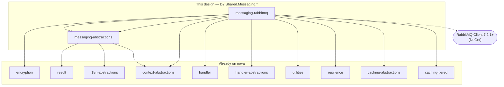
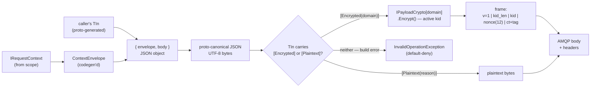
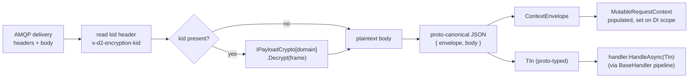
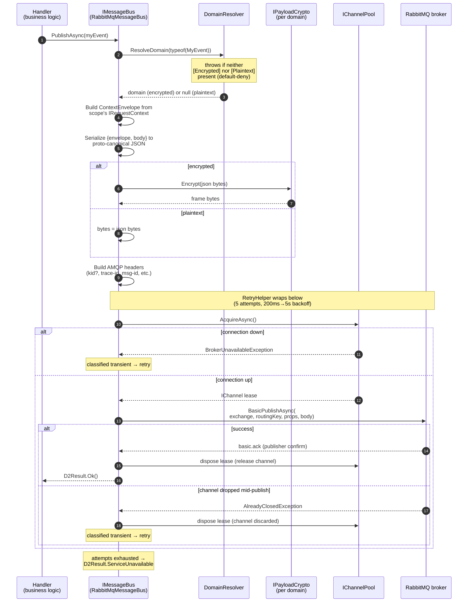
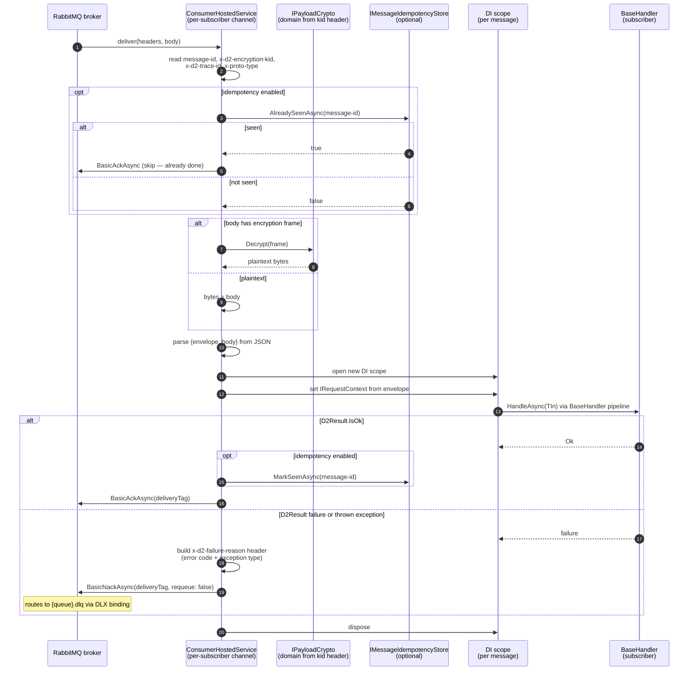
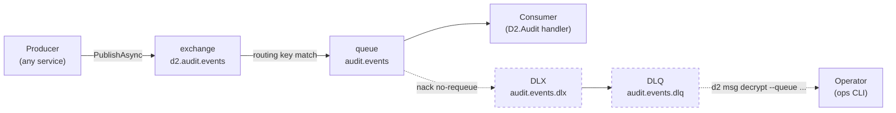
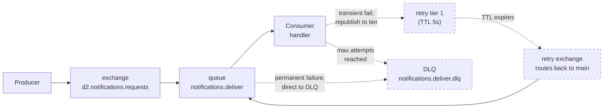
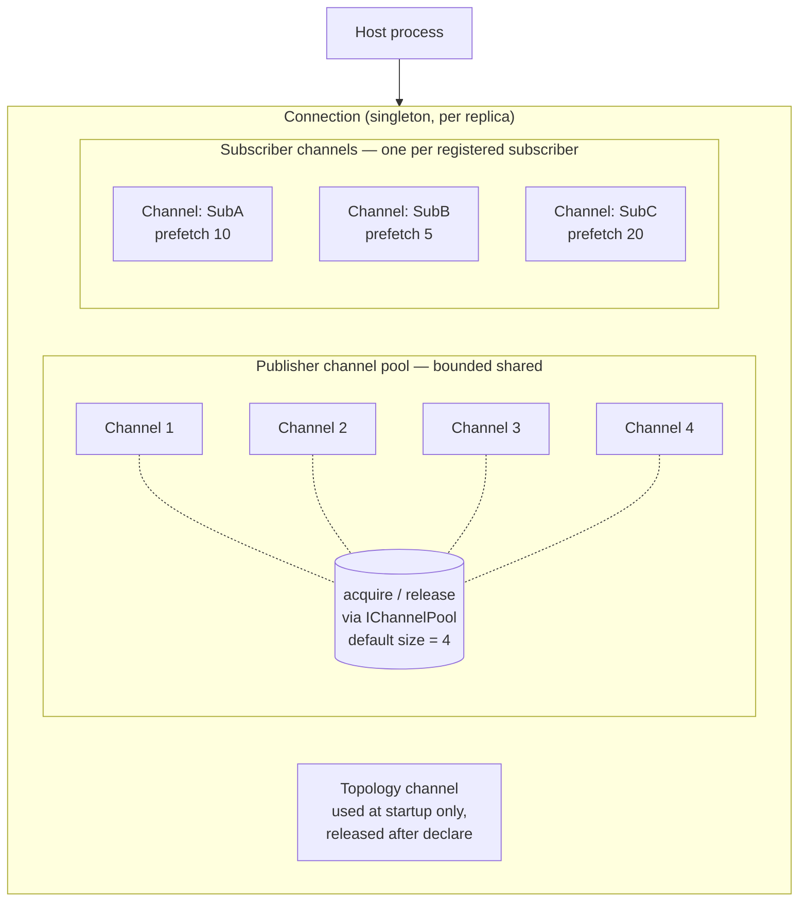
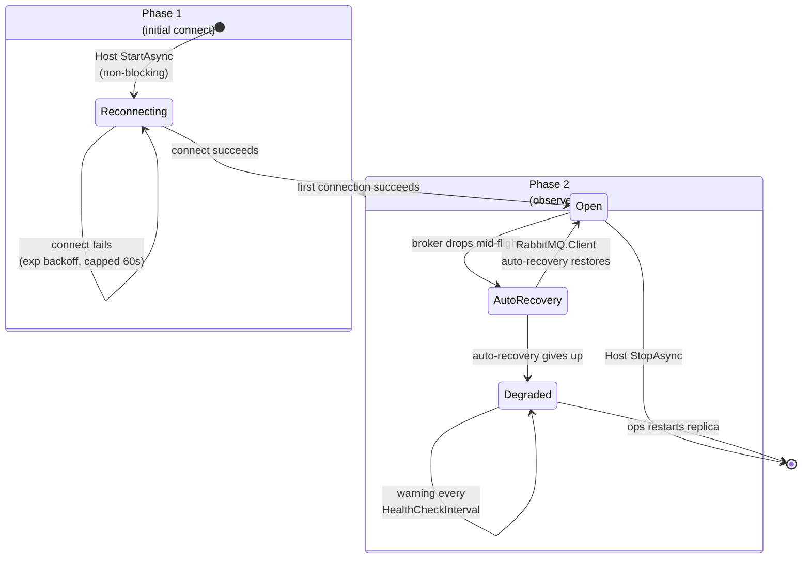

<!--
Copyright (c) DCSV. All rights reserved.
-->

# PHASE_0_MESSAGING.md — D2.Shared.Messaging Design (working doc)

> Working notes for the D2.Shared.Messaging lib design. Iterates freely.
> Folds back into [PHASE_0.md](PHASE_0.md) + per-lib READMEs when the libs ship.

> **Branch**: implementation landed on `n/handler` (the active integration
> branch the messaging work folded into); awaiting squash merge to `nova`.
>
> **Status**: ✅ **Implementation complete.** All eight phases of the audit
> closeout (§6 in [audit_temp.md](audit_temp.md)) ran end-to-end: design
> pivot → HIGH sweep (H4–H8) → MEDIUM sweep (M1–M8) → LOW sweep (L1, L2, L3, L5)
> → 1st doc pass → re-sweep audit → final fix sweep → 2nd doc pass + closeout.
> Current state: `dotnet build` 0/0, `jb inspectcode` clean, **1799 tests**
> pass (incl. Testcontainers RabbitMQ integration).
>
> **Authoritative docs going forward**:
> - [docs/MESSAGING.md](../MESSAGING.md) — wire format, headers, queue topology, encryption posture
> - [docs/OPERATIONAL-GUARANTEES.md](../OPERATIONAL-GUARANTEES.md) — delivery semantics, idempotency contract, DLQ, startup ordering
> - [server/shared/dotnet/messaging-abstractions/README.md](../../server/shared/dotnet/messaging-abstractions/README.md) — public API surface
> - [server/shared/dotnet/messaging-rabbitmq/README.md](../../server/shared/dotnet/messaging-rabbitmq/README.md) — RabbitMQ-specific impl details
>
> **Lifecycle**: this tracking doc is now history. The detailed audit-by-audit
> findings + fixes live in [audit_temp.md](audit_temp.md) which will archive
> alongside this doc once Phase 0 Stage 4 closes.
>
> **Sequencing**: this lib shipped before `D2.Shared.Auth` resumes — Auth's
> KeyringClient will subscribe to `d2.security.key-rotated` events through
> this lib.

---

## ⚠ DESIGN PIVOT — `ContextEnvelope` retired

> Sections below predating this notice (§1, §6.1, §7, §8, §12 M9, §14) describe
> a `ContextEnvelope` wrapper that travels inside the encrypted message body.
> **That design has been retired.** Replacement summarized here; in-place
> sections kept as tracking-doc history. The `messaging-rabbitmq/README.md` +
> `context-abstractions/README.md` carry the current contract.

**What changed**:

- **The wire body is just the serialized message**. No envelope wrapper.
  - Encrypted: `IPayloadCrypto.Encrypt(JsonSerializer.Serialize(message))`.
  - Plaintext: `JsonSerializer.Serialize(message)`.
- **Identity (UserId / OrgId / Scopes / ActorChain / impersonation) is NEVER
  propagated by messaging.** It rebuilds at every hop from the JWT in sync
  contexts; for async events the consumer-side handler doesn't have one and
  shouldn't claim caller identity. Putting identity on the wire — encrypted
  or not — is either a forge surface (plaintext) or a duplication of work
  the consumer would do anyway (encrypted).
- **Cross-hop propagation of the small operational subset** —
  `RequestId` / `RequestPath` / `CurrentFingerprint` / `SessionFingerprint` /
  `FingerprintMatchScore` / `WhoIsHashId` — rides on a single header,
  `x-d2-context`, base64url-of-JSON-encoded `PropagatedContext`. Identical
  shape on every transport (AMQP / gRPC / HTTP). Defined in
  `D2.Shared.Context.Abstractions.PropagatedContext`.
- **Why this is broker-safe**: the propagated set contains no identity, no
  raw IP, no resolved geo data. Just hashes (fingerprints, WhoIs pointer)
  and opaque IDs (RequestId) and the original API path string. A broker-disk
  attacker gets API-surface info disclosure + ability to correlate sessions
  by hash — real but bounded; mitigated by mTLS to broker + broker ACLs +
  disk-at-rest encryption.
- **Encryption is now purely about confidentiality of the message payload
  itself** — not about authenticated identity propagation. The two concerns
  decouple cleanly.

**Code locations**:

- `server/shared/dotnet/context-abstractions/PropagatedContext.cs` — record.
- `server/shared/dotnet/context-abstractions/PropagatedContextSerializer.cs` —
  base64url-of-JSON encode/decode.
- `server/shared/dotnet/context-abstractions/PropagatedContextExtensions.cs` —
  `IRequestContext.ToPropagatedContext()` + `MutableRequestContext.ApplyPropagatedContext(...)` bridges.
- `server/shared/dotnet/messaging-abstractions/AmqpHeaders.cs:CONTEXT` —
  the `x-d2-context` header constant.
- `server/shared/dotnet/messaging-rabbitmq/Publishing/RabbitMqMessageBus.cs:BuildPropagatedHeader` —
  publisher-side header construction.
- `server/shared/dotnet/messaging-rabbitmq/Subscribing/SubscriberChannel.cs:ReadPropagatedContext` —
  consumer-side header read + scope apply.

**What's deleted**:

- `ContextEnvelope` codegen (was emitted as `ContextEnvelope.g.cs` from
  `context-source-gen`).
- `MutableRequestContext.ToContextEnvelope()` /
  `FromContextEnvelope()` / `PopulateFromEnvelope()` codegen methods.
- The `BodyEnvelope<TMessage>` JSON wrapper around encrypted message bodies.

---

## §1. Purpose & non-goals

`D2.Shared.Messaging` is the **RabbitMQ wrapper every D²-WORX service uses** to:

1. **Publish** strongly-typed messages to topology-conventional exchanges, with optional
   AES-256-GCM payload encryption per domain (audit / notifications / courier / …).
2. **Subscribe** to messages via `BaseHandler`-style consumers (TLC `Sub/` 3LC).
3. **Propagate the operational context subset** (`RequestId`, `RequestPath`, fingerprints,
   `WhoIsHashId`) cross-hop via the single `x-d2-context` AMQP header. Identity (UserId /
   OrgId / Scopes) is NOT propagated — JWTs rebuild identity each hop in sync contexts;
   async events shouldn't claim caller identity.
4. **Wire DLQs** automatically (per-queue DLX binding; `{queue}.dlq` naming convention).
5. **Refresh keyrings** by exposing a typed event channel for `d2.security.key-rotated`
   events that downstream libs (Auth's KeyringClient, ops tooling) subscribe to.

### Critical framing — thin wrapper, not a service bus

This lib does NOT try to be MassTransit / Rebus / EasyNetQ. It wraps `RabbitMQ.Client 7.x`
directly and adds:

- D² conventions (exchange naming, headers contract, encryption frame, propagated-context
  header)
- `BaseHandler` integration (subscribers ARE handlers; they get OTel metrics, structured
  logging, `D2Result` semantics, scope checks for free)
- DI shape that matches the rest of the codebase

It does NOT add saga state machines, distributed transactions, transport-agnostic facades,
or its own retry policies that fight `D2.Shared.Resilience`.

### What this lib explicitly does NOT do

- **Issue or validate JWTs** — encryption boundary IS the trust boundary on async paths
  (per CLAUDE.md §4). Async consumers don't re-validate signatures (no JWT travels with
  the message); confidentiality of the payload comes from AEAD encryption keyed per
  domain. Identity propagation is intentionally NOT done — handlers reason about their
  own service identity, not the upstream caller's.
- **Run KeyCustodian** — Edge owns key lifecycle (Phase 3). This lib only consumes events
  about rotations.
- **Manage encryption keys** — `D2.Shared.Encryption` provides `IPayloadCrypto` keyed by
  domain; `D2.Shared.Auth.Keyring` (Phase 0 Wave 7) populates those via KeyringClient. This
  lib uses whatever's registered.
- **Enforce schema validation on consume** — caller's handler does that (deserialization
  is just `JsonParser.Default.Parse<T>`).

---

## §2. Where this lib sits in the dependency graph



**Downstream consumers** (after these libs ship):

- **`D2.Shared.Auth.Keyring`** (Wave 7) — subscribes to `d2.security.key-rotated` events.
- **D2.Audit** (Phase 4) — consumes `d2.audit.events`.
- **D2.Notifications** (Phase 5) — consumes `d2.notifications.requests`.
- **D2.Courier** (Phase 5) — consumes `d2.courier.deliver`.
- **Edge** (Phase 3) — publishes session-revoked, security events, and various business
  events.
- **Every backend service** that participates in async flows.

---

## §3. What's already locked (firm ground we build on)

These come from MESSAGING.md, V2.md §5.4 / §5.7, OPERATIONAL-GUARANTEES.md, CLAUDE.md §4.
Citations in-line where helpful.

### 3.1 Wire format

- **Body bytes**: `[v=1][kid_len:1][kid:UTF-8][nonce:12][ciphertext+tag:M]` AES-256-GCM
  frame. Frame format already implemented in `D2.Shared.Encryption.EncryptionFrame`.
- **Plaintext content** inside the encrypted frame (after decryption): proto-canonical JSON
  containing `{ contextEnvelope: {...}, body: {...} }`.
- **AMQP body**: `application/octet-stream` (encrypted bytes; never `application/json` —
  the body is binary now).
- **Why proto-canonical JSON over binary protobuf**: cross-language friendliness, DLQ
  tooling discoverability, deterministic serialization. Performance penalty is negligible
  vs network round-trip.

### 3.2 Plaintext AMQP headers (broker needs them for routing + observability)

| Header | Purpose | Example |
|---|---|---|
| `content-type` | Always `application/octet-stream` (body is encrypted) | (as above) |
| `x-proto-type` | Fully-qualified proto type name | `d2.events.files.v1.FileUploadedEvent` |
| `message-id` | UUIDv7 (sortable, includes timestamp) | `01ARZ3NDEKTSV4RRFFQ69G5FAV` |
| `timestamp` | Producer's send time, ISO 8601 UTC | `2026-05-07T14:23:00Z` |
| `x-d2-trace-id` | W3C traceparent | `00-trace-id-span-id-01` |
| `x-d2-correlation-id` | Idempotency-Key when applicable | `01J3...` |
| `x-d2-encryption-kid` | Key ID (also in encrypted frame) | `audit-2026q3` |

The kid is duplicated (frame + header) deliberately — the header lets ops decide whether
archive keys are needed for a stuck message **without decrypting**.

### 3.3 Exchange naming convention

`d2.{producer}.{purpose}` — service-namespaced, producer owns the exchange schema.

Examples:
- `d2.audit.events` (D2.Audit consumes; everyone publishes)
- `d2.notifications.requests` (D2.Notifications consumes)
- `d2.courier.deliver` (D2.Courier consumes)
- `d2.files.events` (lifecycle events; consumers vary)
- `d2.security.key-rotated` (KeyCustodian publishes; KeyringClients consume)
- `d2.security.session-revoked` (Edge publishes; backend caches drop their L1 entries)

### 3.4 Queue patterns

**Competing consumers** — most events (audit, notifications, courier, files).
Durable shared queue. Exactly-one delivery via single-queue + ACK atomicity.

**Fanout exclusive auto-delete** — cache invalidation, multi-replica broadcasts.
Non-durable, exclusive, auto-delete per replica. Every replica receives every message.
**MUST be idempotent**.

**Durable shared** — long-lived event streams (audit).
Durable, shared, no auto-delete. Survives broker restart; one or more consumers pull.

### 3.5 Encryption domains

Per V2.md §5.7. Closed set; adding requires deliberate decision.

**Audit** — `EncryptionDomains.Audit` (`"audit"`). All services publish; D2.Audit consumes.

**Notifications** — `EncryptionDomains.Notifications` (`"notifications"`). Producers
publish; D2.Notifications consumes.

**Courier** — `EncryptionDomains.Courier` (`"courier"`). D2.Notifications publishes;
D2.Courier consumes.

`EncryptionDomains` static class lives in **`D2.Shared.Encryption`** (it's where the domain
concept lives — `services.AddD2EncryptionFor(domain, factory)` registers per-domain
keyrings). Messaging-abstractions doesn't need to know the canonical names — `[Encrypted]`
just takes any string and looks up the registered `IPayloadCrypto`.

**Default-deny on encryption.** Every message type MUST carry exactly one of:
- `[Encrypted(EncryptionDomains.X)]` — the message body is encrypted under domain `X`.
- `[Plaintext("<reason>")]` — the message is deliberately published unencrypted; the reason
  string is mandatory and shows up in audit logs / code review.

A type with **neither** attribute is a build-clean but runtime-fatal config error —
`DomainResolver.Resolve` throws `InvalidOperationException` with a message naming both
attributes. This forces the developer to make a conscious decision per message type rather
than silently shipping plaintext. A type with **both** attributes throws as well —
mutually exclusive.

Low-PII exchanges (`d2.files.events`, `d2.security.key-rotated`) live behind
`[Plaintext("<reason>")]` rather than no attribute at all; promoting them to encrypted later
is a one-line attribute swap.

### 3.6 Acknowledgment semantics

- **Never auto-ACK.** Auto-ACK at receive loses messages on consumer crash.
- **ACK only after handler returns `D2Result.IsOk`.** If the handler does DB writes, those
  must commit before ACK; the lib's wrapper ensures this via the result-checking pattern.
- **NACK without requeue (= DLQ)** for permanent failures (validation errors, schema
  mismatches, exceptions).
- **NACK with requeue** is NOT used by default — leads to poison message loops. Transient
  retry happens via the broker-level TTL+DLX retry topology when the handler opts in
  (M5).

### 3.7 DLQ contract

- Every queue has a per-queue DLX binding via `x-dead-letter-exchange` argument.
- Convention: queue `audit.events` → DLX `audit.events.dlx` → DLQ `audit.events.dlq`.
- Failed messages preserve original routing key + headers; gain a custom
  `x-d2-failure-reason` header recording exception type, error code, attempt count.
- DLQ inspection via ops CLI: `d2 msg decrypt --queue audit.events.dlq --count 10`.

### 3.8 Required CI gate

Per AUDIT_CHECKLIST.md: full key-rotation integration test (real Testcontainers Redis +
Testcontainers RabbitMQ; rotation triggered mid-publish; in-flight messages still decrypt;
no message loss). "No rotation tests = no merge."

**This test does NOT live in this lib's tests** (per M10) — it requires the full Auth
KeyringClient + RotationEventChannel stack to exercise. It lives in `D2.Shared.Auth.Tests`
(Wave 7). This lib's tests cover round-trip publish/consume against a fixed keyring fixture.

---

## §4. What we lean on (already shipped on nova)

- **`D2.Shared.Encryption`** — `IPayloadCrypto`, `PayloadCryptoKeyring`, `EncryptionFrame`.
  We use these as-is; no reimplementation. `EncryptionDomains` constants live here too.
- **`D2.Shared.Caching.*`** — `IDistributedCache` for the optional `IMessageIdempotencyStore`
  default impl.
- **`D2.Shared.Result`** — every public op returns `D2Result` / `D2Result<T>`.
- **`D2.Shared.Context.Abstractions`** — `ContextEnvelope` is **already codegen'd** by
  `context-source-gen`. We just `JsonSerializer.Serialize` it into the body and back.
- **`D2.Shared.Handler`** — `BaseHandler<TSelf, TIn, TOut>`. Subscribers ARE
  `BaseHandler<Sub<T>, T, Unit>` instances; the consumer wrapper invokes them via the same
  pipeline. Auto-OTel metrics, scope checks, structured logging, `D2Result` mapping all
  come for free.
- **`D2.Shared.Resilience`** — `RetryHelper` for handler-level transient retry inside
  subscribers (broker-level retry is a separate optional topology — see M5).
- **`D2.Shared.Utilities`** — `Falsey()` / `Truthy()` everywhere; `ToNullIfEmpty()` at
  boundaries.

---

## §5. Lib structure (2 csprojs)

Following the `caching-abstractions` / `caching-distributed-redis` pattern: abstractions
have zero external runtime deps; impl takes the `RabbitMQ.Client` dep.

```
server/shared/dotnet/
├── messaging-abstractions/                  # NEW — interfaces + DTOs + constants
│   ├── D2.Shared.Messaging.Abstractions.csproj
│   ├── README.md
│   ├── IMessageBus.cs                       # PublishAsync<T>(T)
│   ├── ISubscriberRegistration.cs           # metadata; consumed by impl
│   ├── SubscriberRegistry.cs                # DI singleton — list of registrations
│   ├── IMessageIdempotencyStore.cs          # AlreadySeenAsync(messageId)
│   ├── EncryptedAttribute.cs                # [Encrypted("audit")] on message types
│   ├── AmqpHeaders.cs                       # static constants (X_D2_TRACE_ID, etc.)
│   ├── QueuePattern.cs                      # CompetingConsumer / Fanout / DurableShared
│   ├── PublisherOptions.cs                  # confirms enabled, timeout, pool size
│   ├── SubscriberOptions.cs                 # queue name, pattern, prefetch, retry
│   ├── ContextEnvelopeSerializer.cs         # JSON of ContextEnvelope inside body
│   ├── MessagingFailures.cs                 # InputFailures-style D2Result helpers
│   ├── DlqFailureMetadata.cs                # x-d2-failure-reason JSON shape
│   └── MessagingServiceCollectionExtensions.cs
│       # services.AddD2Subscriber<TSub, TIn>(opts) — transport-agnostic registration
│
└── messaging-rabbitmq/                      # NEW — RabbitMQ.Client 7.x impl
    ├── D2.Shared.Messaging.RabbitMq.csproj
    ├── README.md
    ├── Connection/
    │   ├── ID2Connection.cs                 # singleton IConnection wrapper
    │   ├── RabbitMqConnection.cs            # default impl
    │   ├── ConnectionStartupHostedService.cs # non-blocking; kicks off
    │   │                                       reconnect loop (M6)
    │   ├── BrokerUnavailableException.cs    # thrown when connection is down,
    │   │                                       caught by publisher → ServiceUnavailable
    │   └── ConnectionOptions.cs
    ├── Channels/
    │   ├── IChannelPool.cs                  # bounded shared publisher pool
    │   ├── BoundedChannelPool.cs            # default 4 channels, configurable (M7)
    │   └── ChannelPoolOptions.cs
    ├── Topology/
    │   ├── ITopologyDeclarer.cs             # idempotent declare exchanges/queues/DLX
    │   ├── DefaultTopologyDeclarer.cs
    │   ├── DlqTopology.cs                   # per-queue DLX wiring helper
    │   └── TieredRetryTopology.cs           # opt-in retry tiers (M5)
    ├── Publishing/
    │   ├── RabbitMqMessageBus.cs            # IMessageBus impl
    │   ├── PublisherConfirmTracker.cs       # async confirm waiting (M3)
    │   └── ExchangeNaming.cs                # d2.{producer}.{purpose} helpers
    ├── Subscribing/
    │   ├── ConsumerHostedService.cs         # IHostedService — runs all consumer loops
    │   ├── HandlerInvoker.cs                # decrypt → parse → handler → ack/nack
    │   ├── SubscriberChannel.cs             # one channel per subscriber (M7)
    │   └── DlqFailureHeaderBuilder.cs       # builds x-d2-failure-reason on nack
    ├── Encryption/
    │   ├── DomainResolver.cs                # type → domain string (cached)
    │   └── EncryptedBodyComposer.cs         # ContextEnvelope + body → frame bytes
    ├── Idempotency/
    │   └── CacheIdempotencyStore.cs         # default IMessageIdempotencyStore impl
    │                                          (uses IDistributedCache)
    ├── Telemetry/
    │   ├── MessagingTelemetry.cs            # static Meter + ActivitySource
    │   └── MessagingLog.cs                  # LoggerMessage delegates
    └── MessagingRabbitMqServiceCollectionExtensions.cs
        # services.AddD2MessagingRabbitMq(opts)
```

Approximate size: ~25-35 files across both csprojs, ~2000-3000 LoC.

---

## §6. Wire format & encryption integration

### 6.1 Outgoing message — body composition



Key invariants:
- **`ContextEnvelope` always rides inside the body**, never in headers — broker stores
  headers plaintext at rest, so sensitive context (userId, fingerprint) goes in the
  encrypted body even when the message is in an "unencrypted" domain. (For unencrypted
  domains, the body itself is plaintext but it's still inside an opaque AMQP body the
  broker doesn't index.)
- **Headers describe the message, body contains the message.** Routing key + AMQP headers
  are enough for broker routing + ops triage; nothing sensitive there.

### 6.2 Incoming message — body decomposition



Failure paths:
- `kid` not in keyring → `KidNotInKeyringException` → NACK no-requeue → DLQ
- AEAD tag mismatch → `AuthenticationTagMismatchException` → NACK no-requeue → DLQ
- JSON parse failure → `MessagingFailures.MalformedBody` → NACK no-requeue → DLQ
- Handler returns `D2Result` failure → NACK no-requeue → DLQ
- Handler throws → NACK no-requeue → DLQ (with exception type recorded in
  `x-d2-failure-reason`)

---

## §7. Publish flow (end-to-end)



Notes:
- Steps 2-5 are pure CPU (~tens of µs).
- Step 6 (encrypt) is single-threaded AES-GCM; ~10-50 µs for typical payloads.
- The retry wrapper covers channel acquire + publish — the body composition / encryption
  steps run once even if the publish itself retries (no point re-encrypting the same
  bytes).
- Confirm timeout (default 5s per attempt) is independent of retry — a slow broker can
  burn ~25s of total publish latency in the worst case (5 attempts × 5s confirm
  timeout) before returning `ServiceUnavailable`. Tune via `RabbitMqPublisherOptions`
  for latency-sensitive callers.
- Per-call `PublisherOptions.MaxAttempts = 1` opts out for fire-and-forget semantics.

---

## §8. Consume flow (end-to-end)



Key design points:
- **One channel per subscriber.** Each channel has its own prefetch state + ack tracking.
  Sharing across subscribers means one slow handler stalls another's ack window.
- **`prefetchCount`** is per-subscriber (`SubscriberOptions.PrefetchCount`, default 10). The
  broker delivers up to N unacked messages to the channel; with `IAsyncBasicConsumer` and
  `ConsumerDispatchConcurrency = ProcessorCount`, those N can dispatch concurrently.
- **DI scope per message** so transient handlers + scoped dependencies (DbContext, etc.)
  work correctly.
- **`IRequestContext` populated from `ContextEnvelope`** — handlers see the same shape they
  see on HTTP / gRPC paths. No async-flow-specific code in business handlers.
- **Optional idempotency check** — opt-in per subscriber. When enabled, uses
  `IMessageIdempotencyStore` (default impl backed by `IDistributedCache`).

---

## §9. Topology — queue, DLX, optional retry tiers

### 9.1 Standard topology (every queue)



Queue arguments:
- `x-dead-letter-exchange = audit.events.dlx`
- `x-dead-letter-routing-key = ""` (route to DLQ via fanout binding)

Topology declared **idempotently at startup** by `DefaultTopologyDeclarer` (one
declaration channel; reads `SubscriberRegistry`, declares everything, releases the channel).
`QueueDeclareAsync` / `ExchangeDeclareAsync` are no-ops if the topology already exists.

### 9.2 Optional retry tier topology (opt-in, M5)

For subscribers that opt in via `SubscriberOptions.EnableTieredRetry(maxAttempts: 10,
tiers: [5s, 10s, 30s, 60s, 300s])`:



Retry tier queues use `x-message-ttl` + dead-letter back to the main queue. Each retry
increments an attempt counter in the `x-death` header (RabbitMQ does this automatically).
Handler reads attempt count to decide retry vs. final-fail.

This is OPT-IN per subscriber. Most subscribers don't need it; the ones that call external
APIs (Comms, anything calling third-party services) opt in.

---

## §10. Channel lifecycle & sizing

### 10.1 Channel allocation per replica



Sizing rules of thumb:
- Most services: 4 publish channels handles 1000-5000 msg/sec
- High-throughput publishers (audit collector, future telemetry sink): 8-16
- Each subscriber: exactly 1 channel (don't share)
- Total per replica: `N_subscribers + N_publish_pool + 1 (topology, transient)`
- For 10 subscribers + 4 publish pool: 14 channels. RabbitMQ's `max_channel = 2047`
  default per connection leaves enormous headroom.

Publisher pool semantics:
- `AcquireAsync()` semaphore-backed; FIFO fairness
- Lease pinned for the publish duration (caller holds via `using`); broker confirms come
  back on the same channel
- `Singleflight` on growth to prevent thundering-herd channel creation
- Channel-level error → channel discarded; pool grows fresh on next acquire
- Connection-level error → full reconnect via auto-recovery; pool invalidated and rebuilt

### 10.2 Connection lifecycle



**Connection lifecycle is graceful-degradation by design**, matching the rest of the
codebase (Redis cache `AbortOnConnectFail = false`, KeyringClient stale-keyring fallback,
JWKS reactive refresh on unknown kid).

`ConnectionStartupHostedService.StartAsync` kicks off `ID2Connection.StartReconnectLoop()`
**without awaiting** and returns immediately — the host (HTTP listener, gRPC server, etc.)
comes up regardless of broker availability. The background loop has two phases:

**Phase 1 — initial connection (retry forever).** Tries to open the AMQP connection with
exponential backoff (initial 1s, doubling, capped at 60s). Persistent misconfig (wrong URI
etc.) shows up as repeated warning logs. Once succeeded, transitions to Phase 2 and never
re-runs.

**Phase 2 — observe-only.** RabbitMQ.Client 7.x's `AutomaticRecoveryEnabled = true` +
`TopologyRecoveryEnabled = true` own reconnection from here. The background loop just ticks
every `HealthCheckInterval` (default 30s), logs a warning if the connection has been down
for too long, and **never replaces the IConnection** — doing so would orphan any consumers
registered against the old instance, which is worse than waiting for ops to restart the
replica.

### Mid-flight scenarios

**Common case — broker bounces while everything is running**:

1. TCP socket dies → `IConnection.IsOpen` flips false → RabbitMQ.Client's recovery thread
   starts trying to reconnect immediately.
2. **In-flight publish**: `BasicPublishAsync` against the closed channel throws
   `AlreadyClosedException` → publisher catches, returns `D2Result.ServiceUnavailable`.
   Caller decides retry / propagate.
3. **New publishes during outage**: `IChannelPool.AcquireAsync` discards closed pooled
   channels and tries `CreateChannelAsync`, which throws `BrokerUnavailableException` →
   publisher returns `ServiceUnavailable`. HTTP / gRPC traffic on the same replica keeps
   serving normally.
4. **In-flight consumer handler**: completes its work; the trailing `BasicAckAsync` fails
   silently against the closed channel → broker redelivers the message after recovery.
   This is why every consumer handler MUST be idempotent (documented contract).
5. **New consumer deliveries during outage**: paused. Durable / shared queues retain
   messages broker-side; deliveries resume after recovery. **Fanout exclusive auto-delete
   queues miss messages during the outage** (queue is deleted on disconnect, recreated on
   recovery — inherent to the pattern, not a lib limitation).
6. **Recovery**: `RabbitMQ.Client` reconnects the same `IConnection` instance, re-declares
   queues + bindings, re-attaches consumers. Application code does nothing.

**Rare case — automatic recovery permanently fails** (vhost permissions changed mid-flight,
persistent network split, broker hostname swapped, etc.):

1. `IConnection.IsOpen` stays false.
2. Phase 2's observation loop logs `ConnectionDegraded` warning every
   `HealthCheckInterval` ("connection has been degraded for Xm — restart this replica").
3. Publishers keep returning `ServiceUnavailable`; consumers stay idle.
4. **Operator sees the warnings and restarts the replica** — fresh process, fresh Phase 1.

**Why we don't auto-replace the connection in Phase 2**: a fresh `IConnection` has no
consumers attached. Application-level consumer registration ran ONCE at startup (against
the original instance, before topology recovery took over). Replacing the instance leaves
consumers silently dead — no deliveries, no errors, no signal. Far better to log a loud
"degraded for Xm, restart needed" warning and let ops decide.

---

## §11. v1 lessons (from the survey)

### Carry forward

- **Singleton connection + transparent channel recreation** on failure
- **Service-namespaced exchange naming** (v2 codifies as `d2.{producer}.{purpose}`)
- **Comms tier-queue retry topology** (5s / 10s / 30s / 60s / 300s, max 10 attempts) —
  generalize to opt-in helper in this lib
- **Testcontainers integration tests** (real RabbitMQ, not mocks)
- **Cross-language proto-canonical JSON** wire format

### Fix

- **v1 .NET created a channel per subscriber call.** v2: dedicated channel per registered
  subscriber AND bounded shared pool for publishing.
- **v1 NACKs everything to drop on exception** (loses signal in logs only). v2: NACK to DLQ
  with `x-d2-failure-reason` header capturing exception + error code, ops can decrypt and
  triage.
- **v1 doesn't propagate trace/correlation IDs** in headers — every async hop gets a fresh
  traceId. v2 fixes via the headers contract (§3.2).
- **v1 has no encryption.** v2 has `[Encrypted(domain)]` attribute pattern with
  KeyringClient-managed keys (Auth lib's responsibility once it ships).
- **v1 has no DLQ** — failed messages just disappear into logs. v2: every queue has a DLX
  binding declared at topology setup.
- **v1 idempotency lives in DB unique constraint catch-and-translate** — masks errors. v2:
  explicit `IMessageIdempotencyStore` opt-in check before doing work.
- **v1 doesn't validate proto schemas on consume** — silent partial deserialization. v2:
  `JsonParser.Default.Parse<T>` is strict; on failure, NACK to DLQ.

---

## §12. Decisions log (locked)

### M1 — csproj structure → **2 csprojs (abstractions + rabbitmq)**

**Decided**: 2026-05-07.

**Rationale**: matches `caching-abstractions` / `caching-distributed-redis` pattern. Domain
code can reference `messaging-abstractions` (zero external deps) without dragging in
`RabbitMQ.Client`. Future Kafka / NATS impls would land as sibling
`messaging-kafka` / `messaging-nats` csprojs without changing domain code.

`messaging-abstractions` carries: interfaces (`IMessageBus`,
`IMessageIdempotencyStore`), DTOs / records, attributes (`EncryptedAttribute`), constants
(`AmqpHeaders`), `SubscriberRegistry` + `AddD2Subscriber<,>` DI helper (transport-agnostic
registration).

`messaging-rabbitmq` carries: the RabbitMQ.Client wiring — connection, channel pool,
publisher, consumer host, topology declarer, DLQ wiring.

### M2 — `[Encrypted]` attribute → **(a) attribute on companion `partial class`**

**Constants location**: `EncryptionDomains` static class in `D2.Shared.Encryption`.

**Decided**: 2026-05-07.

**Rationale**: proto-generated message classes are `partial class`. A hand-written
companion file adds the attribute without touching codegen. Discoverable at the type
definition; matches the `[RedactData]` pattern.

**Constants location**: `EncryptionDomains` static class with `public const string`
members lives in **`D2.Shared.Encryption`** — that's where the domain concept actually
lives (encryption registers per-domain keyrings via `AddD2EncryptionFor`).
Messaging-abstractions doesn't need to know the canonical names; `[Encrypted]` takes any
string and looks it up at runtime.

```csharp
// In D2.Shared.Encryption:
public static class EncryptionDomains
{
    public const string Audit = "audit";
    public const string Notifications = "notifications";
    public const string Courier = "courier";
}

// In a service's domain code (companion partial file alongside proto-generated class):
[Encrypted(EncryptionDomains.Audit)]
public partial class AuditEvent { }
```

**Implementation note**: messaging needs to add `EncryptionDomains` to the encryption lib
when it builds. Not a breaking change to encryption (additive — pure constants).

### M3 — Publisher confirms → **on by default + built-in transient retry**

**Decided**: 2026-05-07. **Revised**: 2026-05-07 to add built-in transient retry on the
publisher path after pushback that returning `ServiceUnavailable` immediately on every
broker blip pushes retry logic into every caller — bad ergonomics for the 95% case where
"publish should eventually succeed if the broker comes back within seconds" is the right
default.

**Confirms** (`WaitForConfirm = true` default): the publisher waits for the broker's
publisher-confirm before returning `Ok`. Per-call opt-out via
`PublisherOptions.WaitForConfirm = false` for telemetry-grade messages where
lost-on-broker-crash is acceptable. Confirm timeout default 5s.

**Built-in retry**: every publish call wraps the channel-acquire + `BasicPublishAsync` in
`RetryHelper.RetryAsync` with the following defaults (configurable via
`RabbitMqPublisherOptions`):

- `MaxAttempts = 5` (4 retries after the initial attempt)
- `BaseRetryDelay = 200ms`, `MaxRetryDelay = 5s`, exponential backoff with jitter
- Worst-case publish latency under sustained outage: ~10s before returning
  `ServiceUnavailable`

**Transient classifier** (`TransientPublishClassifier.IsTransient`):
- `BrokerUnavailableException` (connection wrapper says it's down)
- `AlreadyClosedException` (channel went down mid-call)
- `OperationInterruptedException` (RabbitMQ.Client wraps various AMQP failures here)
- `BrokerUnreachableException`
- `TimeoutException` (channel pool acquire stuck on confirm-degradation)
- Plus the standard `RetryHelper.IsTransientException` set (HTTP 5xx, 429, 408, sockets,
  task-cancel)

NOT retried (caller-side bugs / terminal): `ArgumentException`, `JsonException`,
`KidNotInKeyringException` (encryption), `OperationCanceledException` (caller cancelled).

**Per-call override**:
- `PublisherOptions.MaxAttempts = 1` → fire-and-forget; one shot, no retry.
- Higher `MaxAttempts` → more aggressive retry for critical publishes (audit events from
  Edge during a deploy window, etc.).

**Why this is the right default**: every publish caller would otherwise need to either
wrap in their own `RetryHelper` (boilerplate everywhere, inconsistent across services) or
swallow the `ServiceUnavailable` (lost messages on every routine broker bounce). Bake the
sensible default in; let the rare fire-and-forget case opt out via `MaxAttempts = 1`.

### M4 — Subscriber registration → **`AddD2Subscriber<TSub, TIn>` + `ConsumerHostedService`**

**Decided**: 2026-05-07.

**Rationale**: subscribers ARE `BaseHandler<TSub, TIn, Unit>` instances per the TLC
convention's `Sub/` 3LC. The DI helper just registers metadata; the consumer loop is a
single `IHostedService` that reads the registry and runs N consumer channels. This keeps
business handlers free of AMQP / encryption / scope concerns — they look identical to HTTP
handlers.

Lifecycle: `ConsumerHostedService.StartAsync` declares topology, opens N channels,
attaches consumers. `StopAsync` waits for in-flight handlers (with timeout) before closing.
Per-message DI scope opens fresh for each delivery.

### M5 — Retry strategy → **broker TTL+DLX (opt-in) + handler-level RetryHelper**

**Decided**: 2026-05-07.

**Rationale**: two retry layers serve different purposes.
- Broker-level (TTL+DLX): infrastructure resilience for handler crashes / message
  redelivery. Lib ships a default tiered-retry topology helper
  (`opts.EnableTieredRetry(maxAttempts: 10, tiers: [5s, 10s, 30s, 60s, 300s])`).
  Disabled by default; opt-in per subscriber.
- Application-level (Polly / `RetryHelper`): subsecond transient failures inside a handler
  (HTTP timeouts to third-party APIs, brief DB lock contention). Handler's own
  responsibility; lib doesn't enforce.

### M6 — Connection lifecycle → **non-blocking host + retry-forever background loop**

**Decided**: 2026-05-07. **Revised**: 2026-05-07 from "fail-loud at startup" to graceful
degradation after pushback that fail-loud cascades a 10-second broker blip into
host-crashes across every replica.

**Rationale**:
- RabbitMQ has the same operational profile as Redis (deploys, restarts, network blips
  happen). Crashing the host during a 10s outage takes down HTTP / gRPC traffic alongside
  messaging — far worse than briefly returning `ServiceUnavailable` from publishes.
- Matches the existing graceful-degradation pattern across the codebase: Redis cache
  (`AbortOnConnectFail = false`), KeyringClient (stale-keyring fallback on Edge
  unreachable), JWKS provider (reactive refresh on unknown kid).
- Permanent misconfig (wrong URI etc.) surfaces as persistent warning logs — operators see
  and fix without losing entire replicas in the meantime.

**Mechanics**:
- `ConnectionStartupHostedService.StartAsync` kicks off `ID2Connection.StartReconnectLoop()`
  and returns immediately (non-blocking).
- Background loop retries forever with exponential backoff (initial 1s, doubling, capped
  at 60s).
- Once connected, RabbitMQ.Client 7.x's `AutomaticRecoveryEnabled = true` +
  `TopologyRecoveryEnabled = true` handle in-flight reconnection.
- Health-check tick (default 30s) catches edge cases where auto-recovery silently fails.
- `ID2Connection.ReadyTask` completes on first successful connection — consumers await it
  before registering channels.
- `ID2Connection.CreateChannelAsync` throws `BrokerUnavailableException` when the
  connection isn't open; channel pool / publisher catch and translate to
  `D2Result.ServiceUnavailable`.

### M7 — Channel pooling → **1 channel per subscriber + bounded publish pool (default 4)**

**Decided**: 2026-05-07.

**Rationale**: see §10.

### M8 — Idempotency → **provide `IMessageIdempotencyStore`, opt-in**

**Decided**: 2026-05-07.

**Rationale**: handlers that need transactional dedup (DB row insert on receipt) keep doing
the unique-constraint thing inside their own logic. Handlers that just want "skip if seen"
opt in via `SubscriberOptions.IdempotencyEnabled = true` — the consumer wraps the handler
with a pre-check against `IMessageIdempotencyStore` (default impl backed by
`IDistributedCache` — entries TTL'd for 24 hours).

### M9 — `ContextEnvelope` serialization → **JSON via `System.Text.Json`**

**Decided**: 2026-05-07.

**Rationale**: debug-friendly (ops can decrypt and read), negligible overhead vs network
round-trip. Same serializer as the rest of D² JSON paths.

### M10 — Test strategy → **defer rotation gate to Auth tests**

**Decided**: 2026-05-07.

**Rationale**: the required rotation integration test exercises KeyringClient +
RotationEventChannel + Encryption + Messaging in concert. KeyringClient lives in
`D2.Shared.Auth.Keyring` (Wave 7, ships after this lib). Rotation gate naturally lives in
`D2.Shared.Auth.Tests`.

This lib's tests cover round-trip publish/consume against a fixed keyring fixture (real
RabbitMQ via Testcontainers). The "more complete" test gate is added in Wave 7.

**Open obligation**: when Auth ships, ensure the rotation test references this lib's
fixtures and exercises the full flow. Track in PHASE_0_AUTH.md test inventory.

### M11 — Rotation events → **stay unencrypted**

**Decided**: 2026-05-07.

**Rationale**: rotation events carry `(domain, kid)` tuples — not sensitive on their own —
and consuming services need to decrypt them to know what to refresh. Encrypting them with
keys we're rotating creates a chicken-and-egg problem. They ride on
`d2.security.key-rotated` exchange as plaintext JSON.

**Mechanism**: rotation event message types carry `[Plaintext("rotation events bootstrap
key delivery — chicken-and-egg with rotating keys")]`. The reason string is mandatory per
the default-deny rule (§3.5) and surfaces in audit logs / code review.

---

## §13. Open questions

All M1-M11 resolved. New questions surfaced during implementation will be appended here as
they come up.

(empty — all locked)

---

## §14. Test inventory

### Unit tests (no infrastructure)

- `EncryptedBodyComposer` — round-trip ContextEnvelope + body → frame bytes → back; tag
  mismatch detection; missing kid detection
- `DomainResolver` — type with `[Encrypted(domain)]` returns domain; type with
  `[Plaintext(reason)]` returns null; type with neither attribute throws
  `InvalidOperationException` (default-deny); type with both attributes throws
  (mutually exclusive); reflection cached
- `ExchangeNaming` — produces `d2.{producer}.{purpose}` correctly; rejects malformed inputs
- `ContextEnvelopeSerializer` — round-trip every field; missing optional fields handled;
  JSON shape matches spec
- `BoundedChannelPool` — acquire / release semantics; semaphore fairness; pool growth
  under contention; channel discard on per-channel error
- `DlqFailureHeaderBuilder` — captures exception type + error code; truncates message
  bodies to header-size limits; UTF-8 safe
- `SubscriberRegistry` — registration / lookup by message type; idempotent registration

### Integration tests (Testcontainers RabbitMQ — real broker)

- **Round-trip publish + consume**: publish encrypted message; consumer decrypts; handler
  receives correct `IRequestContext` from ContextEnvelope; ack; broker shows queue empty
- **Plaintext domain**: same round-trip with no `[Encrypted]` attribute on the message type
- **Multiple domains**: different message types with different `[Encrypted(domain)]`
  attributes encrypt with the correct keyring
- **DLQ on handler failure**: handler returns `D2Result.ValidationFailed` → message lands
  in `{queue}.dlq` with `x-d2-failure-reason` header populated; routing key + headers
  preserved
- **DLQ on handler exception**: handler throws → same DLQ behavior with exception type
  recorded
- **DLQ on decrypt failure**: tampered frame (one ciphertext byte flipped) → tag mismatch
  → DLQ
- **DLQ on missing kid**: message with kid not in keyring → DLQ
- **Publisher confirms**: publish with confirms enabled; broker shutdown mid-publish →
  caller sees timeout failure (D2Result.ServiceUnavailable)
- **Idempotency opt-in**: subscriber with `IdempotencyEnabled = true` receives same
  message twice → handler invoked once
- **Tiered retry topology**: subscriber with retry enabled; transient handler failure →
  message republished to retry tier; TTL elapses; redelivered to main queue; handler
  succeeds → ack
- **Tiered retry max attempts**: same as above but handler always fails → after max attempts
  reached, message lands in DLQ
- **Fanout pattern**: 3 replicas of same subscriber on a fanout exchange → publish 1
  message → all 3 replicas receive
- **Competing consumer pattern**: 3 replicas of same subscriber on a durable shared queue
  → publish 100 messages → exactly 100 messages handled across all 3 replicas (not 300)
- **Channel pool exhaustion**: configure pool size 2, fire 10 concurrent publishes → all
  succeed (FIFO wait); no leaks after `using` blocks complete
- **Connection auto-recovery**: stop broker container mid-publish, restart, verify
  consumers + publishers resume without message loss for in-flight messages

### Deferred to Wave 7 (Auth) tests

- Full key rotation integration test (KeyringClient + RotationEventChannel + Messaging +
  Encryption end-to-end). Per AUDIT_CHECKLIST.md "no rotation tests = no merge."

---

## §15. Build order

Each step buildable + testable + zero warnings before moving on.

### Step 1 — Encryption lib additive change

1. Add `EncryptionDomains` static class to `D2.Shared.Encryption` with const strings for
   `Audit`, `Notifications`, `Courier`.
2. Add `EncryptionDomainsTests` (just pin the values; trivial).
3. Build clean.

### Step 2 — `D2.Shared.Messaging.Abstractions`

1. csproj skeleton + DI extension stub
2. `EncryptedAttribute`, `AmqpHeaders` constants, `QueuePattern` enum, `MessagingFailures`
3. `IMessageBus`, `IMessageIdempotencyStore`, `ISubscriberRegistration` interfaces
4. `SubscriberRegistry` + `AddD2Subscriber<TSub, TIn>(opts)` DI helper
5. `PublisherOptions`, `SubscriberOptions` records
6. `ContextEnvelopeSerializer` + tests
7. `DlqFailureMetadata` + tests
8. README

### Step 3 — `D2.Shared.Messaging.RabbitMq`

1. csproj skeleton (depends on Abstractions + Encryption + Caching + Handler + Resilience
   + RabbitMQ.Client 7.2.1)
2. Connection: `ID2Connection` + `RabbitMqConnection` + `ConnectionStartupHostedService` +
   `ConnectionOptions` + tests
3. Channels: `IChannelPool` + `BoundedChannelPool` + `ChannelPoolOptions` + tests (with
   in-memory channel mock)
4. Topology: `ITopologyDeclarer` + `DefaultTopologyDeclarer` + `DlqTopology` +
   `TieredRetryTopology` + tests against Testcontainers RabbitMQ
5. Encryption integration: `DomainResolver` + `EncryptedBodyComposer` + tests
6. Publishing: `RabbitMqMessageBus` + `PublisherConfirmTracker` + `ExchangeNaming` +
   integration tests against Testcontainers RabbitMQ
7. Subscribing: `ConsumerHostedService` + `HandlerInvoker` + `SubscriberChannel` +
   `DlqFailureHeaderBuilder` + integration tests
8. Idempotency: `CacheIdempotencyStore` + tests
9. Telemetry: `MessagingTelemetry` + `MessagingLog`
10. `services.AddD2MessagingRabbitMq(opts)` composition root
11. README

### Step 4 — Wrap-up

1. `D2.slnx` + `Directory.Packages.props` updates (add `RabbitMQ.Client` 7.2.1 +
   `Testcontainers.RabbitMq` to packages props)
2. `D2.Shared.Tests.csproj` adds `<ProjectReference>` to both new libs
3. Parent README (`server/shared/dotnet/README.md`) Mermaid dep graph + per-lib row updates
4. `MESSAGING.md` updates (any deltas from this design vs the current spec — should be
   minimal since this design hews closely to it)
5. `PATTERNS.md` adds a "Messaging — TLC `Sub/` handlers" subsection
6. `PHASE_0.md` flips D2.Shared.Messaging Wave 6 → ✅ Complete; V2.md tree updates
7. `PHASE_0_AUTH.md` updates — Auth's Wave 7 build can now resume on `n/auth` branch
8. **This doc folds into PHASE_0.md per the lifecycle rule**

---

## §16. References

- [MESSAGING.md](../MESSAGING.md) — primary spec doc (wire format, headers, exchange
  naming, DLQ, etc.)
- [V2.md §5.4 + §5.7](V2.md) — KeyCustodian rotations, payload encryption, key distribution
- [OPERATIONAL-GUARANTEES.md](../OPERATIONAL-GUARANTEES.md) — multi-instance correctness,
  idempotency, ack atomicity, consumer concurrency
- [PATTERNS.md](../PATTERNS.md) — TLC `Sub/` handler convention, BaseHandler integration
- [CLAUDE.md §4](../../CLAUDE.md) — sync gRPC + async RMQ; encryption boundary IS trust
  boundary
- [PHASE_0.md](PHASE_0.md) — D2.Shared.Messaging row (Wave 6, ☐ Not started, becomes
  ✅ when this lib ships)
- [PHASE_0_AUTH.md](PHASE_0_AUTH.md) — Wave 7 design doc; explains why this lib is
  prerequisite (Q3: rotation events ride on RMQ)
- [AUDIT_CHECKLIST.md](../AUDIT_CHECKLIST.md) — "no rotation tests = no merge" gate
- [RabbitMQ.Client 7.x docs](https://www.rabbitmq.com/client-libraries/dotnet)
- [RFC: AMQP 0-9-1](https://www.rabbitmq.com/specification.html)
