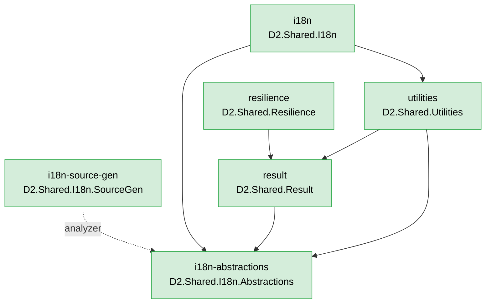

<!--
Copyright (c) DCSV. All rights reserved.
-->

# server/shared/dotnet/ — Shared .NET Libraries

Foundational libraries consumed by every D²-WORX .NET service.

Per project convention, every library has its own `README.md`. The list below points at each lib's local README. **Status** column indicates whether the lib is built (csproj + sources) or still a placeholder shell.

## Libraries

| Lib | Status | Purpose | Reference |
|---|---|---|---|
| [`result/`](result/README.md) | **Built** | `D2Result<T>` — errors-as-values, semantic factories, partial-success ladder, `BubbleFail` propagation, auto-injected `traceId`. `Messages` / `InputErrors` are typed as `IReadOnlyList<TKMessage>` (compile-time enforcement: every user-facing message is a translation key). | [PATTERNS.md](../../../docs/PATTERNS.md) D2Result section |
| [`utilities/`](utilities/README.md) | **Built** | `Truthy()` / `Falsey()` / `ToNullIfEmpty()` / `CleanStr()` + `TryParseEmail()` / `TryParsePhoneNumber()` (return `D2Result<string>` for smart-constructor chaining), `[RedactData]` attribute, `D2Env`, `ConnectionStringHelper`, `SerializerOptions`. | [PATTERNS.md](../../../docs/PATTERNS.md) Utilities section |
| [`resilience/`](resilience/README.md) | **Built** | `RetryHelper` (with `D2Result`-aware overload), `CircuitBreaker<T>`, `Singleflight<TKey, TValue>`, and the `ResilientPipeline<TKey, TValue>` composition surface. | [PATTERNS.md](../../../docs/PATTERNS.md) Resilience section |
| [`i18n-abstractions/`](i18n-abstractions/README.md) | **Built** | Domain-safe slice — `TKMessage` primitive, SrcGen-emitted `TK` constants from `contracts/messages/en-US.json`, `ITranslator` interface. Zero external deps. Drift between JSON and TK code constants is structurally impossible (the constant doesn't exist if the JSON key doesn't). | [PATTERNS.md](../../../docs/PATTERNS.md) i18n section |
| [`i18n-source-gen/`](i18n-source-gen/) | **Built** | Roslyn `IIncrementalGenerator` (netstandard2.0) that emits the `TK.*` constants consumed by `i18n-abstractions/`. Referenced as Analyzer; its dll never ships into any consuming assembly. Lives at its own top-level slot because it has a different TFM and a different consumption pattern from a normal lib. | [PATTERNS.md](../../../docs/PATTERNS.md) i18n section |
| [`i18n/`](i18n/README.md) | **Built** | Runtime `Translator` + `SupportedLocales` + `AddD2I18n` DI extension. Used by Courier-style outbound notifications; HTTP responses ship `TKMessage` objects unchanged for client-side translation via SvelteKit/Paraglide. | [PATTERNS.md](../../../docs/PATTERNS.md) i18n section |
| [`tests/`](tests/README.md) | **Built** | Test infrastructure for ALL shared libs (deliberately one project — overkill to spin up a separate test csproj for every lightweight lib). | [TESTS.md](../../../docs/TESTS.md) |
| [`handler/`](handler/README.md) | Placeholder | `BaseHandler<TSelf, TInput, TOutput>` — OTel spans + 4 metrics + `[RedactData]` integration. The pattern every handler in every service inherits. | [PATTERNS.md](../../../docs/PATTERNS.md) Handler section |
| [`service-defaults/`](service-defaults/README.md) | Placeholder | Service composition root — OTel SDK bootstrap, Serilog setup, structured request logging, `[RedactData]` destructuring policy registration. | [PATTERNS.md](../../../docs/PATTERNS.md) (RedactDataDestructuringPolicy mechanics) |
| [`caching-local-abstractions/`](caching-local-abstractions/README.md) | Placeholder | Domain-safe slice — `ID2LocalCache` interface + `LocalCacheOptions`. Zero external deps. | [PATTERNS.md](../../../docs/PATTERNS.md) Cache section |
| [`caching-local-default/`](caching-local-default/README.md) | Placeholder | Default in-memory implementation of `ID2LocalCache` — lazy TTL + always-on LRU + max 10K default. Per-instance only. | [PATTERNS.md](../../../docs/PATTERNS.md) Cache section |
| [`caching-distributed-abstractions/`](caching-distributed-abstractions/README.md) | Placeholder | Domain-safe slice — `ID2DistributedCache` interface + `ICacheSerializer` + `DistributedCacheOptions`. Includes the atomic `SetNx` / `Increment` / `AcquireLock` semantic surface that distinguishes distributed from local. Zero external deps. | [PATTERNS.md](../../../docs/PATTERNS.md) Cache section |
| [`caching-distributed-redis/`](caching-distributed-redis/README.md) | Placeholder | Redis-backed implementation of `ID2DistributedCache`. Future implementations (Valkey, Memcached, Garnet) would land as sibling `caching-distributed-{impl}/` projects. | [PATTERNS.md](../../../docs/PATTERNS.md) Cache section |
| [`messaging/`](messaging/README.md) | Placeholder | RabbitMQ wrapper — proto-canonical-JSON serialization, `[Encrypted(Domain.X)]` attribute integration with `D2.Shared.Encryption`, AMQP headers contract. | [MESSAGING.md](../../../docs/MESSAGING.md) |
| [`encryption/`](encryption/README.md) | Placeholder | `PayloadCryptoKeyring` (JWKS-style multi-key), `IPayloadCrypto` (AES-256-GCM), frame format. Consumes the keyring from `KeyringClient` (auth lib) at runtime. | [SECURITY-RUNBOOKS.md](../../../docs/SECURITY-RUNBOOKS.md) |
| [`geo-reference/`](geo-reference/README.md) | Placeholder | Embedded geographic reference data — countries, IANA timezones, currencies, locales, regions. Not a service. | — |
| [`location/`](location/README.md) | Placeholder | Location value objects — `AdminLocation` (country / state / city / postal), `Coordinates`, `StreetAddress`. Content-addressable hash IDs (built-in dedup + cacheability). | [OPERATIONAL-GUARANTEES.md](../../../docs/OPERATIONAL-GUARANTEES.md) (content-addressable entities) |
| [`contacts/`](contacts/README.md) | Placeholder | Contact entity + per-consuming-service DB pattern. Library owns its own `DbContext` + migrations; consuming service provides connection string. | [OPERATIONAL-GUARANTEES.md](../../../docs/OPERATIONAL-GUARANTEES.md) (immutability rationale) |
| [`auth/`](auth/README.md) | Placeholder | `Scopes` constants, JWT claim helpers, token primitives, `KeyringClient` (consumes Edge KeyCustodian). | [SECURITY-RUNBOOKS.md](../../../docs/SECURITY-RUNBOOKS.md) |

## Dependency graph (built libs only)

The chart below shows the actual `<ProjectReference>` graph of the libraries that are currently **Built** (per the table above). Placeholders are not shown — the shape of their deps will evolve as they're implemented. Update this chart as part of adding / modifying any shared lib (per CLAUDE.md §5).

The `tests/` project is omitted because it depends on every shared lib (test infra) and nothing depends on it — including it would clutter the chart without showing any structural information.



Solid arrows are `<ProjectReference>` (runtime dep). Dashed arrows are `OutputItemType="Analyzer"` (build-time-only; no runtime dll dependency).

## Conventions

- **Folder naming**: lowercase outer (`handler/`, `caching-distributed-redis/`)
- **Project naming**: PascalCase dot-separated (`D2.Shared.Handler.csproj` lives in `handler/`)
- **One handler per file** under `Handlers/{TLC}/{3LC}/` per [PATTERNS.md](../../../docs/PATTERNS.md) TLC convention
- **Every project has a `README.md`** per CLAUDE.md §6 documentation rule
- **Update the dep graph above** when adding / removing a shared lib or changing its `<ProjectReference>` set

## Build

```bash
dotnet build server/D2.slnx        # full solution (includes all shared libs + services)
```

Each lib registers its DI surface via an `AddXxx(IServiceCollection)` extension method — consuming services compose them at the composition root.
