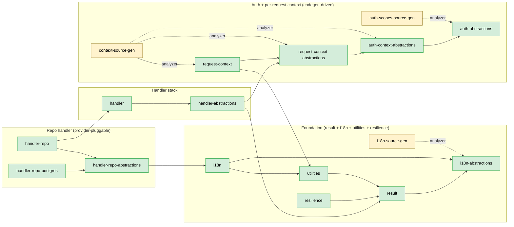

<!--
Copyright (c) DCSV. All rights reserved.
-->

# server/shared/dotnet/ — Shared .NET Libraries

> Parent: [`server/shared/`](../README.md)

Foundational libraries consumed by every D²-WORX .NET service.

Per project convention, every library has its own `README.md`. The list below points at each lib's local README. **Status** column indicates whether the lib is built (csproj + sources) or still a placeholder shell (folder + README only — implementation lands as the consuming services need it).

## Libraries

| Lib | Status | Purpose | Reference |
|---|---|---|---|
| [`result/`](result/README.md) | **Built** | `D2Result<T>` — errors-as-values, semantic factories, partial-success ladder, `BubbleFail` propagation, auto-injected `traceId`. `Messages` / `InputErrors` are typed as `IReadOnlyList<TKMessage>` (compile-time enforcement: every user-facing message is a translation key). | [PATTERNS.md](../../../docs/PATTERNS.md) D2Result section |
| [`utilities/`](utilities/README.md) | **Built** | `Truthy()` / `Falsey()` / `ToNullIfEmpty()` / `CleanStr()` + `TryParseEmail()` / `TryParsePhoneNumber()` (return `D2Result<string>` for smart-constructor chaining), `[RedactData]` attribute, `D2Env`, `ConnectionStringHelper`, `SerializerOptions`. | [PATTERNS.md](../../../docs/PATTERNS.md) Utilities section |
| [`resilience/`](resilience/README.md) | **Built** | `RetryHelper` (with `D2Result`-aware overload), `CircuitBreaker<T>`, `Singleflight<TKey, TValue>`, and the `ResilientPipeline<TKey, TValue>` composition surface. | [PATTERNS.md](../../../docs/PATTERNS.md) Resilience section |
| [`i18n-abstractions/`](i18n-abstractions/README.md) | **Built** | Domain-safe slice — `TKMessage` primitive, SrcGen-emitted `TK` constants from `contracts/messages/en-US.json`, `ITranslator` interface. Zero external deps. Drift between JSON and TK code constants is structurally impossible (the constant doesn't exist if the JSON key doesn't). | [PATTERNS.md](../../../docs/PATTERNS.md) i18n section |
| [`i18n-source-gen/`](i18n-source-gen/) | **Built** | Roslyn `IIncrementalGenerator` (netstandard2.0) that emits the `TK.*` constants consumed by `i18n-abstractions/`. Referenced as Analyzer; its dll never ships into any consuming assembly. Lives at its own top-level slot because it has a different TFM and a different consumption pattern from a normal lib. | [PATTERNS.md](../../../docs/PATTERNS.md) i18n section |
| [`i18n/`](i18n/README.md) | **Built** | Runtime `Translator` + `SupportedLocales` + `AddD2I18n` DI extension. Used by Courier-style outbound notifications; HTTP responses ship `TKMessage` objects unchanged for client-side translation via SvelteKit/Paraglide. | [PATTERNS.md](../../../docs/PATTERNS.md) i18n section |
| [`auth-abstractions/`](auth-abstractions/README.md) | **Built** | Identity / authorization vocabulary — `OrgType`, `Role`, `ActorKind`, `ImpersonationKind`, `ActionSensitivity`, `JwtClaimTypes`, `RequestHeaders`, `ActorEntry`, plus the SrcGen-emitted `Scopes` static partial class. Zero external deps; consumed by domain code, request-context, handler-abstractions, and the eventual runtime auth lib. | [PATTERNS.md](../../../docs/PATTERNS.md) Scopes / authorization section |
| [`auth-scopes-source-gen/`](auth-scopes-source-gen/) | **Built** | Roslyn `IIncrementalGenerator` (netstandard2.0) that emits the `Scopes.*` constants for `auth-abstractions/` from `contracts/auth-scopes/scopes.spec.json`. Referenced as Analyzer; its dll never ships into any consuming assembly. | [PATTERNS.md](../../../docs/PATTERNS.md) Scopes / authorization section |
| [`auth-context-abstractions/`](auth-context-abstractions/README.md) | **Built** | Domain-safe slice of the request context — `IAuthContext` (codegen-emitted from `contracts/auth-context/IAuthContext.spec.json`) plus hand-written `IAuthContextExtensions` (`HasScope`, `IsStaff`, etc.). Lets domain code read caller identity / scopes / impersonation without pulling DI / AspNetCore / Configuration. | [PATTERNS.md](../../../docs/PATTERNS.md) Context section |
| [`context-source-gen/`](context-source-gen/) | **Built** | Roslyn `IIncrementalGenerator` (netstandard2.0) that emits `IAuthContext` + `IRequestContext` interfaces and the `MutableRequestContext` / `ContextEnvelope` concretes from the context spec JSON. Per-assembly dispatch — referenced as Analyzer by `auth-context-abstractions/`, `request-context-abstractions/`, and `request-context/`. | [PATTERNS.md](../../../docs/PATTERNS.md) Context section |
| [`request-context-abstractions/`](request-context-abstractions/README.md) | **Built** | Per-request runtime context interface — `IRequestContext` (codegen-emitted) extends `IAuthContext` with transport + network + fingerprint + WhoIs sections. Read-only contract that handlers and middleware consume. | [PATTERNS.md](../../../docs/PATTERNS.md) Context section |
| [`request-context/`](request-context/README.md) | **Built** | Runtime concretes — `MutableRequestContext` (codegen-emitted), `ContextEnvelope` cross-transport record, plus hand-written `ActorChainParser` (RFC 8693 §2.1 nested actor chain, depth-limited, strict-mode) and `ScopeClaimParser` (RFC 6749 §3.3 scope string OR JSON array). Transport-specific filling extensions live in their respective handler libs. | [PATTERNS.md](../../../docs/PATTERNS.md) Context section |
| [`handler-abstractions/`](handler-abstractions/README.md) | **Built** | Domain-safe slice of the handler stack — `IHandler` / `IHandlerContext` interfaces + the `HandlerOptions` record. Lets domain code reference handler contracts without pulling DI / OpenTelemetry / AspNetCore. | [PATTERNS.md](../../../docs/PATTERNS.md) Handler section |
| [`handler/`](handler/README.md) | **Built** | `BaseHandler<TSelf, TInput, TOutput>` + `HandlerContext` + `HandlerTelemetry` + `AddD2Handler` — the runtime piece every handler in every service inherits (CQRS handlers, repo handlers, messaging consumers, scheduled jobs). Auto-emits 4 OTel metrics per call (invoked / succeeded / failed / duration_ms) plus a per-call span via `ActivitySource`. Universal try/catch shape: `ExecuteAsync` exceptions surface as `D2Result.UnhandledException`; `OperationCanceledException` surfaces as `D2Result.Canceled`. `RunCorePipelineAsync` exposes the captured exception so `BaseRepoHandler` can remap EF/PG-specific exceptions to typed `D2Result` failure codes. | [PATTERNS.md](../../../docs/PATTERNS.md) Handler section |
| [`handler-repo-abstractions/`](handler-repo-abstractions/README.md) | **Built** | Vocabulary for repo-flavored handlers — `DbFailureKind` enum + `IDbExceptionClassifier` interface, plus `D2Result` extension factories (`UniqueViolation()`, `IsDeadlock`, etc.) parallel to the built-in semantic factories on `result/`. Pure abstractions: no EF Core, no Npgsql, no provider deps. | [PATTERNS.md](../../../docs/PATTERNS.md) Repository section |
| [`handler-repo/`](handler-repo/README.md) | **Built** | EF-flavored `BaseRepoHandler` — sits on top of `BaseHandler` and converts captured exceptions into typed `D2Result` failures via an injected `IDbExceptionClassifier`. Provider-specific knowledge lives in sibling packages (`handler-repo-postgres/`, future `handler-repo-sqlserver/`, etc.) — this csproj has zero provider deps. | [PATTERNS.md](../../../docs/PATTERNS.md) Repository section |
| [`handler-repo-postgres/`](handler-repo-postgres/README.md) | **Built** | PostgreSQL implementation of `IDbExceptionClassifier`. Plugs into `BaseRepoHandler` via DI (`services.AddD2Postgres()`). Owns the SQLSTATE matrix + the wrapping rules for `DbUpdateException` ↔ `PostgresException` ↔ raw `NpgsqlException`. | [PATTERNS.md](../../../docs/PATTERNS.md) Repository section |
| [`tests/`](tests/README.md) | **Built** | Test infrastructure for ALL shared libs (deliberately one project — overkill to spin up a separate test csproj for every lightweight lib). | [TESTS.md](../../../docs/TESTS.md) |
| [`service-defaults/`](service-defaults/README.md) | Placeholder | Service composition root — OTel SDK bootstrap, Serilog setup, structured request logging, `[RedactData]` destructuring policy registration. | [PATTERNS.md](../../../docs/PATTERNS.md) (RedactDataDestructuringPolicy mechanics) |
| [`caching-local-abstractions/`](caching-local-abstractions/README.md) | Placeholder | Domain-safe slice — `ID2LocalCache` interface + `LocalCacheOptions`. Zero external deps. | [PATTERNS.md](../../../docs/PATTERNS.md) Cache section |
| [`caching-local-default/`](caching-local-default/README.md) | Placeholder | Default in-memory implementation of `ID2LocalCache` — lazy TTL + always-on LRU + max 10K default. Per-instance only. | [PATTERNS.md](../../../docs/PATTERNS.md) Cache section |
| [`caching-distributed-abstractions/`](caching-distributed-abstractions/README.md) | Placeholder | Domain-safe slice — `ID2DistributedCache` interface + `ICacheSerializer` + `DistributedCacheOptions`. Includes the atomic `SetNx` / `Increment` / `AcquireLock` semantic surface that distinguishes distributed from local. Zero external deps. | [PATTERNS.md](../../../docs/PATTERNS.md) Cache section |
| [`caching-distributed-redis/`](caching-distributed-redis/README.md) | Placeholder | Redis-backed implementation of `ID2DistributedCache`. Future implementations (Valkey, Memcached, Garnet) would land as sibling `caching-distributed-{impl}/` projects. | [PATTERNS.md](../../../docs/PATTERNS.md) Cache section |
| [`messaging/`](messaging/README.md) | Placeholder | RabbitMQ wrapper — proto-canonical-JSON serialization, `[Encrypted(Domain.X)]` attribute integration with `D2.Shared.Encryption`, AMQP headers contract. | [MESSAGING.md](../../../docs/MESSAGING.md) |
| [`encryption/`](encryption/README.md) | Placeholder | `PayloadCryptoKeyring` (JWKS-style multi-key), `IPayloadCrypto` (AES-256-GCM), frame format. Consumes the keyring from `KeyringClient` (auth lib) at runtime. | [SECURITY-RUNBOOKS.md](../../../docs/SECURITY-RUNBOOKS.md) |
| [`geo-reference/`](geo-reference/README.md) | Placeholder | Embedded geographic reference data — countries, IANA timezones, currencies, locales, regions. Not a service. | — |
| [`location/`](location/README.md) | Placeholder | Location value objects — `AdminLocation` (country / state / city / postal), `Coordinates`, `StreetAddress`. Content-addressable hash IDs (built-in dedup + cacheability). | [OPERATIONAL-GUARANTEES.md](../../../docs/OPERATIONAL-GUARANTEES.md) (content-addressable entities) |
| [`contacts/`](contacts/README.md) | Placeholder | Contact entity + per-consuming-service DB pattern. Library owns its own `DbContext` + migrations; consuming service provides connection string. | [OPERATIONAL-GUARANTEES.md](../../../docs/OPERATIONAL-GUARANTEES.md) (immutability rationale) |
| [`auth/`](auth/README.md) | Placeholder | Runtime auth surface — JWT claim helpers, token primitives, `KeyringClient` (consumes the Edge KeyCustodian). The vocabulary slice (`Scopes` constants, enums, claim type strings) already ships in `auth-abstractions/`. | [SECURITY-RUNBOOKS.md](../../../docs/SECURITY-RUNBOOKS.md) |

## Dependency graph (built libs only)

The chart below shows the actual `<ProjectReference>` graph of the libraries currently marked **Built**. Placeholders are not shown — the shape of their deps will evolve as they're implemented. Update this chart as part of adding / modifying any shared lib.

The `tests/` project is omitted because it depends on every shared lib (test infra) and nothing depends on it — including it would clutter the chart without showing any structural information.

The chart is sliced into four subgraphs that mirror the layering rules. Within each subgraph, dependencies flow downward; cross-subgraph arrows go LEFT-to-RIGHT (foundation → context → handler → repo). To minimize crossings, only one direct cross-cluster arrow per pair is shown when a transitive path through a same-cluster intermediate exists; the prose under the chart calls out the load-bearing redirects.



**Reading the chart:**

- **Solid arrows = `<ProjectReference>`** (runtime dep). **Dashed arrows = `OutputItemType="Analyzer"`** (build-time only — the analyzer dll never ships in the consumer's `bin/`).
- **Yellow nodes = analyzers** (i18n / auth-scopes / context source generators). They emit code into the consuming assembly at compile time.
- **Green nodes = runtime libs.**
- **`tests/` is omitted** — it depends on every shared lib (test infra) and nothing depends on it; including it would clutter the chart without showing any structural information.

**Why some arrows are not drawn explicitly:** several csprojs add direct `<ProjectReference>`s that are also reachable transitively through an intra-subgraph hop. To keep the chart legible, those redundant edges are hidden — the live deps still exist in the csprojs:

- `request-context` directly refs `auth-context-abstractions`, `auth-abstractions` (transitive via `request-context-abstractions`)
- `handler` directly refs `request-context-abstractions`, `result` (transitive via `handler-abstractions`)
- `handler-repo` directly refs `handler-abstractions`, `result` (transitive via `handler` and `handler-repo-abstractions`)
- `handler-repo-abstractions` directly refs `result` (transitive via `i18n`)

The five cross-subgraph arrows that ARE drawn capture every load-bearing inter-cluster dep:

- `request-context → utilities` — uses `Falsey` / `TryParseTruthyNull` extensions in the parsers
- `handler-abstractions → request-context-abstractions` — `IHandlerContext` exposes `IRequestContext`
- `handler-abstractions → result` — `IHandler.HandleAsync` returns `D2Result<TOutput?>`
- `handler-repo → handler` — `BaseRepoHandler` extends `BaseHandler`
- `handler-repo-abstractions → i18n` — typed `D2Result.X()` factories use `TK.Common.Errors.*` for default messages

## Conventions

- **Folder naming**: lowercase outer (`handler/`, `caching-distributed-redis/`)
- **Project naming**: PascalCase dot-separated (`D2.Shared.Handler.csproj` lives in `handler/`)
- **One handler per file** under `Handlers/{TLC}/{3LC}/` per [PATTERNS.md](../../../docs/PATTERNS.md) TLC convention
- **Every project has a `README.md`**
- **Update the dep graph above** when adding / removing a shared lib or changing its `<ProjectReference>` set
- **Abstractions slices stay zero-external-dep** so domain code can reference them freely. Runtime concretes (DI, OTel, EF, ASP.NET Core) live in sibling non-`-abstractions` packages.

## Build

```bash
dotnet build server/D2.slnx        # full solution (includes all shared libs + services)
```

Each lib registers its DI surface via an `AddXxx(IServiceCollection)` extension method — consuming services compose them at the composition root.
