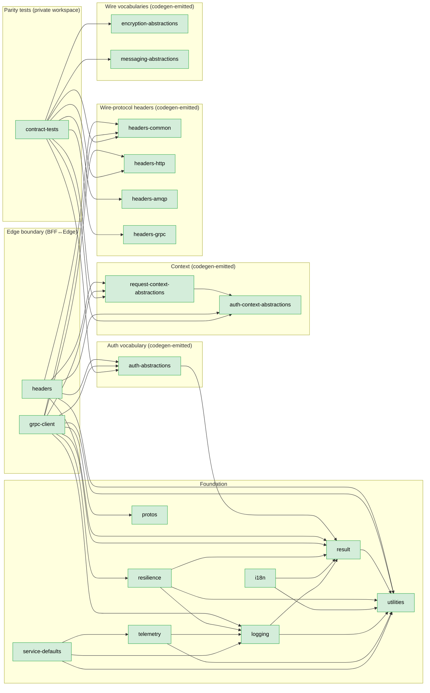

<!--
Copyright (c) DCSV. All rights reserved.
-->

# server/shared/typescript/ — Shared TypeScript Libraries

> Parent: [`server/shared/`](../README.md)

Shared TypeScript libraries consumed by SvelteKit BFF and any future Node frontend. Most catalogs are codegen-emitted from the same `contracts/` specs that drive the .NET shared libraries — cross-language drift is structurally impossible.

Each package owns its own `README.md` describing its public API, codegen workflow, and dependencies. Generated files (`*.g.ts`) are committed to git and refreshed on every `pnpm -r build` via per-package `prebuild` hooks.

## Packages

| Package                                                          | Status    | Purpose                                                                                                                                                         | .NET mirror                                                                                |
| ---------------------------------------------------------------- | --------- | --------------------------------------------------------------------------------------------------------------------------------------------------------------- | ------------------------------------------------------------------------------------------ |
| [`result/`](result/)                                             | **Built** | `D2Result<T>` shape — errors-as-values, semantic factories, partial-success ladder.                                                                             | `D2.Shared.Result`                                                                         |
| [`utilities/`](utilities/)                                       | **Built** | `falsey()` / `truthy()` / `tryParseTruthyNull()` / `cleanStr()` and friends.                                                                                    | `D2.Shared.Utilities`                                                                      |
| [`resilience/`](resilience/)                                     | **Built** | Retry, circuit breaker, single-flight wrappers (Polly-equivalent).                                                                                              | `D2.Shared.Resilience`                                                                     |
| [`i18n/`](i18n/)                                                 | **Built** | Paraglide-2.x consumer surface; reads `contracts/messages/{locale}.json`.                                                                                       | `D2.Shared.I18n`                                                                           |
| [`logging/`](logging/)                                           | **Built** | Pino + `ILogger` interface mirroring the .NET shape.                                                                                                            | `D2.Shared.Logging`                                                                        |
| [`telemetry/`](telemetry/)                                       | **Built** | OTLP-over-HTTP setup helper.                                                                                                                                    | `D2.Shared.Telemetry`                                                                      |
| [`service-defaults/`](service-defaults/)                         | **Built** | One-call `setupTelemetry()` bootstrap.                                                                                                                          | `D2.Shared.ServiceDefaults`                                                                |
| [`protos/`](protos/)                                             | **Built** | Buf + `ts-proto` generated types and gRPC stubs from `contracts/protos/`.                                                                                       | `D2.Shared.Protos`                                                                         |
| [`auth-context-abstractions/`](auth-context-abstractions/)       | **Built** | `IAuthContext` interface (codegen from `contracts/auth-context/IAuthContext.spec.json`).                                                                        | `D2.Shared.AuthContext.Abstractions`                                                       |
| [`request-context-abstractions/`](request-context-abstractions/) | **Built** | `IRequestContext` (extends `IAuthContext`) + 1:1 `PropagatedContextSerializer` class (codegen from the request-context spec).                                   | `D2.Shared.RequestContext.Abstractions` + `D2.Shared.Context.Abstractions`                 |
| [`auth-abstractions/`](auth-abstractions/)                       | **Built** | Codegen-emitted `Scopes` / `AuthErrorCodes` / `AuthFailures` / `JwtClaimTypes` catalogs.                                                                        | `D2.Shared.Auth.Abstractions` + `D2.Shared.Auth.Errors` consolidated                       |
| [`headers-common/`](headers-common/)                             | **Built** | Cross-transport wire-protocol headers (`PROPAGATED_CONTEXT`, `TRACEPARENT`, `TRACESTATE`, `AUTHORIZATION`). Codegen from `contracts/headers/headers.spec.json`. | `D2.Shared.Headers.Common`                                                                 |
| [`headers-http/`](headers-http/)                                 | **Built** | HTTP-applicable wire-protocol headers (HTTP-only entries + cross-transport entries inline). Codegen from the headers spec.                                      | `D2.Shared.Headers.Http`                                                                   |
| [`headers-amqp/`](headers-amqp/)                                 | **Built** | AMQP-applicable wire-protocol headers (AMQP-only entries + cross-transport entries inline). Codegen from the headers spec.                                      | `D2.Shared.Headers.Amqp`                                                                   |
| [`headers-grpc/`](headers-grpc/)                                 | **Built** | gRPC-applicable wire-protocol headers. Codegen from the headers spec.                                                                                           | `D2.Shared.Headers.Grpc`                                                                   |
| [`headers/`](headers/)                                           | **Built** | SvelteKit BFF-side glue: JWT claim decode, `x-d2-context` decode, RFC 7807 ProblemDetails builder, 5 server-side guards.                                        | NEW — no .NET counterpart                                                                  |
| [`grpc-client/`](grpc-client/)                                   | **Built** | Singleton-per-process gRPC channel from BFF to Edge with internal-token + context-propagation interceptors. Also exports the codegen-emitted `D2GrpcTrailers` catalog (mirrors .NET `D2.Shared.Auth.Grpc.Status.D2GrpcTrailers`) for consumer-side trailer-key reads.                | Conceptually parallels `services.AddGrpcClient<T>()` + `IServiceIdentityClient` plus `D2.Shared.Auth.Grpc.Status.D2GrpcTrailers`            |
| [`encryption-abstractions/`](encryption-abstractions/)           | **Built** | Codegen-emitted `EncryptionDomains` (closed-enum keyring-domain identifiers) + `EncryptionFrame` (binary-layout field-offset + byte-length constants). Exposes the catalog so any TS reader (ops tooling, encryption pipelines, on-wire frame consumers) shares byte-equal identifiers with the .NET encoder. | `D2.Shared.Encryption.EncryptionDomains` + `D2.Shared.Encryption.EncryptionFrameLayout` |
| [`messaging-abstractions/`](messaging-abstractions/)             | **Built** | Codegen-emitted DLQ failure-metadata wire-shape catalogs — `DlqFailureMetadataFields` (6 JSON property names) + `DlqFailureCauses` (5 closed-enum cause strings). Exposes the catalog so any TS reader (DLQ ops tooling, RabbitMQ subscribers) shares byte-equal identifiers with the .NET producers. | `D2.Shared.Messaging.DlqFailureMetadataFields` + `D2.Shared.Messaging.RabbitMq.Subscribing.DlqFailureCauses` |
| [`contract-tests/`](contract-tests/)                             | **Built** | Cross-language parity test workspace — Vitest reads fixtures emitted by `D2.Shared.Tests` and asserts TS-side spec-emitted decoders / catalogs agree.           | NEW — no .NET counterpart (consumes fixtures emitted from `Integration/ContractFixtures/`) |

## Dependency graph

The chart below shows the workspace `package.json` dep graph (runtime `dependencies` only — devDeps are workspace-wide pins).



**Reading the chart**

- All Foundation, Context, Auth-vocabulary, Headers, and Wire-vocabulary packages are **codegen-emit-only** for their wire constants OR pure runtime helpers — none has internal sub-libraries.
- The 4 `headers-*` packages have ZERO runtime deps (pure constants); the analyzer is `tools/ts-codegen/src/headers-emit.ts`.
- `auth-abstractions` has one runtime dep (`@d2/result` — the `D2Result` shape returned by `AuthFailures.*` factories).
- `request-context-abstractions` re-exports types from `auth-context-abstractions` + ships the 1:1 `PropagatedContextSerializer` class from the same spec the .NET side uses.
- The `WIRE` subgraph holds the 2 cross-language wire-vocabulary packages — `@d2/encryption-abstractions` (codegen `EncryptionDomains` closed-enum + `EncryptionFrame` binary-layout constants exposed for ops tooling and any TS reader of the on-wire encryption frame) and `@d2/messaging-abstractions` (codegen `DlqFailureMetadataFields` JSON property-name catalog + `DlqFailureCauses` closed-enum exposed for DLQ ops tooling and any TS RabbitMQ subscriber). Both are pure-constant packages with zero runtime deps.
- The `BOUNDARY` subgraph holds the 2 SvelteKit BFF↔Edge glue packages — `@d2/headers` consumes the Auth/Context/Headers catalogs to populate `event.locals.requestContext` from the inbound `Authorization` JWT + `x-d2-context` envelope; `@d2/grpc-client` mirrors `services.AddGrpcClient<T>()` semantics with internal-token + context-propagation interceptors.
- The `PARITY` subgraph holds the `@d2/contract-tests` private workspace package — Vitest tests read fixtures emitted by `D2.Shared.Tests` `Integration/ContractFixtures/` and assert TS-side spec-emitted catalogs / decoders agree byte-for-byte. Runs via `pnpm test:contracts` from the repo root.

## Codegen workflow

Each codegen-driven package has a `prebuild` script in its `package.json` invoking the appropriate `tools/ts-codegen/src/*-emit.ts` script. `pnpm -r build` runs every `prebuild` before `tsc -b`, so `*.g.ts` outputs are always current. Generated files are committed to git so `pnpm install` + `pnpm exec tsc -b` works in any clean checkout (no separate codegen step required).

The single source of truth for every spec-driven catalog is the matching `contracts/<topic>/` JSON spec — same spec drives the .NET SourceGen too. Constant catalogs that cross language boundaries are codegen-emitted from a single spec, never hand-mirrored — drift is structurally impossible.

## Conventions

- **Folder naming**: lowercase outer (`headers-http/`, `auth-abstractions/`).
- **Package naming**: `@d2/<folder>` (e.g. `@d2/headers-http`).
- **Every package has a `README.md`** describing its public API + codegen workflow + dependencies.
- **Every codegen-emitted package excludes `*.g.ts` from coverage thresholds** in `vitest.config.ts` — coverage is provided by per-VALUE pin tests in the package + emitter snapshot tests in `tools/ts-codegen/`.
- **All packages are `private: true`** — no npm publish; broader OSS discussion deferred per the deliverable 0006 locked decisions.

## Build

```bash
pnpm install                         # install workspace deps (lockfile-pinned)
pnpm -r --filter "./server/shared/typescript/*" --filter "./tools/ts-codegen" run build   # builds + runs prebuild codegen
pnpm -r --filter "./server/shared/typescript/*" --filter "./tools/ts-codegen" run test    # runs vitest in every package
```
